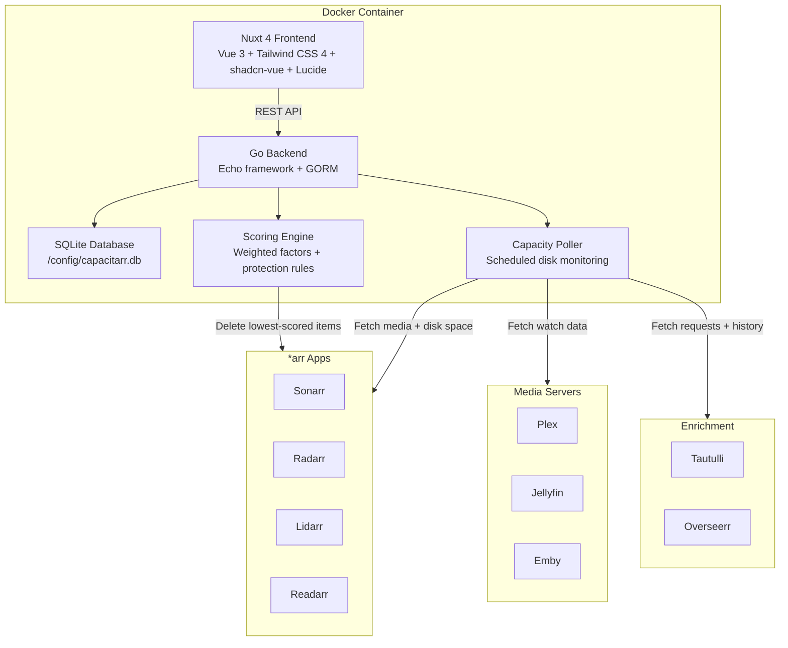

# Capacitarr

[](https://gitlab.com/starshadow/software/capacitarr/container_registry)

**Intelligent media library capacity manager for the *arr ecosystem.**

Capacitarr integrates with your *arr apps, media servers, and request managers to automatically manage disk capacity. When disk space runs low, it scores every media item across multiple dimensions — watch history, recency, file size, ratings, age, and availability — then removes the least-valuable items first. A visual rule builder lets you protect specific content from ever being deleted.

## Features

- **Intelligent Scoring Engine** — Six weighted factors rank every media item for deletion priority
- **Cascading Rule Builder** — Visual rule builder with `always_keep`, `prefer_keep`, `prefer_delete`, and `always_delete` actions
- **Multi-Integration Support** — Connects to Sonarr, Radarr, Lidarr, Readarr, Plex, Jellyfin, Emby, Overseerr, and Tautulli
- **Disk Group Monitoring** — Tracks capacity across multiple disk groups with configurable thresholds
- **Score Transparency** — Full per-item score breakdowns showing each factor's contribution
- **Audit Trail** — Complete history of every engine action (deletions, evaluations, errors)
- **Themeable UI** — Light/dark mode with customizable accent colors
- **Reverse Proxy Ready** — Subdirectory deployments, proxy authentication (Authelia, Authentik, Organizr)
- **Single Container** — Go backend + Nuxt 4 frontend + SQLite database in one Docker image
- **PUID/PGID Support** — Runs as any user/group for proper volume permissions

## Quick Start (Docker Compose)

Create a `docker-compose.yml` file:

```yaml
services:
  capacitarr:
    image: registry.gitlab.com/starshadow/software/capacitarr:latest
    container_name: capacitarr
    ports:
      - "2187:2187"
    environment:
      - PUID=1000
      - PGID=1000
      - JWT_SECRET=change-me-to-a-random-string
    volumes:
      - capacitarr-config:/config
    healthcheck:
      test: ["CMD", "curl", "-f", "http://localhost:2187/api/v1/health"]
      interval: 30s
      timeout: 5s
      start_period: 15s
      retries: 3
    restart: unless-stopped

volumes:
  capacitarr-config:
```

Start the container:

```bash
docker compose up -d
```

Open `http://localhost:2187` in your browser. On first launch, you will be prompted to create an admin account.

## Configuration

All configuration is done via environment variables. Every variable is optional — sensible defaults are used when not set.

| Variable | Default | Description |
|----------|---------|-------------|
| `PORT` | `2187` | HTTP listen port |
| `BASE_URL` | `/` | Base URL path for subdirectory reverse proxy deployments |
| `DB_PATH` | `/config/capacitarr.db` | SQLite database file path |
| `DEBUG` | `false` | Enable debug logging and permissive CORS |
| `JWT_SECRET` | *(auto-generated)* | Secret for signing JWT tokens. Set for persistent sessions across restarts |
| `SECURE_COOKIES` | `false` | Enable the `Secure` flag on cookies (set `true` for HTTPS) |
| `AUTH_HEADER` | *(none)* | Trusted reverse proxy auth header (e.g. `Remote-User`, `X-authentik-username`) |
| `CORS_ORIGINS` | *(none)* | Comma-separated allowed CORS origins |
| `PUID` | `1000` | User ID for the container process *(Docker only)* |
| `PGID` | `1000` | Group ID for the container process *(Docker only)* |

> **⚠️ AUTH_HEADER Security:** Only enable `AUTH_HEADER` when Capacitarr is exclusively accessible through your reverse proxy. If the server is directly reachable, any client can forge this header and bypass authentication.

For the complete configuration reference including subdirectory deployment and proxy authentication examples, see the [Configuration Guide](docs/configuration.md).

## Supported Integrations

### *arr Apps (Library Managers)

| Service | Type | Capabilities |
|---------|------|-------------|
| **Sonarr** | TV Shows | Disk space, media items, quality profiles, tags, deletion |
| **Radarr** | Movies | Disk space, media items, quality profiles, tags, deletion |
| **Lidarr** | Music | Disk space, media items, quality profiles, tags, deletion |
| **Readarr** | Books | Disk space, media items, quality profiles, tags, deletion |

### Media Servers (Watch Data)

| Service | Capabilities |
|---------|-------------|
| **Plex** | Play count, last played date, library metadata |
| **Jellyfin** | Play count, last played date, library metadata |
| **Emby** | Play count, last played date, library metadata |

### Enrichment Services

| Service | Capabilities |
|---------|-------------|
| **Tautulli** | Detailed play history and watch statistics for Plex |
| **Overseerr** | Request status, requester info, request counts |

## Architecture Overview

Capacitarr is a single-container application that bundles a Go backend, a Nuxt 4 (Vue 3) frontend, and a SQLite database. The frontend is statically generated at build time and embedded into the Go binary via `go:embed`, producing a single self-contained executable.



| Layer | Technology | Purpose |
|-------|-----------|---------|
| **Frontend** | Nuxt 4, Vue 3, Tailwind CSS 4, shadcn-vue, Lucide, ApexCharts | Dashboard UI, rule builder, score visualization |
| **Backend** | Go, Echo, GORM | REST API, authentication, integration clients, scheduling |
| **Database** | SQLite | Configuration, audit logs, engine statistics |
| **Container** | Alpine Linux, multi-stage Docker build | Minimal runtime image (~30 MB) |

## Scoring Algorithm

Capacitarr uses a two-layer system to decide which items to remove:

1. **Preference-based scoring** — Each item is scored across six weighted factors (0–10 weight per factor). Higher score = more likely to be deleted.
2. **Protection rules** — Override scores with `always_keep`, `prefer_keep`, `prefer_delete`, or `always_delete` actions based on conditions like genre, tag, quality profile, or rating.

### Scoring Factors

| Factor | What It Measures | High Score Means |
|--------|-----------------|-----------------|
| **Watch History** | Play count | Unwatched → delete first |
| **Last Watched** | Time since last play | Watched long ago → delete first |
| **File Size** | Disk space consumed | Larger files → delete first |
| **Rating** | Community/critic rating | Low-rated → delete first |
| **Time in Library** | How long the item has been in the library | Older items → delete first |
| **Series Status** | Series status (continuing vs. ended) | Ended shows → delete first |

Each factor's contribution is normalized against the total configured weight, producing a final score between 0.0 (keep) and 1.0 (delete). Protection rules then apply modifiers or absolute overrides to the calculated score.

For the complete scoring algorithm documentation, see the [Scoring Guide](docs/scoring.md).

## Development Setup

Development uses Docker Compose to build and run the application in a container that mirrors production:

```bash
# Clone the repository
git clone https://gitlab.com/starshadow/software/capacitarr.git
cd capacitarr

# Build and start the container
docker compose up --build

# Or run in detached mode
docker compose up -d --build

# View logs
docker compose logs -f

# Tear down
docker compose down
```

The container exposes port **2187** and serves both the Go backend API and the Nuxt 4 frontend.

### Project Structure

```
capacitarr/
├── backend/                  # Go backend
│   ├── main.go               # Application entrypoint
│   ├── internal/
│   │   ├── config/           # Environment variable loading
│   │   ├── db/               # SQLite models, migrations
│   │   ├── engine/           # Scoring + rule evaluation
│   │   ├── integrations/     # *arr, Plex, Jellyfin, Emby, Overseerr clients
│   │   ├── jobs/             # Cron scheduling
│   │   ├── poller/           # Capacity polling + deletion logic
│   │   └── logger/           # Structured logging
│   └── routes/               # REST API handlers + middleware
├── frontend/                 # Nuxt 4 frontend
│   ├── app/
│   │   ├── components/       # Vue components (shadcn-vue based)
│   │   ├── composables/      # Vue composables
│   │   ├── pages/            # Nuxt pages (dashboard, rules, settings, audit)
│   │   └── assets/css/       # Tailwind CSS + theme variables
│   └── nuxt.config.ts        # Nuxt configuration
├── docs/                     # Documentation
├── docker-compose.yml        # Development/deployment compose file
├── Dockerfile                # Multi-stage build (Node → Go → Alpine)
└── entrypoint.sh             # Container entrypoint (PUID/PGID handling)
```

## Contributing

Contributions are welcome! Please read the [Contributing Guide](CONTRIBUTING.md) before submitting merge requests. All contributions are subject to the [Contributor License Agreement](CONTRIBUTING.md#contributor-license-agreement-cla).

### Quick Guidelines

- Follow [Conventional Commits](https://www.conventionalcommits.org/) for all commit messages
- Create feature branches from `main` (e.g. `feature/my-feature`, `fix/my-fix`)
- Ensure all tests pass before submitting

## Documentation

Full documentation is available on the [Capacitarr documentation site](https://capacitarr.app/).

Key documentation pages:

- [Configuration Reference](docs/configuration.md) — All environment variables and examples
- [Deployment Guide](docs/deployment.md) — Reverse proxy, subdirectory, and proxy auth setup
- [Scoring Algorithm](docs/scoring.md) — Detailed scoring factor documentation
- [Releasing](docs/releasing.md) — Release process and versioning

## License

Capacitarr is licensed under the [PolyForm Noncommercial 1.0.0](LICENSE) license.

You are free to use, modify, and distribute Capacitarr for any **noncommercial** purpose. See the [LICENSE](LICENSE) file for full terms.

## Author

**Ghent Starshadow** — [gitlab.com/starshadow](https://gitlab.com/starshadow)
