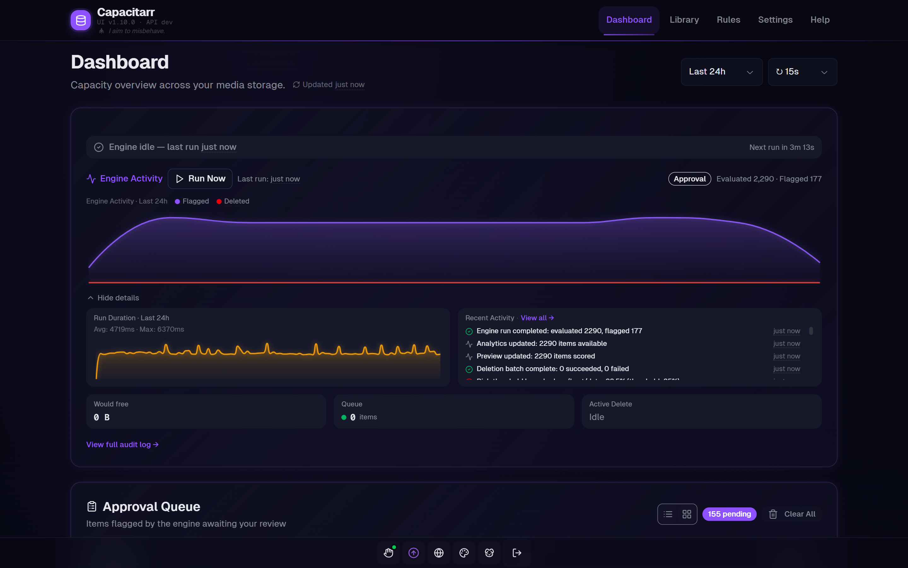

# Capacitarr

[![Pipeline][pipeline-badge]][pipeline-url]
[![Release][release-badge]][release-url]
[![License][license-badge]][license-url]
[![Docker Hub][dockerhub-badge]][dockerhub-url]
[![Security][security-badge]][security-url]

> *Intelligent media library capacity manager for the \*arr ecosystem.*

Capacitarr scores every media item across six dimensions — watch history, recency, file size, ratings, age, and series status — then removes the least-valuable items first when disk space runs low. A visual rule builder lets you protect specific content from ever being deleted.

<p align="center">
  
</p>

## ✨ Highlights

- **Intelligent Scoring** — Six pluggable weighted factors rank every item for deletion priority
- **Insights Dashboard** — Library composition, quality distribution, bloat detection, and watch intelligence analytics
- **Visual Rule Builder** — Protect content with `always_keep`, `prefer_keep`, `prefer_delete`, and `always_delete` rules with impact previews
- **9 Integrations** — Sonarr, Radarr, Lidarr, Readarr, Plex, Jellyfin, Emby, Tautulli, Seerr (Overseerr/Jellyseerr)
- **Approval Queue** — Review and approve deletions before they happen
- **Real-Time Dashboard** — 44+ SSE event types push everything to the browser instantly
- **Per-Integration Thresholds** — Different disk usage triggers per *arr instance
- **Watch Intelligence** — Dead content detection, stale content reports, popularity heatmaps, request fulfillment tracking
- **Single Container** — Go + Nuxt + SQLite in one ~30 MB Docker image

## 🚀 Quick Start

```yaml
services:
  capacitarr:
    image: ghentstarshadow/capacitarr:stable
    container_name: capacitarr
    ports:
      - "2187:2187"
    environment:
      - PUID=1000
      - PGID=1000
      - JWT_SECRET=change-me-to-a-random-string
    volumes:
      - capacitarr-config:/config
    restart: unless-stopped

volumes:
  capacitarr-config:
```

```bash
docker compose up -d
```

Open **http://localhost:2187** and create your admin account.

## 📖 Documentation

Full docs at **[capacitarr.app](https://capacitarr.app/)** — or browse locally:

[Quick Start](docs/quick-start.md) · [Configuration](docs/configuration.md) · [Scoring](docs/scoring.md) · [Architecture](docs/architecture.md) · [API Reference](docs/api/README.md) · [Deployment](docs/deployment.md)

## 🔐 Security

Developed with AI assistance. Hardened with 7 blocking SAST/SCA tools, DAST scanning, and container hardening — every exception individually documented with rationale. [Full security posture →](SECURITY.md)

## � Community

[Discord](https://discord.gg/fbFkND5qgt) · [Reddit](https://www.reddit.com/r/capacitarr/) · [Contributing](CONTRIBUTING.md)

## 🇺🇦 Ukraine

I stand with Ukraine. This project is built with the belief that freedom, sovereignty, and self-determination matter — for people and for software.

## 🐾 Support Animal Rescue

Capacitarr is free software. The creator strongly prefers that donations go to animal rescue over developer support:

- **[UAnimals](https://uanimals.org/en/)** — rescuing and protecting animals in Ukraine 🇺🇦
- **[ASPCA](https://www.aspca.org/ways-to-help)** — preventing cruelty to animals

If you still want to support development directly: [GitHub Sponsors](https://github.com/sponsors/ghent) · [Ko-fi](https://ko-fi.com/ghent) · [Buy Me a Coffee](https://buymeacoffee.com/ghentgames)

## License

[PolyForm Noncommercial 1.0.0](LICENSE) — free for any noncommercial use.

<!-- Badge references -->
[pipeline-badge]: https://img.shields.io/gitlab/pipeline-status/starshadow%2Fsoftware%2Fcapacitarr?branch=main&logo=gitlab&label=pipeline
[pipeline-url]: https://gitlab.com/starshadow/software/capacitarr/-/pipelines
[release-badge]: https://img.shields.io/gitlab/v/release/starshadow%2Fsoftware%2Fcapacitarr?logo=gitlab&label=release
[release-url]: https://gitlab.com/starshadow/software/capacitarr/-/releases
[license-badge]: https://img.shields.io/badge/license-PolyForm%20NC%201.0-blue
[license-url]: LICENSE
[dockerhub-badge]: https://img.shields.io/docker/v/ghentstarshadow/capacitarr?label=Docker%20Hub&logo=docker&sort=semver
[dockerhub-url]: https://hub.docker.com/r/ghentstarshadow/capacitarr
[security-badge]: https://img.shields.io/badge/security-hardened-brightgreen?logo=owasp&logoColor=white
[security-url]: SECURITY.md
