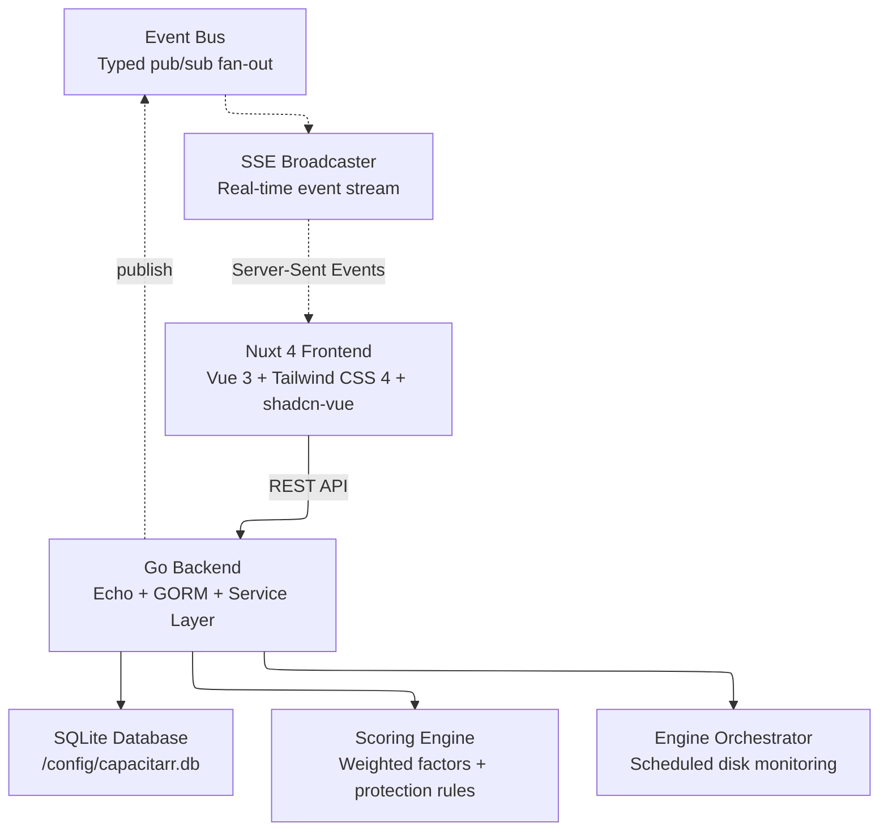
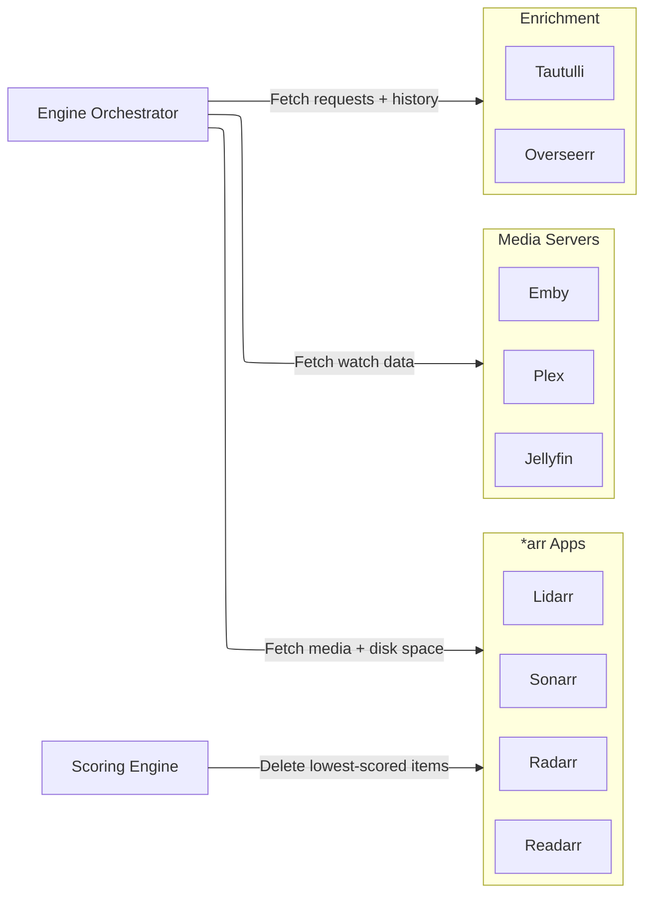
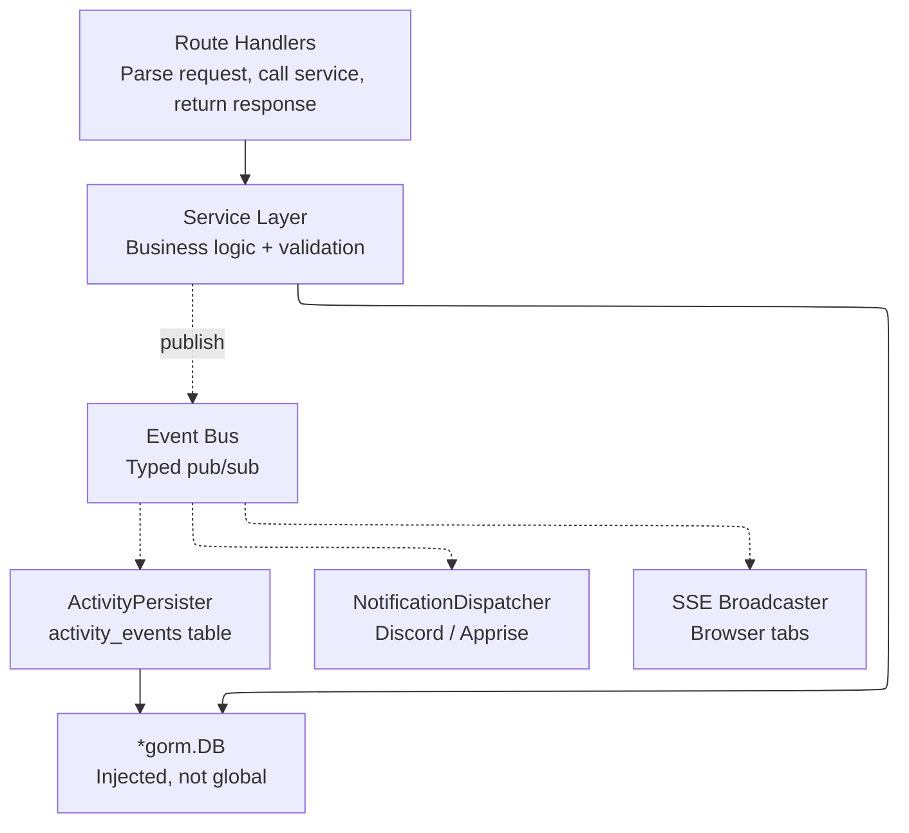
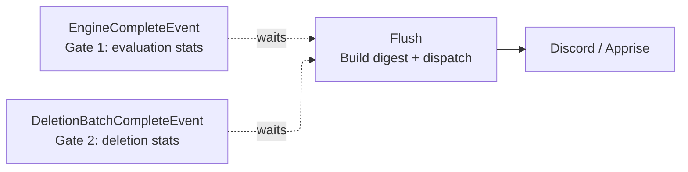
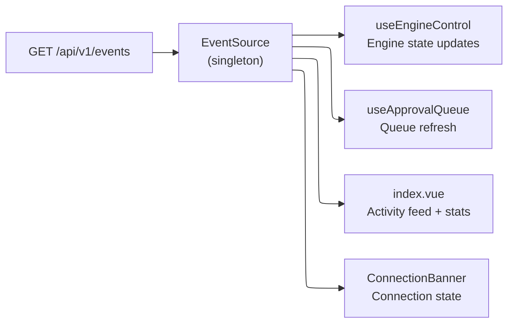

# Architecture

Capacitarr is a single-container application that bundles a Go backend, a Nuxt 4 (Vue 3) frontend, and a SQLite database. The frontend is statically generated at build time and embedded into the Go binary via `go:embed`, producing a single self-contained executable.

## High-Level Overview

### Container Internals

The Docker container runs a Go backend that serves the embedded Nuxt frontend. Communication flows through REST API calls and real-time Server-Sent Events.



### External Integrations

The engine orchestrator fetches data from external services, and the scoring engine sends deletion requests back to the *arr apps.



## Technology Stack

| Layer | Technology | Purpose |
|-------|-----------|---------|
| **Frontend** | Nuxt 4, Vue 3, Tailwind CSS 4, shadcn-vue, Lucide, ApexCharts | Dashboard UI, rule builder, score visualization, real-time updates via SSE |
| **Backend** | Go, Echo, GORM | REST API, authentication, integration clients, scheduling |
| **Service Layer** | Go (custom) | Business logic, event publishing, dependency injection |
| **Event System** | Go (custom) | Typed event bus, activity persistence, SSE broadcast, notification dispatch |
| **Database** | SQLite | Configuration, approval queue, audit log, engine statistics |
| **Container** | Alpine Linux, multi-stage Docker build | Minimal runtime image (~30 MB) |

## Backend Architecture

### Service Layer

All business logic lives in the service layer (`backend/internal/services/`). Route handlers are thin — they parse requests, call services, and return responses.



#### Service Registry

All services accept `*gorm.DB` and `*events.EventBus` in their constructor and are registered on `services.Registry`.

| Category | Service | Responsibilities |
|----------|---------|-----------------|
| **Core** | ApprovalService | Approve, reject, unsnooze queue items |
| | DeletionService | Execute deletions, dry run, handle failures |
| | EngineService | Trigger runs, get stats |
| | SettingsService | Update preferences and thresholds |
| **Data** | AuditLogService | Create, upsert, dedup audit entries |
| | DataService | Data reset operations |
| | MetricsService | History, rollup, lifetime stats |
| | RulesService | Custom rule CRUD and validation |
| **External** | IntegrationService | CRUD, test connections, sync data |
| | AuthService | Login, change password, generate API keys |
| | NotificationChannelService | CRUD for notification channels |
| | NotificationDispatchService | Two-gate flush, digest, and alerts |
| | VersionService | Update check via GitLab releases |

### Service Registry

All services are instantiated in `main.go` and held in a `services.Registry` struct that is passed to route registration functions:

```go
type Registry struct {
    DB  *gorm.DB
    Bus *events.EventBus
    Cfg *config.Config

    Approval             *ApprovalService
    Deletion             *DeletionService
    AuditLog             *AuditLogService
    Engine               *EngineService
    Settings             *SettingsService
    Integration          *IntegrationService
    Auth                 *AuthService
    NotificationChannel  *NotificationChannelService
    NotificationDispatch *NotificationDispatchService
    Data                 *DataService
    Rules                *RulesService
    Metrics              *MetricsService
    Version              *VersionService
    Backup               *BackupService
}
```

Each service receives a `*gorm.DB` and `*events.EventBus` via constructor injection — no global state.

### Event Bus

The event bus uses a fan-out pattern with one goroutine per subscriber and buffered channels.

```go
// Event is the interface all typed events implement.
type Event interface {
    EventType() string
    EventMessage() string
}

type EventBus struct {
    mu          sync.RWMutex
    subscribers []chan Event
}

func (b *EventBus) Publish(event Event)
func (b *EventBus) Subscribe() <-chan Event
func (b *EventBus) Unsubscribe(ch <-chan Event)
```

When a service performs an action (e.g., approving an item, completing an engine run), it publishes a typed event to the bus. Three subscribers react to every event:

1. **ActivityPersister** — writes the event to the `activity_events` table for the dashboard feed
2. **NotificationDispatcher** — filters events against notification channel subscriptions and delivers to Discord/Apprise
3. **SSEBroadcaster** — serializes the event as an SSE message and pushes it to all connected browser tabs

### Notification Dispatch

The `NotificationDispatchService` uses a **two-gate flush pattern** to ensure cycle digest notifications contain complete data from both the evaluation phase and the deletion phase of an engine run.



**Cycle digests** are batched summaries sent once per engine run. They include evaluated count, flagged count, deleted count, freed bytes, duration, and disk usage. The digest is only dispatched after both gates fire, ensuring deletion results are included.

**Instant alerts** fire immediately when their trigger event occurs — they are not batched. Alert types include engine errors, mode changes, server started, threshold breaches, update available, and approval activity.

See [notifications.md](notifications.md) for the full user-facing guide, and [plans/20260307T1403Z-notification-overhaul.md](plans/20260307T1403Z-notification-overhaul.md) for the design details.

### Event Types (40 total)

| Category | Events |
|----------|--------|
| **Engine** | `engine_start`, `engine_complete`, `engine_error`, `manual_run_triggered` |
| **Settings** | `engine_mode_changed`, `settings_changed`, `threshold_changed`, `threshold_breached`, `settings_exported`, `settings_imported` |
| **Auth** | `login`, `password_changed`, `username_changed`, `api_key_generated` |
| **Integration** | `integration_added`, `integration_updated`, `integration_removed`, `integration_test`, `integration_test_failed` |
| **Approval** | `approval_approved`, `approval_rejected`, `approval_unsnoozed`, `approval_bulk_unsnoozed`, `approval_orphans_recovered` |
| **Deletion** | `deletion_success`, `deletion_failed`, `deletion_dry_run`, `deletion_batch_complete`, `deletion_progress` |
| **Rules** | `rule_created`, `rule_updated`, `rule_deleted` |
| **Notifications** | `notification_channel_added`, `notification_channel_updated`, `notification_channel_removed`, `notification_sent`, `notification_delivery_failed` |
| **Data** | `data_reset` |
| **System** | `server_started`, `update_available` |

### SSE (Server-Sent Events)

The frontend connects to `GET /api/v1/events` (authenticated, long-lived HTTP connection) to receive real-time updates. This replaces the previous polling-based approach.

```
HTTP/1.1 200 OK
Content-Type: text/event-stream
Cache-Control: no-cache
Connection: keep-alive

id: 1741199820-001
event: engine_start
data: {"message":"Engine run started in approval mode","executionMode":"approval"}

id: 1741199825-002
event: engine_complete
data: {"message":"Engine run completed: evaluated 97, flagged 12","evaluated":97,"flagged":12}
```

Key features:
- Auto-increment event IDs for replay support via `Last-Event-ID` header
- In-memory ring buffer (last 100 events) for reconnection replay
- Keepalive comments every 30 seconds to prevent proxy timeouts
- Auto-reconnect with exponential backoff on the client side

## Database Schema

The database uses two purpose-specific tables instead of a single overloaded table:

### Approval Queue

Active approval queue items with a state machine (`pending` → `approved`/`rejected`):

| Column | Type | Description |
|--------|------|-------------|
| `id` | INTEGER | Primary key |
| `media_name` | TEXT | Item title |
| `media_type` | TEXT | `movie`, `show`, `season`, `episode`, `artist`, `album`, `book` |
| `reason` | TEXT | Score explanation |
| `score_details` | TEXT | JSON-encoded score breakdown |
| `size_bytes` | INTEGER | File size |
| `integration_id` | INTEGER | FK to `integration_configs` (required) |
| `external_id` | TEXT | External ID in the integration |
| `status` | TEXT | `pending`, `approved`, `rejected` |
| `snoozed_until` | DATETIME | When snooze expires (rejected items) |
| `created_at` | DATETIME | Row creation |
| `updated_at` | DATETIME | Last state transition |

### Audit Log

Permanent, append-only history of deletions and dry-runs:

| Column | Type | Description |
|--------|------|-------------|
| `id` | INTEGER | Primary key |
| `media_name` | TEXT | Item title |
| `media_type` | TEXT | Media type |
| `reason` | TEXT | Score explanation |
| `score_details` | TEXT | JSON-encoded score breakdown |
| `action` | TEXT | `deleted`, `dry_run`, `dry_delete` |
| `size_bytes` | INTEGER | File size |
| `integration_id` | INTEGER | FK to `integration_configs` (nullable — preserved on integration delete) |
| `created_at` | DATETIME | Row creation |

### Activity Events

Transient dashboard feed with 7-day retention:

| Column | Type | Description |
|--------|------|-------------|
| `id` | INTEGER | Primary key |
| `event_type` | TEXT | One of 39 event types |
| `message` | TEXT | Human-readable message |
| `metadata` | TEXT | Optional JSON payload |
| `created_at` | DATETIME | Row creation |

## Frontend Architecture

### SSE Integration

The frontend uses a singleton `useEventStream` composable that maintains a single `EventSource` connection shared across all components:



- `app.vue` initializes the SSE connection on mount when authenticated
- Components subscribe to specific event types and react accordingly
- Engine state, approval queue, and activity feed update in real-time without polling
- `ConnectionBanner.vue` uses SSE connection state as the primary health indicator

### Page Structure

| Page | Route | Purpose |
|------|-------|---------|
| Dashboard | `/` | Disk groups, approval queue, activity feed, engine controls, sparklines |
| Audit Log | `/audit` | History-only view (deleted, dry-run, dry-delete) |
| Rules | `/rules` | Cascading rule builder + disk threshold configuration |
| Settings | `/settings` | Preferences, integrations, notifications, authentication |
| Help | `/help` | Scoring guide, FAQ, about section |
| Login | `/login` | Authentication |

## Project Structure

```
capacitarr/
├── backend/                        # Go backend
│   ├── main.go                     # Application entrypoint, wiring
│   ├── internal/
│   │   ├── config/                 # Environment variable loading
│   │   ├── db/                     # SQLite models, single baseline migration
│   │   ├── engine/                 # Scoring + rule evaluation
│   │   ├── events/                 # Event bus, typed events, SSE broadcaster, activity persister
│   │   ├── integrations/           # *arr, Plex, Jellyfin, Emby, Overseerr, Tautulli clients
│   │   ├── jobs/                   # Cron scheduling (retention cleanup, time-series rollups)
│   │   ├── notifications/          # Discord, Apprise notification senders + HTTP client
│   │   ├── poller/                 # Engine orchestrator + deletion worker
│   │   ├── services/               # Service layer (business logic)
│   │   └── logger/                 # Structured logging
│   └── routes/                     # REST API handlers + middleware
├── frontend/                       # Nuxt 4 frontend
│   ├── app/
│   │   ├── components/             # Vue components (shadcn-vue based)
│   │   ├── composables/            # Vue composables (useEventStream, useEngineControl, etc.)
│   │   ├── pages/                  # Nuxt pages (dashboard, audit, rules, settings, help)
│   │   ├── locales/                # i18n translations (22 languages)
│   │   ├── types/                  # TypeScript type definitions
│   │   └── assets/css/             # Tailwind CSS + theme variables
│   └── nuxt.config.ts              # Nuxt configuration
├── site/                           # Project marketing site (Nuxt UI Pro)
├── docs/                           # Documentation
│   ├── api/                        # OpenAPI spec, examples, workflows
│   └── plans/                      # Internal plan documents
├── docker-compose.yml              # Development/deployment compose file
├── Dockerfile                      # Multi-stage build (Node → Go → Alpine)
└── Makefile                        # CI/CD targets (lint, test, security, build)
```
