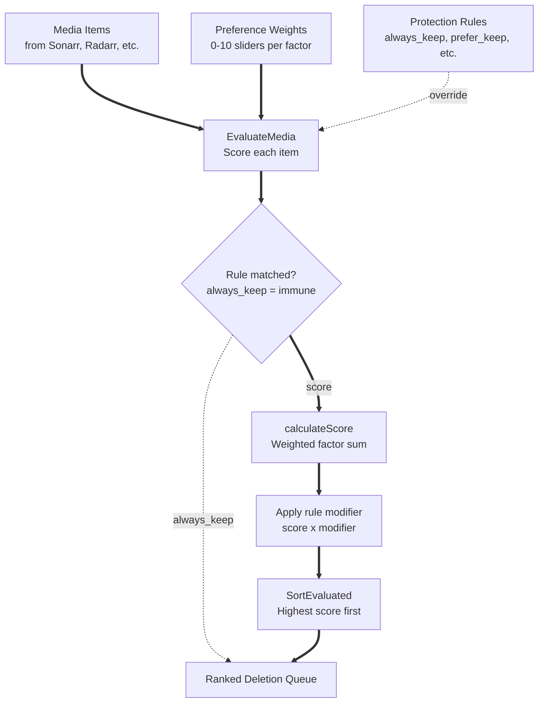
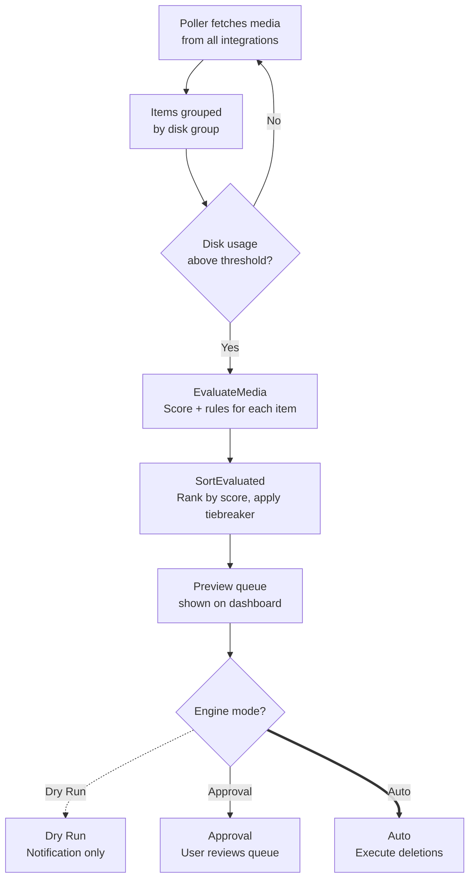

# Scoring Algorithm

Capacitarr uses a two-layer system to decide which media items to remove when disk space runs low: **preference-based scoring** ranks every item, and **protection rules** override scores to keep or target specific content.

Higher score = more likely to be deleted.

## Overview



## Scoring Factors

Each media item is scored across seven dimensions. Every factor produces a raw score between 0.0 (keep) and 1.0 (delete), which is then multiplied by the user-configured weight (0–10).

### Watch History

**What it measures:** How many times the item has been played.

| Play Count | Raw Score |
|-----------|-----------|
| 0 (never watched) | 1.0 |
| 1 | 0.5 |
| 2 | 0.25 |
| N | 0.5 / N |

Unwatched content scores highest — it gets deleted first when this factor has a high weight.

### Last Watched

**What it measures:** How recently the item was last played.

| Time Since Played | Raw Score |
|------------------|-----------|
| Never played | 1.0 |
| 1 month ago | ~0.08 |
| 6 months ago | ~0.49 |
| 1 year ago | 1.0 |
| > 1 year ago | 1.0 (capped) |

The score is linear: `daysSincePlayed / 365`, capped at 1.0. Items played recently are protected; items played long ago (or never) score high.

### File Size

**What it measures:** How much disk space the item consumes.

| Size | Raw Score |
|------|-----------|
| 5 GB | 0.10 |
| 25 GB | 0.50 |
| 50 GB+ | 1.0 (capped) |

Calculated as `sizeGB / 50.0`, capped at 1.0. Larger files score higher because removing them frees more space.

### Rating

**What it measures:** The item's community or user rating.

| Rating (0–10) | Raw Score |
|--------------|-----------|
| 9.0 | 0.10 |
| 7.0 | 0.30 |
| 5.0 | 0.50 |
| 2.0 | 0.80 |
| 0 (unknown) | 0.50 |

The score is inverted: `1.0 - (rating / 10.0)`. High-rated content scores low (keep it), low-rated content scores high (delete it). Ratings on a 0–100 scale are auto-normalized.

### Time in Library

**What it measures:** How long the item has been in the library.

| Time in Library | Raw Score |
|----------------|-----------|
| 1 month | ~0.08 |
| 6 months | ~0.49 |
| 1 year | 1.0 |
| > 1 year | 1.0 (capped) |

Calculated as `daysSinceAdded / 365`, capped at 1.0. Older content scores higher than recently added content.

### Series Status

**What it measures:** Whether a show is still producing new episodes.

| Show Status | Raw Score |
|------------|-----------|
| Continuing | 0.2 |
| Ended | 1.0 |
| Unknown / Movie | 0.5 |

Ended shows score higher because no new episodes are expected — keeping them offers less ongoing value. This factor only applies to shows and seasons; movies and other types default to 0.5.

### Request Popularity

**What it measures:** Whether the item was requested by a user (via Seerr).

| Request Status | Raw Score |
|---------------|-----------|
| Requested, not watched by requestor | 0.1 |
| Requested, watched by requestor | 0.3 |
| Not requested | 0.5 |

Requested content is strongly protected from deletion. Items with unfulfilled requests (not yet watched by the requestor) receive the strongest protection.

## Score Calculation

The final weighted score combines all factors:

```
totalScore = Σ (rawScore_i × weight_i)  for each factor i

finalScore = totalScore / Σ weight_i
```

All weights are normalized so the final score stays between 0.0 and 1.0 regardless of how many factors are enabled or what weight values are chosen.

**Example:**

With weights Watch History=10, File Size=6, Rating=5 (all others=0):

- Total weight = 10 + 6 + 5 = 21
- An unwatched (1.0), 25 GB (0.5), low-rated 3.0 (0.7) item:
    - Score = (1.0×10 + 0.5×6 + 0.7×5) / 21 = (10 + 3 + 3.5) / 21 = **0.79**

If all weights are set to zero, the score is 0.0 for every item and no deletions are ranked.

## Protection Rules

Rules override the scoring engine by applying **score modifiers** — multipliers that push an item's score up or down after the weighted calculation.

### Rule Effects

| Effect | Modifier | Behavior |
|--------|----------|----------|
| `always_keep` | — | Item is immune to deletion. Score is set to 0.0 and the item is marked as protected. No further processing. |
| `prefer_keep` | ×0.2 | Strongly reduces the deletion score. |
| `lean_keep` | ×0.5 | Moderately reduces the deletion score. |
| `lean_remove` | ×1.5 | Slightly increases the deletion score. |
| `prefer_remove` | ×3.0 | Strongly increases the deletion score. |
| `always_remove` | ×100.0 | Pushes the score to the maximum — item is effectively always first in the queue. |

### "Keep Always Wins"

When multiple rules match the same item, `always_keep` takes absolute precedence. If any matching rule has the `always_keep` effect, the item is unconditionally protected regardless of any other matching rules.

For all other effects, modifiers **multiply together**. For example, if an item matches both a `prefer_keep` (×0.2) and a `lean_remove` (×1.5) rule, the combined modifier is 0.2 × 1.5 = **0.30** — the keep effect dominates.

### Rule Matching

Rules match media items by comparing a **field** against a **value** using an **operator**:

#### String Fields

| Field | Matches Against | Supported Operators |
|-------|----------------|-------------------|
| `title` | Item title | `==`, `!=`, `contains`, `!contains` |
| `quality` | Quality profile name | `==`, `!=`, `contains`, `!contains` |
| `seriesstatus` | Show status (ended, continuing) | `==`, `!=`, `contains`, `!contains` |
| `tag` | Any tag on the item | `==`, `!=`, `contains`, `!contains` |
| `genre` | Genre name | `==`, `!=`, `contains`, `!contains` |
| `language` | Language | `==`, `!=`, `contains`, `!contains` |
| `type` | Media type (movie, show, season, etc.) | `==`, `!=`, `contains`, `!contains` |
| `collection` | Collection name (Plex, Jellyfin, Emby) | `==`, `!=`, `contains`, `!contains` |

#### Numeric Fields

| Field | Matches Against | Supported Operators |
|-------|----------------|-------------------|
| `rating` | Rating (0–10 or 0–100) | `==`, `!=`, `>`, `>=`, `<`, `<=` |
| `sizeBytes` | File size in bytes | `==`, `!=`, `>`, `>=`, `<`, `<=` |
| `timeInLibrary` | Days since added | `==`, `!=`, `>`, `>=`, `<`, `<=` |
| `seasonCount` | Season number | `==`, `!=`, `>`, `>=`, `<`, `<=` |
| `episodeCount` | Episode count | `==`, `!=`, `>`, `>=`, `<`, `<=` |
| `playCount` | Number of plays | `==`, `!=`, `>`, `>=`, `<`, `<=` |
| `requestCount` | Number of requests (Seerr) | `==`, `!=`, `>`, `>=`, `<`, `<=` |
| `year` | Release year | `==`, `!=`, `>`, `>=`, `<`, `<=` |

#### Temporal Fields

| Field | Matches Against | Supported Operators |
|-------|----------------|-------------------|
| `lastplayed` | Days since last played | `in_last`, `over_ago`, `never` |

- `never` matches items that have never been played
- `in_last N` matches items played within the last N days
- `over_ago N` matches items last played more than N days ago (never-played items also match)

> **Note:** The `timeinLibrary` numeric field also supports `in_last` and `over_ago` operators in addition to the standard numeric operators.

#### String Fields (Additional)

| Field | Matches Against | Supported Operators |
|-------|----------------|-------------------|
| `requestedby` | Username of the requestor (Seerr) | `==`, `!=`, `contains`, `!contains` |

#### Boolean Fields

| Field | Matches Against | Values |
|-------|----------------|--------|
| `monitored` | Monitored status | `true`, `false` |
| `requested` | Has active request (Seerr) | `true`, `false` |
| `incollection` | Item belongs to any collection (Plex, Jellyfin, Emby) | `true`, `false` |
| `watchlist` | On watchlist (Plex on-deck / Jellyfin/Emby favorites) | `true`, `false` |
| `watchedbyreq` | Watched by the requestor (Seerr) | `true`, `false` |

Rules can optionally be scoped to a specific integration — a rule scoped to one Sonarr instance will not affect items from Radarr or another Sonarr instance.

> **Note:** The rule builder's service dropdown only shows *arr integrations (Sonarr, Radarr, Lidarr, Readarr) because rules operate on *arr library items. Enrichment services like Plex, Jellyfin, Emby, Tautulli, Jellystat, Tracearr, and Seerr are not shown as selectable services. Instead, when an enrichment service is active, its fields (e.g., "Play Count" from Plex/Tautulli/Tracearr, "Is Requested" from Seerr) are automatically available in the rule builder for any *arr integration. This means you write a rule scoped to Sonarr using the "Play Count" field, and Capacitarr enriches the Sonarr items with play data from Plex/Tautulli/Tracearr behind the scenes.

### Watchlist Enrichment

The `watchlist` rule field reflects whether a media item is on the user's watchlist or favorites list. The data source depends on which media servers are connected:

| Media Server | Source | What It Means |
|-------------|--------|---------------|
| **Plex** | On-deck items | Items the user is actively interested in (partially watched or next in a series) |
| **Jellyfin** | Favorited items | Items the user has explicitly marked as favorites |
| **Emby** | Favorited items | Items the user has explicitly marked as favorites |
| **Seerr** | Requested items | Items with active user requests (Overseerr/Jellyseerr) |

When multiple media servers are connected, an item is marked `OnWatchlist = true` if **any** connected source reports it as on-watchlist/favorited/requested.

**Example rule:** To protect all items the user is actively interested in:

- **Field:** `watchlist`
- **Operator:** `==`
- **Value:** `true`
- **Effect:** `always_keep`

### Collection Autocomplete

The `collection` rule field matches against collection names from Plex, Jellyfin, and Emby. The rule builder provides autocomplete suggestions populated from all enabled media server integrations. When you select the `collection` field in the rule builder, a combobox shows all known collection names — you can type to filter or select from the list.

**Example rule:** To protect all items in a "Classics" collection:

- **Field:** `collection`
- **Operator:** `==`
- **Value:** `Classics`
- **Effect:** `always_keep`

Collection values are cached for performance and refreshed periodically from connected media servers.

## Tiebreaker Methods

When two items have the same score (within a tolerance of 0.0001), a tiebreaker determines the order:

| Method | Sort Order | Description |
|--------|-----------|-------------|
| `size_desc` | Largest first | **Default.** Frees the most space per deletion. |
| `size_asc` | Smallest first | Removes more items before hitting large ones. |
| `name_asc` | Alphabetical (A→Z) | Predictable, deterministic ordering. |
| `oldest_first` | Added earliest → latest | Older library items are removed first. |
| `newest_first` | Added latest → earliest | Recently added items are removed first. |

## End-to-End Flow


