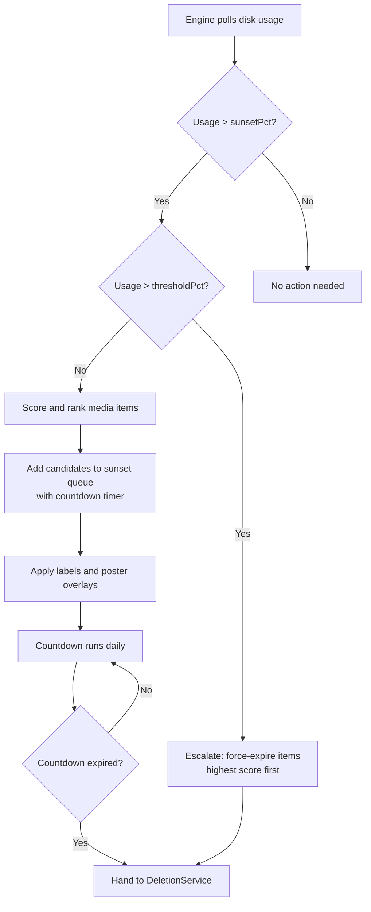

# Sunset Mode

Sunset mode is a two-threshold countdown system that gives media a grace period before deletion. When disk usage crosses the sunset threshold, candidates enter a queue with a configurable countdown timer. During the countdown, labels and poster overlays notify household members that content is scheduled for removal. If usage spikes past the critical threshold, items are escalated to immediate deletion.

## How It Works

Sunset mode uses two thresholds on each disk group to control the deletion lifecycle:

- **Sunset threshold** (`sunsetPct`) -- when disk usage exceeds this percentage, the engine adds scored candidates to the sunset queue with a countdown timer (default: 30 days).
- **Critical threshold** (`thresholdPct`) -- when disk usage exceeds this percentage, items in the sunset queue are escalated to immediate deletion, bypassing the remaining countdown. Escalation processes expired items first, then highest-score items, freeing only enough space to reach the target.

The sunset threshold must be lower than the target threshold (`targetPct`). This ordering ensures the countdown window begins before the disk group would otherwise trigger cleanup.

## Enabling Sunset Mode

Sunset mode is configured per disk group:

1. Navigate to the **Dashboard**
2. Click on the disk group you want to configure
3. Change the **Mode** to **Sunset**
4. Set the **Sunset Threshold** (`sunsetPct`) -- this must be below the target threshold (`targetPct`)
5. Save the disk group

The sunset threshold defines when the countdown queue begins filling. For example, with `sunsetPct` at 70% and `targetPct` at 80%, the engine starts queuing items when usage crosses 70% and deletes expired items to bring usage below 80%.

## Sunset Queue

The sunset queue holds all items that are scheduled for future deletion. Each item has a `deletionDate` calculated from the time it entered the queue plus the configured `sunsetDays` countdown.

### Queue States

| Status | Description |
|--------|-------------|
| `pending` | Item is in the countdown period. Labels and poster overlays are active. |
| `saved` | Item was rescued by the daily rescore -- its score dropped significantly due to recent activity. |
| `expired` | Countdown reached zero and the item was handed to DeletionService for deletion. |

### Management Actions

| Action | Description |
|--------|-------------|
| **Cancel** | Remove a single item from the queue. Restores the original poster and removes the sunset label. |
| **Reschedule** | Change the deletion date for a single item. |
| **Clear All** | Cancel all items in the queue. Restores all posters and removes all labels. |

## Media Server Labels

Labels are automatically applied to items in the sunset queue so they are visible in Plex, Jellyfin, and Emby. Capacitarr uses the `LabelManager` capability on each connected media server to add and remove labels.

| Label | Default Value | When Applied |
|-------|---------------|-------------|
| **Sunset label** | `capacitarr-sunset` | When an item enters the sunset queue |
| **Saved label** | `capacitarr-saved` | When an item is saved by the daily rescore |

Labels are removed when items are cancelled, expire (before deletion handoff), or when the saved marker duration elapses.

The **Refresh Labels** action re-applies the sunset label to any pending queue items where label application previously failed (e.g., due to missing media server mappings). It only targets items with `labelApplied = false`.

If the sunset label string is changed in settings, Capacitarr automatically migrates all existing labels -- removing the old label and applying the new one across all queued items in all enabled media servers.

## Poster Overlays

Poster overlays modify the item's poster image on connected media servers to visually indicate the upcoming removal. Three styles are available:

| Style | Behavior |
|-------|----------|
| `off` | No poster modification. |
| `countdown` | Overlays "Leaving in X days" on the poster, updated as the countdown progresses. |
| `simple` | Overlays "Leaving soon" on the poster (static text, no countdown number). |

Original posters are cached in `/config/posters/originals/` before any overlay is applied. The original is restored when an item is cancelled, saved, expires (before deletion), or when the saved marker duration elapses.

### Poster Actions

| Action | Description |
|--------|-------------|
| **Refresh Posters** | Re-generates overlay images for all active sunset queue items. Useful after changing the poster overlay style. |
| **Restore All Posters** | Emergency action that restores all original posters from the cache. Does not remove items from the queue. |

## Saved by Popular Demand

The daily rescore feature protects items that have gained new activity since entering the sunset queue.

When `sunsetRescoreEnabled` is true (the default), a daily cron job re-evaluates each pending sunset item against the current preview cache scores. If an item's current score drops below 50% of its original score at queue time -- indicating significant new activity such as someone watching the content -- the item is transitioned to `saved` status instead of continuing the countdown.

Saved items receive the following treatment:

- The sunset label is replaced with the saved label (`capacitarr-saved` by default)
- If poster overlays are active, the countdown overlay is replaced with a "Saved" badge
- A `SunsetSavedEvent` is published for notification routing

The saved marker persists for `savedDurationDays` (default: 7 days). After this period, the daily cleanup job removes the saved label, restores the original poster, and deletes the queue entry. The item returns to its normal state and may re-enter the sunset queue on a future engine cycle if conditions are met.

## Configuration Reference

All sunset-related settings are configured in **Settings** on the General page under the Sunset Settings card.

| Setting | Default | Description |
|---------|---------|-------------|
| `sunsetDays` | 30 | Countdown duration in days. Selectable values: 7, 14, 21, 30, 45, 60, 90. |
| `sunsetLabel` | `capacitarr-sunset` | Label/tag applied to items in the sunset queue on connected media servers. |
| `savedLabel` | `capacitarr-saved` | Label/tag applied to items saved by the daily rescore. |
| `posterOverlayStyle` | `countdown` | Poster overlay style: `off`, `countdown`, or `simple`. |
| `sunsetRescoreEnabled` | `true` | Enable daily re-scoring of sunset queue items. When an item's score drops significantly, it is saved instead of deleted. |
| `savedDurationDays` | 7 | Days the "Saved" marker persists before auto-cleanup. Selectable values: 3, 5, 7, 14, 30. |
| `sunsetPct` | *(per disk group)* | Usage percentage that triggers the sunset countdown. Must be less than `targetPct`. Configured on each disk group, not globally. |

## API Endpoints

All sunset queue endpoints are under `/api/v1/sunset-queue`. See the API reference for full request/response schemas.

| Method | Path | Description |
|--------|------|-------------|
| GET | `/sunset-queue` | List all sunset queue items |
| DELETE | `/sunset-queue/:id` | Cancel a sunset queue item |
| PATCH | `/sunset-queue/:id` | Reschedule the deletion date |
| POST | `/sunset-queue/clear` | Cancel all sunset queue items |
| POST | `/sunset-queue/refresh-labels` | Re-apply labels to unlabeled items |
| POST | `/sunset-queue/refresh-posters` | Re-generate poster overlays |
| POST | `/sunset-queue/restore-posters` | Restore all original posters |
