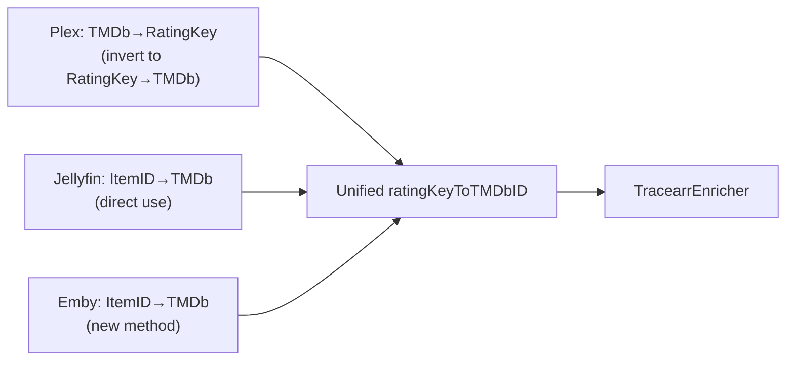

# Tracearr Integration

**Status:** 🔵 Planned
**Issue:** [#10 — Tracearr support](https://gitlab.com/starshadow/software/capacitarr/-/work_items/10)
**Reported-by:** @tomislavf
**Branch:** `feature/tracearr-integration`

## Background

[Tracearr](https://tracearr.com) is an open-source, self-hosted media server monitoring platform (TypeScript, Fastify, React, Redis, TimescaleDB). It provides unified real-time analytics across Plex, Jellyfin, and Emby, effectively replacing both Tautulli (Plex-only) and Jellystat (Jellyfin-only) with a single dashboard.

**Source:** [github.com/connorgallopo/Tracearr](https://github.com/connorgallopo/Tracearr) (1.6k stars)
**Docs:** [docs.tracearr.com](https://docs.tracearr.com)

### Why Tracearr Matters for Capacitarr

Capacitarr currently uses Tautulli for Plex watch analytics and Jellystat for Jellyfin watch analytics. Emby has no dedicated analytics integration. Tracearr fills all three gaps:

1. **Unified across all three media servers** — one Tracearr instance covers Plex + Jellyfin + Emby
2. **Engagement-based counting** — Netflix-style "intent" threshold (sessions < 2 min filtered), higher-quality play count data
3. **Emby analytics** — Tracearr provides analytics for Emby, which currently has no equivalent to Tautulli/Jellystat
4. **Can import from Tautulli and Jellystat** — preserves historical data during migration

### Tracearr Public API

Authentication uses Bearer tokens: `Authorization: Bearer trr_pub_<token>`. Tokens are generated in Tracearr Settings, require `owner` role, and use the `trr_pub_` prefix. Default port is 3000.

#### Relevant Stats Endpoints

| Route | Description | Use in Capacitarr |
|-------|-------------|-------------------|
| `GET /stats/content/top-content` | Top movies/shows by play count with watch time, rating keys | Primary enrichment source |
| `GET /stats/engagement` | Engagement metrics with Netflix-style play counting | Engagement-quality play counts |
| `GET /stats/engagement/shows` | Show-level stats with episode rollup | Show aggregation |
| `GET /stats/users` | Per-user play counts and stats | User attribution for WatchedByUsers |
| `GET /stats/users/top-users` | User leaderboard by watch time | Future: user-level analytics |

All endpoints accept query params: `period`, `startDate`, `endDate`, `serverId`.

#### Top Content Response Shape

Movies query returns: `media_title`, `year`, `play_count`, `total_watch_ms`, `thumb_path`, `server_id`, `rating_key`. Shows query returns the same fields but uses `grandparent_title` instead of `media_title`, aggregated by series across all episodes.

The `rating_key` field corresponds to the media server's internal item ID (Plex ratingKey, Jellyfin ItemId, or Emby ItemId). This is critical for TMDb ID resolution.

## Architecture Decision: ID Resolution Strategy

### Decision: RatingKey to TMDb Resolution via Existing Media Server Maps

Tracearr items include `rating_key` (the media server's internal ID). Capacitarr already builds ID mapping tables per poll cycle for Tautulli and Jellystat enrichment:

- **Plex:** `tmdbToRatingKey map[int]string` (built from PlexClient via [`GetTMDbToRatingKeyMap()`](../../../backend/internal/integrations/plex.go:340))
- **Jellyfin:** `jellyfinIDToTMDbID map[string]int` (built from JellyfinClient via [`GetItemIDToTMDbIDMap()`](../../../backend/internal/integrations/jellyfin.go:397))

For Tracearr, we build a unified **reverse map** `ratingKeyToTMDbID map[string]int` from all configured media servers. This is assembled in [`poller/fetch.go`](../../../backend/internal/poller/fetch.go) by inverting the Plex map and merging the Jellyfin/Emby maps.



This means Tracearr enrichment only works when at least one media server (Plex, Jellyfin, or Emby) is also configured. This is a reasonable constraint since Tracearr itself requires a media server connection — if users have Tracearr, they have a media server.

---

## Media Server Integration Audit

Before adding Tracearr, a thorough audit of the three media server integrations (Plex, Jellyfin, Emby) identified the following gaps.

### Audit: Capability Comparison Matrix

| Capability | Plex | Jellyfin | Emby | Notes |
|---|---|---|---|---|
| Connectable | ✅ | ✅ | ✅ | All complete |
| WatchDataProvider | ✅ | ✅ | ✅ | All complete |
| WatchlistProvider | ✅ (on-deck) | ✅ (favorites) | ✅ (favorites) | All complete |
| CollectionDataProvider | ✅ | ✅ (Box Sets) | ✅ (Box Sets) | All complete |
| Registry accessor | ✅ `PlexClient()` | ✅ `JellyfinClient()` | ❌ Missing | Gap #1 |
| ID resolution map | ✅ `GetTMDbToRatingKeyMap()` | ✅ `GetItemIDToTMDbIDMap()` | ❌ Missing | Gap #2 |
| Collection autocomplete | ✅ `GetCollectionNames()` | ❌ Missing | ❌ Missing | Gap #3 |

### Gap 1: Missing `EmbyClient` Registry Accessor

**Location:** [`registry.go`](../../../backend/internal/integrations/registry.go)
**Issue:** Plex, Jellyfin, Tautulli, and Jellystat all have typed client accessors on `IntegrationRegistry`, but `EmbyClient` does not.
**Impact:** Prerequisite for Tracearr (building Emby ID maps). Not a bug in current functionality.

### Gap 2: Missing `EmbyClient.GetItemIDToTMDbIDMap()`

**Location:** [`emby.go`](../../../backend/internal/integrations/emby.go)
**Issue:** Jellyfin has [`GetItemIDToTMDbIDMap()`](../../../backend/internal/integrations/jellyfin.go:397) for Jellystat enrichment, but the equivalent method is absent on EmbyClient.
**Impact:** Prerequisite for Tracearr (unified rating key → TMDb resolution). Not a bug in current functionality since there's no "Embystat" equivalent today.

### Gap 3: Collection Autocomplete is Plex-Only (Functional Bug)

**Location:** [`integration.go:76 — FetchCollectionValues()`](../../../backend/internal/services/integration.go:76)
**Issue:** Collection autocomplete for the rule builder only queries Plex integrations (line 93: `cfg.Type != "plex"` → skip). Jellyfin Box Set names and Emby Box Set names are completely absent from the dropdown. This is despite the fact that collections from Jellyfin/Emby ARE correctly enriched onto items via `CollectionDataProvider` — the enrichment works, but the rule autocomplete doesn't.
**Impact:** **Functional bug.** Users with Jellyfin or Emby as their primary media server see zero collection suggestions when building `collection` rules, forcing manual entry of exact collection names.
**Fix:** Add `GetCollectionNames()` methods to JellyfinClient and EmbyClient (extracting unique names from Box Sets), then update `FetchCollectionValues()` to query all media server types.

### Gap 4: Stale `types.go` Capability Comment

**Location:** [`types.go:45-50`](../../../backend/internal/integrations/types.go:45)
**Issue:** Comment says `Connectable + WatchDataProvider + WatchlistProvider` for Plex/Jellyfin/Emby, but all three also implement `CollectionDataProvider` (verified by compile-time assertions at the bottom of each file).
**Impact:** Documentation-only — misleading for developers.

---

## Implementation Plan

### Phase 0: Media Server Integration Remediation

**Goal:** Fix the gaps identified in the audit before adding Tracearr.

#### Step 0.1: Fix `types.go` capability comment

**File:** [`types.go`](../../../backend/internal/integrations/types.go)

Update lines 46 and 49 to include `CollectionDataProvider`:

```
// Plex:                             Connectable + WatchDataProvider + WatchlistProvider + CollectionDataProvider
// Jellyfin, Emby:                   Connectable + WatchDataProvider + WatchlistProvider + CollectionDataProvider
```

#### Step 0.2: Add `GetCollectionNames()` to JellyfinClient

**File:** [`jellyfin.go`](../../../backend/internal/integrations/jellyfin.go)

Add a method that fetches all Box Set names (not their members — just the names for autocomplete). Extract unique Box Set names from the existing `/Users/{id}/Items?IncludeItemTypes=BoxSet&Recursive=true` endpoint (same endpoint used in `GetCollectionMemberships()`), return sorted deduplicated `[]string`.

```go
// GetCollectionNames returns a sorted, deduplicated list of Jellyfin Box Set names.
// Used by FetchCollectionValues() to provide autocomplete options for collection-based rules.
func (j *JellyfinClient) GetCollectionNames() ([]string, error) {
    // Reuse the Box Set fetch from GetCollectionMemberships, just return names
}
```

#### Step 0.3: Add `GetCollectionNames()` to EmbyClient

**File:** [`emby.go`](../../../backend/internal/integrations/emby.go)

Same pattern as Jellyfin (forked codebase, structurally identical API).

#### Step 0.4: Update `FetchCollectionValues()` to query all media servers

**File:** [`integration.go`](../../../backend/internal/services/integration.go)

Replace the Plex-only filter (line 93) with a loop that queries Plex, Jellyfin, AND Emby integrations:

```go
func (s *IntegrationService) FetchCollectionValues() ([]integrations.NameValue, error) {
    // ... cache check (unchanged) ...

    configs, err := s.ListEnabled()
    // ... error check ...

    seen := make(map[string]bool)
    for _, cfg := range configs {
        var names []string
        var fetchErr error

        switch cfg.Type {
        case string(integrations.IntegrationTypePlex):
            client := integrations.NewPlexClient(cfg.URL, cfg.APIKey)
            names, fetchErr = client.GetCollectionNames()
        case string(integrations.IntegrationTypeJellyfin):
            client := integrations.NewJellyfinClient(cfg.URL, cfg.APIKey)
            names, fetchErr = client.GetCollectionNames()
        case string(integrations.IntegrationTypeEmby):
            client := integrations.NewEmbyClient(cfg.URL, cfg.APIKey)
            names, fetchErr = client.GetCollectionNames()
        default:
            continue
        }

        if fetchErr != nil {
            slog.Warn("Failed to fetch collection names",
                "component", "integration_service", "integrationId", cfg.ID, "type", cfg.Type, "error", fetchErr)
            continue
        }
        for _, name := range names {
            seen[name] = true
        }
    }
    // ... sort and cache (unchanged) ...
}
```

#### Step 0.5: Write tests for new methods

**Files:**

- [`jellyfin_test.go`](../../../backend/internal/integrations/jellyfin_test.go) — add `TestJellyfinClient_GetCollectionNames_Success` and `TestJellyfinClient_GetCollectionNames_Empty`
- [`emby_test.go`](../../../backend/internal/integrations/emby_test.go) — add `TestEmbyClient_GetCollectionNames_Success` and `TestEmbyClient_GetCollectionNames_Empty`
- [`integration_test.go`](../../../backend/internal/services/integration_test.go) — update existing `FetchCollectionValues` tests to cover Jellyfin and Emby collection names

Use canonical media names: "Serenity" for movies, "Firefly" for shows; Box Set names like "Firefly Collection" and "Serenity Saga".

#### Step 0.6: Run `make ci`

Verify all Phase 0 changes pass lint, test, and security checks before proceeding.

---

### Phase 1: Backend Client and Connection Testing

**Goal:** Add Tracearr as a recognized integration type with connection testing.

#### Step 1.1: Add `IntegrationTypeTracearr` constant

**File:** [`types.go`](../../../backend/internal/integrations/types.go)

Add to the `IntegrationType` const block (after `IntegrationTypeJellystat`):

```go
// IntegrationTypeTracearr identifies a Tracearr (multi-server analytics) integration.
// Tracearr is a unified alternative to Tautulli + Jellystat — it supports
// Plex, Jellyfin, and Emby from a single instance.
IntegrationTypeTracearr IntegrationType = "tracearr"
```

Update the capability comment block (line ~44) to include:

```
// Tracearr:                         Connectable (enriches via TracearrEnricher, not WatchDataProvider)
```

#### Step 1.2: Create `tracearr.go` client

**File:** `backend/internal/integrations/tracearr.go` (new)

Follow the [`jellystat.go`](../../../backend/internal/integrations/jellystat.go) pattern:

- Struct: `TracearrClient` with `URL string` and `APIKey string` (json:"-")
- Constructor: `NewTracearrClient(url, apiKey string) *TracearrClient`
- `doRequest(endpoint string) ([]byte, error)` — calls `DoAPIRequest(fullURL, "Authorization", "Bearer "+j.APIKey)`. Note: unlike Tautulli (query param `?apikey=`) and Jellystat (`x-api-token` header), Tracearr uses standard Bearer token auth.
- `TestConnection() error` — calls a lightweight endpoint (e.g., `/api/stats/dashboard`) and validates the JSON response is parseable with `result == "success"`. On 401, returns a descriptive error: `"tracearr auth failed (check your API key — generate a Public API key in Tracearr Settings, it must start with trr_pub_)"`.
- `GetTopContent(period string) (*TracearrTopContent, error)` — calls `/api/stats/content/top-content?period=<period>`, returns parsed response.

Response types:

```go
type TracearrTopContent struct {
    Movies []TracearrContentItem `json:"movies"`
    Shows  []TracearrContentItem `json:"shows"`
}

type TracearrContentItem struct {
    MediaTitle       string `json:"media_title"`
    GrandparentTitle string `json:"grandparent_title"` // Shows use this instead of media_title
    Year             int    `json:"year"`
    PlayCount        int    `json:"play_count"`
    TotalWatchMs     int64  `json:"total_watch_ms"`
    ServerID         string `json:"server_id"`
    RatingKey        string `json:"rating_key"`
}
```

Compile-time interface check: `var _ Connectable = (*TracearrClient)(nil)`

#### Step 1.3: Register factory

**File:** [`factory.go`](../../../backend/internal/integrations/factory.go)

Add to [`RegisterAllFactories()`](../../../backend/internal/integrations/factory.go:50) after the Jellystat entry:

```go
RegisterFactory(string(IntegrationTypeTracearr), func(url, apiKey string) interface{} {
    return NewTracearrClient(url, apiKey)
})
```

#### Step 1.4: Add `TracearrClient` registry accessor

**File:** [`registry.go`](../../../backend/internal/integrations/registry.go)

Add after [`JellyfinClient()`](../../../backend/internal/integrations/registry.go:324), following the same pattern:

```go
// TracearrClient checks if the Connectable at the given ID is a *TracearrClient
// and returns it. Used by the enricher builder since Tracearr doesn't implement
// WatchDataProvider (it uses the TracearrEnricher with ID resolution maps).
func (r *IntegrationRegistry) TracearrClient(id uint) (*TracearrClient, bool) {
    r.mu.RLock()
    defer r.mu.RUnlock()
    if c, ok := r.connectors[id]; ok {
        if tc, ok := c.(*TracearrClient); ok {
            return tc, true
        }
    }
    return nil, false
}
```

#### Step 1.5: Write unit tests for TracearrClient

**File:** `backend/internal/integrations/tracearr_test.go` (new)

Use `httptest.NewServer` pattern from [`tautulli_test.go`](../../../backend/internal/integrations/tautulli_test.go) and [`jellystat_test.go`](../../../backend/internal/integrations/jellystat_test.go). Use canonical media names per project rules: "Serenity" for movies, "Firefly" for shows.

Test cases:

- `TestTracearrClient_TestConnection_Success` — mock 200 with valid JSON
- `TestTracearrClient_TestConnection_Unauthorized` — mock 401, verify descriptive error about `trr_pub_` prefix
- `TestTracearrClient_TestConnection_InvalidURL` — connection refused
- `TestTracearrClient_GetTopContent_Success` — mock response with "Serenity" movie and "Firefly" show, verify parsing
- `TestTracearrClient_GetTopContent_EmptyResponse` — no items, returns empty arrays
- `TestTracearrClient_GetTopContent_MalformedJSON` — graceful error handling

---

### Phase 2: Enricher Implementation

**Goal:** Create a `TracearrEnricher` that populates `PlayCount`, `LastPlayed`, and `WatchedByUsers` on `MediaItem`s.

#### Step 2.1: Add `EmbyClient.GetItemIDToTMDbIDMap()` method

**File:** [`emby.go`](../../../backend/internal/integrations/emby.go)

Emby currently has `GetBulkWatchData()` (WatchDataProvider) but no method to extract Emby ItemID to TMDb ID mappings. Add this method following the [`JellyfinClient.GetItemIDToTMDbIDMap()`](../../../backend/internal/integrations/jellyfin.go:397) pattern:

```go
// GetItemIDToTMDbIDMap builds a map from Emby Item ID to TMDb ID for all
// movies and series in the library. Used by the Tracearr enricher to resolve
// Emby rating keys to TMDb IDs.
func (e *EmbyClient) GetItemIDToTMDbIDMap() (map[string]int, error) {
    // Fetch all items, extract ProviderIds.Tmdb, build map
}
```

#### Step 2.2: Add `EmbyClient` registry accessor

**File:** [`registry.go`](../../../backend/internal/integrations/registry.go)

Add accessor (same pattern as `JellyfinClient` and `PlexClient`):

```go
func (r *IntegrationRegistry) EmbyClient(id uint) (*EmbyClient, bool) {
    r.mu.RLock()
    defer r.mu.RUnlock()
    if c, ok := r.connectors[id]; ok {
        if ec, ok := c.(*EmbyClient); ok {
            return ec, true
        }
    }
    return nil, false
}
```

#### Step 2.3: Create `TracearrEnricher`

**File:** [`enrichers.go`](../../../backend/internal/integrations/enrichers.go)

Add after the `JellystatEnricher` section, following the same structural pattern:

```go
// TracearrEnricher enriches items with watch data from Tracearr (multi-server
// analytics). Like TautulliEnricher and JellystatEnricher, it runs at priority
// 10 (highest for watch data) and provides engagement-based play counts.
//
// Tracearr tracks items by media server rating key. Resolution to TMDb IDs
// requires the ratingKeyToTMDbID map — built from all configured media servers
// (Plex, Jellyfin, Emby) during the same poll cycle.
type TracearrEnricher struct {
    client            *TracearrClient
    ratingKeyToTMDbID map[string]int // media server item ID -> TMDb ID
}
```

- `NewTracearrEnricher(client *TracearrClient, ratingKeyToTMDbID map[string]int) *TracearrEnricher`
- `Name()` returns `"Tracearr Watch History"`
- `Priority()` returns `10` (same tier as Tautulli/Jellystat — highest for watch data)
- `EnrichmentCapability()` returns `EnrichCapWatchData`
- `Enrich(items []MediaItem) error`:
  1. Skip if `ratingKeyToTMDbID` is empty (log Debug, return nil)
  2. Call `client.GetTopContent("all")` for all-time data
  3. Build `map[int]*WatchData` by resolving each item's `rating_key` via `ratingKeyToTMDbID`
  4. Iterate `items`, match by TMDb ID, set `PlayCount` and `WatchedByUsers`
  5. Call `logEnrichmentResult()` with stats

Compile-time interface check: `var _ Enricher = (*TracearrEnricher)(nil)`

#### Step 2.4: Add `RegisterTracearrEnrichers` function

**File:** [`enrichers.go`](../../../backend/internal/integrations/enrichers.go)

Follow the exact pattern of [`RegisterTautulliEnrichers()`](../../../backend/internal/integrations/enrichers.go:525) and [`RegisterJellystatEnrichers()`](../../../backend/internal/integrations/enrichers.go:541):

```go
// RegisterTracearrEnrichers scans connectors for TracearrClient instances and
// adds TracearrEnricher to the pipeline. Called separately because Tracearr
// doesn't implement WatchDataProvider (it requires a unified rating key to
// TMDb ID map built from all media server integrations).
func RegisterTracearrEnrichers(pipeline *EnrichmentPipeline, registry *IntegrationRegistry, ratingKeyToTMDbID map[string]int) {
    for id := range registry.Connectors() {
        if tracearr, ok := registry.TracearrClient(id); ok {
            pipeline.Add(NewTracearrEnricher(tracearr, ratingKeyToTMDbID))
            slog.Debug("Added TracearrEnricher to pipeline", "component", "enrichment",
                "integrationID", id, "ratingKeyMappings", len(ratingKeyToTMDbID))
        }
    }
}
```

#### Step 2.5: Wire into poller

**File:** [`poller/fetch.go`](../../../backend/internal/poller/fetch.go)

After the [`RegisterJellystatEnrichers()`](../../../backend/internal/poller/fetch.go:225) call, add:

1. Build the unified `ratingKeyToTMDbID map[string]int` by:
   - Inverting the Plex `tmdbToRatingKey` map (already built at line 186)
   - Including the Jellyfin `jellyfinIDToTMDbID` map (already built at line 208)
   - Building an Emby `embyIDToTMDbID` map from EmbyClient (new — same loop pattern as Jellyfin at lines 209-223)
2. Call `integrations.RegisterTracearrEnrichers(pipeline, registry, ratingKeyToTMDbID)`

```go
// Build Emby Item ID -> TMDb ID map for Tracearr enrichment.
embyIDToTMDbID := make(map[string]int)
for id := range registry.Connectors() {
    if emby, ok := registry.EmbyClient(id); ok {
        embyMap, mapErr := emby.GetItemIDToTMDbIDMap()
        if mapErr != nil {
            slog.Warn("Failed to build Emby ID->TMDb ID map",
                "component", "poller", "integrationID", id, "error", mapErr)
            continue
        }
        for itemID, tmdbID := range embyMap {
            embyIDToTMDbID[itemID] = tmdbID
        }
        slog.Debug("Built Emby ID->TMDb ID map", "component", "poller",
            "integrationID", id, "mappings", len(embyMap))
    }
}

// Build unified ratingKey->TMDb ID map for Tracearr enrichment.
// Tracearr items use the media server's internal item ID as rating_key.
ratingKeyToTMDbID := make(map[string]int)
for tmdbID, ratingKey := range tmdbToRatingKey {
    ratingKeyToTMDbID[ratingKey] = tmdbID
}
for itemID, tmdbID := range jellyfinIDToTMDbID {
    ratingKeyToTMDbID[itemID] = tmdbID
}
for itemID, tmdbID := range embyIDToTMDbID {
    ratingKeyToTMDbID[itemID] = tmdbID
}

integrations.RegisterTracearrEnrichers(pipeline, registry, ratingKeyToTMDbID)
```

#### Step 2.6: Write enricher and Emby tests

**Files:**

- [`enrichers_test.go`](../../../backend/internal/integrations/enrichers_test.go) — add TracearrEnricher tests:
  - `TestTracearrEnricher_EnrichMovies` — "Serenity" matched by rating key -> TMDb ID
  - `TestTracearrEnricher_EnrichShows` — "Firefly" matched by rating key -> TMDb ID
  - `TestTracearrEnricher_SkipsNoMappings` — gracefully skips when ratingKeyToTMDbID is empty
  - `TestTracearrEnricher_SkipsAlreadyEnriched` — items with PlayCount > 0 not overwritten

- [`emby_test.go`](../../../backend/internal/integrations/emby_test.go) — add:
  - `TestEmbyClient_GetItemIDToTMDbIDMap_Success` — mock Emby library response
  - `TestEmbyClient_GetItemIDToTMDbIDMap_MissingTMDbProvider` — items without TMDb ProviderIds are skipped

---

### Phase 3: Frontend Integration UI

**Goal:** Add Tracearr to the integration type picker and configuration UI.

#### Step 3.1: Update `integrationHelpers.ts`

**File:** [`frontend/app/utils/integrationHelpers.ts`](../../../frontend/app/utils/integrationHelpers.ts)

Add `tracearr` entries to all switch statements and maps:

- `typeIcon`: Use `ShieldCheckIcon` from `lucide-vue-next` (Tracearr's logo is a shield). Add to import.
- `typeColor`: `'bg-cyan-500'` (distinct from teal for Tautulli and violet for Jellystat)
- `typeTextColor`: `'text-cyan-500'`
- `namePlaceholders`: `'My Tracearr'`
- `urlPlaceholders`: `'http://localhost:3000'`
- `urlHelpTexts`: `'Your Tracearr instance URL. API key must be a Public API key (starts with trr_pub_).'`

#### Step 3.2: Add Tracearr to type selector

**File:** [`frontend/app/components/settings/SettingsIntegrations.vue`](../../../frontend/app/components/settings/SettingsIntegrations.vue:211)

Add after the Jellystat `<UiSelectItem>` (line 212), before the Seerr entry:

```vue
<UiSelectItem value="tracearr">Tracearr</UiSelectItem>
```

This groups analytics integrations together: Tautulli, Jellystat, Tracearr.

---

### Phase 4: Testing and Documentation

#### Step 4.1: Run full CI

Run `make ci` to verify all changes pass lint, test, and security checks.

#### Step 4.2: Manual integration test

1. Deploy a Tracearr instance (Docker)
2. Connect it to a Plex/Jellyfin/Emby server
3. Generate a Public API key in Tracearr Settings (must start with `trr_pub_`)
4. Add Tracearr integration in Capacitarr Settings
5. Verify connection test passes (green sync status)
6. Trigger a poll cycle and verify enrichment data appears on media items (PlayCount populated from Tracearr)

#### Step 4.3: Update documentation

- Add Tracearr to the integrations list in [`README.md`](../../../README.md)
- Note the API key format requirement (`trr_pub_*` prefix) in the integration's URL help text

---

## File Change Summary

| File | Phase | Change | Description |
|------|-------|--------|-------------|
| `backend/internal/integrations/types.go` | 0, 1 | Modify | Fix capability comment; add `IntegrationTypeTracearr` |
| `backend/internal/integrations/jellyfin.go` | 0 | Modify | Add `GetCollectionNames()` method |
| `backend/internal/integrations/jellyfin_test.go` | 0 | Modify | Add `GetCollectionNames` tests |
| `backend/internal/integrations/emby.go` | 0, 2 | Modify | Add `GetCollectionNames()` + `GetItemIDToTMDbIDMap()` |
| `backend/internal/integrations/emby_test.go` | 0, 2 | Modify | Add collection name + ID map tests |
| `backend/internal/services/integration.go` | 0 | Modify | Update `FetchCollectionValues()` to query all media servers |
| `backend/internal/services/integration_test.go` | 0 | Modify | Add Jellyfin/Emby collection value tests |
| `backend/internal/integrations/tracearr.go` | 1 | New | `TracearrClient` with connection test and `GetTopContent()` |
| `backend/internal/integrations/tracearr_test.go` | 1 | New | Unit tests for `TracearrClient` |
| `backend/internal/integrations/factory.go` | 1 | Modify | Register Tracearr factory |
| `backend/internal/integrations/registry.go` | 1, 2 | Modify | Add `TracearrClient()` + `EmbyClient()` accessors |
| `backend/internal/integrations/enrichers.go` | 2 | Modify | Add `TracearrEnricher` + `RegisterTracearrEnrichers()` |
| `backend/internal/integrations/enrichers_test.go` | 2 | Modify | Add `TracearrEnricher` tests |
| `backend/internal/poller/fetch.go` | 2 | Modify | Build Emby ID map + unified ratingKeyToTMDbID, wire enricher |
| `frontend/app/utils/integrationHelpers.ts` | 3 | Modify | Add Tracearr icon, colors, placeholders |
| `frontend/app/components/settings/SettingsIntegrations.vue` | 3 | Modify | Add Tracearr to type selector |

## Risk Assessment

| Risk | Likelihood | Mitigation |
|------|-----------|------------|
| Tracearr Public API changes before stable release | Medium | Pin to known working API shape; Tracearr is actively developed |
| `rating_key` format differs across server types | Low | Verify with real Tracearr instance; graceful fallback to empty enrichment |
| No media server configured alongside Tracearr | Low | Enricher logs Debug skip message and returns nil; zero matches is legitimate |
| Tracearr API rate limiting | Low | Single bulk request per poll cycle (same pattern as Jellystat) |
| Emby `GetItemIDToTMDbIDMap()` performance | Low | Same item list fetch as `GetBulkWatchData()`; can share/cache if needed |
