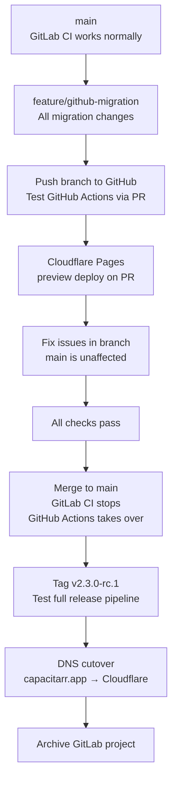

# GitLab → GitHub Migration + Cloudflare Pages + Docs Restructure

**Status:** 🟡 Planned
**Created:** 2026-03-26
**Scope:** Cross-cutting (CI/CD, documentation site, project metadata, docs structure)

## Overview

Migrate the Capacitarr project from GitLab (`gitlab.com/starshadow/software/capacitarr`) to GitHub. This includes:

1. **Repository migration** — Move git history, issues, and releases to GitHub
2. **CI/CD translation** — Replace `.gitlab-ci.yml` (15 jobs) with GitHub Actions workflows
3. **Container Registry** — Switch primary registry from GitLab CR to GHCR (`ghcr.io`); mirror to Docker Hub; deprecate GitLab CR
4. **Documentation site** — Move from GitLab Pages to Cloudflare Pages
5. **Docs restructure** — Reorganize flat doc list into logical grouped navigation
6. **Docker image references** — Update all documentation to use GHCR as the recommended image, with Docker Hub as alternative
7. **Project metadata** — Update all URLs, badges, references, and tooling configs
8. **GitLab CR deprecation** — Graceful sunset of GitLab Container Registry with user migration path

## Prerequisites — Accounts, Tokens & Setup Required Before Starting

Complete these items before beginning any migration phase. Each account/token is referenced by the phase that needs it.

### Accounts to Create

| Account | Where | Why | Needed By |
|---------|-------|-----|-----------|
| **Cloudflare account** | [dash.cloudflare.com](https://dash.cloudflare.com) | Hosts the documentation site (Cloudflare Pages) | Phase 6 |
| **GitHub repository** | [github.com/new](https://github.com/new) | Target repository for the migration | Phase 1 |

### API Tokens & Secrets to Generate

| Token | Where to Create | Permissions | Store As GitHub Secret | Needed By |
|-------|----------------|-------------|----------------------|-----------|
| **Cloudflare API Token** | Cloudflare dashboard → My Profile → API Tokens → Create Token → Use "Edit Cloudflare Workers" template (or custom with `Cloudflare Pages:Edit` permission) | Cloudflare Pages deploy | `CLOUDFLARE_API_TOKEN` | Phase 6 (if CI-driven deploy) |
| **Cloudflare Account ID** | Cloudflare dashboard → any domain → Overview → right sidebar → Account ID | Identifies your Cloudflare account | `CLOUDFLARE_ACCOUNT_ID` | Phase 6 (if CI-driven deploy) |
| **Docker Hub Access Token** | [hub.docker.com](https://hub.docker.com) → Account Settings → Security → New Access Token | Push images to Docker Hub | `DOCKERHUB_TOKEN` (reuse existing GitLab CI value) | Phase 3 |
| **Docker Hub Username** | Same Docker Hub account | Auth for Docker Hub push | `DOCKERHUB_USERNAME` (reuse existing GitLab CI value) | Phase 3 |
| **Discord Webhook URL** | Discord Server → Channel Settings → Integrations → Webhooks | Release notifications | `DISCORD_WEBHOOK_URL` (reuse existing GitLab CI value) | Phase 3 |

### Tokens That Do NOT Need Manual Creation

| Token | Why | Provided By |
|-------|-----|-------------|
| **GITHUB_TOKEN** | GHCR push, GoReleaser GitHub releases, API calls | Automatically injected by GitHub Actions (no secret needed) |
| **GHCR authentication** | Push/pull container images to `ghcr.io` | Uses `GITHUB_TOKEN` — no separate GHCR token needed |

### Existing Secrets to Migrate from GitLab CI/CD Variables

These already exist in GitLab CI/CD settings. Copy the values into GitHub repository Secrets:

1. `DOCKERHUB_USERNAME` — copy from GitLab CI/CD → Variables
2. `DOCKERHUB_TOKEN` — copy from GitLab CI/CD → Variables
3. `DISCORD_WEBHOOK_URL` — copy from GitLab CI/CD → Variables

### DNS Access

- **Domain registrar access** for `capacitarr.app` — needed to update CNAME records during Phase 7 (DNS cutover from GitLab Pages to Cloudflare Pages)
- If DNS is already on Cloudflare, this is automatic when connecting the custom domain

---

## Branching Strategy — Safe Migration Without Affecting GitLab

All migration work happens in a dedicated `feature/github-migration` branch. GitLab CI continues to function normally on `main` until the branch is merged on cutover day.

### Branch Workflow



### What Goes in the Branch

**Safe changes (GitLab unaffected until merge):**
- `.github/workflows/` — New files; GitLab ignores them
- `.goreleaser.yml` — `release.gitlab` → `release.github`
- `cliff.toml` — URL updates
- `scripts/docker-build.sh`, `docker-mirror.sh` — Env var updates
- `README.md`, `SECURITY.md`, `CONTRIBUTING.md`, `.kilocoderules` — URL/terminology updates
- `site/` — All site changes (app.config.ts, fetch-repo-stats.mjs, content/index.md, sync-docs.mjs)
- `docs/` — Directory restructure (file moves via `git mv`)
- Docker image references → GHCR-primary

**Destructive change (hold until merge):**
- `.gitlab-ci.yml` — Keep this file in the branch unchanged. Delete it in the final commit before merge, or as the merge commit itself. While it exists, GitLab CI still runs on `main`.

### Testing Before Merge

Push the migration branch to GitHub to get a full dry run:

1. `git push github feature/github-migration`
2. Open a PR on GitHub (`feature/github-migration` → `main`)
3. GitHub Actions triggers on the PR — verify lint, test, build, security all pass
4. Cloudflare Pages creates an automatic preview deployment — verify docs render correctly with new navigation structure
5. Fix any failures in the branch; `main` remains untouched on both GitLab and GitHub

### What Cannot Be Tested Until After Merge

| Item | Why | How to Test Post-Merge |
|------|-----|----------------------|
| Release pipeline (GoReleaser + Docker push) | Only triggers on tag push to `main` | Create `v2.3.0-rc.1` pre-release tag immediately after merge |
| Cloudflare Pages production deploy | Only triggers on `main` push (unless CI-driven) | Happens automatically when branch merges to `main` |
| GHCR image push | Requires release workflow on tag | Test with pre-release tag |

### Merge Day Sequence

1. Ensure GitHub `main` is in sync: `git push github main`
2. Merge `feature/github-migration` into `main` locally (includes `.gitlab-ci.yml` deletion)
3. Push to GitHub: `git push github main` — GitHub Actions CI runs
4. Push to GitLab: `git push origin main` — GitLab CI breaks (expected; `.gitlab-ci.yml` is gone)
5. Create pre-release tag: `git tag v2.3.0-rc.1 && git push github v2.3.0-rc.1` — tests full release pipeline
6. Update DNS: `capacitarr.app` → Cloudflare Pages
7. Verify everything works
8. Archive GitLab project

---

## Motivation

GitLab is not functioning as desired. The project already mirrors Docker images to GHCR and Docker Hub, has GitHub Sponsors set up, and uses standard tooling (GoReleaser, git-cliff, Docker buildx) that supports GitHub natively. The migration removes the GitLab dependency entirely.

The docs site navigation is broken (alphabetical ordering despite explicit `navigation.order` frontmatter) and lacks logical grouping. Since we're already rebuilding the site deployment, this is the right time to fix the structure.

---

## Phase 1: GitHub Repository Setup

### Step 1.1: Create GitHub repository

- Create `github.com/Ghent/capacitarr` repository
- Set visibility to match current GitLab visibility (public)
- Do NOT initialize with README (we're pushing existing history)

### Step 1.2: Push existing git history to GitHub

- Add GitHub as a remote: `git remote add github git@github.com:Ghent/capacitarr.git`
- Push all branches and tags: `git push github --all && git push github --tags`
- Verify all tags, branches, and commit history are intact

### Step 1.3: Migrate GitLab issues to GitHub

- Export issues from GitLab (Settings → General → Export project)
- Use a migration tool (e.g., `node-gitlab-2-github` or manual migration for small issue counts)
- Verify issue numbers and labels transfer correctly
- Update any cross-references between issues

### Step 1.4: Configure GitHub repository settings

- Set default branch to `main`
- Enable branch protection on `main` (require CI checks to pass before merge)
- Configure GitHub Secrets (see Phase 3 for the full list)
- Enable Discussions if desired (replacement for GitLab issue discussions)

### Step 1.5: Configure Dependabot version updates

Create `.github/dependabot.yml` for automated dependency update PRs.

**Scope:** Only application-level dependencies (`gomod`, `npm`) are included. Docker image pins and GitHub Actions tool versions are **excluded** because they must stay in sync across `Makefile`, GitHub Actions workflows, and `Dockerfile` — Dependabot cannot coordinate multi-file updates. Those continue to use the manual 30-day review cycle documented in `SECURITY.md`.

```yaml
version: 2
updates:
  # ── Go modules (backend) ────────────────────────────
  - package-ecosystem: gomod
    directory: /backend
    schedule:
      interval: weekly
      day: monday
      timezone: America/New_York
    labels: [dependencies, go]
    commit-message:
      prefix: "chore(deps)"
    allow:
      - dependency-type: direct    # Only direct deps, not transitive
    groups:
      go-minor-patch:              # Batch minor+patch into 1 PR
        update-types: [minor, patch]
    open-pull-requests-limit: 5

  # ── npm/pnpm (frontend) ─────────────────────────────
  - package-ecosystem: npm
    directory: /frontend
    schedule:
      interval: weekly
      day: monday
      timezone: America/New_York
    labels: [dependencies, frontend]
    commit-message:
      prefix: "chore(deps)"
    groups:
      frontend-minor-patch:        # Batch minor+patch into 1 PR
        update-types: [minor, patch]
    open-pull-requests-limit: 5

  # ── npm/pnpm (docs site) ────────────────────────────
  - package-ecosystem: npm
    directory: /site
    schedule:
      interval: monthly
    labels: [dependencies, docs]
    commit-message:
      prefix: "chore(deps)"
    groups:
      site-all:                    # Batch everything into 1 PR
        patterns: ["*"]
    open-pull-requests-limit: 3
```

**Key design decisions:**
- **Groups:** Minor+patch updates are batched into a single PR per ecosystem. Major version bumps (breaking changes) remain as individual PRs for careful review.
- **`allow: dependency-type: direct`** (Go only): Prevents PRs for transitive dependency updates that Go resolves automatically. npm lockfile updates for transitive deps are still useful, so this filter only applies to Go.
- **`open-pull-requests-limit`**: At most 5 open PRs per Go/frontend ecosystem, 3 for the docs site. With grouping, you'll typically see 1-2 open PRs per ecosystem. Security PRs are exempt from this limit.
- **Excluded ecosystems:** `docker` and `github-actions` are deliberately not included — Docker image versions are coordinated across Makefile + workflows + Dockerfile and must be updated together in a single commit. GitHub Actions tool images have the same coordination requirement.

### Step 1.6: Enable Dependabot security alerts

In the GitHub repository settings, enable security features:

1. Go to **Settings → Code security and analysis**
2. Enable **Dependency graph** (required for Dependabot)
3. Enable **Dependabot alerts** — notifies when dependencies have known CVEs
4. Enable **Dependabot security updates** — automatically creates PRs to fix vulnerable dependencies

Security updates differ from version updates:
- They only fire when a CVE is published for a dependency you use
- They are **not** subject to `open-pull-requests-limit` — security PRs always open
- They cover **all** ecosystems (including Docker and GitHub Actions) regardless of what's in `dependabot.yml`
- They target only the minimum version that fixes the vulnerability, not the latest version

This complements the version update PRs: routine bumps keep you current, security alerts catch critical fixes regardless of your update schedule.

---

## Phase 2: Documentation Restructure

This phase reorganizes the docs directory structure before the CI migration, so the new site build pipeline deploys a properly structured site from the start.

### Step 2.1: Create new docs directory structure

Reorganize `docs/` from the current flat layout to grouped subdirectories:

**Current structure:**
```
docs/
├── api/
│   ├── README.md
│   ├── examples.md
│   ├── versioning.md
│   └── workflows.md
├── security/
│   └── zap-baseline-*.md
├── architecture.md
├── configuration.md
├── deployment.md
├── index.md
├── notifications.md
├── quick-start.md
├── releasing.md
├── scoring.md
└── troubleshooting.md
```

**New structure:**
```
docs/
├── getting-started/
│   ├── quick-start.md
│   ├── configuration.md
│   └── deployment.md
├── guides/
│   ├── scoring.md
│   ├── notifications.md
│   └── troubleshooting.md
├── reference/
│   ├── architecture.md
│   └── api/
│       ├── README.md
│       ├── examples.md
│       ├── workflows.md
│       └── versioning.md
├── security/
│   └── zap-baseline-*.md
├── index.md
└── releasing.md           ← stays top-level (developer-focused, not user-guide)
```

Root-level project files (`SECURITY.md`, `CONTRIBUTING.md`, `CONTRIBUTORS.md`, `CHANGELOG.md`) continue to be synced into the site by `sync-docs.mjs`, placed under a "Project" group.

### Step 2.2: Create `_dir.yml` files for each group

Each new subdirectory needs a `_dir.yml` to control the sidebar group title and order:

| Directory | `_dir.yml` title | Order |
|-----------|-------------------|-------|
| `getting-started/` | Getting Started | 1 |
| `guides/` | Guides | 2 |
| `reference/` | Reference | 3 |
| `reference/api/` | API Reference | 1 (within Reference) |
| `security/` | Security | 4 |

Top-level synced files (Contributing, Contributors, Changelog) go under a virtual "Project" group — either by creating a `project/` directory in `site/content/docs/` via `sync-docs.mjs`, or by using Nuxt Content v3 navigation configuration.

### Step 2.3: Update `sync-docs.mjs`

Rewrite the navigation metadata maps to match the new directory structure:

- Update `NAV_META` to reflect new relative paths (e.g., `getting-started/quick-start.md` instead of `quick-start.md`)
- Update `NAV_META_SUB` for nested files
- Update `DIR_NAV` to generate `_dir.yml` for the new directories
- Create a `project/` output directory in `site/content/docs/` for root-level files (CONTRIBUTING, CONTRIBUTORS, CHANGELOG)
- Update `NAV_META_ROOT` to place root files under the project group
- Fix the `api/README.md` duplicate nav item issue (either suppress the index page from nav, or configure `_dir.yml` with `navigation.redirect`)

### Step 2.4: Fix navigation ordering bug

Investigate why `navigation.order` frontmatter is being ignored by Nuxt Content v3:

- Check if Content v3 uses a different field name (e.g., `navigation.weight` or just `weight`)
- Check if `queryCollectionNavigation()` requires explicit sort configuration
- Test with a minimal example to confirm the fix
- Update `sync-docs.mjs` to use the correct field name
- Verify ordering is correct in all groups

### Step 2.5: Fix duplicate/redundant nav items

- Remove the top-level "Capacitarr" item from nav (it's `docs/index.md` — the landing page, not a doc page). Either add `navigation: false` to its frontmatter, or configure it differently in `content.config.ts`
- Fix the "Capacitarr API" appearing twice by configuring the `api/_dir.yml` or the `api/index.md` to not create a duplicate child entry

### Step 2.6: Update all internal cross-references

After moving files, update all markdown cross-references:

- `docs/index.md` links to individual doc pages
- `README.md` links to doc pages (e.g., `docs/quick-start.md` → `docs/getting-started/quick-start.md`)
- Inter-doc links (e.g., Configuration linking to Deployment)
- `sync-docs.mjs` link rewriting rules may need updating for nested paths

### Step 2.7: Update `site/content/index.md`

Update the landing page:

- Change "View on GitLab" button to "View on GitHub"
- Update icon from `i-simple-icons-gitlab` to `i-simple-icons-github`
- Update the URL to the GitHub repository

### Step 2.8: Update `site/app/app.config.ts`

- Change header link icon from `i-simple-icons-gitlab` to `i-simple-icons-github`
- Update header link URL to GitHub repository
- Update header link `aria-label` from "GitLab" to "GitHub"
- Update TOC sidebar "View on GitLab" link to "View on GitHub"

### Step 2.9: Rewrite `site/scripts/fetch-repo-stats.mjs`

Replace GitLab API calls with GitHub API equivalents:

| Data | GitLab API | GitHub API |
|------|-----------|------------|
| Stars | `GET /projects/:id` → `star_count` | `GET /repos/:owner/:repo` → `stargazers_count` |
| Forks | `GET /projects/:id` → `forks_count` | `GET /repos/:owner/:repo` → `forks_count` |
| Latest release | `GET /projects/:id/releases?per_page=1` | `GET /repos/:owner/:repo/releases/latest` → `tag_name` |

- Update `PROJECT_PATH` and `API_BASE` constants
- Add optional `GITHUB_TOKEN` header for authenticated requests (avoids rate limits in CI)
- Keep the graceful fallback behavior for build environments without network access

### Step 2.10: Add SEO improvements

- Add `@nuxtjs/sitemap` module to `site/package.json` and configure in `nuxt.config.ts`
- Create `site/public/robots.txt` allowing all crawlers
- Verify `<meta>` tags are properly generated for each doc page

### Step 2.11: Evaluate `better-sqlite3` dependency

- Determine if `better-sqlite3` in `site/package.json` is actually required for `pnpm generate` (static generation)
- If it's only used during build for search indexing, move to `devDependencies`
- If it's not needed at all for the static output, remove it entirely
- Test that `pnpm generate` still works after the change

### Step 2.12: Evaluate Mermaid rendering strategy

- Check if Mermaid diagrams in docs are rendered client-side (adds ~1.5 MB to JS bundle) or at build time
- If client-side, investigate pre-rendering to SVG at build time using `@mermaid-js/mermaid-cli`
- If client-side rendering is kept, ensure Mermaid is lazy-loaded only on pages containing diagrams

---

## Phase 3: CI/CD Migration (GitLab CI → GitHub Actions)

### Step 3.1: Create GitHub Actions workflow for CI checks ✅

Created `.github/workflows/ci.yml` translating the lint, test, build, and security stages (11 jobs total). Lint and test jobs run in parallel; build and security jobs run after lint+test pass. Uses `concurrency` with `cancel-in-progress: true` for interruptibility.

**Implementation notes:**
- Used `golangci/golangci-lint-action@v7` with `version: v2.11.4` for lint-go (with `actions/setup-go@v5` for Go 1.26)
- Used `pnpm/action-setup@v4` + `actions/setup-node@v4` for Node.js 22 jobs (with pnpm cache)
- Used `aquasecurity/trivy-action@0.28.0` with `version: v0.69.3` for both filesystem and image scans
- Used `gitleaks/gitleaks-action@v2` for secret scanning
- Used `semgrep/semgrep:1.155.0` container directly for SAST (exact version match with GitLab CI)
- Used `docker/setup-buildx-action@v3` + `docker/setup-qemu-action@v3` for multi-arch Docker build

Original plan for reference — create `.github/workflows/ci.yml` translating the lint, test, build, and security stages:

**Lint jobs:**
| GitLab Job | GitHub Action Equivalent |
|------------|--------------------------|
| `lint:go` | `golangci/golangci-lint-action` with `version: v2.11.4` |
| `lint:frontend` | `pnpm install && pnpm lint && pnpm format:check && pnpm typecheck` |

**Test jobs:**
| GitLab Job | GitHub Action Equivalent |
|------------|--------------------------|
| `test:go` | `actions/setup-go` + `go test -v ./... -count=1` |
| `test:frontend` | `pnpm/action-setup` + `pnpm test` |

**Build job:**
| GitLab Job | GitHub Action Equivalent |
|------------|--------------------------|
| `build:docker` | `docker/setup-buildx-action` + `docker/build-push-action` (load only, no push) |

**Security jobs:**
| GitLab Job | GitHub Action Equivalent |
|------------|--------------------------|
| `security:govulncheck` | `golang/govulncheck-action` |
| `security:pnpm-audit` | `pnpm audit` in Node job |
| `security:trivy` | `aquasecurity/trivy-action` (fs mode) |
| `security:trivy-image` | `aquasecurity/trivy-action` (image mode) |
| `security:gitleaks` | `gitleaks/gitleaks-action` |
| `security:semgrep` | `semgrep/semgrep-action` |

**Workflow triggers:**
```yaml
on:
  push:
    branches: [main]
  pull_request:
    branches: [main]
```

### Step 3.2: Create GitHub Actions workflow for releases ✅

Created `.github/workflows/release.yml` triggered on tag push. Uses `permissions: contents: write, packages: write` for GHCR and GitHub Releases.

**Implementation notes:**
- `changelog` job runs in `orhunp/git-cliff:2.12.0` container (exact match with GitLab CI), installs git via apt-get, uploads `release_notes.md` as artifact
- `goreleaser` job uses `goreleaser/goreleaser-action@v6` with `version: v2.14.1`, includes `pnpm/action-setup` and `actions/setup-node` for frontend build hook
- `docker-build` job uses `docker/setup-buildx-action` + `docker/login-action` for GHCR, maps GitLab CI env vars (`CI_COMMIT_TAG`, `CI_COMMIT_SHORT_SHA`, `CI_REGISTRY_IMAGE`) for script compatibility
- `docker-mirror-dockerhub` uses `crane` with `continue-on-error: true` (mirrors `allow_failure`)
- `discord-notify` runs after all release jobs with `continue-on-error: true`, maps GitLab CI env vars for script compatibility

Original plan — create `.github/workflows/release.yml` triggered on tag push:

```yaml
on:
  push:
    tags: ['v*']
```

Jobs to include:
1. **changelog** — `git-cliff --latest --strip header > release_notes.md`
2. **goreleaser** — `goreleaser/goreleaser-action` with `--release-notes release_notes.md`
3. **docker:build** — Build and push multi-arch images to GHCR (primary)
4. **docker:dockerhub** — Mirror from GHCR to Docker Hub using `crane`
5. **notify:discord** — Run `scripts/discord-release-notify.sh`

### Step 3.3: Create GitHub Actions workflow for docs site (if using CI-driven Cloudflare deploy) ✅

Created `.github/workflows/pages.yml` with CI-driven Cloudflare Pages deployment. Uses `concurrency` with `cancel-in-progress: true` to avoid competing deploys.

**Implementation notes:**
- Triggered on push to `main` with path filters matching docs/site/SECURITY/CONTRIBUTING/CONTRIBUTORS/CHANGELOG
- Uses `pnpm/action-setup@v4` with `package_json_file: site/package.json` + `actions/setup-node@v4` with pnpm cache
- Sets `NODE_OPTIONS: --max-old-space-size=4096` as job-level env (matching GitLab CI)
- Uses `cloudflare/wrangler-action@v3` for deployment

Original plan — create `.github/workflows/pages.yml`:

```yaml
on:
  push:
    branches: [main]
    paths:
      - 'docs/**'
      - 'site/**'
      - 'SECURITY.md'
      - 'CONTRIBUTING.md'
      - 'CONTRIBUTORS.md'
      - 'CHANGELOG.md'
```

Steps:
1. Checkout repository
2. Setup Node.js 22 + pnpm
3. Install site dependencies
4. Run `sync-docs.mjs`
5. Run `pnpm generate`
6. Deploy via `cloudflare/wrangler-action`

**Alternative:** Skip this workflow and use Cloudflare Pages' automatic Git integration instead. Simpler setup, but less control over when deploys happen.

### Step 3.4: Configure GitHub Secrets

Create the following secrets in the GitHub repository settings:

| Secret Name | Source | Used By |
|-------------|--------|---------|
| `DOCKERHUB_USERNAME` | Existing GitLab CI variable | `release.yml` — Docker Hub mirror |
| `DOCKERHUB_TOKEN` | Existing GitLab CI variable | `release.yml` — Docker Hub mirror |
| `DISCORD_WEBHOOK_URL` | Existing GitLab CI variable | `release.yml` — Release notification |
| `CLOUDFLARE_API_TOKEN` | New — create in Cloudflare dashboard | `pages.yml` — Cloudflare Pages deploy (if CI-driven) |
| `CLOUDFLARE_ACCOUNT_ID` | New — from Cloudflare dashboard | `pages.yml` — Cloudflare Pages deploy (if CI-driven) |

**Note:** `GITHUB_TOKEN` is automatically provided by GitHub Actions — no secret needed for GHCR authentication or GoReleaser GitHub releases.

### Step 3.5: Update `Makefile` ✅

Updated Makefile help text — changed "GitLab CI" → "GitHub Actions" in the help output (line 207). No `.gitlab-ci.yml` references existed in the Makefile. Docker image versions already match between Makefile and workflows (verified: golangci-lint v2.11.4, Go 1.26, Node 22, Trivy 0.69.3, Semgrep 1.155.0, Gitleaks v8.30.1). `make ci` behavior is unchanged.

Original plan:
- Update help text: "GitLab CI" → "GitHub Actions" throughout
- Update any comments referencing `.gitlab-ci.yml` to reference `.github/workflows/`
- Ensure all Docker image versions in `Makefile` match the new GitHub Actions workflows
- The `make ci` command and all Docker-based local checks remain identical (they don't depend on GitLab)

---

## Phase 4: Tooling Configuration Updates

### Step 4.1: Update GoReleaser config (`.goreleaser.yml`)

Change the release target from GitLab to GitHub:

```yaml
# Before
release:
  gitlab:
    owner: starshadow/software
    name: capacitarr

# After
release:
  github:
    owner: Ghent
    name: capacitarr
```

Everything else (builds, archives, checksum) stays the same.

### Step 4.2: Update git-cliff config (`cliff.toml`)

Update the postprocessor that replaces `<REPO>` placeholder:

```toml
# Before
{ pattern = '<REPO>', replace = "https://gitlab.com/starshadow/software/capacitarr" }

# After
{ pattern = '<REPO>', replace = "https://github.com/Ghent/capacitarr" }
```

Update the commit link format in the `body` template:

```
# Before
([{{ commit.id | truncate(length=7, end="") }}](<REPO>/-/commit/{{ commit.id }}))

# After
([{{ commit.id | truncate(length=7, end="") }}](<REPO>/commit/{{ commit.id }}))
```

Update the issue link format:

```
# Before
([#{{ footer.value | trim_start_matches(pat="#") }}](<REPO>/-/issues/{{ footer.value | trim_start_matches(pat="#") }}))

# After
([#{{ footer.value | trim_start_matches(pat="#") }}](<REPO>/issues/{{ footer.value | trim_start_matches(pat="#") }}))
```

### Step 4.3: Update Docker build/mirror scripts

**`scripts/docker-build.sh`:**
- Replace `CI_REGISTRY_IMAGE` with `ghcr.io/Ghent/capacitarr` (or use GitHub Actions environment variable `GITHUB_REPOSITORY`)
- Replace `CI_COMMIT_TAG` with appropriate GitHub Actions context
- Replace `CI_COMMIT_SHORT_SHA` with `GITHUB_SHA` (truncated)
- Remove GitLab registry login; add GHCR login via `GITHUB_TOKEN`

**`scripts/docker-mirror.sh`:**
- The script becomes simpler: source is GHCR (no longer GitLab CR), target is Docker Hub only
- Remove the GHCR mirror job from CI entirely (GHCR is now the primary)
- Update environment variable references

**`scripts/discord-release-notify.sh`:**
- Update any GitLab-specific URLs in the notification payload to GitHub URLs

### Step 4.4: Update `package.json` release script

The root `package.json` release script references `make ci` and `git cliff` — these don't change. But any GitLab-specific behavior in the release workflow should be reviewed.

---

## Phase 5: Project Metadata & Documentation Updates

### Step 5.1: Update `README.md`

- Replace all badge URLs from GitLab shields to GitHub shields:
  - Pipeline badge → GitHub Actions workflow badge
  - Release badge → GitHub release badge
  - Docker Hub badge stays as-is
  - License badge stays as-is
- Update `[pipeline-url]` to GitHub Actions URL
- Update `[release-url]` to GitHub Releases URL
- Update documentation link if the site URL changes (it shouldn't — `capacitarr.app` stays the same)
- **Update Quick Start docker-compose example** to use GHCR as the primary image:
  ```yaml
  # Before
  image: ghentstarshadow/capacitarr:stable

  # After
  image: ghcr.io/Ghent/capacitarr:stable
  # Or use Docker Hub: ghentstarshadow/capacitarr:stable
  ```

### Step 5.2: Update `SECURITY.md`

- Replace confidential issue link: `gitlab.com/.../issues/new?confidential=true` → GitHub Security Advisories or a private reporting mechanism (`github.com/Ghent/capacitarr/security/advisories/new`)
- Update any other GitLab-specific URLs

### Step 5.3: Update `CONTRIBUTING.md`

- Replace "merge request" terminology with "pull request" throughout
- Update CI/CD pipeline references ("GitLab CI" → "GitHub Actions")
- Update "submit a merge request" → "submit a pull request"
- Update "MR" abbreviation → "PR"
- Update the CI/CD pipeline section to reference GitHub Actions stages
- Keep the `make ci` local workflow documentation (unchanged)

### Step 5.4: Update `.kilocoderules`

- Update all references to "merge request" / "MR" → "pull request" / "PR"
- Update the MR conventions section for PR conventions
- Update "GitLab MCP tools" rules for "GitHub" context
- Update "GitLab CI pipeline" references to "GitHub Actions"
- Remove or update the rule "Never use GitLab MCP tools for local repository operations"
- Update the pipeline badge and CI references

### Step 5.5: Remove GitLab-specific files

- Delete `.gitlab-ci.yml` (replaced by `.github/workflows/`)
- Keep `.gitleaks.toml`, `.goreleaser.yml`, `.semgrepignore`, `cliff.toml` (these are tool configs, not GitLab-specific — just update URLs)

### Step 5.6: Update all Docker image references to GHCR-primary

GHCR (`ghcr.io/Ghent/capacitarr`) becomes the **recommended** image in all documentation. Docker Hub (`ghentstarshadow/capacitarr`) becomes the documented alternative. GitLab CR references are removed entirely.

**Files with Docker image references to update:**

| File | Current Primary Image | New Primary Image |
|------|----------------------|-------------------|
| `README.md` Quick Start | `ghentstarshadow/capacitarr:stable` | `ghcr.io/Ghent/capacitarr:stable` |
| `docs/quick-start.md` (→ `docs/getting-started/quick-start.md`) | `ghentstarshadow/capacitarr:stable` with GHCR/GitLab CR as comments | `ghcr.io/Ghent/capacitarr:stable` with Docker Hub as comment |
| `docs/deployment.md` (→ `docs/getting-started/deployment.md`) | `ghentstarshadow/capacitarr:stable` in all compose examples | `ghcr.io/Ghent/capacitarr:stable` in all compose examples |
| `docker-compose.yml` (dev) | `build: ./capacitarr` (no image) | No change needed (uses local build) |

For each file:
- Replace `ghentstarshadow/capacitarr:stable` with `ghcr.io/Ghent/capacitarr:stable` as the primary/uncommented image
- Add `# Or use Docker Hub: ghentstarshadow/capacitarr:stable` as an alternative comment
- Remove all `registry.gitlab.com/starshadow/software/capacitarr` references entirely
- Keep the Docker Hub badge in README (it still works as a mirror)

---

## Phase 6: Cloudflare Pages Setup

### Step 6.1: Create Cloudflare Pages project

- Log into Cloudflare dashboard → Workers & Pages → Create → Pages
- Connect to the GitHub repository (`Ghent/capacitarr`)
- Configure build settings:

| Setting | Value |
|---------|-------|
| Production branch | `main` |
| Build command | `cd site && pnpm install --frozen-lockfile && node scripts/sync-docs.mjs && pnpm generate` |
| Build output directory | `site/.output/public` |
| Root directory | `/` |
| Node.js version | 22 (via `NODE_VERSION` env var) |

### Step 6.2: Configure custom domain

- In Cloudflare Pages project → Custom domains → Add `capacitarr.app`
- If DNS is on Cloudflare: auto-creates CNAME
- If DNS is elsewhere: create CNAME record `capacitarr.app` → `<project>.pages.dev`
- Wait for SSL certificate provisioning (automatic)
- Verify site loads at `https://capacitarr.app`

### Step 6.3: Test preview deployments

- Create a test branch with a docs change
- Open a PR against `main`
- Verify Cloudflare automatically creates a preview deployment
- Verify the preview URL works (e.g., `<branch>.<project>.pages.dev`)
- Verify the preview updates when the PR branch is updated

### Step 6.4: (Optional) CI-driven deploy instead of Git integration

If you prefer CI-controlled deploys over Cloudflare's automatic Git integration:

- Create a Cloudflare API token with Pages deploy permissions
- Add `CLOUDFLARE_API_TOKEN` and `CLOUDFLARE_ACCOUNT_ID` as GitHub Secrets
- Create `.github/workflows/pages.yml` (see Phase 3, Step 3.3)
- Disable automatic builds in Cloudflare Pages project settings

---

## Phase 7: Cutover & Verification

### Step 7.1: Final sync

- Ensure all branches and tags are pushed to GitHub
- Verify the latest release exists on GitHub with correct assets

### Step 7.2: Trigger a test release

- Create a test pre-release tag (e.g., `v2.2.2-rc.1`) to verify the full release pipeline:
  - GitHub Actions CI passes (lint, test, build, security)
  - GoReleaser creates a GitHub Release with binary archives
  - Docker image is built and pushed to GHCR
  - Docker image is mirrored to Docker Hub
  - Discord notification fires
  - Documentation site builds and deploys to Cloudflare Pages

### Step 7.3: DNS cutover

- Update `capacitarr.app` DNS from GitLab Pages to Cloudflare Pages
- Verify SSL works after DNS propagation
- Test all documentation pages load correctly

### Step 7.4: Update external references

- Update Docker Hub repository description with GitHub URLs
- Update Discord server links (if any point to GitLab)
- Update Reddit sidebar links
- Update any blog posts or external documentation

### Step 7.5: Archive GitLab repository

- Set the GitLab project to archived (read-only)
- Add a notice to the GitLab README redirecting to GitHub
- Do NOT delete the GitLab repo yet (preserves container registry images during transition)

---

## Phase 8: GitLab Container Registry Deprecation

Existing users may reference `registry.gitlab.com/starshadow/software/capacitarr:stable` in their `docker-compose.yml`. This phase provides a graceful migration path.

### Registry Strategy

| Registry | Role After Migration | Image Path |
|----------|---------------------|------------|
| **GHCR** | Primary (recommended) | `ghcr.io/Ghent/capacitarr:stable` |
| **Docker Hub** | Mirror (alternative) | `ghentstarshadow/capacitarr:stable` |
| **GitLab CR** | Frozen (deprecated) | `registry.gitlab.com/starshadow/software/capacitarr:stable` |

### Step 8.1: Final release with deprecation notice

The last release that publishes to all three registries (including GitLab CR) should include:

- A prominent deprecation notice in the **release notes** (generated by git-cliff)
- A note in `CHANGELOG.md` under the release entry
- An updated Discord announcement pinned in the releases channel

Deprecation message template:
> **Container Registry Migration:** Starting with the next release, Docker images will only be published to **GHCR** (`ghcr.io/Ghent/capacitarr`) and **Docker Hub** (`ghentstarshadow/capacitarr`). The GitLab Container Registry (`registry.gitlab.com/starshadow/software/capacitarr`) is deprecated and will no longer receive updates. Please update your `docker-compose.yml` to use one of the supported registries.

### Step 8.2: Stop publishing to GitLab CR

After the deprecation release:

- Remove the GitLab registry push from the release workflow (this happens automatically since `.gitlab-ci.yml` is deleted and GitHub Actions workflows don't push to GitLab CR)
- Verify the next release only pushes to GHCR + Docker Hub

### Step 8.3: Keep GitLab CR images accessible (6-12 months)

The archived GitLab project preserves the container registry. Users who haven't updated get:

- **Existing containers:** Continue running normally (images are already pulled locally)
- **New pulls of old tags:** Still work (`docker pull registry.gitlab.com/.../capacitarr:2.3.0` succeeds)
- **No new versions:** `stable` and `latest` tags freeze at the last GitLab-published version

This gives users a 6-12 month window to update their compose files at their own pace. Nothing breaks — they just don't get updates until they switch registries.

### Step 8.4: (Optional) Delete GitLab project after transition period

After 6-12 months:

- Check Docker Hub pull stats and GHCR download counts to verify migration
- If GitLab CR pull volume has dropped to near-zero, consider deleting the GitLab project
- If there are still significant pulls, extend the transition period
- **Requires explicit decision** — do not auto-delete

### Migration Timeline

```
Release N (v2.3.0)   → Published to GHCR + Docker Hub + GitLab CR
                        Deprecation notice in release notes
                        Docs updated: GHCR primary, Docker Hub alternative, GitLab CR removed

Release N+1 (v2.4.0) → Published to GHCR + Docker Hub ONLY
                        GitLab CR frozen at v2.3.0

6-12 months later     → Evaluate GitLab CR pull volume
                        Optional: delete GitLab project if traffic is negligible
```

---

## Files Requiring Changes (Complete Inventory)

### New files to create

| File | Description |
|------|-------------|
| `.github/dependabot.yml` | Automated dependency update PRs (Go, npm, Docker, Actions) |
| `.github/workflows/ci.yml` | CI pipeline (lint, test, build, security) |
| `.github/workflows/release.yml` | Release pipeline (changelog, GoReleaser, Docker, notify) |
| `.github/workflows/pages.yml` | Docs site deploy to Cloudflare (if CI-driven) |
| `docs/getting-started/quick-start.md` | Moved from `docs/quick-start.md` |
| `docs/getting-started/configuration.md` | Moved from `docs/configuration.md` |
| `docs/getting-started/deployment.md` | Moved from `docs/deployment.md` |
| `docs/guides/scoring.md` | Moved from `docs/scoring.md` |
| `docs/guides/notifications.md` | Moved from `docs/notifications.md` |
| `docs/guides/troubleshooting.md` | Moved from `docs/troubleshooting.md` |
| `docs/reference/architecture.md` | Moved from `docs/architecture.md` |
| `docs/reference/api/` | Moved from `docs/api/` |
| `site/public/robots.txt` | SEO: allow all crawlers |

### Files to modify

| File | Changes |
|------|---------|
| `.goreleaser.yml` | `release.gitlab` → `release.github` |
| `cliff.toml` | URL postprocessor, link formats (`/-/commit/` → `/commit/`, `/-/issues/` → `/issues/`) |
| `scripts/docker-build.sh` | Replace `CI_*` env vars with GitHub equivalents; GHCR as primary |
| `scripts/docker-mirror.sh` | Simplify to GHCR→Docker Hub only |
| `scripts/discord-release-notify.sh` | Update GitLab URLs to GitHub |
| `Makefile` | Update help text and comments |
| `README.md` | Replace badge URLs, reference links, and Quick Start image to GHCR |
| `SECURITY.md` | Update reporting link to GitHub Security Advisories |
| `CONTRIBUTING.md` | "merge request" → "pull request" throughout; CI references |
| `CONTRIBUTORS.md` | Update any GitLab profile links if present |
| `.kilocoderules` | Update MR→PR terminology; GitLab→GitHub references |
| `site/scripts/sync-docs.mjs` | Rewrite for new docs directory structure; update nav metadata maps |
| `site/scripts/fetch-repo-stats.mjs` | Replace GitLab API with GitHub API |
| `site/app/app.config.ts` | GitLab icon/URL → GitHub icon/URL |
| `site/content/index.md` | "View on GitLab" → "View on GitHub" |
| `site/nuxt.config.ts` | Add sitemap module (if adding SEO improvements) |
| `site/package.json` | Add `@nuxtjs/sitemap`; evaluate `better-sqlite3` |
| `docs/index.md` | Update links to moved doc pages |
| `docs/quick-start.md` (→ `getting-started/`) | Change primary image to GHCR; remove GitLab CR comment; add Docker Hub as alternative |
| `docs/deployment.md` (→ `getting-started/`) | Change all compose example images to GHCR; remove GitLab CR references |

### Files to delete

| File | Reason |
|------|--------|
| `.gitlab-ci.yml` | Replaced by `.github/workflows/` |
| `docs/quick-start.md` | Moved to `docs/getting-started/quick-start.md` |
| `docs/configuration.md` | Moved to `docs/getting-started/configuration.md` |
| `docs/deployment.md` | Moved to `docs/getting-started/deployment.md` |
| `docs/scoring.md` | Moved to `docs/guides/scoring.md` |
| `docs/notifications.md` | Moved to `docs/guides/notifications.md` |
| `docs/troubleshooting.md` | Moved to `docs/guides/troubleshooting.md` |
| `docs/architecture.md` | Moved to `docs/reference/architecture.md` |
| `docs/api/` | Moved to `docs/reference/api/` |

**Note:** Use `git mv` for file moves to preserve git history.

---

## GitHub Secrets Required

| Secret | Value Source | Used In |
|--------|-------------|---------|
| `DOCKERHUB_USERNAME` | Existing GitLab CI/CD variable | `release.yml` |
| `DOCKERHUB_TOKEN` | Existing GitLab CI/CD variable | `release.yml` |
| `DISCORD_WEBHOOK_URL` | Existing GitLab CI/CD variable | `release.yml` |
| `CLOUDFLARE_API_TOKEN` | New — Cloudflare dashboard (if CI-driven deploy) | `pages.yml` |
| `CLOUDFLARE_ACCOUNT_ID` | New — Cloudflare dashboard (if CI-driven deploy) | `pages.yml` |

`GITHUB_TOKEN` is automatically available in all workflows — used for GHCR push and GoReleaser.

---

## Terminology Changes (Grep Targets)

These strings need to be found and replaced across the codebase:

| Find | Replace | Context |
|------|---------|---------|
| `gitlab.com/starshadow/software/capacitarr` | `github.com/Ghent/capacitarr` | URLs |
| `/-/commit/` | `/commit/` | Commit links (GitLab uses `/-/`) |
| `/-/issues/` | `/issues/` | Issue links |
| `/-/pipelines` | `/actions` | Pipeline links |
| `/-/releases` | `/releases` | Release links |
| `merge request` | `pull request` | Prose (case-insensitive) |
| `MR` | `PR` | Abbreviation in docs |
| `i-simple-icons-gitlab` | `i-simple-icons-github` | Nuxt UI icons |
| `CI_COMMIT_TAG` | `github.ref_name` | CI env vars (in workflow files) |
| `CI_COMMIT_BRANCH` | `github.ref_name` | CI env vars |
| `CI_COMMIT_SHORT_SHA` | Derived from `github.sha` | CI env vars |
| `CI_REGISTRY_IMAGE` | `ghcr.io/${{ github.repository }}` | CI env vars |
| `CI_REGISTRY_PASSWORD` / `CI_REGISTRY_USER` | `GITHUB_TOKEN` | CI auth |
| `CI_PIPELINE_SOURCE` | `github.event_name` | CI conditionals |
| `ghentstarshadow/capacitarr:stable` | `ghcr.io/Ghent/capacitarr:stable` | Primary Docker image in docs |
| `registry.gitlab.com/starshadow/software/capacitarr` | *(remove entirely)* | GitLab CR references in docs |

---

## Risk Assessment

| Risk | Likelihood | Impact | Mitigation |
|------|-----------|--------|------------|
| Broken links from external sites pointing to GitLab | Medium | Low | Archive GitLab repo with redirect notice; don't delete |
| Users pulling from GitLab CR stop getting updates | Medium | Low | GitLab CR images frozen at last published version (still work, just outdated); deprecation notice in final GitLab-published release; 6-12 month transition window |
| DNS propagation delay during cutover | Low | Low | Do cutover during low-traffic period; TTL is typically short |
| GoReleaser GitHub mode differences from GitLab mode | Low | Medium | Test with a pre-release tag before the first real release |
| Nuxt Content v3 navigation ordering bug persists | Medium | Medium | Investigate root cause in Phase 2 Step 2.4 before proceeding |
| `better-sqlite3` removal breaks search | Low | Low | Test `pnpm generate` after removal; easy to revert |

---

## Decision Log

| Decision | Rationale | Date |
|----------|-----------|------|
| Chose Cloudflare Pages over GitHub Pages | Unlimited free bandwidth, automatic PR preview deploys, global CDN, no commercial-use restrictions | 2026-03-26 |
| Chose Approach B (docs restructure) over Approach A (fix ordering only) | Since we're rebuilding the site deployment anyway, the incremental cost of restructuring is modest and the UX improvement is significant | 2026-03-26 |
| Keep GitLab repo archived (not deleted) | Preserves historical links, issue references, and provides a redirect path | 2026-03-26 |
| GHCR as primary container registry | Free for public repos, no additional secrets needed (uses GITHUB_TOKEN), native GitHub integration | 2026-03-26 |
| GHCR as primary image in documentation (not Docker Hub) | Consistent with GitHub-native ecosystem; `ghcr.io` path includes the owner/repo making provenance clear; Docker Hub kept as documented alternative | 2026-03-26 |
| Graceful GitLab CR deprecation with 6-12 month freeze | Existing user containers continue running; no forced breakage; users migrate at their own pace; deprecation notice in final GitLab-published release | 2026-03-26 |
| All migration work in `feature/github-migration` branch | GitLab CI continues working on main until merge day; branch can be tested on GitHub via PR before any production impact; safe rollback by not merging | 2026-03-26 |
