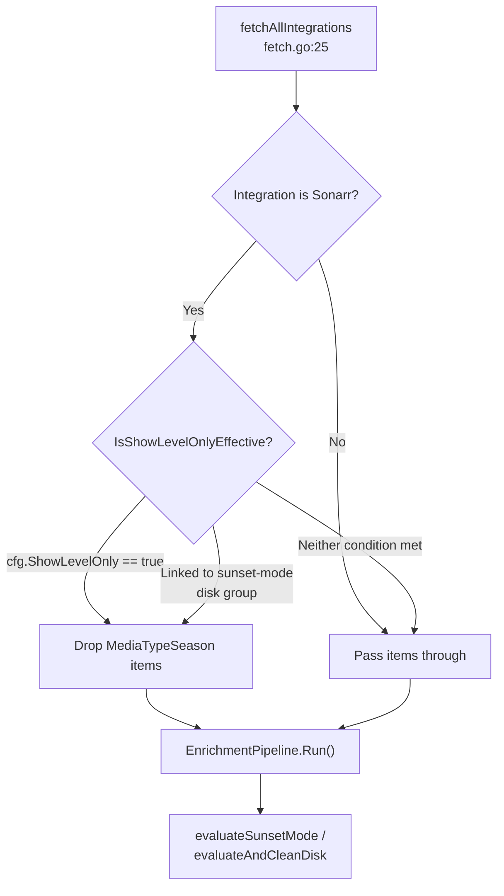
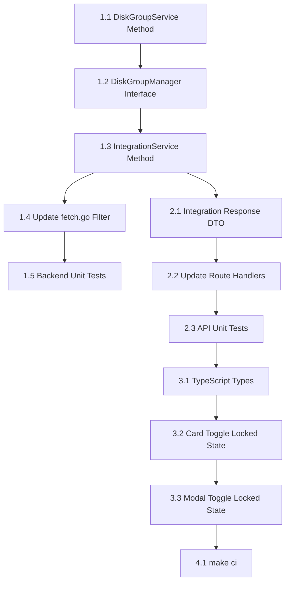

# Sunset Mode: Virtual Show-Level Override

**Status:** ✅ Complete  
**Priority:** Design Implementation  
**Estimated Effort:** M (1 day)  
**Branch:** `feature/sunset-virtual-show-level-override` (from `feature/3.0`)  
**Supersedes:** `docs/plans/00-active/20260330T2335Z-sunset-show-level-requirement.md`

## Summary

When sunset mode is enabled on a disk group, all linked Sonarr integrations must evaluate at the show level to prevent partial show removal (e.g., sunsetting seasons 1-2 while keeping 3-4). Rather than requiring users to manually toggle `ShowLevelOnly` or adding validation gates, the disk group's sunset mode toggle acts as the single decision maker — it forces show-level-only behavior on linked Sonarr integrations via a virtual override that never mutates the stored setting.

## Problem Statement

The Sonarr integration has a `ShowLevelOnly` setting (`IntegrationConfig.ShowLevelOnly`, `models.go:65`) that controls whether the engine operates on whole shows or individual seasons. When `ShowLevelOnly=false`, seasons flow through the pipeline individually. In sunset mode this creates:

- Partial show removal (seasons 1-2 sunset while 3-4 remain)
- User confusion ("why is it removing half my show?")
- Nonsensical media library state (nobody starts a show from season 3)

The original plan (`20260330T2335Z-sunset-show-level-requirement.md`) proposed explicit validation (reject sunset mode unless `ShowLevelOnly=true`) or implicit filtering (silently drop seasons in sunset mode). Both approaches have drawbacks — validation creates circular coupling between settings pages, and implicit filtering creates silent behavioral divergence.

## Design Decision

**The disk group's sunset mode toggle is the single decision maker.** Enabling sunset mode on a disk group forces show-level-only behavior on all linked Sonarr integrations through a virtual override. This avoids:

- Stored value mutation or "previous value" restoration logic
- Circular validation coupling between integration and disk group settings
- Validation errors blocking the user from enabling sunset mode
- Silent behavioral divergence where `ShowLevelOnly=false` means different things per mode
- Crash-recovery edge cases from mutating integration config as a side effect

### Why Show-Level Metrics Work Without Aggregation

The existing `ShowLevelOnly=true` data flow already provides complete show-level metrics from upstream systems — no aggregation from season data is needed within Capacitarr:

- **Sonarr** returns show-level `SizeOnDisk` (aggregate across all seasons) and `AddedAt` directly from the `/api/v3/series` endpoint (`sonarr.go:135-153`)
- **Tautulli** has a dedicated `GetShowWatchHistory()` code path for show-type items that queries with `grandparent_rating_key` to return show-wide play count, unique users, and most recent play date
- **Jellyfin** rolls up episode watch data into series-level entries via a two-pass approach in `BulkWatchEnricher`
- **Plex** returns show-level `ViewCount` and `LastViewedAt` directly from library items

The virtual override hooks into the same `fetch.go` filtering point that `ShowLevelOnly=true` already uses. The rest of the pipeline (enrichment, scoring, evaluation) operates identically.

## Architecture

### Engine Behavior



- The stored `ShowLevelOnly` value in the DB is never mutated by the override
- `IntegrationService.IsShowLevelOnlyEffective(id)` returns `true` if `ShowLevelOnly=true` OR if the integration is linked to any sunset-mode disk group
- The override applies as long as *any* linked disk group is in sunset mode — handles multi-group scenarios
- When no linked disk groups use sunset mode, the engine falls back to the stored value
- Radarr integrations are unaffected — the check only applies to Sonarr integrations (the only type that emits `MediaTypeSeason` items)

### Frontend Behavior

- When a Sonarr integration is linked to a sunset-mode disk group, the `ShowLevelOnly` toggle renders as enabled, locked, and dimmed
- An amber warning message underneath explains why, following the `logLevelOverridden` pattern in `SettingsAdvanced.vue:127-143`
- When sunset mode is disabled (and no other linked groups enforce it), the toggle unlocks and displays its stored state
- Both the integration card toggle and the add/edit modal toggle respect the locked state

### API Contract

The integration API response is enriched with override metadata:

```json
{
  "id": 1,
  "type": "sonarr",
  "showLevelOnly": false,
  "showLevelOnlyOverride": true,
  "showLevelOnlyOverrideReason": "Linked to sunset-mode disk group"
}
```

- `showLevelOnly` — always returns the user's stored preference (raw DB value)
- `showLevelOnlyOverride` — boolean, whether the override is currently active
- `showLevelOnlyOverrideReason` — string explaining why the override is active (empty when not overridden)

API consumers get full context: what the user chose vs. what the engine will actually do.

### Scope

- **Sunset mode only** — approval, auto-delete, and dry-run modes are unaffected
- **Sonarr integrations only** — Radarr has no show/season concept and does not emit `MediaTypeSeason` items

## Implementation

### Dependencies Between Steps



---

### Phase 1: Backend — Override Detection

#### Step 1.1 — Add `HasSunsetModeForIntegration` to DiskGroupService

**File:** `backend/internal/services/diskgroup.go`

- [x] Add method `HasSunsetModeForIntegration(integrationID uint) (bool, error)` to `DiskGroupService`
- [x] Query the `disk_group_integrations` junction table joined with `disk_groups` where `mode = 'sunset'` and `integration_id = ?`
- [x] Return `true` if any matching row exists, `false` otherwise
- [x] Follow the join pattern established in `ListWithIntegrations()` (`diskgroup.go:350-354`)

#### Step 1.2 — Extend `DiskGroupManager` Interface

**File:** `backend/internal/services/integration.go`

- [x] Add `HasSunsetModeForIntegration(integrationID uint) (bool, error)` to the `DiskGroupManager` interface (`integration.go:81-84`)
- [x] This allows `IntegrationService` to call the method through its existing `diskGroups` field without a direct dependency on `DiskGroupService`

#### Step 1.3 — Add `IsShowLevelOnlyEffective` to IntegrationService

**File:** `backend/internal/services/integration.go`

- [x] Add method `IsShowLevelOnlyEffective(id uint) (bool, error)` to `IntegrationService`
- [x] Logic: call `GetByID(id)` — if `cfg.ShowLevelOnly` is `true`, return `true` immediately
- [x] If `cfg.Type` is not `"sonarr"`, return the stored value (only Sonarr emits season items)
- [x] Otherwise, delegate to `s.diskGroups.HasSunsetModeForIntegration(id)` to check for sunset-mode disk groups
- [x] This keeps the `fetchAllIntegrations` function signature unchanged — it already receives `*services.IntegrationService`

#### Step 1.4 — Update `fetch.go` Filter Condition

**File:** `backend/internal/poller/fetch.go`

- [x] Replace the current `ShowLevelOnly` check at `fetch.go:89-103`:

  **Before:**
  ```go
  cfg, cfgErr := integrationSvc.GetByID(id)
  if cfgErr == nil && cfg.ShowLevelOnly {
  ```

  **After:**
  ```go
  effective, effErr := integrationSvc.IsShowLevelOnlyEffective(id)
  if effErr == nil && effective {
  ```

- [x] Update the `slog.Debug` message to indicate whether the filter was applied due to the stored setting or the sunset override
- [x] Remove the now-unnecessary `GetByID` call at this site (the effective check calls it internally)

#### Step 1.5 — Backend Unit Tests

**Files:** `backend/internal/services/diskgroup_test.go`, `backend/internal/services/integration_test.go`, `backend/internal/poller/fetch_test.go`

- [x] Test `HasSunsetModeForIntegration` returns `false` when integration is not linked to any disk group
- [x] Test `HasSunsetModeForIntegration` returns `false` when linked disk group is in `dry-run` mode
- [x] Test `HasSunsetModeForIntegration` returns `true` when linked disk group is in `sunset` mode
- [x] Test `HasSunsetModeForIntegration` returns `true` when integration is linked to multiple groups and only one is in sunset mode
- [x] Test `IsShowLevelOnlyEffective` returns `true` when `ShowLevelOnly=true` (regardless of disk group mode)
- [x] Test `IsShowLevelOnlyEffective` returns `true` when `ShowLevelOnly=false` but linked to sunset group
- [x] Test `IsShowLevelOnlyEffective` returns `false` when `ShowLevelOnly=false` and no sunset groups
- [x] Test `IsShowLevelOnlyEffective` returns the stored value for non-Sonarr integrations regardless of disk group mode
- [x] Follow existing test patterns: `testutil.SetupTestDB(t)`, `services.NewRegistry(database, bus, cfg)` (see `fetch_test.go:13-24`)
- [x] Use canonical media names per project rules: "Firefly" for shows

---

### Phase 2: Backend — API Response Enrichment

#### Step 2.1 — Create Integration Response DTO

**File:** `backend/internal/services/integration.go`

- [x] Add `IntegrationResponse` struct that embeds `db.IntegrationConfig` and adds override fields:

  ```go
  type IntegrationResponse struct {
      db.IntegrationConfig
      ShowLevelOnlyOverride       bool   `json:"showLevelOnlyOverride"`
      ShowLevelOnlyOverrideReason string `json:"showLevelOnlyOverrideReason"`
  }
  ```

- [x] Add method `GetWithOverrideState(id uint) (*IntegrationResponse, error)` to `IntegrationService`
  - Calls `GetByID(id)` for the stored config
  - Checks `HasSunsetModeForIntegration(id)` via `s.diskGroups`
  - Sets `ShowLevelOnlyOverride=true` and a reason string when the integration is Sonarr and linked to a sunset-mode disk group
- [x] Add method `ListWithOverrideState() ([]IntegrationResponse, error)` to `IntegrationService`
  - Calls `List()` for all integrations
  - Batch-checks sunset-mode linkage for all Sonarr integrations
  - Use a single query to fetch all sunset-linked integration IDs rather than N+1 per-integration queries

#### Step 2.2 — Update Route Handlers

**File:** `backend/routes/integrations.go`

- [x] Update `GET /integrations` handler (line 19) to call `ListWithOverrideState()` instead of `List()`
- [x] Update `GET /integrations/:id` handler (line 34) to call `GetWithOverrideState(id)` instead of `GetByID(id)`
- [x] Ensure API key masking continues to work with the new response struct
- [x] `POST`, `PUT`, and `DELETE` handlers return the config after mutation — update these to also include override state

#### Step 2.3 — API Unit Tests

**File:** `backend/routes/integrations_test.go` (or `backend/internal/services/integration_test.go`)

- [x] Test `GET /integrations` returns `showLevelOnlyOverride: false` for Sonarr integration not linked to sunset group
- [x] Test `GET /integrations` returns `showLevelOnlyOverride: true` with reason for Sonarr integration linked to sunset group
- [x] Test `GET /integrations` returns `showLevelOnlyOverride: false` for Radarr integration regardless of disk group mode
- [x] Test `GET /integrations/:id` returns correct override state
- [x] Test that `PUT /integrations/:id` response includes override state after update

---

### Phase 3: Frontend — Locked Toggle UI

#### Step 3.1 — Update TypeScript Types

**File:** `frontend/app/types/api.ts`

- [x] Add `showLevelOnlyOverride` and `showLevelOnlyOverrideReason` to `IntegrationConfig` interface (`api.ts:10-25`):

  ```typescript
  export interface IntegrationConfig {
    // ... existing fields ...
    showLevelOnly: boolean;
    showLevelOnlyOverride: boolean;
    showLevelOnlyOverrideReason: string;
    // ...
  }
  ```

#### Step 3.2 — Update Card Toggle with Locked State

**File:** `frontend/app/components/settings/SettingsIntegrations.vue`

- [x] Update the card-level `UiSwitch` for `showLevelOnly` (`SettingsIntegrations.vue:125-137`):
  - Add `:disabled="integration.showLevelOnlyOverride"` to the switch
  - When overridden, force the displayed checked state to `true` regardless of stored value
  - Prevent `toggleCardSetting` from firing when the override is active
- [x] Add amber warning text below the toggle following the `logLevelOverridden` pattern (`SettingsAdvanced.vue:127-143`):
  - `v-if="integration.showLevelOnlyOverride"`: `<p class="text-xs text-amber-500">{{ integration.showLevelOnlyOverrideReason }}</p>`
  - `v-else`: existing description text with `text-xs text-muted-foreground/70`

#### Step 3.3 — Update Modal Toggle with Locked State

**File:** `frontend/app/components/settings/SettingsIntegrations.vue`

- [x] Update the modal-level `UiSwitch` for `showLevelOnly` (`SettingsIntegrations.vue:308-331`):
  - When editing an existing integration with an active override, disable the switch and show it as checked
  - Add the same amber warning text pattern as the card toggle
  - When adding a new integration, the toggle should always be unlocked (new integrations are not yet linked to any disk group)
- [x] Ensure the `formState.showLevelOnly` initialization (`SettingsIntegrations.vue:621`) preserves the stored value, not the effective value — the override is display-only

---

### Phase 4: Verification

#### Step 4.1 — Run `make ci`

- [x] Run `make ci` and verify all lint, test, and security checks pass
- [x] Fix any issues before declaring work complete

## Key Files

| File | Change |
|------|--------|
| `backend/internal/services/diskgroup.go` | Add `HasSunsetModeForIntegration()`, add `SunsetLinkedIntegrationIDs()` for batch queries |
| `backend/internal/services/integration.go` | Extend `DiskGroupManager` interface (add `HasSunsetModeForIntegration`, `SunsetLinkedIntegrationIDs`), add `IsShowLevelOnlyEffective()`, add `IntegrationResponse` DTO, add `GetWithOverrideState()`, add `ListWithOverrideState()` |
| `backend/internal/poller/fetch.go` | Replace `ShowLevelOnly` check with `IsShowLevelOnlyEffective()` |
| `backend/routes/integrations.go` | Use enriched response methods in GET handlers |
| `frontend/app/types/api.ts` | Add override fields to `IntegrationConfig` |
| `frontend/app/components/settings/SettingsIntegrations.vue` | Card + modal toggle locked state with amber warning |

## Files Unchanged (Reference Only)

| File | Reason |
|------|--------|
| `backend/internal/db/models.go` | No schema changes — `ShowLevelOnly` stored value is never mutated |
| `backend/internal/poller/evaluate.go` | No changes — `evaluateSunsetMode` receives already-filtered items from `fetch.go` |
| `frontend/app/components/rules/RuleDiskThresholds.vue` | No changes — sunset mode toggle behavior is unchanged |

## Risks and Mitigations

| Risk | Mitigation |
|------|------------|
| N+1 queries when listing integrations with override state | `ListWithOverrideState()` uses a single batch query to fetch all sunset-linked integration IDs |
| `DiskGroupManager` interface change breaks existing implementations | Only `DiskGroupService` implements the interface; the change is internal |
| Override state is stale if disk group mode changes mid-poll | The check happens at fetch time (start of each poll cycle), so it reflects the current mode |
| Junction table not yet populated on first run | `SyncIntegrationLinks` runs every poll cycle (`poller.go:304-308`); if no links exist, the override returns `false` which is the correct default |
