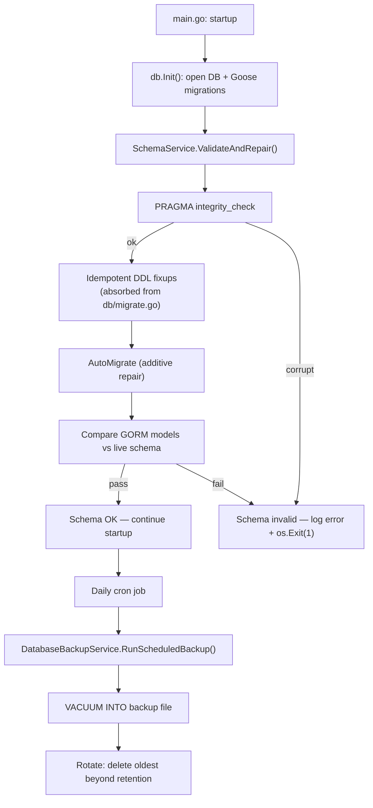

# Automatic Database Backup and Startup Schema Validation

**Status:** ✅ Complete
**Created:** 2026-04-05T04:27Z
**Category:** Feature (02-features)
**Estimated Effort:** L (2–3 days)

## Problem

Capacitarr has no automatic database backup mechanism. If the SQLite file is corrupted (power loss, Docker crash, full disk, WAL corruption), the user loses all configuration, audit history, queue state, and analytics data. The only existing backup is the manual JSON settings export, which:

1. Must be initiated by the user (most won't do it regularly)
2. Only covers settings — not audit logs, queue items, history, or media cache
3. Cannot restore a corrupted SQLite file

Additionally, there is no startup schema validation. If a migration partially applies, or the database file is swapped/corrupted, the application starts and fails at runtime with cryptic GORM errors instead of a clear diagnostic at boot.

## Solution

Three new components:

1. **`DatabaseBackupService`** — Performs daily `VACUUM INTO` backups of the live SQLite database with rotation. Runs as a cron job while the app is healthy, producing a rolling window of known-good database snapshots.

2. **`SchemaService`** — Validates database integrity and schema correctness at startup. Runs `PRAGMA integrity_check`, compares live schema against GORM model definitions, and attempts automatic repair via `AutoMigrate` for missing tables/columns. Hard stops the application if validation fails after repair, pointing the user to the most recent automatic backup.

3. **Backup retention preference** — User-configurable setting in the Advanced tab controlling how many daily backups to retain, with sensible defaults.

### Architecture



### Backup Directory Structure

```
/config/
├── capacitarr.db                          # Live database
└── backups/
    ├── capacitarr-20260401.db             # Daily backup (oldest)
    ├── capacitarr-20260402.db
    ├── capacitarr-20260403.db
    ├── capacitarr-20260404.db
    └── capacitarr-20260405.db             # Daily backup (newest)
```

### Retention Options

| Option | Value | Description |
|--------|-------|-------------|
| 3 days | `3` | Minimal — saves disk space |
| 7 days | `7` | **Default** — covers a full week |
| 14 days | `14` | Two weeks — catches slow-onset issues |
| 30 days | `30` | Monthly — maximum safety |

The retention value is stored in `PreferenceSet.BackupRetentionDays` (default 7). The backup cron job reads this preference before rotating.

## Code Consolidation

The `SchemaService` absorbs existing schema introspection and DDL fixup code currently scattered across `internal/db/migrate.go` and `internal/migration/detect.go`. This consolidation gives the project a single owner for "is the schema correct, and if not, fix it."

### Moved into SchemaService

| Current Location | Function | Why |
|-----------------|----------|-----|
| `db/migrate.go:147` | `hasColumnInTable()` | Generic schema introspection utility — becomes an internal method of `SchemaService` |
| `db/migrate.go:134` | `tableColumnCheckers` map | Replaced by the model-driven approach — `SchemaService` iterates GORM models instead of maintaining a hardcoded table map |
| `db/migrate.go:68` | `fixupEngineRunStats()` | Post-migration DDL repair — belongs with the service that owns "make the schema correct" |
| `db/migrate.go:104` | `fixupDefaultDiskGroupModeRename()` | Same reasoning — schema correction logic co-located with validation |
| `migration/detect.go:140` | `tableExists()` | Duplicates GORM's `migrator.HasTable()` — consolidated into the service's model-driven checks |

After this move, `RunMigrations()` in `db/migrate.go` becomes a thin Goose-only wrapper. The post-migration fixup calls are removed from it and instead run as part of `SchemaService.ValidateAndRepair()` (fixups → `AutoMigrate` → validate).

### Stays in place

| Item | Reason |
|------|--------|
| `BackupService` (`services/backup.go`) | Settings JSON export/import — different domain from database-level backup |
| `MigrationService` (`services/migration.go`) | 1.x → 2.0 data migration workflow — distinct lifecycle, will be deprecated when 1.x support is dropped |
| `DataService` (`services/data.go`) | DML only (data reset), no schema operations |
| `RunMigrations()` / Goose in `db/migrate.go` | Goose is the authoritative migration tool — stays in `db/`, but simplified to Goose-only |
| `buildDSN()` / journal_mode check in `db/db.go` | Connection-level concerns tightly coupled to `db.Init()` |
| `DetectLegacySchema()` / `ConfirmNotV2()` in `migration/detect.go` | 1.x detection logic — used only by the legacy migration path in `main.go`, not schema validation |
| `BackupSourceDatabase()` / `RemoveBackup()` in `migration/migrate.go` | 1.x-specific file rename, not general-purpose backup |

### Nothing moves into DatabaseBackupService

The existing backup code in `internal/migration/` is 1.x-specific (`BackupSourceDatabase` renames the old database file during the 1.x → 2.0 upgrade). That is a one-time migration concern, not general-purpose backup infrastructure. The `DatabaseBackupService` is genuinely new capability — `VACUUM INTO`, file rotation, retention management. The 1.x migration code stays where it is.

## Implementation Plan

### Phase 1: Backend — DatabaseBackupService

#### Step 1.1: Add `BackupRetentionDays` to PreferenceSet

- Add field to `db.PreferenceSet`: `BackupRetentionDays int \`gorm:"default:7;not null" json:"backupRetentionDays"\``
- Add default value in `db.Init()` seed: `BackupRetentionDays: 7`
- Add to `PreferencesExport` struct in `backup.go` for settings export/import
- Add to `importPreferences()` in `backup.go` for settings restore

**Key files:**
- `backend/internal/db/models.go` — `PreferenceSet` struct
- `backend/internal/db/db.go` — `Init()` default seed
- `backend/internal/services/backup.go` — `PreferencesExport` and import/export logic

#### Step 1.2: Create DatabaseBackupService

- New file: `backend/internal/services/database_backup.go`
- Constructor: `NewDatabaseBackupService(database *gorm.DB, bus *events.EventBus, dbPath string)`
- Fields: `*gorm.DB`, `*events.EventBus`, `dbPath string`, `backupDir string`
- `backupDir` derived as `filepath.Join(filepath.Dir(dbPath), "backups")`

Methods:

| Method | Purpose |
|--------|---------|
| `RunScheduledBackup() error` | Main entry: create backup dir, execute VACUUM INTO, rotate old backups |
| `vacuumInto(destPath string) error` | Execute `VACUUM INTO ?` via `s.db.Exec()` (GORM's Exec — consistent with service-layer convention) |
| `rotate(retentionDays int) error` | List backup files, parse dates, delete those older than retention |
| `ListBackups() ([]BackupInfo, error)` | Return available backups with dates and sizes (for future API/UI) |
| `LatestBackupPath() (string, error)` | Return path to most recent backup (used by SchemaService error messages) |

Backup filename format: `capacitarr-YYYYMMDD.db`

Only one backup per calendar day — re-running on the same day overwrites the existing backup for that day (prevents unbounded growth if the cron fires multiple times).

**Service method:** `DatabaseBackupService.RunScheduledBackup()` reads `BackupRetentionDays` from `SettingsService.GetPreferences()` to determine how many backups to keep. This requires a lazy dependency on `SettingsService` (wired via `SetSettingsService()` after construction, same pattern as other services).

#### Step 1.3: Wire DatabaseBackupService into Registry

- Add `DatabaseBackup *DatabaseBackupService` to `services.Registry`
- Construct in `NewRegistry()` with `cfg.Database` path
- Wire `SettingsService` dependency via `SetSettingsService()`
- Add to `Validate()` wireable checks

**Key files:**
- `backend/internal/services/registry.go`

#### Step 1.4: Add daily backup cron job

- Add job to `jobs.Start()`: run `reg.DatabaseBackup.RunScheduledBackup()` on `@daily` schedule
- Log success/failure with backup path, file size, and backups retained/pruned

**Key files:**
- `backend/internal/jobs/cron.go`

#### Step 1.5: Run initial backup on first startup

- In `main.go`, after `db.Init()` and service registry construction, call `reg.DatabaseBackup.RunScheduledBackup()` once
- This ensures a backup exists immediately, before the first daily cron fires
- If the backup fails (e.g., read-only filesystem), log a warning but don't block startup — the database itself is still usable

#### Step 1.6: Add new event types

- `DatabaseBackupCompletedEvent` — published on successful backup with `Path`, `SizeBytes`, `BackupsRetained`
- `DatabaseBackupFailedEvent` — published on backup failure with `Error`

**Key files:**
- `backend/internal/events/types.go`

#### Step 1.7: Unit tests for DatabaseBackupService

- New file: `backend/internal/services/database_backup_test.go`
- Test `VACUUM INTO` produces a valid SQLite file
- Test rotation keeps exactly N days of backups
- Test same-day backup overwrites (no duplicates)
- Test `ListBackups()` returns sorted results
- Test `LatestBackupPath()` returns most recent
- Test behavior when backup directory doesn't exist (auto-created)
- Use `t.TempDir()` for a file-based SQLite database — `VACUUM INTO` cannot operate on `:memory:` databases, so these tests require a real file path (e.g., `filepath.Join(t.TempDir(), "capacitarr.db")`)

### Phase 2: Backend — SchemaService

#### Step 2.1: Create SchemaService

- New file: `backend/internal/services/schema.go`
- Constructor: `NewSchemaService(database *gorm.DB)`
- `SchemaService` is a **bootstrap component**, not a registry service. It runs once during startup (after Goose, before `NewRegistry()`), does not publish events, does not implement `Wired()`, and is not added to `services.Registry`. This follows the same pattern as `db.SeedFactorWeights()` and `migration.ImportAuthOnly()` — pre-registry operations that use a raw `*gorm.DB` handle.

Methods:

| Method | Purpose |
|--------|---------|
| `ValidateAndRepair() (*SchemaReport, error)` | Full startup sequence: integrity → fixups → AutoMigrate repair → validate |
| `checkIntegrity() error` | Run `PRAGMA integrity_check` — returns error if not "ok" |
| `runFixups() error` | Execute idempotent post-migration DDL fixups (absorbed from `db/migrate.go`) |
| `repair() []string` | Run `AutoMigrate` on all GORM models — returns list of changes made |
| `validate() []SchemaError` | Compare live schema against GORM model expectations |
| `hasColumn(tableName, column string) bool` | Check column existence via `PRAGMA table_info` (absorbed from `db/migrate.go`) |

`SchemaReport` struct:

```go
type SchemaReport struct {
    IntegrityOK    bool
    FixupsApplied  []string     // e.g., "renamed engine_run_stats.flagged → candidates"
    RepairsApplied []string     // e.g., "created table media_cache", "added column sunset_queue.saved_reason"
    Errors         []SchemaError // non-empty = fatal, app must not start
}
```

`SchemaError` struct:

```go
type SchemaError struct {
    Table   string
    Column  string
    Problem string // "missing_table", "missing_column"
}
```

#### Step 2.2: Absorb post-migration fixups from db/migrate.go

Move the following into `SchemaService` as private methods:

- `fixupEngineRunStats()` → `SchemaService.fixupEngineRunStats()` — renames `flagged` → `candidates`, adds `queued` column
- `fixupDefaultDiskGroupModeRename()` → `SchemaService.fixupDefaultDiskGroupModeRename()` — renames `execution_mode` → `default_disk_group_mode`
- `hasColumnInTable()` → `SchemaService.hasColumn()` — generalized to accept any table name via `PRAGMA table_info` instead of requiring a hardcoded `tableColumnCheckers` entry
- Remove `tableColumnCheckers` map entirely — the hardcoded two-table registry is replaced by a generic `hasColumn()` that works for any table

After this move, `RunMigrations()` in `db/migrate.go` is simplified to:

```go
func RunMigrations(sqlDB *sql.DB) error {
    goose.SetBaseFS(embedMigrations)
    if err := goose.SetDialect("sqlite3"); err != nil {
        return fmt.Errorf("goose set dialect: %w", err)
    }
    if err := goose.Up(sqlDB, "migrations"); err != nil {
        return fmt.Errorf("goose up: %w", err)
    }
    slog.Info("Database migrations applied successfully", "component", "db")
    return nil
}
```

The `SchemaService.ValidateAndRepair()` sequence becomes:

1. `checkIntegrity()` — PRAGMA integrity_check
2. `runFixups()` — idempotent DDL fixups (the absorbed code)
3. `repair()` — AutoMigrate for any remaining gaps
4. `validate()` — final verification

This co-locates all "make the schema correct" logic in one service instead of splitting it between Goose post-hooks and a separate validation pass.

#### Step 2.3: Define the GORM model list

- Central `allModels` variable listing every GORM model struct, used by both `repair()` and `validate()`
- Must include all models from `models.go`: `AuthConfig`, `DiskGroup`, `IntegrationConfig`, `DiskGroupIntegration`, `LibraryHistory`, `PreferenceSet`, `ScoringFactorWeight`, `CustomRule`, `ApprovalQueueItem`, `SunsetQueueItem`, `AuditLogEntry`, `EngineRunStats`, `LifetimeStats`, `NotificationConfig`, `ActivityEvent`, `RollupState`, `MediaCache`, `MediaServerMapping`
- New models added in the future must be appended to this list — add a test to verify it stays in sync

#### Step 2.4: Implement validation logic

- For each model in `allModels`:
  1. Check `migrator.HasTable(model)` — if missing and `AutoMigrate` didn't create it, report `missing_table`
  2. For each field in the GORM model, check `migrator.HasColumn(model, field)` — if missing, report `missing_column`
- Skip type checking (SQLite type affinity makes this unreliable and low-value)
- Extra columns in the database that aren't in the GORM model are logged as `slog.Warn` but not treated as errors (common after version downgrade)

#### Step 2.5: Wire SchemaService into startup

- In `main.go`, after `db.Init()` returns and before service registry construction:
  1. Construct `SchemaService` with the database handle
  2. Call `ValidateAndRepair()`
  3. If `!report.IntegrityOK`: log error with recovery instructions pointing to `/config/backups/`, `os.Exit(1)`
  4. If `len(report.FixupsApplied) > 0`: log each fixup as `slog.Info`
  5. If `len(report.RepairsApplied) > 0`: log each repair as `slog.Info`
  6. If `len(report.Errors) > 0`: log each error, log recovery instructions, `os.Exit(1)`

Error message format:

```
ERROR Schema validation failed after repair attempt
      Missing column: sunset_queue.saved_reason
      Missing table: media_server_mappings

      To recover, restore from an automatic backup:
        1. Stop the container
        2. Copy /config/backups/capacitarr-20260404.db to /config/capacitarr.db
        3. Restart the container

      If no backups are available, delete /config/capacitarr.db and restart
      to create a fresh database (all data will be lost).
```

#### Step 2.6: Unit tests for SchemaService

- New file: `backend/internal/services/schema_test.go`
- Test `checkIntegrity()` passes on a healthy in-memory DB
- Test `validate()` passes after standard `RunMigrations()` + `ValidateAndRepair()`
- Test `repair()` adds a missing column (drop a column via raw SQL, verify repair adds it back)
- Test `repair()` creates a missing table (drop a table, verify repair creates it)
- Test `validate()` catches a missing column that `AutoMigrate` couldn't fix (simulate by comparing against a model with a new required field)
- Test `allModels` list matches the models used in migrations (count tables)
- Test fixups are idempotent (run `runFixups()` twice — second run is a no-op)
- Test `hasColumn()` works for any table (not just the two that were hardcoded in `tableColumnCheckers`)

### Phase 3: Backend API + Preference Wiring

#### Step 3.1: Add BackupRetentionDays to PATCH /preferences/advanced

- Add `BackupRetentionDays *int` to `AdvancedPreferencePatch` struct in `settings.go`
- Add validation in route handler: must be one of `3, 7, 14, 30`
- Add handling in `PatchAdvancedPreferences()` service method

**Key files:**
- `backend/internal/services/settings.go` — `AdvancedPreferencePatch`, `PatchAdvancedPreferences()`
- `backend/routes/preferences.go` — `PATCH /preferences/advanced` handler

#### Step 3.2: Add BackupRetentionDays to GET /preferences response

- Already included via `db.PreferenceSet` JSON serialization — no code change needed
- Verify the field appears in the response

#### Step 3.3: Include in settings export/import

- Add `BackupRetentionDays` to `PreferencesExport` struct
- Add to `Export()` method's preferences mapping
- Add to `importPreferences()` method

**Key files:**
- `backend/internal/services/backup.go`

### Phase 4: Frontend

#### Step 4.1: Add TypeScript type

- Add `backupRetentionDays: number` to `PreferenceSet` interface in `frontend/app/types/api.ts`

#### Step 4.2: Add backup retention to Advanced settings

- Add a new dropdown in the **Data Management** card in `SettingsAdvanced.vue`, below the existing Audit Log Retention dropdown
- Options: `3 days`, `7 days (default)`, `14 days`, `30 days`
- Add `backupRetention` to `initFields()` call
- Add `SaveIndicator` for the field
- Add reactive state: `const backupRetentionDays = ref(7)`
- Add computed string adapter (selects use string values):
  ```typescript
  const backupRetentionStr = computed({
    get: () => String(backupRetentionDays.value),
    set: (val: string) => { backupRetentionDays.value = Number(val) },
  })
  ```
- Add watcher (consistent with existing `retentionDays` watcher pattern):
  ```typescript
  watch(backupRetentionDays, (newVal, oldVal) => {
    if (oldVal !== undefined && newVal !== oldVal) {
      patchPreference('backupRetention', 'advanced', 'backupRetentionDays', newVal)
    }
  })
  ```
- Fetch on mount in `fetchPreferences()`:
  ```typescript
  if (prefs?.backupRetentionDays !== undefined) {
    backupRetentionDays.value = prefs.backupRetentionDays
  }
  ```

**Key files:**
- `frontend/app/components/settings/SettingsAdvanced.vue`

#### Step 4.3: Add i18n translation keys

Add to `frontend/app/locales/en.json`:

```json
"settings.backupRetention": "Database Backup Retention",
"settings.backupRetentionDesc": "How many days of automatic database backups to keep. Backups are created daily and stored in /config/backups/."
```

Update `settings.dataManagementDesc` to reflect the expanded scope:

```json
"settings.dataManagementDesc": "Configure audit log and database backup retention"
```

### Phase 5: Testing

#### Step 5.1: Integration test — full backup + rotation flow

- Create a temp database, seed data, run `RunScheduledBackup()` multiple times with different dates
- Verify rotation respects retention setting
- Verify backup files are valid SQLite databases (open and query them)

#### Step 5.2: Integration test — schema validation after migrations

- Run `db.Init()` on a fresh in-memory DB
- Run `SchemaService.ValidateAndRepair()` — must return zero errors
- Verify all tables and columns from `allModels` are present

#### Step 5.3: Ensure `make ci` passes

- Run `make ci` to verify lint, test, and security checks all pass
- Fix any issues before declaring complete

## Files Changed

### New Files
- `backend/internal/services/database_backup.go`
- `backend/internal/services/database_backup_test.go`
- `backend/internal/services/schema.go`
- `backend/internal/services/schema_test.go`

### Modified Files

| File | Changes |
|------|---------|
| `backend/internal/db/models.go` | Add `BackupRetentionDays` field to `PreferenceSet` |
| `backend/internal/db/db.go` | Add `BackupRetentionDays: 7` to default seed |
| `backend/internal/db/validation.go` | Add `ValidBackupRetentionDays` map (`3, 7, 14, 30`) |
| `backend/internal/db/migrate.go` | Remove `fixupEngineRunStats()`, `fixupDefaultDiskGroupModeRename()`, `hasColumnInTable()`, `tableColumnCheckers` — absorbed by `SchemaService`. Simplify `RunMigrations()` to Goose-only. `RunMigrationsDown()` stays (test utility). |
| `backend/internal/events/types.go` | Add `DatabaseBackupCompletedEvent`, `DatabaseBackupFailedEvent` |
| `backend/internal/services/registry.go` | Add `DatabaseBackup *DatabaseBackupService` field, construct in `NewRegistry()`, wire `SetSettingsService()`, add to `Validate()` wireable checks. `SchemaService` is NOT on the registry — it is a one-shot bootstrap component in `main.go`. |
| `backend/internal/services/settings.go` | Add `BackupRetentionDays` to `AdvancedPreferencePatch` and `PatchAdvancedPreferences()` |
| `backend/internal/services/backup.go` | Add `BackupRetentionDays` to `PreferencesExport`, export, and import logic |
| `backend/internal/jobs/cron.go` | Add daily backup cron job |
| `backend/routes/preferences.go` | Add `backupRetentionDays` validation to `PATCH /preferences/advanced` |
| `backend/main.go` | Wire `SchemaService.ValidateAndRepair()` after `db.Init()`, trigger initial backup after registry construction |
| `frontend/app/types/api.ts` | Add `backupRetentionDays` to `PreferenceSet` interface |
| `frontend/app/components/settings/SettingsAdvanced.vue` | Add backup retention dropdown to Data Management card |
| `frontend/app/locales/en.json` | Add backup retention translation keys, update data management description |

## Design Notes

- `VACUUM INTO` is the SQLite-recommended approach for live database backup. It produces a consistent, defragmented copy without requiring the database to be closed or locked. It works correctly with WAL mode.
- Backup files are full SQLite databases — the user can restore by simply copying one over the live database file. No special tooling or import process needed.
- **`SchemaService` is a bootstrap component, not a registry service.** It is constructed with `NewSchemaService(database *gorm.DB)` — no `*events.EventBus`, no `Wired()` implementation, not added to `services.Registry`. It runs once during startup (after Goose, before `NewRegistry()`), performs its validation/repair, and is discarded. This follows the same pattern as `db.SeedFactorWeights()` and `migration.ImportAuthOnly()` — pre-registry operations that use a raw `*gorm.DB` handle.
- **`DatabaseBackupService` is a standard registry service.** It follows the canonical pattern: constructor takes `(database *gorm.DB, bus *events.EventBus, dbPath string)`, implements `Wired()` for its `SettingsService` dependency, is constructed in `NewRegistry()`, and is validated by `Registry.Validate()`.
- `AutoMigrate` is additive only — it never drops tables, columns, or data. It can create missing tables, add missing columns with defaults, and create missing indexes. This makes it safe to run on every startup as a repair step.
- The one failure mode `AutoMigrate` cannot fix is SQLite file corruption (broken B-tree pages, truncated WAL). `PRAGMA integrity_check` detects this, and the error message directs the user to restore from an automatic backup.
- Backup retention options (3/7/14/30) are intentionally few and preset rather than a free-form number input. This prevents footgun values like 0 (no backups) or 365 (fills disk on constrained home lab storage). Route handler validation uses a `ValidBackupRetentionDays` map in `db/validation.go`, consistent with the existing `ValidLogLevels`, `ValidExecutionModes`, etc. pattern.
- **Consolidation rationale:** The post-migration fixups (`fixupEngineRunStats`, `fixupDefaultDiskGroupModeRename`) and schema introspection utilities (`hasColumnInTable`, `tableColumnCheckers`) were previously embedded in `db/migrate.go` — a package that also owns Goose migration orchestration. Moving them into `SchemaService` co-locates all "is the schema correct?" logic in one service, simplifies `RunMigrations()` to a pure Goose wrapper, and eliminates the hardcoded `tableColumnCheckers` map in favor of a generic `hasColumn()` that works for any table. The fixups still run in the same position in the startup sequence (after Goose, before the app starts), but now as part of `ValidateAndRepair()` rather than as Goose post-hooks.
- **No consolidation into DatabaseBackupService:** The existing `BackupSourceDatabase()` / `RemoveBackup()` in `internal/migration/` are 1.x-specific file rename operations, not general-purpose backup infrastructure. They remain in the migration package. The `BackupService` in `services/backup.go` handles JSON settings export/import — a different domain entirely. Neither is related to the new `VACUUM INTO` database backup capability.
