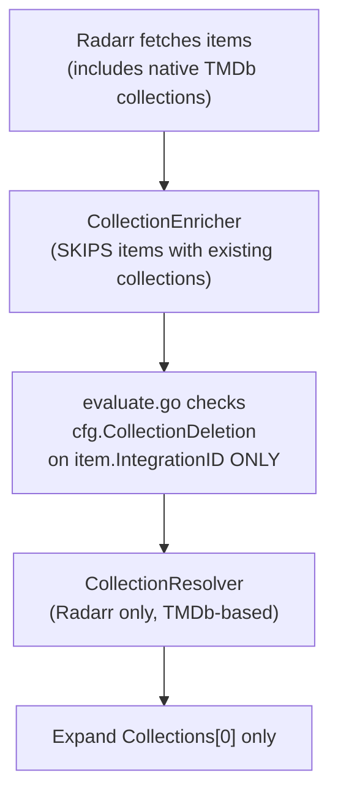
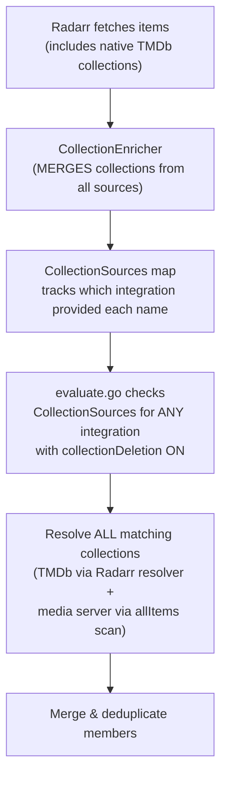

# Collection Deletion — End-to-End Audit & Remediation

**Status:** ✅ Complete
**Branch:** `audit/collection-deletion`
**Depends on:** Working Radarr/Plex/Jellyfin/Emby integrations

## Problem

The collection deletion feature allows all items in a media collection to be deleted together when one member is selected for deletion. A codebase audit found the feature is partially implemented — the core pipeline works for Radarr-only TMDb collections, but several gaps exist:

1. **Media server toggles are no-ops**: The `collectionDeletion` toggle on Plex/Jellyfin/Emby is stored but never checked during evaluation. Only the *arr integration's toggle matters.
2. **Enrichment is exclusive**: The `CollectionEnricher` skips items that already have collections from a higher-priority source (Radarr). An item in both a TMDb collection and a Plex collection only gets the TMDb data.
3. **No collection source tracking**: `MediaItem.Collections` is a flat `[]string` with no attribution — there is no way to know which integration provided which collection name.
4. **Approval queue has no collection awareness**: Collection members appear as individual entries with no visual grouping or bulk approve/reject.
5. **No test coverage**: Zero tests for collection expansion, resolution, or enrichment.

## Design Decisions

| # | Decision | Choice |
|---|----------|--------|
| 1 | Media server toggle behavior | **Multi-source**: evaluation checks ALL integration configs. If Plex toggle is ON, Plex-sourced collections trigger group deletion — even if Radarr toggle is OFF. |
| 2 | Multiple collections on one item | **Expand all**: if an item belongs to multiple collections and multiple sources have toggles ON, ALL matching collections expand. |
| 3 | Approval queue grouping | **Bulk approve/reject + visual grouping**: approving one collection member approves all members in the group. UI shows collection badge and group indicator. |
| 4 | Test coverage | **Tests follow the fixes**: write tests for each changed component as part of the implementation. |
| 5 | Danger documentation | **Explicit warnings**: help page gets expanded warnings about risks of collection deletion, especially with user-created media server collections. |

## Architecture: Current vs Target

### Current Flow



### Target Flow



## Implementation Plan

### Phase 1: Collection Source Tracking & Multi-Source Enrichment

#### Step 1.1 — Add `CollectionSources` to `MediaItem`

**File:** [`integrations/types.go`](capacitarr/backend/internal/integrations/types.go:173)

Add an internal-only field to `MediaItem` that maps each collection name to the integration ID that provided it:

```go
Collections       []string        `json:"collections,omitempty"`
CollectionSources map[string]uint `json:"-"` // Internal: collection name → source integration ID
```

The `json:"-"` tag prevents serialization — this is evaluation-internal data only.

#### Step 1.2 — Radarr: populate `CollectionSources` on item construction

**File:** [`integrations/radarr.go`](capacitarr/backend/internal/integrations/radarr.go:124)

When Radarr populates items with native TMDb collection data, also set the source:

```go
var collections []string
var collectionSources map[string]uint
if m.Collection != nil && m.Collection.Name != "" {
    collections = []string{m.Collection.Name}
    collectionSources = map[string]uint{m.Collection.Name: r.IntegrationID}
}
```

This requires `RadarrClient` to know its own integration ID — check if it's already available or needs to be added to the constructor.

#### Step 1.3 — CollectionEnricher: merge instead of skip, track sources

**File:** [`integrations/enrichers.go`](capacitarr/backend/internal/integrations/enrichers.go:355)

Changes to `CollectionEnricher`:

1. Add `integrationID uint` to the struct (passed from the enricher registration that knows the provider's integration ID).
2. Remove the `if len(item.Collections) > 0 { continue }` skip at [line 389](capacitarr/backend/internal/integrations/enrichers.go:389).
3. Instead, **merge** new collections, deduplicating names that already exist.
4. Set `CollectionSources[name] = e.integrationID` for each newly added collection.

The enricher registration at [line 470](capacitarr/backend/internal/integrations/enrichers.go:470) needs to pass the integration ID:

```go
for id, provider := range registry.CollectionDataProviders() {
    pipeline.Add(NewCollectionEnricher("Collection Data", 50, id, provider))
}
```

#### Step 1.4 — Tests for Step 1.1–1.3

- **`enrichers_test.go`**: New tests for `CollectionEnricher`:
  - Enriches items with no existing collections
  - Merges collections when item already has some (no duplicates)
  - Sets `CollectionSources` correctly for each added collection
  - Preserves existing `CollectionSources` from prior enrichers

### Phase 2: Multi-Source Evaluation

#### Step 2.1 — evaluate.go: check all collection sources

**File:** [`poller/evaluate.go`](capacitarr/backend/internal/poller/evaluate.go:205)

Replace the current single-integration check:

```go
// Current (BEFORE):
cfg := getIntegrationConfig(ev.Item.IntegrationID)
if cfg != nil && cfg.CollectionDeletion && len(ev.Item.Collections) > 0 {
    collectionName := ev.Item.Collections[0]
```

With multi-source, multi-collection logic:

```go
// New (AFTER):
// Find all collections where the source integration has collectionDeletion ON.
var enabledCollections []string
for _, colName := range ev.Item.Collections {
    sourceID, ok := ev.Item.CollectionSources[colName]
    if !ok {
        sourceID = ev.Item.IntegrationID // fallback: assume item's own integration
    }
    sourceCfg := getIntegrationConfig(sourceID)
    if sourceCfg != nil && sourceCfg.CollectionDeletion {
        enabledCollections = append(enabledCollections, colName)
    }
}
if len(enabledCollections) > 0 {
    // Process ALL enabled collections...
}
```

#### Step 2.2 — evaluate.go: multi-collection expansion

**File:** [`poller/evaluate.go`](capacitarr/backend/internal/poller/evaluate.go:206)

For each enabled collection, resolve members. Use two resolution strategies:

1. **TMDb resolver** (Radarr): if `CollectionResolver(ev.Item.IntegrationID)` exists, use it for the collection name.
2. **allItems scan** (media server collections): scan the `allItems` parameter (already available in `evaluateAndCleanDisk`) for other items with the same collection name. This handles Plex/Jellyfin/Emby collections without a dedicated resolver.

Merge all resolved members, deduplicate by `ExternalID + IntegrationID`, and use the union as the expanded set.

The `collectionGroup` field should be set to a joined string if multiple collections triggered (e.g., `"Firefly Collection, Family Movie Night"`).

Update the `expandedCollections` tracking to handle the per-collection dedup properly.

#### Step 2.3 — Tests for Step 2.1–2.2

- **`evaluate_test.go`**: New tests for collection expansion:
  - Single collection from Radarr with toggle ON → expands
  - Single collection from Radarr with toggle OFF → does not expand
  - Collection from Plex (media server) with Plex toggle ON → expands via allItems scan
  - Plex toggle ON, Radarr toggle OFF → Plex-sourced collection expands, Radarr-sourced does not
  - Multiple collections on one item → both expand, members merged
  - Protected member blocks entire expansion
  - Snoozed member blocks entire expansion
  - Already-expanded collection skipped (dedup)

### Phase 3: Approval Queue — Bulk Operations & Visual Grouping

#### Step 3.1 — Backend: `ApproveGroup()` and `RejectGroup()`

**File:** [`services/approval.go`](capacitarr/backend/internal/services/approval.go)

Add two new methods following the existing `Approve()`/`Reject()` patterns:

```go
// ApproveGroup approves all pending items with the given CollectionGroup.
func (s *ApprovalService) ApproveGroup(collectionGroup string) ([]db.ApprovalQueueItem, error)

// RejectGroup rejects all pending items with the given CollectionGroup.
func (s *ApprovalService) RejectGroup(collectionGroup string, snoozeDurationHours int) ([]db.ApprovalQueueItem, error)
```

These query `WHERE collection_group = ? AND status = ?` and apply the same state transitions as the single-item methods. Publish events for each affected item.

#### Step 3.2 — Backend: API routes for group operations

**File:** [`routes/approval.go`](capacitarr/backend/routes/approval.go)

Add new routes:

```
POST /api/v1/approval-queue/group/:collectionGroup/approve
POST /api/v1/approval-queue/group/:collectionGroup/reject
```

These call `reg.Approval.ApproveGroup()` and `reg.Approval.RejectGroup()` respectively. The `:collectionGroup` parameter is URL-decoded to handle spaces in collection names.

#### Step 3.3 — Frontend: approval queue visual grouping

**File:** [`ApprovalQueueCard.vue`](capacitarr/frontend/app/components/ApprovalQueueCard.vue)

- Add indigo collection badge (matching audit log and library table style) when `item.collectionGroup` is non-empty.
- Group items with the same `collectionGroup` visually (shared border/background, count indicator like "3 items in Firefly Collection").
- Add "Approve Group" / "Reject Group" buttons that call the group API endpoints.

**File:** [`useApprovalQueue.ts`](capacitarr/frontend/app/composables/useApprovalQueue.ts)

- Add `approveGroup(collectionGroup: string)` and `rejectGroup(collectionGroup: string, snoozeDurationHours: number)` functions.
- Computed property to group queue items by `collectionGroup` for display.

#### Step 3.4 — Frontend: deletion queue collection indicator

**File:** [`DeletionQueueCard.vue`](capacitarr/frontend/app/components/DeletionQueueCard.vue)

- Add indigo collection badge when `item.collectionGroup` is non-empty (matching existing badge style from audit log panel).

#### Step 3.5 — Tests for Step 3.1–3.2

- **`approval_test.go`**: Tests for `ApproveGroup()` and `RejectGroup()`:
  - Approves all pending items in the group
  - Skips non-pending items (already approved/rejected)
  - Returns error when no matching items found
  - Publishes events for each approved/rejected item
- **`routes/approval_test.go`**: Tests for the group API endpoints.

### Phase 4: Help Page & Danger Documentation

#### Step 4.1 — Expand help page warnings

**File:** [`help.vue`](capacitarr/frontend/app/pages/help.vue:489)

Expand the existing collection deletion section with:

1. **Danger callout** (⚠️ styled alert box) at the top:
   - "Collection deletion is a powerful and potentially dangerous feature. It can delete large numbers of items in a single cycle. Review your collections carefully before enabling this feature."

2. **Per-source risk levels**:
   - **Radarr (TMDb)** — Low risk. TMDb collections are curated by the TMDb community. They represent well-known franchises (e.g., "The Lord of the Rings Collection"). Typically 2–6 items.
   - **Plex** — Medium–High risk. Plex collections can be **user-created and arbitrary**. A "Family Movie Night" collection might contain 50 unrelated movies. Automatic Plex collections may also include large groupings.
   - **Jellyfin / Emby** — Medium risk. Box Sets are typically auto-detected from TMDb, but can be manually created. Same risk profile as Plex for manual collections.

3. **Multi-collection behavior** explanation:
   - When an item belongs to multiple collections (e.g., TMDb "Firefly Collection" from Radarr + Plex "Sci-Fi Classics"), and both source integrations have collection deletion ON, ALL members of ALL matching collections are included.
   - This is the union of all collection members — there is no partial deletion.

4. **Recommendations**:
   - Start with dry-run mode to preview what would be deleted.
   - Use "always keep" rules on items you never want deleted.
   - Use approval mode to review collection deletions before they happen.
   - Review your Plex/Jellyfin/Emby collections for unexpectedly large or arbitrary groupings before enabling.

5. **Scenarios table**:

   | Scenario | What happens |
   |----------|-------------|
   | Radarr ON, no media server | TMDb collections trigger group deletion |
   | Plex ON, Radarr OFF | Only Plex-sourced collections trigger group deletion |
   | Both ON, item in 2 collections | All members of BOTH collections deleted |
   | Protected member in collection | Entire collection skipped |
   | Snoozed member in collection | Entire collection skipped for that cycle |
   | Target is 5 GB, collection is 50 GB | All 50 GB deleted — no partial deletion |

### Phase 5: Test Coverage for Existing Gaps

Tests written alongside the fixes above. Additional tests for untouched but untested components:

#### Step 5.1 — `ResolveCollectionMembers()` tests

**File:** `integrations/radarr_test.go`

- Resolves all movies in same TMDb collection
- Returns nil for items with no collection
- Handles movies without files (skipped)
- Handles collection not found in library

#### Step 5.2 — `GetCollectionMemberships()` tests

**Files:** `integrations/jellyfin_test.go`, `integrations/emby_test.go`, `integrations/plex_test.go`

- Returns correct TMDb ID → collection name mapping
- Handles empty libraries
- Handles API errors gracefully
- Handles items without TMDb IDs (skipped)

## Files to Modify

| Component | Files | Phase |
|-----------|-------|-------|
| MediaItem type | `integrations/types.go` | 1 |
| Radarr item construction | `integrations/radarr.go` | 1 |
| Collection enricher | `integrations/enrichers.go` | 1 |
| Enricher registration | `integrations/enrichers.go` (pipeline builder) | 1 |
| Enricher tests | `integrations/enrichers_test.go` (new or existing) | 1 |
| Evaluation logic | `poller/evaluate.go` | 2 |
| Evaluation tests | `poller/evaluate_test.go` | 2 |
| Approval service | `services/approval.go` | 3 |
| Approval routes | `routes/approval.go` | 3 |
| Approval service tests | `services/approval_test.go` | 3 |
| Approval route tests | `routes/approval_test.go` | 3 |
| Approval queue card | `ApprovalQueueCard.vue` | 3 |
| Approval queue composable | `useApprovalQueue.ts` | 3 |
| Deletion queue card | `DeletionQueueCard.vue` | 3 |
| API types | `types/api.ts` | 3 |
| Help page | `help.vue` | 4 |
| Radarr resolver tests | `integrations/radarr_test.go` | 5 |
| Media server membership tests | `integrations/plex_test.go`, `jellyfin_test.go`, `emby_test.go` | 5 |

## Verification Method

This audit requires a running instance with:
- At least one Radarr integration with `collectionDeletion` enabled
- A Plex/Jellyfin/Emby integration with `collectionDeletion` enabled (for multi-source testing)
- Movies that belong to collections (e.g., "Serenity" in a Firefly collection)
- The engine set to dry-run mode to safely test without actual deletions

### Functional Verification Steps

1. Enable `collectionDeletion` on Radarr → run dry-run → verify TMDb collections expand in audit log
2. Enable `collectionDeletion` on Plex with Radarr OFF → run dry-run → verify Plex-sourced collections expand
3. Enable both → verify multi-collection expansion (union of members)
4. Switch to approval mode → verify collection members appear grouped in the approval queue
5. Approve one collection member → verify all group members approved
6. Reject one collection member → verify all group members rejected with snooze
7. Verify deletion queue card shows collection badge on in-flight collection items
8. Verify notification digest includes collection deletion count
9. Run `make ci` — all tests pass, no lint warnings
