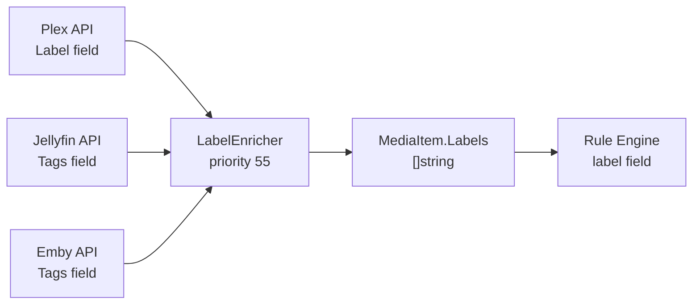

# Media Server Label Enrichment

**Status:** ✅ Complete
**Branch:** `feature/media-server-labels`

## Background

Plex labels are arbitrary, user-defined metadata tags on library items (e.g., "4K DV", "Keep", "Kids", "Award Winner"). Jellyfin and Emby have an equivalent concept called "Tags" on items. These are distinct from *arr tags (which Capacitarr already tracks via the `tag` rule field).

Currently, Capacitarr parses `Genre` and `Collection` from Plex's API response but ignores the `Label` field, despite it being returned in the same `[{"tag": "value"}]` format. Jellyfin and Emby item tags are similarly unused.

### Why This Matters

1. **User intent signal.** Labels/tags are deliberate user actions on their media server, indicating "this item is special to me." Unlike implicit watch data, these are explicit curation markers.
2. **Kometa/PMM synergy.** Users running Kometa auto-apply labels like "Trending", "Award Winner", "Top 250", "4K-DV". Rules against these (e.g., `label contains "Award Winner" → prefer_keep`) are powerful.
3. **Premium content protection.** Quality markers like "4K DV", "Remux", "HDR" are commonly applied as labels. Rules like `label contains "4K DV" → always_keep` protect expensive-to-acquire encodes.
4. **Explicit deletion flows.** Users can label items "Can Delete" or "Low Priority" in Plex and create `label contains "Can Delete" → prefer_remove` in Capacitarr.
5. **Plex library access control.** Plex uses labels for restricting library access to shared users — items labeled this way carry semantic meaning that Capacitarr should be able to act on.

### Naming Decision

| Source | Their term | Our rule field |
|--------|-----------|---------------|
| Plex | "Labels" | `label` |
| Jellyfin | "Tags" (on items) | `label` |
| Emby | "Tags" (on items) | `label` |
| *arr (existing) | "Tags" | `tag` (unchanged) |

The rule field is `label` with UI label "Media Server Label". This avoids confusion with the existing `tag` field (which is *arr-specific). Tooltip clarification: "Labels from Plex / Tags from Jellyfin & Emby".

### Architecture Decision: Dedicated LabelEnricher

A new `LabelEnricher` following the same structural pattern as `CollectionEnricher`, not grafted onto collections or tags. Rationale:

- **Collections are curated groupings** ("MCU", "Lord of the Rings") with source tracking for collection deletion. Labels are freeform user-intent tags. Mixing them in `item.Collections` breaks `CollectionSources` semantics and the "delete collection on last removal" logic.
- **Tags are *arr-native only** — set at fetch time from `arrFetchTagMap()`, no enrichment pipeline involvement. Labels originate from media servers and require TMDb-based matching through the pipeline.
- **The `collection` rule field already has specific behavior** (array-matching with `CollectionSources`). Sharing the field means `collection contains "Keep"` matches both concepts — confusing for users.
- **A dedicated enricher is ~200 lines** with zero risk to existing functionality. The cost of separation is trivial; the cost of conflation would be permanent semantic debt.



---

## Implementation Plan

### Phase 1: Data Layer — Interfaces and MediaItem

**Goal:** Define the capability interface and add the `Labels` field to `MediaItem`.

#### Step 1.1: Add `LabelDataProvider` interface

**File:** [`types.go`](../../../backend/internal/integrations/types.go)

Add after `CollectionDataProvider` (line ~120):

```go
// LabelDataProvider is implemented by media server integrations (Plex,
// Jellyfin, Emby) that can report item-level labels/tags. The returned
// map keys are TMDb IDs and values are slices of label strings.
// Plex calls these "Labels"; Jellyfin and Emby call them "Tags".
// This data feeds the LabelEnricher to bridge media server labels onto *arr items.
type LabelDataProvider interface {
    GetLabelMemberships() (map[int][]string, error)
}
```

#### Step 1.2: Add `LabelNameFetcher` interface

**File:** [`types.go`](../../../backend/internal/integrations/types.go)

Add after `CollectionNameFetcher` (line ~127):

```go
// LabelNameFetcher is implemented by media server integrations that can
// return a list of label/tag names for use in rule value autocomplete.
// Satisfied by Plex, Jellyfin, and Emby clients.
type LabelNameFetcher interface {
    GetLabelNames() ([]string, error)
}
```

#### Step 1.3: Add `Labels` field to `MediaItem`

**File:** [`types.go`](../../../backend/internal/integrations/types.go)

Add after the `Collections`/`CollectionSources` fields (line ~186):

```go
Labels []string `json:"labels,omitempty"` // Media server labels/tags (from Plex Labels + Jellyfin/Emby Tags)
```

#### Step 1.4: Update capability comment

**File:** [`types.go`](../../../backend/internal/integrations/types.go)

Update the comment block (lines 49-55) to include `LabelDataProvider`:

```
// Plex:                             Connectable + WatchDataProvider + WatchlistProvider + CollectionDataProvider + LabelDataProvider
// Jellyfin, Emby:                   Connectable + WatchDataProvider + WatchlistProvider + CollectionDataProvider + LabelDataProvider
```

---

### Phase 2: Media Server Clients — Plex Labels

**Goal:** Parse and expose Plex labels.

#### Step 2.1: Add `Label` field to `plexMetadata`

**File:** [`plex.go`](../../../backend/internal/integrations/plex.go)

Add to the `plexMetadata` struct (after the `Collection` field, line ~82):

```go
Label []struct {
    Tag string `json:"tag"`
} `json:"Label"`
```

The Plex API returns labels in the exact same `[{"tag": "value"}]` format as `Genre` and `Collection`. This is already present in the API response — Capacitarr simply never parsed it.

#### Step 2.2: Implement `GetLabelMemberships()` on `PlexClient`

**File:** [`plex.go`](../../../backend/internal/integrations/plex.go)

Following the `GetCollectionMemberships()` pattern (line 417):

```go
// GetLabelMemberships implements LabelDataProvider by scanning all Plex
// libraries and building a TMDb ID → label names map from metadata.
func (p *PlexClient) GetLabelMemberships() (map[int][]string, error) {
    items, err := p.getMediaItems()
    if err != nil {
        return nil, fmt.Errorf("failed to fetch Plex items for label memberships: %w", err)
    }

    result := make(map[int][]string)
    for _, item := range items {
        if item.TMDbID == 0 || len(item.Labels) == 0 {
            continue
        }
        result[item.TMDbID] = item.Labels
    }
    return result, nil
}
```

This requires `plexMetadataToMediaItem()` (line 163) to also extract labels into a new `Labels` field on the internal MediaItem returned by `getMediaItems()`. The labels are extracted from `m.Label` the same way collections are extracted from `m.Collection`.

#### Step 2.3: Implement `GetLabelNames()` on `PlexClient`

**File:** [`plex.go`](../../../backend/internal/integrations/plex.go)

Following the `GetCollectionNames()` pattern (line 384):

```go
// GetLabelNames returns a sorted, deduplicated list of label names from all
// Plex libraries. Used by FetchLabelValues() for rule value autocomplete.
func (p *PlexClient) GetLabelNames() ([]string, error) {
    items, err := p.getMediaItems()
    if err != nil {
        return nil, fmt.Errorf("failed to fetch Plex items for labels: %w", err)
    }

    seen := make(map[string]bool)
    for _, item := range items {
        for _, lbl := range item.Labels {
            name := strings.TrimSpace(lbl)
            if name != "" {
                seen[name] = true
            }
        }
    }

    names := make([]string, 0, len(seen))
    for name := range seen {
        names = append(names, name)
    }
    sort.Strings(names)
    return names, nil
}
```

#### Step 2.4: Add compile-time interface checks for Plex

**File:** [`plex.go`](../../../backend/internal/integrations/plex.go)

Add after the existing `var _ CollectionDataProvider` check (line ~438):

```go
var _ LabelDataProvider = (*PlexClient)(nil)
```

#### Step 2.5: Write Plex label tests

**File:** [`plex_test.go`](../../../backend/internal/integrations/plex_test.go)

Test cases:

- `TestPlexClient_GetLabelMemberships_Success` — mock response with "Serenity" (movie) labeled "4K DV" and "Keep", verify TMDb ID mapping
- `TestPlexClient_GetLabelMemberships_Empty` — no labels, returns empty map
- `TestPlexClient_GetLabelMemberships_SkipsNoTMDbID` — items without TMDb GUIDs are excluded
- `TestPlexClient_GetLabelNames_Success` — verify sorted, deduplicated label names
- `TestPlexClient_GetLabelNames_SkipsBlanks` — empty/whitespace-only labels excluded

Use canonical media names: "Serenity" for movies, "Firefly" for shows.

---

### Phase 3: Media Server Clients — Jellyfin and Emby Tags

**Goal:** Expose Jellyfin and Emby item tags through the same interfaces.

#### Step 3.1: Parse `Tags` from Jellyfin items

**File:** [`jellyfin.go`](../../../backend/internal/integrations/jellyfin.go)

The `jellyfinItem` struct (line 55) does not currently parse the `Tags` field. Jellyfin includes `"Tags": ["4K", "Keep"]` — an array of strings — on item responses when `Fields=Tags` is included in the request.

Add `Tags []string` to the `jellyfinItem` struct (or to relevant API response structs). The Jellyfin API needs `Fields=Tags` appended to the query parameters for endpoints used by label fetching.

#### Step 3.2: Implement `GetLabelMemberships()` on `JellyfinClient`

**File:** [`jellyfin.go`](../../../backend/internal/integrations/jellyfin.go)

```go
// GetLabelMemberships implements LabelDataProvider by fetching all items with
// their Tags field from Jellyfin. Jellyfin "Tags" on items serve the same
// purpose as Plex "Labels" — user-defined freeform metadata.
func (j *JellyfinClient) GetLabelMemberships() (map[int][]string, error) {
    // Fetch items with Fields=Tags, extract TMDb ID → tag list mapping
}
```

Reuse the existing user discovery (`GetAdminUserID()`) and item-fetching patterns. The implementation should query `/Users/{id}/Items` with `IncludeItemTypes=Movie,Series&Recursive=true&Fields=Tags,ProviderIds` and extract `item.Tags` per TMDb ID.

#### Step 3.3: Implement `GetLabelNames()` on `JellyfinClient`

**File:** [`jellyfin.go`](../../../backend/internal/integrations/jellyfin.go)

Same approach — deduplicate all tag names across items for autocomplete.

#### Step 3.4: Implement `GetLabelMemberships()` and `GetLabelNames()` on `EmbyClient`

**File:** [`emby.go`](../../../backend/internal/integrations/emby.go)

Mirror the Jellyfin implementation. Emby's API is structurally identical (forked codebase).

#### Step 3.5: Add compile-time interface checks

**Files:** [`jellyfin.go`](../../../backend/internal/integrations/jellyfin.go), [`emby.go`](../../../backend/internal/integrations/emby.go)

```go
var _ LabelDataProvider = (*JellyfinClient)(nil)
var _ LabelDataProvider = (*EmbyClient)(nil)
```

#### Step 3.6: Write Jellyfin and Emby label tests

**Files:** [`jellyfin_test.go`](../../../backend/internal/integrations/jellyfin_test.go), [`emby_test.go`](../../../backend/internal/integrations/emby_test.go)

Test cases per client:

- `TestXxxClient_GetLabelMemberships_Success` — items with Tags field, verify TMDb ID → tags mapping
- `TestXxxClient_GetLabelMemberships_NoTags` — items without Tags field, returns empty map
- `TestXxxClient_GetLabelNames_Success` — verify sorted, deduplicated tag names
- `TestXxxClient_GetLabelNames_Empty` — no items with tags

---

### Phase 4: LabelEnricher

**Goal:** Create the enricher and wire it into the pipeline.

#### Step 4.1: Create `LabelEnricher`

**File:** [`enrichers.go`](../../../backend/internal/integrations/enrichers.go)

Add after the `CollectionEnricher` section (line ~441), following the same structural pattern:

```go
// ─── LabelEnricher ──────────────────────────────────────────────────────────

// LabelEnricher enriches *arr items with label/tag data from any
// LabelDataProvider (Plex Labels, Jellyfin Tags, Emby Tags). Matches items
// by TMDb ID. Multiple LabelEnrichers can run (one per media server), and
// labels are merged with deduplication.
type LabelEnricher struct {
    name          string
    priority      int
    integrationID uint
    provider      LabelDataProvider
}

func NewLabelEnricher(name string, priority int, integrationID uint, provider LabelDataProvider) *LabelEnricher {
    return &LabelEnricher{name: name, priority: priority, integrationID: integrationID, provider: provider}
}

func (e *LabelEnricher) Name() string    { return e.name }
func (e *LabelEnricher) Priority() int   { return e.priority }

func (e *LabelEnricher) Enrich(items []MediaItem) error {
    labelMap, err := e.provider.GetLabelMemberships()
    if err != nil {
        return err
    }
    if len(labelMap) == 0 {
        return nil
    }
    matched := 0
    for i := range items {
        item := &items[i]
        if item.TMDbID == 0 {
            continue
        }
        labels, ok := labelMap[item.TMDbID]
        if !ok || len(labels) == 0 {
            continue
        }

        // Build dedup set from existing labels
        existing := make(map[string]bool, len(item.Labels))
        for _, l := range item.Labels {
            existing[l] = true
        }

        for _, lbl := range labels {
            if !existing[lbl] {
                item.Labels = append(item.Labels, lbl)
                existing[lbl] = true
            }
        }
        matched++
    }
    logEnrichmentResult(e.name, len(items), len(labelMap), matched)
    return nil
}

var _ Enricher = (*LabelEnricher)(nil)
```

**Design notes:**

- **Priority 55** — runs immediately after `CollectionEnricher` (50), before `CrossReferenceEnricher` (100). Same tier of "metadata enrichment."
- **No `EnrichmentCapabilityProvider`** — same as `CollectionEnricher`. Label enrichment failures are non-fatal and don't need capability-level failure tracking. The pipeline already logs and continues on error.
- **No source tracking map** — unlike `CollectionSources`, there's no "delete label when last member removed" toggle. If source tracking becomes needed later, add `LabelSources map[string]uint` following the collection pattern.
- **Merge-with-dedup** — if both Plex and Jellyfin label the same item "4K DV", it appears once in `item.Labels`.

#### Step 4.2: Register `LabelEnricher` in `BuildEnrichmentPipeline()`

**File:** [`enrichers.go`](../../../backend/internal/integrations/enrichers.go)

Add after the collection enricher registration (line ~511), before the cross-reference enricher:

```go
// Label enrichers (priority 55 — after collections, before cross-reference)
for id, provider := range registry.LabelDataProviders() {
    pipeline.Add(NewLabelEnricher("Label Data", 55, id, provider))
}
```

#### Step 4.3: Add `LabelDataProviders()` to `IntegrationRegistry`

**File:** [`registry.go`](../../../backend/internal/integrations/registry.go)

Add a new discovery method following the `CollectionDataProviders()` pattern:

```go
// LabelDataProviders returns all registered clients that implement LabelDataProvider.
func (r *IntegrationRegistry) LabelDataProviders() map[uint]LabelDataProvider {
    r.mu.RLock()
    defer r.mu.RUnlock()
    result := make(map[uint]LabelDataProvider)
    for id, client := range r.connectors {
        if p, ok := client.(LabelDataProvider); ok {
            result[id] = p
        }
    }
    return result
}
```

#### Step 4.4: Write `LabelEnricher` tests

**File:** [`enrichers_test.go`](../../../backend/internal/integrations/enrichers_test.go)

Test cases:

- `TestLabelEnricher_EnrichSuccess` — "Serenity" (TMDb 16320) gets labels ["4K DV", "Keep"] from mock provider
- `TestLabelEnricher_MergesMultipleSources` — first enricher adds ["4K DV"], second adds ["4K DV", "Award Winner"]; item ends with ["4K DV", "Award Winner"] (deduped)
- `TestLabelEnricher_SkipsNoTMDbID` — items without TMDb ID are skipped
- `TestLabelEnricher_EmptyLabelMap` — provider returns empty map, no items modified
- `TestLabelEnricher_ProviderError` — provider returns error, enricher returns error (pipeline logs and continues)

---

### Phase 5: Rule Engine — `label` Field

**Goal:** Add the `label` rule field so users can create rules against media server labels.

#### Step 5.1: Add `label` case to `evaluateRule()`

**File:** [`engine/rules.go`](../../../backend/internal/engine/rules.go)

Add a new case after `collection` (line ~340), following the identical array-matching pattern:

```go
case "label":
    // String field matching against item.Labels []string.
    // Follows the same array-matching pattern as "tag" and "collection".
    if cond == "==" || cond == "contains" {
        for _, lbl := range item.Labels {
            if stringMatch(strings.ToLower(lbl), cond, val) {
                return true, lbl
            }
        }
        return false, strings.Join(item.Labels, ", ")
    }
    // Negation operators (!=, !contains): all labels must pass
    for _, lbl := range item.Labels {
        if !stringMatchNegated(strings.ToLower(lbl), cond, val) {
            return false, lbl
        }
    }
    if len(item.Labels) == 0 {
        return true, "(no labels)"
    }
    return true, strings.Join(item.Labels, ", ")
```

#### Step 5.2: Add `haslabel` boolean field

**File:** [`engine/rules.go`](../../../backend/internal/engine/rules.go)

Add alongside `incollection` (line ~341):

```go
case "haslabel":
    hasLabel := len(item.Labels) > 0
    ruleBool := val == boolTrue
    return hasLabel == ruleBool, fmt.Sprintf("%d labels", len(item.Labels))
```

#### Step 5.3: Register field definitions

**File:** [`services/rules.go`](../../../backend/internal/services/rules.go)

In `appendEnrichmentFieldDefs()` (line ~327), add label fields inside the `if p.HasMedia` block:

```go
if p.HasMedia {
    fields = append(fields,
        FieldDef{Field: "incollection", Label: "In Collection", Type: "boolean", Operators: []string{"=="}},
        FieldDef{Field: "watchlist", Label: "On Watchlist", Type: "boolean", Operators: []string{"=="}},
        FieldDef{Field: "collection", Label: "Collection Name", Type: "string", Operators: []string{"==", "!=", "contains", "!contains"}},
        FieldDef{Field: "haslabel", Label: "Has Label", Type: "boolean", Operators: []string{"=="}},
        FieldDef{Field: "label", Label: "Media Server Label", Type: "string", Operators: []string{"==", "!=", "contains", "!contains"}},
    )
}
```

The `haslabel` and `label` fields are gated behind `p.HasMedia` (same gate as `incollection`, `collection`, `watchlist`) since labels only come from media server integrations.

#### Step 5.4: Write rule evaluation tests

**File:** [`engine/rules_test.go`](../../../backend/internal/engine/rules_test.go)

Test cases:

- `TestEvaluateRule_Label_ContainsMatch` — item with labels ["4K DV", "Keep"], rule `label contains "4K"` → true
- `TestEvaluateRule_Label_ExactMatch` — rule `label == "keep"` → true (case-insensitive)
- `TestEvaluateRule_Label_NotContains` — rule `label !contains "delete"` → true
- `TestEvaluateRule_Label_NoLabels` — item with no labels, `label contains "anything"` → false
- `TestEvaluateRule_Label_NoLabelsNegation` — item with no labels, `label !contains "anything"` → true
- `TestEvaluateRule_HasLabel_True` — item with labels, `haslabel == true` → true
- `TestEvaluateRule_HasLabel_False` — item with no labels, `haslabel == true` → false

---

### Phase 6: Autocomplete — Label Values

**Goal:** Wire label name autocomplete into the rule builder UI.

#### Step 6.1: Add `FetchLabelValues()` to `IntegrationService`

**File:** [`services/integration.go`](../../../backend/internal/services/integration.go)

Following the `FetchCollectionValues()` pattern (line 120):

```go
// FetchLabelValues returns label/tag names from all enabled media server
// integrations (Plex, Jellyfin, Emby). Results are cached with the standard TTL.
// The returned slice is sorted alphabetically and deduplicated across all servers.
func (s *IntegrationService) FetchLabelValues() ([]integrations.NameValue, error) {
    const cacheKey = "global:labels"

    if cached, ok := s.ruleValueCache.Get(cacheKey); ok {
        if nv, ok := cached.([]integrations.NameValue); ok {
            return nv, nil
        }
    }

    configs, err := s.ListEnabled()
    if err != nil {
        return nil, fmt.Errorf("failed to list enabled integrations: %w", err)
    }

    seen := make(map[string]bool)
    for _, cfg := range configs {
        client := integrations.CreateClient(cfg.Type, cfg.URL, cfg.APIKey)
        if client == nil {
            continue
        }

        fetcher, ok := client.(integrations.LabelNameFetcher)
        if !ok {
            continue
        }

        names, fetchErr := fetcher.GetLabelNames()
        if fetchErr != nil {
            slog.Warn("Failed to fetch label names",
                "component", "integration_service", "integrationId", cfg.ID, "type", cfg.Type, "error", fetchErr)
            continue
        }
        for _, name := range names {
            seen[name] = true
        }
    }

    result := make([]integrations.NameValue, 0, len(seen))
    for name := range seen {
        result = append(result, integrations.NameValue{Value: name, Label: name})
    }
    sort.Slice(result, func(i, j int) bool {
        return result[i].Label < result[j].Label
    })

    s.ruleValueCache.Set(cacheKey, result)
    return result, nil
}
```

#### Step 6.2: Add `ruleActionLabel` constant and route in `FetchRuleValues()`

**File:** [`services/integration.go`](../../../backend/internal/services/integration.go)

Add constant (line ~33):

```go
ruleActionLabel = "label"
```

Add case in `FetchRuleValues()` after the `ruleActionCollection` case (line ~303):

```go
case ruleActionLabel:
    labels, labelErr := s.FetchLabelValues()
    if labelErr != nil {
        return nil, fmt.Errorf("failed to fetch label values: %w", labelErr)
    }
    result := map[string]any{"type": "combobox", "suggestions": labels}
    s.ruleValueCache.Set(cacheKey, result)
    return result, nil
```

Also add `"haslabel"` to the boolean static case (line ~283):

```go
case "monitored", "requested", "incollection", "watchlist", "watchedbyreq", "haslabel":
```

#### Step 6.3: Write autocomplete tests

**File:** [`services/integration_test.go`](../../../backend/internal/services/integration_test.go)

Test cases:

- `TestFetchLabelValues_AggregatesAcrossServers` — two mock media servers with overlapping labels, verify dedup and sort
- `TestFetchLabelValues_CacheHit` — second call returns cached result
- `TestFetchLabelValues_NoMediaServers` — no enabled media server integrations, returns empty list
- `TestFetchRuleValues_Label` — verify `FetchRuleValues(id, "label")` returns combobox with suggestions
- `TestFetchRuleValues_HasLabel` — verify `FetchRuleValues(id, "haslabel")` returns boolean closed options

---

### Phase 7: Verification

#### Step 7.1: Run `make ci`

Run `make ci` to verify all changes pass lint, test, and security checks.

#### Step 7.2: Manual integration test

1. `docker compose up --build`
2. Add a Plex integration (or Jellyfin/Emby) in Capacitarr Settings
3. Ensure some items have labels/tags in the media server
4. Trigger a poll cycle (or wait for automatic poll)
5. Verify: items in the preview/scored view show labels in their enrichment data
6. Create a rule: `label contains "4K DV" → always_keep`
7. Verify: the rule autocomplete dropdown shows label names from the media server
8. Verify: the rule correctly matches items with that label

---

## File Change Summary

| File | Phase | Change | Description |
|------|-------|--------|-------------|
| `backend/internal/integrations/types.go` | 1 | Modify | Add `LabelDataProvider`, `LabelNameFetcher` interfaces; add `Labels` field to `MediaItem`; update capability comment |
| `backend/internal/integrations/plex.go` | 2 | Modify | Add `Label` to `plexMetadata`; implement `GetLabelMemberships()`, `GetLabelNames()`; update `plexMetadataToMediaItem()` |
| `backend/internal/integrations/plex_test.go` | 2 | Modify | Add label membership and name tests |
| `backend/internal/integrations/jellyfin.go` | 3 | Modify | Parse `Tags` from items; implement `GetLabelMemberships()`, `GetLabelNames()` |
| `backend/internal/integrations/jellyfin_test.go` | 3 | Modify | Add label/tag tests |
| `backend/internal/integrations/emby.go` | 3 | Modify | Parse `Tags` from items; implement `GetLabelMemberships()`, `GetLabelNames()` |
| `backend/internal/integrations/emby_test.go` | 3 | Modify | Add label/tag tests |
| `backend/internal/integrations/enrichers.go` | 4 | Modify | Add `LabelEnricher`; register in `BuildEnrichmentPipeline()` at priority 55 |
| `backend/internal/integrations/enrichers_test.go` | 4 | Modify | Add `LabelEnricher` tests |
| `backend/internal/integrations/registry.go` | 4 | Modify | Add `LabelDataProviders()` discovery method |
| `backend/internal/engine/rules.go` | 5 | Modify | Add `label` and `haslabel` cases to `evaluateRule()` |
| `backend/internal/engine/rules_test.go` | 5 | Modify | Add label rule evaluation tests |
| `backend/internal/services/rules.go` | 5 | Modify | Add `haslabel` and `label` field definitions in `appendEnrichmentFieldDefs()` |
| `backend/internal/services/integration.go` | 6 | Modify | Add `FetchLabelValues()`, `ruleActionLabel` constant, route in `FetchRuleValues()` |
| `backend/internal/services/integration_test.go` | 6 | Modify | Add label autocomplete tests |

## Risk Assessment

| Risk | Likelihood | Mitigation |
|------|-----------|------------|
| Plex `Label` field not returned in `/library/sections/{key}/all` | Very Low | Plex has returned `Label` alongside `Genre` and `Collection` for years; same data structure |
| Jellyfin/Emby `Tags` not included by default | Low | Request `Fields=Tags` explicitly in the query; verify with real instance |
| Performance — additional API field parsing | Very Low | Labels are parsed alongside existing Genre/Collection in the same response; no additional API calls needed for Plex |
| Jellyfin/Emby `Tags` requires extra API call | Low | If `Fields=Tags` is not supported in existing item queries, may need a separate fetch; can optimize later with field merging |
| Naming confusion with *arr `tag` field | Low | UI label "Media Server Label" with tooltip; field key `label` is distinct; documented in this plan |
| Users expect write-back (setting labels from Capacitarr) | Low | Out of scope for this plan; Capacitarr is read-only for media server metadata. Document this limitation if users ask. |
