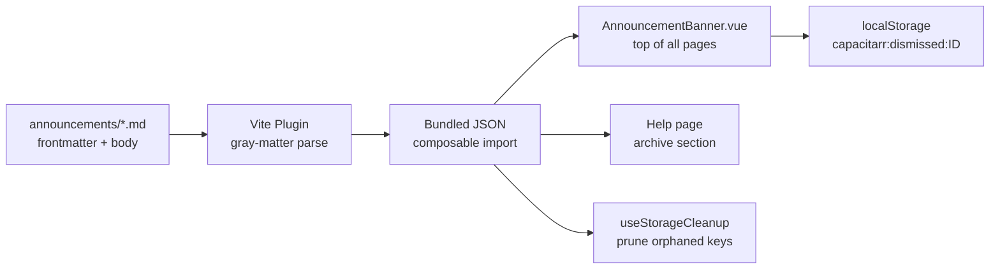
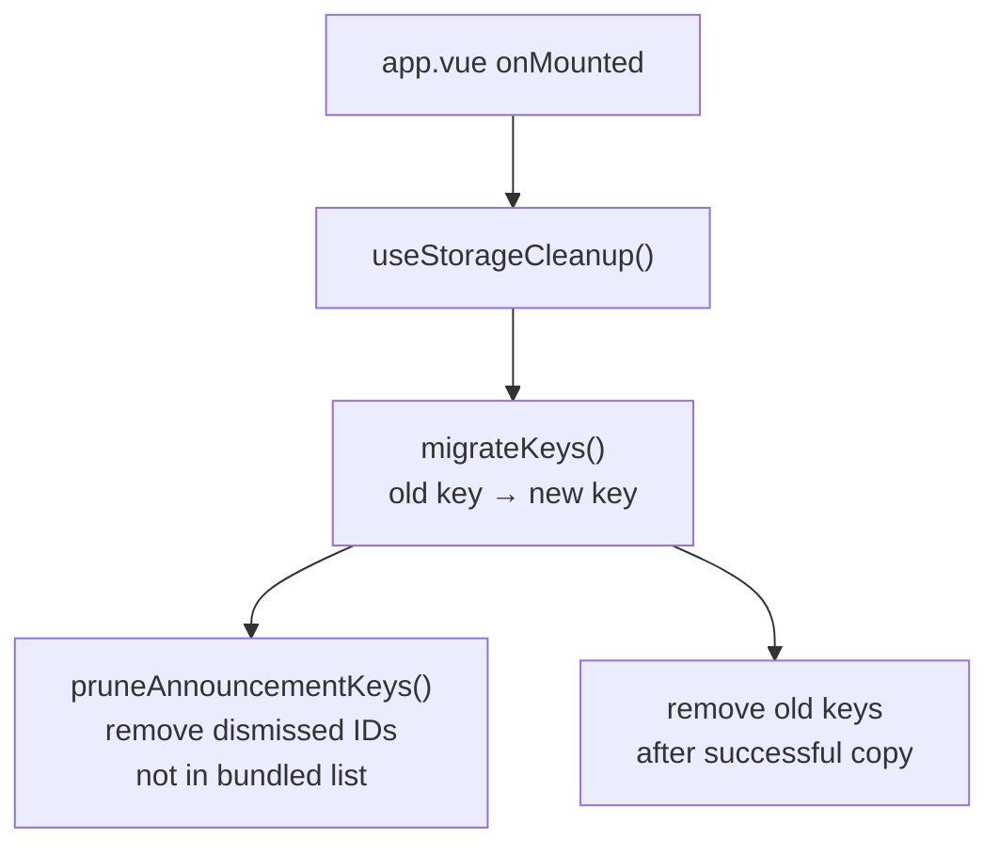

# Announcement Banner and localStorage Cleanup

**Created:** 2026-03-27T17:14Z
**Status:** ✅ Complete
**Scope:** Repo-based announcement system, global dismissible banner, Help page archive, localStorage key normalization, startup cleanup composable
**Branch:** `feature/announcement-banner`

## Overview

Add a repo-based announcement system where `.md` files with frontmatter are bundled at build time and displayed as a dismissible banner at the top of all pages. Archived announcements appear at the top of the Help page. Dismissed state is persisted in `localStorage` keyed by announcement ID.

Simultaneously, normalize all 8 existing `localStorage` keys to use a consistent `capacitarr:` colon-delimited namespace, migrate existing user data transparently, and introduce a startup cleanup composable that prunes orphaned keys.

## Motivation

- **Announcements:** Single-user self-hosted app needs a lightweight way to communicate release notes, maintenance notices, or feature callouts without a full database-backed CRUD system. Repo-based `.md` files are version-controlled, reviewable in MRs, and ship with releases.
- **Key normalization:** The current 8 `localStorage` keys use three different separator conventions (hyphens, underscores, colons). This is confusing and makes programmatic key management (cleanup, enumeration) harder than it needs to be.
- **Cleanup composable:** No `localStorage` cleanup exists anywhere in the frontend. Orphaned dismissal keys accumulate forever. Normalizing keys introduces old→new migration that also needs a cleanup path.

## Architecture

### Announcement Data Flow



### localStorage Key Migration



### Announcement Frontmatter Schema

```yaml
---
id: "2026-03-27-maintenance"       # unique, stable identifier
title: "Scheduled Maintenance"      # short headline for banner
type: info                          # info | warning | critical
date: 2026-03-27                    # publication date
expires: 2026-04-01                 # optional auto-hide date (banner only)
active: true                        # false = archived (Help page only)
---

Full body text in markdown, rendered on the Help page.
```

## Key Normalization Map

All keys will use `capacitarr:<camelCase>` format.

| # | Old Key | New Key | Files |
|---|---------|---------|-------|
| 1 | `capacitarr-theme` | `capacitarr:theme` | `composables/useTheme.ts` (lines 4, 58, 65, 75), `nuxt.config.ts` (line 53), `backend/csp_test.go` (line 38), `backend/baseurl_test.go` (line 14), plan doc `03-ui-ux/20260228T1620Z-theming-and-shadcn-integration.md` |
| 2 | `capacitarr-color-mode` | `capacitarr:colorMode` | `composables/useColorMode.ts` (lines 11, 36), `nuxt.config.ts` (line 53), plan doc `03-ui-ux/20260228T1620Z-theming-and-shadcn-integration.md` |
| 3 | `capacitarr_timezone` | `capacitarr:timezone` | `composables/useDisplayPrefs.ts` (lines 4, 18) |
| 4 | `capacitarr_clockFormat` | `capacitarr:clockFormat` | `composables/useDisplayPrefs.ts` (lines 11, 42) |
| 5 | `capacitarr_viewMode` | `capacitarr:viewMode` | `composables/useDisplayPrefs.ts` (lines 23, 30), plan doc `02-features/20260306T1415Z-grid-view-with-posters.md` |
| 6 | `capacitarr_exactDates` | `capacitarr:exactDates` | `composables/useDisplayPrefs.ts` (lines 35, 47), plan doc `02-features/20260304T0446Z-ux-fixes-and-enrichments.md` |
| 7 | `capacitarr:showMiniSparklines` | `capacitarr:sparklines` | `pages/index.vue` (lines 466, 471) |
| 8 | `capacitarr_plexClientId` | `capacitarr:plexClientId` | `utils/plexOAuth.ts` (lines 14, 183, 186) |

**Note:** Key #7 already uses colons but has an inconsistent verbose name. Keys #1 and #2 also appear in the `nuxt.config.ts` inline head script (FOUC prevention) and two backend Go test files that embed HTML matching the Nuxt output. All references must be updated atomically.

## Scope

### In Scope

- Announcement markdown directory (`announcements/`) and frontmatter schema
- Vite plugin to parse and bundle announcements as JSON at build time
- `AnnouncementBanner.vue` global component (dismissible, severity-colored)
- Help page announcements archive section (top of page, above existing content)
- `useAnnouncements` composable (loads bundled data, manages dismissed state)
- `useStorageCleanup` composable (key migration, orphan pruning)
- Rename all 8 localStorage keys to `capacitarr:` convention
- Update `nuxt.config.ts` inline head script for renamed theme/color-mode keys
- Update backend Go test files (`csp_test.go`, `baseurl_test.go`) for renamed key
- i18n keys for banner dismiss button and Help page archive heading

### Out of Scope

- Database-backed announcement CRUD (unnecessary for single-user app)
- Admin authoring UI (announcements are authored as `.md` files in the repo)
- Notification bell (removed intentionally; announcements use banner pattern)
- Real-time announcement push (SSE) — announcements ship with builds

## Implementation Steps

### Phase 1: localStorage Key Normalization

**Goal:** Rename all 8 keys to `capacitarr:camelCase` and update every reference.

- [x] **Step 1.1:** Create `frontend/app/utils/storageKeys.ts` — single source of truth for all localStorage key constants. Export a `STORAGE_KEYS` object:
  ```ts
  export const STORAGE_KEYS = {
    theme: 'capacitarr:theme',
    colorMode: 'capacitarr:colorMode',
    timezone: 'capacitarr:timezone',
    clockFormat: 'capacitarr:clockFormat',
    viewMode: 'capacitarr:viewMode',
    exactDates: 'capacitarr:exactDates',
    sparklines: 'capacitarr:sparklines',
    plexClientId: 'capacitarr:plexClientId',
  } as const;
  ```
  Also export a `LEGACY_KEY_MAP` for migration:
  ```ts
  export const LEGACY_KEY_MAP: Record<string, string> = {
    'capacitarr-theme': STORAGE_KEYS.theme,
    'capacitarr-color-mode': STORAGE_KEYS.colorMode,
    'capacitarr_timezone': STORAGE_KEYS.timezone,
    'capacitarr_clockFormat': STORAGE_KEYS.clockFormat,
    'capacitarr_viewMode': STORAGE_KEYS.viewMode,
    'capacitarr_exactDates': STORAGE_KEYS.exactDates,
    'capacitarr:showMiniSparklines': STORAGE_KEYS.sparklines,
    'capacitarr_plexClientId': STORAGE_KEYS.plexClientId,
  };
  ```

- [x] **Step 1.2:** Update `composables/useTheme.ts` — replace hardcoded `'capacitarr-theme'` with `STORAGE_KEYS.theme` (lines 58, 65, 75, and JSDoc at line 4).

- [x] **Step 1.3:** Update `composables/useColorMode.ts` — replace hardcoded `'capacitarr-color-mode'` with `STORAGE_KEYS.colorMode` (lines 11, 36).

- [x] **Step 1.4:** Update `composables/useDisplayPrefs.ts` — replace all four hardcoded keys with their `STORAGE_KEYS` equivalents (lines 4, 11, 18, 23, 30, 35, 42, 47).

- [x] **Step 1.5:** Update `pages/index.vue` — replace `'capacitarr:showMiniSparklines'` with `STORAGE_KEYS.sparklines` (lines 466, 471). Also normalize the SSR guard to use `import.meta.client` instead of the inconsistent `typeof localStorage !== 'undefined'` pattern.

- [x] **Step 1.6:** Update `utils/plexOAuth.ts` — replace `'capacitarr_plexClientId'` constant (line 14) with `STORAGE_KEYS.plexClientId`.

- [x] **Step 1.7:** Update `nuxt.config.ts` inline head script (line 53) — this is a raw string IIFE that runs before Vue, so it cannot import `STORAGE_KEYS`. Update the hardcoded key strings to `'capacitarr:theme'` and `'capacitarr:colorMode'`. Add a comment referencing `storageKeys.ts` as the source of truth.

- [x] **Step 1.8:** Update backend Go test files — update the HTML string in `backend/csp_test.go` (line 38) and `backend/baseurl_test.go` (line 14) to use the new key names so they match the actual Nuxt output.

- [x] **Step 1.9:** Run `make ci` to verify all changes compile, lint, and pass tests.

### Phase 2: Storage Cleanup Composable

**Goal:** Introduce a composable that runs on app mount to migrate legacy keys and prune orphaned data.

- [x] **Step 2.1:** Create `frontend/app/composables/useStorageCleanup.ts`:
  - `migrateKeys()` — iterates `LEGACY_KEY_MAP`. For each old key found in `localStorage`, copies value to new key (if new key doesn't already exist), then removes old key. This is idempotent — safe to run on every mount.
  - `pruneAnnouncementDismissals(activeIds: string[])` — scans `localStorage` for keys matching `capacitarr:dismissed:*`, removes any whose ID is not in `activeIds`. Will be wired up after the announcement system is built (Phase 4).
  - Export a single `runStorageCleanup(activeAnnouncementIds?: string[])` function that calls both in sequence.

- [x] **Step 2.2:** Wire `runStorageCleanup()` into `app.vue` `onMounted()` — call it early (before SSE connect, after splash removal). Guard with `import.meta.client`. Initially call without announcement IDs (just key migration).

- [x] **Step 2.3:** Run `make ci` to verify.

### Phase 3: Announcement Infrastructure

**Goal:** Set up the markdown directory, Vite plugin, and composable for loading announcements.

- [x] **Step 3.1:** Create `frontend/announcements/` directory. Add a sample announcement file (e.g., `2026-03-27-welcome.md`) with the full frontmatter schema to serve as a template and verify the pipeline works.

- [x] **Step 3.2:** Install `gray-matter` as a dev dependency (`pnpm add -D gray-matter`) for frontmatter parsing in the Vite plugin.

- [x] **Step 3.3:** Create a Vite plugin (`frontend/plugins/vite-announcements.ts` or inline in `nuxt.config.ts` via `vite.plugins`) that:
  - On build (and dev HMR), reads all `.md` files from `frontend/announcements/`
  - Parses each with `gray-matter` to extract frontmatter + body
  - Exposes the result as a virtual module (`virtual:announcements`) that exports the parsed array as JSON
  - The virtual module can be imported anywhere: `import announcements from 'virtual:announcements'`

- [x] **Step 3.4:** Add TypeScript type declarations for the virtual module (`frontend/types/announcements.d.ts`):
  ```ts
  declare module 'virtual:announcements' {
    interface Announcement {
      id: string;
      title: string;
      type: 'info' | 'warning' | 'critical';
      date: string;
      expires?: string;
      active: boolean;
      body: string;
    }
    const announcements: Announcement[];
    export default announcements;
  }
  ```

- [x] **Step 3.5:** Create `frontend/app/composables/useAnnouncements.ts`:
  - Imports from `virtual:announcements`
  - `activeBannerAnnouncements` — computed: filters to `active === true`, not expired, not dismissed (check `localStorage` for `capacitarr:dismissed:<id>`)
  - `allAnnouncements` — computed: all announcements sorted by date descending (for Help page archive)
  - `dismiss(id)` — sets `localStorage` key `capacitarr:dismissed:<id>` to `'true'`
  - `isDismissed(id)` — reads `localStorage`
  - `activeIds` — all announcement IDs currently in the bundle (for cleanup composable)

- [x] **Step 3.6:** Wire announcement IDs into `useStorageCleanup` — update the `app.vue` `onMounted()` call to pass `activeIds` from `useAnnouncements` to `runStorageCleanup()`.

- [x] **Step 3.7:** Run `make ci` to verify.

### Phase 4: Announcement Banner Component

**Goal:** Render a dismissible banner above all page content for active announcements.

- [x] **Step 4.1:** Create `frontend/app/components/AnnouncementBanner.vue`:
  - Uses `useAnnouncements()` composable
  - Renders the highest-severity active, non-dismissed announcement as a full-width bar
  - Severity → color mapping: `info` = blue/primary, `warning` = amber/warning, `critical` = red/destructive (use existing CSS variables)
  - Layout: icon (left) + title text (center) + dismiss `X` button (right)
  - If multiple active announcements, show a "(+N more)" link to the Help page
  - Dismiss button calls `useAnnouncements().dismiss(id)` and reactively hides the banner
  - Smooth enter/leave transition (use `v-motion` consistent with existing components)

- [x] **Step 4.2:** Add `AnnouncementBanner` to `app.vue` template — inside the authenticated block, above `<main>`, below `<Navbar>`. Wrap in `<ClientOnly>` since it depends on `localStorage`.

- [x] **Step 4.3:** Add i18n keys for the banner to all locale files:
  - `announcements.dismiss` — "Dismiss"
  - `announcements.moreCount` — "+{count} more"
  - `announcements.viewAll` — "View all announcements"

- [x] **Step 4.4:** Run `make ci` to verify.

### Phase 5: Help Page Announcements Archive

**Goal:** Display all announcements at the top of the Help page.

- [x] **Step 5.1:** Add an announcements section at the top of `pages/help.vue` (above the existing "How Scoring Works" details block):
  - Uses `useAnnouncements().allAnnouncements`
  - Only render the section if there are any announcements (don't show an empty section)
  - Each announcement rendered as a card (consistent with existing `<details>` card pattern on the Help page):
    - Type badge (info/warning/critical) with matching color
    - Title as heading
    - Date (formatted with `useDisplayPrefs().formatTimestamp()`)
    - Markdown body rendered as HTML (use a lightweight markdown renderer or pre-render at build time in the Vite plugin)
    - Active announcements get a subtle left-border accent; inactive ones are muted
  - List sorted by date descending (newest first)

- [x] **Step 5.2:** Add i18n keys:
  - `help.announcements` — "Announcements"
  - `help.announcements.active` — "Active"
  - `help.announcements.archived` — "Archived"

- [x] **Step 5.3:** Run `make ci` to verify.

### Phase 6: Final Verification

- [x] **Step 6.1:** Run `make ci` — full CI pipeline must pass (lint, test, security).
- [x] **Step 6.2:** Build and start with `docker compose up --build`. Verify:
  - Announcement banner appears on all pages when an active announcement exists
  - Dismissing the banner persists across page navigations and browser refresh
  - Help page shows all announcements (active + archived) at the top
  - Old localStorage keys are migrated to new names on first load
  - Orphaned dismissal keys are cleaned up when announcement files are removed
  - No FOUC — theme and color mode still apply instantly (inline head script uses new key names)
- [x] **Step 6.3:** Kept the sample announcement as a welcome message for new installs. Remove the sample announcement file if it should not ship, or keep it as a welcome message for new installs.

## Testing

| Area | Approach |
|------|----------|
| Key migration | Unit test `useStorageCleanup` — set old keys in mock localStorage, run migration, assert new keys exist and old keys are removed |
| Orphan pruning | Unit test — set dismissed keys for IDs not in active list, run prune, assert they're removed |
| Vite plugin | Verify build succeeds with sample `.md` file; verify virtual module exports correct shape |
| Banner rendering | Manual test via Docker — verify banner appears, dismisses, persists |
| Help page archive | Manual test — verify announcements render with correct type badges and markdown |
| FOUC prevention | Manual test — hard refresh with dark mode, verify no flash |
| Backend tests | `make test` — `csp_test.go` and `baseurl_test.go` pass with updated key strings |

## Notes

- The `nuxt.config.ts` inline head script cannot use the `STORAGE_KEYS` constants (it's a raw string IIFE). The key values must be duplicated there. A comment should reference `storageKeys.ts` as the canonical source.
- Plan doc references to old key names (in completed plans like the theming and grid view plans) should **not** be updated — they are historical records of what was implemented at the time.
- The `gray-matter` dependency is dev-only (build-time parsing). It does not ship in the production bundle.
- Markdown rendering on the Help page: prefer pre-rendering to HTML in the Vite plugin at build time rather than shipping a runtime markdown parser. This keeps the client bundle small.

## Execution Notes

- **gray-matter date auto-parsing:** gray-matter automatically converts YAML date strings into JavaScript `Date` objects. The Vite plugin's `AnnouncementFrontmatter` interface was updated to accept `string | Date` with a `toDateString()` helper to handle both cases.
- **`vite` added as explicit dev dependency:** The Vite plugin needed `import type { Plugin, ViteDevServer } from 'vite'`, which required `vite` as an explicit devDependency (previously only available transitively through Nuxt).
- **Semgrep `v-html` finding:** The `v-html` usage on the Help page for announcement bodies triggered `avoid-v-html`. Suppressed with `nosemgrep` annotation and documented in `SECURITY.md` — the HTML is pre-rendered at build time from developer-authored markdown, not user input.
- **Plex OAuth key rename:** The initial edit placed the `import` below the constant declarations, triggering `import/first`. Fixed by moving the import to the top of the module.
- **Sparklines SSR guard:** Normalized from `typeof localStorage !== 'undefined'` to `import.meta.client` for consistency with all other composables.
- **Sample announcement kept:** `frontend/announcements/2026-03-27-welcome.md` serves as both a pipeline verification artifact and a welcome message for new installs. Can be set to `active: false` or deleted before release.
