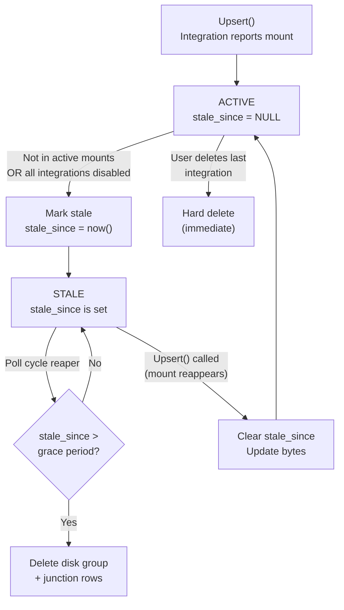

# Disk Group Soft Deletion & Grace Period

**Status:** ✅ Complete
**Created:** 2026-04-06T17:24Z
**Completed:** 2026-04-06T20:22Z
**Category:** Feature (02-features)
**Branch:** `feature/disk-group-soft-deletion`
**Estimated Effort:** M (1-2 days)

## Problem

Disk groups carry user-configured state — thresholds, targets, modes, sunset percentages, total-bytes overrides — that is expensive to reconfigure. Several code paths destroy disk groups immediately, causing this state to be silently lost and recreated with defaults on the next successful poll:

| Trigger | Code Path | Current Behavior | User Impact |
|---------|-----------|------------------|-------------|
| Integration **disabled** | Poller: `len(configs) == 0` → `RemoveAll()` | All disk groups deleted immediately | Thresholds reset to 85/75 on re-enable |
| All integrations **deleted** | `IntegrationService.Delete()` → `RemoveAll()` | All disk groups deleted immediately | Thresholds reset to 85/75 on re-add |
| Integration **unreachable** | `ReconcileActiveMounts()` | **Already fixed** (d1a1f37) — `anyDiskSuccess` guard skips reconciliation | None (fixed) |
| Mount path **no longer reported** | `ReconcileActiveMounts()` | Disk group deleted immediately | Threshold lost if transient (e.g., *arr restart mid-scan) |

The `anyDiskSuccess` guard from commit d1a1f37 solves the transient-outage case specifically, but the disable/delete/mount-disappearance paths still destroy state immediately.

### Root Cause

The system lacks a concept of **stale vs. dead** disk groups. Every absence is treated as permanent removal, but in practice most are temporary:

- Disabling an integration for maintenance (minutes to hours)
- *arr service restart causing a poll cycle to miss its data (seconds)
- Docker volume remount changing a path temporarily (minutes)

Note: **Deleting** an integration is an explicit user choice and should result in immediate disk group removal (see Removal Policy below). The grace period protects against *involuntary* data loss only.

## Solution: Stale-Mark & Grace Period

Replace immediate deletion with a two-phase lifecycle for **involuntary** losses: **mark stale** → **reap after grace period**. Disk groups that reappear within the grace window are silently resurrected with all configuration intact.

**Explicit user actions (integration deletion) bypass the grace period entirely** — deleting an integration is a deliberate choice, and the user may be intentionally forcing a fresh disk group with default thresholds. Soft deletion only protects against situations the user didn't cause: disabling for maintenance, transient outages, and mount path flicker.

### Lifecycle State Machine

### Removal Policy Summary

| Trigger | Intent | Behavior |
|---------|--------|----------|
| All integrations **deleted** by user | Deliberate | **Immediate hard delete** via `RemoveAll()` |
| Integration **disabled** (last one) | Reversible | **Mark all stale** — preserves thresholds for re-enable |
| Integration **unreachable** | Involuntary | **Skip reconciliation** (existing `anyDiskSuccess` guard) |
| Mount path **not in active set** | Involuntary | **Mark that specific disk group stale** |
| Mount path **reappears** (via `Upsert()`) | Recovery | **Clear `stale_since`**, update bytes (resurrection) |
| Grace period **expires** | Automatic | **Reaper deletes** disk group + junction rows |

## Implementation Summary

### Phase 1: Schema & Model ✅

- **Migration:** `backend/internal/db/migrations/00016_disk_group_soft_deletion.sql` — adds `stale_since` to `disk_groups` and `disk_group_grace_period_days` to `preference_sets`
- **Model:** `DiskGroup.StaleSince *time.Time` and `PreferenceSet.DiskGroupGracePeriodDays int` (default 7)

### Phase 2: DiskGroupService ✅

- `MarkStale(id)` — sets `stale_since = NOW()` if not already stale (idempotent)
- `MarkAllStale()` — bulk marks all active groups stale, publishes per-group events
- `ReapStale(gracePeriodDays)` — SELECT expired → publish events → DELETE (with junction rows)
- `ListStale()` — returns groups where `stale_since IS NOT NULL`, ordered ASC
- `Upsert()` — modified to clear `stale_since` on existing groups (resurrection), publishes `DiskGroupResurrectedEvent`
- `ReconcileActiveMounts()` — now marks stale instead of deleting, preserves junction table links
- `ImportUpsert()` — clears `stale_since` on import (resurrection)

**Deviation from plan:** `ReapStale()` uses a SELECT → iterate → DELETE pattern instead of a single bulk DELETE, because it needs to publish per-group `DiskGroupReapedEvent` with mount path and stale duration. `MarkAllStale()` similarly SELECTs active groups first to publish per-group `DiskGroupStaleEvent`.

### Phase 3: DiskGroupManager Interface ✅

- Added `MarkAllStale() (int64, error)` to the interface in `integration.go`

### Phase 4: Poller ✅

- Zero-integrations path: `MarkAllStale()` replaces `RemoveAll()`, plus reaper call
- Normal path: reaper call added after `ReconcileActiveMounts()`

### Phase 5: API & Frontend ✅

- **Types:** `staleSince` on `DiskGroup`, `diskGroupGracePeriodDays` on `PreferenceSet`
- **DiskGroupSection.vue:** Stale indicator (dimmed card, "Stale" badge, "Last seen X ago")
- **SettingsAdvanced.vue:** Grace period select (0-90 days) in the "Default Disk Group Thresholds" card

**Deviation from plan:** Settings placed in `SettingsAdvanced.vue` (not `SettingsEngine.vue` which does not exist)

### Phase 6: Events ✅

- `DiskGroupStaleEvent`, `DiskGroupReapedEvent`, `DiskGroupResurrectedEvent` in `events/types.go`

### Phase 7: Tests ✅

Added 11 new test cases in `diskgroup_test.go`:
- `TestMarkStale_SetsTimestamp`, `TestMarkStale_Idempotent`
- `TestMarkAllStale_MarksOnlyActive`
- `TestUpsert_ResurrectsStaleGroup`
- `TestReapStale_DeletesExpiredGroups`, `TestReapStale_PreservesRecentlyStaleGroups`, `TestReapStale_ZeroGracePeriod`, `TestReapStale_ClearsJunctionTable`
- `TestListStale_ReturnsOnlyStale`
- `TestImportUpsert_ResurrectsStale`

Updated 2 existing tests:
- `TestReconcileActiveMounts` → `TestReconcileActiveMounts_MarksStaleInsteadOfDeleting`
- `TestReconcileActiveMounts_EmptyMapDeletesAll` → `TestReconcileActiveMounts_EmptyMapMarksAllStale`

### Phase 8: make ci ✅

Full CI pipeline passes: lint (golangci-lint + ESLint + Prettier + typecheck), tests (Go + migration up/down/up), security (Semgrep + govulncheck).

## Files Changed

### New Files
- `backend/internal/db/migrations/00016_disk_group_soft_deletion.sql`

### Modified Files
- `backend/internal/db/models.go` — `StaleSince` on `DiskGroup`, `DiskGroupGracePeriodDays` on `PreferenceSet`
- `backend/internal/services/diskgroup.go` — `MarkStale()`, `MarkAllStale()`, `ReapStale()`, `ListStale()`, modified `Upsert()`, modified `ReconcileActiveMounts()`, modified `ImportUpsert()`
- `backend/internal/services/diskgroup_test.go` — 11 new tests, 2 updated tests
- `backend/internal/services/integration.go` — `DiskGroupManager` interface gains `MarkAllStale()`
- `backend/internal/poller/poller.go` — `MarkAllStale()` + `ReapStale()` calls
- `backend/internal/events/types.go` — `DiskGroupStaleEvent`, `DiskGroupReapedEvent`, `DiskGroupResurrectedEvent`
- `frontend/app/types/api.ts` — `staleSince`, `diskGroupGracePeriodDays`
- `frontend/app/components/DiskGroupSection.vue` — stale indicator
- `frontend/app/components/settings/SettingsAdvanced.vue` — grace period input
