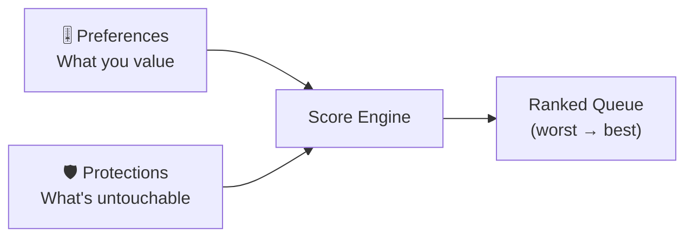

# Scoring Engine v2: Preferences, Not Rules

> **Status:** ✅ Complete — Design implemented. The scoring engine uses weighted preferences + protection rules as described. See `20260301T1801Z-cascading-rule-builder.md` for the evolved rule system.

## The Core Insight

Users don't want to *write rules*. They want to *express preferences*: "I'd rather keep things I've watched than things with a high rating that I haven't seen." That's not a rule — it's a priority.

So instead of three layers, Capacitarr has **two**:



---

## Layer 1: Preferences — "What do you value?"

A simple, visual **preference panel** with sliders. No formulas, no dropdowns. Each slider says:

> *"How much does this factor matter when deciding what to keep?"*

| Preference | What It Means | Default |
|-----------|---------------|---------|
| **Watch History** | Unwatched content is deleted first | ██████████ High |
| **Last Watched** | Content not watched recently is less valuable | ████████░░ Medium-High |
| **File Size** | Larger files free more space per deletion | ██████░░░░ Medium |
| **Rating** | Low-rated content goes first | █████░░░░░ Medium |
| **Time in Library** | Old content is less valuable | ████░░░░░░ Medium-Low |
| **Availability** | Content on streaming services is easier to get back | ███░░░░░░░ Low |

### How It Works Under the Hood (User Never Sees This)

Each slider maps to a 0–10 weight. The engine normalizes weights and computes a score per item:

**Example with 3 items on the same disk:**

```
Preferences: Watch History=10, File Size=6, Rating=5
             (normalized to: 0.48, 0.29, 0.23)

┌──────────────────────────────┬─────────────┬──────────────┬───────────────┐
│ Item                         │ Watch Score │ Size Score   │ Rating Score  │
│                              │ (×0.48)     │ (×0.29)      │ (×0.23)       │
├──────────────────────────────┼─────────────┼──────────────┼───────────────┤
│ Movie: "Old Flick" (2008)    │ Never played│ 35 GB        │ 4.2/10        │
│                              │ 0.48 × 1.0  │ 0.29 × 0.7  │ 0.23 × 0.8   │
│                              │ = 0.48      │ = 0.20       │ = 0.18        │
│                              │             │              │ TOTAL: 0.86 🗑️│
├──────────────────────────────┼─────────────┼──────────────┼───────────────┤
│ Show: "Binge Series" S1-S3   │ 6 months ago│ 80 GB        │ 7.5/10        │
│                              │ 0.48 × 0.6  │ 0.29 × 1.0  │ 0.23 × 0.3   │
│                              │ = 0.29      │ = 0.29       │ = 0.07        │
│                              │             │              │ TOTAL: 0.65   │
├──────────────────────────────┼─────────────┼──────────────┼───────────────┤
│ Movie: "Weekend Watch"       │ Last week   │ 12 GB        │ 6.8/10        │
│                              │ 0.48 × 0.1  │ 0.29 × 0.2  │ 0.23 × 0.4   │
│                              │ = 0.05      │ = 0.06       │ = 0.09        │
│                              │             │              │ TOTAL: 0.20 ✅│
└──────────────────────────────┴─────────────┴──────────────┴───────────────┘

Result: Delete "Old Flick" (0.86) first, then "Binge Series" (0.65).
        Keep "Weekend Watch" (0.20).
```

The user **never sees scores or math**. They just see: *"If your disk hits 85%, here's what would be removed (in order)."*

### Presets for Quick Start

Users who don't want to touch sliders at all can pick a **preset**:

| Preset | Description |
|--------|-------------|
| 📺 **Binge Watcher** | Heavily favors watch history — if you haven't seen it, it's first to go |
| 💾 **Space Saver** | Prioritizes freeing the most space per deletion |
| ⭐ **Quality Keeper** | Protects highly-rated content, deletes low-rated first |
| ⚖️ **Balanced** | Equal weight across all factors (default) |

---

## Layer 2: Protections — "What's untouchable?"

Unlimited, stackable conditions expressed as **simple sentences**:

> **Protect** media where `[property]` `[is/is not/contains/greater than]` `[value]`

**Examples (users create as many as they want):**

| # | Protection Rule |
|---|----------------|
| 1 | Protect media where **quality** is **4K** or **REMUX** |
| 2 | Protect media where **added date** is within **14 days** |
| 3 | Protect media where **tag** contains **keeper** |
| 4 | Protect media where **status** is **continuing** |
| 5 | Protect media where **play count** is greater than **5** |
| 6 | Protect media where **genre** contains **documentary** |

Protected items are **removed from the ranking entirely**. They will never appear in the deletion queue, no matter what the score says.

The UX is a simple form: `Property dropdown → Condition dropdown → Value input → Add`. No sections, no AND/OR chains, no nested logic. Each protection stands alone.

---

## Why This Is Better Than Rules

| Maintainerr Rules | Capacitarr Preferences + Protections |
|---|---|
| User builds complex logic chains | User adjusts sliders |
| Binary pass/fail (match = delete) | Items are *ranked* — worst goes first |
| Requires understanding AND/OR logic | No boolean logic at all |
| Separate rules per media type | Unified ranking across all media |
| Hard to predict outcomes | "Preview" shows exactly what would happen |
| Must define rules to start | Works with zero config (sensible defaults) |

---

## The Full Flow

```
1. User sets up integrations (Radarr, Sonarr, Plex, etc.)
2. Capacitarr groups services by shared disk
3. User sets a threshold: "Clean up when disk is ≥ 85%"
4. User adjusts preference sliders (or picks a preset)
5. User adds any protections they care about (optional)
6. Capacitarr continuously polls and ranks all media
7. Dashboard shows a live "What Would Be Deleted" preview
8. When threshold is hit:
   - Dry Run mode: notification + preview only
   - Approval mode: queue appears, user approves/rejects
   - Auto mode: executes deletions via Radarr/Sonarr API
```

> [!IMPORTANT]
> **Does this feel right?** Two clean layers:
> - **Preferences** = "what I value" (sliders/presets, affects ranking)
> - **Protections** = "what's off limits" (unlimited simple conditions, absolute override)
>
> No Layer 3. No rule builder. No score modifiers. Just preferences that rank, and protections that exclude.
