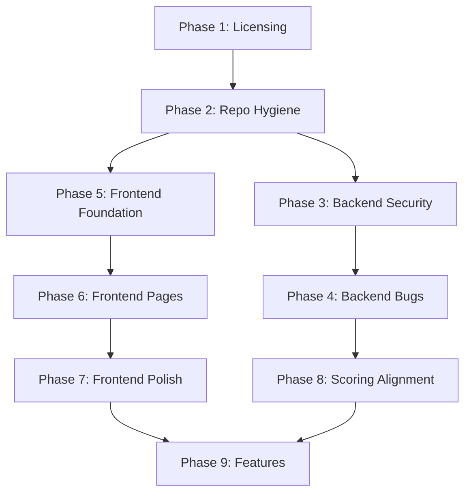

# Capacitarr v2 Migration Plan

> **Status:** ✅ Complete (Historical) — All phases implemented including §9.1 notification channels (Discord, Slack, in-app). Checkboxes below were not maintained during execution but all work was completed.

This document covers the complete modernization of Capacitarr: licensing, frontend rebuild on shadcn-vue + Motion, backend security/correctness fixes, and housekeeping. The Go + Nuxt architecture remains — only the frontend component layer and specific backend issues change.

---

## Phase 1: Licensing & Legal Foundation

### 1.1 Replace License with PolyForm Noncommercial 1.0.0

The current repo has a 4-clause BSD license. Replace with [PolyForm Noncommercial 1.0.0](https://polyformproject.org/licenses/noncommercial/1.0.0/).

- [ ] Replace `capacitarr/LICENSE` with PolyForm Noncommercial 1.0.0 full text
- [ ] Remove `capacitarr/frontend/LICENSE` (Nuxt scaffold MIT license — no longer applicable)
- [ ] Add SPDX license identifier to `capacitarr/package.json`: `"license": "PolyForm-Noncommercial-1.0.0"`
- [ ] Update `capacitarr/README.md` license section to reference PolyForm Noncommercial

### 1.2 Add Contributor License Agreement to CONTRIBUTING.md

- [ ] Rewrite `capacitarr/CONTRIBUTING.md` with CLA section requiring contributors to agree that their contributions are licensed under the same PolyForm Noncommercial terms
- [ ] Add CLA acknowledgment requirement (e.g., "By submitting a PR, you agree to the CLA")

---

## Phase 2: Repository Hygiene

These items address critical issues from the code review that are independent of the frontend stack.

### 2.1 Remove Binary from Git

- [ ] Add `backend/server` to `capacitarr/.gitignore`
- [ ] Run `git rm --cached capacitarr/backend/server` to remove the 17 MB compiled binary from tracking
- [ ] Commit with message: `chore: remove compiled binary from version control`

### 2.2 Standardize Package Manager

The frontend has both `package-lock.json` (npm) and `pnpm-lock.yaml` (pnpm), and `package.json` specifies `"packageManager": "pnpm@10.29.3"`.

- [ ] Remove `capacitarr/frontend/package-lock.json`
- [ ] Update `capacitarr/Dockerfile` to use pnpm instead of npm:
  - `RUN corepack enable && corepack prepare pnpm@10.29.3 --activate`
  - `RUN pnpm install --frozen-lockfile`
  - `RUN pnpm run build`
- [ ] Verify Docker build succeeds with pnpm

### 2.3 Remove Nuxt Starter Boilerplate

- [ ] Delete `capacitarr/frontend/app/components/TemplateMenu.vue` (Nuxt template demo links)
- [ ] Delete `capacitarr/frontend/app/components/AppLogo.vue` (Nuxt starter SVG logo) — verify it is not referenced first
- [ ] Delete `capacitarr/frontend/.github/` directory (Nuxt starter GitHub config)
- [ ] Clean up `capacitarr/frontend/renovate.json` if not actively used

---

## Phase 3: Backend Security Fixes

These fixes are critical regardless of frontend stack and should be done early.

### 3.1 JWT Secret Enforcement

- [ ] In `config.go`, refuse to start (or log WARN-level alert on each request) when using the default JWT secret outside of debug mode
- [ ] Consider generating a random secret on first launch and persisting it to the SQLite database or a config file

### 3.2 Secure Cookie Configuration

- [ ] Make cookie `Secure` flag configurable via environment variable (e.g., `SECURE_COOKIES=true`)
- [ ] Set `HttpOnly: true` on the JWT cookie
- [ ] Add a separate non-HttpOnly cookie (e.g., `authenticated=true`) that the SPA reads for auth state display
- [ ] Update `useApi.ts` to send JWT via `Authorization: Bearer` header instead of relying on cookie auto-send (the composable already does this)

### 3.3 Fix Unsafe Type Assertions in Middleware

- [ ] In `middleware.go`, use comma-ok pattern for JWT claims type assertion:
  ```go
  claims, ok := token.Claims.(jwt.MapClaims)
  if !ok { return echo.ErrUnauthorized }
  sub, ok := claims["sub"].(string)
  if !ok { return echo.ErrUnauthorized }
  ```

### 3.4 Restrict CORS

- [ ] Make CORS origins configurable via `CORS_ORIGINS` environment variable
- [ ] Default to same-origin (no wildcard) in non-debug mode
- [ ] Keep `AllowOrigins: ["*"]` only when `DEBUG=true`

### 3.5 Secure User Bootstrap

- [ ] Add a first-run setup flow: only allow user creation when a `SETUP_TOKEN` environment variable matches, or require setup via CLI flag
- [ ] Alternatively: generate a random initial password, print it to stdout on first launch, and require the user to change it

### 3.6 Add Login Rate Limiting

- [ ] Add Echo rate limiter middleware on the `/auth/login` endpoint (e.g., 5 attempts per minute per IP)

---

## Phase 4: Backend Bug Fixes

### 4.1 Fix Cron Rollup Missing disk_group_id Grouping

- [ ] In `cron.go` `rollupData()`, add `GROUP BY disk_group_id` to the aggregation query
- [ ] Create one rollup record per disk group instead of one global average
- [ ] Add `DiskGroupID` field to the rollup insert

### 4.2 Fix Duplicate Disk Groups Endpoints

- [ ] Remove the duplicate `GET /diskgroups` from `api.go` (lines 146-152)
- [ ] Standardize on `GET /disk-groups` (hyphenated, in `integrations.go`)
- [ ] Move `PUT /diskgroups/:id` to `PUT /disk-groups/:id` for consistency
- [ ] Update frontend to use the consistent endpoint

### 4.3 Fix ismasked() Function

- [ ] Replace the fragile middle-character check with `strings.Contains(key, "...")`

### 4.4 Remove Dangling strconv Import in plex.go

- [ ] Remove `var _ = strconv.Itoa` and the `strconv` import from `plex.go`

### 4.5 Add HTTP Client Timeouts

- [ ] Create a shared HTTP client in the integrations package:
  ```go
  var httpClient = &http.Client{Timeout: 30 * time.Second}
  ```
- [ ] Replace all `http.DefaultClient.Do(req)` calls with `httpClient.Do(req)` in plex.go, radarr.go, sonarr.go

### 4.6 Extract Shared doRequest Helper

- [ ] Create a base HTTP helper that all three integration clients use, reducing the 3x duplicated `doRequest` methods

### 4.7 Extract Shared createClient Factory

- [ ] Move the `createClient` logic from `poller.go` and `integrations.go` into a single exported function in the `integrations` package
- [ ] Both poller and routes import from there

### 4.8 Add Input Validation on Preferences

- [ ] Validate weight values are 0-10
- [ ] Validate `executionMode` is one of `dry-run`, `approval`, `auto`
- [ ] Validate `logLevel` is one of `debug`, `info`, `warn`, `error`
- [ ] Return 400 for invalid values

### 4.9 Add Graceful Shutdown

- [ ] In `main.go`, listen for `SIGTERM`/`SIGINT`
- [ ] Use `e.Shutdown(ctx)` with a deadline
- [ ] Close the `deleteQueue` channel to allow the deletion worker to drain
- [ ] Stop the cron scheduler and poller ticker

---

## Phase 5: Frontend Rebuild — Foundation

Replace NuxtUI with shadcn-vue + Motion. The Nuxt framework itself stays.

### 5.1 Remove Old NuxtUI Stack

Before installing the new stack, cleanly remove all NuxtUI artifacts:

- [ ] Remove `@nuxt/ui` from `package.json` dependencies
- [ ] Remove `@iconify-json/simple-icons` and `@iconify-json/lucide` from dependencies
- [ ] Remove `@nuxt/ui` from the `modules` array in `nuxt.config.ts`
- [ ] Delete all existing NuxtUI component files that will be replaced:
  - `app/components/AppLogo.vue` (Nuxt boilerplate)
  - `app/components/TemplateMenu.vue` (Nuxt boilerplate)
  - `app/components/CapacityChart.vue`
  - `app/components/DiskGroupCard.vue`
  - `app/components/IntegrationUsage.vue`
  - `app/components/Navbar.vue`
  - `app/components/WorkerMetricsCard.vue`
- [ ] Delete all existing page files (will be rebuilt from scratch):
  - `app/pages/index.vue`
  - `app/pages/login.vue`
  - `app/pages/rules.vue`
  - `app/pages/settings.vue`
  - `app/pages/audit.vue`
- [ ] Delete `app/plugins/apexcharts.client.ts` (will be recreated with updated config)
- [ ] Clean `app/app.vue` to a minimal shell
- [ ] Run `pnpm install` to prune the dependency tree and regenerate lockfile
- [ ] Verify the app builds cleanly with zero NuxtUI references (grep for `UButton`, `UCard`, `UModal`, `UTable`, `UIcon`, `UBadge`, `USelect`, `USlider`, `UInput`, `UForm`, `UDropdown`, `UPagination`, `UAlert`, `UAvatar`, `URange`, `UContainer`)

### 5.2 Install shadcn-vue and Dependencies

- [ ] Install shadcn-vue CLI and initialize: `npx shadcn-vue@latest init`
- [ ] Install `@vueuse/motion` for spring-based animations
- [ ] Install `vue-sonner` for toast notifications (replaces NuxtUI's `useToast`)
- [ ] Install `@vueuse/core` for utility composables

### 5.3 Establish Design System

Create a design system document and CSS custom properties that define:

- [ ] **Color tokens**: Primary (violet-500/600), surfaces (zinc-900/950 dark, white/zinc-50 light), semantic colors (success/warning/error)
- [ ] **Typography scale**: Font family (Inter or Geist Sans), heading sizes, body text, code/mono
- [ ] **Spacing rhythm**: 4px base unit, consistent padding/margins
- [ ] **Border radius scale**: sm (6px), md (8px), lg (12px), xl (16px)
- [ ] **Shadow scale**: subtle elevation for cards, modals
- [ ] **Animation presets**: enter/exit durations, spring tension/friction values, stagger delays
- [ ] Create `capacitarr/frontend/app/assets/css/design-tokens.css` with all CSS custom properties
- [ ] Create `capacitarr/frontend/app/lib/motion-presets.ts` with reusable animation configs

### 5.4 Build Shared Utilities

- [ ] Create `capacitarr/frontend/app/utils/format.ts` with shared `formatBytes()`, `formatTime()`, `formatPercent()` functions (eliminates the 4x duplication)
- [ ] Update `useApi.ts` composable to work without NuxtUI dependencies

### 5.5 Build Layout Shell

- [ ] Rebuild `app.vue` with page transition wrapper using Motion
- [ ] Create new `Navbar.vue` using shadcn-vue `NavigationMenu`, `DropdownMenu`, `Avatar`
- [ ] Implement dark/light mode toggle using `useColorMode()` from `@vueuse/core`
- [ ] Add skeleton shimmer loading component for page load states
- [ ] Implement global auth middleware (Nuxt route middleware) to replace per-page auth checks

---

## Phase 6: Frontend Rebuild — Pages

Rebuild each page with shadcn-vue components, Motion animations, and premium visual treatment.

### 6.1 Login Page

- [ ] Rebuild using shadcn-vue `Card`, `Input`, `Button`, `Label`
- [ ] Add animated logo entrance
- [ ] Add form validation with visual feedback
- [ ] Spring-animated error state

### 6.2 Dashboard Page

- [ ] Stat cards with animated number counters on mount
- [ ] Per-disk-group sections with `Card`, `Progress`, threshold markers
- [ ] Capacity chart using ApexCharts (keep, but restyle to match design system)
- [ ] Integration usage breakdown with animated progress bars
- [ ] Worker metrics card rebuilt with shadcn-vue (fix the `$api` bug from code review)
- [ ] Remove fake `Math.random()` data — use real integration connection count
- [ ] Remove `<StatusCard />` reference (it never existed)
- [ ] Staggered card entry animations
- [ ] Empty state with illustrated icon and CTA

### 6.3 Rules & Scoring Engine Page

- [ ] Preference sliders rebuilt with shadcn-vue `Slider` + Motion spring feedback
- [ ] Preset buttons (Balanced, Space Saver, Binge Watcher) with active state animation
- [ ] Protection rule builder using shadcn-vue `Select`, `Input`, `Button`, `Badge`
- [ ] Rule cards with enter/exit animations (AnimatePresence equivalent)
- [ ] Live preview table using shadcn-vue `Table` with score color gradient
- [ ] Execution mode selector with clear visual distinction between dry-run/approval/auto

### 6.4 Settings Page

- [ ] Integration cards rebuilt with shadcn-vue `Card`, `Badge`, `Button`
- [ ] Add/edit modal rebuilt with shadcn-vue `Dialog`, `Select`, `Input`
- [ ] Delete confirmation rebuilt with shadcn-vue `AlertDialog`
- [ ] Connection test with animated success/failure indicator
- [ ] General settings section (log level, audit retention)

### 6.5 Audit Log Page

- [ ] Table rebuilt with shadcn-vue `Table` 
- [ ] Pagination rebuilt with shadcn-vue `Pagination`
- [ ] Badge colors for action types
- [ ] Row entry animation for new items

---

## Phase 7: Frontend Polish & Advanced UX

### 7.1 Page Transitions

- [ ] Implement ViewTransition API for seamless page morphing (with fallback)
- [ ] Add route-based transition direction (forward/back)

### 7.2 Chart Improvements

- [ ] Restyle ApexCharts with design system colors and typography
- [ ] Add animated chart entry (draw-in effect)
- [ ] Add sparkline mini-charts in dashboard stat cards
- [ ] Implement the "Storage Freed Over Time" chart (currently placeholder)

### 7.3 Dark Mode Excellence

- [ ] Ensure all components have intentional dark mode styling (not just color inversion)
- [ ] Add subtle glow effects on interactive elements in dark mode
- [ ] Test glassmorphic card backgrounds for elevated surfaces

### 7.4 Loading & Empty States

- [ ] Implement skeleton shimmer loaders for all data-loading sections
- [ ] Design meaningful empty states with illustrations and CTAs
- [ ] Progressive reveal animation as data loads

### 7.5 Responsive Design

- [ ] Test and optimize all pages for mobile viewport
- [ ] Implement responsive navigation (hamburger menu or bottom nav for mobile)
- [ ] Ensure charts and tables degrade gracefully on small screens

---

## Phase 8: Scoring Engine Design Alignment

Address the drift between the scoring design document and the implementation.

### 8.1 Make a Decision on Intensity Tiers

The original design explicitly stated: "No score modifiers. Just preferences that rank, and protections that exclude."

The implementation added:
- Three intensity tiers: `slight` (0.5x), `strong` (0.2x), `absolute` (exclusion)
- Target rules (inverse of protections, boosting deletion score)
- Cascading multipliers across multiple rules

**Decision required:**
- [ ] **Option A:** Simplify back to original design — protections are binary exclusions only, remove target rules and intensity tiers
- [ ] **Option B:** Keep intensity/target system but update the scoring design document to reflect reality
- [ ] Whichever option is chosen, update `20260227T1235Z-scoring-design.md` accordingly

### 8.2 Improve Score Transparency

- [ ] Add per-factor score breakdown to the reason string (currently only says "Composite relative score")
- [ ] Show factor-by-factor breakdown in the preview UI (e.g., "Watch: 0.48, Size: 0.20, Rating: 0.18")

---

## Phase 9: Remaining Feature Work

### 9.1 Notification Channels (from original Phase 8)

- [ ] Implement Discord webhook notifications
- [ ] Implement Slack webhook notifications
- [ ] Implement in-app notification center
- [ ] Configurable notification triggers: threshold breach, deletion executed, errors

### 9.2 Update Dockerfile

- [ ] Update frontend build stage to use pnpm
- [ ] Verify the embedded frontend still works with the new shadcn-vue build output
- [ ] Test Docker image size (should be similar or smaller without NuxtUI's dependencies)

---

## Dependency Changes Summary

### Added
| Package | Purpose |
|---------|---------|
| `shadcn-vue` | Component primitives (CLI-generated, owned in repo) |
| `radix-vue` | Headless UI primitives (shadcn-vue dependency) |
| `lucide-vue-next` | Icon library |
| `@vueuse/motion` | Spring-based animations |
| `@vueuse/core` | Utility composables |
| `vue-sonner` | Toast notifications |
| `tailwind-merge` | Conditional class merging (shadcn-vue dependency) |
| `class-variance-authority` | Component variant system (shadcn-vue dependency) |
| `clsx` | Conditional classes (shadcn-vue dependency) |

### Removed
| Package | Reason |
|---------|--------|
| `@nuxt/ui` | Replaced by shadcn-vue |
| `@iconify-json/lucide` | Replaced by lucide-vue-next |
| `@iconify-json/simple-icons` | Not needed |

### Kept
| Package | Reason |
|---------|--------|
| `nuxt` | Framework (stays) |
| `apexcharts` + `vue3-apexcharts` | Charting (stays, restyled) |
| `tailwindcss` | Styling (stays, required by shadcn-vue) |

---

## Phase Execution Order



Phases 3-4 (backend) and Phases 5-7 (frontend) can proceed in parallel since the API contract does not change.
