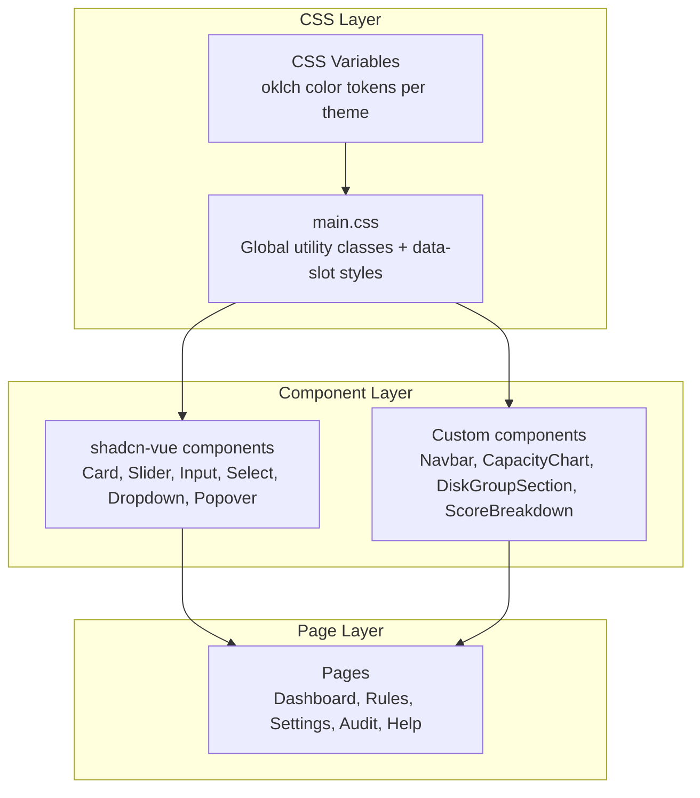
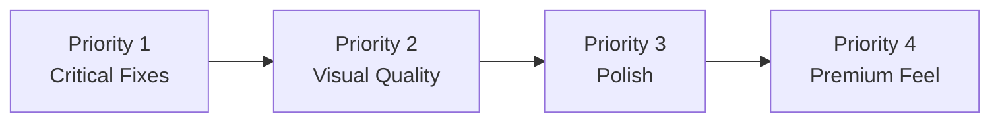

# Visual Design Polish Plan

**Date:** 2026-02-28
**Status:** ✅ Complete — All items implemented. Originally deferred to Phase 4 §12, now fully done.
**Scope:** Frontend visual quality overhaul — dark mode fixes, typography hierarchy, component polish

> **Note:** This plan's content is preserved as the detailed specification for Phase 4 §12 (Visual Design Polish) in the production readiness plan. All items will be implemented as the final comprehensive visual pass after structural/feature work is complete.

## Design Reference

Target quality: **Vercel Dashboard, Linear, Raycast, Arc Browser** — modern dark-first UIs with subtle depth, gradient accents, and premium typography.

---

## Tech Stack Evaluation

> **Should we stick with Nuxt 3 + Tailwind v4 + shadcn-vue or switch?**

**Verdict: Stay with the current stack. It is the right choice.**

| Aspect | Current Stack | Alternative | Why Current Wins |
|--------|--------------|-------------|------------------|
| Framework | Nuxt 3 | Next.js / SvelteKit | Vue ecosystem is solid; no reason to rewrite |
| CSS | Tailwind v4 | Vanilla CSS / UnoCSS | Tailwind v4 with oklch is best-in-class for theming |
| Components | shadcn-vue + reka-ui | Radix Vue / Naive UI / Vuetify | shadcn gives full control over styling; Vuetify is too opinionated |
| Charts | ApexCharts | Chart.js / ECharts / uPlot | ApexCharts is fine; just needs theme integration |
| Motion | @vueuse/motion | GSAP / Motion One | Lightweight, already integrated, sufficient |

The problems are **not stack issues** — they are **implementation gaps**. The CSS variable system is well-designed with 6 themes and oklch colors. The issues are:
- Hardcoded hex colors bypassing the variable system
- Missing utility classes for typography hierarchy
- Default shadcn component styles not customized for dark mode
- Native HTML elements used where shadcn components should be

**One consideration:** If ApexCharts proves impossible to theme via CSS variables at runtime, consider migrating to [uPlot](https://github.com/leeoniya/uPlot) which renders to canvas and is far more lightweight. But try the CSS variable approach first — ApexCharts v5 should support it via its theme configuration.

---

## Architecture: Where Changes Live



Most fixes go into [`main.css`](capacitarr/frontend/app/assets/css/main.css) as global utility classes or `data-slot` styles, with targeted component edits for the shadcn overrides and page-level template changes.

---

## Priority 1: Critical — Broken Functionality

### 1.1 Slider Component Fix

**Problem:** The rules page at [`rules.vue:218-225`](capacitarr/frontend/app/pages/rules.vue:218) uses native `<input type="range">` instead of the shadcn [`Slider.vue`](capacitarr/frontend/app/components/ui/slider/Slider.vue) component. The native slider has minimal styling and broken appearance in dark mode. The shadcn Slider thumb has `bg-white` hardcoded which looks wrong in dark mode too.

**Fix — Two parts:**

**Part A: Fix the shadcn Slider component**

In [`Slider.vue`](capacitarr/frontend/app/components/ui/slider/Slider.vue:40), replace the `SliderThumb` class:

```diff
- class="bg-white border-primary ring-ring/50 block size-4 shrink-0 rounded-full border shadow-sm ..."
+ class="bg-background border-2 border-primary ring-ring/50 block size-4 shrink-0 rounded-full shadow-sm ..."
```

Add thumb glow in [`main.css`](capacitarr/frontend/app/assets/css/main.css):

```css
/* Slider Thumb Enhancement */
[data-slot="slider-thumb"] {
  box-shadow:
    0 1px 3px oklch(0 0 0 / 0.15),
    0 0 0 2px oklch(from var(--color-primary) l c h / 0.15);
  transition: box-shadow 0.15s ease, transform 0.15s ease;
}

[data-slot="slider-thumb"]:hover {
  transform: scale(1.15);
  box-shadow:
    0 2px 6px oklch(0 0 0 / 0.2),
    0 0 0 3px oklch(from var(--color-primary) l c h / 0.25);
}

.dark [data-slot="slider-thumb"] {
  box-shadow:
    0 1px 4px oklch(0 0 0 / 0.4),
    0 0 0 2px oklch(from var(--color-primary) l c h / 0.2),
    0 0 8px oklch(from var(--color-primary) l c h / 0.1);
}
```

**Part B: Replace native range inputs in rules.vue**

Replace all `<input type="range">` instances in [`rules.vue`](capacitarr/frontend/app/pages/rules.vue:218) with:

```vue
<UiSlider
  :model-value="[prefs[slider.key as keyof typeof prefs]]"
  :min="0"
  :max="10"
  :step="1"
  @update:model-value="(v: number[]) => { prefs[slider.key as keyof typeof prefs] = v[0] }"
/>
```

### 1.2 Navbar Overlap Fix

**Problem:** In [`app.vue`](capacitarr/frontend/app/app.vue:4), the `<main>` has `py-8` but no top offset for the sticky navbar. The navbar is `h-16` = 4rem. Content starts behind it.

**Fix:** Change `py-8` to `pb-8 pt-24` or better, add `mt-16` to offset the navbar height:

```diff
- <main class="max-w-7xl mx-auto px-4 sm:px-6 lg:px-8 py-8">
+ <main class="max-w-7xl mx-auto px-4 sm:px-6 lg:px-8 pb-8 pt-24">
```

The `pt-24` = 6rem gives the h-16 navbar + 2rem breathing room, matching the `py-8` bottom padding.

### 1.3 Dropdown/Popover Background Fix

**Problem:** The theme selector dropdown at [`DropdownMenuContent.vue`](capacitarr/frontend/app/components/ui/dropdown-menu/DropdownMenuContent.vue:34) uses `bg-popover` which resolves to `var(--color-popover)`. In dark mode this is `oklch(0.119 0.011 285.823)` — very dark but should be visible. If the background still appears transparent, the issue is likely CSS specificity or the portal rendering outside the `.dark` scope.

**Fix — ensure the portal inherits dark mode:**

In [`nuxt.config.ts`](capacitarr/frontend/nuxt.config.ts:40), the IIFE script applies `.dark` to `<html>`. Since the portals render inside `<body>` which is inside `<html>`, the `.dark` class *should* cascade. If it doesn't:

Add explicit dark mode overrides in [`main.css`](capacitarr/frontend/app/assets/css/main.css):

```css
/* Ensure portaled elements get dark backgrounds */
.dark [data-slot="dropdown-menu-content"],
.dark [data-slot="popover-content"],
.dark [data-slot="select-content"] {
  background-color: var(--color-popover);
  border-color: var(--color-border);
}
```

Also add a subtle backdrop blur for premium feel:

```css
[data-slot="dropdown-menu-content"],
[data-slot="popover-content"] {
  backdrop-filter: blur(12px) saturate(1.2);
  -webkit-backdrop-filter: blur(12px) saturate(1.2);
}

.dark [data-slot="dropdown-menu-content"],
.dark [data-slot="popover-content"] {
  background-color: oklch(from var(--color-popover) l c h / 0.95);
  border-color: oklch(from var(--color-border) l c h / 0.6);
  box-shadow:
    0 4px 16px oklch(0 0 0 / 0.4),
    0 0 0 1px oklch(from var(--color-primary) l c h / 0.06);
}
```

---

## Priority 2: High — Visual Quality

### 2.1 Typography Hierarchy System

**Problem:** All text is plain white `text-foreground` with no differentiation. Everything looks flat.

**Fix:** Add a typography utility system in [`main.css`](capacitarr/frontend/app/assets/css/main.css) and apply classes across pages.

#### New CSS Utility Classes

```css
/* ========================================
   Typography Hierarchy System
   Premium text styling for data-dense UI
   ======================================== */

/* Section/page titles — gradient text using primary */
.text-gradient-primary {
  background: linear-gradient(
    135deg,
    var(--color-foreground) 0%,
    oklch(from var(--color-primary) l c h / 0.9) 100%
  );
  -webkit-background-clip: text;
  -webkit-text-fill-color: transparent;
  background-clip: text;
}

.dark .text-gradient-primary {
  background: linear-gradient(
    135deg,
    oklch(0.95 0.01 285) 0%,
    var(--color-primary) 100%
  );
  -webkit-background-clip: text;
  -webkit-text-fill-color: transparent;
  background-clip: text;
}

/* Stat numbers — extra prominence */
[data-slot="stat-value"] {
  font-variant-numeric: tabular-nums;
  font-weight: 800;
  letter-spacing: -0.025em;
  line-height: 1;
}

.dark [data-slot="stat-value"] {
  text-shadow: 0 0 20px oklch(from var(--color-primary) l c h / 0.15);
}

/* Score display — monospace, primary-colored */
[data-slot="score-value"] {
  font-family: 'JetBrains Mono', 'Fira Code', ui-monospace, monospace;
  font-variant-numeric: tabular-nums;
  color: var(--color-primary);
  font-weight: 600;
}

/* Helper/description text — dimmed */
[data-slot="helper-text"] {
  color: var(--color-muted-foreground);
  font-size: 0.75rem;
  line-height: 1.5;
}

/* Card section title — slightly larger, semibold */
[data-slot="section-title"] {
  font-size: 1.125rem;
  font-weight: 600;
  letter-spacing: -0.01em;
  color: var(--color-foreground);
}

/* Card description — muted, smaller */
[data-slot="section-description"] {
  font-size: 0.875rem;
  color: var(--color-muted-foreground);
  margin-top: 0.25rem;
}
```

#### Apply across pages

**In page headers** like [`rules.vue:5`](capacitarr/frontend/app/pages/rules.vue:5):

```diff
- <h1 class="text-3xl font-bold tracking-tight">Scoring Engine</h1>
+ <h1 class="text-3xl font-extrabold tracking-tight text-gradient-primary">Scoring Engine</h1>
```

**In stat values** like [`DiskGroupSection.vue:27`](capacitarr/frontend/app/components/DiskGroupSection.vue:27):

```diff
- <span class="text-2xl font-bold tabular-nums" :class="statusTextColor">
+ <span data-slot="stat-value" class="text-2xl" :class="statusTextColor">
```

**In score displays** like [`ScoreBreakdown.vue:4`](capacitarr/frontend/app/components/ScoreBreakdown.vue:4):

```diff
- <span :class="['font-semibold tabular-nums text-foreground', ...]">
+ <span data-slot="score-value" :class="[size === 'sm' ? 'text-xs' : 'text-sm']">
```

**In section titles** like [`rules.vue:20`](capacitarr/frontend/app/pages/rules.vue:20):

```diff
- <h3 class="text-lg font-semibold">Disk Thresholds</h3>
+ <h3 data-slot="section-title">Disk Thresholds</h3>
```

### 2.2 Chart Theme Integration

**Problem:** [`CapacityChart.vue:67`](capacitarr/frontend/app/components/CapacityChart.vue:67) uses hardcoded hex colors `#8b5cf6` and `#10b981` that don't change with the active theme.

**Fix:** Create a composable that reads CSS variable values at runtime:

#### New composable: `useChartColors.ts`

```typescript
/**
 * Reads the current theme's CSS custom properties and returns
 * hex color strings for ApexCharts (which requires hex/rgb, not oklch).
 */
export const useChartColors = () => {
  const getColor = (varName: string): string => {
    if (!import.meta.client) return '#8b5cf6' // SSR fallback
    const el = document.documentElement
    const style = getComputedStyle(el)
    const raw = style.getPropertyValue(varName).trim()
    // oklch values need conversion — use a temp element
    if (raw.startsWith('oklch')) {
      const temp = document.createElement('div')
      temp.style.color = raw
      document.body.appendChild(temp)
      const computed = getComputedStyle(temp).color
      document.body.removeChild(temp)
      return rgbToHex(computed)
    }
    return raw || '#8b5cf6'
  }

  const chartColors = computed(() => ({
    primary: getColor('--color-primary'),
    chart1: getColor('--color-chart-1'),
    chart2: getColor('--color-chart-2'),
    chart3: getColor('--color-chart-3'),
    chart4: getColor('--color-chart-4'),
    success: getColor('--color-success'),
    muted: getColor('--color-muted-foreground'),
    grid: getColor('--color-border'),
  }))

  return { chartColors }
}

function rgbToHex(rgb: string): string {
  const match = rgb.match(/\d+/g)
  if (!match || match.length < 3) return '#8b5cf6'
  return '#' + match.slice(0, 3).map(n =>
    parseInt(n).toString(16).padStart(2, '0')
  ).join('')
}
```

#### Update CapacityChart.vue

In [`CapacityChart.vue`](capacitarr/frontend/app/components/CapacityChart.vue:51), replace hardcoded colors:

```diff
+ const { chartColors } = useChartColors()

  const chartOptions = computed(() => {
    const dark = isDark.value
-   const textColor = dark ? '#a1a1aa' : '#71717a'
-   const gridColor = dark ? 'rgba(63,63,70,0.5)' : '#e4e4e7'
+   const colors = chartColors.value
+   const textColor = colors.muted
+   const gridColor = colors.grid

    ...
-   colors: isPercent ? ['#8b5cf6'] : ['#8b5cf6', '#10b981'],
+   colors: isPercent ? [colors.chart1] : [colors.chart1, colors.success],
```

Also watch the `theme` ref to trigger chart re-render when the user switches themes:

```typescript
const { theme } = useTheme()

watch(
  () => [props.mode, props.diskGroupId, props.since, theme.value],
  () => fetchMetrics()
)
```

### 2.3 Dark Mode Border Fix

**Problem:** Card borders appear as bright white lines. The CSS already has `border-color: oklch(from var(--color-primary) l c h / 0.12)` for `.dark [data-slot="card"]`, but this uses `oklch(from ...)` relative color syntax which has [limited browser support](https://caniuse.com/css-relative-colors) and may silently fail to a bright default.

**Fix — provide a fallback:**

In [`main.css`](capacitarr/frontend/app/assets/css/main.css:264):

```css
.dark [data-slot="card"] {
  /* Fallback for browsers without relative color support */
  border-color: oklch(0.25 0.01 285);
  /* Progressive enhancement */
  border-color: oklch(from var(--color-primary) l c h / 0.12);
}
```

Also ensure the base dark mode `--color-border` variable is subtle enough. Current value `oklch(0.255 0.014 285.823)` should be fine, but let me verify it's not being overridden. The `border` class in Tailwind v4 maps to `border-color: var(--color-border)` — so anywhere using `border border-border` should render correctly.

**Additional fix:** Some manual borders in [`rules.vue`](capacitarr/frontend/app/pages/rules.vue:17) use `border-border` directly on divs that aren't `[data-slot="card"]`. These also need checking:

```html
<!-- This is fine — uses border-border token -->
<div class="rounded-xl border border-border bg-card shadow-sm p-6 mb-6">
```

The issue is likely the `border` utility without `border-border` — Tailwind v4's default `border` may not automatically use `--color-border`. Audit all `border` classes and ensure they include `border-border` explicitly.

### 2.4 Input/Select Dark Mode Borders

**Problem:** Input borders too bright in dark mode.

**Analysis:** The [`Input.vue`](capacitarr/frontend/app/components/ui/input/Input.vue:27) component uses `border-input` which maps to `var(--color-input)`. In dark mode, each theme sets `--color-input: oklch(0.255 0.014 285.823)` which should be subtle. Native `<select>` and `<input>` elements in [`rules.vue`](capacitarr/frontend/app/pages/rules.vue:290) use `border-input bg-input` directly.

**Fix:** The dark mode input value looks correct. The issue likely affects elements using `border-border` instead of `border-input`, or native elements without the shadcn wrapper. Add a global dark input override:

```css
/* Dark mode input/select border softening */
.dark input,
.dark select,
.dark textarea {
  border-color: var(--color-input);
}
```

And replace native `<select>` elements in templates with the shadcn `<UiSelect>` component for consistency, or at minimum ensure they use `border-input` not `border-border`.

---

## Priority 3: Medium — Polish

### 3.1 Section Separators

**Problem:** `border-t border-border` dividers in [`rules.vue:231`](capacitarr/frontend/app/pages/rules.vue:231) render as plain lines. Any `<hr>` elements would render with default browser styling.

**Fix:** Replace `border-t border-border` with the existing `data-slot="section-divider"` which already has a gradient treatment in [`main.css:493`](capacitarr/frontend/app/assets/css/main.css:493):

```diff
- <div class="mt-8 pt-6 border-t border-border">
+ <div data-slot="section-divider" class="mt-8 mb-6" />
+ <div>
```

Or create a reusable `<SectionDivider>` component that emits the `data-slot`:

```vue
<template>
  <div data-slot="section-divider" class="my-6" />
</template>
```

Also add a global `<hr>` override in CSS:

```css
hr {
  border: none;
  height: 1px;
  background: var(--color-border);
}

.dark hr {
  background: linear-gradient(
    90deg,
    transparent 0%,
    oklch(from var(--color-border) l c h / 0.6) 20%,
    oklch(from var(--color-border) l c h / 0.6) 80%,
    transparent 100%
  );
}
```

### 3.2 Execution Mode Cards

**Problem:** The Dry Run / Approval / Automatic cards at [`rules.vue:234-248`](capacitarr/frontend/app/pages/rules.vue:234) have minimal visual distinction for the selected state. Just `border-primary bg-primary/10` vs `border-input`.

**Fix:** Enhance selected state with icon, glow, and better contrast:

```css
/* Execution mode card styling */
[data-slot="mode-card"] {
  transition: all 0.2s ease;
}

[data-slot="mode-card"][data-active="true"] {
  border-color: var(--color-primary);
  background: oklch(from var(--color-primary) l c h / 0.08);
  box-shadow: 0 0 0 1px oklch(from var(--color-primary) l c h / 0.15);
}

.dark [data-slot="mode-card"][data-active="true"] {
  background: oklch(from var(--color-primary) l c h / 0.1);
  box-shadow:
    0 0 0 1px oklch(from var(--color-primary) l c h / 0.2),
    0 0 12px oklch(from var(--color-primary) l c h / 0.08);
}

[data-slot="mode-card"]:not([data-active="true"]):hover {
  border-color: oklch(from var(--color-primary) l c h / 0.3);
  background: oklch(from var(--color-primary) l c h / 0.03);
}
```

In the template, add `data-slot` and `data-active`:

```diff
  <button
    v-for="mode in executionModes"
    :key="mode.value"
-   class="flex-1 px-4 py-3 rounded-xl border-2 text-left transition-all"
-   :class="prefs.executionMode === mode.value
-     ? 'border-primary bg-primary/10'
-     : 'border-input hover:hover:border-border'"
+   data-slot="mode-card"
+   :data-active="prefs.executionMode === mode.value"
+   class="flex-1 px-4 py-3 rounded-xl border-2 text-left"
+   :class="prefs.executionMode === mode.value
+     ? 'border-primary'
+     : 'border-input'"
    @click="..."
  >
+   <!-- Add a check icon for active state -->
+   <div class="flex items-center gap-2">
+     <CheckIcon v-if="prefs.executionMode === mode.value" class="w-4 h-4 text-primary shrink-0" />
      <div class="text-sm font-medium" :class="...">{{ mode.label }}</div>
+   </div>
    <div class="text-xs text-muted-foreground mt-0.5">{{ mode.description }}</div>
  </button>
```

### 3.3 Preset Chips

**Problem:** The Balanced / Space Saver / Hoarder / Watch-Based chips at [`rules.vue:198-209`](capacitarr/frontend/app/pages/rules.vue:198) have weak visual presence. Active state is fine but inactive looks too muted.

**Fix:** Add CSS for chip enhancement:

```css
/* Preset chips */
[data-slot="preset-chip"] {
  transition: all 0.15s ease;
  font-weight: 500;
}

[data-slot="preset-chip"][data-active="true"] {
  box-shadow:
    0 1px 3px oklch(from var(--color-primary) l c h / 0.2),
    0 0 0 1px oklch(from var(--color-primary) l c h / 0.1);
}

.dark [data-slot="preset-chip"][data-active="true"] {
  box-shadow:
    0 1px 4px oklch(from var(--color-primary) l c h / 0.3),
    0 0 8px oklch(from var(--color-primary) l c h / 0.15);
}

[data-slot="preset-chip"]:not([data-active="true"]) {
  background: oklch(from var(--color-muted) l c h / 0.5);
}

.dark [data-slot="preset-chip"]:not([data-active="true"]) {
  background: oklch(from var(--color-muted) l c h / 0.3);
  border-color: oklch(from var(--color-border) l c h / 0.5);
}

[data-slot="preset-chip"]:not([data-active="true"]):hover {
  background: oklch(from var(--color-primary) l c h / 0.06);
  border-color: oklch(from var(--color-primary) l c h / 0.3);
}
```

In the template:

```diff
  <button
    v-for="preset in presets"
    :key="preset.name"
-   class="h-7 px-3 rounded-full text-xs font-medium transition-all border"
-   :class="isActivePreset(preset.values)
-     ? 'bg-primary border-primary text-primary-foreground shadow-sm'
-     : 'bg-muted border-input text-foreground hover:border-primary hover:text-primary'"
+   data-slot="preset-chip"
+   :data-active="isActivePreset(preset.values)"
+   class="h-7 px-3 rounded-full text-xs border"
+   :class="isActivePreset(preset.values)
+     ? 'bg-primary border-primary text-primary-foreground'
+     : 'text-foreground'"
    @click="applyPreset(preset.values)"
  >
```

---

## Priority 4: Nice-to-Have — Premium Feel

### 4.1 Font Loading

Add Inter and a monospace font for score numbers. In [`nuxt.config.ts`](capacitarr/frontend/nuxt.config.ts:37) head config:

```typescript
link: [
  {
    rel: 'stylesheet',
    href: 'https://fonts.googleapis.com/css2?family=Inter:wght@400;500;600;700;800;900&family=JetBrains+Mono:wght@400;500;600&display=swap'
  }
]
```

Or better, use `@fontsource/inter` + `@fontsource/jetbrains-mono` as npm packages for self-hosted fonts.

### 4.2 Card Hover Micro-interactions

The existing hover lift in [`main.css:255`](capacitarr/frontend/app/assets/css/main.css:255) is good. Consider adding `will-change: transform` for GPU compositing:

```css
[data-slot="card"] {
  will-change: transform, box-shadow;
}
```

### 4.3 Number Animation

For stat values that change, consider using `CountUp` animation with `@vueuse/motion`:

```vue
<span data-slot="stat-value" class="text-2xl">
  {{ animatedValue.toFixed(1) }} TB
</span>
```

This is a nice-to-have that makes the dashboard feel alive.

### 4.4 Subtle Background Grain

Add a noise texture overlay for depth. In [`main.css`](capacitarr/frontend/app/assets/css/main.css):

```css
/* Very subtle noise grain for depth */
.dark [data-slot="app-shell"]::before {
  content: '';
  position: fixed;
  inset: 0;
  z-index: 0;
  pointer-events: none;
  opacity: 0.015;
  background-image: url("data:image/svg+xml,%3Csvg viewBox='0 0 256 256' xmlns='http://www.w3.org/2000/svg'%3E%3Cfilter id='noiseFilter'%3E%3CfeTurbulence type='fractalNoise' baseFrequency='0.65' numOctaves='3' stitchTiles='stitch'/%3E%3C/filter%3E%3Crect width='100%25' height='100%25' filter='url(%23noiseFilter)'/%3E%3C/svg%3E");
  background-repeat: repeat;
}
```

---

## Implementation Order



### Execution Checklist

**Priority 1 — Critical**
- [ ] Fix shadcn Slider.vue thumb styling for dark mode
- [ ] Replace native `input type=range` in rules.vue with UiSlider
- [ ] Fix navbar overlap — add pt-24 to main content in app.vue
- [ ] Fix dropdown/popover backgrounds — add dark mode portal overrides

**Priority 2 — High**
- [ ] Add typography utility classes to main.css
- [ ] Apply text-gradient-primary to all page titles
- [ ] Apply data-slot=stat-value to all stat numbers
- [ ] Apply data-slot=score-value to score displays
- [ ] Create useChartColors composable
- [ ] Update CapacityChart.vue to use theme-aware colors
- [ ] Add chart re-render on theme change
- [ ] Fix dark mode card borders with oklch fallback
- [ ] Audit all border classes — ensure border-border is explicit
- [ ] Fix input/select dark mode borders

**Priority 3 — Medium**
- [ ] Replace border-t dividers with section-divider data-slot
- [ ] Add global hr styling override
- [ ] Enhance execution mode card selected state
- [ ] Add data-slot=mode-card with active/inactive CSS
- [ ] Enhance preset chip active/inactive states
- [ ] Add data-slot=preset-chip with active/inactive CSS

**Priority 4 — Nice-to-Have**
- [ ] Add Inter + JetBrains Mono font loading
- [ ] Add will-change hints for card animations
- [ ] Consider number count-up animations for stats
- [ ] Add subtle background noise texture

---

## Files Changed Summary

| File | Changes |
|------|---------|
| [`main.css`](capacitarr/frontend/app/assets/css/main.css) | Typography utilities, slider thumb glow, portal dark overrides, hr styling, mode card CSS, preset chip CSS, border fallbacks |
| [`app.vue`](capacitarr/frontend/app/app.vue) | Add pt-24 to main for navbar offset |
| [`Slider.vue`](capacitarr/frontend/app/components/ui/slider/Slider.vue) | Fix thumb bg-white to bg-background border-2 border-primary |
| [`CapacityChart.vue`](capacitarr/frontend/app/components/CapacityChart.vue) | Use useChartColors composable, watch theme for re-render |
| [`rules.vue`](capacitarr/frontend/app/pages/rules.vue) | Replace native sliders with UiSlider, add data-slots for typography/mode-cards/chips, gradient title |
| [`DiskGroupSection.vue`](capacitarr/frontend/app/components/DiskGroupSection.vue) | Add data-slot=stat-value to percentage display |
| [`ScoreBreakdown.vue`](capacitarr/frontend/app/components/ScoreBreakdown.vue) | Add data-slot=score-value to score display |
| [`nuxt.config.ts`](capacitarr/frontend/nuxt.config.ts) | Add font preload links |
| New: `useChartColors.ts` | Composable for reading CSS vars as hex for ApexCharts |
| All page files | Apply text-gradient-primary to h1 titles, data-slot=section-title to h3s |
