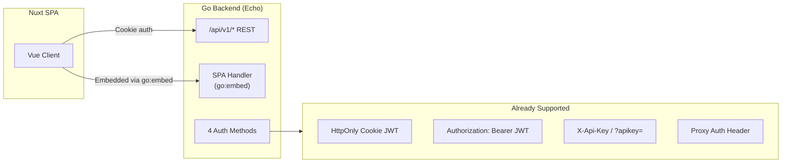
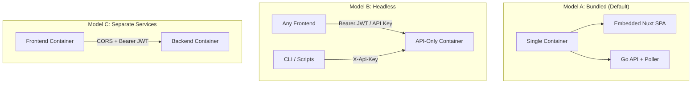

# Frontend/Backend Decoupling Plan

**Date:** 2026-03-01
**Status:** ✅ Complete — Phases 1, 4, 5 done (OpenAPI spec, CORS docs, versioning). Phases 2-3 (headless mode) will not be implemented — superseded by the formalized API infrastructure which enables third-party frontends without requiring a separate headless binary.
**Effort:** M (medium)

## Goal

Formalize the Capacitarr REST API as a first-class, standalone product. Ship the premium Vue/Nuxt frontend as the default, but enable third-party frontends (React, Svelte, mobile apps, CLI tools) to plug into the backend with no code changes.

---

## Current State (Already 90% Decoupled)



**What works today:**
- Pure REST API under `/api/v1/` — no SSR, no server templates
- CORS middleware activated via `CORS_ORIGINS` env var
- Auth: cookie JWT, Bearer JWT, API key header, proxy auth header
- Login endpoint returns JWT in response body (not just cookie)
- Frontend is a static SPA build embedded via `go:embed`

**What's missing:**
- No formal API specification (OpenAPI)
- Frontend embedding is mandatory (no headless mode)
- No API documentation for external consumers
- No versioning strategy documented

---

## Implementation Phases

### Phase 1: OpenAPI Specification

**Effort:** M
**Priority:** High — this is the #1 enabler

Write an OpenAPI 3.1 specification covering all `/api/v1/` endpoints. This serves as:
1. Machine-readable contract for code generators
2. Interactive documentation (Swagger UI / Redoc)
3. Foundation for client SDK generation

**Approach:** Hand-write the spec (not auto-generate) to ensure clean descriptions, examples, and proper schema definitions. Use the existing codebase as the source of truth.

**Endpoints to document:**

| Category | Endpoints |
|----------|-----------|
| **Auth** | `POST /auth/login`, `PUT /auth/password`, `GET/POST /auth/apikey` |
| **Health** | `GET /health` |
| **Dashboard** | `GET /disk-groups`, `PUT /disk-groups/:id`, `GET /worker/stats`, `GET /metrics/history`, `GET /metrics/worker`, `POST /engine/run` |
| **Integrations** | `GET/POST /integrations`, `GET/PUT/DELETE /integrations/:id`, `POST /integrations/test` |
| **Rules & Preferences** | `GET/PUT /preferences`, `GET/POST /rules`, `GET/PUT/DELETE /rules/:id`, `GET /rule-fields`, `GET /preview` |
| **Audit** | `GET /audit`, `GET /audit/activity` |

**Files:**
- `docs/api/openapi.yaml` — OpenAPI 3.1 spec
- `docs/api/README.md` — Quick-start guide for API consumers

---

### Phase 2: Headless Mode (Optional Frontend Embedding)

**Effort:** S

Make the frontend embedding conditional so the binary can run as an API-only server.

**Option A: Build tag** — Use `//go:build !headless` to conditionally include `go:embed`:
```go
// file: embed_frontend.go (only in bundled builds)
//go:build !headless

package main

import "embed"

//go:embed frontend/dist/*
var embeddedFiles embed.FS
var hasEmbeddedFrontend = true
```

```go
// file: embed_headless.go (headless builds)
//go:build headless

package main

import "io/fs"

var embeddedFiles fs.FS // nil
var hasEmbeddedFrontend = false
```

**Option B: Runtime detection** — Check if the embed.FS has any files:
```go
entries, _ := fs.ReadDir(embeddedFiles, "frontend/dist")
if len(entries) == 0 {
    slog.Info("No embedded frontend — running in headless/API-only mode")
} else {
    // Mount SPA handler
}
```

**Recommendation:** Option B is simpler and doesn't require separate build steps.

**Files:**
- `backend/main.go` — conditional SPA handler mounting

---

### Phase 3: Headless Docker Image

**Effort:** XS

Add a separate Dockerfile target that skips the frontend build stage:

```dockerfile
# Headless build — API only, smaller image
FROM golang:1.25-alpine AS backend-builder
# ... (same backend build steps, no frontend copy)

FROM alpine:latest
COPY --from=backend-builder /app/backend/capacitarr /app/capacitarr
# ...
```

Or use a multi-stage docker-compose with a build arg:
```yaml
services:
  capacitarr:
    build:
      context: .
      target: headless  # or 'bundled' for full image
```

**Files:**
- `Dockerfile` — add `headless` target
- `docker-compose.headless.yml` — example headless deployment

---

### Phase 4: CORS & API Documentation

**Effort:** XS

1. Default CORS to permissive when in headless mode (no embedded frontend)
2. Document the `CORS_ORIGINS` env var with examples
3. Add API usage examples to deployment docs:
   - curl examples with API key auth
   - JavaScript fetch examples with Bearer JWT
   - Python requests examples

**Files:**
- `backend/main.go` — auto-configure CORS in headless mode
- `docs/deployment.md` — API access documentation
- `docs/api/examples/` — example scripts in multiple languages

---

### Phase 5: API Versioning Strategy

**Effort:** XS

Document what constitutes a breaking change and the versioning commitment:

- `/api/v1/` is the current stable API
- Adding new fields to responses is non-breaking
- Adding new optional query parameters is non-breaking
- Removing fields, changing types, or removing endpoints IS breaking → requires `/api/v2/`
- Authentication methods are stable and backwards-compatible

**Files:**
- `docs/api/versioning.md` — API stability guarantees

---

## Deployment Models Enabled



---

## Success Criteria

1. A developer can read the OpenAPI spec 
2. A developer can authenticate with API key and CRUD all resources from curl
3. The headless Docker image is <30MB (no frontend assets)
4. The bundled image continues to work exactly as it does today (no regressions)
5. CORS works out of the box for localhost development of custom frontends

---

## Out of Scope (For Now)

- WebSocket/SSE for real-time updates (polling is sufficient)
- GraphQL layer (REST is adequate for current complexity)
- Client SDK packages (OpenAPI spec enables code generation via openapi-generator)
- Rate limiting on the API (add when public-facing deployments emerge)
