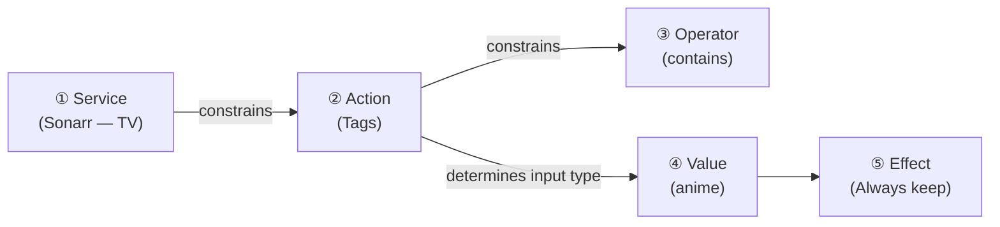

# Cascading Rule Builder — Custom Rules Refactor

**Created:** 2026-03-01T18:01Z  
**Branch:** `feature/cascading-rule-builder`  
**Status:** ✅ Complete — All 3 phases implemented. Core cascade, rule-values endpoint, combobox/closed-set inputs, conflict indicators, drag-to-reorder, bulk enable/disable, and free-text value validation all done.

---

## Overview

Refactor the custom rules system from a flat 5-column form into a cascading, context-aware rule builder. Each dropdown constrains the next, and rules are scoped to specific integration instances.

### Current State

The existing rule form in `frontend/app/pages/rules.vue` presents five independent dropdowns in a single row:

```
[ Type (protect/target) ] [ Field ] [ Operator ] [ Value ] [ Intensity ]
```

**Problems:**
- Fields are global — no service association. Rules apply to all media regardless of source.
- Operators are partially context-aware (string vs. number) but the UX doesn't guide the user.
- "Protect" and "Target" are vague terms. "Intensity" is a separate concept that could be merged.
- Values are always free-text — no autocomplete for enumerable fields like quality profiles.
- No validation that a field is meaningful for the chosen service type.

### Proposed State

A cascading dropdown chain where each selection constrains the next:

```
[ Service Instance ] → [ Action ] → [ Operator ] → [ Value ] → [ Effect ]
```



A completed rule reads as natural English:

> **Sonarr — TV Shows** → Tags → contains → "anime" → **Always keep**

---

## Design Decisions

### 1. Service Scope: Integration Instance

Rules are scoped to a specific integration instance (FK to `IntegrationConfig.ID`), not just service type. This supports users with multiple instances of the same service (e.g., "Sonarr — Anime" and "Sonarr — TV").

### 2. Terminology: "Keep" and "Remove"

Replace "Protect" and "Target" with clearer, action-oriented language:

| Old Term | New Term | Reason |
|----------|----------|--------|
| Protect | Keep | Clear intent — "I want to keep this" |
| Target | Remove | Clear action — "I want this removed when space is needed" |

"Delete" was considered but rejected as too aggressive for a preference system.

### 3. Effect Scale: Combined Type + Intensity

Collapse the current two-field `Type` (protect/target) + `Intensity` (slight/strong/absolute) into a single "Effect" dropdown with 6 options on a keep↔remove spectrum:

| Effect Label | DB Value | Old Equivalent | Score Multiplier |
|-------------|----------|----------------|-----------------|
| Always keep | `always_keep` | protect + absolute | Immune (score=0) |
| Prefer to keep | `prefer_keep` | protect + strong | ×0.2 |
| Lean toward keeping | `lean_keep` | protect + slight | ×0.5 |
| Lean toward removing | `lean_remove` | target + slight | ×1.2 |
| Prefer to remove | `prefer_remove` | target + strong | ×2.0 |
| Always remove | `always_remove` | target + absolute | ×100 (ceiling) |

### 4. User-Friendly Operator Language

Replace technical operators with natural language in the UI:

| Technical | UI Display | Applies To |
|-----------|-----------|------------|
| `==` | is | string, number |
| `!=` | is not | string, number |
| `contains` | contains | string |
| `!contains` (new) | does not contain | string |
| `>` | more than | number |
| `>=` | at least | number |
| `<` | less than | number |
| `<=` | at most | number |

The backend stores the technical operator; the frontend displays the friendly label.

### 5. Value Input Types: Hybrid Strategy

The value input changes based on the selected action:

#### Closed Set (Dropdown — must pick from list)

Fetched from the *arr API, cached with 5-minute TTL.

| Action | Source |
|--------|--------|
| Quality Profile | `/api/v3/qualityprofile` (Sonarr/Radarr), `/api/v1/qualityprofile` (Lidarr/Readarr) |
| Language | `/api/v3/language` (Sonarr/Radarr), `/api/v1/language` (Readarr) |
| Show Status | Built-in enum: continuing, ended, upcoming, deleted |
| Monitored | Boolean toggle: true / false |
| Media Type | Built-in enum: movie, show, season, artist, book |
| Is Requested | Boolean toggle: true / false |

#### Combobox (Suggestions + Custom Input)

Shows suggestions from the *arr API but allows arbitrary values. Supports future/planned values.

| Action | Source |
|--------|--------|
| Tags | `/api/v3/tag` (Sonarr/Radarr), `/api/v1/tag` (Lidarr/Readarr) |
| Genre | Suggestions from library metadata; accepts custom input |

#### Free Input (Text or Number)

No API call needed. Standard `<UiInput>`.

| Action | Input Type | Placeholder / Helper |
|--------|-----------|---------------------|
| Title | text | e.g., "Breaking Bad" |
| Rating | number | 0.0 – 10.0 |
| Size | number | Bytes (with GB/TB unit helper) |
| Time in Library | number | "days" suffix label |
| Year | number | e.g., 2020 |
| Season Count | number | e.g., 5 |
| Episode Count | number | e.g., 100 |
| Play Count | number | e.g., 0 |
| Request Count | number | e.g., 3 |

### 6. Date/Time Clarity

For "Time in Library" rules, the UI must be explicit about direction:

- ✅ "Added **more than** 30 **days** ago"
- ✅ "Added **less than** 7 **days** ago"
- ❌ "Watched in the last 30 days" (ambiguous relative language)

The input field shows a "days" suffix label and the operator dropdown uses natural phrasing.

---

## Actions Per Service Type

Static metadata — hardcoded in Capacitarr, not fetched from remote services.

### Sonarr (TV Shows)

| Action | Type | Operators |
|--------|------|-----------|
| Title | string | is, is not, contains, does not contain |
| Quality Profile | string (closed) | is, is not |
| Tags | string (combobox) | contains, does not contain |
| Genre | string (combobox) | is, is not, contains, does not contain |
| Rating | number | is, is not, more than, at least, less than, at most |
| Size | number | more than, at least, less than, at most |
| Time in Library | number | more than, at least, less than, at most |
| Year | number | is, is not, more than, at least, less than, at most |
| Language | string (closed) | is, is not |
| Monitored | boolean | is |
| Show Status | string (closed) | is, is not |
| Season Count | number | is, is not, more than, at least, less than, at most |
| Episode Count | number | is, is not, more than, at least, less than, at most |

### Radarr (Movies)

| Action | Type | Operators |
|--------|------|-----------|
| Title | string | is, is not, contains, does not contain |
| Quality Profile | string (closed) | is, is not |
| Tags | string (combobox) | contains, does not contain |
| Genre | string (combobox) | is, is not, contains, does not contain |
| Rating | number | is, is not, more than, at least, less than, at most |
| Size | number | more than, at least, less than, at most |
| Time in Library | number | more than, at least, less than, at most |
| Year | number | is, is not, more than, at least, less than, at most |
| Language | string (closed) | is, is not |
| Monitored | boolean | is |

### Lidarr (Music)

Same as Radarr (no TV-specific fields).

### Readarr (Books)

Same as Radarr (no TV-specific fields).

### Enrichment-Only Services

These services don't appear in the service dropdown directly. Their data enriches media items from *arr services:

| Service | Fields Added | Available As Action On |
|---------|-------------|----------------------|
| Tautulli | Play Count | All *arr services |
| Overseerr | Is Requested, Request Count | All *arr services |
| Plex / Jellyfin / Emby | Play Count, Last Played | All *arr services |

When Tautulli or Overseerr is enabled, their fields appear in the action dropdown for all *arr service instances.

---

## Database Changes

### Migration: Add Service Scope + Effect Column

```sql
-- Migration 00005: Refactor protection_rules for cascading rule builder

-- Add integration_id FK (nullable for backward compat with existing global rules)
ALTER TABLE protection_rules ADD COLUMN integration_id INTEGER REFERENCES integration_configs(id) ON DELETE CASCADE;

-- Add effect column (replaces type + intensity)
ALTER TABLE protection_rules ADD COLUMN effect TEXT NOT NULL DEFAULT '';

-- Migrate existing data: combine type + intensity into effect
UPDATE protection_rules SET effect = CASE
    WHEN type = 'protect' AND intensity = 'absolute' THEN 'always_keep'
    WHEN type = 'protect' AND intensity = 'strong'   THEN 'prefer_keep'
    WHEN type = 'protect' AND intensity = 'slight'   THEN 'lean_keep'
    WHEN type = 'target'  AND intensity = 'slight'   THEN 'lean_remove'
    WHEN type = 'target'  AND intensity = 'strong'   THEN 'prefer_remove'
    WHEN type = 'target'  AND intensity = 'absolute'  THEN 'always_remove'
    ELSE 'lean_keep'
END;

-- Note: type and intensity columns are kept for backward compatibility during transition.
-- They can be dropped in a future migration once the new system is stable.
```

### Updated Model

```go
type ProtectionRule struct {
    ID            uint      `gorm:"primarykey" json:"id"`
    IntegrationID *uint     `gorm:"index" json:"integrationId"`        // FK to IntegrationConfig; nil = legacy global rule
    Field         string    `gorm:"not null" json:"field"`             // e.g. "quality", "tag", "rating"
    Operator      string    `gorm:"not null" json:"operator"`          // e.g. "==", "contains", ">"
    Value         string    `gorm:"not null" json:"value"`             // e.g. "4K", "anime", "7.5"
    Effect        string    `gorm:"not null" json:"effect"`            // e.g. "always_keep", "prefer_remove"
    // Deprecated — kept for migration compatibility
    Type          string    `json:"type,omitempty"`
    Intensity     string    `json:"intensity,omitempty"`
    CreatedAt     time.Time `json:"createdAt"`
    UpdatedAt     time.Time `json:"updatedAt"`
}
```

---

## API Changes

### Existing Endpoints (Modified)

#### `GET /api/v1/rule-fields`

Now accepts an optional `?service_type=sonarr` query parameter to filter fields by service type. Without the parameter, returns all fields (backward compat).

Response shape unchanged — array of field descriptors with operators.

#### `GET /api/v1/protections`

Response includes the new `integrationId` and `effect` fields.

#### `POST /api/v1/protections`

Accepts the new payload shape:

```json
{
    "integrationId": 3,
    "field": "tag",
    "operator": "contains",
    "value": "anime",
    "effect": "always_keep"
}
```

### New Endpoint

#### `GET /api/v1/rule-values?integration_id=3&action=quality`

Returns value options for a specific action on a specific integration instance.

```json
{
    "type": "closed",
    "options": [
        { "value": "HD-1080p", "label": "HD-1080p" },
        { "value": "Ultra-HD", "label": "Ultra-HD" },
        { "value": "Any", "label": "Any" }
    ]
}
```

```json
{
    "type": "combobox",
    "suggestions": [
        { "value": "anime", "label": "anime" },
        { "value": "4k", "label": "4k" }
    ]
}
```

```json
{
    "type": "free",
    "inputType": "number",
    "placeholder": "e.g. 7.5",
    "suffix": ""
}
```

### Backend Caching for Value Options

The `/api/v1/rule-values` endpoint queries the remote *arr API for closed-set and combobox actions. To avoid excessive API calls:

- **In-memory TTL cache:** 5-minute TTL per integration_id + action pair.
- **Cache invalidation:** Cleared when an integration is re-tested or when the poller completes a sync cycle.
- **No database persistence:** These are ephemeral lookup values, not authoritative data.

---

## Backend Engine Changes

### `applyRules` Refactor

The `applyRules` function in `backend/internal/engine/rules.go` needs to:

1. **Filter rules by integration ID** — only apply rules that match the item's `IntegrationID` (or global rules with `IntegrationID = nil`).
2. **Use the `effect` field** instead of `type` + `intensity`.
3. **Support the new `!contains` operator** in `stringMatch`.

```go
func applyRules(item integrations.MediaItem, rules []db.ProtectionRule) (bool, float64, string, []ScoreFactor) {
    var reasons []string
    var ruleFactors []ScoreFactor
    modifier := 1.0

    for _, rule := range rules {
        // Skip rules scoped to a different integration
        if rule.IntegrationID != nil && *rule.IntegrationID != item.IntegrationID {
            continue
        }

        if matchesRule(item, rule) {
            ruleName := fmt.Sprintf("%s %s %s", rule.Field, rule.Operator, rule.Value)

            switch rule.Effect {
            case "always_keep":
                // Immune to deletion
                factor := ScoreFactor{...}
                return true, 0.0, fmt.Sprintf("Always keep: %s", ruleName), []ScoreFactor{factor}
            case "prefer_keep":
                modifier *= 0.2
                // ...
            case "lean_keep":
                modifier *= 0.5
                // ...
            case "lean_remove":
                modifier *= 1.2
                // ...
            case "prefer_remove":
                modifier *= 2.0
                // ...
            case "always_remove":
                modifier *= 100.0
                // ...
            }
        }
    }
    return false, modifier, strings.Join(reasons, ", "), ruleFactors
}
```

### New `!contains` Operator

```go
func stringMatch(actual, cond, expected string) bool {
    switch cond {
    case "==":
        return actual == expected
    case "!=":
        return actual != expected
    case "contains":
        return strings.Contains(actual, expected)
    case "!contains":
        return !strings.Contains(actual, expected)
    }
    return false
}
```

---

## Conflict Resolution Strategy

### Strategy: Keep Always Wins + Multiplicative Stack

When multiple rules match the same media item, conflicts are resolved as follows:

1. **"Always keep" is an absolute override.** If any matching rule has the "Always keep" effect, the item is **immune to removal**. No other rules are evaluated. This provides a safety net — if you explicitly say "always keep", nothing can override it.

2. **All other effects multiply together.** Non-absolute effects are combined by multiplying their score modifiers. Multiple rules in the same direction compound (stacking keep rules makes protection stronger; stacking remove rules makes targeting stronger). Opposing rules partially cancel each other out.

3. **"Always remove" is very strong but not absolute.** It applies a ×100 multiplier, making removal near-certain, but keep rules in the same match set can reduce its impact. This asymmetry is intentional — in a media deletion tool, the consequences of wrongly deleting are worse than wrongly keeping.

### Conflict Examples

| Rules Matching | Multipliers | Final | Outcome |
|---------------|-------------|-------|---------|
| Always keep + Always remove | — | Immune | **Kept** (always keep wins) |
| Always keep + Prefer to remove | — | Immune | **Kept** (always keep wins) |
| Prefer to keep + Prefer to remove | ×0.2 × ×2.0 | ×0.4 | Net protection |
| Lean keep + Lean remove | ×0.5 × ×1.2 | ×0.6 | Mild protection |
| Prefer to remove + Lean remove | ×2.0 × ×1.2 | ×2.4 | Strong removal |
| 2× Prefer to remove | ×2.0 × ×2.0 | ×4.0 | Very strong removal |
| Always remove + Lean keep | ×100 × ×0.5 | ×50 | Very strong removal (dampened slightly) |
| Always remove + Prefer to keep | ×100 × ×0.2 | ×20 | Strong removal (dampened but still high) |

### UI Card Subtitle

The Custom Rules card displays this discreet explanation below the title:

> _When multiple rules match an item, their effects multiply together. "Always keep" is an absolute override and cannot be outweighed by any other rule._

### Visual Conflict Indicator

When two or more saved rules could potentially conflict (i.e., one is a keep-direction rule and another is a remove-direction rule, and they could match the same item based on their service/field scope), the UI shows:

- A subtle **⚠️ conflict icon** next to each conflicting rule.
- On hover/click, a **tooltip** explains the conflict and resolution:
  > "This rule conflicts with 'Tags contains anime → Always keep'. When both match, always keep wins."
- Conflict detection is **best-effort** based on rule metadata (same integration instance, overlapping field scope). It does not evaluate actual media items — that's what the Live Preview is for.
- The conflict indicator is informational only — it does not prevent saving rules.

---

## Frontend Changes

### Component: `RuleBuilder.vue` (New)

Extract the rule form from `rules.vue` into a dedicated component. The cascading logic:

1. **Service dropdown:** Populated from `GET /api/v1/integrations` (enabled *arr services only). Selecting a service:
   - Resets action, operator, value, effect
   - Fetches field definitions via `GET /api/v1/rule-fields?service_type=<type>`

2. **Action dropdown:** Populated from the field definitions for the chosen service type. Selecting an action:
   - Resets operator and value
   - Filters operators by the action's data type
   - Determines the value input mode (closed/combobox/free)

3. **Operator dropdown:** Populated based on the action's data type. Uses friendly labels.

4. **Value input:** Dynamically renders based on the action:
   - **Closed:** `<UiSelect>` populated from `GET /api/v1/rule-values?integration_id=X&action=Y`
   - **Combobox:** `<UiCommand>` with suggestions from the same endpoint, plus free text
   - **Free text:** `<UiInput>` with type/placeholder/suffix appropriate to the field
   - **Boolean:** Toggle or simple true/false select

5. **Effect dropdown:** Always the same 6 options. Visual indicators (colors/icons) for the keep↔remove spectrum.

### Rule Display

Each saved rule renders as a human-readable sentence:

```
🟢 Sonarr — TV Shows  |  Tags contains "anime"  |  Always keep          [×]
🔴 Radarr — Movies    |  Rating less than 5.0    |  Prefer to remove     [×]
🟡 Sonarr — TV Shows  |  Year more than 2020     |  Lean toward keeping  [×]
```

Grouped by service instance with visual separators.

---

## Implementation Phases

### Phase 1: Core Cascade (Backend + Frontend)

- [ ] Create branch `feature/cascading-rule-builder`
- [ ] DB migration: add `integration_id` and `effect` columns, migrate existing data
- [ ] Update `ProtectionRule` model
- [ ] Update `applyRules` to use `effect` and filter by `integration_id`
- [ ] Implement "Keep Always Wins" conflict resolution in `applyRules`
- [ ] Add `!contains` operator to `stringMatch`
- [ ] Modify `/api/v1/rule-fields` to accept `?service_type` parameter
- [ ] Update `/api/v1/protections` POST to accept new payload shape
- [ ] Build `RuleBuilder.vue` component with cascading dropdowns
- [ ] Add card subtitle explaining conflict resolution
- [ ] Update rule list display with natural-language sentences
- [ ] Update existing tests in `rules_test.go`
- [ ] Add conflict resolution tests (overlapping keep/remove rules)

### Phase 2: Value Autocomplete

- [ ] New endpoint `GET /api/v1/rule-values`
- [ ] Backend integration with *arr tag/profile/language APIs
- [ ] In-memory TTL cache (5-minute expiry)
- [ ] Frontend: closed-set `<UiSelect>` for quality profiles, languages, show status
- [ ] Frontend: combobox for tags and genres
- [ ] Frontend: unit helpers for numeric inputs (days suffix, GB formatter)
- [ ] Cache invalidation on integration test / poller sync

### Phase 3: Conflict Indicators + Polish

- [ ] Visual conflict indicator (⚠️ icon) on rules with opposing effects for same integration
- [ ] Conflict tooltip explaining resolution outcome
- [ ] Rule validation: warn if a free-text value doesn't match any known options
- [ ] Rule preview: show which items would be affected before saving
- [ ] Rule ordering / priority (drag-to-reorder)
- [ ] Bulk rule management (enable/disable individual rules)

---

## Migration / Backward Compatibility

- Existing rules with `type` + `intensity` are migrated to `effect` via the SQL migration.
- The `type` and `intensity` columns are retained but deprecated. The API continues to accept them during a transition period but prefers `effect`.
- Rules without an `integration_id` (nil) are treated as global rules that apply to all items (backward compat for pre-migration rules).
- The old `GET /api/v1/rule-fields` (no query param) continues to work, returning all fields.

---

## Files Affected

### Backend
- `backend/internal/db/models.go` — Updated `ProtectionRule` model
- `backend/internal/db/migrations/00005_*.sql` — New migration
- `backend/internal/engine/rules.go` — Refactored `applyRules`, new `!contains` operator
- `backend/internal/engine/rules_test.go` — Updated tests
- `backend/routes/rules.go` — Modified endpoints + new `/rule-values` endpoint

### Frontend
- `frontend/app/pages/rules.vue` — Refactored custom rules section
- `frontend/app/components/RuleBuilder.vue` — New cascading rule builder component
