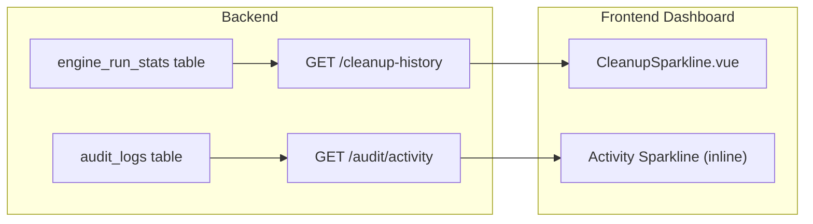
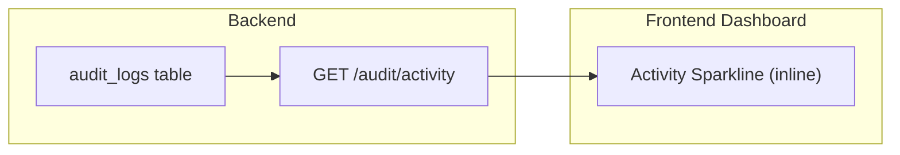

# Remove Cleanup Sparkline

**Date:** 2026-03-02  
**Branch:** `refactor/remove-cleanup-sparkline`
**Status:** ✅ Complete — All phases implemented and merged.
**Size:** S (11–50 lines changed)

## Problem

The dashboard has two overlapping sparkline visualisations for cleanup activity:

1. **CleanupSparkline** — a dedicated Vue component (`CleanupSparkline.vue`) backed by the `GET /api/v1/cleanup-history` endpoint (`routes/cleanup.go`). Queries the `engine_run_stats` table, aggregating `SUM(flagged)` and `SUM(freed_bytes)` into time buckets.

2. **Audit Activity sparkline** — inline in `pages/index.vue`, backed by the `GET /api/v1/audit/activity` endpoint (`routes/audit.go`). Queries the `audit_logs` table, counting per-item "Dry-Run" and "Deleted" actions into time buckets.

Both visualise the same underlying cleanup events from different data sources. The `audit_logs` table is the **authoritative, item-level** record of every cleanup action, while `engine_run_stats` is an **aggregate, run-level** summary. Having both on the dashboard is redundant and confusing.

## Application-Level Logging for Cleanup Events

Capacitarr uses Go's `log/slog` with a JSON handler writing to **stdout** (visible via `docker compose logs`). The log level is configurable at runtime through the preferences UI (`logLevel` field in `PreferenceSet`).

### Existing cleanup-related slog output

The following structured log messages already fire during cleanup operations:

| Level | Message | Component | File | When |
|-------|---------|-----------|------|------|
| `INFO` | `"Disk threshold breached, evaluating media for deletion"` | poller | `evaluate.go:34` | Threshold exceeded — evaluation begins |
| `DEBUG` | `"Evaluation summary"` | poller | `evaluate.go:74` | After scoring all items on a disk group |
| `DEBUG` | `"Deletion candidate"` | poller | `evaluate.go:108` | Each item selected for removal |
| `INFO` | `"Engine action taken"` | poller | `evaluate.go:177` | Item flagged/queued (includes media title, action, score, freed bytes) |
| `WARN` | `"SAFETY GUARD: Delete skipped"` | poller | `delete.go:56` | Safety guard prevents actual deletion |
| `INFO` | `"Background engine action completed"` | poller | `delete.go:111` | After writing audit log entry for a deletion |
| `WARN` | `"Deletion queue full, skipping item"` | poller | `evaluate.go:128` | Queue overflow — item dropped |
| `ERROR` | `"Background deletion failed"` | poller | `delete.go:80` | Actual deletion call failed |
| `ERROR` | `"Failed to create audit log entry"` | poller | `delete.go:108` | DB write for audit log failed |
| `DEBUG` | `"Poll cycle complete"` | poller | `poller.go:194` | End of each cycle (duration, stats) |
| `INFO` | `"Pruned old engine run stats"` | jobs | `cron.go:140` | Retention cron cleaned up old rows |

### Assessment

**There is no application-level log viewer in the UI.** All `slog` output goes to stdout only. Users must use `docker compose logs` or a log aggregator to view it. The log level can be changed through the Settings page (`logLevel` preference: debug/info/warn/error).

For **tracking cleanup events without the sparkline**, users have two options:

1. **Audit log page** (`/audit`) — the in-app UI that queries `audit_logs` with search, filter, sort, and pagination. This is the richest view of cleanup history.
2. **Container logs** (`docker compose logs capacitarr`) — structured JSON logs with the `slog` messages above. Setting log level to `info` captures all threshold breaches, engine actions, and deletion completions.

The audit log is the better option for most users — it's queryable, persistent, and already displayed in the UI. The container logs are useful for debugging or integrating with external monitoring tools (Grafana Loki, etc.).

## Data Flow Before

## Data Flow After

## Plan

### Phase 1: Remove Frontend Component

| # | Task | Files |
|---|------|-------|
| 1 | Remove `<CleanupSparkline>` usage from `pages/index.vue` | `frontend/app/pages/index.vue` |
| 2 | Remove the `cleanupRange` computed property | `frontend/app/pages/index.vue` |
| 3 | Delete `CleanupSparkline.vue` | `frontend/app/components/CleanupSparkline.vue` |
| 4 | Remove `CleanupHistoryItem` interface | `frontend/app/types/api.ts` |

### Phase 2: Remove Backend Endpoint

| # | Task | Files |
|---|------|-------|
| 5 | Delete `routes/cleanup.go` entirely | `backend/routes/cleanup.go` |
| 6 | Remove `RegisterCleanupRoutes(protected, database)` call | `backend/routes/api.go` (line 191) |

### Phase 3: Verify

| # | Task |
|---|------|
| 7 | Confirm the dashboard still shows the audit activity sparkline (flagged/deleted) |
| 8 | Confirm no remaining references to `cleanup-history` or `CleanupSparkline` in codebase |
| 9 | Confirm build succeeds (`docker compose up --build`) |

## What We Keep

- **`engine_run_stats` table** — still used by `GetWorkerMetrics()` in `poller/stats.go` for the Engine Control popover (last run stats, cumulative totals). Not affected by this change.
- **`audit/activity` endpoint** — already serves the dashboard activity sparkline.
- **`audit` and `audit/grouped` endpoints** — full audit log page.
- **`slog` structured logging** — all cleanup events continue to be logged to stdout at INFO level.

## Risks

- **None meaningful.** The cleanup sparkline has no downstream consumers beyond the dashboard card. The `engine_run_stats` table is preserved for its other uses. The `parseDuration()` and `cleanupBucketExpr()` functions in `cleanup.go` are local to that file; `parseDuration()` is also defined in `audit.go` (same package), so deleting `cleanup.go` may require checking for duplicate/shared helpers.
