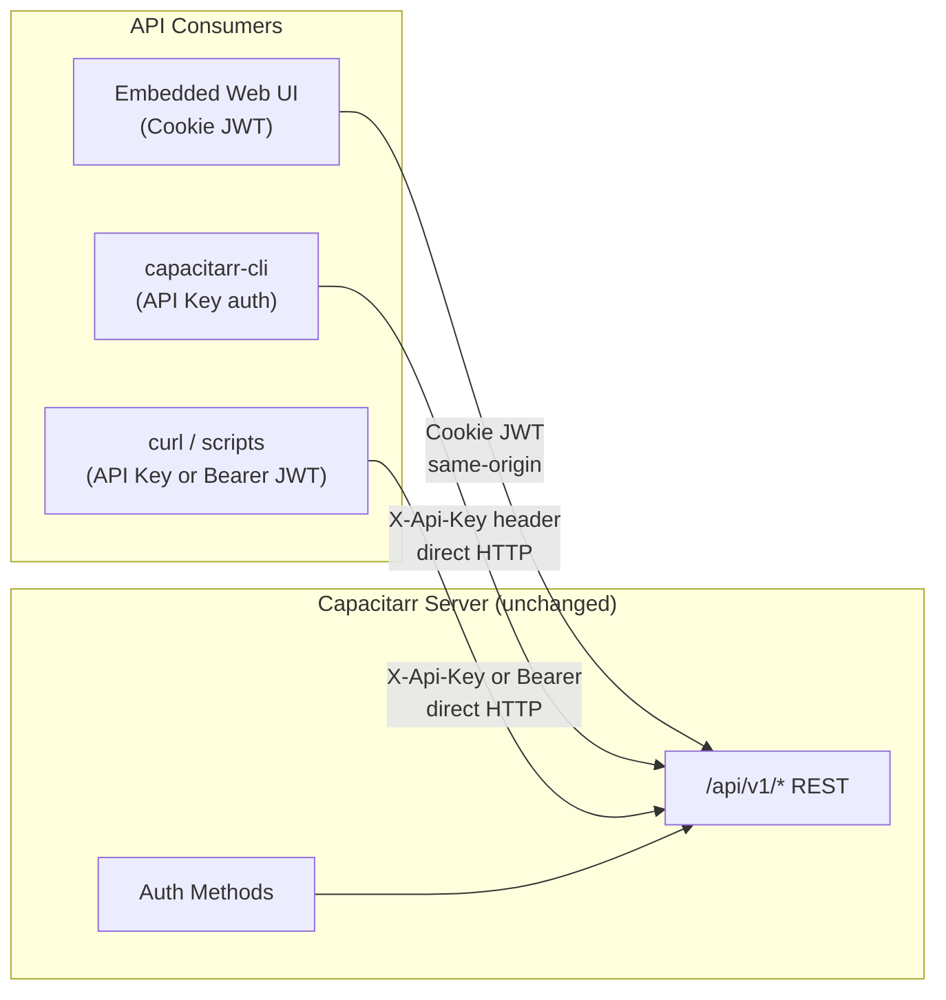

# API Documentation & Specification

**Date:** 2026-03-02
**Status:** ✅ Complete — OpenAPI 3.1 specification, API examples, workflows guide, and versioning documentation all implemented.
**Effort:** M (medium)
**Relates to:** [Frontend/Backend Decoupling Plan](20260301T1548Z-frontend-backend-decoupling.md)

## Goal

Formalize the Capacitarr REST API as a documented, first-class interface so that a Linux console CLI frontend (`capacitarr-cli`) can be built as a separate project. The existing API is already fully functional for external consumers — the work here is documentation, specification, and minor quality-of-life improvements.

---

## Current State (Already CLI-Ready)



**What works today (no changes needed):**

- Pure REST API under `/api/v1/` — no SSR, no server templates
- API key auth via `X-Api-Key` header or `?apikey=` query param (no browser, no CORS, no cookies)
- Bearer JWT auth via `Authorization: Bearer <token>` header
- Login endpoint (`POST /auth/login`) returns JWT in response body
- API key generation (`GET/POST /auth/apikey`) for persistent CLI access
- All CRUD operations available via standard HTTP methods

**What's missing:**

- No formal API specification (OpenAPI) — CLI must reverse-engineer endpoints from source code
- No API documentation for external consumers
- No versioning/stability guarantees documented
- No example scripts or quick-start guide

---

## API Surface

All endpoints are under `/api/v1/`. The CLI needs access to all of these:

| Category | Endpoints | Auth | CLI Use Case |
|----------|-----------|------|--------------|
| **Public** | `GET /health`, `GET /version` | None | Health checks, version display |
| **Auth** | `POST /auth/login` | None | Initial JWT retrieval (optional — API key preferred) |
| **Auth Management** | `PUT /auth/password`, `PUT /auth/username`, `GET/POST /auth/apikey` | Required | API key generation and rotation |
| **Dashboard** | `GET /disk-groups`, `PUT /disk-groups/:id` | Required | View/configure disk thresholds |
| **Stats** | `GET /worker/stats`, `GET /metrics/worker`, `GET /dashboard-stats`, `GET /lifetime-stats` | Required | Status display, monitoring |
| **Metrics** | `GET /metrics/history` | Required | Historical data export |
| **Engine** | `POST /engine/run` | Required | Trigger evaluation cycle |
| **Integrations** | `GET/POST /integrations`, `GET/PUT/DELETE /integrations/:id`, `POST /integrations/test` | Required | Manage Sonarr/Radarr/etc. connections |
| **Rules** | `GET/POST /rules`, `GET/PUT/DELETE /rules/:id`, `GET /rule-fields`, `GET /preview` | Required | Manage protection rules, preview scoring |
| **Preferences** | `GET/PUT /preferences` | Required | Configure engine behavior |
| **Audit** | `GET /audit`, `GET /audit/activity` | Required | View deletion history |
| **Data** | `POST /data/reset` | Required | Reset application data |

**Auth methods for CLI (no changes needed):**

- **Preferred:** `X-Api-Key: <key>` header — stateless, no expiry, simple
- **Alternative:** `Authorization: Bearer <jwt>` — time-limited, requires login flow
- **Query param:** `?apikey=<key>` — for quick curl one-liners (less secure, visible in logs)

---

## Implementation Phases

### Phase 1: OpenAPI Specification

**Effort:** M
**Priority:** High — this is the #1 enabler for CLI development

Write an OpenAPI 3.1 specification covering all `/api/v1/` endpoints. This serves as:

1. Machine-readable contract that the CLI can validate against
2. Interactive documentation (Swagger UI / Redoc) for developers
3. Foundation for auto-generating CLI command structures
4. Single source of truth for request/response schemas

**Approach:** Hand-write the spec (not auto-generate) to ensure clean descriptions, examples, and proper schema definitions. Use the existing Go structs and TypeScript interfaces as the source of truth.

**Key schemas to define:**

| Schema | Source (Go) | Source (TS) |
|--------|-------------|-------------|
| `DiskGroup` | `db.DiskGroup` | `types/api.ts → DiskGroup` |
| `Integration` | `db.IntegrationConfig` | `types/api.ts → IntegrationConfig` |
| `PreferenceSet` | `db.PreferenceSet` | `types/api.ts → PreferenceSet` |
| `ProtectionRule` | `db.ProtectionRule` | `types/api.ts → ProtectionRule` |
| `AuditLog` | `db.AuditLog` | `types/api.ts → AuditLog` |
| `WorkerStats` | `poller.GetWorkerMetrics()` return | `types/api.ts → WorkerStats` |
| `DashboardStats` | `handleDashboardStats()` return | `types/api.ts → DashboardStats` |
| `EvaluatedItem` | `engine.EvaluatedItem` | `types/api.ts → EvaluatedItem` |
| `LibraryHistory` | `db.LibraryHistory` | `types/api.ts → LibraryHistoryRow` |

**Files:**

- `docs/api/openapi.yaml` — OpenAPI 3.1 spec
- `docs/api/README.md` — Quick-start guide for API consumers

---

### Phase 2: API Documentation & Examples

**Effort:** S
**Priority:** High

Create practical documentation for CLI and script authors:

1. **Quick-start guide** — authenticate, check status, trigger a run in 3 commands
2. **curl examples** for every endpoint with API key auth
3. **Common workflows** — "set up a new integration", "configure rules", "check what would be deleted"

**Example quick-start:**

```bash
# Generate an API key (requires initial login)
curl -s -X POST http://localhost:2187/api/v1/auth/login \
  -H 'Content-Type: application/json' \
  -d '{"password":"your-password"}' | jq .token

# Use the token to generate a persistent API key
curl -s http://localhost:2187/api/v1/auth/apikey \
  -H 'Authorization: Bearer <token-from-above>' | jq .api_key

# Now use the API key for all subsequent requests
export CAPACITARR_API_KEY="<your-api-key>"

# Check server status
curl -s http://localhost:2187/api/v1/health

# View disk groups
curl -s http://localhost:2187/api/v1/disk-groups \
  -H "X-Api-Key: $CAPACITARR_API_KEY" | jq

# Preview what would be deleted
curl -s http://localhost:2187/api/v1/preview \
  -H "X-Api-Key: $CAPACITARR_API_KEY" | jq '.items[:5]'

# Trigger an engine run
curl -s -X POST http://localhost:2187/api/v1/engine/run \
  -H "X-Api-Key: $CAPACITARR_API_KEY" | jq
```

**Files:**

- `docs/api/README.md` — Quick-start and authentication guide
- `docs/api/examples.md` — curl examples for all endpoints
- `docs/api/workflows.md` — Common multi-step workflows

---

### Phase 3: API Versioning & Stability Guarantees

**Effort:** XS
**Priority:** Medium

Document what constitutes a breaking change and the versioning commitment so CLI authors know what to expect:

- `/api/v1/` is the current stable API
- **Non-breaking** (no version bump): adding new fields to responses, adding new optional query parameters, adding new endpoints
- **Breaking** (requires `/api/v2/`): removing fields, changing field types, removing endpoints, changing auth behavior
- Authentication methods are stable and backwards-compatible

**Files:**

- `docs/api/versioning.md` — API stability guarantees

---

## Future Considerations (Deferred)

These items are **not needed for the API documentation work** in this plan but may be revisited later:

| Item | Why Deferred |
|------|-------------|
| **CLI Tool (`capacitarr-cli`)** | Separate project with its own plan — depends on Phases 1-3 being complete. Will live in a separate repo as a standalone Go binary |
| **Headless mode (build tags)** | CLI talks to the existing bundled server — no need for an API-only binary |
| **Split Docker images** | CLI is a standalone binary, not a container alongside the server |
| **CORS auto-configuration** | CLI makes direct HTTP requests, not browser cross-origin requests |
| **Frontend Nginx container** | No separate web frontend deployment needed |
| **Independent frontend versioning** | Web UI stays bundled with the server |

These become relevant if/when the CLI tool is built, or a separate web frontend or mobile app is developed.

---

## Success Criteria

1. A developer can read the OpenAPI spec and understand every endpoint without reading source code
2. A developer can authenticate with an API key and interact with all endpoints using curl
3. The API versioning policy is documented so CLI authors know what's stable
4. The quick-start guide gets a new user from zero to "preview what would be deleted" in under 5 minutes
5. The CLI tool (Phase 4) can be built entirely from the OpenAPI spec and documentation

---

## Out of Scope

- WebSocket/SSE for real-time updates (CLI can poll)
- GraphQL layer (REST is adequate)
- Client SDK packages (OpenAPI spec enables code generation if needed later)
- Auto-generated API clients (hand-written CLI client is simpler and more maintainable at this scale)
