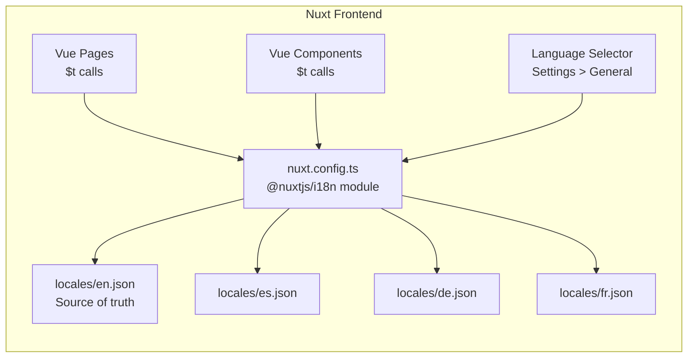

# Internationalization (i18n) Implementation Plan

**Date:** 2026-03-02
**Status:** ✅ Complete — Infrastructure setup, 229-key English locale, string extraction across all pages/components, language selector in Settings, and stub translations for Spanish, German, and French.
**Branch:** `feature/i18n`
**Supersedes:** Phase 2 of `20260301T1658Z-safety-guard-and-i18n.md`

---

## Overview

Add internationalization support to the Capacitarr frontend using `@nuxtjs/i18n`. All user-facing strings in Vue templates will be extracted into locale JSON files, with English as the source of truth and initial translations for Spanish, German, and French.

Backend API error messages remain in English — API consumers expect English responses.

---

## Current State

- All user-facing strings are hardcoded in English across 4 pages, ~10 components, and several composables
- The app is SPA-only (`ssr: false` in `nuxt.config.ts`), simplifying i18n since no locale-prefixed routes are needed
- No i18n dependencies exist in `package.json`

---

## Architecture



### Strategy

- **Lazy loading:** Only the active locale file is loaded at runtime
- **No route prefixing:** Single-language display, switchable in settings (stored in `localStorage`)
- **Flat-namespaced keys:** `page.section.key` format for easy searching and organizing
- **Fallback:** Always falls back to `en` for missing translation keys

---

## String Inventory

Comprehensive audit of every file containing user-facing strings:

### Pages

| File | String Categories | ~Count |
|------|-------------------|--------|
| `pages/index.vue` | Dashboard title, subtitle, stat card labels, engine status messages, empty states, chart labels, time range options, refresh options, chart mode options | ~45 |
| `pages/settings.vue` | Page title, 4 tab labels, card titles/descriptions, form labels, placeholders, button text, select options, dialog text, help text, Plex token instructions | ~75 |
| `pages/audit.vue` | Page title, subtitle, table headers, empty state, filter button labels, pagination text, search placeholder | ~18 |
| `pages/login.vue` | Title, subtitle, form labels, placeholders, button text, branding tagline | ~10 |

### Components

| File | String Categories | ~Count |
|------|-------------------|--------|
| `components/RuleBuilder.vue` | Field labels, placeholders, operator labels, button text | ~15 |
| `components/ScoreDetailModal.vue` | Section headers, table headers, badge labels | ~10 |
| `components/ScoreBreakdown.vue` | Minimal — mostly data-driven labels | ~3 |
| `components/DiskGroupSection.vue` | Card labels, threshold text, action buttons | ~12 |
| `components/SkeletonCard.vue` | None — visual only | 0 |
| Layout/Navigation | Nav links, app title | ~6 |

### Composables / Utils

| File | String Categories | ~Count |
|------|-------------------|--------|
| `composables/useApi.ts` | Toast messages for success/error | ~8 |
| `utils/format.ts` | Relative time labels if any | ~3 |

### Total Estimate: **~205 translatable strings**

Note: Some strings are dynamic templates with interpolation, e.g.:
- `"3 disk groups mapped"` → `"{count} disk group | {count} disk groups"` (pluralization)
- `"Updated 2m ago"` → `"Updated {time}"` (interpolation)
- `"Showing 50 of 200 — scroll for more"` → interpolation with multiple variables

---

## Target Languages

### Tier 1 — Ship at launch

| Language | Code | Rationale |
|----------|------|-----------|
| English | `en` | Source language |
| Spanish | `es` | 2nd largest *arr community; large Plex userbase in Latin America and Spain |
| German | `de` | Very active self-hosting and homelab community in DACH region |
| French | `fr` | Large Plex/Sonarr community in France and Quebec |

### Tier 2 — Community-contributed post-launch

| Language | Code | Rationale |
|----------|------|-----------|
| Portuguese - BR | `pt-BR` | Growing *arr community in Brazil |
| Dutch | `nl` | Disproportionately active in self-hosting |
| Italian | `it` | Solid Plex community |

### Tier 3 — When demand warrants

| Language | Code | Rationale |
|----------|------|-----------|
| Polish | `pl` | Active homelab community in Eastern Europe |
| Swedish | `sv` | Nordic self-hosting popularity |
| Japanese | `ja` | Tests CJK layout handling |
| Chinese Simplified | `zh-CN` | Large potential audience |

---

## i18n Key Convention

Flat namespaced format: `{page/component}.{section}.{key}`

```json
{
  "common.save": "Save",
  "common.cancel": "Cancel",
  "common.delete": "Delete",
  "common.loading": "Loading…",
  "common.test": "Test",
  "common.edit": "Edit",
  "common.refresh": "Refresh",
  "common.active": "Active",
  "common.disabled": "Disabled",
  "common.idle": "Idle",

  "nav.dashboard": "Dashboard",
  "nav.audit": "Audit History",
  "nav.settings": "Settings",

  "dashboard.title": "Dashboard",
  "dashboard.subtitle": "Capacity overview across your media storage.",
  "dashboard.engineActivity": "Engine Activity",
  "dashboard.runNow": "Run Now",
  "dashboard.engineRunning": "Engine running…",
  "dashboard.lastRun": "Last run: {time}",
  "dashboard.noRunsYet": "No runs yet",
  "dashboard.evaluated": "Evaluated {count}",
  "dashboard.flagged": "Flagged {count}",
  "dashboard.wouldFree": "Would free",
  "dashboard.freed": "Freed",
  "dashboard.queue": "Queue",
  "dashboard.queueItems": "items",
  "dashboard.activeDelete": "Active Delete",
  "dashboard.dryRunNoDelete": "Dry-Run — no deletions",
  "dashboard.waiting": "Waiting…",
  "dashboard.viewAuditLog": "View full audit log →",
  "dashboard.totalStorage": "Total Storage",
  "dashboard.usedCapacity": "Used Capacity",
  "dashboard.utilization": "{pct}% utilization",
  "dashboard.diskGroups": "{count} disk group mapped | {count} disk groups mapped",
  "dashboard.integrations": "Integrations",
  "dashboard.syncedRecently": "{count} synced recently",
  "dashboard.spaceReclaimed": "Total Space Reclaimed",
  "dashboard.itemsRemoved": "{count} items removed lifetime",
  "dashboard.protectedItems": "Protected Items",
  "dashboard.protectedByRules": "items protected by your rules",
  "dashboard.growthRate": "Library Growth Rate",
  "dashboard.overLastWeek": "over the last 7 days",
  "dashboard.notEnoughData": "not enough data yet",
  "dashboard.noDiskGroups": "No disk groups yet",
  "dashboard.noDiskGroupsHelp": "Add integrations in Settings and data will appear on the next poll cycle.",

  "login.title": "Welcome Back",
  "login.subtitle": "Sign in to Capacitarr",
  "login.username": "Username",
  "login.password": "Password",
  "login.signingIn": "Signing in...",
  "login.signIn": "Sign In",
  "login.branding": "Capacitarr — Intelligent Media Capacity Management",

  "settings.title": "Settings",
  "settings.subtitle": "Manage integrations, general preferences, and authentication.",
  "settings.general": "General",
  "settings.integrations": "Integrations",
  "settings.security": "Security",
  "settings.advanced": "Advanced"
}
```

This is a representative sample — the full `en.json` will contain all ~205 keys organized this way.

---

## File Structure

```
frontend/app/
├── locales/
│   ├── en.json         # English — source of truth, complete
│   ├── es.json         # Spanish
│   ├── de.json         # German
│   └── fr.json         # French
├── i18n/
│   └── i18n.config.ts  # @nuxtjs/i18n configuration
└── ...existing files...
```

---

## Implementation Phases

### Phase 1: Infrastructure Setup

1. Install `@nuxtjs/i18n` via pnpm
2. Add `@nuxtjs/i18n` to `modules` array in `nuxt.config.ts`
3. Create `i18n/i18n.config.ts` with lazy-loading configuration
4. Create initial `locales/en.json` with common keys
5. Verify the module loads correctly and `$t()` works in a test string

### Phase 2: String Extraction — Pages

Extract all hardcoded strings from Vue templates, replacing with `$t()` calls.

Order by complexity, simplest first:

1. `pages/login.vue` — ~10 strings, isolated page, good for proving the pattern
2. `pages/audit.vue` — ~18 strings, table headers and empty states
3. `pages/index.vue` — ~45 strings, dashboard stat cards, engine status, dynamic messages
4. `pages/settings.vue` — ~75 strings, largest page, 4 tabs, forms, modals, help text

### Phase 3: String Extraction — Components

1. `components/ScoreDetailModal.vue` — table headers, section labels
2. `components/ScoreBreakdown.vue` — minimal strings
3. `components/RuleBuilder.vue` — field labels, placeholders, operators
4. `components/DiskGroupSection.vue` — card labels, thresholds
5. Layout/navigation component — nav links, app title

### Phase 4: String Extraction — Composables and Utils

1. Toast messages in API composable
2. Any format utility strings (relative time labels etc.)

### Phase 5: Language Selector UI

1. Add language dropdown to Settings > General tab, alongside theme and clock format
2. Store selected locale in `localStorage` (same pattern as theme/clock)
3. Wire up locale switching via `@nuxtjs/i18n` `setLocale()` API

### Phase 6: Translations

1. Create `locales/es.json` — Spanish translation of all keys
2. Create `locales/de.json` — German translation of all keys
3. Create `locales/fr.json` — French translation of all keys

### Phase 7: Testing and Polish

1. Verify all pages render correctly in each language
2. Check for text overflow/truncation (German strings are typically ~30% longer)
3. Test locale persistence across page reloads
4. Test fallback behavior for missing keys
5. Update `CONTRIBUTING.md` with instructions for adding new translations
6. Verify the splash screen "Loading Capacitarr…" still works (it's in inline JS)

---

## Technical Decisions

### Why `@nuxtjs/i18n`

- Official Nuxt module with first-class support
- Built-in lazy loading of locale files
- Vue Composition API compatible (`useI18n()`)
- Handles pluralization, interpolation, and datetime/number formatting
- 5.5k+ GitHub stars, actively maintained

### What stays in English

- Backend API error messages (API contract)
- Console log messages
- Code comments
- Git/CI configuration

### Pluralization

Vue I18n uses pipe-separated plurals:

```json
"dashboard.diskGroups": "{count} disk group mapped | {count} disk groups mapped"
```

```vue
{{ $t('dashboard.diskGroups', { count: diskGroups.length }) }}
```

### Dynamic select options

Options like execution modes, tiebreakers, and poll intervals are defined in `<script setup>` as arrays. These need to use computed properties with `$t()`:

```typescript
const executionModes = computed(() => [
  { value: 'dry_run', label: t('settings.engine.dryRun'), description: t('settings.engine.dryRunDesc') },
  { value: 'approval', label: t('settings.engine.approval'), description: t('settings.engine.approvalDesc') },
  { value: 'auto', label: t('settings.engine.auto'), description: t('settings.engine.autoDesc') }
])
```

### Splash screen string

The `nuxt.config.ts` inline splash script contains `"Loading Capacitarr…"`. This is hardcoded in a raw `<script>` tag and cannot use Vue I18n. Options:
1. Keep it in English (recommended — it's a brief loading state)
2. Read locale from `localStorage` and maintain a small translation map in the inline script

---

## Risks and Mitigations

| Risk | Impact | Mitigation |
|------|--------|------------|
| German/French text overflow in compact UI areas | Layout breakage | Test with longest locale, use `truncate` where needed, check responsive breakpoints |
| Missing translations in community-contributed locales | Partial UI in wrong language | `@nuxtjs/i18n` falls back to `en` for missing keys — acceptable UX |
| Performance impact of loading locale files | Slower first paint | Lazy loading ensures only one ~10KB JSON file loads |
| Breaking string keys during refactors | Missing translations | Lint rule or CI check to verify all `$t()` keys exist in `en.json` |

---

## Future Enhancements (Post-MVP)

- **CI validation:** Script to verify all locale files have the same keys as `en.json`
- **Translation management:** Integrate with Crowdin or Weblate for community translations
- **RTL support:** If Arabic/Hebrew demand arises — requires CSS changes beyond string extraction
- **Date/Number formatting:** Use Vue I18n's `$d()` and `$n()` for locale-aware formatting
- **Backend notifications:** If email/webhook notifications are added, those may need i18n too
