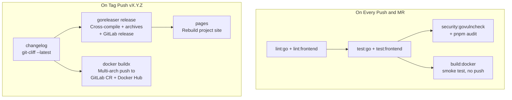

# Build, CI/CD, and Publishing Overhaul

## Current State Summary

| Area | Status | Problem |
|------|--------|---------|
| **Frontend build** | ✅ Works | `pnpm run build` → `.output/public` SPA — no issues |
| **Backend build** | ⚠️ Docker-only | No standalone Go build target; version injection only in Dockerfile |
| **Docker image** | ⚠️ Not published | `build:docker` CI job builds and discards; no registry push |
| **Multi-arch** | ❌ Missing | Only `linux/amd64`; no arm64 for Raspberry Pi/NAS |
| **Release trigger** | ⚠️ Fragile | Auto-releases on every `main` push; `docs:` commit = patch release |
| **Version files** | ❌ Broken | `package.json` and `CHANGELOG.md` updates are CI artifacts that expire in 1 week, never committed back |
| **Changelog → site** | ✅ Works | `sync-docs.mjs` copies `CHANGELOG.md` into site content; `pages` CI job rebuilds on `main` push |
| **Binary releases** | ❌ Missing | No downloadable archives attached to GitLab releases |
| **Publishing** | ❌ None | No Docker Hub, no registry, no community listings |

### Changelog & Site: What's Already Handled

- `git-cliff` generates `CHANGELOG.md` from conventional commits (configured in `cliff.toml`)
- `site/scripts/sync-docs.mjs` copies `CHANGELOG.md` into the site's content directory during the `pages` CI job
- The `pages` job runs on every `main` push and deploys to GitLab Pages

**Gap:** The `CHANGELOG.md` in the repo is only updated as a CI artifact (expires in 1 week). The committed version in the repo drifts. The site build reads from the committed file, so the site changelog can be stale. This plan fixes that by committing the changelog back before the site build runs.

---

## Phase 1: Build Foundation

### 1.1 Add standalone Makefile targets

Add targets to `Makefile` so frontend and backend can be built independently without Docker:

```makefile
build\:frontend:
    cd frontend && pnpm install --frozen-lockfile && pnpm run build

build\:backend: build\:frontend
    mkdir -p backend/frontend/dist
    cp -r frontend/.output/public/* backend/frontend/dist/
    cd backend && CGO_ENABLED=1 go build \
        -ldflags="-w -s -X main.version=$$(git describe --tags --always) \
        -X main.commit=$$(git rev-parse --short HEAD) \
        -X main.buildDate=$$(date -u +%Y-%m-%dT%H:%M:%SZ)" \
        -o capacitarr main.go
```

### 1.2 Add GoReleaser configuration

Create `.goreleaser.yml` at the project root. GoReleaser handles:

- Cross-compilation (linux/amd64, linux/arm64)
- Archive packaging (`.tar.gz` with binary + entrypoint + README)
- Checksum generation (`checksums.txt`)
- GitLab release creation with asset uploads
- Docker image building via `docker buildx` (multi-arch)

The frontend build runs as a GoReleaser `before` hook so the SPA is embedded into every cross-compiled binary.

### 1.3 Multi-arch Dockerfile

Update `Dockerfile` to support `--platform` argument for `docker buildx`. The Go build stage needs to respect `TARGETARCH` for cross-compilation. The Alpine runtime stage already works multi-arch.

---

## Phase 2: CI/CD Overhaul

### 2.1 Switch to tag-triggered releases

Replace the current auto-release-on-main with tag-triggered releases:

- **On every push and MR:** lint → test → security → Docker build smoke test (no push)
- **On `v*` tag push:** changelog → GoReleaser (binaries + Docker images + GitLab release) → pages rebuild

This means you control when releases happen. The workflow:

```bash
git cliff --bumped-version          # see what version would be
git cliff --bump -o CHANGELOG.md    # update changelog
git add CHANGELOG.md
git commit -m "chore(release): v0.2.0"
git tag v0.2.0
git push origin main --tags         # triggers release pipeline
```

### 2.2 Push Docker images to registries

The release pipeline pushes multi-arch images to:

1. **GitLab Container Registry** — `registry.gitlab.com/starshadow/software/capacitarr`
2. **Docker Hub** — `docker.io/starshadow/capacitarr` (or chosen namespace)

Image tags follow the standard pattern:

```
capacitarr:latest
capacitarr:0
capacitarr:0.2
capacitarr:0.2.0
```

Multi-arch manifests cover `linux/amd64` and `linux/arm64` under each tag.

**CI variables needed:**

- `DOCKERHUB_USERNAME` — Docker Hub username
- `DOCKERHUB_TOKEN` — Docker Hub access token

GitLab Container Registry uses the built-in `CI_REGISTRY_*` variables (already available).

### 2.3 Attach binary archives to GitLab releases

GoReleaser automatically creates and uploads:

- `capacitarr_0.2.0_linux_amd64.tar.gz`
- `capacitarr_0.2.0_linux_arm64.tar.gz`
- `checksums.txt`

These appear as downloadable assets on the GitLab release page.

### 2.4 Fix changelog and version file persistence

Two options (recommend Option A):

**Option A: Tag is source of truth (simpler)**
- `CHANGELOG.md` is committed manually as part of the release prep (see 2.1 workflow)
- `package.json` version is updated locally before tagging
- The CI release job does NOT try to commit back — it just reads the tag
- The `pages` job runs after the release and picks up the committed changelog

**Option B: CI commits back (more automated, more complex)**
- The release job updates `CHANGELOG.md` and `package.json`, then pushes a commit to `main` using a project access token
- Requires a `PROJECT_ACCESS_TOKEN` CI variable with write access
- Risk of CI loops (commit triggers pipeline triggers commit)

### 2.5 Ensure site rebuilds on release

The `pages` job should run on tag pushes (in addition to or instead of `main` pushes) so the site always reflects the latest release changelog. With Option A above, the changelog is already committed before the tag, so the `pages` job on `main` push already picks it up. Adding a `pages` trigger on tag push is a safety net.

---

## Phase 3: Publishing & Distribution

### 3.1 Create Docker Hub repository

- Create a Docker Hub account/organization (e.g., `starshadow` or `capacitarr`)
- Create the `capacitarr` repository
- Add `DOCKERHUB_USERNAME` and `DOCKERHUB_TOKEN` as CI/CD variables in GitLab
- Update `README.md` and docs with Docker Hub pull instructions

### 3.2 Submit Unraid Community Apps template

Create an Unraid template XML file and submit it to the [Unraid Community Applications](https://forums.unraid.net/topic/38582-plug-in-community-applications/) repository. The template defines:

- Container image reference (Docker Hub)
- Port mappings (2187)
- Volume mappings (/config)
- Environment variables (PUID, PGID)
- Icon and description
- Support URL (GitLab issues)

### 3.3 Update documentation

- Update `docs/deployment.md` with Docker Hub pull instructions
- Update `docs/releasing.md` to reflect the new tag-triggered workflow
- Update `README.md` installation section with registry URLs
- Add Docker Hub badge to README

---

## Pipeline Architecture



## Files to Create or Modify

| File | Action | Description |
|------|--------|-------------|
| `.goreleaser.yml` | **Create** | GoReleaser configuration for cross-compilation, Docker, and GitLab releases |
| `Makefile` | **Modify** | Add standalone `build:frontend`, `build:backend` targets |
| `.gitlab-ci.yml` | **Modify** | Replace release job with GoReleaser + Docker push; switch to tag triggers |
| `Dockerfile` | **Modify** | Add `TARGETARCH` support for multi-arch builds |
| `docs/releasing.md` | **Modify** | Document new tag-triggered release workflow |
| `docs/deployment.md` | **Modify** | Add Docker Hub pull instructions |
| `README.md` | **Modify** | Add Docker Hub badge and pull instructions |
| `unraid-template.xml` | **Create** | Unraid Community Apps template |
