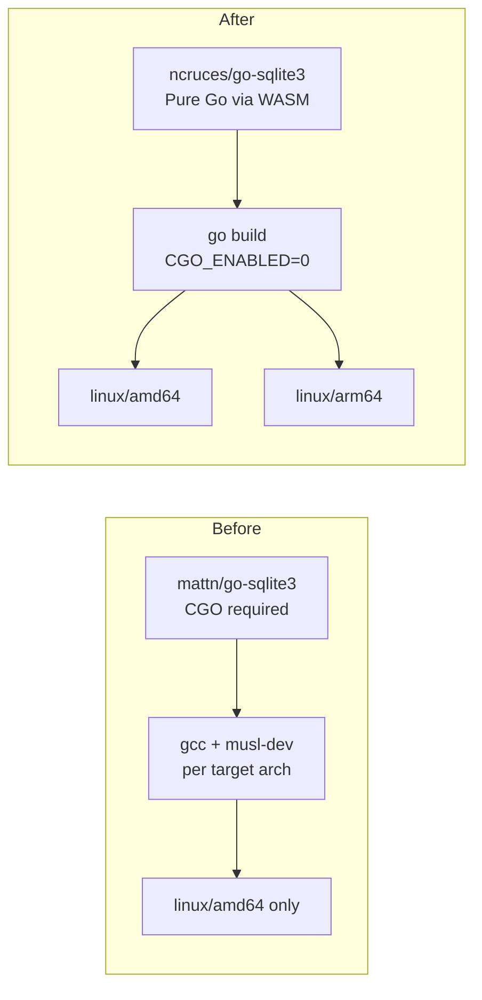

# ARM64 Support & Pure-Go SQLite Migration

**Branch:** `feature/arm64-pure-go-sqlite`

## Overview

This plan covers two tightly coupled changes:

1. **Migrate from `mattn/go-sqlite3` to `ncruces/go-sqlite3`** — eliminating the CGO requirement
2. **Add `linux/arm64` Docker image support** — trivial once CGO is gone

These changes are coupled because removing CGO is what makes cross-architecture builds simple. Without CGO, `GOOS=linux GOARCH=arm64 go build` just works — no cross-compilers, no QEMU emulation, no special toolchains.

---

## Phase 1: Migrate to `ncruces/go-sqlite3`

### 1.1 Swap the GORM driver dependency

Replace the CGO-based `gorm.io/driver/sqlite` (which wraps `mattn/go-sqlite3`) with `github.com/ncruces/go-sqlite3/gormlite` (pure-Go, WASM-based).

**Files to modify:**

| File | Change |
|------|--------|
| `backend/go.mod` | Remove `gorm.io/driver/sqlite`, add `github.com/ncruces/go-sqlite3` and `github.com/ncruces/go-sqlite3/gormlite` |
| `backend/internal/db/db.go` | Change import from `gorm.io/driver/sqlite` to `github.com/ncruces/go-sqlite3/gormlite`; change `sqlite.Open(...)` to `gormlite.Open(...)` |
| `backend/internal/poller/stats_test.go` | Same import swap; `sqlite.Open(":memory:")` → `gormlite.Open(":memory:")` |
| `backend/internal/testutil/testutil.go` | Same import swap; `sqlite.Open(":memory:")` → `gormlite.Open(":memory:")` |

The API is intentionally compatible — only the import path and package name change.

### 1.2 Remove CGO from the build system

With `ncruces/go-sqlite3`, CGO is no longer needed anywhere.

**Files to modify:**

| File | Line | Change |
|------|------|--------|
| `Dockerfile` | 17 | Remove `RUN apk add --no-cache gcc musl-dev sqlite-dev` |
| `Dockerfile` | 30 | Change `CGO_ENABLED=1` to `CGO_ENABLED=0` |
| `Dockerfile` | 42 | Remove `sqlite-libs` from the runtime `apk add` line |
| `.gitlab-ci.yml` | 15-16 | Remove global `CGO_ENABLED: "1"` variable |
| `.gitlab-ci.yml` | 24 | Remove `apk add --no-cache gcc musl-dev sqlite-dev` from `lint:go` |
| `.gitlab-ci.yml` | 43 | Remove `apk add --no-cache gcc musl-dev sqlite-dev` from `test:go` |
| `.gitlab-ci.yml` | 75 | Remove `apk add --no-cache gcc musl-dev sqlite-dev` from `security:govulncheck` |

### 1.3 Run `go mod tidy`

After swapping dependencies, run `go mod tidy` to clean up `go.mod` and `go.sum`. The `mattn/go-sqlite3` indirect dependency should be completely removed.

### 1.4 Add SQLite driver regression tests

The existing test suite (~30+ integration tests across `routes/` and `poller/`) already provides strong regression coverage — every test uses `testutil.SetupTestDB()` which opens an in-memory SQLite, runs all 12 Goose migrations, and exercises full CRUD through GORM. After the driver swap, `go test ./...` exercises the exact same code paths through `ncruces/go-sqlite3`.

However, there are a few driver-specific behaviors worth testing explicitly. Create a new test file:

**New file:** `backend/internal/db/driver_test.go`

| Test | Purpose | What It Catches |
|------|---------|-----------------|
| `TestMigrationUpDownUp` | Run all migrations up → down → up again | SQL syntax differences in ncruces SQLite build configuration |
| `TestConcurrentAccess` | 10 goroutines doing concurrent reads + writes | Connection pooling behavior differences; WASM driver thread safety |
| `TestJournalMode` | Assert `PRAGMA journal_mode` after `db.Init` | Default journal mode differences between drivers |
| `TestDataTypeRoundTrip` | Write and read back `DATETIME`, `REAL`, `INTEGER`, `TEXT`, and `NULL` values | Type conversion differences in the C-to-Go WASM bridge |

These are small (~100-150 lines total) and specifically target the risk area of the driver swap. Combined with the existing integration tests, this provides high confidence the migration is safe.

### 1.5 Run the full test suite

Verify everything works:

```bash
cd backend && go test ./...     # unit + regression tests (no gcc needed!)
docker compose up --build       # full integration test
```

Key things to validate:
- All existing tests pass with the new driver
- New driver regression tests pass
- Database opens correctly
- Migrations run (goose with the new driver)
- In-memory databases work in tests
- No CGO-related build errors

---

## Phase 2: Add ARM64 Docker Support

### 2.1 Update Dockerfile for multi-arch

Add `TARGETARCH` argument support. With CGO disabled, the Go build stage automatically cross-compiles based on Docker's `--platform` flag.

```dockerfile
# ── Stage 2: Backend build ──────────────────────
FROM --platform=$BUILDPLATFORM golang:1.25-alpine AS backend-builder
# ... (no gcc/musl/sqlite-dev needed)

ARG TARGETOS TARGETARCH
RUN CGO_ENABLED=0 GOOS=${TARGETOS} GOARCH=${TARGETARCH} go build \
    -ldflags="..." -o capacitarr main.go
```

`FROM --platform=$BUILDPLATFORM` ensures the build stage runs on the CI host architecture (fast, native) while cross-compiling for the target via `GOOS`/`GOARCH`.

### 2.2 Update CI to build multi-arch images

Modify the `build:docker` job to use `docker buildx` with multiple platforms:

```yaml
build:docker:
  stage: build
  image: docker:latest
  services:
    - docker:dind
  before_script:
    - docker buildx create --use --driver docker-container
  script:
    - docker buildx build --platform linux/amd64,linux/arm64 .
  rules:
    - if: $CI_PIPELINE_SOURCE == "merge_request_event"
    - if: $CI_COMMIT_BRANCH == $CI_DEFAULT_BRANCH
```

For the release pipeline (covered in the build/CI/CD plan), this becomes `--push` with registry tags.

### 2.3 Update docker-compose.yml

Add `platform` field so users on arm64 hosts get the correct image automatically (this is optional — Docker auto-selects the right manifest, but explicit is better):

```yaml
services:
  capacitarr:
    build: .
    platform: linux/${TARGETARCH:-amd64}
```

---

## Phase 3: Verification

### 3.1 Local verification

Test the multi-arch build locally with buildx:

```bash
# Build for both architectures (no push, just verify they build)
docker buildx build --platform linux/amd64,linux/arm64 .

# Run the arm64 image on amd64 host (via QEMU)
docker buildx build --platform linux/arm64 --load -t capacitarr:arm64-test .
docker run --rm capacitarr:arm64-test --version
```

### 3.2 CI verification

The MR pipeline's `build:docker` job validates that both architectures build successfully. No push happens on MR pipelines.

---

## Architecture Decision



## Files Changed Summary

| File | Phase | Action |
|------|-------|--------|
| `backend/go.mod` | 1.1 | Swap SQLite driver dependency |
| `backend/go.sum` | 1.3 | Regenerated by `go mod tidy` |
| `backend/internal/db/db.go` | 1.1 | Change import and `Open` call |
| `backend/internal/poller/stats_test.go` | 1.1 | Change import and `Open` call |
| `backend/internal/testutil/testutil.go` | 1.1 | Change import and `Open` call |
| `backend/internal/db/driver_test.go` | 1.4 | **New** — SQLite driver regression tests |
| `Dockerfile` | 1.2, 2.1 | Remove CGO deps, add `TARGETARCH`, set `CGO_ENABLED=0` |
| `.gitlab-ci.yml` | 1.2, 2.2 | Remove CGO/gcc lines, add `docker buildx` multi-arch |
| `docker-compose.yml` | 2.3 | Add platform field |

## Relationship to Build/CI/CD Plan

This plan is a **prerequisite subset** of the [Build, CI/CD, and Publishing Overhaul](20260303T1551Z-build-cicd-publishing.md). Specifically:

- Phase 1 here (SQLite migration) simplifies Phase 1.2 of the build plan (GoReleaser cross-compilation becomes trivial)
- Phase 2 here (ARM64 Docker) implements Phase 1.3 of the build plan
- The build plan's Phase 2 (registry push, tag-triggered releases) is a separate follow-up

This plan should be executed **before** the full build/CI/CD overhaul, as it removes the CGO complexity that the build plan would otherwise have to work around.
