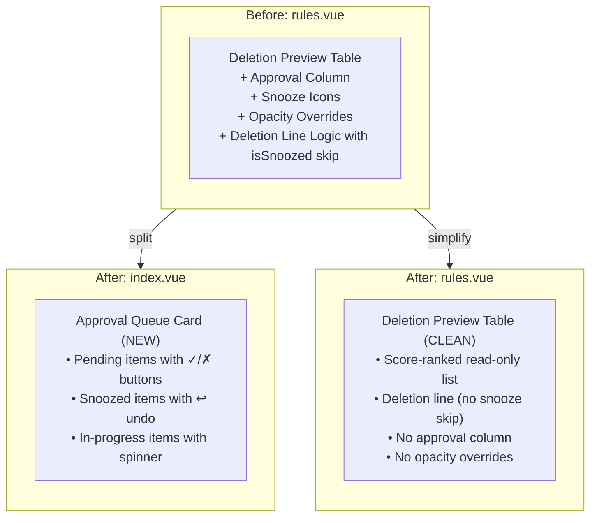

# Approval Queue Separation

**Date:** 2026-03-04  
**Status:** ✅ Complete

## Problem

The deletion preview table on the Score Engine page (`rules.vue`) currently serves two distinct purposes:

1. **Deletion Preview** — a score-ranked, read-only list showing what the engine would delete, with a "deletion line" marking where the engine stops.
2. **Approval Workflow** — interactive approve/reject/snooze/undo buttons overlaid via an extra column and row opacity classes.

These are two different data sources (engine evaluation vs. audit logs) layered onto one table. This creates several problems:

- **Undo snooze has no visible feedback** — clicking ↩ on a snoozed item changes audit log state but the item stays in the same table position, making the interaction feel broken.
- **Row opacity conflicts** — `approvalRowClass` applies `opacity-60` for snoozed items while `deletionLineIndex` applies `opacity-40` for items below the deletion line. Both are applied simultaneously with unpredictable CSS cascade behavior.
- **Mental model mismatch** — users expect "undo snooze" to visually move an item back into the deletion queue, but the preview list is score-driven and doesn't reorder based on approval state.
- **Code complexity** — the deletion line calculation in `deletionLineIndex` must skip snoozed/approved items, and the template has nested `v-if` chains checking 4 different states per row.

## Solution

Move the approval workflow into a dedicated **Approval Queue Card** on the Dashboard page (`index.vue`). Clean up the deletion preview table on the Score Engine page to be a pure read-only scored list.



## Implementation Steps

### Phase 1: Create the Approval Queue Composable

Extract the approval workflow logic from `rules.vue` into a reusable composable `useApprovalQueue.ts` so both the new dashboard card and cleanup of `rules.vue` share the same data layer.

**New file:** `frontend/app/composables/useApprovalQueue.ts`

Extract from `rules.vue`:
- `pendingApprovals` ref (Map of media name → audit log ID)
- `snoozedApprovals` ref (Map of media name → SnoozedInfo)
- `approvedItems` ref (Map of media name → audit log ID)
- `approvalLoading` ref
- `fetchPendingApprovals()` function
- `approveItem()` function
- `rejectItem()` function
- `unsnoozeItem()` function
- `isSnoozed()` / `getSnoozedInfo()` / `getPendingApprovalId()` / `isApprovedOrDeleting()` helpers
- `formatSnoozeTime()` helper (will be replaced with locale-aware date+time formatting in the new component)

The composable needs access to `executionMode` (from `useEngineControl`) to gate approval mode.

Use `useState` for the Maps so state is shared across pages (the Dashboard and Score Engine page can both read the same data).

### Phase 2: Create the ApprovalQueueCard Component

**New file:** `frontend/app/components/ApprovalQueueCard.vue`

A card component that renders on the Dashboard when execution mode is "approval". It has three sections:

**Section 1 — Pending Approval**
- Compact list of items with title, score (if available), size, and ✓ approve / ✗ reject buttons
- Each row shows: `Title — Size — Score [✓] [✗]`
- Empty state: "No items pending approval"

**Section 2 — Snoozed**
- List of snoozed items with title, snooze expiry time, and ↩ undo button
- Each row shows: `Title — 💤 until <DateDisplay :date="snoozedUntil" /> [↩]`
- Uses the existing `DateDisplay` component which supports relative/absolute toggling (e.g., "in 3 hours" ↔ "Mar 5, 2:30 PM") and respects the user's display preference
- Collapsible if empty

**Section 3 — In Progress (Approved/Deleting)**
- List of approved items with spinner and "Deleting..." label
- Each row shows: `Title — 🔄 Deleting…`
- Collapsible if empty

The card header shows summary counts: "3 pending · 2 snoozed · 1 deleting"

The card uses `useApprovalQueue()` composable for all data and actions.

The card only renders when `executionMode === 'approval'` (from `useEngineControl`).

### Phase 3: Add Live Score Context to Approval Items

Each audit log entry has `mediaName` and `sizeBytes`, but not the current score. The score stored at queue time goes stale as rules, watch history, and integrations change. Users want to make approval decisions based on the **current** engine evaluation, not a historical snapshot.

**Approach: Hybrid — stored fallback + live score overlay**

1. **Store score at queue time** in the audit log's existing `ScoreDetails` JSON (already populated). This serves as a fallback if the item is no longer in the engine preview (e.g., removed from the *arr instance).

2. **Fetch live scores via a lightweight backend endpoint** when the approval queue card loads. Rather than fetching the full `/api/v1/preview` (which evaluates all media items), add a new endpoint:

   ```
   GET /api/v1/preview/scores?titles=Movie+Title,Show+S02+Title
   ```

   This endpoint looks up specific titles in the latest cached engine evaluation and returns just their current scores. It avoids re-evaluating all media items.

3. **Display logic in the component:**
   - If a live score is available from the preview, show it (with a subtle "live" indicator)
   - If the item is no longer in the preview, fall back to the stored score from `ScoreDetails` (with a subtle "at queue time" indicator)

**Backend changes for the `/api/v1/preview/scores` endpoint:**

- Add a new route in `routes/preview.go` or `routes/audit.go`
- The existing preview endpoint already caches its evaluation results. This new endpoint filters the cache by the provided title list.
- Returns: `{ scores: { "Movie Title": 12.5, "Show S02": 8.3 } }`
- If no cached evaluation exists (engine hasn't run yet), returns empty `{}`

**Frontend changes:**

- `useApprovalQueue` composable calls the scores endpoint after fetching audit entries
- Merges live scores into the approval item data
- Falls back to parsing `ScoreDetails` JSON from the audit entry

### Phase 4: Integrate ApprovalQueueCard into Dashboard

**Modify:** `frontend/app/pages/index.vue`

- Import and use `ApprovalQueueCard` component
- Place it between the Engine Activity card and Per-Disk Group sections
- Only render when `executionMode === 'approval'`
- Call `fetchApprovalQueue()` from `useApprovalQueue` on mount and on a polling interval (same as engine stats polling)

### Phase 5: Clean Up the Deletion Preview Table

**Modify:** `frontend/app/pages/rules.vue`

Remove all approval-related code from the deletion preview table:

1. **Remove the "Approval Action" column header** (line ~680-685: `v-if="isApprovalMode"` `<UiTableHead>`)
2. **Remove the approval action cells** for group entries (lines ~755-815) and season entries (lines ~857-930)
3. **Remove `approvalRowClass` opacity from row class bindings** (lines ~712-713 and ~823-824)
4. **Remove `isApprovalMode ? 6 : 5` colspan** in deletion line row (line ~699) — change to constant `5`
5. **Remove the `isSnoozed()` skip in `deletionLineIndex`** computation (line ~1891) — snoozed items are now handled purely via the dashboard approval queue, and the deletion preview shows what the engine would do regardless of approval state. **Note:** Keep the `isProtected` skip since protected items are a different concept (rule-based, not approval-based).
6. **Remove all approval-related imports, refs, and functions** from the `<script setup>` section:
   - `isApprovalMode` computed
   - `pendingApprovals`, `snoozedApprovals`, `approvedItems`, `approvalLoading` refs
   - `fetchPendingApprovals()`, `approveItem()`, `rejectItem()`, `unsnoozeItem()` functions
   - `isSnoozed()`, `getSnoozedInfo()`, `getPendingApprovalId()`, `isApprovedOrDeleting()`, `approvalRowClass()`, `formatSnoozeTime()` helpers
   - `AuditLog`, `AuditResponse` type imports (if no longer used elsewhere in the file)
7. **Remove the `fetchPendingApprovals()` call** from `onMounted` and any watchers

### Phase 6: Add i18n Keys

**Modify:** `frontend/app/locales/en.json` (and all other locale files)

New keys needed for the approval queue card:

```json
{
  "approval.title": "Approval Queue",
  "approval.subtitle": "Items flagged by the engine awaiting your review",
  "approval.pendingCount": "{count} pending",
  "approval.snoozedCount": "{count} snoozed",
  "approval.deletingCount": "{count} deleting",
  "approval.noPending": "No items pending approval",
  "approval.noSnoozed": "No snoozed items",
  "approval.approved": "Item approved for deletion",
  "approval.rejected": "Item rejected",
  "approval.unsnoozed": "Snooze removed — item re-queued for approval",
  "approval.failedApprove": "Failed to approve item",
  "approval.failedReject": "Failed to reject item",
  "approval.failedUnsnooze": "Failed to unsnooze item",
  "approval.snoozedUntil": "Snoozed until {datetime}",
  "approval.deleting": "Deleting…",
  "approval.pending": "Pending",
  "approval.snoozed": "Snoozed",
  "approval.inProgress": "In Progress"
}
```

Remove now-unused keys from `rules.*` namespace:
- `rules.approvalAction`
- `rules.approve`
- `rules.reject`
- `rules.snoozedUntil`
- `rules.undoSnooze`
- `rules.deleting`

### Phase 7: Verify and Test

- Confirm the approval queue card renders on the dashboard when in approval mode
- Confirm approve/reject/snooze/undo actions update the card sections immediately
- Confirm the deletion preview table on the Score Engine page no longer shows approval controls
- Confirm the deletion line calculation no longer skips snoozed items
- Confirm auto and dry-run modes don't show the approval queue card

## Files to Create

| File | Purpose |
|------|---------|
| `frontend/app/composables/useApprovalQueue.ts` | Shared approval workflow state and actions |
| `frontend/app/components/ApprovalQueueCard.vue` | Dashboard card component for the approval queue |

## Files to Modify

| File | Changes |
|------|---------|
| `frontend/app/pages/index.vue` | Add `ApprovalQueueCard` between engine activity and disk groups |
| `frontend/app/pages/rules.vue` | Remove all approval-related template code, computed properties, functions, and refs |
| `frontend/app/locales/en.json` | Add `approval.*` keys, remove `rules.approve`, `rules.reject`, etc. |
| `frontend/app/locales/*.json` (20 files) | Same key additions/removals for all locales |
| `frontend/app/types/api.ts` | Add `snoozedUntil` to `AuditLog` interface (currently cast inline) |

## Backend Changes

| File | Changes |
|------|---------|
| `backend/routes/preview.go` | Add `GET /api/v1/preview/scores?titles=...` endpoint that returns current scores for specific titles from the cached engine evaluation |

## Files Unchanged

| File | Reason |
|------|--------|
| Backend routes (`audit.go`) | All API endpoints remain the same — approve, reject, unsnooze are still audit log operations |
| Backend models (`models.go`) | No schema changes needed |
| Backend poller/engine | No changes — the engine still creates "Queued for Approval" entries in approval mode |
