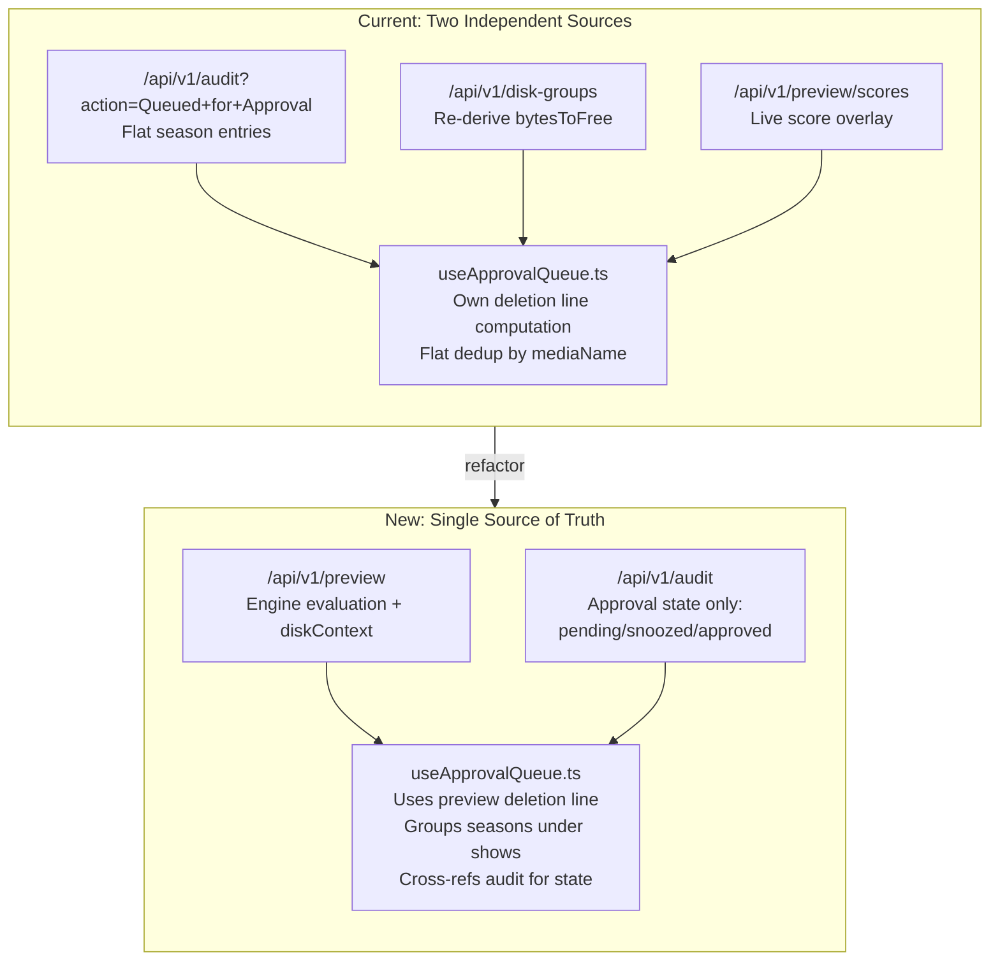
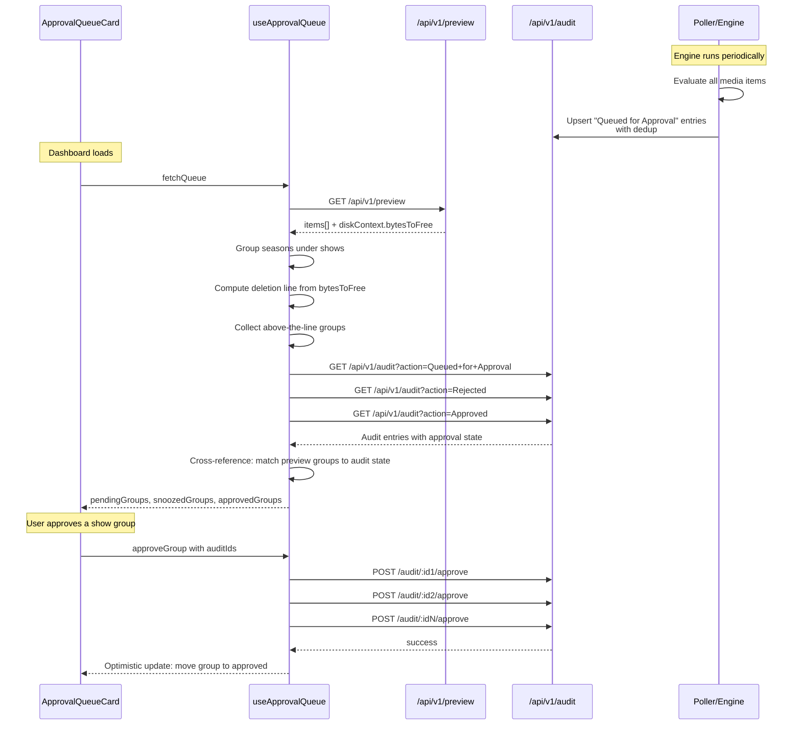

# Approval Queue Data Alignment

**Date:** 2026-03-04
**Status:** ✅ Complete
**Depends on:** [20260304T1641Z-approval-queue-separation.md](20260304T1641Z-approval-queue-separation.md) (✅ Complete)

## Problem

The approval queue card (Dashboard) and deletion preview table (Score Engine page) show different items above the deletion line because they use fundamentally different data sources and grouping strategies:

| Aspect | Deletion Preview | Approval Queue |
|--------|-----------------|----------------|
| **Data source** | `/api/v1/preview` — live engine evaluation | `/api/v1/audit?action=Queued+for+Approval` — flat audit log entries |
| **Grouping** | Show + seasons grouped via `PreviewGroup` | Flat season-level entries, deduplicated by `mediaName` |
| **Deletion line** | Cumulative size of grouped entries against `diskContext.bytesToFree` | Own `bytesToFree` calculated from `/api/v1/disk-groups`, cumulated per flat entry |
| **Result** | 10 show-groups above the line | 24 individual season entries above a different cutoff |

This causes items like "Adventure Time" to appear in the approval queue but be below the deletion line in the preview. Users see a different set of candidates depending on which page they look at.

### Root Causes

1. **Duplicate data source:** The composable re-derives `bytesToFree` from disk groups independently instead of using the engine's authoritative calculation from `/api/v1/preview`.

2. **No show-level grouping:** The audit log stores individual season entries (e.g., "Adventure Time - Season 1", "Adventure Time - Season 2") because [`evaluate.go`](../../backend/internal/poller/evaluate.go:118) iterates per-evaluated-item. The composable deduplicates by exact `mediaName` but never groups seasons under their parent show.

3. **Audit log accumulation:** The engine poller creates new "Queued for Approval" entries on every run (line 209-212 in [`evaluate.go`](../../backend/internal/poller/evaluate.go:209)) without dedup — unlike the Dry-Run path (lines 191-208) which does upsert. This inflates the queue with duplicates across runs.

4. **Stale `/api/v1/preview/scores` endpoint:** This was a workaround to fetch live scores for audit-sourced items. If the queue uses preview data directly, this endpoint becomes unnecessary.

## Solution Overview

Make the approval queue use `/api/v1/preview` as its single source of truth for "which items are above the deletion line," then cross-reference with audit log entries for approval state (pending/snoozed/approved). Group seasons under their parent show, matching the deletion preview's grouping.



## Implementation Steps

### Phase 1: Backend — Approval Dedup in evaluate.go

Add upsert logic for "Queued for Approval" entries, matching the existing Dry-Run dedup pattern at lines 191-208 of [`evaluate.go`](../../backend/internal/poller/evaluate.go:191).

**File:** [`backend/internal/poller/evaluate.go`](../../backend/internal/poller/evaluate.go)

**Changes:**
- At line 209 (the `else` branch for non-Dry-Run), add a check: if `actionName == "Queued for Approval"`, do an upsert instead of `db.DB.Create(&logEntry)`.
- Match on `media_name + media_type + action = "Queued for Approval"` (same pattern as Dry-Run dedup).
- Update `reason`, `score_details`, `size_bytes`, and `created_at` on the existing row.
- If no existing row, create a new one.
- This prevents accumulation of duplicate approval entries across engine runs.

**Before:**
```go
} else {
    // Auto/approval modes always create new entries (real actions)
    db.DB.Create(&logEntry)
}
```

**After:**
```go
} else if actionName == "Queued for Approval" {
    // Approval dedup: upsert like Dry-Run to prevent accumulation
    var existing db.AuditLog
    result := db.DB.Where(
        "media_name = ? AND media_type = ? AND action = ?",
        ev.Item.Title, string(ev.Item.Type), "Queued for Approval",
    ).First(&existing)
    if result.Error == nil {
        db.DB.Model(&existing).Updates(map[string]interface{}{
            "reason":         logEntry.Reason,
            "score_details":  logEntry.ScoreDetails,
            "size_bytes":     logEntry.SizeBytes,
            "created_at":     logEntry.CreatedAt,
            "external_id":    logEntry.ExternalID,
            "integration_id": logEntry.IntegrationID,
        })
    } else {
        db.DB.Create(&logEntry)
    }
} else {
    // Auto mode always creates new entries (real deletions)
    db.DB.Create(&logEntry)
}
```

**Important:** Do NOT upsert entries whose action has been changed to "Approved", "Rejected", or "Deleted" by the user. The WHERE clause `action = "Queued for Approval"` ensures we only touch entries still in the pending state — approved/rejected/snoozed entries keep their state.

### Phase 2: Backend — Remove /api/v1/preview/scores Endpoint

**File:** [`backend/routes/preview.go`](../../backend/routes/preview.go)

**Changes:**
- Remove lines 118-178 (the entire `GET /preview/scores` route handler).
- This endpoint is no longer needed because the composable will use `/api/v1/preview` directly.

**File:** [`backend/routes/preview_test.go`](../../backend/routes/preview_test.go)

**Changes:**
- Remove any test cases for the `/preview/scores` endpoint.

### Phase 3: Frontend — Rewrite useApprovalQueue.ts

**File:** [`frontend/app/composables/useApprovalQueue.ts`](../../frontend/app/composables/useApprovalQueue.ts)

This is the core change. Rewrite [`fetchQueue()`](../../frontend/app/composables/useApprovalQueue.ts:60) to:

1. **Fetch preview data** instead of audit entries as the primary source:
   ```typescript
   const previewData = await api('/api/v1/preview') as PreviewResponse
   ```

2. **Group seasons under shows** using the same `PreviewGroup` logic from [`rules.vue`](../../frontend/app/pages/rules.vue:1462) (lines 1462-1513). Extract this into a shared utility function (or import it).

3. **Compute the deletion line** from `previewData.diskContext.bytesToFree` against grouped entries — identical to [`deletionLineIndex`](../../frontend/app/pages/rules.vue:1607) in `rules.vue` (lines 1607-1632).

4. **Collect "above the line" groups** — these are the items that need approval.

5. **Cross-reference with audit log** to determine each group's approval state:
   ```typescript
   const [pendingAudit, snoozedAudit, approvedAudit] = await Promise.all([
     api('/api/v1/audit?action=Queued+for+Approval&limit=1000') as Promise<AuditResponse>,
     api('/api/v1/audit?action=Rejected&limit=1000') as Promise<AuditResponse>,
     api('/api/v1/audit?action=Approved&limit=1000') as Promise<AuditResponse>,
   ])
   ```

6. **Match preview groups to audit entries** by title. For a show group, check if any of its season titles (e.g., "Adventure Time - Season 1") have audit entries. Build a map from mediaName to audit state.

7. **Classify each above-the-line group:**
   - If all relevant audit entries are "Approved" → approved group
   - If any relevant audit entry is "Rejected" with active snooze → snoozed group
   - Otherwise → pending group

**New interfaces:**

```typescript
export interface ApprovalGroup {
  key: string
  showTitle: string
  type: 'show' | 'movie' | 'artist' | 'book'
  totalSizeBytes: number
  score: number
  seasonCount: number
  seasons: Array<{
    title: string
    sizeBytes: number
    score: number
    auditId: number | null
  }>
  // Flattened approval state for the whole group
  state: 'pending' | 'snoozed' | 'approved'
  auditIds: number[]  // All audit IDs for this group, for approve/reject actions
  snoozedUntil?: string
  scoreDetails: string
}
```

**Remove:**
- `DiskGroupResponse` interface (no longer needed — disk context comes from preview)
- `PreviewScoresResponse` interface (no longer needed — scores come from preview)
- `liveScores` state (no longer needed — scores are inline in preview data)
- `getScoreValue()` / `getScore()` functions (scores come directly from `EvaluatedItem.score`)
- The `/api/v1/disk-groups` fetch
- The `/api/v1/preview/scores` fetch

### Phase 4: Frontend — Extract Shared Grouping Logic

**New file:** `frontend/app/utils/groupPreview.ts`

Extract the `PreviewGroup` interface and the grouping logic (currently duplicated between [`rules.vue`](../../frontend/app/pages/rules.vue:1462) lines 1462-1513 and the new composable) into a shared utility:

```typescript
export interface PreviewGroup {
  key: string
  entry: EvaluatedItem
  seasons: EvaluatedItem[]
}

export function groupEvaluatedItems(items: EvaluatedItem[]): PreviewGroup[] {
  // Two-pass grouping logic extracted from rules.vue
  // Pass 1: collect shows
  // Pass 2: attach seasons, create synthetic groups for orphan seasons
  // Filter empty show groups
}
```

Update [`rules.vue`](../../frontend/app/pages/rules.vue:1462) to import from this utility instead of inlining the logic.

### Phase 5: Frontend — Update ApprovalQueueCard.vue

**File:** [`frontend/app/components/ApprovalQueueCard.vue`](../../frontend/app/components/ApprovalQueueCard.vue)

**Changes:**

1. **Render grouped shows** instead of flat season entries:
   - Show title: "Stranger Things" (not "Stranger Things - Season 1")
   - Subtitle: "5 seasons · 200 GB" (season count + total size)
   - Score from the show-level `EvaluatedItem.score`

2. **Movies/artists/books** render the same as today (single entry, no season count).

3. **Approve/snooze applies to the whole group:**
   - When user clicks approve on a show group, call `POST /api/v1/audit/:id/approve` for each `auditId` in the group.
   - When user clicks snooze, call `POST /api/v1/audit/:id/reject` for each `auditId`.
   - Optimistic update moves the entire group between sections.

4. **Remove score display complexity** — no more live vs. stored score indicator. The score comes directly from the preview evaluation and is always current.

### Phase 6: Frontend — Update Dashboard Integration

**File:** [`frontend/app/pages/index.vue`](../../frontend/app/pages/index.vue)

**Changes:**
- The existing dashboard integration should work as-is since it calls `fetchQueue()` from the composable. No template changes needed unless the composable's return types change (which they will — update accordingly).

### Phase 7: Backend + Frontend Tests

**Backend tests:**

- **`evaluate.go`:** Add test case for approval dedup — verify that running the engine twice for the same item in approval mode produces only one "Queued for Approval" entry, not two.
- **`preview_test.go`:** Remove tests for the deleted `/preview/scores` endpoint.

**Frontend considerations:**
- The composable's `approveItem()` and `rejectItem()` functions need to handle batch audit ID operations (loop over `auditIds` in the group).
- Error handling: if one audit ID fails to approve, roll back the optimistic update for the whole group.

## Files to Modify

| File | Changes |
|------|---------|
| [`backend/internal/poller/evaluate.go`](../../backend/internal/poller/evaluate.go) | Add approval dedup upsert logic |
| [`backend/routes/preview.go`](../../backend/routes/preview.go) | Remove `/preview/scores` endpoint |
| [`backend/routes/preview_test.go`](../../backend/routes/preview_test.go) | Remove `/preview/scores` test cases |
| [`frontend/app/composables/useApprovalQueue.ts`](../../frontend/app/composables/useApprovalQueue.ts) | Rewrite to use `/api/v1/preview` as source, group seasons, cross-ref audit for state |
| [`frontend/app/components/ApprovalQueueCard.vue`](../../frontend/app/components/ApprovalQueueCard.vue) | Render grouped shows with season counts; batch approve/snooze |
| [`frontend/app/pages/rules.vue`](../../frontend/app/pages/rules.vue) | Import grouping logic from shared utility instead of inlining |

## Files to Create

| File | Purpose |
|------|---------|
| `frontend/app/utils/groupPreview.ts` | Shared show/season grouping logic used by both `rules.vue` and `useApprovalQueue.ts` |

## Data Flow Diagram



## Edge Cases

1. **Preview item with no audit entry:** A new item appears in the preview above the deletion line, but the engine hasn't run yet in approval mode to create audit entries. Solution: Show it as "pending" with a note "awaiting next engine run" — or create the audit entry on-demand via a new endpoint (deferred to a future iteration; for now, show it as informational only and don't offer approve/reject buttons).

2. **Audit entry with no preview match:** An item was queued for approval but has since been removed from the *arr service or fallen below the deletion line. Solution: Don't show it in the approval queue — the preview is authoritative. The audit entry remains in the log for history but doesn't need user action.

3. **Mixed approval state in a show group:** Some seasons of a show are snoozed while others are pending. Solution: The group state is the "worst" state — if any season is snoozed, the group shows as snoozed. The user unsnoozed the whole group at once.

4. **Score changes between engine runs:** An item's score changes enough that it crosses the deletion line between runs. Solution: The approval queue always reflects the current preview, so items naturally appear/disappear as scores change.

## Migration Notes

- The approval dedup (Phase 1) will not retroactively clean up existing duplicate audit entries. A one-time cleanup migration could be added but is not required — the composable already deduplicates on the frontend by `mediaName`.
- The `/preview/scores` endpoint removal (Phase 2) is a breaking change for any external API consumers. Since this is an internal-only endpoint not documented in the OpenAPI spec, this is acceptable.
