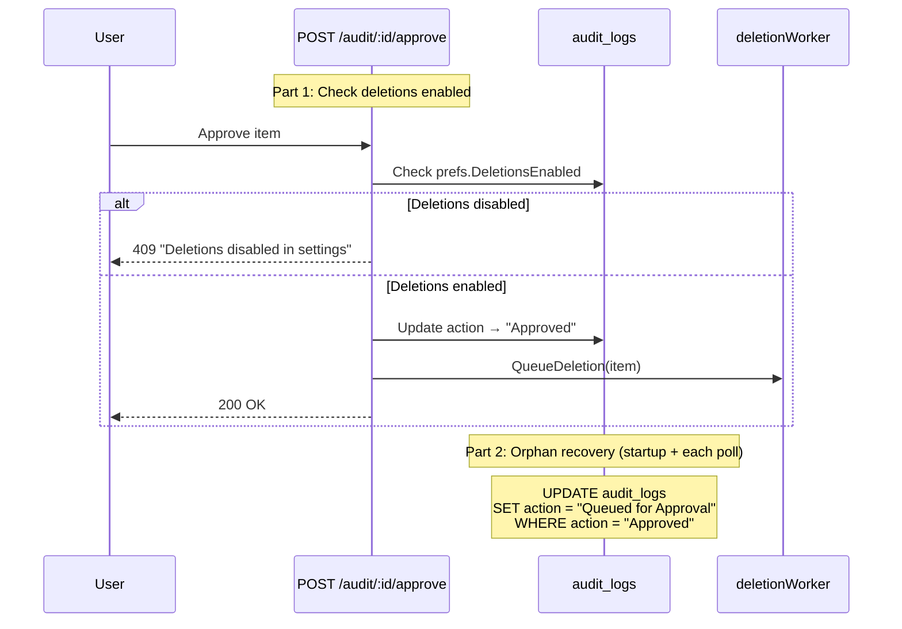

# Approval Queue Safety: Block Approvals When Deletions Disabled + Orphan Recovery

**Date:** 2026-03-05
**Branch:** `fix/approval-queue-safety`
**Status:** ✅ Complete
**Size:** S–M (30–80 lines changed)

## Problem

Two related issues with the approval queue when deletions are disabled in Advanced settings:

### 1. Approvals proceed silently when deletions are disabled

When a user approves an item from the approval queue while `DeletionsEnabled = false`:

1. The approve endpoint (`POST /audit/:id/approve`) changes the audit entry to `"Approved"` and queues it via `QueueDeletion()`
2. The `deletionWorker()` picks it up, checks `prefs.DeletionsEnabled`, finds it disabled, and takes the Dry-Delete path — creating a *new* "Dry-Delete" audit entry
3. The original "Approved" entry is never updated to reflect the outcome
4. The UI shows the item as "Approved" (in a processing/deleting state) indefinitely

**Expected behavior:** The approve endpoint should refuse the approval with a clear error message when deletions are disabled.

### 2. Orphaned "Approved" entries after container restart

The `deleteQueue` is an in-memory Go channel that doesn't survive container restarts. If items are approved and queued but the container restarts before the deletion worker processes them, the audit entries remain as `"Approved"` with no corresponding queue job. They're stuck in limbo forever.

**Expected behavior:** On startup, scan for orphaned `"Approved"` entries and revert them to `"Queued for Approval"` so they reappear in the approval queue for the user to re-approve.

## Solution

### Part 1: Block approvals when deletions disabled

In the approve endpoint (`POST /audit/:id/approve`), check `prefs.DeletionsEnabled` before accepting the approval. If disabled, return HTTP 409 Conflict with a clear error message.

### Part 2: Orphan recovery on startup AND during engine poll cycles

Orphan recovery runs in **two places** for maximum safety:

1. **On application startup** (in `main.go`) — immediately after database initialization, before the HTTP server or engine starts. This catches orphans from the previous container lifecycle right away.

2. **At the start of each engine poll cycle** (in `poller.go`) — before evaluation begins. This catches any orphans that might occur during normal operation (e.g., if the deletion worker panics and recovers, or if there's an unexpected state).

Both locations call the same shared `RecoverOrphanedApprovals()` function that:
- Queries for all audit entries with `action = "Approved"`
- Reverts them to `action = "Queued for Approval"`
- Logs each reverted entry at INFO level with the media name and ID

This belt-and-suspenders approach ensures orphans are never left in limbo regardless of when or how they occur.

## Plan

| # | Task | Files | Status |
|---|------|-------|--------|
| 1 | Add `DeletionsEnabled` check to approve endpoint; return 409 if disabled | `backend/routes/audit.go` | ✅ |
| 2 | Create shared `RecoverOrphanedApprovals()` function | `backend/internal/poller/orphan.go` | ✅ |
| 2b | Call `RecoverOrphanedApprovals()` on application startup (after DB init, before HTTP server) | `backend/main.go` | ✅ |
| 2c | Call `RecoverOrphanedApprovals()` at the start of each engine poll cycle (before evaluation) | `backend/internal/poller/poller.go` | ✅ |
| 3 | Update frontend approve handler to display the 409 error message to the user | `frontend/app/composables/useApprovalQueue.ts` | ✅ |
| 4 | Add test: approve returns 409 when deletions disabled | `backend/routes/audit_test.go` | ✅ |
| 5 | Add test: orphan recovery reverts "Approved" entries on startup | `backend/routes/audit_test.go` or `backend/main_test.go` | ✅ |
| 6 | Update documentation: document approval queue behavior when deletions are disabled, orphan recovery, and the 409 error | `docs/configuration.md`, `docs/api/openapi.yaml` | ✅ |

## Verification

| # | Task | Status |
|---|------|--------|
| V.1 | All existing tests pass | ✅ |
| V.2 | New tests pass | ✅ |
| V.3 | Manual: approve with deletions disabled → shows error toast | ✅ |
| V.4 | Manual: approve with deletions enabled → works normally | ✅ |
| V.5 | Manual: restart container with "Approved" entries → they revert to "Queued for Approval" | ✅ |
| V.6 | Docker build succeeds | ✅ |

## Risks

- **Orphan recovery timing:** Recovery runs both on startup (immediate) and at the start of each engine poll cycle (ongoing). The startup call catches orphans from the previous lifecycle before any new work begins. The per-poll call catches any that might occur during operation. The deletion worker runs concurrently but won't see the reverted entries since they're back to "Queued for Approval" (not in the deletion queue).
- **Race condition:** If the user approves an item at the exact moment deletions are toggled off, there's a tiny window where the approval could slip through. This is acceptable — the deletion worker will still Dry-Delete it, and on next restart it would be recovered. The check is a best-effort guard, not a transaction lock.
