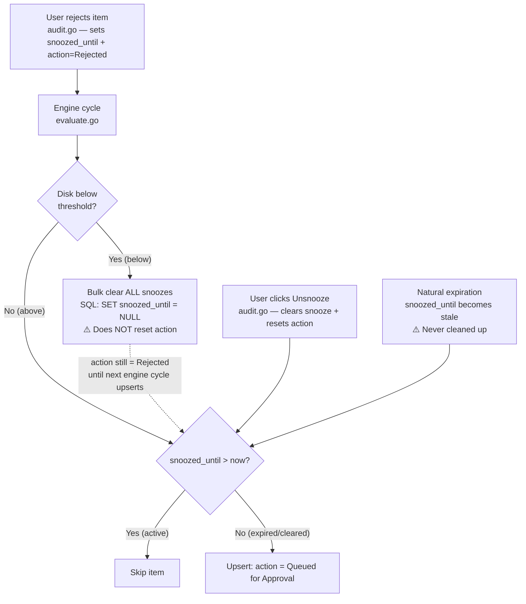
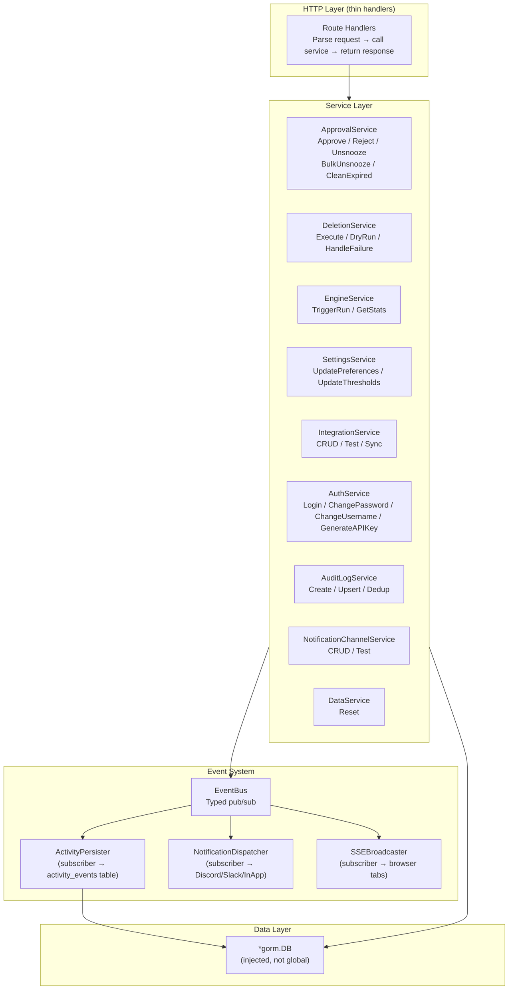

# Service Layer, Event Bus, and Real-Time Activity

**Status:** 🚧 In Progress (Phases 0–4, 8 complete; Phases 5–7, 9–16 remaining)
**Created:** 2026-03-05T18:55Z
**Scope:** Full-stack architectural refactor (Go backend + Vue frontend)
**Branch:** `feature/service-layer-event-bus` (created from `main`)

## Overview

This plan addresses gaps in the activity logging system, disjointed business logic, global state anti-patterns, polling-based UX, and database schema debt by introducing a service layer, event bus, SSE for real-time UI updates, and a clean database schema. Backwards compatibility is not a concern — this ships as a new version with a fresh database layout.

All work is done on the `feature/service-layer-event-bus` branch. This keeps `main` untouched as a rollback point until the refactor is complete and verified.

## Problem Statement

### 1. Activity event blind spots

A full audit of every route handler and background process found **12 user-visible actions** that produce no activity events, plus **2 dead constants** that are defined but never emitted.

### 2. Scattered business logic

Business logic (state transitions, validation, side effects) lives directly in HTTP route handlers and background worker functions. The same operation (e.g., "unsnooze an item") is handled by different code paths with inconsistent behavior:
- Manual unsnooze: clears snooze + resets action ✅
- Auto-clear on below-threshold: clears snooze but does NOT reset action ❌
- Natural snooze expiration: no cleanup at all, stale `snoozed_until` values accumulate ❌

### 3. Global state / testability

The `poller` package accesses `db.DB` (a global), `deleteQueue` (package-level channel), and `notifications.Dispatch` (global function) directly. Unit testing is impossible without the full application stack.

### 4. Polling-based UX

The frontend uses 4+ independent polling loops to detect state changes. Engine completion detection takes up to 3 seconds (or longer if the navbar popover is closed). Activity events only appear on the next poll cycle, not instantly.

## Current Architecture Audit

### Activity Events — Currently Logged ✅

| Event Type | Where Emitted | Trigger |
|---|---|---|
| `engine_start` | `poller.go:133` | Engine cycle begins |
| `engine_complete` | `poller.go:246` | Engine cycle finishes |
| `engine_error` | `poller.go:113` | Engine fails to load integrations |
| `engine_mode_changed` | `preferences.go:87` | Execution mode changed |
| `settings_changed` | `preferences.go:91` | Any preference save |
| `login` | `auth.go:129` | Successful login |
| `password_changed` | `auth.go:174` | Password changed |
| `integration_added` | `integrations.go:87` | Integration created |
| `integration_removed` | `integrations.go:155` | Integration deleted |
| `integration_test` | `integrations.go:231` | Successful connection test |
| `integration_test_failed` | `integrations.go:185,200,218` | Failed connection test |
| `approval_approved` | `audit.go:272` | Item approved for deletion |
| `approval_rejected` | `audit.go:313` | Item rejected (snoozed) |
| `rule_created` | `rules.go:129` | Custom rule created |
| `rule_updated` | `rules.go:76` | Custom rule modified |
| `rule_deleted` | `rules.go:146` | Custom rule deleted |
| `server_started` | `main.go:230` | Application starts |

### Activity Events — Not Logged ❌

| Action | Where | Impact |
|---|---|---|
| Threshold changed | `api.go:120` | High-impact config change, no trace |
| Deletion succeeded | `delete.go:134` | Most important outcome, invisible |
| Deletion failed | `delete.go:134` | User sees "Approved" but delete silently failed |
| Deletion dry-run | `delete.go:90` | Relevant context, silence instead |
| Item unsnoozed (manual) | `audit.go:319` | Approval lifecycle gap |
| Items unsnoozed (auto-clear) | `evaluate.go:38` | Bulk unsnooze on below-threshold, invisible |
| Orphaned approvals recovered | `orphan.go:14` | Items requeued after restart, invisible |
| Integration updated | `integrations.go:95` | Add/remove logged, update isn't |
| Username changed | `auth.go:180` | Security event, no trace |
| API key generated | `auth.go:224` | Security event, no trace |
| Data reset | `data.go:15` | Most destructive action, silent |
| Manual engine run triggered | `api.go:167` | No distinction from scheduled runs |
| Notification channel CRUD (×3) | `notifications.go` | Channel create/update/delete, no trace |

### Dead Constants ⚠️

| Constant | Status |
|---|---|
| `EventEnginePaused` | Defined but never emitted — no pause endpoint exists |
| `EventEngineResumed` | Defined but never emitted — no resume endpoint exists |

### Snooze Lifecycle — Disjointed State Management



**Problems:**
1. Bulk clear sets `snoozed_until = NULL` but leaves `action = Rejected` — item is in limbo until next engine cycle
2. Natural expiration leaves stale `snoozed_until` values in the DB
3. No activity logging on any unsnooze path

### Global State Dependencies

| Global | Used By | Problem |
|---|---|---|
| `db.DB` | `poller.go`, `evaluate.go`, `delete.go`, `orphan.go`, `stats.go`, `cron.go` | Can't unit test poller package |
| `deleteQueue` (channel) | `delete.go`, `evaluate.go` | Package-level, no lifecycle control |
| `RunNowCh` (channel) | `poller.go`, `api.go` | Package-level, no lifecycle control |
| `notifications.Dispatch()` | `poller.go`, `evaluate.go`, `delete.go` | Global function, not injectable |
| `currentlyDeletingVal` (atomic) | `delete.go`, `stats.go` | Shared mutable state |
| `metricsProcessed/Failed` (atomic) | `delete.go`, `stats.go` | Shared mutable state |
| `lastRunEvaluated/Flagged/Protected` (atomic) | `evaluate.go`, `stats.go`, `poller.go` | Shared mutable state |
| `pollRunning` (atomic) | `poller.go`, `stats.go` | Shared mutable state |

### `init()` Anti-Pattern

`delete.go:59` starts a goroutine at package import time:

```go
func init() {
    go deletionWorker()
}
```

This runs before `main()`, before the database is initialized, and makes testing/lifecycle management impossible.

## Architecture

### Target State



### Event Bus Design

```go
// Event is the interface all typed events implement.
type Event interface {
    EventType() string
    EventMessage() string
}

// ThresholdChangedEvent is published when disk group thresholds are updated.
type ThresholdChangedEvent struct {
    MountPath    string
    ThresholdPct float64
    TargetPct    float64
}

func (e ThresholdChangedEvent) EventType() string {
    return "threshold_changed"
}

func (e ThresholdChangedEvent) EventMessage() string {
    return fmt.Sprintf("Thresholds updated for %s: trigger at %.0f%%, target %.0f%%",
        e.MountPath, e.ThresholdPct, e.TargetPct)
}
```

The bus uses a fan-out pattern — one goroutine per subscriber with buffered channels:

```go
type EventBus struct {
    mu          sync.RWMutex
    subscribers []chan Event
}

func (b *EventBus) Publish(event Event) { ... }
func (b *EventBus) Subscribe() <-chan Event { ... }
func (b *EventBus) Unsubscribe(ch <-chan Event) { ... }
```

### SSE Protocol

Single endpoint: `GET /api/v1/events` (authenticated, long-lived HTTP connection).

```
HTTP/1.1 200 OK
Content-Type: text/event-stream
Cache-Control: no-cache
Connection: keep-alive

id: 1741199820-001
event: engine_start
data: {"message":"Engine run started in approval mode","executionMode":"approval"}

id: 1741199825-002
event: engine_complete
data: {"message":"Engine run completed: evaluated 97, flagged 12","evaluated":97,"flagged":12}

id: 1741199826-003
event: deletion_success
data: {"message":"Deleted: Beacon 23 (4.72 GB freed)","title":"Beacon 23","sizeBytes":5069636198}
```

The `id` field enables replay on reconnection via the `Last-Event-ID` header.

## Phases

### Phase 0: Fresh Database Schema ✅

**Goal:** Start from a clean slate. Delete all 18 incremental migrations and write a single new `00001_baseline.sql` that defines the complete schema from scratch. No migration path from the old database — this is a new major version.

**Approach:**
1. Delete all files in `backend/internal/db/migrations/`
2. Write a single `00001_baseline.sql` with the complete desired schema
3. Existing databases are incompatible — users start fresh on upgrade
4. Go models rewritten to match the new schema exactly (no deprecated fields, no backward compat cruft)

#### 0a. Split `audit_logs` into Two Tables

The current `audit_logs` table serves three different purposes simultaneously:

1. **Approval queue** — items awaiting user action (Queued → Approved/Rejected → Deleted)
2. **Deletion history** — permanent records of what was deleted/dry-run
3. **Dedup workspace** — dry-run entries overwritten each engine cycle

This creates problems:
- `snoozed_until` only applies to approval queue items, not deletion history
- `integration_id` and `external_id` only apply to queue/deletion items
- Dedup upsert logic in `evaluate.go` is complex because it operates on a multi-purpose table
- Querying the approval queue requires `WHERE action = 'Queued for Approval'` on a table with thousands of history records

**New schema — two purpose-specific tables:**

```sql
-- Active approval queue items (state machine)
CREATE TABLE approval_queue (
    id             INTEGER PRIMARY KEY AUTOINCREMENT,
    media_name     TEXT    NOT NULL,
    media_type     TEXT    NOT NULL CHECK(media_type IN ('movie','show','season','episode','artist','album','book')),
    reason         TEXT    NOT NULL,
    score_details  TEXT,
    size_bytes     INTEGER NOT NULL DEFAULT 0,
    integration_id INTEGER NOT NULL REFERENCES integration_configs(id) ON DELETE CASCADE,
    external_id    TEXT    NOT NULL DEFAULT '',
    status         TEXT    NOT NULL DEFAULT 'pending' CHECK(status IN ('pending','approved','rejected')),
    snoozed_until  DATETIME,
    created_at     DATETIME NOT NULL DEFAULT CURRENT_TIMESTAMP,
    updated_at     DATETIME NOT NULL DEFAULT CURRENT_TIMESTAMP
);
CREATE INDEX idx_approval_queue_status ON approval_queue(status);
CREATE INDEX idx_approval_queue_media ON approval_queue(media_name, media_type);
CREATE INDEX idx_approval_queue_snoozed ON approval_queue(snoozed_until)
    WHERE snoozed_until IS NOT NULL;

-- Permanent deletion/dry-run history (append-only, never modified)
CREATE TABLE audit_log (
    id             INTEGER PRIMARY KEY AUTOINCREMENT,
    media_name     TEXT    NOT NULL,
    media_type     TEXT    NOT NULL,
    reason         TEXT    NOT NULL,
    score_details  TEXT,
    action         TEXT    NOT NULL CHECK(action IN ('deleted','dry_run','dry_delete')),
    size_bytes     INTEGER NOT NULL DEFAULT 0,
    integration_id INTEGER REFERENCES integration_configs(id) ON DELETE SET NULL,
    created_at     DATETIME NOT NULL DEFAULT CURRENT_TIMESTAMP
);
CREATE INDEX idx_audit_log_media_name ON audit_log(media_name);
CREATE INDEX idx_audit_log_action ON audit_log(action);
CREATE INDEX idx_audit_log_created_at ON audit_log(created_at);
```

**Key design decisions:**
- `approval_queue.status` is an enum (`pending`/`approved`/`rejected`) instead of overloading `action`
- `approval_queue.integration_id` is `NOT NULL` — queue items always have a source integration
- `approval_queue` has `updated_at` for tracking state transitions
- `audit_log` (singular — Go convention) is append-only: no upserts, no status changes
- `audit_log.integration_id` uses `ON DELETE SET NULL` — history preserved if integration removed
- CHECK constraints enforce valid values at the database level
- Partial index on `snoozed_until` for efficient snooze queries

#### 0b. Clean Up `custom_rules`

Remove deprecated `type` and `intensity` columns (legacy from pre-migration 00005):

```sql
CREATE TABLE custom_rules (
    id             INTEGER PRIMARY KEY AUTOINCREMENT,
    integration_id INTEGER REFERENCES integration_configs(id) ON DELETE CASCADE,
    field          TEXT    NOT NULL,
    operator       TEXT    NOT NULL,
    value          TEXT    NOT NULL,
    effect         TEXT    NOT NULL CHECK(effect IN (
        'always_keep','prefer_keep','lean_keep',
        'lean_remove','prefer_remove','always_remove'
    )),
    enabled        INTEGER NOT NULL DEFAULT 1,
    sort_order     INTEGER NOT NULL DEFAULT 0,
    created_at     DATETIME NOT NULL DEFAULT CURRENT_TIMESTAMP,
    updated_at     DATETIME NOT NULL DEFAULT CURRENT_TIMESTAMP
);
```

#### 0c. Add Missing Foreign Key Constraints

- `library_histories.disk_group_id` → `REFERENCES disk_groups(id) ON DELETE CASCADE`
- All existing FKs verified and explicitly declared

#### 0d. Single Baseline Migration

Delete all 18 migration files. Write a single `00001_baseline.sql` that creates the complete clean schema from scratch. The goose version table resets.

**Go model changes:**

| Model | Change |
|---|---|
| `AuditLog` → `AuditLogEntry` | Remove `SnoozedUntil`, `IntegrationID` becomes optional (`*uint`), remove approval-related action constants |
| New: `ApprovalQueueItem` | `Status` (`pending`/`approved`/`rejected`), `SnoozedUntil`, `IntegrationID` (required `uint`), `ExternalID`, `UpdatedAt` |
| `CustomRule` | Remove deprecated `Type` and `Intensity` fields |

### Phase 1: Event Bus and Typed Events ✅

**Goal:** Create the event bus infrastructure and define all typed event structs.

**New files:**
- `backend/internal/events/bus.go` — EventBus with pub/sub, fan-out, buffered channels
- `backend/internal/events/types.go` — All typed event structs implementing the `Event` interface

**Event types to define (29 total):**

Existing (17):
- `EngineStartEvent`, `EngineCompleteEvent`, `EngineErrorEvent`
- `EngineModeChangedEvent`, `SettingsChangedEvent`
- `LoginEvent`, `PasswordChangedEvent`
- `IntegrationAddedEvent`, `IntegrationRemovedEvent`, `IntegrationTestEvent`, `IntegrationTestFailedEvent`
- `ApprovalApprovedEvent`, `ApprovalRejectedEvent`
- `RuleCreatedEvent`, `RuleUpdatedEvent`, `RuleDeletedEvent`
- `ServerStartedEvent`

New (17):
- `ThresholdChangedEvent`
- `DeletionSuccessEvent`, `DeletionFailedEvent`, `DeletionDryRunEvent`
- `ApprovalUnsnoozedEvent`, `ApprovalBulkUnsnoozedEvent`, `ApprovalOrphansRecoveredEvent`
- `IntegrationUpdatedEvent`
- `UsernameChangedEvent`, `APIKeyGeneratedEvent`
- `DataResetEvent`
- `ManualRunTriggeredEvent`
- `NotificationChannelAddedEvent`, `NotificationChannelUpdatedEvent`, `NotificationChannelRemovedEvent`
- `NotificationSentEvent`, `NotificationDeliveryFailedEvent`

Remove dead: `EventEnginePaused`, `EventEngineResumed`

**Tests:**
- `backend/internal/events/bus_test.go` — pub/sub, fan-out, buffer overflow, unsubscribe

### Phase 2: Activity Persister (Subscriber) ✅

**Goal:** Replace all `db.LogActivity()` / `db.LogActivityWithMetadata()` calls with an event bus subscriber that writes to the `activity_events` table.

**New file:**
- `backend/internal/events/activity_persister.go` — subscribes to the bus, writes `ActivityEvent` rows

**Changes:**
- Keep `activity_events` table schema as-is (no migration needed)
- The persister maps each `Event` to an `ActivityEvent` row using `EventType()` and `EventMessage()`
- JSON-encode the full event struct into the `metadata` column for structured data
- Remove `db.LogActivity()` and `db.LogActivityWithMetadata()` functions (replaced by bus publish)
- Remove the string-based event type constants from `activity.go` (replaced by typed structs)

**Tests:**
- `backend/internal/events/activity_persister_test.go` — verify events become DB rows

### Phase 3: Service Layer — Core Services ✅

**Goal:** Extract business logic from route handlers into injectable services.

#### 3a. ApprovalService

**New file:** `backend/internal/services/approval.go`

```go
type ApprovalService struct {
    db  *gorm.DB
    bus *events.EventBus
}

func (s *ApprovalService) Approve(entryID uint) error
func (s *ApprovalService) Reject(entryID uint) error
func (s *ApprovalService) Unsnooze(entryID uint) error
func (s *ApprovalService) BulkUnsnooze() (count int, err error)
func (s *ApprovalService) CleanExpiredSnoozes() (count int, err error)
func (s *ApprovalService) RecoverOrphans() (count int, err error)
```

**Fixes:**
- `BulkUnsnooze()` now resets `action` to `Queued for Approval` alongside clearing `snoozed_until`
- `CleanExpiredSnoozes()` clears stale `snoozed_until` values where `snoozed_until <= NOW()`
- All methods publish typed events to the bus
- Safety check (deletions enabled) moved into the service, out of the route handler

#### 3b. DeletionService

**New file:** `backend/internal/services/deletion.go`

```go
type DeletionService struct {
    db          *gorm.DB
    bus         *events.EventBus
    queue       chan deleteJob
    rateLimiter *rate.Limiter
}

func (s *DeletionService) Start()
func (s *DeletionService) Stop()
func (s *DeletionService) QueueDeletion(job DeleteJob) error
func (s *DeletionService) processJob(job deleteJob)
```

**Fixes:**
- Eliminates `init()` goroutine — `Start()` / `Stop()` for lifecycle control
- `processJob()` publishes `DeletionSuccessEvent`, `DeletionFailedEvent`, or `DeletionDryRunEvent`
- Audit log creation, stats updates, and notification dispatch handled through the event bus
- No direct `db.DB` global access

#### 3c. AuditLogService

**New file:** `backend/internal/services/auditlog.go`

```go
type AuditLogService struct {
    db *gorm.DB
}

func (s *AuditLogService) Create(entry db.AuditLog) error
func (s *AuditLogService) UpsertDryRun(entry db.AuditLog) error
func (s *AuditLogService) UpsertApproval(entry db.AuditLog) error
```

**Fixes:**
- Consolidates the 5 places that create audit log entries into a single service
- Dedup logic (dry-run upsert, approval upsert) lives in one place instead of inline in `evaluate.go`

#### 3d. EngineService

**New file:** `backend/internal/services/engine.go`

```go
type EngineService struct {
    db  *gorm.DB
    bus *events.EventBus
    runNowCh chan struct{}
}

func (s *EngineService) TriggerRun() (status string)
func (s *EngineService) GetStats() map[string]interface{}
```

**Fixes:**
- `TriggerRun()` publishes `ManualRunTriggeredEvent`
- `RunNowCh` moves from package-level to service-owned
- Stats retrieval uses injected DB instead of global

**Tests for Phase 3:**
- `backend/internal/services/approval_test.go`
- `backend/internal/services/deletion_test.go`
- `backend/internal/services/auditlog_test.go`
- `backend/internal/services/engine_test.go`

### Phase 4: Service Layer — Secondary Services ✅

#### 4a. SettingsService

**New file:** `backend/internal/services/settings.go`

```go
type SettingsService struct {
    db  *gorm.DB
    bus *events.EventBus
}

func (s *SettingsService) UpdatePreferences(payload db.PreferenceSet) error
func (s *SettingsService) UpdateThresholds(groupID uint, threshold, target float64) error
```

Publishes: `SettingsChangedEvent`, `EngineModeChangedEvent`, `ThresholdChangedEvent`

#### 4b. IntegrationService

**New file:** `backend/internal/services/integration.go`

```go
type IntegrationService struct {
    db  *gorm.DB
    bus *events.EventBus
}

func (s *IntegrationService) Create(config db.IntegrationConfig) error
func (s *IntegrationService) Update(id uint, config db.IntegrationConfig) error
func (s *IntegrationService) Delete(id uint) error
func (s *IntegrationService) Test(intType, url, apiKey string) (bool, error)
```

Publishes: `IntegrationAddedEvent`, `IntegrationUpdatedEvent`, `IntegrationRemovedEvent`, `IntegrationTestEvent`, `IntegrationTestFailedEvent`

#### 4c. AuthService

**New file:** `backend/internal/services/auth.go`

```go
type AuthService struct {
    db  *gorm.DB
    bus *events.EventBus
    cfg *config.Config
}

func (s *AuthService) Login(username, password string) (token string, err error)
func (s *AuthService) ChangePassword(username, currentPwd, newPwd string) error
func (s *AuthService) ChangeUsername(currentUser, newUsername, password string) error
func (s *AuthService) GenerateAPIKey(username string) (plaintext string, err error)
```

Publishes: `LoginEvent`, `PasswordChangedEvent`, `UsernameChangedEvent`, `APIKeyGeneratedEvent`

#### 4d. NotificationChannelService

**New file:** `backend/internal/services/notification_channel.go`

```go
type NotificationChannelService struct {
    db  *gorm.DB
    bus *events.EventBus
}

func (s *NotificationChannelService) Create(config db.NotificationConfig) error
func (s *NotificationChannelService) Update(id uint, config db.NotificationConfig) error
func (s *NotificationChannelService) Delete(id uint) error
func (s *NotificationChannelService) Test(id uint) error
```

Publishes: `NotificationChannelAddedEvent`, `NotificationChannelUpdatedEvent`, `NotificationChannelRemovedEvent`

#### 4e. DataService

**New file:** `backend/internal/services/data.go`

```go
type DataService struct {
    db  *gorm.DB
    bus *events.EventBus
}

func (s *DataService) Reset() (summary map[string]int64, err error)
```

Publishes: `DataResetEvent`

**Tests for Phase 4:**
- `backend/internal/services/settings_test.go`
- `backend/internal/services/integration_test.go`
- `backend/internal/services/auth_test.go`
- `backend/internal/services/notification_channel_test.go`
- `backend/internal/services/data_test.go`

### Phase 5: Wire Services into Route Handlers

**Goal:** Refactor all route handlers to use services instead of inline business logic.

**Changes per file:**

| Route File | Services Used | Notes |
|---|---|---|
| `audit.go` → split into `audit.go` + `approval.go` | `AuditLogService`, `ApprovalService` | `audit.go` → history-only endpoints; new `approval.go` → queue CRUD |
| `preferences.go` | `SettingsService` | |
| `api.go` (disk-groups) | `SettingsService` | |
| `api.go` (engine/run) | `EngineService` | |
| `integrations.go` | `IntegrationService` | |
| `auth.go` | `AuthService` | |
| `notifications.go` | `NotificationChannelService` | |
| `data.go` | `DataService` | Clears both `audit_log` and `approval_queue` |
| `rules.go` | Still inline (simple CRUD, can publish directly to bus) | |

**API endpoint changes:**

| Old Endpoint | New Endpoint(s) | Purpose |
|---|---|---|
| `GET /api/v1/audit` | `GET /api/v1/audit-log` | History only (deleted, dry-run, dry-delete) |
| `GET /api/v1/audit/recent` | `GET /api/v1/audit-log/recent` | Dashboard mini-feed (history) |
| `GET /api/v1/audit/grouped` | `GET /api/v1/audit-log/grouped` | Grouped history view |
| `POST /api/v1/audit/:id/approve` | `POST /api/v1/approval-queue/:id/approve` | Approve a queued item |
| `POST /api/v1/audit/:id/reject` | `POST /api/v1/approval-queue/:id/reject` | Reject (snooze) a queued item |
| `POST /api/v1/audit/:id/unsnooze` | `POST /api/v1/approval-queue/:id/unsnooze` | Requeue a snoozed item |
| _(none)_ | `GET /api/v1/approval-queue` | List queued items (for dashboard card) |

Route handlers become thin: parse request → validate input → call service → return response.

**Service registry:**
- `backend/internal/services/registry.go` — holds all service instances, created in `main.go`

```go
type Registry struct {
    Approval            *ApprovalService
    Deletion            *DeletionService
    AuditLog            *AuditLogService
    Engine              *EngineService
    Settings            *SettingsService
    Integration         *IntegrationService
    Auth                *AuthService
    NotificationChannel *NotificationChannelService
    Data                *DataService
}
```

**Changes to `main.go`:**
- Create `EventBus`
- Create `Registry` with all services (injecting `db.DB` and bus)
- Start `ActivityPersister`, `NotificationDispatcher`, `DeletionService`
- Pass `Registry` to route registration functions
- Stop all services on shutdown

### Phase 6: Notification Dispatcher (Subscriber)

**Goal:** Replace inline `notifications.Dispatch()` calls with an event bus subscriber.

**Change:** `backend/internal/notifications/dispatcher.go`
- Subscribe to the event bus
- Map event types to notification events
- Filter based on `NotificationConfig` subscription settings (e.g., `OnThresholdBreach`, `OnDeletionExecuted`)
- Existing `SendDiscord()`, `SendSlack()`, `SendInApp()` functions remain unchanged (they're the delivery mechanism)

**Remove:** All inline `notifications.Dispatch(...)` calls in route handlers and poller code (replaced by event bus subscription)

### Phase 7: Refactor Poller / Engine Orchestrator

**Goal:** Refactor `poll()` to use services instead of global state.

**Changes to `poller.go`:**
- Accept `Registry` (or individual services) as parameter to `Start()`
- Use `ApprovalService.BulkUnsnooze()` instead of raw SQL
- Use `ApprovalService.CleanExpiredSnoozes()` at the start of each cycle
- Use `ApprovalService.RecoverOrphans()` instead of the `orphan.go` function
- Use `AuditLogService` for audit entry creation/upsert in `evaluate.go`
- Use `EngineService` for stats management
- Publish `EngineStartEvent`, `EngineCompleteEvent`, `EngineErrorEvent` to the bus

**Changes to `evaluate.go`:**
- Accept `ApprovalService` and `AuditLogService`
- Use `ApprovalService.BulkUnsnooze()` when below threshold
- Use `AuditLogService.UpsertDryRun()` / `UpsertApproval()` / `Create()` instead of inline DB operations
- Use `DeletionService.QueueDeletion()` instead of writing to the package-level channel

**Remove:**
- `orphan.go` (logic moves to `ApprovalService.RecoverOrphans()`)
- Package-level `deleteQueue`, `RunNowCh`, atomic counters (move to services)
- `init()` goroutine in `delete.go`

### Phase 8: SSE Endpoint (Backend) ✅

**New files:**
- `backend/internal/events/sse_broadcaster.go` — subscribes to bus, manages SSE client connections
- `backend/routes/sse.go` — `GET /api/v1/events` endpoint

**SSE Broadcaster:**
```go
type SSEBroadcaster struct {
    mu      sync.RWMutex
    clients map[*SSEClient]bool
    bus     *events.EventBus
}

type SSEClient struct {
    events  chan Event
    done    chan struct{}
    lastID  string
}

func (b *SSEBroadcaster) Start()
func (b *SSEBroadcaster) HandleSSE(c echo.Context) error
```

**Features:**
- Auto-increment event IDs for replay support
- In-memory ring buffer (last 100 events) for `Last-Event-ID` replay
- Client cleanup on disconnect
- Keepalive comments every 30 seconds (prevents proxy timeouts)

**SSE Route:**
```go
// Authenticated — uses same auth middleware as other protected routes
protected.GET("/events", sseBroadcaster.HandleSSE)
```

**Tests:**
- `backend/internal/events/sse_broadcaster_test.go`
- `backend/routes/sse_test.go`

### Phase 9: Frontend — useEventStream Composable

**New file:** `frontend/app/composables/useEventStream.ts`

```typescript
export function useEventStream() {
    const eventSource = ref<EventSource | null>(null);
    const connected = ref(false);
    const handlers = new Map<string, Set<(data: unknown) => void>>();

    function connect() { /* Create EventSource, wire handlers */ }
    function disconnect() { /* Close EventSource */ }
    function on(eventType: string, handler: (data: unknown) => void) { ... }
    function off(eventType: string, handler: (data: unknown) => void) { ... }

    return { connected: readonly(connected), on, off, connect, disconnect };
}
```

**Features:**
- Auto-connect on app mount, auto-disconnect on unmount
- Auto-reconnect with exponential backoff
- `Last-Event-ID` header on reconnection for event replay
- Typed event handlers with TypeScript generics

### Phase 10: Frontend — Replace Polling with SSE

**Changes to `useEngineControl.ts`:**
- Remove `fetchStats()` polling loop
- Subscribe to SSE events: `engine_start`, `engine_complete`, `engine_error`
- Update `workerStats` reactively from SSE data
- Keep `triggerRunNow()` (it still POSTs to the API), but remove the 2-second delay + poll

**Changes to `EngineControlPopover.vue`:**
- Remove `startRunPolling()` / `stopRunPolling()` / `pollTimer`
- Engine state updates arrive via SSE automatically

**Changes to `index.vue` (Dashboard):**
- Remove `autoRefreshTimer` interval for engine-related data
- Subscribe to SSE events for real-time updates:
  - `engine_complete` → refresh dashboard stats
  - `deletion_success` / `deletion_failed` → update activity feed
  - `approval_approved` / `approval_rejected` → update approval queue
  - Any activity event → prepend to recent activity feed
- Keep auto-refresh for non-event data (disk groups, integrations) at a lower frequency

**Recent Activity feed — UI specification:**
- Fetch last 100 entries (up from current 25): `GET /api/v1/activity/recent?limit=100`
- Fixed height: `70px` (matches current, matches the engine run duration sparkline chart)
- Scrollable via `UiScrollArea` — do NOT increase the card height
- SSE events prepend to the list in real-time (no polling needed)
- The engine run duration chart and the activity log must be the same height (both 70px)

**Changes to approval queue composable (`useApprovalQueue.ts`):**
- Query new `GET /api/v1/approval-queue` endpoint (not filtered audit endpoint)
- Subscribe to SSE events for real-time queue updates (new items, removals after deletion)

### Phase 11: Frontend — Audit Page Refactor

**Goal:** The `/audit` page becomes a clean history-only view. Approval queue items are no longer shown here — they live exclusively on the dashboard via `ApprovalQueueCard`.

**Changes to `audit.vue`:**
- Query `GET /api/v1/audit-log` instead of `GET /api/v1/audit`
- Remove filter buttons for `Queued for Approval` and `Queued for Deletion` — these action types no longer exist in the `audit_log` table
- Keep filter buttons for `Deleted`, `Dry-Run`, `Dry-Delete`
- Update `AuditResponse` / `AuditLog` types to match the new `audit_log` schema (no `snoozedUntil`, no approval-related fields)
- Score detail modal: minor updates for the new data shape (no `action` field that could be approval-related)

**Changes to `ApprovalQueueCard.vue`:**
- Fetch from `GET /api/v1/approval-queue` instead of filtering `GET /api/v1/audit/grouped`
- Use new `ApprovalQueueItem` type (`status` field instead of `action` field)
- Approve → `POST /api/v1/approval-queue/:id/approve`
- Reject → `POST /api/v1/approval-queue/:id/reject`
- Unsnooze → `POST /api/v1/approval-queue/:id/unsnooze`

**Changes to `index.vue` (Dashboard):**
- "View All" link in engine activity section points to `/audit` (history only)
- Dashboard mini-feed fetches from `GET /api/v1/audit-log/recent`

**Changes to `types/api.ts`:**
- New `ApprovalQueueItem` interface with `status: 'pending' | 'approved' | 'rejected'`
- `AuditLog` → `AuditLogEntry` with `action: 'deleted' | 'dry_run' | 'dry_delete'`

### Phase 12: Frontend — Icon/Color Mapping for All Events

Update `eventIcon()` and `eventIconClass()` in `index.vue`:

| Event Type | Icon | Color Class |
|---|---|---|
| `threshold_changed` | `SlidersHorizontalIcon` | `text-primary` |
| `deletion_success` | `Trash2Icon` | `text-success` |
| `deletion_failed` | `AlertCircleIcon` | `text-destructive` |
| `deletion_dry_run` | `Trash2Icon` | `text-warning` |
| `approval_unsnoozed` | `AlarmClockOffIcon` | `text-primary` |
| `approval_bulk_unsnoozed` | `AlarmClockOffIcon` | `text-primary` |
| `approval_orphans_recovered` | `RefreshCwIcon` | `text-warning` |
| `integration_updated` | `PlugIcon` | `text-muted-foreground` |
| `username_changed` | `UserIcon` | `text-muted-foreground` |
| `api_key_generated` | `KeyIcon` | `text-muted-foreground` |
| `data_reset` | `DatabaseIcon` | `text-destructive` |
| `manual_run_triggered` | `PlayIcon` | `text-primary` |
| `notification_channel_added` | `BellIcon` | `text-success` |
| `notification_channel_updated` | `BellIcon` | `text-muted-foreground` |
| `notification_channel_removed` | `BellIcon` | `text-destructive` |
| `notification_sent` | `BellRingIcon` | `text-success` |
| `notification_delivery_failed` | `BellOffIcon` | `text-destructive` |

Remove icon/color entries for dead events: `engine_paused`, `engine_resumed`

New imports from `lucide-vue-next`: `SlidersHorizontalIcon`, `AlarmClockOffIcon`, `DatabaseIcon`, `BellIcon`, `BellRingIcon`, `BellOffIcon`

### Phase 13: Frontend — Connection State

**Changes to `ConnectionBanner.vue`:**
- Use SSE `connected` state as primary connection indicator
- Fallback to API health check if SSE is not supported
- Show reconnection state during SSE reconnect attempts

### Phase 14: Activity Event Retention (7-Day Auto-Cleanup)

Activity events are transient by design — they exist for real-time dashboard context, not permanent records. Retention is fixed at 7 days, not user-configurable.

**Changes to `cron.go`:**
- Replace the row-count-based prune (`pruneActivityEvents(500)`) with time-based: `DELETE FROM activity_events WHERE created_at < NOW() - 7 days`
- This runs on the existing daily cron schedule
- No new preference field needed — remove Phase 0d's `activity_retention_count` from the schema

**Cleanup responsibilities stay in `cron.go`** (the background scheduler), not in individual services. This is infrastructure-level housekeeping, not business logic:

| What Gets Cleaned | Where | Schedule | Method |
|---|---|---|---|
| Activity events | `cron.go` | Daily | Delete older than 7 days |
| Audit log entries | `cron.go` | Daily | Delete older than `auditLogRetentionDays` (user pref) |
| Engine run stats | `cron.go` | Daily | Keep last 1000 rows |
| In-app notifications | `cron.go` | Daily | Delete older than `auditLogRetentionDays` (user pref) |
| Time-series data (hourly/daily/weekly rollups) | `cron.go` | Hourly/Daily/Weekly/Monthly | Rollup + prune per resolution |

### Phase 15: Test Audit

All existing tests are assumed stale. Every test file must be reviewed, rewritten, or deleted:

**Backend test audit:**
- Delete all tests that reference old `audit_logs` table, old action constants (`ActionQueuedForApproval`, `ActionApproved`, `ActionRejected`), or old API endpoints (`/api/v1/audit/:id/approve`, etc.)
- Rewrite `audit_test.go` → tests for `GET /api/v1/audit-log` (history endpoints only)
- New `approval_test.go` → tests for `GET/POST /api/v1/approval-queue` (queue CRUD)
- New service-level unit tests (each service tested in isolation with in-memory DB):
  - `approval_test.go` — approve, reject, unsnooze, bulk unsnooze, orphan recovery
  - `deletion_test.go` — execute, dry-run, failure handling
  - `auditlog_test.go` — create, upsert dedup
  - `engine_test.go` — trigger run, get stats
  - `settings_test.go` — update preferences, update thresholds
  - `integration_test.go` — CRUD, test connection
  - `auth_test.go` — login, change password, change username, generate API key
  - `notification_channel_test.go` — CRUD, test channel
  - `data_test.go` — reset
- New event bus tests:
  - `bus_test.go` — pub/sub, fan-out, buffer overflow, unsubscribe
  - `activity_persister_test.go` — events become DB rows
  - `sse_broadcaster_test.go` — SSE format, client connect/disconnect, replay
- New SSE route test:
  - `sse_test.go` — authentication, event delivery, reconnection replay
- Frontend composable tests for `useEventStream`
- Run `make ci` — full lint + test + security check pass

### Phase 16: Documentation Overhaul

All documentation must be rewritten from scratch to match the new architecture. No references to old patterns (global `db.DB`, `LogActivity()`, combined audit table, polling).

**OpenAPI spec (`docs/api/openapi.yaml`):**
- Rewrite completely to match new endpoint structure:
  - `GET /api/v1/audit-log` (replaces `GET /api/v1/audit`)
  - `GET /api/v1/audit-log/recent` (replaces `GET /api/v1/audit/recent`)
  - `GET /api/v1/audit-log/grouped` (replaces `GET /api/v1/audit/grouped`)
  - `GET /api/v1/approval-queue` (new)
  - `POST /api/v1/approval-queue/:id/approve` (replaces `POST /api/v1/audit/:id/approve`)
  - `POST /api/v1/approval-queue/:id/reject` (replaces `POST /api/v1/audit/:id/reject`)
  - `POST /api/v1/approval-queue/:id/unsnooze` (replaces `POST /api/v1/audit/:id/unsnooze`)
  - `GET /api/v1/events` (new — SSE endpoint)
- Update all schema definitions: `AuditLogEntry`, `ApprovalQueueItem` (replaces combined `AuditLog`)
- Document SSE event types and payload schemas
- Remove all references to old combined `audit` endpoints

**API documentation (`docs/api/`):**
- `README.md` — update endpoint overview
- `examples.md` — rewrite all examples with new endpoints and response shapes
- `workflows.md` — rewrite approval workflow, deletion workflow, SSE subscription workflow
- `versioning.md` — note breaking changes in this version

**Technical documentation (`docs/`):**
- `configuration.md` — update any references to audit/approval settings
- `scoring.md` — verify references to audit log actions match new schema
- `deployment.md` — add SSE reverse proxy notes (`proxy_buffering off` for nginx/Caddy/Traefik)
- `quick-start.md` — update if any setup steps reference old behavior

**Contributing documentation:**
- `CONTRIBUTING.md` — update architecture overview (service layer, event bus, SSE)
- `docs/architecture.md` (new) — document the service layer, event bus, and SSE patterns with Mermaid diagrams

**Changelog:**
- `CHANGELOG.md` — document all breaking changes for this version

## File Summary

### New Files

| File | Purpose |
|---|---|
| `backend/internal/db/migrations/00001_baseline.sql` | Clean single-file schema (replaces 18 migrations) |
| `backend/internal/events/bus.go` | EventBus with typed pub/sub |
| `backend/internal/events/types.go` | All typed event structs |
| `backend/internal/events/activity_persister.go` | Subscriber: events → activity_events table |
| `backend/internal/events/sse_broadcaster.go` | Subscriber: events → SSE clients |
| `backend/internal/services/approval.go` | Approval queue lifecycle |
| `backend/internal/services/deletion.go` | Deletion execution + worker |
| `backend/internal/services/auditlog.go` | Audit log entry CRUD |
| `backend/internal/services/engine.go` | Engine trigger + stats |
| `backend/internal/services/settings.go` | Preferences + thresholds |
| `backend/internal/services/integration.go` | Integration CRUD + test |
| `backend/internal/services/auth.go` | Authentication + security |
| `backend/internal/services/notification_channel.go` | Notification channel CRUD |
| `backend/internal/services/data.go` | Data reset |
| `backend/internal/services/registry.go` | Service registry |
| `backend/routes/approval.go` | Approval queue HTTP endpoints |
| `backend/routes/sse.go` | SSE HTTP endpoint |
| `frontend/app/composables/useEventStream.ts` | SSE client composable |
| `docs/architecture.md` | New architecture document (service layer, event bus, SSE) |
| Test files for all new code | Unit + integration tests |

### Modified Files

| File | Change |
|---|---|
| `backend/main.go` | Create event bus, services, wire everything, lifecycle management |
| `backend/internal/db/models.go` | New `ApprovalQueueItem` model, `AuditLog` → `AuditLogEntry`, remove deprecated `CustomRule` fields, remove dead constants |
| `backend/internal/db/db.go` | Remove `ActivityRetentionCount` seeding (no longer a pref) |
| `backend/internal/poller/poller.go` | Accept services, remove globals, use services |
| `backend/internal/poller/evaluate.go` | Use AuditLogService + ApprovalService, write to `approval_queue` table |
| `backend/internal/poller/delete.go` | Major refactor → DeletionService |
| `backend/internal/poller/stats.go` | Use injected DB, remove globals |
| `backend/internal/notifications/dispatcher.go` | Become event bus subscriber |
| `backend/internal/jobs/cron.go` | Read activity retention from preferences |
| `backend/routes/audit.go` | History-only handlers using AuditLogService, queries against `audit_log` |
| `backend/routes/api.go` | Use SettingsService + EngineService |
| `backend/routes/integrations.go` | Use IntegrationService |
| `backend/routes/auth.go` | Use AuthService |
| `backend/routes/preferences.go` | Use SettingsService |
| `backend/routes/notifications.go` | Use NotificationChannelService |
| `backend/routes/data.go` | Use DataService, clear both `audit_log` and `approval_queue` |
| `backend/routes/rules.go` | Publish events to bus for rule CRUD |
| `frontend/app/composables/useEngineControl.ts` | SSE-driven instead of polling |
| `frontend/app/composables/useApprovalQueue.ts` | Query `approval_queue` API (not audit filtered) |
| `frontend/app/components/EngineControlPopover.vue` | Remove polling loop |
| `frontend/app/components/ConnectionBanner.vue` | SSE connection state |
| `frontend/app/components/ApprovalQueueCard.vue` | Adapt to new `ApprovalQueueItem` type |
| `frontend/app/pages/index.vue` | SSE events, new icons, remove polling |
| `frontend/app/app.vue` | Initialize SSE connection on mount |
| `frontend/app/types/api.ts` | New `ApprovalQueueItem` type, updated `AuditLogEntry` type |
| `docs/api/openapi.yaml` | Complete rewrite for new endpoint structure and schemas |
| `docs/api/README.md` | Update endpoint overview |
| `docs/api/examples.md` | Rewrite all examples with new endpoints |
| `docs/api/workflows.md` | Rewrite approval, deletion, and SSE workflows |
| `docs/api/versioning.md` | Document breaking changes |
| `docs/configuration.md` | Update audit/approval references |
| `docs/deployment.md` | Add SSE reverse proxy configuration notes |
| `docs/quick-start.md` | Update setup steps |
| `CONTRIBUTING.md` | Update architecture overview |
| `CHANGELOG.md` | Document all breaking changes |

### Removed Files

| File | Reason |
|---|---|
| `backend/internal/db/activity.go` | Replaced by events package |
| `backend/internal/db/migrations/00001_baseline.sql` through `00018_add_activity_events.sql` | Replaced by single clean baseline |
| `backend/internal/poller/orphan.go` | Logic moved to ApprovalService |

## Complete Event Type Inventory (34 total)

| Event Type | Category | Source Service |
|---|---|---|
| `engine_start` | Engine | EngineOrchestrator |
| `engine_complete` | Engine | EngineOrchestrator |
| `engine_error` | Engine | EngineOrchestrator |
| `engine_mode_changed` | Settings | SettingsService |
| `manual_run_triggered` | Engine | EngineService |
| `settings_changed` | Settings | SettingsService |
| `threshold_changed` | Settings | SettingsService |
| `login` | Auth | AuthService |
| `password_changed` | Auth | AuthService |
| `username_changed` | Auth | AuthService |
| `api_key_generated` | Auth | AuthService |
| `integration_added` | Integration | IntegrationService |
| `integration_updated` | Integration | IntegrationService |
| `integration_removed` | Integration | IntegrationService |
| `integration_test` | Integration | IntegrationService |
| `integration_test_failed` | Integration | IntegrationService |
| `approval_approved` | Approval | ApprovalService |
| `approval_rejected` | Approval | ApprovalService |
| `approval_unsnoozed` | Approval | ApprovalService |
| `approval_bulk_unsnoozed` | Approval | ApprovalService |
| `approval_orphans_recovered` | Approval | ApprovalService |
| `deletion_success` | Deletion | DeletionService |
| `deletion_failed` | Deletion | DeletionService |
| `deletion_dry_run` | Deletion | DeletionService |
| `rule_created` | Rules | (inline, publishes to bus) |
| `rule_updated` | Rules | (inline, publishes to bus) |
| `rule_deleted` | Rules | (inline, publishes to bus) |
| `notification_channel_added` | Notifications | NotificationChannelService |
| `notification_channel_updated` | Notifications | NotificationChannelService |
| `notification_channel_removed` | Notifications | NotificationChannelService |
| `notification_sent` | Notifications | NotificationDispatcher |
| `notification_delivery_failed` | Notifications | NotificationDispatcher |
| `data_reset` | Data | DataService |
| `server_started` | System | main.go |
