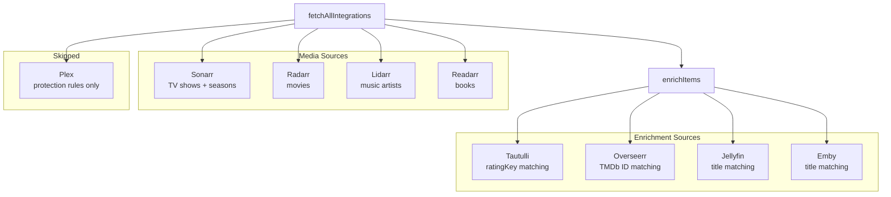
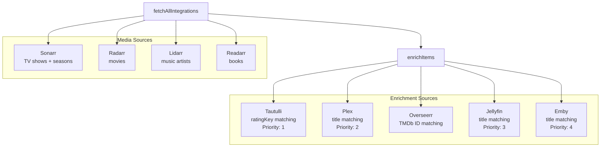

# Plex Enrichment & Integration Audit

**Created:** 2026-03-06T16:27Z
**Status:** ✅ Complete

## Problem Statement

Plex is configured as an integration but is **not used as an enrichment source** for Sonarr/Radarr items. In [`fetch.go:127-136`](../../backend/internal/poller/fetch.go:127), Plex is treated as "protection rules only" — it gets added to `serviceClients` but its library data is never fetched or cross-referenced with \*arr items.

This means Sonarr/Radarr items always have `PlayCount=0` and `LastPlayed=nil` unless the user also has Tautulli, Jellyfin, or Emby configured. Custom rules like `lastplayed in_last 30` (keep shows watched in the last 30 days) are completely broken for Plex-only users.

### User Setup

- Plex (ID 1) — media server with watch history
- Sonarr (ID 2) — TV series management
- Radarr (ID 3) — movie management
- No Tautulli, Jellyfin, or Emby

---

## Integration Audit

### Current Enrichment Pipeline



### Integration Status Matrix

| Integration | Role | Provides Items | Enrichment Source | Title Match | ID Match | Status |
|---|---|---|---|---|---|---|
| Sonarr | Media source | ✅ shows + seasons | — | — | — | ✅ Working |
| Radarr | Media source | ✅ movies | — | — | — | ✅ Working |
| Lidarr | Media source | ✅ artists | — | — | — | ✅ Working |
| Readarr | Media source | ✅ books | — | — | — | ✅ Working |
| Plex | Media server | ❌ Skipped | ❌ Not used | — | — | ⚠️ **Bug: no enrichment** |
| Tautulli | Enrichment | — | ✅ PlayCount, LastPlayed, Users | — | ratingKey | ✅ Working |
| Overseerr | Enrichment | — | ✅ IsRequested, RequestedBy | — | TMDb ID | ✅ Working |
| Jellyfin | Enrichment | — | ✅ PlayCount, LastPlayed | ✅ normalized | — | ✅ Working |
| Emby | Enrichment | — | ✅ PlayCount, LastPlayed | ✅ normalized | — | ✅ Working |

### Detailed Audit Findings

#### Plex — [`plex.go`](../../backend/internal/integrations/plex.go:1)

- Implements the full [`Integration`](../../backend/internal/integrations/types.go:24) interface
- [`GetMediaItems()`](../../backend/internal/integrations/plex.go:98) correctly returns `PlayCount`, `LastPlayed`, `AddedAt`, `Collections`, `Genre`, `Rating` for movies and shows
- [`DeleteMediaItem()`](../../backend/internal/integrations/plex.go:257) is a no-op (correct — deletion happens via \*arr services)
- **Problem:** In [`fetchAllIntegrations()`](../../backend/internal/poller/fetch.go:127), the Plex branch does `continue` after updating sync time, so `GetMediaItems()` is never called and Plex data is never used for enrichment
- **Problem:** Plex's watch data (PlayCount, LastPlayed) is structured per-item, not as a bulk lookup map — requires a new [`GetBulkWatchData()`](../../backend/internal/integrations/jellyfin.go:76) method to match the Jellyfin/Emby pattern

#### Tautulli — [`tautulli.go`](../../backend/internal/integrations/tautulli.go:1)

- Enrichment-only service (no `Integration` interface)
- Matches by Plex `ratingKey` — only works if \*arr items have `ExternalID` matching Plex rating keys
- **Note:** For Sonarr/Radarr items, `ExternalID` is the \*arr internal ID (e.g., Sonarr series ID), NOT the Plex ratingKey. This means Tautulli enrichment would also not work for \*arr items unless they came from Plex originally. However, Tautulli is designed to enrich Plex-sourced items specifically.
- Per-item API calls (not bulk) — can be slow for large libraries
- ✅ Working correctly for its intended use case

#### Jellyfin — [`jellyfin.go`](../../backend/internal/integrations/jellyfin.go:1)

- Enrichment-only service
- [`GetBulkWatchData()`](../../backend/internal/integrations/jellyfin.go:76) returns `map[string]*MediaServerWatchData` keyed by normalized (lowercase) title
- Paginated bulk fetch (500 items per page) — efficient
- ✅ Working correctly

#### Emby — [`emby.go`](../../backend/internal/integrations/emby.go:1)

- Enrichment-only service, structurally identical to Jellyfin
- [`GetBulkWatchData()`](../../backend/internal/integrations/emby.go:54) returns same `map[string]*MediaServerWatchData`
- ✅ Working correctly

#### Overseerr — [`overseerr.go`](../../backend/internal/integrations/overseerr.go:1)

- Enrichment-only service for media request tracking
- Matches by TMDb ID — works correctly with \*arr items that have `TMDbID` populated
- ✅ Working correctly

#### Sonarr — [`sonarr.go`](../../backend/internal/integrations/sonarr.go:1)

- Media source — provides shows and seasons with quality, tags, genre, size, addedAt
- `ExternalID` is the Sonarr series ID (NOT Plex ratingKey)
- ✅ Working correctly

#### Radarr — [`radarr.go`](../../backend/internal/integrations/radarr.go:1)

- Media source — provides movies with quality, tags, genre, size, addedAt
- `ExternalID` is the Radarr movie ID (NOT Plex ratingKey)
- ✅ Working correctly

#### Rules Engine — [`rules.go`](../../backend/internal/engine/rules.go:1)

- [`lastplayed`](../../backend/internal/engine/rules.go:251) rule field correctly handles `nil` LastPlayed (treats as "never played")
- Supports operators: `never`, `in_last`, `over_ago`
- [`playcount`](../../backend/internal/engine/rules.go:220) rule field works with standard number comparison
- ✅ Logic is correct — the problem is upstream (data never arrives)

---

## Solution Design

### Approach: Add Plex as a Title-Based Enrichment Source

Follow the same pattern as Jellyfin/Emby:

1. Add a `GetBulkWatchData()` method to [`PlexClient`](../../backend/internal/integrations/plex.go:11)
2. Store the [`PlexClient`](../../backend/internal/integrations/plex.go:11) in [`enrichmentClients`](../../backend/internal/poller/fetch.go:16)
3. Add Plex enrichment section to [`enrichItems()`](../../backend/internal/poller/fetch.go:227)

### Enrichment Priority

Tautulli provides richer data than raw Plex (per-user watch history, total duration). The enrichment priority should be:

1. **Tautulli** (highest — most detailed, per-user data)
2. **Plex** (direct watch data from the media server)
3. **Jellyfin** (alternative media server)
4. **Emby** (alternative media server)

Each source only enriches items that don't already have watch data (`PlayCount == 0`), following the existing convention.

### Architecture After Fix



---

## Implementation Steps

### Step 1: Add `GetBulkWatchData()` to PlexClient

**File:** [`plex.go`](../../backend/internal/integrations/plex.go)

Add a new method that fetches all Plex library items and returns a title→watch-data map, reusing the existing `MediaServerWatchData` struct from [`jellyfin.go`](../../backend/internal/integrations/jellyfin.go:67):

```go
// GetBulkWatchData fetches all movies and shows from Plex libraries and returns
// a map from normalized (lowercase) title to watch data. This allows enriching
// *arr items with Plex watch history by title matching.
func (p *PlexClient) GetBulkWatchData() (map[string]*MediaServerWatchData, error) {
    items, err := p.GetMediaItems()
    if err != nil {
        return nil, fmt.Errorf("failed to fetch Plex items: %w", err)
    }

    result := make(map[string]*MediaServerWatchData)
    for _, item := range items {
        key := strings.ToLower(strings.TrimSpace(item.Title))
        if key == "" {
            continue
        }
        data := &MediaServerWatchData{
            PlayCount: item.PlayCount,
            LastPlayed: item.LastPlayed,
            Played:    item.PlayCount > 0,
        }
        // Keep the entry with the highest play count if duplicates
        if existing, ok := result[key]; ok {
            if data.PlayCount > existing.PlayCount {
                result[key] = data
            }
        } else {
            result[key] = data
        }
    }
    return result, nil
}
```

**Key differences from Jellyfin/Emby:**
- No `userID` parameter needed — Plex token is server-scoped
- Reuses the existing `GetMediaItems()` method internally
- Returns the same `map[string]*MediaServerWatchData` type for consistency

### Step 2: Add `plex` field to `enrichmentClients`

**File:** [`fetch.go`](../../backend/internal/poller/fetch.go:16)

```go
type enrichmentClients struct {
    tautulli  *integrations.TautulliClient
    overseerr *integrations.OverseerrClient
    jellyfin  *integrations.JellyfinClient
    emby      *integrations.EmbyClient
    plex      *integrations.PlexClient  // NEW
}
```

### Step 3: Update `fetchAllIntegrations()` to store Plex enrichment client

**File:** [`fetch.go`](../../backend/internal/poller/fetch.go:127)

Replace the current Plex branch (lines 127-136) which skips everything after sync:

```go
if cfg.Type == "plex" {
    // Store Plex client for enrichment (watch history cross-referencing)
    result.enrichment.plex = integrations.NewPlexClient(cfg.URL, cfg.APIKey)
    now := time.Now()
    if err := result.enrichment.plex.TestConnection(); err != nil {
        slog.Warn("Plex connection failed", "component", "poller",
            "operation", "plex_connect", "integration", cfg.Name, "error", err)
        database.Model(&cfg).Updates(map[string]interface{}{
            "last_error": err.Error(),
        })
    } else {
        database.Model(&cfg).Updates(map[string]interface{}{
            "last_sync":  &now,
            "last_error": "",
        })
        slog.Debug("Plex connected for enrichment", "component", "poller",
            "integration", cfg.Name, "duration", time.Since(fetchStart).String())
    }
    continue
}
```

**Note:** Plex no longer needs to be in `serviceClients` since `DeleteMediaItem` is a no-op. If Plex is currently used for protection rules that rely on `serviceClients`, we need to verify that. Looking at the code, `serviceClients` is only used in `evaluateAndCleanDisk()` for actual deletion — Plex items are never part of `allItems` anyway, so removing Plex from `serviceClients` is safe.

### Step 4: Add Plex enrichment section to `enrichItems()`

**File:** [`fetch.go`](../../backend/internal/poller/fetch.go:227)

Add a new enrichment block after Tautulli and before Jellyfin (to maintain priority order):

```go
// ─── Enrichment: Plex watch history ────────────────────────────────────
if ec.plex != nil && len(items) > 0 {
    slog.Info("Enriching items with Plex watch data", "component", "poller", "itemCount", len(items))
    watchMap, err := ec.plex.GetBulkWatchData()
    if err != nil {
        slog.Warn("Failed to fetch Plex watch data", "component", "poller",
            "operation", "fetch_plex_watch", "error", err)
    } else {
        matched := 0
        for i := range items {
            item := &items[i]
            // Match by normalized title (show title for seasons, direct title otherwise)
            titleKey := strings.ToLower(strings.TrimSpace(item.Title))
            if item.ShowTitle != "" {
                titleKey = strings.ToLower(strings.TrimSpace(item.ShowTitle))
            }
            if wd, ok := watchMap[titleKey]; ok {
                // Only enrich if we don't already have watch data (Tautulli takes priority)
                if item.PlayCount == 0 {
                    item.PlayCount = wd.PlayCount
                    item.LastPlayed = wd.LastPlayed
                    matched++
                }
            }
        }
        slog.Info("Plex enrichment complete", "component", "poller",
            "libraryItems", len(watchMap), "matched", matched)
    }
}
```

### Step 5: Add unit tests

**File:** [`plex_test.go`](../../backend/internal/integrations/plex_test.go) — add `TestPlexClient_GetBulkWatchData` tests:

- Test with movies that have watch data → verify title normalization and map structure
- Test with shows → verify show titles are correctly keyed
- Test with duplicate titles → verify highest play count wins
- Test with empty library → verify empty map returned
- Test with no watch data → verify entries still created with `PlayCount=0`

**File:** New test or extend existing poller tests — verify enrichment pipeline:

- Verify Plex enrichment populates `LastPlayed` and `PlayCount` on \*arr items
- Verify Tautulli takes priority over Plex when both are configured
- Verify Plex enrichment doesn't overwrite existing data from Tautulli

### Step 6: Run `make ci` to verify

Run the full CI pipeline locally to ensure:
- All existing tests still pass
- New tests pass
- Linting passes
- No regressions

---

## Files Changed

| File | Change |
|---|---|
| [`plex.go`](../../backend/internal/integrations/plex.go) | Add `GetBulkWatchData()` method |
| [`fetch.go`](../../backend/internal/poller/fetch.go) | Add `plex` to `enrichmentClients`, update Plex branch in `fetchAllIntegrations()`, add Plex enrichment block in `enrichItems()` |
| [`plex_test.go`](../../backend/internal/integrations/plex_test.go) | Add `GetBulkWatchData` tests |
| [`enrich_test.go`](../../backend/internal/poller/enrich_test.go) | Add enrichment pipeline tests (Plex enrichment, Tautulli priority, season title matching) |

---

## Risk Assessment

| Risk | Mitigation |
|---|---|
| Title mismatch between Plex and \*arr | Use same normalization as Jellyfin/Emby (lowercase, trimmed). This is an inherent limitation of title matching — works for most cases. |
| Plex API call adds latency | Single bulk call via existing `GetMediaItems()` — same pattern as Jellyfin/Emby. Paginated internally. |
| Breaking existing Plex protection rules | Plex items were never in `allItems` before (the `continue` prevented fetching). Protection rules work via custom rules on \*arr items, not Plex items directly. No regression risk. |
| Duplicate enrichment with Tautulli | Priority guard (`PlayCount == 0` check) ensures Tautulli data wins when both are configured. |
