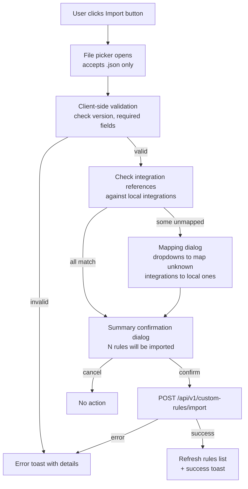
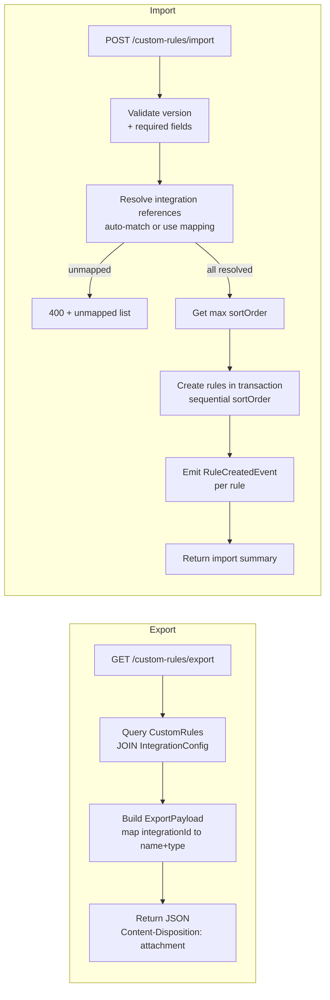

# Custom Rules Import/Export

**Created:** 2026-03-06T22:51Z
**Status:** 🔲 Not Started
**Scope:** Custom Rules portability (export + import)
**Branch:** `feature/custom-rules-import-export`

## Overview

Add import/export functionality for custom rules so users can back up, share, and restore rulesets across Capacitarr instances.

Key design decisions:

- **JSON format** — human-readable, easy to inspect and hand-edit
- **Versioned envelope** — `version: 1` allows future schema evolution without breaking older exports
- **Portable integration references** — uses `integrationName` + `integrationType` instead of numeric `integrationId`, so exports work across different instances
- **Server-specific fields stripped** — `id`, `sortOrder`, `createdAt`, `updatedAt`, `integrationId` are omitted from the portable format
- **Additive import** — import appends rules after existing ones, never replaces or deletes

## Data Format

### Export Envelope

```json
{
  "version": 1,
  "exportedAt": "2026-03-06T22:28:00Z",
  "rules": [
    {
      "field": "title",
      "operator": "contains",
      "value": "Firefly",
      "effect": "always_keep",
      "enabled": true,
      "integrationName": "Main",
      "integrationType": "sonarr"
    },
    {
      "field": "rating",
      "operator": ">",
      "value": "8.0",
      "effect": "prefer_keep",
      "enabled": true,
      "integrationName": null,
      "integrationType": null
    }
  ]
}
```

Rules with `integrationName: null` / `integrationType: null` are global rules (not scoped to any integration).

### Type Definitions

**Go — backend:**

```go
// PortableRule is the integration-portable representation of a CustomRule.
type PortableRule struct {
    Field           string  `json:"field"`
    Operator        string  `json:"operator"`
    Value           string  `json:"value"`
    Effect          string  `json:"effect"`
    Enabled         bool    `json:"enabled"`
    IntegrationName *string `json:"integrationName"`
    IntegrationType *string `json:"integrationType"`
}

type CustomRuleExportPayload struct {
    Version    int            `json:"version"`
    ExportedAt string         `json:"exportedAt"`
    Rules      []PortableRule `json:"rules"`
}

type CustomRuleImportRequest struct {
    Payload            CustomRuleExportPayload   `json:"payload"`
    IntegrationMapping map[string]uint           `json:"integrationMapping,omitempty"`
}

type CustomRuleImportResponse struct {
    Imported int      `json:"imported"`
    Skipped  int      `json:"skipped"`
    Unmapped []string `json:"unmapped,omitempty"`
}
```

**TypeScript — frontend:**

```typescript
interface PortableRule {
  field: string;
  operator: string;
  value: string;
  effect: string;
  enabled: boolean;
  integrationName: string | null;
  integrationType: string | null;
}

interface CustomRuleExportPayload {
  version: number;
  exportedAt: string;
  rules: PortableRule[];
}

interface CustomRuleImportRequest {
  payload: CustomRuleExportPayload;
  integrationMapping?: Record<string, number>;
}

interface CustomRuleImportResponse {
  imported: number;
  skipped: number;
  unmapped?: string[];
}
```

## UX Layout

The Import and Export buttons are placed in the `RuleCustomList` card header, to the left of the existing Add Rule button:

```
┌──────────────────────────────────────────────────────────────────┐
│  Custom Rules                    [Import] [Export] [+ Add Rule]  │
│  Create rules to protect or penalize…                            │
└──────────────────────────────────────────────────────────────────┘
```

Both buttons use `variant="outline"` `size="sm"` to visually distinguish from the primary Add Rule action. Export is disabled with a tooltip when no rules exist.

### Import Flow



## Architecture

### Backend Request Flow



### File Placement

| File | Purpose |
|------|---------|
| `backend/routes/rules_portability.go` | Export + Import handlers |
| `backend/routes/rules_portability_test.go` | Handler tests |
| `frontend/app/types/api.ts` | New TS interfaces |
| `frontend/app/components/rules/RuleCustomList.vue` | Import/Export buttons |
| `frontend/app/components/rules/RuleImportDialog.vue` | Import confirmation + mapping dialog |
| `frontend/app/locales/*.json` | i18n strings (all locale files) |
| `docs/api/openapi.yaml` | New endpoint specs |
| `docs/api/examples.md` | curl examples |
| `docs/api/workflows.md` | Import/export workflow |

## Implementation Plan

### Phase 1: Backend — Go

#### Step 1.1: Export Endpoint

`GET /api/v1/custom-rules/export`

- Create `backend/routes/rules_portability.go` with a new handler function
- Register the route in `RegisterRuleRoutes()` (in `rules.go`) before the `/:id` routes to avoid path conflicts
- Query all `db.CustomRule` rows ordered by `sort_order ASC, id ASC`
- Left-join with `IntegrationConfig` to resolve `integrationId` → `name` + `type`
- Build `CustomRuleExportPayload` with `version: 1`, `exportedAt: time.Now().UTC().Format(time.RFC3339)`, and mapped `[]PortableRule`
- Set response header `Content-Disposition: attachment; filename="capacitarr-rules-YYYY-MM-DD.json"`
- Return 200 with JSON payload (even when rules list is empty — valid export with zero rules)

#### Step 1.2: Import Endpoint

`POST /api/v1/custom-rules/import`

- Handler in `rules_portability.go`
- Bind `CustomRuleImportRequest` from body
- **Validate:** version must be `1`, each rule must have non-empty `field`, `operator`, `value`, `effect`
- **Validate effect values** against the same `validEffects` map used in the create handler
- **Resolve integration references:**
  - For each rule with non-nil `integrationName`+`integrationType`:
    - If `integrationMapping` has a key for `"type:name"` → use that ID
    - Otherwise, query `IntegrationConfig` by `type` + `name` (case-insensitive) → use the match
    - If no match → add to `unmapped` list
  - If any unmapped → return 400 with `CustomRuleImportResponse{Unmapped: [...]}`
- **Create rules in a transaction:**
  - Query current `MAX(sort_order)` from `custom_rules`
  - For each portable rule, create `db.CustomRule` with `SortOrder = maxSort + i + 1`, `Enabled` from the portable rule
  - Publish `events.RuleCreatedEvent` for each
- Return 200 with `CustomRuleImportResponse{Imported: N, Skipped: 0}`

#### Step 1.3: Backend Tests

In `backend/routes/rules_portability_test.go`:

- **Export tests:**
  - Export with 0 rules → valid payload with empty rules array
  - Export with N rules (some with integrations, some global) → correct mapping
  - Verify `Content-Disposition` header is set
  - Verify exported rules do NOT contain `id`, `sortOrder`, `createdAt`, `updatedAt`
- **Import tests:**
  - Import valid payload → rules created with correct fields and sequential sortOrder
  - Import with invalid JSON → 400
  - Import with unknown version (e.g. version 99) → 400
  - Import with unmapped integration → 400 with unmapped list
  - Import with explicit `integrationMapping` → rules created with mapped IDs
  - Import is additive → existing rules unchanged, new rules appended after max sortOrder
  - Import with invalid effect value → 400

### Phase 2: Frontend — Vue/Nuxt

#### Step 2.1: TypeScript Types

Add to `frontend/app/types/api.ts`:

- `PortableRule` interface
- `CustomRuleExportPayload` interface
- `CustomRuleImportRequest` interface
- `CustomRuleImportResponse` interface

#### Step 2.2: i18n Strings

Add keys to all locale files under `frontend/app/locales/`:

| Key | English Value |
|-----|---------------|
| `rules.import` | Import |
| `rules.export` | Export |
| `rules.exportEmpty` | No rules to export |
| `rules.importSuccess` | Successfully imported {count} rules |
| `rules.importError` | Failed to import rules |
| `rules.importConfirm` | Import {count} rules? |
| `rules.importConfirmDesc` | This will add {count} new rules to your existing ruleset. Existing rules will not be modified. |
| `rules.importMapping` | Integration Mapping Required |
| `rules.importMappingDesc` | Some rules reference integrations not found in your instance. Map them to local integrations or skip those rules. |
| `rules.importFile` | Select rules file |
| `rules.importInvalidFile` | Invalid rules file |
| `rules.importInvalidVersion` | Unsupported rules file version |
| `rules.importSummary` | Imported: {imported}, Skipped: {skipped} |
| `rules.skipRule` | Skip this rule |

#### Step 2.3: Export Button in RuleCustomList

In `frontend/app/components/rules/RuleCustomList.vue`:

- Add a `variant="outline"` `size="sm"` button with `DownloadIcon` (from lucide-vue-next) next to the Add Rule button
- Wrap in `UiTooltipProvider` → disabled with tooltip `rules.exportEmpty` when `rules.length === 0`
- On click:
  - `GET /api/v1/custom-rules/export`
  - Create a Blob from the response JSON
  - Trigger browser download via a temporary `<a>` element with `download` attribute

#### Step 2.4: Import Button and Dialog

In `frontend/app/components/rules/RuleCustomList.vue`:

- Add a `variant="outline"` `size="sm"` button with `UploadIcon` next to the Export button
- On click: open a hidden `<input type="file" accept=".json">` file picker
- On file selected:
  - Parse JSON, validate `version === 1` and required fields
  - If invalid → show error toast
  - If valid → check all `integrationName`/`integrationType` pairs against the local `integrations` prop

Create `frontend/app/components/rules/RuleImportDialog.vue`:

- **Confirmation mode** (all integrations matched): show rule count summary, confirm/cancel
- **Mapping mode** (some integrations unmapped): show a table of unmapped integration references with dropdowns to select a local integration or skip
- On confirm: `POST /api/v1/custom-rules/import` with payload + any mapping
- On success: emit event to refresh rules list, show success toast with imported/skipped counts

### Phase 3: Documentation

#### Step 3.1: OpenAPI Spec

Add to `docs/api/openapi.yaml`:

- Path `/api/v1/custom-rules/export` (GET):
  - 200 response with `CustomRuleExportPayload` schema
  - `Content-Disposition` header documented
- Path `/api/v1/custom-rules/import` (POST):
  - Request body: `CustomRuleImportRequest` schema
  - 200 response: `CustomRuleImportResponse` schema
  - 400 response: unmapped integrations error

New schemas:

- `CustomRuleExportPayload`
- `PortableRule`
- `CustomRuleImportRequest`
- `CustomRuleImportResponse`

#### Step 3.2: API Examples

Add to `docs/api/examples.md`:

- Export rules curl example
- Import rules curl example (with and without integration mapping)

#### Step 3.3: API Workflows

Add Import/Export workflow section to `docs/api/workflows.md`:

- Export → edit → import workflow
- Cross-instance migration workflow

### Phase 4: Verification

#### Step 4.1: Run CI

- Run `make ci` to verify lint, tests, and security checks all pass
- Verify no new warnings introduced

## Edge Cases

| Scenario | Behavior |
|----------|----------|
| Export with 0 rules | Valid JSON with empty `rules` array |
| Import empty rules array | 200 with `imported: 0, skipped: 0` |
| Import duplicate rules | Rules are appended regardless — no deduplication (simple additive model) |
| Integration deleted after export | Import will fail to auto-match; user must use mapping dialog or skip |
| Rule with null integrationId | Exported with `integrationName: null, integrationType: null`; imported as global rule |
| Very large file upload | Client-side validation rejects files over 1 MB (sanity limit) |
| Concurrent import | Each import transaction gets its own sortOrder range; safe under concurrent use |
| Import from newer version | Rejected with 400 — version must be exactly `1` |
