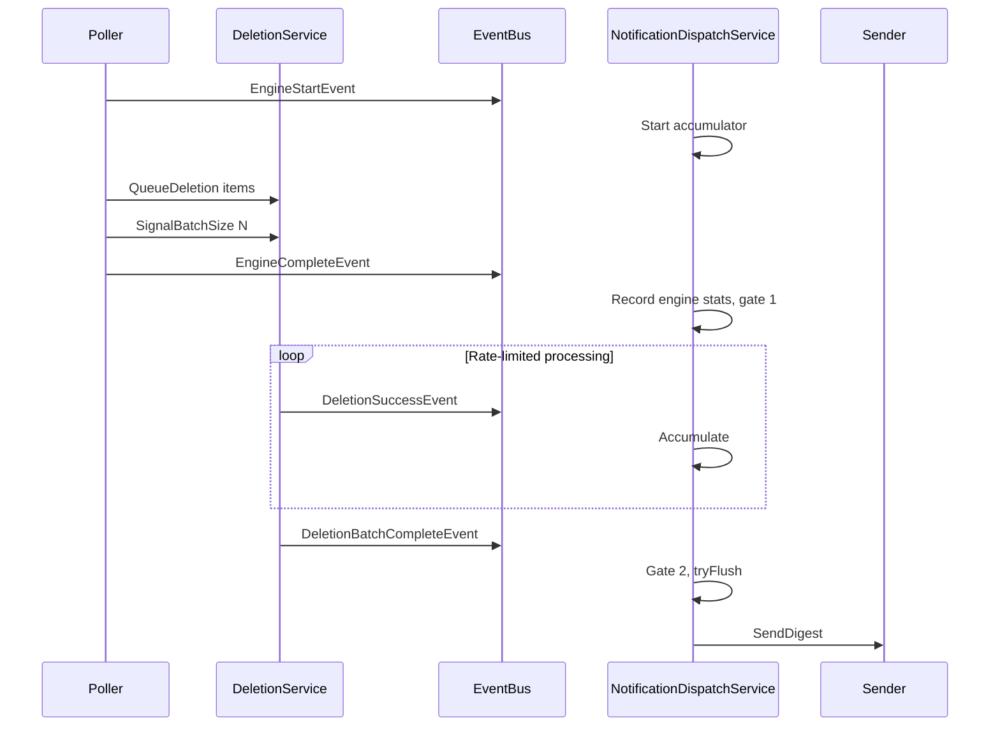
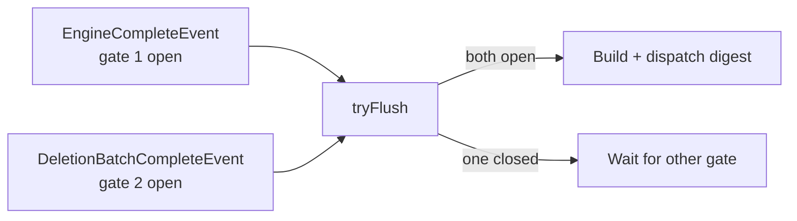
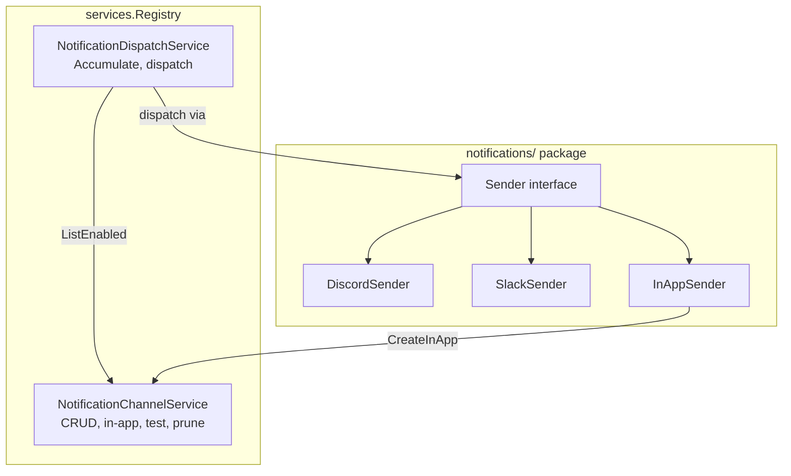

# Notification System Overhaul

**Status:** 📋 Planned
**Branch:** `feature/notification-overhaul`
**Scope:** Backend notification architecture, event system, Discord/Slack formatting, DB schema

---

## Background

The current notification system fires **per-item events** to Discord/Slack webhooks. When the engine flags 10 items for deletion, the DeletionService worker processes them one-by-one with a 3-second rate limiter, publishing a `DeletionSuccessEvent` for each — resulting in **11 Discord messages** (1 engine complete + 10 deletions trickling in over 30 seconds). This is extremely noisy.

Additionally, `EngineCompleteEvent` fires *before* the deletion worker finishes processing the queue, so the "engine complete" notification shows `flagged: 10, deleted: 0` — because the deletions haven't happened yet.

The `EventBusSubscriber` in `notifications/subscriber.go` also lacks a proper service layer home: it is instantiated standalone in `main.go` rather than living on the `services.Registry`.

## Goals

1. **One digest notification per engine cycle** — no per-item noise
2. **Event-driven batch completion** — `DeletionBatchCompleteEvent` signals when all deletions finish, eliminating arbitrary timers
3. **Sender interface** — testable, extensible notification channel implementations
4. **NotificationDispatchService** — proper service on the registry with accumulator + two-gate flush
5. **New notification types** — Cycle Digest, Engine Error, Mode Changed, Server Started, Threshold Breached
6. **Rich Discord/Slack embeds** — author branding, human-friendly sizes, progress bars, mode-aware formatting
7. **Frontend integration** — `DeletionBatchCompleteEvent` improves dashboard state machine + stats finality
8. **Clean up dead code** — delete old subscriber, old per-item notification mappings, old subscription columns

## Non-Goals

- Backwards compatibility with old subscription columns
- New notification channel types (Telegram, Gotify, etc.) — future work enabled by the Sender interface
- Frontend notification settings UI redesign — limited to updating subscription toggles

---

## Architecture

### Event Flow



### Two-Gate Flush Pattern

The dispatch service waits for **both** `EngineCompleteEvent` (gate 1) and `DeletionBatchCompleteEvent` (gate 2) before building and sending the digest. Whichever event arrives second triggers the flush. This ensures the digest contains accurate deleted/freed counts without arbitrary timers.



### Service Layer



### Notification Types

| Toggle | Event(s) | Delivery | Description |
|--------|----------|----------|-------------|
| `OnCycleDigest` | Accumulated cycle events | Buffered (two-gate) | One summary per engine cycle. Content adapts by mode. |
| `OnError` | `EngineErrorEvent`, accumulated `DeletionFailedEvent`s | Immediate | Engine failures and deletion failures |
| `OnModeChanged` | `EngineModeChangedEvent` | Immediate | Safety alert when execution mode changes |
| `OnServerStarted` | `ServerStartedEvent` | Immediate | Capacitarr is online after restart |
| `OnThresholdBreach` | New `ThresholdBreachedEvent` | Immediate | Disk usage exceeded configured threshold |
| `OnUpdateAvailable` | New `UpdateAvailableEvent` | Immediate | New version detected (fires once per version) |

The cycle digest also includes a version update banner when `VersionService` reports an update is available.

### DB Schema Changes (NotificationConfig)

Remove old columns, add new:

| Remove | Add |
|--------|-----|
| `on_deletion_executed` | `on_cycle_digest` (default: true) |
| `on_engine_complete` | `on_mode_changed` (default: true) |
| — | `on_server_started` (default: true) |
| — | `on_update_available` (default: true) |

Keep (rename): `on_threshold_breach` stays. `on_engine_error` → `on_error`.

All new columns default to `true` — all notification types are on by default for new channels.

---

## Notification Mockups (Discord Embeds)

Compact designs — no item names (security), no footers, no error details. Version and mode go in the author/title line. Slack and InApp will have equivalent content.

### Cycle Digest — Live Mode (auto, items deleted)

```
┌──────────────────────────────────────────────┐
│ ⚡ Capacitarr v1.4.0 • auto          (author) │
├──────────────────────────────────────────────┤
│ 🧹 Cleanup Complete                          │
│                                              │
│ Deleted **3** of **847** evaluated items     │
│ in **1.2s**, freeing **62.4 GB**             │
│                                              │
│ `▓▓▓▓▓▓▓▓▓▓▓▓▓▓░░░░░░` **72%** → 75%       │
└──────────────────────────────────────────────┘
  Color: #2ECC71 (green)
```

With version update available:

```
┌──────────────────────────────────────────────┐
│ ⚡ Capacitarr v1.4.0 • auto          (author) │
├──────────────────────────────────────────────┤
│ 🧹 Cleanup Complete                          │
│                                              │
│ Deleted **3** of **847** evaluated items     │
│ in **1.2s**, freeing **62.4 GB**             │
│                                              │
│ `▓▓▓▓▓▓▓▓▓▓▓▓▓▓░░░░░░` **72%** → 75%       │
│                                              │
│ 📦 **v1.5.0** available!                     │
└──────────────────────────────────────────────┘
  Color: #2ECC71 (green)
```

### Cycle Digest — Dry-Run Mode

```
┌──────────────────────────────────────────────┐
│ ⚡ Capacitarr v1.4.0 • dry-run       (author) │
├──────────────────────────────────────────────┤
│ 🔍 Dry-Run Complete                          │
│                                              │
│ Flagged **3** of **847** items in **1.2s**   │
│ Would free **62.4 GB**                       │
└──────────────────────────────────────────────┘
  Color: #3498DB (blue)
```

### Cycle Digest — Approval Mode

```
┌──────────────────────────────────────────────┐
│ ⚡ Capacitarr v1.4.0 • approval      (author) │
├──────────────────────────────────────────────┤
│ 📋 Items Queued for Approval                 │
│                                              │
│ Queued **3** of **847** items in **1.2s**    │
│ Potential **62.4 GB**                        │
└──────────────────────────────────────────────┘
  Color: #F1C40F (amber)
```

### Cycle Digest — All Clear

```
┌──────────────────────────────────────────────┐
│ ⚡ Capacitarr v1.4.0                 (author) │
├──────────────────────────────────────────────┤
│ ✅ All Clear                                  │
│                                              │
│ Evaluated **847** items — no action needed   │
│ `▓▓▓▓▓▓▓▓▓▓▓▓░░░░░░░░` **62%** / 85%       │
└──────────────────────────────────────────────┘
  Color: #2ECC71 (green)
```

### Engine Error

```
┌──────────────────────────────────────────────┐
│ ⚡ Capacitarr v1.4.0                 (author) │
├──────────────────────────────────────────────┤
│ 🔴 Engine Error                              │
│                                              │
│ The evaluation engine failed. Check the      │
│ application logs for details.                │
└──────────────────────────────────────────────┘
  Color: #E74C3C (red)
```

### Mode Changed

```
┌──────────────────────────────────────────────┐
│ ⚡ Capacitarr v1.4.0                 (author) │
├──────────────────────────────────────────────┤
│ ⚠️ Mode: **dry-run** → **auto**              │
│                                              │
│ Capacitarr will now delete files when the    │
│ disk threshold is breached.                  │
└──────────────────────────────────────────────┘
  Color: #E67E22 (orange)
```

### Server Started

```
┌──────────────────────────────────────────────┐
│ ⚡ Capacitarr v1.4.0                 (author) │
├──────────────────────────────────────────────┤
│ 🚀 Capacitarr is online                      │
└──────────────────────────────────────────────┘
  Color: #2ECC71 (green)
```

### Threshold Breached

```
┌──────────────────────────────────────────────┐
│ ⚡ Capacitarr v1.4.0                 (author) │
├──────────────────────────────────────────────┤
│ 🔴 Threshold Breached                        │
│                                              │
│ `▓▓▓▓▓▓▓▓▓▓▓▓▓▓▓▓▓░░░` **87%** / 85%       │
│ Target: **75%**                              │
└──────────────────────────────────────────────┘
  Color: #E74C3C (red)
```

### Update Available

```
┌──────────────────────────────────────────────┐
│ ⚡ Capacitarr v1.4.0                 (author) │
├──────────────────────────────────────────────┤
│ 📦 Update Available: **v1.5.0**              │
│                                              │
│ [View Release Notes](release-url)            │
└──────────────────────────────────────────────┘
  Color: #3498DB (blue)
```

### Test Notification

```
┌──────────────────────────────────────────────┐
│ ⚡ Capacitarr v1.4.0                 (author) │
├──────────────────────────────────────────────┤
│ 🔔 Test — channel is working!                │
└──────────────────────────────────────────────┘
  Color: #3498DB (blue)
```

### Embed Design Notes

- **Security first**: No media names, file paths, or error messages in external notifications. These may contain sensitive data and the Discord channel may be public. Direct users to check application logs for details.
- **No footer**: Version and mode are in the author line ("Capacitarr v1.4.0 • auto"), keeping the embed minimal.
- **No item lists**: Only counts and aggregate sizes. Prevents leaking library contents and avoids long embeds when many items are flagged.
- **Author block**: Always present. Format: "Capacitarr v{version}" + optional " • {mode}" for cycle digests.
- **Colors**: Green (#2ECC71) success, Blue (#3498DB) info, Amber (#F1C40F) attention, Orange (#E67E22) warning, Red (#E74C3C) error.
- **Progress bar**: `ProgressBar(pct, 20)` using `▓` and `░`.
- **Human sizes**: `HumanSize(bytes)` → "24.7 GB", "512.3 MB".
- **Version update banner**: Appended to the cycle digest when an update is available. The standalone "Update Available" notification links to release notes.
- **Update Available** notification fires once per version (tracked by `lastNotifiedVersion`).

---

## Service Layer Compliance Audit

Every data access in this plan goes through the appropriate service. This section documents the compliance for each step.

| Step | Data Access | Service Method | Direct DB? |
|------|-------------|----------------|------------|
| 1.3 | Read preferences (deletions enabled) | `SettingsReader.GetPreferences()` | ❌ |
| 1.3 | Publish events | `EventBus.Publish()` | ❌ |
| 1.3 | Create audit log entries | `AuditLogService.Create()` | ❌ |
| 1.3 | Increment engine stats | `EngineStatsWriter.IncrementDeletedStats()` | ❌ |
| 1.3 | Increment lifetime stats | `DeletionStatsWriter.IncrementDeletionStats()` | ❌ |
| 1.4 | Load integrations | `IntegrationService.ListEnabled()` | ❌ |
| 1.4 | Load preferences | `SettingsService.GetPreferences()` | ❌ |
| 1.4 | Signal batch size | `DeletionService.SignalBatchSize()` | ❌ |
| 1.5 | Publish threshold breach event | `EventBus.Publish()` | ❌ |
| 4.2 | List enabled channels | `ChannelProvider.ListEnabled()` | ❌ |
| 4.2 | Create in-app notification | `ChannelProvider.CreateInApp()` | ❌ |
| 5.4 | Get channel by ID | `ChannelProvider.GetByID()` | ❌ |
| 5.4 | Test send via sender | `Sender.SendAlert()` | ❌ |
| 6.1 | CRUD notification channels | `NotificationChannelService.*()` | ❌ |
| 6.1 | Test channel | `NotificationDispatchService.TestChannel()` | ❌ |
| 1.2c | Publish update event | `VersionService` → `EventBus.Publish()` | ❌ |
| 4.2 | Query update status for digest | `VersionChecker.CheckForUpdate()` | ❌ |

No step in this plan accesses `reg.DB` directly from route handlers, middleware, orchestrators, or event subscribers.

---

## Implementation Steps

### Phase 1: Event System Foundation

#### Step 1.1: Add `DeletionBatchCompleteEvent` to event types

**File:** `internal/events/types.go`

Add new event type in the Deletion Events section:

```go
type DeletionBatchCompleteEvent struct {
    Succeeded int `json:"succeeded"`
    Failed    int `json:"failed"`
}
```

With `EventType()` returning `"deletion_batch_complete"` and an appropriate `EventMessage()`.

#### Step 1.2: Add `ThresholdBreachedEvent` to event types

**File:** `internal/events/types.go`

Add new event type in the Settings Events section (or a new Disk Events section):

```go
type ThresholdBreachedEvent struct {
    MountPath    string  `json:"mountPath"`
    CurrentPct   float64 `json:"currentPct"`
    ThresholdPct float64 `json:"thresholdPct"`
    TargetPct    float64 `json:"targetPct"`
}
```

This is distinct from `ThresholdChangedEvent` (admin settings edit). `ThresholdBreachedEvent` fires when disk *actually* exceeds the threshold during evaluation.

#### Step 1.2b: Add `UpdateAvailableEvent` to event types

**File:** `internal/events/types.go`

Add new event type in a new Version Events section:

```go
type UpdateAvailableEvent struct {
    CurrentVersion string `json:"currentVersion"`
    LatestVersion  string `json:"latestVersion"`
    ReleaseURL     string `json:"releaseUrl"`
}
```

With `EventType()` returning `"update_available"`.

#### Step 1.2c: Publish `UpdateAvailableEvent` from `VersionService`

**File:** `internal/services/version.go`

Add an `*events.EventBus` dependency to `VersionService` (injected via constructor or `SetBus()` post-construction).

Add a `lastNotifiedVersion string` field to track which version we've already notified about.

In `fetchLatestRelease()`, after determining `updateAvailable == true`, check if `latestClean != s.lastNotifiedVersion`. If it's a new version detection:
- Publish `UpdateAvailableEvent` via the bus
- Store `latestClean` in `lastNotifiedVersion`

This ensures the event fires only **once per version**, not every 6 hours when the cache refreshes. The `lastNotifiedVersion` resets on server restart, which is acceptable — users will get one notification per restart if an update is pending.

#### Step 1.3: Add batch tracking to `DeletionService`

**File:** `internal/services/deletion.go`

Add batch tracking fields to the struct:

- `batchExpected atomic.Int64` — set by poller via `SignalBatchSize()`
- `batchProcessed atomic.Int64` — incremented after each `processJob()`

Add method `SignalBatchSize(count int)`:
- If `count == 0`: publish `DeletionBatchCompleteEvent{Succeeded: 0, Failed: 0}` immediately (the DeletionService owns this event — the poller should not publish it directly).
- If `count > 0`: store the expected count and reset processed to 0. The worker will publish the event after processing all items.

At the end of `processJob()`, after all existing event publishing, increment `batchProcessed`. When `batchProcessed >= batchExpected` and `batchExpected > 0`, publish `DeletionBatchCompleteEvent` with the current succeeded/failed counts and reset `batchExpected` to 0.

#### Step 1.4: Wire batch signals in the Poller

**File:** `internal/poller/poller.go`

In `poll()`, after the `evaluateAndCleanDisk` loop and before publishing `EngineCompleteEvent`:

- Track the total number of items queued to the deletion service across all disk groups.
- Call `p.reg.Deletion.SignalBatchSize(totalQueued)` — this works for both zero and non-zero cases. When `totalQueued == 0`, `SignalBatchSize(0)` publishes `DeletionBatchCompleteEvent` immediately inside the DeletionService (the service owns this event, not the poller). When `totalQueued > 0`, the worker publishes it after processing all items.

**File:** `internal/poller/evaluate.go`

In `evaluateAndCleanDisk`, return the count of items queued (currently the function returns nothing). Change the signature to return `int` (items queued). The poller sums these across all disk groups.

#### Step 1.5: Publish `ThresholdBreachedEvent` on actual breach

**File:** `internal/poller/evaluate.go`

In `evaluateAndCleanDisk`, after detecting `currentPct >= group.ThresholdPct` (at the point where the existing slog.Info "Disk threshold breached" fires), publish:

```go
p.reg.Bus.Publish(events.ThresholdBreachedEvent{
    MountPath:    group.MountPath,
    CurrentPct:   currentPct,
    ThresholdPct: group.ThresholdPct,
    TargetPct:    group.TargetPct,
})
```

#### Step 1.6: Tests for batch tracking

**File:** `internal/services/deletion_test.go` (new or extending existing)

Test that:
- `SignalBatchSize(3)` + 3 `processJob()` calls → publishes `DeletionBatchCompleteEvent`
- `SignalBatchSize(0)` → immediately publishes `DeletionBatchCompleteEvent{Succeeded: 0, Failed: 0}`
- Mixed success/failure still reaches batch complete
- Event carries correct succeeded/failed counts

---

### Phase 2: Sender Interface + Implementations

#### Step 2.1: Define `Sender` interface and notification data types

**File:** `internal/notifications/sender.go` (new)

Define:

```go
type Sender interface {
    SendDigest(webhookURL string, digest CycleDigest) error
    SendAlert(webhookURL string, alert Alert) error
}
```

Define `CycleDigest` struct:
- `ExecutionMode string`
- `Evaluated int`
- `Flagged int`
- `Deleted int`
- `Failed int`
- `FreedBytes int64`
- `DurationMs int64`
- `DiskUsagePct float64`
- `DiskThreshold float64`
- `Version string`
- `UpdateAvailable bool` — true if a newer version exists
- `LatestVersion string` — e.g. "v1.5.0"
- `ReleaseURL string` — link to release notes

Define `AlertType` string constants: `AlertError`, `AlertModeChanged`, `AlertServerStarted`, `AlertThresholdBreached`, `AlertUpdateAvailable`, `AlertTest`.

Define `Alert` struct:
- `Type AlertType`
- `Title string`
- `Message string`
- `Fields map[string]string`
- `Version string`

Add shared helper functions:
- `HumanSize(bytes int64) string` — returns "24.7 GB", "512.3 MB", etc.
- `ProgressBar(pct float64, width int) string` — returns `▓▓▓▓▓▓░░░░`

Note: No `DigestItem` or `DigestFailure` structs — notifications show aggregate counts only, not individual item names or error messages. This prevents leaking media library contents or internal error details to potentially public notification channels.

#### Step 2.2: Implement `DiscordSender`

**File:** `internal/notifications/discord.go` (rewrite)

Implement `Sender` interface. Expand the embed struct to include `author`, `thumbnail`, `footer`, `url` fields.

`SendDigest()`: Build a compact embed with:
- Author: "Capacitarr v{version} • {mode}" — version and mode in the author line, no footer
- Title: varies by mode ("🧹 Cleanup Complete", "🔍 Dry-Run Complete", "📋 Items Queued", "✅ All Clear")
- Description: one-line summary with bolded counts and sizes (no item names — security)
- Optional: disk usage progress bar
- Optional: "📦 v{latest} available!" update banner
- Color: green (action taken), blue (dry-run), amber (approval)

`SendAlert()`: Build a compact embed with:
- Author: "Capacitarr v{version}"
- Title: varies by alert type with emoji
- Description: generic message (no error details, no paths, no URLs — security). For errors: "Check the application logs for details."
- Color: red (error), orange (mode changed), green (server started), red (threshold breached), blue (update available)

Delete old `SendDiscord()`, `discordColors`, `discordEmoji` functions.

#### Step 2.3: Implement `SlackSender`

**File:** `internal/notifications/slack.go` (rewrite)

Implement `Sender` interface using Slack Block Kit.

`SendDigest()`: Build Block Kit payload with header, section, fields blocks — equivalent content to Discord but in Slack format.

`SendAlert()`: Same pattern adapted for Block Kit.

Delete old `SendSlack()`, `slackEmoji` functions.

#### Step 2.4: Implement `InAppSender`

**File:** `internal/notifications/inapp.go` (rewrite)

Implement `Sender` interface. Since in-app notifications are DB records, `InAppSender` needs an `InAppCreator` interface dependency (defined in Step 4.1, satisfied by `NotificationChannelService`). The `NotificationDispatchService` injects this dependency when constructing the sender.

`SendDigest()`: Create an `InAppNotification` record with a title/message extracted from the digest. Calls `inAppCreator.CreateInApp()`.

`SendAlert()`: Same pattern for alerts.

Replace `SeverityForEvent()` with severity logic based on `AlertType` and digest context.

#### Step 2.5: Tests for Sender implementations

**Files:** `internal/notifications/discord_test.go`, `slack_test.go`, `inapp_test.go` (new)

Test that:
- `SendDigest()` produces valid JSON payloads with expected structure
- Different execution modes produce different titles/colors
- `SendAlert()` produces valid payloads for each alert type
- Helper functions (`HumanSize`, `ProgressBar`, `MediaEmoji`) return expected values

For Discord/Slack: use a mock HTTP server to capture the webhook payload and validate structure.
For InApp: use a mock `NotificationProvider`.

---

### Phase 3: DB Schema Migration

#### Step 3.1: Create migration file

**File:** `internal/db/migrations/00003_notification_subscription_columns.sql`

SQL migration:
1. Add columns: `on_cycle_digest BOOLEAN NOT NULL DEFAULT 1`, `on_error BOOLEAN NOT NULL DEFAULT 1`, `on_mode_changed BOOLEAN NOT NULL DEFAULT 1`, `on_server_started BOOLEAN NOT NULL DEFAULT 1`, `on_update_available BOOLEAN NOT NULL DEFAULT 1`
2. Drop columns: `on_deletion_executed`, `on_engine_complete`, `on_engine_error`
3. Rename: `on_threshold_breach` stays as-is (same name)

Note: SQLite does not support `DROP COLUMN` in older versions. Check if the project's SQLite driver supports it (modernc). If not, use the standard SQLite workaround: create new table → copy data → drop old → rename new.

#### Step 3.2: Update `db.NotificationConfig` model

**File:** `internal/db/models.go`

Replace subscription fields:

```go
type NotificationConfig struct {
    // ... existing fields ...
    OnCycleDigest     bool `gorm:"default:true" json:"onCycleDigest"`
    OnError           bool `gorm:"default:true" json:"onError"`
    OnModeChanged     bool `gorm:"default:true" json:"onModeChanged"`
    OnServerStarted   bool `gorm:"default:true" json:"onServerStarted"`
    OnThresholdBreach  bool `gorm:"default:true" json:"onThresholdBreach"`
    OnUpdateAvailable  bool `gorm:"default:true" json:"onUpdateAvailable"`
    // ...
}
```

Remove old: `OnDeletionExecuted`, `OnEngineError`, `OnEngineComplete`.

---

### Phase 4: NotificationDispatchService

#### Step 4.1: Define service interfaces

**File:** `internal/services/notification_dispatch.go` (new)

Define `ChannelProvider` interface (combines all NotificationChannelService methods needed by the dispatch service):

```go
type ChannelProvider interface {
    ListEnabled() ([]db.NotificationConfig, error)
    GetByID(id uint) (*db.NotificationConfig, error)
    CreateInApp(title, message, severity, eventType string) error
}
```

This is satisfied by `NotificationChannelService`. Using a single interface keeps the dependency clean and avoids splitting the same service across multiple interfaces. The `InAppSender` in the `notifications/` package receives a narrower `InAppCreator` sub-interface (only `CreateInApp`), but the dispatch service holds the full `ChannelProvider`.

Define `VersionChecker` interface:

```go
type VersionChecker interface {
    CheckForUpdate() (*VersionCheckResult, error)
}
```

This is satisfied by `VersionService`. Used by the dispatch service to populate the update-available banner in cycle digests.

#### Step 4.2: Implement `NotificationDispatchService`

**File:** `internal/services/notification_dispatch.go`

Struct fields:
- `bus *events.EventBus`
- `channels ChannelProvider` — single interface covering ListEnabled, GetByID, CreateInApp
- `versionChecker VersionChecker` — interface to VersionService for update info in digests
- `senders map[string]notifications.Sender` — keyed by channel type ("discord", "slack", "inapp")
- `version string`
- `mu sync.Mutex`
- `accumulator *cycleAccumulator`
- `ch chan events.Event`
- `done chan struct{}`

Constructor: `NewNotificationDispatchService(bus, channels ChannelProvider, versionChecker VersionChecker, version string)`. Constructs and registers the Discord, Slack, and InApp senders internally. The `InAppSender` receives the `channels` argument (which satisfies the `InAppCreator` sub-interface).

`Start()`: Subscribes to the event bus, starts the background `run()` goroutine.

`Stop()`: Unsubscribes from the bus, waits for the goroutine.

`run()`: Reads events from the channel, calls `handle()`.

`handle(event)`: Switch on event type:
- `EngineStartEvent` → reset accumulator
- `EngineCompleteEvent` → record stats, mark gate 1, call `tryFlush()`
- `DeletionSuccessEvent` → append to accumulator
- `DeletionDryRunEvent` → append to accumulator
- `DeletionFailedEvent` → append to accumulator failures
- `DeletionBatchCompleteEvent` → mark gate 2, call `tryFlush()`
- `EngineErrorEvent` → dispatch immediate alert (type `AlertError`)
- `EngineModeChangedEvent` → dispatch immediate alert (type `AlertModeChanged`)
- `ServerStartedEvent` → dispatch immediate alert (type `AlertServerStarted`)
- `ThresholdBreachedEvent` → dispatch immediate alert (type `AlertThresholdBreached`)
- `UpdateAvailableEvent` → dispatch immediate alert (type `AlertUpdateAvailable`)

`tryFlush()`: Under lock, check both gates. If both open, consume the accumulator, query `VersionService.CheckForUpdate()` to populate the update banner, build a `CycleDigest`, unlock, dispatch to all subscribed channels.

`dispatchDigest(digest)`: Query `channels.ListEnabled()`, filter by `OnCycleDigest`, dispatch via the appropriate `Sender` for each channel type.

`dispatchAlert(alert)`: Query `channels.ListEnabled()`, filter by the appropriate subscription field for the alert type, dispatch via `Sender`.

#### Step 4.3: Define `cycleAccumulator` (unexported helper)

**File:** `internal/services/notification_dispatch.go`

Internal struct:
- `executionMode string`
- `engineComplete bool` (gate 1)
- `batchComplete bool` (gate 2)
- `evaluated int`, `flagged int`, `durationMs int64`
- `deletedCount int`
- `failedCount int`
- `totalFreedBytes int64`

Method `buildDigest(version string) notifications.CycleDigest` — assembles all accumulated data into a `CycleDigest`.

#### Step 4.4: Register on `services.Registry`

**File:** `internal/services/registry.go`

Add `NotificationDispatch *NotificationDispatchService` to the `Registry` struct.

In `NewRegistry()`, construct the dispatch service after `NotificationChannelService`:

```go
notifDispatch := NewNotificationDispatchService(bus, notifChannelSvc, nil, "")
```

The `VersionChecker` is `nil` at construction because `VersionService` is created later via `InitVersion()`. Add a `SetVersionChecker(vc VersionChecker)` method, called from `InitVersion()`:

```go
reg.NotificationDispatch.SetVersionChecker(reg.Version)
```

The version is set later via `InitVersion()` — add `reg.NotificationDispatch.SetVersion(appVersion)` inside `InitVersion()`.

#### Step 4.5: Update `main.go` wiring

**File:** `main.go`

Remove the standalone subscriber creation:
```go
// DELETE these lines:
notifSubscriber := notifications.NewEventBusSubscriber(reg.NotificationChannel, bus)
notifSubscriber.Start()
```

Replace with:
```go
reg.NotificationDispatch.Start()
```

In the shutdown section, add:
```go
reg.NotificationDispatch.Stop()
```

#### Step 4.6: Tests for `NotificationDispatchService`

**File:** `internal/services/notification_dispatch_test.go` (new)

Use in-memory SQLite pattern. Test:
- **Two-gate flush**: publish `EngineStartEvent`, then `EngineCompleteEvent`, then `DeletionBatchCompleteEvent` → verify digest is dispatched once
- **Reverse gate order**: `DeletionBatchCompleteEvent` before `EngineCompleteEvent` → still flushes
- **No flagged items**: `DeletionBatchCompleteEvent{0, 0}` + `EngineCompleteEvent{Flagged: 0}` → flush (or skip if "all clear" is suppressed)
- **Accumulation**: 3 `DeletionSuccessEvent`s → digest shows 3 items with correct names/sizes
- **Immediate alerts**: `EngineErrorEvent` → dispatches alert immediately without waiting for gates
- **Subscription filtering**: channel with `OnCycleDigest: false` does not receive digest
- **Channel type routing**: Discord channels dispatch via `DiscordSender`, Slack via `SlackSender`

Use mock `Sender` implementations to capture payloads.

---

### Phase 5: Clean Up Dead Code

#### Step 5.1: Delete `notifications/subscriber.go`

**File:** `internal/notifications/subscriber.go` — DELETE entirely

The `EventBusSubscriber` struct, `NewEventBusSubscriber()`, `mapToNotification()`, `NotificationProvider` interface — all replaced by `NotificationDispatchService`.

#### Step 5.2: Clean up `notifications/types.go`

**File:** `internal/notifications/types.go`

Remove:
- `NotificationEvent` struct (replaced by `CycleDigest` and `Alert`)
- Old event type constants: `EventThresholdBreach`, `EventDeletionExecuted`, `EventEngineError`, `EventEngineComplete`
- Old emoji constants: `emojiRed`, `emojiYellow`, `emojiGreen`, `emojiInfo` (these now live in their respective Sender implementations)
- `subscribes()` function (subscription checking moves to `NotificationDispatchService`)

#### Step 5.3: Remove `NotificationProvider` interface usage

The `NotificationProvider` interface was defined in `subscriber.go` for the old subscriber. After deleting `subscriber.go`, verify no other code references it. The `InAppSender` and `NotificationDispatchService` use their own interfaces (`InAppCreator`, `ChannelLister`).

#### Step 5.4: Move `TestChannel()` to `NotificationDispatchService`

`TestChannel()` currently lives on `NotificationChannelService` (in `notification_channel.go`) and calls the old `SendDiscord()`/`SendSlack()` standalone functions directly. Since `NotificationDispatchService` **owns** the `Sender` instances, test dispatching is a dispatch concern, not a CRUD concern.

**File:** `internal/services/notification_dispatch.go`

Add `TestChannel(id uint) error` method to `NotificationDispatchService`:
- Look up the channel config via `channels.GetByID(id)` (already on the `ChannelProvider` interface defined in Step 4.1)
- Build a test `Alert` with type `AlertTest`, title "Test Notification", a friendly message
- Dispatch via the appropriate `Sender` for the channel type

**File:** `internal/services/notification_channel.go`

Remove the `TestChannel()` method. It no longer belongs here now that the dispatch service owns all sending logic.

**File:** `routes/notifications.go`

Update the test channel route handler to call `reg.NotificationDispatch.TestChannel(id)` instead of `reg.NotificationChannel.TestChannel(id)`.

#### Step 5.5: Remove `ThresholdChangedEvent` → notification mapping

The old `subscriber.go` mapped `ThresholdChangedEvent` (admin settings edit) to `EventThresholdBreach` notifications. This was incorrect — changing settings is not a breach. The new `ThresholdBreachedEvent` replaces this. Verify `ThresholdChangedEvent` still exists for its original purpose (activity log, SSE) but no longer triggers notifications.

---

### Phase 6: Route Handler + Frontend Updates

#### Step 6.1: Update notification channel route handlers

**File:** `routes/notifications.go`

Update the POST and PUT handlers to accept the new subscription fields (`onCycleDigest`, `onError`, `onModeChanged`, `onServerStarted`, `onThresholdBreach`) and stop accepting the old ones (`onDeletionExecuted`, `onEngineComplete`, `onEngineError`).

Update any validation logic that references old field names.

#### Step 6.2: Frontend — Update notification channel form

Update the notification channel create/edit form to show the new subscription toggles:
- ✅ Cycle Digest (default: on)
- ✅ Errors (default: on)
- ✅ Mode Changed (default: on)
- ✅ Server Started (default: on)
- ✅ Threshold Breached (default: on)
- ✅ Update Available (default: on)

Remove old toggles: "On Deletion Executed", "On Engine Complete", "On Engine Error".

#### Step 6.3: Frontend — Handle `DeletionBatchCompleteEvent` on SSE

The SSE broadcaster already forwards all events. Add frontend handling for `deletion_batch_complete`:

- When received, refresh dashboard stats (fetch `GET /api/v1/worker/stats`) — the numbers are now final
- Update engine status indicator: transition from "Deleting" → "Idle"

Consider a three-state engine status: Idle → Evaluating (on `engine_start`) → Deleting (on `engine_complete` when `flagged > 0`) → Idle (on `deletion_batch_complete`).

---

### Phase 7: Verification

#### Step 7.1: Run `make ci`

Run `make ci` inside the `capacitarr/` directory to verify lint, test, and security checks all pass.

#### Step 7.2: Docker integration test

Run `docker compose up --build` and verify:
- Engine cycle in dry-run mode → one digest notification on Discord/Slack
- Engine cycle in auto mode → one digest notification with item names and freed bytes
- Engine error → immediate error notification
- Mode change from dry-run to auto → immediate alert
- Server restart → server started notification
- Threshold breach → immediate threshold alert
- No per-item deletion messages
- In-app notifications show the same content as external channels
- SSE stream shows `deletion_batch_complete` event
- Frontend dashboard stats update correctly after batch complete

---

## Files Changed Summary

| Action | File | Description |
|--------|------|-------------|
| Modify | `internal/events/types.go` | Add `DeletionBatchCompleteEvent`, `ThresholdBreachedEvent` |
| Modify | `internal/services/deletion.go` | Add batch tracking (`SignalBatchSize`, counter, publish batch complete) |
| Modify | `internal/poller/poller.go` | Track queued items, call `DeletionService.SignalBatchSize()` |
| Modify | `internal/poller/evaluate.go` | Return queued count, publish `ThresholdBreachedEvent` |
| Create | `internal/notifications/sender.go` | `Sender` interface, `CycleDigest`, `Alert`, helper functions |
| Rewrite | `internal/notifications/discord.go` | Implement `Sender` with rich embeds |
| Rewrite | `internal/notifications/slack.go` | Implement `Sender` with Block Kit |
| Rewrite | `internal/notifications/inapp.go` | Implement `Sender` for DB records |
| Delete | `internal/notifications/subscriber.go` | Old subscriber — replaced by `NotificationDispatchService` |
| Simplify | `internal/notifications/types.go` | Remove old types, keep only if shared constants remain |
| Create | `internal/db/migrations/00003_notification_subscription_columns.sql` | New subscription columns, drop old ones |
| Modify | `internal/db/models.go` | New subscription fields on `NotificationConfig` |
| Create | `internal/services/notification_dispatch.go` | `NotificationDispatchService` with accumulator + two-gate flush |
| Modify | `internal/services/registry.go` | Add `NotificationDispatch` to `Registry` |
| Modify | `internal/services/notification_channel.go` | Remove `TestChannel()` (moved to dispatch service) |
| Modify | `internal/services/version.go` | Add `EventBus` dependency, publish `UpdateAvailableEvent` on first detection |
| Modify | `main.go` | Replace standalone subscriber with `reg.NotificationDispatch.Start()` |
| Modify | `routes/notifications.go` | Update subscription field names in handlers |
| Create | `internal/services/notification_dispatch_test.go` | Tests for dispatch service |
| Create | `internal/notifications/discord_test.go` | Tests for Discord formatting |
| Create | `internal/notifications/slack_test.go` | Tests for Slack formatting |
| Create | `internal/notifications/inapp_test.go` | Tests for in-app formatting |
| Modify | Frontend notification form | New subscription toggles |
| Modify | Frontend SSE handler | Handle `deletion_batch_complete` |
