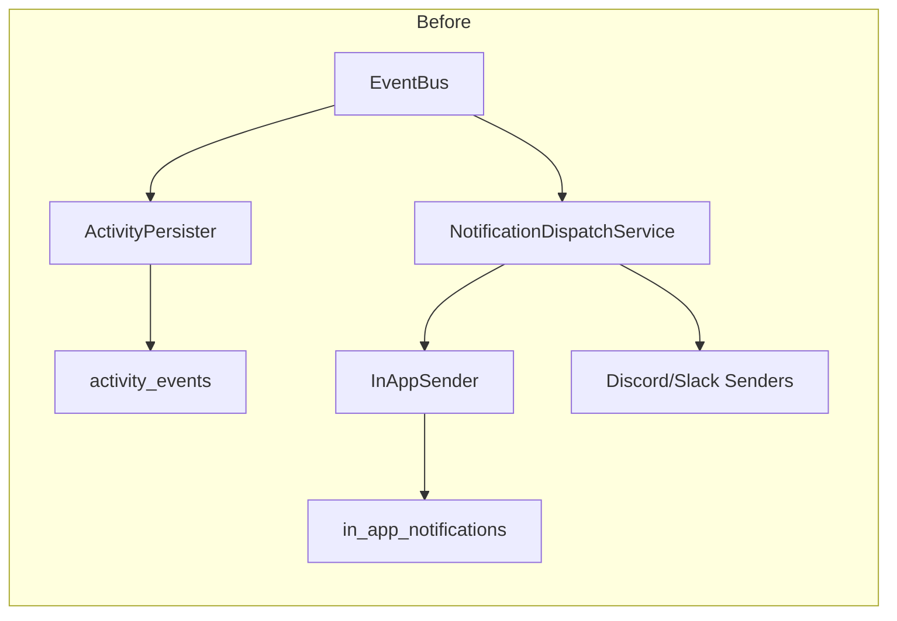
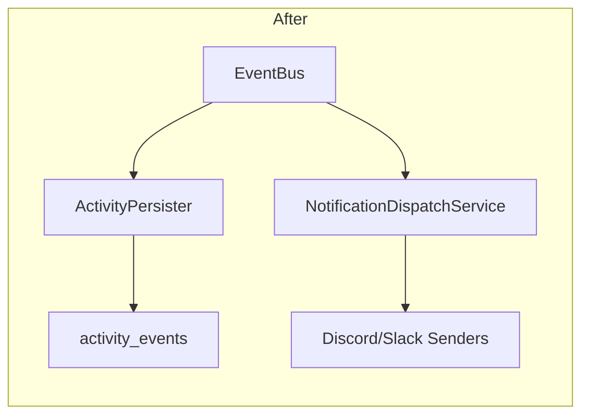

# Remove In-App Notifications & Add `:stable` Docker Tag

**Created:** 2026-03-07T21:17Z
**Status:** ✅ Complete

## Overview

Two independent changes from the pre-1.0 discussion:

1. **Remove the in-app notification system entirely** — it duplicates the activity log
2. **Add a `:stable` Docker tag** — so users can pin to production-ready releases

---

## Part 1: Remove In-App Notification System

### Rationale

The in-app notification system (`InAppNotification` model, `InAppSender`, notification bell UI) is fully redundant with the activity log system (`ActivityEvent` model, `ActivityPersister`). Both consume the same events from the `EventBus` and write human-readable records to separate database tables. Removing in-app notifications eliminates double writes, simplifies the notification dispatch pipeline, and removes a confusing UX where users see the same information in two places.

### Architecture Before/After





### Step 1: Database Migration

Create migration `00006_drop_in_app_notifications.sql`:

```sql
-- +goose Up
DROP TABLE IF EXISTS in_app_notifications;

-- +goose Down
CREATE TABLE IF NOT EXISTS in_app_notifications (
    id INTEGER PRIMARY KEY AUTOINCREMENT,
    title TEXT NOT NULL,
    message TEXT NOT NULL,
    severity TEXT NOT NULL DEFAULT 'info',
    read BOOLEAN DEFAULT FALSE,
    event_type TEXT NOT NULL,
    created_at DATETIME
);
```

Note: Migration `00005_remove_inapp_channel_type.sql` already removes `inapp` rows from `notification_configs`. This new migration drops the `in_app_notifications` table itself.

### Step 2: Remove `InAppNotification` Model

In `internal/db/models.go`:
- Remove the `InAppNotification` struct (lines 203-212)

In `internal/db/db.go`:
- Remove `InAppNotification` from the `AutoMigrate` call (if present)

### Step 3: Remove `InAppSender` and `InAppCreator` Interface

Delete file: `internal/notifications/inapp.go`

In `internal/notifications/sender.go`:
- Remove the `InAppCreator` interface (lines 14-18)
- Remove the in-app severity constants (`severityInfo`, `severityWarning`, `severityError`, `severitySuccess`) — check if Discord/Slack senders use them first; if not, remove

### Step 4: Remove In-App Methods from `NotificationChannelService`

In `internal/services/notification_channel.go`, remove these methods:
- `ListInApp(limit int)` (lines 112-119)
- `UnreadCount()` (lines 121-128)
- `MarkRead(id uint)` (lines 130-140)
- `MarkAllRead()` (lines 142-148)
- `ClearAllInApp()` (lines 150-156)
- `PruneOldInApp(cutoff time.Time)` (lines 158-165)
- `CreateInApp(title, message, severity, eventType string)` (lines 167-179)

### Step 5: Remove `CreateInApp` from `ChannelProvider` Interface

In `internal/services/notification_dispatch.go`:
- Remove `CreateInApp(title, message, severity, eventType string) error` from the `ChannelProvider` interface (line 22)

### Step 6: Remove In-App Sender from `NotificationDispatchService`

In `internal/services/notification_dispatch.go`:
- Remove `"inapp": notifications.NewInAppSender(channels)` from the `senders` map in `NewNotificationDispatchService()` (line 63)
- In `dispatchDigest()`: remove the "unconditionally write in-app notification" block (lines 344-359)
- In `dispatchDigest()`: remove the `cfg.Type == "inapp"` skip check (lines 300-304)
- In `dispatchAlert()`: remove the "unconditionally write in-app notification" block (lines 426-442)
- In `dispatchAlert()`: remove the `cfg.Type == "inapp"` skip check (lines 380-384)

### Step 7: Remove In-App Notification Routes

In `routes/notifications.go`:
- Remove the entire "In-App Notification Management" section (lines 167-217):
  - `GET /api/v1/notifications` — list in-app notifications
  - `GET /api/v1/notifications/unread-count` — unread count
  - `PUT /api/v1/notifications/:id/read` — mark as read
  - `PUT /api/v1/notifications/read-all` — mark all as read
  - `DELETE /api/v1/notifications` — clear all
- Update the comment on `RegisterNotificationRoutes` to remove "and management endpoints for in-app notifications"

In `routes/api.go`:
- Update the comment on line 89 from "Notification routes (channels CRUD + in-app notifications)" to "Notification routes (channels CRUD)"

### Step 8: Remove In-App Notification Cron Job

In `internal/jobs/cron.go`:
- Remove cron job #6 "Prune old in-app notifications" (lines 91-110)

### Step 9: Update Tests

**`internal/services/notification_channel_test.go`** — remove these test functions:
- `TestNotificationChannelService_ListInApp`
- `TestNotificationChannelService_UnreadCount`
- `TestNotificationChannelService_MarkRead`
- `TestNotificationChannelService_MarkRead_NotFound`
- `TestNotificationChannelService_MarkAllRead`
- Any `ClearAllInApp` or `PruneOldInApp` tests (check remaining lines)
- Update `TestNotificationChannelService_Delete` to use a non-inapp channel type (currently seeds `Type: "inapp"` on line 103)

**`internal/services/notification_dispatch_test.go`** — update:
- Remove `CreateInApp` from `mockChannelProvider` (line 37-41)
- Remove `mockInApp` struct and `inApps` field from `mockChannelProvider` (lines 16, 20-22)
- In `newTestDispatch()`: remove `"inapp": inappMock` from the senders map (line 92) and the `inappMock` return value
- Update all callers of `newTestDispatch()` that destructure 3 return values — change to 2 return values
- Remove or update any tests that assert on in-app mock behavior

**`routes/notifications_test.go`** — remove these test functions:
- `TestListInAppNotifications_Empty` (lines 312-331)
- `TestUnreadCount_InitiallyZero` (lines 335-354)
- `TestMarkAllRead` (lines 358-384)
- `TestClearAllInAppNotifications` (lines 388+)

**`internal/notifications/sender_test.go`** — check for any `InAppSender` tests and remove them.

### Step 10: Update Frontend

Remove the notification bell component and any in-app notification API calls from the frontend. The activity log feed on the dashboard replaces this functionality. Specific files will need to be identified during implementation (check for components referencing `/api/v1/notifications` endpoints that are NOT `/api/v1/notifications/channels`).

### Step 11: Update Documentation

**`docs/notifications.md`**:
- Remove the "In-App Notifications" section (lines 37-49)
- Update the opening paragraph to remove "and a built-in in-app notification center"
- Add a note that the activity log provides system event visibility

**`docs/api/openapi.yaml`**:
- Remove the in-app notification endpoints:
  - `GET /notifications`
  - `GET /notifications/unread-count`
  - `PUT /notifications/{id}/read`
  - `PUT /notifications/read-all`
  - `DELETE /notifications`
- Remove the `InAppNotification` schema

### Step 12: Run `make ci`

Verify all changes compile, lint, and pass tests.

---

## Part 2: Add `:stable` Docker Tag

### Rationale

The current CI tags `:latest` on every release, including pre-releases like `v1.0.0-rc.1`. Per Docker convention, `:latest` should be the most recently built image (including pre-releases), while `:stable` should point to the most recent non-pre-release version. This prevents users from unintentionally upgrading to an unstable release.

### Current Tagging (`.gitlab-ci.yml` lines 167-189)

| Tag | When Applied |
|-----|-------------|
| `:VERSION` | Every release |
| `:latest` | Every release (including pre-releases) ⚠️ |
| `:MAJOR`, `:MINOR` | Stable releases only |

### Proposed Tagging

| Tag | When Applied | Meaning |
|-----|-------------|---------|
| `:VERSION` | Every release | Immutable, pinned to exact version |
| `:latest` | Every release | Most recently built image, may be pre-release |
| `:stable` | Stable releases only | Most recent non-pre-release version |
| `:MAJOR`, `:MINOR` | Stable releases only | Floating within stable release line |

### Step 1: Update CI Docker Tagging

In `.gitlab-ci.yml`, update the `release:docker` job script (lines 167-188):

```bash
VERSION=${CI_COMMIT_TAG#v}
IMAGE="${CI_REGISTRY_IMAGE}"

# Always tag with the full version and :latest
TAGS="--tag ${IMAGE}:${VERSION} --tag ${IMAGE}:latest"

# Stable releases: also tag :stable, :MAJOR, :MINOR
if echo "$VERSION" | grep -qv '-'; then
    MAJOR=$(echo "$VERSION" | cut -d. -f1)
    MINOR=$(echo "$VERSION" | cut -d. -f1-2)
    TAGS="$TAGS --tag ${IMAGE}:stable --tag ${IMAGE}:${MAJOR} --tag ${IMAGE}:${MINOR}"
fi
```

### Step 2: Update Documentation

**`docs/deployment.md`** — update the Docker pull instructions to recommend `:stable`:

```markdown
## Recommended Tags

| Tag | Description |
|-----|-------------|
| `:stable` | Latest stable release (recommended for production) |
| `:latest` | Most recent build, including pre-releases |
| `:1.0.0` | Pinned to exact version |
| `:1.0` | Latest patch within 1.0.x |
| `:1` | Latest minor+patch within 1.x.x |
```

**`docs/releasing.md`** — document the tagging strategy in the release process docs.

**`README.md`** — update any Docker pull examples to use `:stable`.

**`docker-compose.yml`** — update the default image tag if it references `:latest`.

### Step 3: Run `make ci`

Verify CI config changes are valid (YAML syntax, no broken references).

---

## Execution Order

These two changes are independent and can be done in either order or in parallel branches. Recommended order:

1. **Part 1 (in-app removal)** first — it's the larger change with more files touched
2. **Part 2 (stable tag)** second — small CI-only change

Both should be on separate feature branches and merged independently.
