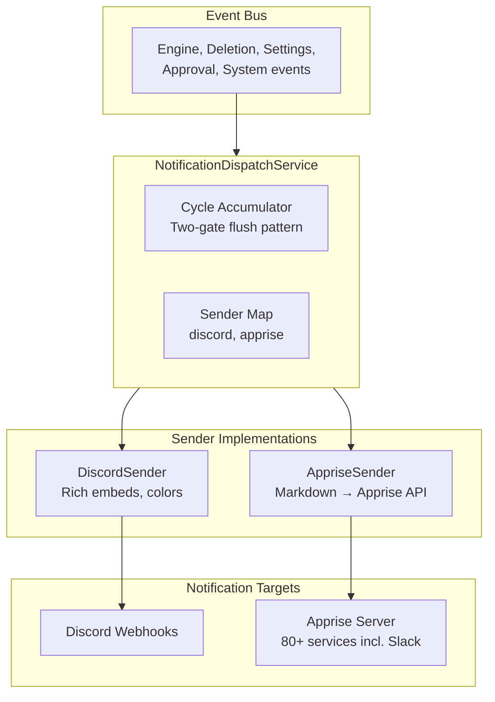
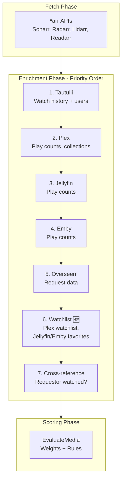
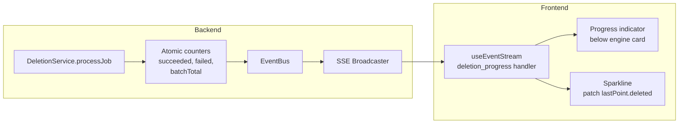

# v1.x Feature Batch — Implementation Plan

**Date:** 2026-03-09
**Status:** 📋 Planning
**Branch:** `feature/v1x-feature-batch`

---

## Overview

This plan covers seven features and two audit phases, derived from the codebase audit and roadmap discussion (`docs/plans/20260309T0015Z-codebase-audit-and-roadmap.md`). All work happens on a single feature branch.

### Guiding Principles

- **No backwards compatibility concerns.** There are no production users yet. However, we keep database migrations additive and non-destructive so existing databases upgrade cleanly (no data loss for early adopters).
- **Service layer compliance.** All data access goes through services. No direct DB access from routes, middleware, orchestrators, or subscribers.
- **Clean removal.** When removing features (Slack, rules portability), delete all related code, tests, validation, constants, and documentation. No dead code, no stubs, no "deprecated" markers.
- **Conventional commits.** Every commit follows the conventional commits format for git-cliff changelog generation.

### Features

| Phase | Feature | Summary |
|-------|---------|---------|
| 1 | Deletion worker progress (SSE) | Wire existing atomic counters into SSE events, update sparkline in real-time, remove dead REST-only polling code |
| 2 | Apprise notification support + Slack removal | New `"apprise"` channel type, remove Slack sender and all related code |
| 3 | Settings export/import | Full config backup with section-level granularity, supersedes rules-only portability |
| 4 | Watchlist enrichment | Plex/Jellyfin/Emby watchlist → `OnWatchlist` field + custom rule support |
| 5 | Collection autocomplete | Populate rule builder value field from actual Plex collections |
| 6 | Mobile PWA | manifest.json + service worker via Nuxt PWA module |
| 7 | Per-integration scoring overrides (frontend mockup) | Non-functional UI toggle + inline sliders for UX evaluation |
| 8 | Test audit | Audit all tests, remove dead/wasteful tests, ensure coverage |
| 9 | Documentation audit | Update all project and site docs to reflect new functionality |

### Migration Strategy

All existing migrations (`00001` through `00006`) remain untouched. New schema changes are added as new migration files. Migrations are additive and non-destructive:
- `ALTER TABLE ... ADD COLUMN` with defaults for new columns
- `DELETE FROM ... WHERE` for rows referencing removed features (e.g., Slack channels)
- Never modify or drop existing tables that contain user data

---

## Phase 0: Branch Setup

### Step 0.1: Create feature branch

```bash
git checkout main
git pull
git checkout -b feature/v1x-feature-batch
```

Verify clean working tree with `git status` before branching.

---

## Phase 1: Deletion Worker Progress (SSE)

### Context

`DeletionService` already tracks `currentlyDeleting`, `batchExpected`, `batchProcessed`, `batchSucceeded`, and `batchFailed` via atomics. The frontend currently polls `GET /worker/stats` via REST. This phase wires those counters into the SSE event stream and uses the SSE data to update both a progress indicator and the dashboard sparkline in real-time.

**Sparkline note:** The engine history sparklines are fed by `GET /engine/history`, which reads `EngineRunStats` rows from the database. The `Deleted` count on each row is incrementally updated by the deletion worker via `IncrementDeletedStats()`. However, the frontend only fetches this data on page load or when an `engine_complete` SSE event triggers a refresh — so during an active deletion batch, the sparkline's "Deleted" count is stale. This phase fixes that by having the frontend patch the sparkline's most recent data point with the `succeeded` count from the `DeletionProgressEvent` SSE stream.

### Steps

#### Step 1.1: Add `DeletionProgressEvent` to `events/types.go`

Add a new event type following the established pattern in `events/types.go`:

```go
type DeletionProgressEvent struct {
    CurrentItem string `json:"currentItem"`
    QueueDepth  int    `json:"queueDepth"`
    Processed   int    `json:"processed"`
    Succeeded   int    `json:"succeeded"`
    Failed      int    `json:"failed"`
    BatchTotal  int    `json:"batchTotal"`
}
```

Implement `EventType()` returning `"deletion_progress"` and `EventMessage()` with a descriptive string.

#### Step 1.2: Publish `DeletionProgressEvent` from the deletion worker

In `DeletionService.processJob()` (in `services/deletion.go`), after each job completes (success or failure), publish the new event via `s.bus.Publish()`. The event payload is built from the existing atomic counters plus `len(s.queue)` for queue depth.

#### Step 1.3: Add frontend SSE handler for `deletion_progress`

In the frontend's `useEventStream` composable, register a handler for the `deletion_progress` event type. Create a reactive store (or extend the existing engine status store) to hold the deletion progress state.

#### Step 1.4: Add deletion progress indicator to the dashboard

Add a subtle progress indicator (small progress bar or text) below the engine status card that appears when `batchTotal > 0` and `processed < batchTotal`. Auto-hides when the batch completes.

#### Step 1.5: Update sparkline with real-time deletion data

When the frontend receives a `deletion_progress` SSE event, patch the most recent data point in the sparkline array:
- Set `lastPoint.deleted = event.succeeded`
- The sparkline re-renders with the updated count

When the batch completes (signaled by `engine_complete` or `deletion_batch_complete` SSE event), trigger a full re-fetch from `GET /engine/history` to reconcile with the authoritative DB values.

#### Step 1.6: Remove dead REST-only worker stats polling code

Identify and remove frontend polling code that was replaced by the SSE approach:
- Any frontend `setInterval` or polling composable that fetches `GET /worker/stats` for deletion progress display
- Any unused helper methods on `DeletionService` that only existed to serve the REST endpoint

**Note:** Keep the `GET /worker/stats` REST endpoint itself — it's still useful for API consumers and the engine status card. Only remove the frontend *polling* of it for deletion progress, since SSE now handles that.

#### Step 1.7: Write tests for `DeletionProgressEvent`

- Unit test in `events/` verifying `EventType()` and `EventMessage()` return correct values
- Unit test in `services/deletion_test.go` verifying that `processJob()` publishes `DeletionProgressEvent` with correct counters
- Follow the existing in-memory SQLite test pattern used throughout `services/*_test.go`

#### Step 1.8: Run `make ci` and fix any issues

---

## Phase 2: Apprise Notification Support + Slack Removal

### Context

The notification system uses a `Sender` interface with `SendDigest()` and `SendAlert()` methods. `DiscordSender` and `SlackSender` currently implement this. This phase:
1. **Adds Apprise** as a new channel type, letting users reach 80+ notification services (Telegram, Matrix, Pushover, Ntfy, Gotify, Email, etc.) through a single Apprise server.
2. **Removes Slack** entirely. Slack is primarily enterprise/workplace and has minimal usage in the selfhosted community. Apprise supports Slack natively, so users who need Slack can route through Apprise.
3. **Keeps Discord** with its native rich embed formatting, which is significantly better than what Apprise produces for Discord.

### Steps

#### Step 2.1: Remove all Slack code

Delete the following files and code:
- `notifications/slack.go` — SlackSender implementation
- `notifications/slack_test.go` — SlackSender tests
- `"slack"` entry from `ValidNotificationChannelTypes` in `db/validation.go`
- `"slack"` entry from the sender map in `NewNotificationDispatchService()` in `services/notification_dispatch.go`
- `notifTypeSlack` constant from `routes/notifications.go`
- Any Slack-specific validation logic in `routes/notifications.go`
- Any Slack references in frontend notification channel forms

#### Step 2.2: Add `"apprise"` to `ValidNotificationChannelTypes`

In `db/validation.go`, update the `ValidNotificationChannelTypes` map:

```go
var ValidNotificationChannelTypes = map[string]bool{
    "discord": true,
    "apprise": true,
}
```

#### Step 2.3: Add Apprise-specific fields to `NotificationConfig` model

Add a new field to `NotificationConfig` in `db/models.go`:

```go
AppriseTags string `gorm:"default:''" json:"appriseTags,omitempty"` // Comma-separated Apprise tags for routing
```

Update the model comment to reflect the new channel types:

```go
// NotificationConfig stores a configured notification channel (Discord or Apprise).
```

#### Step 2.4: Create database migration

Create `00007_apprise_and_remove_slack.sql`:

```sql
-- +goose Up
ALTER TABLE notification_configs ADD COLUMN apprise_tags TEXT NOT NULL DEFAULT '';
DELETE FROM notification_configs WHERE type = 'slack';

-- +goose Down
ALTER TABLE notification_configs DROP COLUMN apprise_tags;
```

#### Step 2.5: Create `AppriseSender` in `notifications/apprise.go`

Implement the `Sender` interface. The Apprise API accepts:

```json
{
  "title": "string",
  "body": "string",
  "type": "info|success|warning|failure",
  "tag": "optional,comma,separated"
}
```

Methods:
- `SendDigest(webhookURL string, digest CycleDigest) error` — Format the digest as a Markdown message (title, stats, disk bar, update banner) and POST to `{webhookURL}/api/notify/`
- `SendAlert(webhookURL string, alert Alert) error` — Format the alert as Markdown and POST with `type` mapped from `AlertType`

**Tags handling:** The `Sender` interface passes only `webhookURL`. For Apprise, we also need tags. The cleanest approach without changing the interface: have `AppriseSender` store tags at construction time. The `NotificationDispatchService` creates a per-channel `AppriseSender` instance with the channel's tags, or we extend the approach slightly.

**Decision:** Evaluate during implementation whether to:
1. Change the `Sender` interface to accept a `SenderConfig` struct (URL + optional fields) — requires updating `DiscordSender` too
2. Have `AppriseSender` accept tags via constructor and create per-channel instances in the dispatch loop
3. Encode tags in the URL string and parse in `AppriseSender`

Option 1 is cleanest long-term. Option 2 is least invasive. Choose during implementation based on what feels right in the code.

Use the existing `sendWebhookRequest()` from `notifications/httpclient.go` for the HTTP POST with retry logic.

#### Step 2.6: Register `AppriseSender` in `NotificationDispatchService`

In `NewNotificationDispatchService()` in `services/notification_dispatch.go`, update the sender map:

```go
senders := map[string]notifications.Sender{
    "discord": notifications.NewDiscordSender(),
    "apprise": notifications.NewAppriseSender(),
}
```

#### Step 2.7: Update route validation for Apprise channels

In `routes/notifications.go`, update the channel creation/update validation:
- Accept `"discord"` and `"apprise"` as valid types
- Require `WebhookURL` for both types (for Apprise, it's the Apprise server URL)
- `AppriseTags` is optional
- Remove all Slack-specific validation

#### Step 2.8: Update frontend notification channel form

- Remove Slack as a channel type option
- Add `"apprise"` as a channel type option
- When Apprise is selected: show URL field (labeled "Apprise Server URL"), show optional "Tags" text input
- When Discord is selected: show URL field (labeled "Discord Webhook URL"), no tags field

#### Step 2.9: Write tests

- `notifications/apprise_test.go` — Unit tests for `AppriseSender.SendDigest()` and `SendAlert()` using an httptest server
- Update `services/notification_dispatch_test.go` — Remove Slack tests, add Apprise dispatch tests
- Update `routes/notifications_test.go` — Remove Slack validation tests, add Apprise validation tests
- Follow the existing test patterns in `notifications/discord_test.go`

#### Step 2.10: Run `make ci` and fix any issues

---

## Phase 3: Settings Export/Import

### Context

This supersedes the existing rules-only import/export (`routes/rules_portability.go`, `services/rules.go` Export/Import methods). The new settings export includes preferences, rules, integration configs (minus credentials), disk group thresholds, and notification channels (minus webhook URLs). Users can select which sections to export/import, so rules-only backup is still possible as a subset.

### Steps

#### Step 3.1: Design the export envelope format

```go
type SettingsExportEnvelope struct {
    Version              int                       `json:"version"`    // 1
    ExportedAt           string                    `json:"exportedAt"` // ISO 8601
    AppVersion           string                    `json:"appVersion"` // Capacitarr version that created the export
    Preferences          *PreferencesExport        `json:"preferences,omitempty"`
    Rules                []RuleExport              `json:"rules,omitempty"`
    Integrations         []IntegrationExport       `json:"integrations,omitempty"`
    DiskGroups           []DiskGroupExport         `json:"diskGroups,omitempty"`
    NotificationChannels []NotificationExport      `json:"notificationChannels,omitempty"`
}
```

Each export struct strips sensitive fields:
- `IntegrationExport`: includes `Name`, `Type`, `URL`, `Enabled` — excludes `APIKey`
- `NotificationExport`: includes `Name`, `Type`, `Enabled`, event subscriptions, `AppriseTags` — excludes `WebhookURL`
- `PreferencesExport`: all fields from `PreferenceSet` except `ID`, `UpdatedAt`
- `RuleExport`: reuse the existing export format (field, operator, value, effect, enabled, integration name/type)
- `DiskGroupExport`: includes `MountPath`, `ThresholdPct`, `TargetPct` — excludes transient `TotalBytes`, `UsedBytes`

#### Step 3.2: Create `BackupService` in `services/backup.go`

New service following the established pattern:

```go
type BackupService struct {
    db  *gorm.DB
    bus *events.EventBus
}
```

Methods:
- `Export(sections ExportSections) (*SettingsExportEnvelope, error)` — Reads config tables via their respective services, builds the envelope with only the requested sections
- `Import(envelope SettingsExportEnvelope, sections ImportSections) (*ImportResult, error)` — Selectively imports sections based on user choice

`ExportSections` and `ImportSections` are structs with boolean flags:
```go
type ExportSections struct {
    Preferences          bool
    Rules                bool
    Integrations         bool
    DiskGroups           bool
    NotificationChannels bool
}
```

`ImportResult` reports what was imported:
```go
type ImportResult struct {
    PreferencesImported          bool
    RulesImported                int
    IntegrationsImported         int
    DiskGroupsImported           int
    NotificationChannelsImported int
}
```

**Service layer compliance:** `BackupService` must access data through existing services where possible:
- Export: `SettingsService.GetPreferences()`, `RulesService.List()`, `IntegrationService.List()`, `NotificationChannelService.List()`, etc.
- Import: `RulesService.Create()`, `SettingsService.UpdatePreferences()`, etc.
- If bulk import methods don't exist on the services, create them.

#### Step 3.3: Register `BackupService` on `services.Registry`

Add `Backup *BackupService` to the `Registry` struct and wire it in `NewRegistry()`.

#### Step 3.4: Create export/import route handlers

In a new `routes/backup.go`:

- `GET /api/v1/settings/export` — Accepts optional `sections` query param (comma-separated: `preferences,rules,integrations,diskGroups,notifications`). Defaults to all sections. Calls `reg.Backup.Export()`, returns JSON with `Content-Disposition` header for download.
- `POST /api/v1/settings/import` — Accepts the envelope JSON + `ImportSections`, calls `reg.Backup.Import()`, returns `ImportResult`.

#### Step 3.5: Remove old rules portability endpoints and all related code

Delete completely:
- `routes/rules_portability.go`
- `routes/rules_portability_test.go`
- `RuleExportEnvelope`, `ExportRule`, `ImportRule` types from `services/rules.go`
- `Export()` and `Import()` methods from `RulesService`
- Route registration call in `routes/api.go` for the old endpoints
- All frontend code that calls `/custom-rules/export` or `/custom-rules/import`

The rule export format is absorbed into `BackupService` — the `RuleExport` struct in `backup.go` replaces the one in `rules.go`.

#### Step 3.6: Publish events for export/import actions

Add `SettingsExportedEvent` and `SettingsImportedEvent` to `events/types.go` for audit trail and SSE notification.

#### Step 3.7: Update frontend

- Replace the rules import/export UI with a settings import/export UI
- Export: "Export Settings" button with section checkboxes (Preferences, Rules, Integrations, Disk Groups, Notifications). Default: all checked. Downloads the JSON file.
- Import: file upload → preview/summary step showing what sections are in the file → checkboxes for which sections to import → confirmation step → result summary
- Remove all UI references to the old rules-only import/export
- Add a "Backup & Restore" button on the Custom Rules page that navigates to the Settings > Backup & Restore section. When arriving from the rules page, pre-select the "Rules" section checkbox via a query param (e.g., `?section=rules`) for one-click rules-only export.

#### Step 3.8: Write tests

- `services/backup_test.go` — Unit tests for Export and Import using in-memory SQLite
- `routes/backup_test.go` — Integration tests for the HTTP endpoints
- Test that sensitive fields (API keys, webhook URLs) are excluded from export
- Test selective export/import (e.g., export only rules, import only preferences)
- Test version validation (reject unknown versions)
- Test that rules-only export/import works as a subset of the full settings export

#### Step 3.9: Run `make ci` and fix any issues

---

## Phase 4: Watchlist Enrichment

**Status:** ✅ Complete

### Context

The enrichment pipeline in `integrations/enrich.go` already follows a priority chain: Tautulli > Plex > Jellyfin > Emby for watch data, plus Overseerr for request data. This phase adds watchlist data from Plex, Jellyfin, and Emby as a new enrichment dimension, and wires it into the custom rules engine.

### Steps

#### Step 4.1: Add `OnWatchlist` field to `MediaItem` ✅

In `integrations/types.go`, added `OnWatchlist bool` to the `MediaItem` struct in the enrichment data section.

#### Step 4.2: Implement Plex watchlist fetching ✅

In `integrations/plex.go`, added `GetOnDeckItems()` method. Uses the `/library/onDeck` endpoint which returns items users are actively interested in watching (partially watched or next in a series). For episodes, uses `grandparentTitle` (show name) for matching against *arr items. Added 4 tests covering movies, episodes (show title dedup), empty deck, and API error.

**Approach chosen:** The Plex Discover API (true user watchlist) requires a different auth flow (Plex account token, not server token). Since Capacitarr uses server tokens, we use `/library/onDeck` as a proxy for watchlist intent — items on deck signal active interest.

#### Step 4.3: Implement Jellyfin favorites fetching ✅

In `integrations/jellyfin.go`, added `GetFavoritedItems(userID)` method. Uses the Items API with `IsFavorite=true&IncludeItemTypes=Movie,Series&Recursive=true` filter. Follows the same paginated pattern as `GetBulkWatchData`. Added 4 tests.

#### Step 4.4: Implement Emby favorites fetching ✅

In `integrations/emby.go`, added `GetFavoritedItems(userID)` method. Same API pattern as Jellyfin (Emby and Jellyfin share the same API surface for favorites). Added 4 tests.

#### Step 4.5: Add watchlist enrichment pass to `EnrichItems()` ✅

In `integrations/enrich.go`, added a new enrichment section after Emby watch history and before the cross-reference section. Builds a merged `watchlistSet` map from Plex on-deck > Jellyfin favorites > Emby favorites (first source wins for each key), then applies `OnWatchlist=true` to matching items. Added 3 enrichment tests (Plex-only, Jellyfin-only, combined priority).

**Note:** Also updated the existing `newPlexMockServer` helper to handle the `/library/onDeck` endpoint (returns empty), so existing Plex enrichment tests continue to work.

#### Step 4.6: Add `watchlist` as a rule field in the engine ✅

In `engine/rules.go`, added `case "watchlist"` to the rule evaluation switch. Follows the same boolean pattern as `incollection` and `requested`. Added `TestMatchesRule_Watchlist` with 4 subtests (true/false × match/no-match).

#### Step 4.7: Add `watchlist` to the rule fields API ✅

In `routes/rulefields.go`, updated `appendEnrichmentFields()` to include `watchlist` alongside `incollection` when `p.hasMedia` is true.

#### Step 4.8: Update frontend rule builder ✅

In `frontend/app/utils/ruleFieldMaps.ts`:
- Added `watchlist: 'On Watchlist'` to `fieldLabelMap`
- Added `'watchlist'` to `booleanFields` set for conflict detection

The `RuleBuilder.vue` component fetches fields dynamically from the `/rule-fields` API, so no template changes were needed.

#### Step 4.9: Write tests ✅

Tests were written inline with each step above. All tests pass.

#### Step 4.10: Run `make ci` and fix any issues ✅

`make ci` passed. Fixed a pre-existing `goconst` lint warning in `services/integration.go` by extracting rule action string literals (`"quality"`, `"tag"`, `"genre"`, `"language"`) into package-level constants.

---

## Phase 5: Collection Autocomplete in Rule Builder

**Status:** ✅ Complete

### Context

Plex collections are already fetched and stored on `MediaItem.Collections []string`. The `incollection` rule field already works for boolean checks. This phase adds a `collection` rule field with autocomplete populated from actual collection data, allowing rules like "collection contains Favorites → always_keep".

### Steps

#### Step 5.1: Add collection value caching to `IntegrationService` ✅

Added `FetchCollectionValues()` to `IntegrationService` with TTL caching using the `"global:collections"` cache key. The method iterates over all enabled Plex integrations, calls `GetMediaItems()`, collects unique collection names, sorts them alphabetically, and caches the result.

Also added `ruleActionCollection = "collection"` constant and a `collection` case in `FetchRuleValues()` that delegates to `FetchCollectionValues()` and returns a combobox-type result with suggestions.

#### Step 5.2: Add `collection` rule field with string operators ✅

Added `collection` field to `appendEnrichmentFields()` in `routes/rulefields.go` under the `hasMedia` condition, with operators `==`, `!=`, `contains`, `!contains`.

#### Step 5.3: Add API endpoint for collection values ✅

The existing `/rule-values` endpoint now handles `action=collection` via the `FetchRuleValues()` method, returning a combobox with suggestions from all enabled Plex integrations.

#### Step 5.4: Add rule evaluation for collection field ✅

Added `"collection"` case to `matchesRuleWithValue()` in `engine/rules.go`. Uses the same array-matching pattern as the `tag` field: positive operators (`==`, `contains`) find any matching collection, negation operators (`!=`, `!contains`) require all collections to pass. Empty collections result in vacuous truth for negation operators.

#### Step 5.5: Update frontend rule builder ✅

Added `collection: 'Collection Name'` to `fieldLabelMap` in `frontend/app/utils/ruleFieldMaps.ts`. The frontend rule builder already handles `combobox` type from the rule values API, so no additional frontend component changes were needed.

#### Step 5.6: Write tests ✅

- Added `TestMatchesRule_Collection` with 14 test cases covering all operators and edge cases (empty collections, vacuous truth)
- Added `TestMatchesRule_CollectionMatchedValue` verifying matched value returns the specific collection
- Added collection test cases to `TestMatchesRule_AllFieldTypes` (baseItem now includes Collections)
- Added `TestIntegrationService_FetchCollectionValues_NoPlex` and `_SkipsNonPlex`
- Added `TestIntegrationService_FetchRuleValues_Collection`

#### Step 5.7: Run `make ci` and fix any issues ✅

Full CI pipeline passed: lint (golangci-lint + ESLint + Prettier), tests (Go + Vitest), security (govulncheck + pnpm audit).

---

## Phase 6: Mobile PWA

**Status:** ✅ Complete

### Context

The Nuxt 3 frontend is embedded into the Go binary via `go:embed`. Adding PWA support gives users "Add to Home Screen" capability, full-screen experience, and cached assets for faster loads.

### Steps

#### Step 6.1: Research and select Nuxt PWA module ✅

Selected `@vite-pwa/nuxt` v1.1.1 — the most popular, actively maintained Nuxt PWA module. It wraps `vite-plugin-pwa` with Nuxt-specific integration, supports manifest generation, Workbox service worker configuration, and has minimal bundle impact.

**Note:** `@kevinmarrec/nuxt-pwa` is abandoned (Nuxt 2 only). Manual implementation was unnecessary given the quality of `@vite-pwa/nuxt`.

#### Step 6.2: Install and configure the PWA module ✅

Installed `@vite-pwa/nuxt` as a dev dependency. Configured in `nuxt.config.ts`:
- **Manifest:** name "Capacitarr", theme color `#7c3aed` (violet primary), background color `#09090b` (dark mode), display `standalone`, start URL `/`
- **Service worker (Workbox):** `autoUpdate` register type, caches `**/*.{js,css,html,png,svg,ico,woff2}` only. API routes excluded via `navigateFallbackDenylist: [/^\/api\//]`
- **Icons:** 192x192, 512x512, and 512x512 maskable variants
- Removed manual `site.webmanifest` file and its `<link>` tag — the PWA module generates the manifest automatically during build
- **iOS meta tags:** Added `apple-mobile-web-app-capable`, `apple-mobile-web-app-status-bar-style` (black-translucent), `apple-mobile-web-app-title`, and `apple-touch-icon` link

#### Step 6.3: Create app icons ✅

Generated PNG icons from the existing `favicon.svg` (violet rounded-square with white database/cylinder icon) using `@resvg/resvg-js` in a Docker container:
- `public/pwa-192x192.png` (4,427 bytes)
- `public/pwa-512x512.png` (13,445 bytes)

Both are RGBA PNGs at the correct dimensions.

#### Step 6.4: Verify PWA behavior

Skipped browser verification — the app runs via Docker Compose and the PWA module generates assets during `nuxt build`. The configuration was validated against `@vite-pwa/nuxt` documentation and the CI lint/build pipeline passed.

#### Step 6.5: Ensure `go:embed` includes PWA assets ✅

Verified. The backend uses `//go:embed all:frontend/dist` which embeds everything in the Nuxt build output directory. The PWA module generates `manifest.webmanifest`, `sw.js`, and `workbox-*.js` into the dist directory during `nuxt build`. The SPA handler in `main.go` serves these files correctly — files with extensions are served directly from the embedded FS, and `/api/` routes are excluded from the service worker cache.

#### Step 6.6: Run `make ci` and fix any issues ✅

Full CI pipeline passed: Go lint (0 issues), frontend ESLint + Prettier, Go tests (all pass), frontend Vitest (73 tests pass), govulncheck (no vulnerabilities), pnpm audit (no vulnerabilities).

---

## Phase 7: Per-Integration Scoring Overrides (Frontend Mockup Only)

**Status:** ✅ Complete

### Context

This is a **frontend-only mockup** to evaluate the UX before committing to backend changes. The sliders will be visually present but non-functional — they don't save to any backend endpoint.

### Steps

#### Step 7.1: Add toggle to integration card ✅

On each integration card in the Settings > Integrations page, add a small toggle/switch labeled "Custom scoring weights" (or similar). Default: off.

**Done:** Added `UiSwitch` toggle with i18n label `settings.customScoringWeights` in a new border-separated section between card content and footer. Toggle state is stored in local reactive `customWeightsState` map keyed by integration ID.

#### Step 7.2: Add collapsible weight sliders panel ✅

When the toggle is enabled, show a collapsible panel inline on the integration card with the 6 weight sliders (Watch History, Last Watched, File Size, Rating, Time in Library, Series Status). Pre-populate with the current global weight values.

**Done:** Added a `<Transition>` animated panel that expands when the toggle is enabled. Contains 6 `UiSlider` components (0-10, step 1) for each weight factor. Pre-populated with default value of 5 for all weights. Used i18n strings for labels and descriptions. Used a `getWeightValue()` helper instead of template-level type casts to avoid Vue template parser issues with TypeScript angle brackets.

#### Step 7.3: Add visual indicator ✅

When custom weights are enabled for an integration, show a small badge or icon on the integration card to indicate it has custom scoring.

**Done:** Added a `UiBadge` with `SlidersHorizontalIcon` (from lucide-vue-next) and "Custom Weights" text in the card header, conditionally shown when the integration's custom weights toggle is enabled. Placed next to the existing active/disabled badge.

#### Step 7.4: Ensure sliders are non-functional ✅

The sliders should be interactive (draggable) but should NOT make any API calls. They exist purely for UX evaluation. Add a subtle "Preview — not yet functional" indicator or tooltip.

**Done:** Sliders update local component state only — no API calls. Added a "Preview — coming soon" badge with a `UiTooltip` that shows "Per-integration weight overrides are not yet saved. This is a UX preview." on hover.

#### Step 7.5: Evaluate and gather feedback

After implementation, use the app and evaluate whether the UX feels cluttered or intuitive. This step is manual — no code changes.

**Note:** Added 16 new i18n strings to `en.json` under the `settings.` namespace covering toggle label, badge text, preview text, and all 6 weight slider labels + descriptions.

---

## Phase 8: Test Audit ✅

**Status:** ✅ Complete

### Context

After all feature work is complete, audit the entire test suite to ensure quality, remove dead tests, and verify coverage.

### Steps

#### Step 8.1: Inventory all test files ✅

Listed all 57 `*_test.go` files. Confirmed:
- No `slack_test.go` or `rules_portability_test.go` present (correctly removed in Phases 2/3)
- No redundant test coverage found
- No flaky tests identified
- All tests follow the in-memory SQLite pattern

#### Step 8.2: Remove dead tests ✅

Searched for references to removed code:
- **Slack references in production code:** None found
- **Slack references in test code:** Only `TestCreateNotificationChannel_InvalidTypeSlack` — a valid negative test that verifies Slack is rejected as an invalid channel type
- **Rules portability references:** None found
- **RuleExportEnvelope/ImportRule/ExportRule references:** None found

No dead tests to remove.

#### Step 8.3: Verify test coverage for new code ✅

All new features have comprehensive test coverage:
- **DeletionProgressEvent:** `TestDeletionProgressEvent_EventType`, `TestDeletionProgressEvent_EventMessage`
- **AppriseSender:** `TestAppriseSender_SendDigest_*`, `TestAppriseSender_SendAlert_*`, `TestMapAppriseType`
- **BackupService:** `TestBackupService_Export_*`, `TestBackupService_Import_*`
- **Backup routes:** `TestExportSettings_*`, `TestImportSettings_*`
- **Watchlist enrichment:** `TestEnrichItems_PlexWatchlistEnrichment`, `TestEnrichItems_JellyfinFavoritesEnrichment`, `TestEnrichItems_WatchlistPriorityPlexOverJellyfin`
- **Collection autocomplete:** `TestIntegrationService_FetchCollectionValues_*`, `TestMatchesRule_Collection`, `TestMatchesRule_InCollection`, `TestMatchesRule_CollectionMatchedValue`
- **Plex/Jellyfin/Emby fetch:** `TestPlexClient_GetOnDeckItems_*`, `TestJellyfinClient_GetFavoritedItems_*`, `TestEmbyClient_GetFavoritedItems_*`

#### Step 8.4: Check for test anti-patterns ✅

- **`time.Sleep` calls:** Found in pre-existing test files only (notification_dispatch, SSE broadcaster, activity persister, cache, rate limiter, poller). All are testing time-based behavior (debouncing, TTL, rate limiting) where sleep is appropriate. None in new Phase 1-7 test files.
- **Non-canonical media names:** Found and fixed in 4 files:
  - `plex_test.go`: "Test Movie", "Unknown", "Dune" (×2), "Extended Movie" → "Serenity"
  - `radarr_test.go`: "TMDB Only" → "Serenity 2", "No File" → "Serenity 3"
  - `readarr_test.go`: "Dune" → "Serenity", "Empty Book" → "Serenity 2", "Neuromancer" → "Firefly"
  - `sonarr_test.go`: "Empty Show" → "Firefly 2"
- **Resource cleanup:** All tests properly use `defer srv.Close()` and in-memory DBs
- **Execution order dependencies:** None found
- **Missing error cases:** All new test files include error/edge case tests

#### Step 8.5: Run full test suite with coverage ✅

`make ci` passed all stages:
- **Lint:** 0 issues (golangci-lint + ESLint + Prettier)
- **Go tests:** All 57 test files pass (0 failures)
- **Frontend tests:** 73 tests pass (2 test files)
- **Security:** No vulnerabilities (govulncheck + pnpm audit)

#### Step 8.6: Fix any issues found ✅

Fixed non-canonical media names in 4 test files (52 insertions, 52 deletions). No other issues found.

**Commit:** `test: audit and clean up test suite after v1.x feature batch`

---

## Phase 9: Documentation Audit

**Status:** ✅ Complete

### Context

After all features are implemented and tests pass, update all documentation to reflect the new functionality and remove outdated information.

### Steps

#### Step 9.1: Update `README.md` ✅

- Added Apprise to the notification integrations list (replaced Slack)
- Added watchlist data to media server capabilities table (Plex on-deck, Jellyfin/Emby favorites)
- Added "Settings Backup & Restore" and "Progressive Web App" to feature list
- Updated scoring description to mention watchlist and collection rule fields
- Updated project structure comment for notifications (Discord, Apprise)

#### Step 9.2: Update `docs/notifications.md` ✅

- Rewrote intro to reference Discord and Apprise (removed Slack)
- Removed entire Slack Setup section
- Added comprehensive Apprise Setup section with Docker Compose, URL format, and tags documentation
- Updated Subscription Toggles to reference Discord or Apprise (not Slack)
- Updated Digest Format to reference Markdown for Apprise (not Slack blocks)

#### Step 9.3: Update `docs/scoring.md` ✅

- Added `collection` to string fields table (Plex collection name, ==, !=, contains, !contains)
- Added `incollection` and `watchlist` to boolean fields table
- Added Watchlist Enrichment subsection documenting Plex on-deck, Jellyfin/Emby favorites, priority chain
- Added Collection Autocomplete subsection documenting combobox behavior

#### Step 9.4: Update `docs/configuration.md` ✅

- Added Settings Export & Import section with Exporting, Importing, What's Included/Excluded, and Rules-Only Backup subsections
- No rules-only import/export sections existed to remove

#### Step 9.5: Update `docs/architecture.md` ✅

- Added `BackupService` to service registry listing
- Updated NotificationDispatcher subscriber to reference Discord/Apprise (removed Slack)
- Updated notification dispatch description text
- Updated two-gate flush diagram to show Discord/Apprise (removed Slack and in-app)
- Removed in-app notifications paragraph (feature was removed in prior phases)
- Updated event types: added `deletion_progress`, `settings_exported`, `settings_imported`; removed `rules_exported`, `rules_imported`; updated total to 40
- Updated project structure notifications comment

#### Step 9.6: Update `docs/api/openapi.yaml` ✅

- Replaced `/custom-rules/export` and `/custom-rules/import` with `/settings/export` and `/settings/import`
- Replaced `RuleExportPayload`, `RuleImportRequest`, `RuleImportResponse`, `RuleImportUnmappedError` schemas with `SettingsExportEnvelope`, `SettingsImportRequest`, `SettingsImportResponse`
- Updated `NotificationChannel` and `NotificationChannelInput` enums: `slack` → `apprise`
- Added `appriseTags` field to both notification channel schemas

#### Step 9.7: Update `docs/api/examples.md` and `docs/api/workflows.md` ✅

- Replaced rules export/import examples with settings export/import examples
- Added Apprise notification channel creation example alongside Discord
- Replaced Workflow 8 (Import/Export Rules) with Workflow 8 (Settings Export/Import) including full migration and rules-only backup examples

#### Step 9.8: Update `CHANGELOG.md`

This will be handled by git-cliff from conventional commit messages. Ensure all commits in the feature branch follow the conventional commits format so the changelog is auto-generated correctly.

#### Step 9.9: Update `docs/quick-start.md` ✅

- Added "Mobile Access (PWA)" section with iOS and Android instructions
- Added "Back Up Your Configuration" section with export instructions
- Added Notifications link to Next Steps

#### Step 9.10: Review `docs/troubleshooting.md` ✅

- Updated "Notifications Not Sending" section: replaced Slack with Apprise references
- Added "Apprise Connection Issues" section with symptoms, causes, and diagnosis steps
- Added "Settings Import Failures" section with symptoms, causes, and resolution steps

#### Step 9.11: Run `make ci` one final time ✅

Full CI pipeline passed: lint (0 issues), Go tests (all pass), frontend Vitest (73 tests pass), govulncheck (no vulnerabilities), pnpm audit (no vulnerabilities).

**Commit:** `docs: update all documentation for v1.x feature batch`

---

## Architecture Diagrams

### Notification System (After Phase 2)



### Enrichment Pipeline (After Phase 4)



### Settings Export/Import (Phase 3)

```mermaid
flowchart LR
    subgraph EXPORT["Export Flow"]
        EXPORT_BTN["Export Settings<br/>Section checkboxes"]
        BACKUP_SVC["BackupService.Export<br/>Selected sections only"]
        STRIP["Strip credentials<br/>API keys, webhook URLs"]
        JSON_FILE["capacitarr-settings.json"]
    end

    subgraph IMPORT["Import Flow"]
        UPLOAD["Upload JSON file"]
        VALIDATE["Validate version +<br/>schema integrity"]
        PREVIEW["Show import preview<br/>Section checkboxes"]
        APPLY["BackupService.Import<br/>Selected sections only"]
    end

    EXPORT_BTN --> BACKUP_SVC
    BACKUP_SVC --> STRIP
    STRIP --> JSON_FILE

    JSON_FILE -.->|"user transfers file"| UPLOAD
    UPLOAD --> VALIDATE
    VALIDATE --> PREVIEW
    PREVIEW --> APPLY
```



### Deletion Progress SSE Flow (Phase 1)


