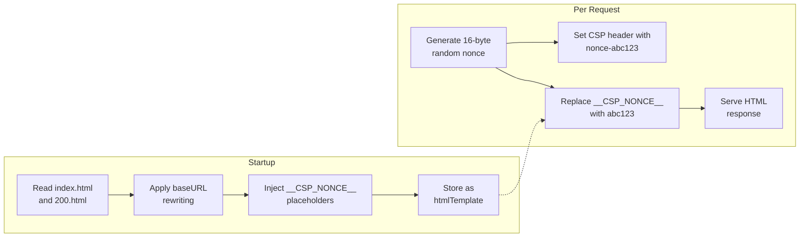

# CSP Nonce-Based Script Policy Fix

**Status:** ✅ Complete  
**Created:** 2026-03-10T04:45Z  
**Branch:** `fix/csp-nonce-inline-scripts`

## Problem

The security hardening commit `df9b6e84` added `Content-Security-Policy: script-src 'self'` which blocks Nuxt's required inline `<script>` tags, rendering the app as a blank white page. The browser console shows:

```
Executing inline script violates the following Content Security Policy directive 'script-src 'self''.
TypeError: Cannot read properties of undefined (reading 'app')
```

Two inline scripts are blocked:

1. **Theme/splash script** — sets dark mode from localStorage, shows loading splash
2. **`window.__NUXT__` config script** — sets Nuxt runtime config needed to bootstrap the Vue app

## Solution: Per-Request CSP Nonces

Generate a cryptographically random nonce for each request and inject it into both the CSP header and the inline `<script>` tags. This allows only the server's own inline scripts to execute while maintaining a strict CSP.

### Architecture Overview



### Inline Scripts Requiring Nonces

| Script | Generated By | Content Stability |
|--------|-------------|-------------------|
| Theme/splash `<script type=text/javascript>` | `nuxt.config.ts` head.script | Static per build |
| `window.__NUXT__` config `<script>` | Nuxt build | Static per build |
| Entry module `<script type=module src=...>` | Nuxt build | External — covered by `'self'` |
| Nuxt data `<script type=application/json>` | Nuxt build | Not executable — CSP ignores |

Only the first two need nonces.

## Implementation Steps

### Step 1: Create `backend/csp.go` — nonce generation and template injection

Create a new file with:

- `generateCSPNonce() string` — generates 16 bytes via `crypto/rand`, returns base64url-encoded string
- `injectNoncePlaceholders(html []byte) []byte` — finds inline `<script>` tags and adds `nonce="__CSP_NONCE__"` attribute
- `applyNonce(template []byte, nonce string) []byte` — replaces `__CSP_NONCE__` with actual nonce value

**Placeholder injection logic:**
- Match `<script type="text/javascript">` → `<script type="text/javascript" nonce="__CSP_NONCE__">`
- Match `<script>window.__NUXT__` → `<script nonce="__CSP_NONCE__">window.__NUXT__`
- Do NOT touch `<script type="module" src=...>` (external, covered by `'self'`)
- Do NOT touch `<script type="application/json"...>` (not executable)

### Step 2: Create `backend/csp_test.go` — unit tests

Test cases:

- `TestGenerateCSPNonce_Length` — nonce is non-empty, base64url-encoded, reasonable length
- `TestGenerateCSPNonce_Unique` — two calls produce different nonces
- `TestInjectNoncePlaceholders` — correctly injects placeholders into sample Nuxt HTML
- `TestInjectNoncePlaceholders_NoDoubleInjection` — running twice doesn't double-inject
- `TestApplyNonce` — replaces all `__CSP_NONCE__` occurrences with the given nonce
- `TestApplyNonce_PreservesOtherContent` — non-placeholder content is unchanged

### Step 3: Extend `htmlCache` to always store templates — modify `backend/baseurl.go`

Currently `buildHTMLCache` returns `nil` when `BASE_URL == "/"`. Change to always build the cache so nonce injection always has a template to work with.

- Rename `htmlCache` to `htmlTemplates` for clarity
- Always read `index.html` and `200.html` at startup
- Apply `rewriteHTML` for base URL rewriting (existing behavior)
- Apply `injectNoncePlaceholders` after rewriting
- Store as templates in the struct

### Step 4: Modify `serveEmbeddedFile` — per-request nonce injection in `backend/main.go`

When serving `index.html` or `200.html` from the template cache:

1. Read `cspNonce` from echo context: `nonce, _ := c.Get("cspNonce").(string)`
2. Apply nonce: `html := applyNonce(template, nonce)`
3. Serve the result with `Cache-Control: no-cache` (already done)

### Step 5: Update security headers middleware — dynamic CSP in `backend/main.go`

In the security headers middleware:

1. Generate nonce: `nonce := generateCSPNonce()`
2. Store in context: `c.Set("cspNonce", nonce)`
3. Build CSP with nonce: `script-src 'self' 'nonce-` + nonce + `'`

The nonce is generated for ALL requests (API and HTML) because the middleware runs globally. For API responses the nonce is harmless — it just appears in the CSP header of a JSON response where no scripts execute.

**Before:**
```go
h.Set("Content-Security-Policy",
    "default-src 'self'; "+
    "script-src 'self'; "+
    ...)
```

**After:**
```go
nonce := generateCSPNonce()
c.Set("cspNonce", nonce)
h.Set("Content-Security-Policy",
    "default-src 'self'; "+
    "script-src 'self' 'nonce-"+nonce+"'; "+
    ...)
```

### Step 6: Update test utilities — `backend/internal/testutil/testutil.go`

Mirror the CSP change in the test security headers middleware. The test helper must also:

1. Generate a nonce per request
2. Store it in context
3. Include it in the CSP header

This ensures security regression tests verify the nonce-based policy.

### Step 7: Update security tests — `backend/routes/security_test.go`

- `TestSecurityHeaders_CSP`: Update to check for `script-src 'self' 'nonce-` prefix instead of exact `script-src 'self'`
- Add `TestSecurityHeaders_CSP_NonceChangesPerRequest`: Verify two requests produce different nonces in the CSP header
- Add `TestSecurityHeaders_CSP_NonceFormat`: Verify nonce matches base64url pattern

### Step 8: Update `backend/baseurl_test.go`

The `sampleHTML` constant needs updating to include the inline script patterns. Add tests:

- `TestInjectNoncePlaceholders_WithBaseURLRewrite`: Verify placeholders survive base URL rewriting
- Verify existing `rewriteHTML` tests still pass with nonce placeholders present

### Step 9: Update documentation

- `SECURITY.md` line 67: Update CSP description to mention nonce-based `script-src`
- `site/content/docs/security/index.md` line 71: Same update

### Step 10: Run `make ci`, build with `docker compose up --build`, and verify in browser

- `make ci` must pass — lint, tests, security scans
- Browser must load the app without CSP errors
- Browser console must show no `script-src` violations
- CSP header must contain `script-src 'self' 'nonce-...'`
- Two page loads must show different nonces in the CSP header

## Files Changed

| File | Change Type | Description |
|------|-------------|-------------|
| `backend/csp.go` | New | Nonce generation, placeholder injection, nonce application |
| `backend/csp_test.go` | New | Unit tests for CSP nonce functions |
| `backend/baseurl.go` | Modify | Always build template cache, inject nonce placeholders |
| `backend/baseurl_test.go` | Modify | Update sample HTML, add nonce placeholder tests |
| `backend/main.go` | Modify | Dynamic CSP header with nonce, nonce injection in SPA handler |
| `backend/internal/testutil/testutil.go` | Modify | Mirror nonce CSP in test middleware |
| `backend/routes/security_test.go` | Modify | Update CSP assertions for nonce-based policy |
| `SECURITY.md` | Modify | Document nonce-based script-src |
| `site/content/docs/security/index.md` | Modify | Document nonce-based script-src |

## Risk Assessment

- **Performance:** Sub-millisecond overhead per request — `crypto/rand` for 16 bytes + `bytes.ReplaceAll` on ~30KB HTML
- **Breaking change:** None — the CSP becomes more permissive for legitimate inline scripts while remaining strict
- **PWA service worker:** `worker-src` not affected — service workers are loaded from external files
- **HTML caching:** Templates are cached at startup; per-request nonce injection uses `bytes.ReplaceAll` on the cached template — no file I/O per request
