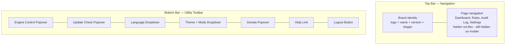

# Universal Bottom Toolbar

**Status:** 🟡 Implementation complete, pending visual verification
**Branch:** `feature/bottom-toolbar`
**Issue:** Mobile navbar icon overflow — icons overlap brand on narrow viewports (iPhone 17, ~393px)

## Problem

The top navbar renders **7 icon buttons** (engine control, update, language, theme, donate, help, logout) alongside the brand area in a single flex row. On mobile viewports, these icons physically cannot fit:

| Element | Width |
|---------|-------|
| `px-4` padding (both sides) | 32px |
| Brand (icon + text + version) | ~160px |
| 7 icon buttons × 40px | 280px |
| `gap-1` (6 gaps × 4px) | 24px |
| **Total needed** | **~496px** |
| **iPhone 17 available** | **~393px** |
| **Overflow** | **~103px** |

The nav text links are already `hidden sm:flex`, but the icons are always visible with no responsive breakpoint.

## Solution

Relocate all 7 icon actions from the top navbar into a **universal bottom toolbar** visible on all viewports (desktop and mobile). The top navbar becomes brand + page navigation only.

### Layout

```
Desktop:
┌──────────────────────────────────────────────────────────────────┐
│ 🟣 Capacitarr                  Dashboard  Rules  Audit  Settings │
│    v1.5.2 · I aim to misbehave                                  │
└──────────────────────────────────────────────────────────────────┘
│                                                                  │
│                        Page Content                              │
│                                                                  │
┌──────────────────────────────────────────────────────────────────┐
│      [⚙️]    [⬆️]    [🌐]    [🎨]    [🐱]    [❓]    [🚪]      │
└──────────────────────────────────────────────────────────────────┘

Mobile:
┌──────────────────────────────────────┐
│ 🟣 Capacitarr  v1.5.2               │
│    ⚔ I aim to misbehave             │
└──────────────────────────────────────┘
│                                      │
│         Page Content                 │
│                                      │
┌──────────────────────────────────────┐
│ [⚙️] [⬆️] [🌐] [🎨] [🐱] [❓] [🚪]│
└──────────────────────────────────────┘
```

### Architecture



## Implementation Steps

### Step 1: Create branch

Create `feature/bottom-toolbar` from `main`. Verify clean working tree with `git status`.

### Step 2: Add `viewport-fit=cover` to viewport meta

The app needs `viewport-fit=cover` to enable `env(safe-area-inset-bottom)` for iPhone safe area insets. Nuxt 3 auto-generates the viewport meta tag. Override it in `nuxt.config.ts` `app.head.meta` to include `viewport-fit=cover`:

**File:** `frontend/nuxt.config.ts`

Add to the `meta` array inside `app.head`:
```ts
{ name: 'viewport', content: 'width=device-width, initial-scale=1, viewport-fit=cover' },
```

### Step 3: Create `BottomToolbar.vue`

**File:** `frontend/app/components/BottomToolbar.vue`

Extract the entire right-side icon section (lines 62-376 of `Navbar.vue`) into a new component with these changes:

1. **Container:** `<footer>` with `data-slot="bottom-toolbar"`, classes: `fixed bottom-0 left-0 right-0 z-40`
2. **Inner layout:** `max-w-7xl mx-auto px-4 sm:px-6 lg:px-8` matching the top navbar's horizontal constraints
3. **Icon row:** `flex items-center justify-evenly h-12` — shorter than the top bar (48px vs 64px)
4. **Safe area padding:** `pb-[env(safe-area-inset-bottom)]` on the container
5. **Popover direction:** Change all `<UiPopoverContent>` and `<UiDropdownMenuContent>` to include `side="top"`:
   - `EngineControlPopover` — this is a separate component; it needs a new `side` prop (see Step 4)
   - Update popover — `<UiPopoverContent align="end" side="top">`
   - Language dropdown — `<UiDropdownMenuContent align="end" side="top">`
   - Theme dropdown — `<UiDropdownMenuContent align="end" side="top">`
   - Donate popover — `<UiPopoverContent align="end" side="top">`
6. **Imports:** Move all icon imports (`ArrowUpCircleIcon`, `GlobeIcon`, `PaletteIcon`, etc.) from `Navbar.vue` to this component
7. **Composables:** Move `useAppColorMode`, `useTheme`, `useVersion`, `useI18n` calls to this component
8. **Logout handler** and `useAuthCookie` / `useRouter` move here too

### Step 4: Add `side` prop to `EngineControlPopover.vue`

**File:** `frontend/app/components/EngineControlPopover.vue`

The `EngineControlPopover` is a self-contained component that currently hardcodes `<UiPopoverContent align="end">`. Add an optional `popoverSide` prop:

```ts
const props = withDefaults(defineProps<{
  popoverSide?: 'top' | 'bottom'
}>(), {
  popoverSide: 'bottom',
});
```

Then use it: `<UiPopoverContent align="end" :side="popoverSide">`.

In `BottomToolbar.vue`, render it as `<EngineControlPopover popover-side="top" />`.

### Step 5: Strip icons from `Navbar.vue`

**File:** `frontend/app/components/Navbar.vue`

1. **Remove** the entire right-side `<div class="flex items-center gap-1">` block (lines 62-376)
2. **Remove** all icon imports that were only used in the right side (`ArrowUpCircleIcon`, `GlobeIcon`, `PaletteIcon`, `CheckIcon`, `CheckCircleIcon`, `RefreshCwIcon`, `LoaderCircleIcon`, `CatIcon`, `DogIcon`, `HeartIcon`, `PawPrintIcon`, `ExternalLinkIcon`, `MoonIcon`, `SunIcon`, `MonitorIcon`, `LogOutIcon`, `CircleHelpIcon`). Keep `DatabaseIcon` for the brand.
3. **Remove** composable calls that are no longer needed: `useAppColorMode`, `useTheme`, `useVersion`, logout handler, `useAuthCookie`, `useRouter`
4. **Keep** brand section (lines 6-41) and nav links section (lines 43-59)
5. **Change layout** from `justify-between` to `justify-between` (still) — with nav links on the right.
   - Move the `<nav>` element out of the left-side brand `<div>` and into a standalone right-aligned position, OR
   - Keep current structure but remove the empty right-side div. The `justify-between` with brand-left and nav-right creates natural spacing.

Specifically, the flex structure becomes:
```html
<div class="flex items-center justify-between h-16">
  <!-- Brand (left) -->
  <div class="flex items-center">
    <NuxtLink to="/" ...>...</NuxtLink>
  </div>
  <!-- Nav Links (right, hidden on mobile) -->
  <nav class="hidden sm:flex items-center gap-1">
    ...nav links...
  </nav>
</div>
```

### Step 6: Update `app.vue` shell

**File:** `frontend/app/app.vue`

1. **Add** `<BottomToolbar v-if="isAuthenticated" />` below the `<Navbar>` (or at the end of the template, since it's `position: fixed`)
2. **Increase** main content bottom padding to clear the bottom bar: change `pb-6` to `pb-20` (80px — enough for 48px bar + 32px safe area on iOS)

```html
<main data-slot="page-content" class="max-w-7xl mx-auto px-4 sm:px-6 lg:px-8 pt-5 pb-20">
```

### Step 7: Add glassmorphism styles for bottom toolbar

**File:** `frontend/app/assets/css/main.css`

Add styles mirroring the navbar glassmorphism but applied to `[data-slot='bottom-toolbar']`. Keep it visually lighter than the top bar:

```css
/* Glassmorphism Bottom Toolbar */
[data-slot='bottom-toolbar'] {
  background: oklch(from var(--color-background) l c h / 0.95);
  backdrop-filter: blur(20px) saturate(1.4);
  -webkit-backdrop-filter: blur(20px) saturate(1.4);
  border-top: 1px solid oklch(from var(--color-border) l c h / 0.5);
  box-shadow:
    0 -1px 3px oklch(0 0 0 / 0.04),
    0 -4px 12px oklch(0 0 0 / 0.02);
}

/* Gradient shimmer line above bottom toolbar */
[data-slot='bottom-toolbar']::before {
  content: '';
  position: absolute;
  top: -1px;
  left: 0;
  right: 0;
  height: 1px;
  background: linear-gradient(
    90deg,
    transparent 0%,
    oklch(from var(--color-primary) l c h / 0.3) 30%,
    oklch(from var(--color-primary) l c h / 0.5) 50%,
    oklch(from var(--color-primary) l c h / 0.3) 70%,
    transparent 100%
  );
}

.dark [data-slot='bottom-toolbar'] {
  background: oklch(from var(--color-background) l c h / 0.92);
  backdrop-filter: blur(24px) saturate(1.5);
  -webkit-backdrop-filter: blur(24px) saturate(1.5);
  border-top-color: oklch(from var(--color-border) l c h / 0.4);
  box-shadow:
    0 -1px 3px oklch(0 0 0 / 0.2),
    0 -4px 16px oklch(0 0 0 / 0.15);
}

.dark [data-slot='bottom-toolbar']::before {
  background: linear-gradient(
    90deg,
    transparent 0%,
    oklch(from var(--color-primary) l c h / 0.4) 30%,
    oklch(from var(--color-primary) l c h / 0.6) 50%,
    oklch(from var(--color-primary) l c h / 0.4) 70%,
    transparent 100%
  );
}
```

### Step 8: Adjust toast positioning

**File:** `frontend/app/components/ToastContainer.vue`

The toast container currently uses `fixed bottom-4 right-4`. It needs to clear the bottom toolbar:

Change from:
```html
<div class="fixed bottom-4 right-4 z-[100] ...">
```

To:
```html
<div class="fixed bottom-16 right-4 z-[100] ...">
```

The `bottom-16` (64px) provides clearance above the 48px toolbar. On iOS with safe area, the toolbar is taller, but the toast will still be above it.

### Step 9: Handle mobile nav links (bonus improvement)

**File:** `frontend/app/components/Navbar.vue`

Currently, the page nav links are `hidden sm:flex` with **no mobile fallback**. With the top bar now having space, consider showing them on mobile too. Two sub-options:

**A. Show text links on mobile (if they fit):**
Change `hidden sm:flex` to `flex` and verify on iPhone viewport that 4 short text links fit alongside the brand. They likely don't — "Dashboard", "Scoring Engine", "Audit Log", "Settings" is ~350px of text.

**B. Use shorter labels on mobile:**
Add responsive label switching — full text on desktop, abbreviated on mobile:
- "Dashboard" → icon-only or "Home"
- "Scoring Engine" → "Rules"
- "Audit Log" → "Audit"
- "Settings" → gear icon

**C. Defer to a future phase:**
Leave the mobile nav links hidden for now. The current rule-viewing screenshot shows the user navigated there somehow (possibly direct URL or bookmarks). This is a pre-existing issue, not a regression from this change.

**Decision:** Option C (defer). The bottom toolbar solves the reported icon overlap. Mobile nav discovery is a separate concern for a future plan.

### Step 10: Run `make ci`

Run `make ci` from the `capacitarr/` directory to verify lint, tests, and security checks all pass.

### Step 11: Visual verification with Puppeteer

Use the browser tool to:
1. Launch Chromium to `http://localhost:2187`
2. Take screenshots at desktop width (1280px) and mobile width (393px)
3. Verify:
   - Top bar shows brand + nav links on desktop, brand-only on mobile
   - Bottom toolbar shows all 7 icon actions
   - Popovers open upward from the bottom bar
   - Toasts render above the bottom bar
   - No overlap at any viewport width

### Step 12: Commit and finalize

Commit all changes with:
```
feat(ui): move utility icons to universal bottom toolbar

Relocate all 7 icon action buttons (engine control, update check,
language selector, theme picker, donate, help, logout) from the
top navbar into a fixed bottom toolbar visible on all viewports.

The top navbar now contains only the brand and page navigation
links, eliminating the icon overflow that occurred on narrow
mobile viewports (iPhone 17, ~393px width).

The bottom toolbar uses the same glassmorphism design system as
the top navbar, with popovers opening upward. Safe area insets
are respected for iOS devices with home indicators.

Closes #TBD
```

## Files Changed

| File | Change |
|------|--------|
| `frontend/app/components/BottomToolbar.vue` | **New** — bottom toolbar with all 7 icon actions |
| `frontend/app/components/Navbar.vue` | Remove icon buttons, remove unused imports/composables, restructure to brand + nav |
| `frontend/app/components/EngineControlPopover.vue` | Add `popoverSide` prop for directional control |
| `frontend/app/components/ToastContainer.vue` | Adjust bottom offset to clear toolbar |
| `frontend/app/app.vue` | Add `BottomToolbar`, increase main `pb` |
| `frontend/app/assets/css/main.css` | Add `[data-slot='bottom-toolbar']` glassmorphism styles |
| `frontend/nuxt.config.ts` | Add `viewport-fit=cover` to viewport meta |

## Risks and Mitigations

| Risk | Mitigation |
|------|------------|
| iOS safe area not respected | `viewport-fit=cover` + `env(safe-area-inset-bottom)` padding |
| Popovers open downward off-screen | All popover/dropdown content uses `side="top"` |
| Toast hidden behind toolbar | `bottom-16` offset on toast container |
| Desktop users confused by bottom icons | Toolbar is visually consistent with top bar; icons are the same |
| Navbar feels empty without icons | Nav links right-aligned create visual balance with brand |
