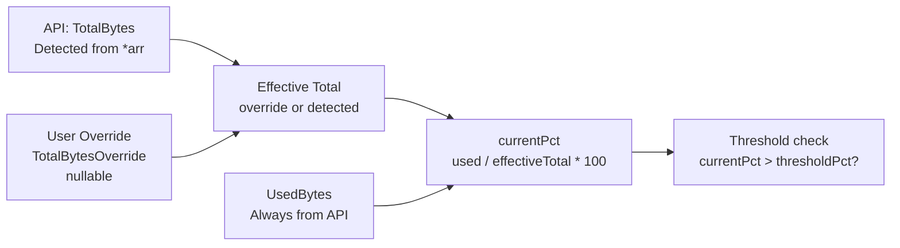

# User-Defined Disk Size Override

**Date:** 2026-03-15
**Status:** ✅ Complete
**Scope:** `capacitarr` (single repo)
**Branch:** `feature/disk-size-override`
**Depends on:** `fix/windows-path-normalization` (must ship first) — ✅ Shipped in v1.5.3 (commit 75839c2b)

## Motivation

When *arr services report disk space via their API, the reported total capacity may be inaccurate for certain drive types:

- **Google Drive** mapped as a Windows drive letter may report incorrect quota
- **Network shares** may report the total NAS capacity rather than the share quota
- **Cloud storage** with "unlimited" plans may report extremely large values (e.g., 15 PB)
- **Users wanting artificial limits** — e.g., "I have 4 TB but only want 1 TB for media"

Currently, Capacitarr has no way for users to override the API-reported total. If the reported value is wrong, the threshold calculation is wrong, and the engine either never triggers or triggers too aggressively.

## Design

### Data Model

Add a nullable `TotalBytesOverride` column to the `disk_groups` table. When set, it replaces `TotalBytes` in the percentage calculation. `UsedBytes` always comes from the API (actual usage is real regardless of quota reporting).



### Field Behavior

| `TotalBytesOverride` | Behavior |
|---|---|
| `null` / `0` | Use API-reported `TotalBytes` (current behavior, no change) |
| Non-zero positive | Use override value for all percentage calculations |

Setting the override to `0` or `null` clears it (reverts to detected size).

### Frontend UX

In the disk group threshold editor ([`RuleDiskThresholds.vue`](capacitarr/frontend/app/components/rules/RuleDiskThresholds.vue)), add an optional size input:

- Label: "Custom disk size" or "Override detected size"
- Placeholder: "Leave blank to use detected: {formattedTotalBytes}"
- Input type: number with size-unit selector (GB/TB) or freeform text with `parseSize()` utility
- A "📌 Custom" badge on the dashboard disk group card when override is active
- Tooltip on badge: "Detected: {detected}, Custom: {override}"

### API Changes

Extend the existing PUT `/api/v1/disk-groups/:id` endpoint to accept `totalBytesOverride`:

```json
{
  "thresholdPct": 85,
  "targetPct": 75,
  "totalBytesOverride": 1099511627776
}
```

Omitting `totalBytesOverride` or sending `null`/`0` clears the override.

## Implementation Steps

### Step 1: Database Migration

**File:** `backend/internal/db/migrations/00008_add_disk_size_override.sql`

```sql
-- +goose Up
ALTER TABLE disk_groups ADD COLUMN total_bytes_override INTEGER DEFAULT NULL;

-- +goose Down
ALTER TABLE disk_groups DROP COLUMN total_bytes_override;
```

### Step 2: Update DiskGroup Model

**File:** `backend/internal/db/models.go`

Add to the `DiskGroup` struct:

```go
TotalBytesOverride *int64 `json:"totalBytesOverride,omitempty"` // User-defined total; nil = use detected
```

### Step 3: Add EffectiveTotal Helper

**File:** `backend/internal/db/models.go`

Add a method to `DiskGroup`:

```go
// EffectiveTotalBytes returns the user override if set, otherwise the API-detected total.
func (g DiskGroup) EffectiveTotalBytes() int64 {
    if g.TotalBytesOverride != nil && *g.TotalBytesOverride > 0 {
        return *g.TotalBytesOverride
    }
    return g.TotalBytes
}
```

### Step 4: Update Poller Threshold Calculation

**File:** `backend/internal/poller/evaluate.go`

Replace **all three** references to `group.TotalBytes` with `group.EffectiveTotalBytes()`:

1. **Line 29** — zero-check guard: `group.TotalBytes == 0` → `effectiveTotal == 0`
2. **Line 32** — currentPct calculation: `float64(group.TotalBytes)` → `float64(effectiveTotal)`
3. **Line 95** — targetBytesToFree calculation: `float64(group.TotalBytes)` → `float64(effectiveTotal)`

```go
effectiveTotal := group.EffectiveTotalBytes()
if effectiveTotal == 0 {
    return 0
}
currentPct := float64(group.UsedBytes) / float64(effectiveTotal) * 100
```

And later:

```go
targetBytesToFree := int64((currentPct - group.TargetPct) / 100.0 * float64(effectiveTotal))
```

### Step 5: Update Settings Service

**File:** `backend/internal/services/settings.go`

Extend `UpdateThresholds()` to accept and persist the override:

```go
func (s *SettingsService) UpdateThresholds(groupID uint, threshold, target float64, totalOverride *int64) (*db.DiskGroup, error) {
    // ... existing validation ...
    updates := map[string]any{
        "threshold_pct":        threshold,
        "target_pct":           target,
        "total_bytes_override": totalOverride, // nil clears the override
    }
    // ... existing update logic ...
}
```

### Step 6: Update Route Handler

**File:** `backend/routes/disk_groups.go`

Extend the PUT request struct:

```go
var req struct {
    ThresholdPct       float64 `json:"thresholdPct"`
    TargetPct          float64 `json:"targetPct"`
    TotalBytesOverride *int64  `json:"totalBytesOverride"`
}
```

Add validation: if override is negative, return 400.

### Step 7: Update Frontend TypeScript Type

**File:** `frontend/app/types/api.ts`

Add to `DiskGroup` interface:

```typescript
totalBytesOverride?: number | null;
```

### Step 8: Update Frontend Threshold Editor

**File:** `frontend/app/components/rules/RuleDiskThresholds.vue`

Add an optional input field for the disk size override:
- Rendered below the threshold sliders
- Shows detected size as placeholder
- Accepts numeric input in bytes (with a helper to display/parse GB/TB)
- Sends the override with the existing threshold save request

### Step 9: Update Dashboard Disk Group Card

**File:** `frontend/app/components/DiskGroupSection.vue`

When `totalBytesOverride` is set:
- Use override value for the capacity bar total
- Show a "📌 Custom size" indicator
- Show "Detected: X TB" in a subtitle or tooltip

### Step 10: Update Backup/Restore

**File:** `backend/internal/services/backup.go`

**⚠ Plan correction:** The backup system uses a separate `DiskGroupExport` struct, NOT the `DiskGroup` model directly. The new field will NOT be included automatically. We must:

1. Add `TotalBytesOverride *int64 `json:"totalBytesOverride,omitempty"`` to the `DiskGroupExport` struct
2. Update the export mapping in `Export()` (line ~237) to populate the new field
3. Update `importDiskGroups()` to restore the override on both create and update paths
4. Update the frontend `DiskGroupExport` type in `frontend/app/types/api.ts`

Verify round-trip in tests.

### Step 11: Write Backend Tests

**Files:**
- `backend/internal/poller/evaluate_test.go` — Test `evaluateAndCleanDisk` with/without override
- `backend/internal/services/settings_test.go` — Test `UpdateThresholds` with override values
- `backend/routes/disk_groups_test.go` — Test PUT endpoint with override field
- `backend/internal/db/models_test.go` or inline — Test `EffectiveTotalBytes()` method

Test cases:
- Override `nil` → use detected total
- Override `0` → use detected total (treated as nil)
- Override positive → use override value
- Override negative → rejected by API (400)
- Override set then cleared (set to null) → reverts to detected

### Step 12: Run `make ci`

Verify all lint, tests, and security checks pass.

## Files Modified

| File | Change |
|------|--------|
| `backend/internal/db/migrations/00008_add_disk_size_override.sql` | New migration |
| `backend/internal/db/models.go` | Add `TotalBytesOverride` field and `EffectiveTotalBytes()` method |
| `backend/internal/poller/evaluate.go` | Use `EffectiveTotalBytes()` instead of `TotalBytes` |
| `backend/internal/services/settings.go` | Accept override in `UpdateThresholds()` |
| `backend/routes/disk_groups.go` | Accept override in PUT request, validate |
| `frontend/app/types/api.ts` | Add `totalBytesOverride` to `DiskGroup` |
| `frontend/app/components/rules/RuleDiskThresholds.vue` | Add override input |
| `frontend/app/components/DiskGroupSection.vue` | Show override indicator |
| `backend/internal/services/backup.go` | Add override to `DiskGroupExport`, update export/import |
| `frontend/app/types/api.ts` | Add `totalBytesOverride` to `DiskGroupExport` |
| `backend/internal/poller/evaluate_test.go` | New test cases |
| `backend/internal/services/settings_test.go` | New test cases |
| `backend/routes/disk_groups_test.go` | New test cases (may need to create this file) |

## Edge Cases

| Scenario | Behavior |
|---|---|
| Override < UsedBytes | High percentage (>100%) — threshold always breached, aggressive cleanup |
| Override = 0 | Treated as "no override" — use detected value |
| Override negative | Rejected by API with 400 Bad Request |
| API reports TotalBytes = 0 but override is set | Use override — allows operation on drives that report no capacity |
| Override removed mid-cycle | Next poll picks up detected total |
