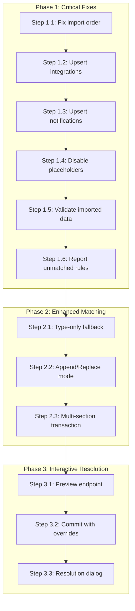

# Backup/Restore Robustness Overhaul

**Status:** ✅ Complete
**Created:** 2026-03-16T13:19Z
**Scope:** Backend (`internal/services/backup.go`, `routes/backup.go`), Frontend (`SettingsBackupRestore.vue`)

## Background

The backup/restore system has several bugs and gaps that lead to data loss and user frustration. A user reported exporting only custom rules (scoped to multiple integrations), then importing them — all rules lost their integration scoping and became unmodifiable. Root cause analysis revealed multiple compounding issues beyond just the rule matching.

## Audit Summary

| Area | Status | Key Issues |
|------|--------|------------|
| **Export** | ✅ Solid | Clean versioned format, sensitive fields excluded |
| **Import: Preferences** | ✅ Solid | Singleton upsert, always correct |
| **Import: Disk Groups** | ✅ Solid | Upsert by mount path, idempotent |
| **Import: Rules** | 🔴 Broken | Wrong processing order, no dedup, silent scope loss, no validation |
| **Import: Integrations** | 🟡 Fragile | Always duplicates, placeholders left enabled, no validation |
| **Import: Notifications** | 🟡 Fragile | Always duplicates, placeholders left enabled |
| **Multi-section import** | 🟡 Fragile | No wrapping transaction, partial state on failure |
| **Frontend UX** | 🟡 Fragile | No append/replace choice, no unmatched reporting, no interactive resolution |

---

## Phase 1: Critical Backend Fixes

These are small, targeted fixes to the existing `importRules()`, `importIntegrations()`, and `importNotificationChannels()` methods in `internal/services/backup.go`.

### Step 1.1: Fix Import Order

**File:** `internal/services/backup.go` — `Import()` method (line ~288)

Move `importIntegrations()` call **before** `importRules()` so that auto-match can find freshly-imported integrations.

Current order:
1. Preferences
2. Rules ← tries to match integrations that don't exist yet
3. Integrations
4. Disk Groups
5. Notification Channels

New order:
1. Preferences
2. **Integrations** ← create first so rules can match
3. **Rules** ← auto-match now finds imported integrations
4. Disk Groups
5. Notification Channels

**Tests:**
- Add `TestBackupService_Import_RulesResolveToImportedIntegrations` — import both rules and integrations in one shot, verify rules get linked to the newly-created integrations.

### Step 1.2: Upsert Integrations by Type+Name

**File:** `internal/services/backup.go` — `importIntegrations()` method (line ~474)

Change from blind `Create()` to upsert: look up existing integration by `type + name`. If found, update `URL` and `Enabled` but preserve `APIKey` (don't overwrite real keys with placeholders). If not found, create with placeholder.

```
For each IntegrationExport:
  1. SELECT WHERE type = ? AND name = ?
  2. If found → UPDATE url, enabled (skip APIKey)
  3. If not found → CREATE with placeholder APIKey
```

**Tests:**
- Add `TestBackupService_Import_IntegrationUpsert` — seed existing integration, import with same type+name, verify no duplicate and URL updated.
- Add `TestBackupService_Import_IntegrationUpsert_PreservesAPIKey` — verify existing API key not overwritten with placeholder.

### Step 1.3: Upsert Notification Channels by Type+Name

**File:** `internal/services/backup.go` — `importNotificationChannels()` method (line ~508)

Same upsert pattern as integrations: look up by `type + name`. If found, update subscription flags but preserve `WebhookURL`. If not found, create with placeholder.

**Tests:**
- Add `TestBackupService_Import_NotificationChannelUpsert` — verify no duplicates on re-import and existing webhook URL preserved.

### Step 1.4: Disable Placeholder Resources on Import

**File:** `internal/services/backup.go` — `importIntegrations()` and `importNotificationChannels()`

When creating new integrations with `"PLACEHOLDER_REPLACE_ME"` API keys, set `Enabled: false` regardless of the export value. Same for notification channels with placeholder webhook URLs. This prevents the poll cycle from hitting fake endpoints.

Add a comment field or log message noting that the user needs to configure credentials before enabling.

**Tests:**
- Add `TestBackupService_Import_NewIntegrationDisabledWithPlaceholder` — verify imported integration with placeholder key is created as disabled.
- Add `TestBackupService_Import_ExistingIntegrationPreservesEnabledState` — verify upsert doesn't disable an existing integration that has real credentials.

### Step 1.5: Validate Imported Data

**File:** `internal/services/backup.go` — `importRules()`, `importIntegrations()`, `importNotificationChannels()`

Apply the same validation that normal CRUD uses:

- **Rules:** Validate `Field`, `Operator`, `Value` are non-empty; `Effect` against `ValidEffects`.
- **Integrations:** Validate `Type` against `ValidIntegrationTypes`; `Name` and `URL` non-empty.
- **Notifications:** Validate `Type` against `ValidNotificationChannelTypes`; `Name` non-empty.

Return a clear error identifying the invalid item rather than inserting garbage.

**Tests:**
- Add `TestBackupService_Import_RejectsInvalidRuleEffect`
- Add `TestBackupService_Import_RejectsInvalidIntegrationType`
- Add `TestBackupService_Import_RejectsInvalidNotificationType`

### Step 1.6: Report Unmatched Rules in ImportResult

**File:** `internal/services/backup.go`

Add `RulesUnmatched int` field to `ImportResult`. In `importRules()`, count how many rules had `IntegrationName`/`IntegrationType` set but failed to match, and return that count.

**File:** `routes/backup.go`

No changes needed — the route already returns the full `ImportResult`.

**File:** Frontend `SettingsBackupRestore.vue`

Display an amber warning in the import result when `rulesUnmatched > 0`: "⚠ N rules could not be matched to an integration and were imported as global rules."

**Tests:**
- Update `TestBackupService_Import_RulesWithIntegrationResolution` to verify `RulesUnmatched` count when match fails.

---

## Phase 2: Enhanced Matching and Import Modes

### Step 2.1: Type-Only Fallback Matching for Rules

**File:** `internal/services/backup.go` — `importRules()` method

When exact `type + name` match fails, fall back to matching by `type` alone **if exactly one integration of that type exists**. This covers the common case where users rename their integrations between export and import.

```
Match strategy:
  1. Exact match: type + name → use it
  2. Type-only: type alone → use it IF exactly 1 result
  3. No match: import as global (nil)
```

Log a warning when type-only fallback is used so the user can verify.

Add a new field `RulesTypeOnlyMatched int` to `ImportResult` to report how many rules used the fallback.

**Tests:**
- Add `TestBackupService_Import_RulesTypeOnlyFallback` — one sonarr integration exists with different name, rule matched by type.
- Add `TestBackupService_Import_RulesTypeOnlyFallback_AmbiguousSkips` — two sonarr integrations exist, type-only match skipped, rule imported as global.

### Step 2.2: Add Append/Replace Import Mode

**File:** `internal/services/backup.go`

Add `Mode string` field to `ImportSections` (values: `"append"` default, `"replace"`).

In `replace` mode, before importing each section:
- **Rules:** Delete all existing `CustomRule` rows
- **Integrations:** Delete all existing `IntegrationConfig` rows (cascade to rules that reference them)
- **Notifications:** Delete all existing `NotificationConfig` rows
- **Disk Groups:** Already upserts, no change needed
- **Preferences:** Already upserts, no change needed

**File:** Frontend `SettingsBackupRestore.vue`

Add a radio group or toggle between "Merge with existing" (append) and "Replace existing" (replace). Default to append. Show a confirmation dialog for replace mode warning about data loss.

**Tests:**
- Add `TestBackupService_Import_ReplaceMode_Rules` — seed existing rules, import in replace mode, verify old rules deleted.
- Add `TestBackupService_Import_ReplaceMode_Integrations` — same pattern for integrations.
- Add `TestBackupService_Import_AppendMode_NoDelete` — verify append mode preserves existing data.

### Step 2.3: Wrap Multi-Section Import in Transaction

**File:** `internal/services/backup.go` — `Import()` method

Begin a transaction before processing any sections. If any section fails, rollback everything. This prevents partial import state.

The individual import methods will need to accept a `*gorm.DB` (the transaction) instead of using `s.db` directly.

**Tests:**
- Add `TestBackupService_Import_RollbackOnPartialFailure` — import with one invalid section, verify no sections were persisted.

---

## Phase 3: Interactive Import Resolution

This phase adds a preview/commit two-step flow that lets users manually resolve unmatched rules before committing.

### Step 3.1: Add Import Preview Endpoint

**File:** `internal/services/backup.go`

Add new method `PreviewImport(envelope, sections) -> ImportPreview`:

```go
type ImportPreview struct {
    Rules []RuleResolution `json:"rules"`
    // other sections can be added later
}

type RuleResolution struct {
    Index             int               `json:"index"`
    Rule              RuleExport        `json:"rule"`
    Resolution        string            `json:"resolution"` // "matched", "type_fallback", "unmatched"
    MatchedIntID      *uint             `json:"matchedIntegrationId"`
    MatchedIntName    string            `json:"matchedIntegrationName,omitempty"`
    Candidates        []IntCandidate    `json:"candidates"`
}

type IntCandidate struct {
    ID   uint   `json:"id"`
    Name string `json:"name"`
    Type string `json:"type"`
}
```

The preview runs the same matching logic as `importRules()` but without committing. For each unmatched rule, it includes `candidates` — integrations of the same type.

**File:** `routes/backup.go`

Add `POST /settings/import/preview` endpoint that accepts the same `importSettingsRequest` body and returns the preview.

**Tests:**
- Add `TestBackupService_PreviewImport_MatchedAndUnmatched`
- Add `TestPreviewEndpoint_ReturnsResolutions`

### Step 3.2: Add Import Commit Endpoint with User Mappings

**File:** `internal/services/backup.go`

Add new method `CommitImport(envelope, sections, ruleOverrides) -> ImportResult`:

```go
type RuleOverride struct {
    Index         int   `json:"index"`         // position in rules array
    IntegrationID *uint `json:"integrationId"` // user-chosen integration (nil = global)
    Skip          bool  `json:"skip"`          // true = don't import this rule
}
```

The commit method uses user-provided overrides instead of auto-match for any rule that has an override entry.

**File:** `routes/backup.go`

Add `POST /settings/import/commit` endpoint.

**Tests:**
- Add `TestBackupService_CommitImport_WithOverrides` — verify user-chosen integration IDs are used.
- Add `TestBackupService_CommitImport_SkipRules` — verify skipped rules are not imported.

### Step 3.3: Frontend Resolution Dialog

**File:** New component `SettingsImportResolution.vue`

When the user clicks Import and the preview returns any `"unmatched"` rules:
1. Show a dialog/step with a table of unmatched rules
2. Each row shows the rule details and a dropdown of candidate integrations
3. Additional options per rule: "Import as global" and "Skip"
4. If exactly one candidate of the right type exists, pre-select it
5. User confirms, frontend sends commit request with overrides

If all rules are matched (no conflicts), skip the dialog and import directly.

**Tests:**
- Verify dialog appears when unmatched rules exist
- Verify dialog is skipped when all rules match
- Verify override payloads are correctly constructed

---

## Architecture Diagram



## Files Affected

| File | Phase | Changes |
|------|-------|---------|
| `backend/internal/services/backup.go` | 1, 2, 3 | Import order, upsert logic, validation, preview/commit methods |
| `backend/internal/services/backup_test.go` | 1, 2, 3 | New test cases for each step |
| `backend/routes/backup.go` | 2, 3 | New endpoints for preview and commit |
| `backend/routes/backup_test.go` | 2, 3 | Route-level tests for new endpoints |
| `frontend/app/components/settings/SettingsBackupRestore.vue` | 1, 2, 3 | Unmatched warning, mode toggle, resolution flow |
| `frontend/app/components/settings/SettingsImportResolution.vue` | 3 | New component for interactive resolution dialog |
| `frontend/app/types/api.ts` | 1, 2, 3 | Updated `ImportResult` type, new preview/resolution types |
| `frontend/app/i18n/locales/en.json` | 1, 2, 3 | New i18n keys for warnings and resolution UI |
