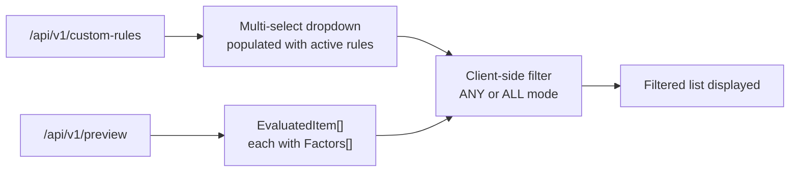
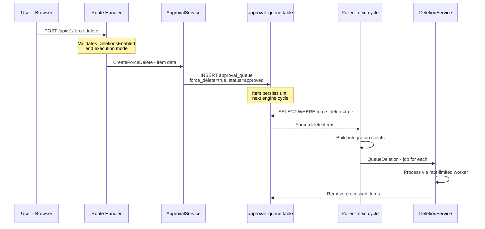

# Rule Filtering & Force Delete

**Status:** ✅ Complete
**Branch:** `feature/rule-filter-force-delete`
**Created:** 2026-03-16

## Overview

Two user-requested features for the Deletion Priority view:

1. **Filter by Applied Rules** — Allow users to filter the Deletion Priority list by which custom rules matched each item. Supports multi-rule selection with AND/OR logic.
2. **Manual Force Delete** — Allow users to mark items for deletion regardless of disk threshold settings. Items are processed on the next engine run.

---

## Feature 1: Filter Deletion Priority by Applied Rules

### Current State

The `/api/v1/preview` endpoint already returns full scoring data including matched rules. Each `EvaluatedItem` contains a `Factors []ScoreFactor` array where rule matches have `Type: "rule"` and a descriptive `Name` like `"Prefer remove: rating < 5.0"`. The frontend `RulePreviewTable.vue` already has a filter bar with search, media type, and protected/unprotected filters.

### Design



### Implementation Steps

#### Step 1: Add `RuleID` to `ScoreFactor` (Backend)

Add `RuleID *uint` field to `ScoreFactor` in `backend/internal/engine/score.go`. This enables precise filtering by rule database ID rather than string matching on the display name.

**Files:**
- `backend/internal/engine/score.go` — Add `RuleID *uint json:"ruleId,omitempty"` to `ScoreFactor` struct
- `backend/internal/engine/rules.go` — Set `RuleID: &rule.ID` in each `ScoreFactor` created by `applyRules()`
- `backend/internal/engine/rules_test.go` — Update tests to verify `RuleID` is populated on matched rules

#### Step 2: Update Frontend TypeScript Types

**Files:**
- `frontend/app/types/api.ts` — Add `ruleId?: number` to `ScoreFactor` interface

#### Step 3: Add Rule Filter UI to RulePreviewTable

Add a multi-select dropdown to the existing filter bar in `RulePreviewTable.vue`. The dropdown is populated by fetching rules from `/api/v1/custom-rules` (already used by `RuleCustomList.vue`). Include a toggle for ANY/ALL filter mode.

**Files:**
- `frontend/app/components/rules/RulePreviewTable.vue` — Add rule filter dropdown, filter mode toggle, and client-side filtering logic in `filteredGroupedPreview` computed property

#### Step 4: Add i18n Strings

**Files:**
- `frontend/app/locales/en.json` — Add strings for rule filter labels, ANY/ALL toggle, empty state

#### Step 5: Tests

**Files:**
- `backend/internal/engine/rules_test.go` — Verify `RuleID` field is set correctly
- `backend/internal/engine/score_test.go` — Verify `RuleID` propagates through `EvaluateMedia()`

---

## Feature 2: Manual Force Delete

### Current State

The engine only processes deletions when disk usage exceeds the configured threshold. When below threshold, `evaluateAndCleanDisk()` clears all pending/rejected approval queue items and returns early. There is no mechanism to force-delete specific items regardless of disk state.

The existing `ExecuteApproval()` workflow in `ApprovalService` already handles: approve → look up integration → build client → reconstruct MediaItem → queue for deletion. Force-delete can reuse this exact pattern.

### Design

Force-delete uses the existing `approval_queue` table with a new `force_delete` boolean column. Items marked for force-delete are processed by the poller on the next engine cycle, bypassing the threshold check. The `ClearQueue()` method is updated to preserve force-delete items.



### Implementation Steps

#### Step 6: Database Migration — Add `force_delete` Column

Add a new migration file to add the `force_delete` boolean column to the `approval_queue` table.

**Files:**
- `backend/internal/db/migrations/00010_add_force_delete.sql` — `ALTER TABLE approval_queue ADD COLUMN force_delete BOOLEAN NOT NULL DEFAULT FALSE`
- `backend/internal/db/models.go` — Add `ForceDelete bool` field to `ApprovalQueueItem` struct

#### Step 7: Update `ClearQueue()` to Preserve Force-Delete Items

Modify `ClearQueue()` in `ApprovalService` to exclude items with `force_delete = true` from clearing. This ensures force-delete items survive the below-threshold queue clearing.

**Files:**
- `backend/internal/services/approval.go` — Update `ClearQueue()` WHERE clause to add `AND force_delete = false`
- `backend/internal/services/approval_test.go` — Add test verifying force-delete items survive `ClearQueue()`

#### Step 8: Add `CreateForceDelete()` Service Method

Create a new method on `ApprovalService` that inserts an item into the approval queue with `force_delete = true` and `status = approved`. The item data comes from the preview response (mediaName, mediaType, integrationId, externalId, sizeBytes, scoreDetails, reason).

**Files:**
- `backend/internal/services/approval.go` — Add `CreateForceDelete()` method
- `backend/internal/services/approval_test.go` — Add tests for `CreateForceDelete()`

#### Step 9: Add Force-Delete Route

Add a new `POST /api/v1/force-delete` endpoint. The route handler validates that `DeletionsEnabled` is true and execution mode is not `dry-run`, then calls `ApprovalService.CreateForceDelete()`.

**Files:**
- `backend/routes/approval.go` — Add force-delete endpoint
- `backend/routes/approval_test.go` — Add tests for the new endpoint (happy path, deletions disabled, dry-run mode rejection)

#### Step 10: Process Force-Delete Items in Poller

Add a new method to the poller that runs after the threshold check. It queries `approval_queue WHERE force_delete = true AND status = approved`, builds integration clients, and queues each item for deletion via `DeletionService.QueueDeletion()`. After successful queueing, items are removed from the approval queue.

**Files:**
- `backend/internal/poller/evaluate.go` — Add `processForceDeletes()` method, call it from `evaluateAndCleanDisk()` after the threshold early-return
- `backend/internal/poller/evaluate_test.go` — Add tests for force-delete processing

#### Step 11: Add Force-Delete Selection Mode to Frontend

Add a multi-select "Force Delete" workflow to the Deletion Priority view. The interaction works in both view modes (grid/poster and list/table) and follows the same selection pattern used by Sonarr/Radarr mass editors.

##### UI Design: Selection Mode Entry

A "Select" toggle button (with a `Trash2` icon) is added to the existing filter bar, next to the Protected/Unprotected buttons. Clicking it enters selection mode; clicking again (or a "Cancel" button) exits it.

##### UI Design: Grid/Poster Mode

The existing `MediaPosterCard` component already has `selectable` and `selected` props with a checkbox overlay (top-left corner). In selection mode:

- Every `MediaPosterCard` renders with `selectable=true`
- Clicking the checkbox (top-left `CheckSquare`/`Square` icon) toggles selection
- Protected items have their checkbox disabled/hidden (force-deleting contradicts "always keep")
- Selected cards get the existing `ring-2 ring-primary bg-primary/5` highlight

```
┌──────────────────────────────────────────────────────────┐
│ [Grid/List] [Search...] [movie] [show] [Protected] [🗑 Select] │
├──────────────────────────────────────────────────────────┤
│  ┌─────┐  ┌─────┐  ┌─────┐  ┌─────┐  ┌─────┐          │
│  │☑ 0.82│  │☐ 0.71│  │☑ 0.65│  │☐ 0.58│  │☐ 0.45│          │
│  │     │  │     │  │     │  │     │  │     │          │
│  │Movie│  │Movie│  │Show │  │Movie│  │Movie│          │
│  └─────┘  └─────┘  └─────┘  └─────┘  └─────┘          │
│                                                          │
│  ┌────────────────────────────────────────────────┐      │
│  │  2 items selected - 4.2 GB  [Force Delete] [Cancel] │      │
│  └────────────────────────────────────────────────┘      │
└──────────────────────────────────────────────────────────┘
```

##### UI Design: List/Table Mode

In selection mode, a checkbox column appears as the first column (before `#`):

- Each row gets a `UiCheckbox` in the new first column
- A "select all visible" checkbox appears in the table header for bulk selection
- Protected rows have their checkbox disabled
- The same floating action bar appears at the bottom

```
┌──────────────────────────────────────────────────────────┐
│ [Grid/List] [Search...] [movie] [show] [Protected] [🗑 Select] │
├──┬────┬───────┬──────────────────┬───────┬───────────────┤
│☐ │ #  │ Score │ Title            │ Type  │  Size         │
├──┼────┼───────┼──────────────────┼───────┼───────────────┤
│☑ │ 1  │ 0.82  │ Serenity         │ movie │ 2.1 GB        │
│☐ │ 2  │ 0.71  │ Bad Movie        │ movie │ 1.8 GB        │
│☑ │ 3  │ 0.65  │ Firefly ▸ 2 s.   │ show  │ 3.2 GB        │
├──┴────┴───────┴──────────────────┴───────┴───────────────┤
│  2 items selected - 5.3 GB  [Force Delete] [Cancel]               │
└──────────────────────────────────────────────────────────┘
```

##### UI Design: Score Detail Modal (Single-Item Path)

When a user clicks any item to open the `ScoreDetailModal`, a "Force Delete" button appears in the modal footer (next to the existing size badge and action badge). This provides a single-item force-delete path without entering selection mode — useful for quick one-off deletions. The button is hidden for protected items.

##### Floating Action Bar

The floating action bar appears fixed at the bottom of the `UiCard` when ≥1 item is selected. It shows:
- Count of selected items and total size
- "Force Delete" button (destructive variant)
- "Cancel" button to exit selection mode and clear selections

**Files:**
- `frontend/app/components/rules/RulePreviewTable.vue` — Add selection mode state, checkbox column/overlay, floating action bar, force-delete API call
- `frontend/app/components/ScoreDetailModal.vue` — Add force-delete button in the modal footer (emit event to parent)
- `frontend/app/types/api.ts` — Add `forceDelete?: boolean` to `ApprovalQueueItem` interface

#### Step 12: Add Confirmation Dialog for Force Delete

Force-delete bypasses the normal safety threshold. Both the floating action bar "Force Delete" button and the ScoreDetailModal "Force Delete" button open a confirmation dialog before proceeding.

The dialog clearly communicates the consequences: "This will delete N item(s) on the next engine run, regardless of disk usage. This action cannot be undone." It lists the selected items by name and total size.

**Files:**
- `frontend/app/components/rules/RulePreviewTable.vue` — Add `UiDialog` confirmation with item list
- `frontend/app/locales/en.json` — Add i18n strings for force-delete confirmation, selection mode labels, floating bar text

#### Step 13: Add Audit Trail for Force Deletes

Ensure force-deleted items are logged distinctly in the audit log. The existing `DeletionService` worker already creates audit entries, but the reason should indicate it was a force-delete.

**Files:**
- `backend/internal/services/approval.go` — Set reason prefix like "Force delete: " in `CreateForceDelete()`

---

## Safety Considerations

1. **DeletionsEnabled guard** — Force-delete respects the global `DeletionsEnabled` preference. If disabled, the API returns 409 Conflict.
2. **Dry-run mode guard** — Force-delete is not available in dry-run mode. The API returns 409 Conflict with a message directing the user to switch to approval or auto mode.
3. **Confirmation dialog** — The frontend requires explicit confirmation before marking an item for force-delete.
4. **Audit trail** — Force-deletes are logged with a distinct reason prefix in the audit log for traceability.
5. **Queue clearing** — Force-delete items are excluded from the below-threshold queue clearing to ensure they persist until processed.

---

## Cross-Cutting

#### Step 14: Run `make ci`

Run the full CI pipeline locally to verify all changes pass lint, test, and security checks.

#### Step 15: i18n for All Locales

After English strings are finalized, add placeholder translations for all supported locales (or mark them for translation).
