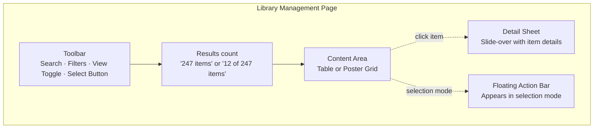
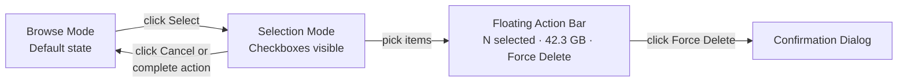
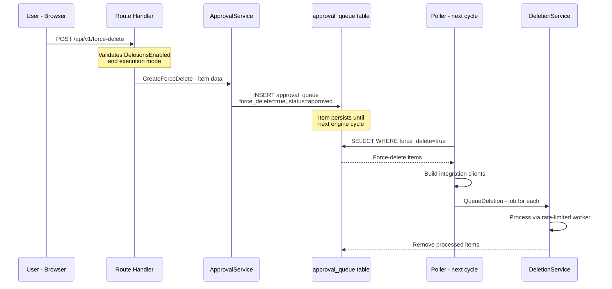

# Library Management Page

**Status:** 🔧 In Progress
**Branch:** `feature/library-management`
**Created:** 2026-03-17

## Overview

A dedicated Library Management page that shows the full media library across all integrations with flat (ungrouped) rows. Each item — movie, season, artist, book — is independently selectable for force-delete. This replaces the selection-mode approach that was originally planned for the Deletion Priority view.

## Outcome

- **Library Management page** at `/library` with full-library flat-row display, search, and filters
- **Force-delete UI**: selection mode with floating action bar and confirmation dialog, wired to `POST /api/v1/force-delete`
- **Force-delete backend**: API route, service methods (`CreateForceDelete`, `ListForceDeletes`, `RemoveForceDelete`), poller processing, and database migration (`force_delete` column on `approval_queue`) — ✅ already implemented in `feature/rule-filter-force-delete`
- **Nav link** added between "Scoring Engine" and "Audit Log"
- **i18n** for all locale files

## Motivation

The Deletion Priority view on the Scoring Engine page is a read-only scoring preview. Adding destructive actions (force-delete) there blurs the line between preview and action. A dedicated Library Management page provides:

- Clear separation: Scoring Engine = configure & preview, Library Management = take action
- Full library visibility: manage any item, not just engine-flagged ones
- Flat season rows: each season is independently selectable without grouping complexity
- Extensible: future actions (tag, protect, exclude) can live here

## Design

### Page Layout



New page at `/library` with a nav link. Contains:
1. Search bar + filters (by integration, media type, tags)
2. View mode toggle (table/poster)
3. Flat item list (no show→season grouping)
4. Selection mode with floating action bar
5. Force-delete confirmation dialog

### Data Source

Reuses the existing `/api/v1/preview` endpoint which fetches, enriches, and scores all media items. The Library Management page displays the same data but:
- **No grouping**: Each season is its own row/card (flat list)
- **Sorted by title** by default (not by score)
- **All items shown**: No deletion line or threshold context

### Toolbar

Mirrors the Deletion Priority toolbar from `RulePreviewTable.vue`:

- **ViewModeToggle** — list/grid toggle (reuse existing composable)
- **Search input** — same `UiInput` with `SearchIcon` prefix
- **Media type pills** — same rounded pill buttons (Movie, Season, Artist, Book)
- **Integration filter** — new dropdown or pills to filter by Sonarr/Radarr/Lidarr/Readarr
- **"Select" button** — enters selection mode (right-aligned, outline variant)

### Two Modes: Browse vs. Select



**Browse mode** (default):
- Clicking a row/card opens the **detail sheet** (slide-over or dialog with score breakdown, metadata, poster)
- No checkboxes visible; clean, read-only view
- Sort by: Title (default), Size, Score, Type, Integration

**Selection mode** (activated by "Select" button):
- A checkbox column appears on table view; checkbox overlay on poster cards
- Row clicks toggle selection (not detail sheet)
- Shift-click for range selection
- "Select All" / "Deselect All" in the toolbar
- A **floating action bar** appears at the bottom of the viewport (fixed position):

```
┌──────────────────────────────────────────────────────────────┐
│  ✓ 5 selected  ·  42.3 GB              [Cancel] [Force Delete]  │
└──────────────────────────────────────────────────────────────┘
```

`MediaPosterCard` already has `selectable` and `selected` props plus `CheckSquare`/`Square` icons — built for exactly this use case.

### Table Mode (Flat Rows)

```
☐  The Big Door Prize - Season 2    Season  Sonarr  19.7 GB  Score: 3.75
☐  The Big Door Prize - Season 1    Season  Sonarr  18.2 GB  Score: 3.71
☐  Deal or No Deal Island - S2      Season  Sonarr  34.9 GB  Score: 3.70
☐  Serenity                         Movie   Radarr   2.1 GB  Score: 0.82
```

Columns: Checkbox (selection mode only), Title, Type, Integration, Size, Score

### Poster Mode (Flat Cards)

Each item gets its own `MediaPosterCard` — no popover grouping. In selection mode, the existing `selectable`/`selected` props control the checkbox overlay. Same responsive grid breakpoints as the Deletion Priority:

```
grid-cols-2 sm:grid-cols-3 md:grid-cols-4 lg:grid-cols-5 xl:grid-cols-6
```

### Force-Delete Confirmation Dialog

Uses `UiAlertDialog` (destructive variant):

```
┌──────────────────────────────────────┐
│  ⚠ Force Delete 5 Items             │
│                                      │
│  These items will be queued for      │
│  deletion on the next engine cycle:  │
│                                      │
│  • The Big Door Prize – S2  19.7 GB  │
│  • The Big Door Prize – S1  18.2 GB  │
│  • Deal or No Deal – S2    34.9 GB   │
│  • Serenity                  2.1 GB  │
│  • Firefly – S1             12.3 GB  │
│                                      │
│  Total: 87.2 GB                      │
│                                      │
│          [Cancel]  [Force Delete]    │
└──────────────────────────────────────┘
```

### Protected Item Handling

Items with `isProtected: true` (matched by an `always_keep` rule):
- Show a shield icon + "Protected" badge in both table and poster view
- Checkbox is **disabled** in selection mode (greyed out, tooltip explains why)
- Cannot be added to force-delete selection

### Detail Sheet (Non-Selection Mode)

Clicking an item opens a sheet/dialog showing:
- Poster image, title, year, media type badge
- Score breakdown (reuse the score factor display from Deletion Priority detail)
- Integration name + link icon
- Size, last watched, watch count
- Individual "Force Delete" button (single-item convenience)

### Empty State

If the preview API returns no items (no integrations configured, or all integrations error):
- Centered empty state: icon + "No media found" + description pointing to Settings

### Season Granularity

Since the list is flat (no grouping), season-level selection is automatic:
- To delete a whole show: select all its seasons
- To delete one season: select just that season
- Each season has its own `externalId` and can be independently deleted

### Navigation Placement

Current nav links: `Dashboard | Scoring Engine | Audit Log | Settings`

Library Management slots in as: `Dashboard | Scoring Engine | Library | Audit Log | Settings`

### What's NOT on This Page

- No deletion line / threshold context (that's the Scoring Engine's domain)
- No rule configuration or weight editing
- No approval queue management (that's the Dashboard)
- No engine run controls (that's the Engine Control popover in the navbar)

### Design Philosophy

**Scoring Engine = understand what the engine will do; Library Management = take manual action on your media.** The separation keeps the read-only preview clean while giving power users a dedicated surface for bulk operations.

## Force-Delete Backend Design

Force-delete uses the existing `approval_queue` table with a `force_delete` boolean column. Items marked for force-delete are processed by the poller on the next engine cycle, bypassing the threshold check. The `ClearQueue()` method preserves force-delete items.



## Implementation Steps

### Backend (Force-Delete) — ✅ Already Implemented

The force-delete backend was implemented in the `feature/rule-filter-force-delete` branch (see `20260316T2124Z-rule-filter-force-delete.md`). All backend work is complete:

- ✅ Database migration: `00010_add_force_delete.sql` — `force_delete BOOLEAN NOT NULL DEFAULT FALSE` on `approval_queue`
- ✅ Model field: `ForceDelete bool` on `ApprovalQueueItem`
- ✅ Service methods: `CreateForceDelete()`, `ListForceDeletes()`, `RemoveForceDelete()` on `ApprovalService`
- ✅ `ClearQueue()` updated to exclude force-delete items (`AND force_delete = false`)
- ✅ API route: `POST /api/v1/force-delete` with `DeletionsEnabled` and dry-run guards
- ✅ Poller processing: `processForceDeletes()` runs after threshold check, even when below threshold
- ✅ Frontend type: `forceDelete?: boolean` on `ApprovalQueueItem` interface
- ✅ Tests: Force-delete CRUD and poller processing tests

### Frontend Steps

#### Step 1: Create Library Management Page

Create `frontend/app/pages/library.vue` with the page layout, data fetching (reuse preview API), and flat item display. Includes browse mode with detail sheet.

**Files:**
- `frontend/app/pages/library.vue` — New page component

#### Step 2: Add Nav Link

Add "Library" link to the navbar between "Scoring Engine" and "Audit Log".

**Files:**
- `frontend/app/components/Navbar.vue` — Add library nav item

#### Step 3: Flat Item Table + Poster Grid Components

Create a `LibraryTable.vue` component that displays items as flat rows (no grouping). Includes search, filter by integration/type, sort by title/size/score/type. Poster grid mode reuses `MediaPosterCard` with flat layout (no popover grouping).

**Files:**
- `frontend/app/components/LibraryTable.vue` — New component

#### Step 4: Selection Mode + Floating Action Bar

Add selection mode toggle, checkbox column/overlay, floating action bar with count + total size + Force Delete button. Shift-click range selection. Select All / Deselect All. Protected items have disabled checkboxes.

**Files:**
- `frontend/app/components/LibraryTable.vue` — Selection state, checkboxes, floating bar

#### Step 5: Force-Delete Confirmation Dialog

`UiAlertDialog` (destructive variant) listing selected items with names and sizes, total size, and Force Delete / Cancel buttons. Calls `POST /api/v1/force-delete`.

**Files:**
- `frontend/app/components/LibraryTable.vue` — Confirmation dialog

#### Step 6: i18n Strings

Add English strings for the Library Management page and force-delete UI, then propagate to all locales.

**Files:**
- `frontend/app/locales/en.json` — New strings
- `frontend/app/locales/*.json` — Propagate to all locales

#### Step 7: Tests + CI

Run `make ci` to verify all changes pass.

## Safety Considerations

- Force-delete respects `DeletionsEnabled` preference (API returns 409 if disabled)
- Force-delete is blocked in dry-run mode (API returns 409)
- Confirmation dialog clearly states items will be deleted on next engine run
- Protected items (always_keep rule) have checkboxes disabled
- Force-delete items are excluded from below-threshold queue clearing
- Force-deletes are logged with a distinct "Force delete: " reason prefix for audit trail
