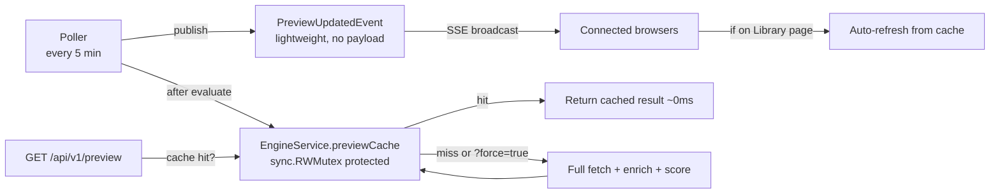

# Preview Cache + SSE Notification

**Status:** ⛔ Superseded by `20260317T1642Z-preview-service-cache-and-sse.md`
**Branch:** `feature/library-management` (continuation)
**Created:** 2026-03-17
**Related:** `20260317T1101Z-library-management-page.md`

## Overview

Add a server-side preview cache to `EngineService` so the Library Management page (and Scoring Engine preview) loads instantly after the first engine run. The poller populates the cache at the end of each cycle, and a lightweight SSE notification tells connected clients that fresh data is available.

## Motivation

The `/api/v1/preview` endpoint currently re-fetches all media from every *arr integration, enriches with watch history, and scores every item on each request. With 2270+ items across multiple integrations, this takes 30–60 seconds. The poller already does this work every cycle — caching the result avoids redundant computation.

## Design

### Cache Lifecycle

1. **Population:** After each poller cycle, the poller calls `EngineService.SetPreviewCache()` with the already-fetched, enriched items + preferences + rules. The service scores them and stores the `PreviewResult`.
2. **Serving:** `GetPreview()` checks the cache first. If populated, returns it. If empty (first load) or `force=true`, does the full computation and caches the result.
3. **Invalidation:** The cache is cleared when preferences, rules, or integrations change (via event bus subscribers on `SettingsChangedEvent`, `RuleChangedEvent`, `IntegrationChangedEvent`). The next `GetPreview()` call or poller cycle repopulates it.
4. **SSE notification:** After populating the cache, the poller publishes `PreviewUpdatedEvent`. The SSE broadcaster sends this to all connected clients. The frontend Library page auto-refreshes if it's currently displayed.

### Cache Location

The cache lives on `EngineService` as a `sync.RWMutex`-protected `*PreviewResult` field. This follows the architecture rule: "In-memory caches for external API responses must be owned by services."

## Implementation Steps

### Step 1: Add Preview Cache to EngineService

Add `previewCache *PreviewResult` and `previewMu sync.RWMutex` fields to `EngineService`. Add `SetPreviewCache()` and `InvalidatePreviewCache()` methods.

Update `GetPreview()` to check the cache first. Add `force` parameter support.

**Files:**
- `backend/internal/services/engine.go` — Cache fields + methods

### Step 2: Add PreviewUpdatedEvent

Add a new `PreviewUpdatedEvent` to the event types. Lightweight — contains only a timestamp, no payload.

**Files:**
- `backend/internal/events/types.go` — New event type

### Step 3: Poller Populates Cache

After the poller's evaluate phase (after `SetLastRunStats`), call `EngineService.SetPreviewCache()` with the fetched items, preferences, and rules. Then publish `PreviewUpdatedEvent`.

**Files:**
- `backend/internal/poller/poller.go` — Add cache population after evaluate

### Step 4: Preview Route Supports `force` Parameter

Update the preview route to pass `?force=true` query param to `GetPreview()` for cache bypass (used by the Refresh button).

**Files:**
- `backend/routes/preview.go` — Pass force param

### Step 5: Cache Invalidation on Config Changes

Subscribe to `SettingsChangedEvent`, rule CRUD events, and integration CRUD events to invalidate the preview cache. This ensures the next request gets fresh data reflecting the new configuration.

**Files:**
- `backend/internal/services/engine.go` — Invalidation method
- `backend/main.go` or `backend/internal/services/registry.go` — Wire event subscriptions

### Step 6: Frontend Auto-Refresh on SSE

Update `library.vue` to listen for the `preview_updated` SSE event and auto-refresh the library data when received (only if the page is currently displayed).

**Files:**
- `frontend/app/pages/library.vue` — SSE listener for auto-refresh

### Step 7: Tests + CI

Add tests for cache hit/miss/invalidation behavior. Run `make ci`.

**Files:**
- `backend/internal/services/engine_test.go` — Cache tests

## Safety Considerations

- Cache is read-locked during reads, write-locked during writes — no data races
- `force=true` always bypasses cache for manual refresh
- Cache is invalidated on any configuration change that affects scoring
- First load before any engine run falls back to full computation (no stale data)
- Cache stores a copy of the data, not a reference — mutations in the poller don't affect cached results
