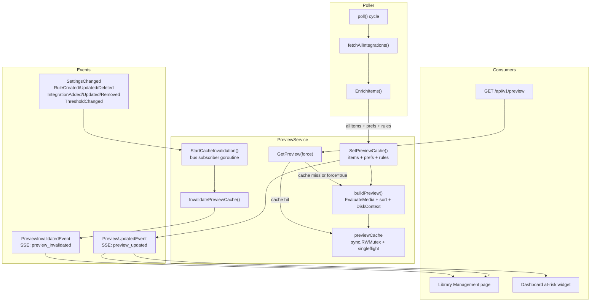
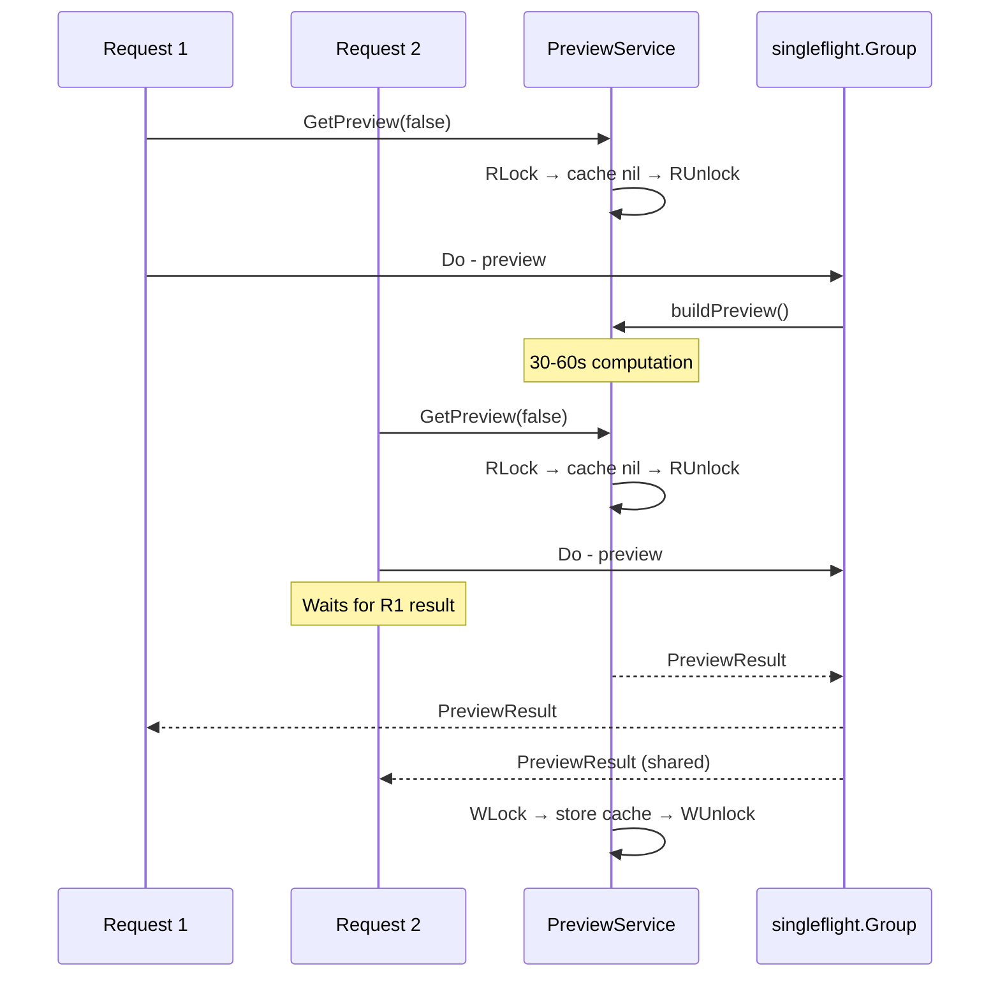

# PreviewService: Cache + SSE Notification

**Status:** 📋 Planned
**Branch:** `feature/library-management` (continuation)
**Created:** 2026-03-17
**Supersedes:** `20260317T1605Z-preview-cache-and-sse-notification.md`
**Related:** `20260317T1101Z-library-management-page.md`

## Overview

Extract a dedicated `PreviewService` from `EngineService` to own the global scored-media view for the Library Management page and other UI consumers. Add a server-side preview cache with poller-driven population, `singleflight`-gated cold starts, event-driven invalidation, and two SSE events (`preview_updated`, `preview_invalidated`) for real-time frontend reactivity.

## Motivation

The `/api/v1/preview` endpoint currently re-fetches all media from every *arr integration, enriches with watch history, and scores every item on each request. With 2270+ items across multiple integrations, this takes 30–60 seconds. The poller already does the same fetch + enrich work every cycle — caching the result avoids redundant computation.

Additionally, `GetPreview()` currently lives on `EngineService`, which already manages run state, run stats CRUD, history queries, and dashboard data. Adding a cache with mutex protection, a `singleflight` gate, a bus subscriber goroutine, and invalidation logic would overload that service. A dedicated `PreviewService` provides a clean separation of concerns and enables future features (filtered views, dashboard "at risk" widgets, notification digest enrichment, export/reporting).

## Design

### Architecture



### Cache Lifecycle

1. **Population:** After each poller cycle, the poller calls `PreviewService.SetPreviewCache(items, prefs, rules)` with the already-fetched, enriched `allItems`. The service runs `engine.EvaluateMedia()`, `engine.SortEvaluated()`, and builds `DiskContext` from its `diskGroups` dependency. The resulting `PreviewResult` is stored under write lock.

2. **Serving:** `GetPreview(force)` checks the cache under read lock. If populated and `force=false`, returns it. If empty or `force=true`, uses `singleflight.Group` to coalesce concurrent requests — only one goroutine does the full computation; others wait for the result. The result is cached before returning.

3. **Invalidation:** `InvalidatePreviewCache()` clears the cache under write lock and publishes `PreviewInvalidatedEvent`. Triggered by the cache invalidation goroutine when it receives any of: `SettingsChangedEvent`, `RuleCreatedEvent`, `RuleUpdatedEvent`, `RuleDeletedEvent`, `IntegrationAddedEvent`, `IntegrationUpdatedEvent`, `IntegrationRemovedEvent`, `ThresholdChangedEvent`.

4. **SSE notifications:**
   - `PreviewUpdatedEvent` — published after cache is populated (poller handoff or fresh computation). Frontend swaps data instantly.
   - `PreviewInvalidatedEvent` — published after cache is cleared on config change. Frontend shows a stale indicator and fires `?force=true` to get fresh data.

### Cache Location

The cache lives on `PreviewService` as a `sync.RWMutex`-protected `*PreviewResult` field with a `singleflight.Group` for cold-start coalescing. This follows the architecture rule: "In-memory caches for external API responses must be owned by services."

### Concurrency Model



### Relationship to EngineCompleteEvent

The existing `EngineCompleteEvent` fires at the end of each poller cycle before cache population. `PreviewUpdatedEvent` fires after the cache is populated. They are distinct signals:
- `EngineCompleteEvent` → "engine cycle finished" (stats, sparklines)
- `PreviewUpdatedEvent` → "preview data is fresh" (library page, dashboard widgets)

The frontend Library page listens for `preview_updated`, not `engine_complete`, because the cache might also be repopulated after a `force=true` request without a full engine cycle.

### Copy Semantics

`SetPreviewCache()` calls `engine.EvaluateMedia()` which creates new `[]engine.EvaluatedItem` slices — the cached result is independent of the poller's `allItems` slice. The poller must not mutate `allItems` after calling `SetPreviewCache()`, but this is guaranteed because `SetPreviewCache()` is called synchronously at the end of `poll()` before the cycle returns.

## Implementation Steps

### Step 1: Extract PreviewService from EngineService

Create `backend/internal/services/preview.go` with:
- `PreviewService` struct holding: `bus`, `previewCache *PreviewResult`, `previewMu sync.RWMutex`, `previewSF singleflight.Group`, and cross-service dependencies (integrations, preferences, rules, diskGroups).
- Constructor `NewPreviewService(bus *events.EventBus)`.
- `SetDependencies(integ IntegrationLister, settings SettingsReader, rules RulesProvider, diskGroups DiskGroupLister)` — same pattern as `EngineService.SetDependencies()`.

Move `GetPreview()`, `PreviewResult`, and `DiskContext` types from `engine.go` to `preview.go`. The private `buildPreview()` method encapsulates the shared evaluation + disk context logic.

Add `singleflight` import to `go.mod` (`golang.org/x/sync/singleflight`).

Remove `GetPreview()`, `PreviewResult`, `DiskContext`, and the cross-service interface types (`IntegrationLister`, `RulesProvider`, `DiskGroupLister`, `SettingsReader` — if only used by preview) from `engine.go`. If any of these interfaces are also used by `EngineService` for other purposes, keep them in `engine.go` and import from `preview.go`.

**Files:**
- `backend/internal/services/preview.go` — New service
- `backend/internal/services/engine.go` — Remove preview-related code
- `backend/go.mod` — Add `golang.org/x/sync` dependency

### Step 2: Register PreviewService on Registry

Add `Preview *PreviewService` field to `Registry`. Construct in `NewRegistry()` and wire dependencies.

**Files:**
- `backend/internal/services/registry.go` — Add Preview field, construct, wire dependencies

### Step 3: Add PreviewUpdatedEvent and PreviewInvalidatedEvent

Add two new event types following the established pattern:

```go
type PreviewUpdatedEvent struct {
    ItemCount int       `json:"itemCount"`
    Timestamp time.Time `json:"timestamp"`
}

type PreviewInvalidatedEvent struct {
    Reason string `json:"reason"` // e.g. "rule_changed", "settings_changed"
}
```

Both implement `Event` interface with `EventType()` and `EventMessage()`.

**Files:**
- `backend/internal/events/types.go` — New event types in a "Preview Events" section

### Step 4: Add Preview Cache Methods

Implement on `PreviewService`:

- `SetPreviewCache(items []integrations.MediaItem, prefs db.PreferenceSet, rules []db.CustomRule)` — Calls `buildPreview()`, stores result under write lock, publishes `PreviewUpdatedEvent`.
- `InvalidatePreviewCache()` — Clears cache under write lock, publishes `PreviewInvalidatedEvent`.
- `GetPreview(force bool) (*PreviewResult, error)` — Read lock check → `singleflight` on miss/force → write lock store → return.
- `buildPreview(items, prefs, rules) (*PreviewResult, error)` (private) — `engine.EvaluateMedia()` + `engine.SortEvaluated()` + DiskContext assembly.
- `buildPreviewFromScratch() (*PreviewResult, error)` (private) — Full fetch + enrich + evaluate for cold starts (same logic as current `GetPreview()` minus caching).

**Files:**
- `backend/internal/services/preview.go` — Cache methods

### Step 5: Add Cache Invalidation Subscriber

Add `StartCacheInvalidation()` method on `PreviewService`:
- Subscribes to the bus.
- Runs a goroutine that filters events by type switch.
- Calls `InvalidatePreviewCache()` on: `SettingsChangedEvent`, `RuleCreatedEvent`, `RuleUpdatedEvent`, `RuleDeletedEvent`, `IntegrationAddedEvent`, `IntegrationUpdatedEvent`, `IntegrationRemovedEvent`, `ThresholdChangedEvent`.

Add corresponding `Stop()` method for graceful shutdown (unsubscribe + wait).

Wire `StartCacheInvalidation()` call in `main.go` after registry construction, following the pattern of `NotificationDispatchService.Start()` and `ActivityPersister.Start()`.

**Files:**
- `backend/internal/services/preview.go` — `StartCacheInvalidation()`, `Stop()`
- `backend/main.go` — Wire `reg.Preview.StartCacheInvalidation()`, add to graceful shutdown

### Step 6: Poller Populates Cache

After the existing `SetLastRunStats` call in `poll()` (line ~228), add:

```go
// Populate preview cache with already-fetched and enriched items
reg.Preview.SetPreviewCache(fetched.allItems, prefs, rules)
```

This requires loading `rules` in `poll()` scope. Currently, rules are loaded inside `evaluateAndCleanDisk()` per disk group. Add a single `reg.Rules.List()` call in `poll()` before the disk group loop and pass `rules` to `evaluateAndCleanDisk()` (avoids redundant DB queries across disk groups — a minor optimization).

**Files:**
- `backend/internal/poller/poller.go` — Load rules in poll(), call SetPreviewCache after evaluate
- `backend/internal/poller/evaluate.go` — Accept rules as parameter instead of loading internally

### Step 7: Preview Route Supports `force` Parameter

Update the preview route to:
1. Read `?force=true` query param.
2. Call `reg.Preview.GetPreview(force)` instead of `reg.Engine.GetPreview()`.

**Files:**
- `backend/routes/preview.go` — Use reg.Preview, pass force param

### Step 8: Extract `usePreview()` Composable

Create a shared composable that encapsulates preview data fetching and SSE reactivity. Both `library.vue` and `rules.vue` consume `/api/v1/preview` — this composable eliminates duplication.

```typescript
// usePreview.ts (interface sketch)
export function usePreview() {
  const items: Ref<EvaluatedItem[]>
  const diskContext: Ref<DiskContext | null>
  const loading: Ref<boolean>
  const stale: Ref<boolean>      // true between preview_invalidated and preview_updated

  function refresh(force?: boolean): Promise<void>   // GET /api/v1/preview[?force=true]
  function startSSE(): void     // subscribe to preview_updated + preview_invalidated
  function stopSSE(): void      // cleanup on unmount

  return { items, diskContext, loading, stale, refresh, startSSE, stopSSE }
}
```

SSE behavior:
- `preview_updated` → calls `refresh()` (cache hit, instant), sets `stale = false`
- `preview_invalidated` → sets `stale = true`, calls `refresh(true)` to trigger fresh computation

The composable connects to the existing SSE endpoint (`/api/v1/events`) using the same `EventSource` infrastructure as other SSE consumers. It uses `onMounted` / `onUnmounted` lifecycle hooks for automatic start/stop.

**Files:**
- `frontend/app/composables/usePreview.ts` — New composable

### Step 9: Update `library.vue` to use `usePreview()`

Replace the inline `fetchPreview()` and manual `preview` ref with the composable:

- Use `const { items, loading, stale, refresh } = usePreview()` instead of manual state
- Remove `fetchPreview()` function (replaced by composable's `refresh()`)
- Add stale indicator — a `<UiBadge>` or subtle banner that appears when `stale` is true and disappears when fresh data arrives
- Pass `force=true` on manual refresh button click
- `@refresh` handler calls `refresh(true)` instead of `fetchPreview()`

**Files:**
- `frontend/app/pages/library.vue` — Use composable, add stale indicator

### Step 10: Update `rules.vue` Preview Section to use `usePreview()`

The Scoring Engine page has a "Live Preview" section (`RulesRulePreviewTable`) that currently fetches `/api/v1/preview` independently with its own loading state. Update it to use the shared composable:

- Use `const { items, diskContext, loading, stale, refresh } = usePreview()` for the preview table data
- When the user edits a rule or changes weights, the backend publishes `RuleCreatedEvent`/`SettingsChangedEvent` → cache invalidated → `preview_invalidated` SSE → composable sets `stale = true` and auto-refreshes → `preview_updated` SSE → new data appears
- This makes the "Live Preview" truly live — no more "click Refresh and wait 30–60s" after rule changes
- Add stale indicator to the preview section header (same pattern as library page)

**Files:**
- `frontend/app/pages/rules.vue` — Use composable for preview section
- `frontend/app/components/RulesRulePreviewTable.vue` — Accept stale prop for indicator

### Step 11: i18n Strings for SSE Indicators

Add locale strings for the stale/refresh indicators:

- `preview.stale` — "Data may be stale — refreshing…"
- `preview.refreshing` — "Refreshing preview data…"
- `preview.lastUpdated` — "Last updated {time}"

Propagate to all 22 locale files.

**Files:**
- `frontend/app/locales/en.json` — New strings
- `frontend/app/locales/*.json` — Propagated to all 22 locales

### Step 12: Tests + CI

Add tests for `PreviewService`:
- Cache hit returns cached data.
- Cache miss triggers computation.
- `force=true` bypasses cache.
- `InvalidatePreviewCache()` clears cache and publishes event.
- `SetPreviewCache()` stores data and publishes event.
- `singleflight` coalesces concurrent misses (use goroutines + sync.WaitGroup).
- Invalidation subscriber reacts to config change events.

Update existing `engine_test.go` to remove preview-related tests (move to `preview_test.go`).
Update `preview_test.go` route tests to use `reg.Preview`.

Run `make ci`.

**Files:**
- `backend/internal/services/preview_test.go` — New test file
- `backend/internal/services/engine_test.go` — Remove migrated tests
- `backend/routes/preview_test.go` — Update to use reg.Preview

## Memory Considerations

The preview cache stores a single `*PreviewResult` in memory:

| Library Size | Items | Cache Size | Impact |
|---|---|---|---|
| Small | 500 | ~0.7 MB | Negligible |
| Medium | 2,270 | ~3.5 MB | Negligible |
| Large | 10,000 | ~15 MB | Acceptable |
| Very large | 50,000 | ~75 MB | Consider pagination |

Each `EvaluatedItem` is ~1–1.5 KB (media metadata + score + factors). During cache rotation (`SetPreviewCache()` builds new result → swap pointer → old result becomes GC-eligible), peak memory briefly doubles to ~7 MB at 2,270 items. This replaces the identical per-request allocation that `GetPreview()` previously made and held for 30–60s, so the net memory increase is minimal.

For the realistic use case (home media server, sub-10K items), memory is not a concern. If a future user exceeds 50K items, server-side pagination against the cache (`GetFiltered()` with limit/offset) can be added without changing the cache architecture.

## Future Opportunities

With `PreviewService` in place, these become straightforward additions without touching `EngineService`:

| Feature | Method | Effort |
|---------|--------|--------|
| Dashboard "Top N at risk" widget | `GetTopAtRisk(n int) []engine.EvaluatedItem` | Small — slice the cache |
| Notification digest enrichment | `GetCachedSummary() *PreviewSummary` | Small — aggregate cache stats |
| Filtered library views | `GetFiltered(filter PreviewFilter) *PreviewResult` | Medium — filter cached items |
| CSV/JSON export | Route calls `GetPreview()` + format | Small — data is cached |

## Safety Considerations

- Cache is read-locked during reads, write-locked during writes — no data races
- `singleflight.Group` prevents thundering herd on cold starts — only one goroutine does the expensive computation
- `force=true` always bypasses cache for manual refresh
- Cache is invalidated on any configuration change that affects scoring, including threshold changes
- First load before any engine run falls back to full computation via `buildPreviewFromScratch()` (no stale data)
- Cache stores independently computed data — `EvaluateMedia()` creates new slices, safe from poller mutations
- `PreviewInvalidatedEvent` signals the frontend to show stale-data UX immediately, before fresh data arrives
- Graceful shutdown: `Stop()` unsubscribes from the bus and waits for the invalidation goroutine to exit
