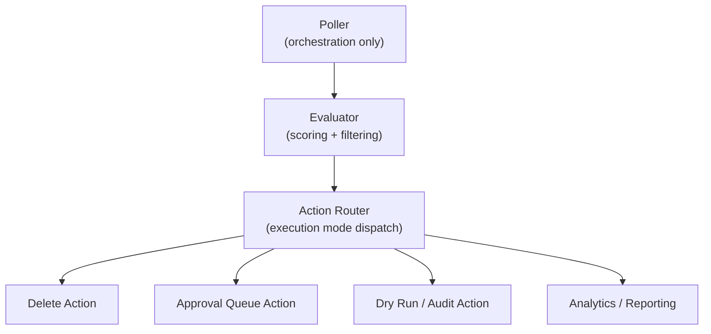
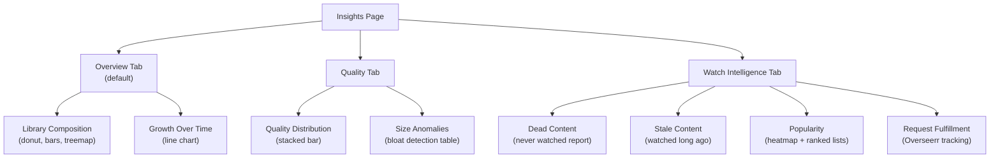

# Capacitarr 2.0 Plan

> **Status:** 🔄 In Progress — further revision expected
> **Created:** 2026-03-18

This plan covers the selected features, architectural refactors, frontend stack changes, frontend restructuring, and schema strategy for a 2.0 breaking release. No backwards compatibility or migration code is required (optional one-way migration script for existing users).

---

## Branch Strategy

Create `feature/2.0` from `main`. All 2.0 work happens on this long-lived branch. When complete, merge to `main` and tag `v2.0.0`.

```
main (1.x — continues receiving bugfixes until 2.0 ships)
  └── feature/2.0
        ├── Phase 1: Architectural refactors
        ├── Phase 2: Schema baseline + migration script
        ├── Phase 3: Frontend stack changes
        ├── Phase 4: Features + frontend restructuring
        └── Phase 5: Polish + testing
```

Any in-progress 1.x feature branches should be merged to `main` before branching `feature/2.0` to ensure a clean baseline.

---

## Overseerr → Seerr Rename

Overseerr is being deprecated in favor of its new name, **Seerr**. Since this is a breaking release:

- **Integration type constant:** `IntegrationTypeSeerr = "seerr"` (replaces `IntegrationTypeOverseerr = "overseerr"`)
- **Client struct:** `SeerrClient` (replaces `OverseerrClient`)
- **File name:** `seerr.go` + `seerr_test.go` (replaces `overseerr.go` + `overseerr_test.go`)
- **UI display:** "Seerr" with subtitle *"Compatible with Overseerr and Jellyseerr"*
- **Documentation:** "Seerr (formerly Overseerr). Compatible with Overseerr, Jellyseerr, and Seerr instances."
- **API:** The Seerr API is identical to Overseerr's — no client code changes beyond the rename
- **Migration script:** Transforms `type = "overseerr"` → `type = "seerr"` for existing users

---

## Selected Features (8)

These features were cherry-picked from the full analysis. Each one serves the core mission: **helping users make better decisions about what to keep and what to delete** by making the scoring engine's inputs and outputs visible.

| # | Feature | Pillar | Relationship to Scoring Engine |
|---|---------|--------|-------------------------------|
| 1 | Per-Integration Thresholds | Capacity Management | Makes the engine's trigger condition smarter |
| 2 | Library Composition Dashboard | Library Analytics | Visualizes the data the engine scores every cycle |
| 3 | Bloat Detection | Quality Management | Identifies items the file size factor should penalize more |
| 4 | Quality Distribution Visualization | Quality Management | Shows the quality landscape the engine evaluates against |
| 5 | Dead Library Items | Watch Intelligence | Surfaces items the engine would score highest for deletion |
| 6 | Popularity Heatmap | Watch Intelligence | Visualizes the watch history dimension the engine weighs |
| 7 | Stale Content Report | Watch Intelligence | Surfaces items the engine naturally prioritizes |
| 8 | Request Fulfillment Tracking | Watch Intelligence | Validates whether the "is requested" protection signal is justified |

None of these features compete with or bypass the scoring engine. They are inputs to it, visualizations of it, or validation of it.

---

## Architectural Refactors

All 8 refactors from Part B of the brainstorm are included. These are internal changes that enable the selected features and make the codebase extensible for future work.

### 1. Capability-Based Integration Interfaces

Replace the monolithic `Integration` interface with composable capability interfaces:

```go
type Connectable interface {
    TestConnection() error
}

type MediaSource interface {
    GetMediaItems() ([]MediaItem, error)
}

type DiskReporter interface {
    GetDiskSpace() ([]DiskSpace, error)
    GetRootFolders() ([]string, error)
}

type MediaDeleter interface {
    DeleteMediaItem(item MediaItem) error
}

type WatchDataProvider interface {
    GetBulkWatchData() (map[string]*WatchData, error)
}

type RequestProvider interface {
    GetRequestedMedia() ([]MediaRequest, error)
}

type WatchlistProvider interface {
    GetWatchlistItems() (map[string]bool, error)
}
```

Each integration implements only the interfaces it supports:
- Sonarr: `Connectable + MediaSource + DiskReporter + MediaDeleter + RuleValueFetcher`
- Plex: `Connectable + WatchDataProvider + WatchlistProvider`
- Tautulli: `Connectable + WatchDataProvider`
- Overseerr: `Connectable + RequestProvider`
- Jellyfin/Emby: `Connectable + WatchDataProvider + WatchlistProvider`

Eliminates: Plex's no-op `DeleteMediaItem`, Jellyfin/Emby not implementing `Integration`, separate `EnrichmentClients` struct.

### 2. Registry-Based Integration Discovery

Replace the manual `EnrichmentClients` struct and switch-statement wiring with a runtime registry:

```go
type IntegrationRegistry struct {
    connectors       map[uint]Connectable
    mediaSources     map[uint]MediaSource
    diskReporters    map[uint]DiskReporter
    deleters         map[uint]MediaDeleter
    watchProviders   map[uint]WatchDataProvider
    requestProviders map[uint]RequestProvider
}

func (r *IntegrationRegistry) WatchProviders() []WatchDataProvider { ... }
func (r *IntegrationRegistry) MediaSources() []MediaSource { ... }
```

The poller asks "give me all WatchDataProviders" instead of checking `if ec.Tautulli != nil`. Adding a new integration type requires zero changes to existing consumers.

### 3. Layered Media Model

Replace the 30-field flat `MediaItem` struct with a layered model:

```go
type MediaItem struct {
    ExternalID     string
    IntegrationID  uint
    Type           MediaType
    Title          string
    Year           int
    SizeBytes      int64
    Path           string
    PosterURL      string
    AddedAt        *time.Time
    Rating         float64
    Genre          string
    QualityProfile string
    Monitored      bool
    Tags           []string
    Language       string
    Metadata       MediaMetadata    // type-specific (TVMetadata, MusicMetadata, etc.)
    Enrichment     *EnrichmentData  // nil until enrichment pass
}

type EnrichmentData struct {
    PlayCount          int
    LastPlayed         *time.Time
    WatchedByUsers     []string
    IsRequested        bool
    RequestedBy        string
    RequestCount       int
    WatchedByRequestor bool
    OnWatchlist        bool
    Collections        []string
}
```

Makes the data model self-documenting. Type-specific fields (TV season number, music album count) live in typed metadata structs instead of optional fields on every item.

### 4. Pluggable Enrichment Pipeline

Replace the 250-line `EnrichItems()` function with a composable pipeline:

```go
type Enricher interface {
    Name() string
    Priority() int
    Enrich(items []MediaItem) error
}

type EnrichmentPipeline struct {
    enrichers []Enricher
}

func (p *EnrichmentPipeline) Run(items []MediaItem) {
    for _, e := range p.enrichers {
        if err := e.Enrich(items); err != nil {
            slog.Warn("Enrichment failed", "enricher", e.Name(), "error", err)
        }
    }
}
```

Adding a new enrichment source = one file implementing `Enricher`. No 250-line function to modify.

### 5. Pluggable Scoring Factors

Decouple the scoring loop from hardcoded dimension logic:

```go
type ScoringFactor interface {
    Name() string
    Key() string
    DefaultWeight() int
    Calculate(item MediaItem) float64
}

var defaultFactors = []ScoringFactor{
    &WatchHistoryFactor{},
    &RecencyFactor{},
    &FileSizeFactor{},
    &RatingFactor{},
    &LibraryAgeFactor{},
    &SeriesStatusFactor{},
    // New in 2.0:
    &RequestPopularityFactor{},
    &QualityBloatFactor{},
}
```

Adding a new scoring dimension = one file + one DB weight column + one UI slider.

### 6. Separate Evaluation from Action

Extract the reusable evaluator from the poller:



The Library page, analytics APIs, and the poller all call the same evaluation logic.

### 7. Library Abstraction

First-class Library entity grouping integrations with per-library thresholds:

```go
type Library struct {
    ID            uint
    Name          string
    DiskGroupID   uint
    Integrations  []uint
    ThresholdPct  float64
    TargetPct     float64
}
```

Enables per-library thresholds, dashboards, and rule scoping.

### 8. Custom Rules — More Fields, Not More Power

**The normalized weighted scoring engine is the core.** Rules remain lightweight score modifiers. In 2.0:

- More matchable fields (all enrichment data exposed)
- Rule impact preview ("this rule affects 47 items")
- Rule templates/presets
- Per-library rule scoping
- Rule priority visualization (drag-and-drop sort order)
- In-line rule editing using the extended Reka-UI creatable combobox (select from suggestions or type custom values, with proper prepopulation when editing existing rules)

Rules must NOT become: compound (AND/OR groups), multi-action, or workflow triggers.

---

## Additional Concepts (Selected)

### Plugin-Style Integration Registration

Internal code organization pattern to eliminate switch statements:

```go
func init() {
    Register("sonarr", SonarrFactory{})
    Register("radarr", RadarrFactory{})
}
```

Each factory declares its capabilities. Not a user-facing extension system.

### Fresh Schema Baseline

Drop all migration files. Start with a single new baseline designed from the 2.0 domain model (Library → Integrations → MediaItems → Rules).

**Migration UX for existing users:**

On first launch of 2.0, the backend detects if a 1.x database exists in the `/config` volume. If found, instead of the normal login page, the user sees a **one-time migration page**:

1. **Welcome to Capacitarr 2.0** — explains this is a major upgrade with a new database schema
2. **Import from 1.x** button — runs the migration, which:
   - Exports `IntegrationConfig`, `PreferenceSet`, `CustomRule`, `NotificationConfig`, and `AuthConfig` from the 1.x database
   - Transforms them into the 2.0 schema format (including `overseerr` → `seerr` rename)
   - Imports into the fresh 2.0 database
   - Preserves configured integrations, rules, preferences, and credentials
   - Drops all transient data (approval queue, audit log, engine stats, activity events)
3. **Start Fresh** button — skips migration, creates a clean 2.0 database, redirects to account setup
4. **CLI alternative** — the page includes a note: "You can also run this migration from the command line: `capacitarr migrate --from /config/capacitarr.db`"

After migration (or fresh start), the 1.x database file is renamed to `capacitarr.db.v1.bak` (not deleted) so users can recover if needed. The migration page only appears once — subsequent launches go straight to login.

---

## Frontend Stack Decisions

### Keep (No Change)

| Component | Why Keep |
|-----------|----------|
| Nuxt 4 + Vue 3 | Right tool for SPA embedded in Go binary. SSR stays disabled. |
| Tailwind CSS 4 | Latest version, no reason to change. |
| shadcn-vue (reka-ui) | 22 language translations, dark-mode theming, component coverage — migration cost is prohibitive. |
| TanStack Table | Best-in-class headless data table. Nothing better exists. |
| VueUse | Standard Vue utility library. |
| Lucide icons | Clean, consistent. |
| i18n (22 languages) | Significant investment, not worth redoing. |
| PWA | Already configured. |

### Change 1: Replace ApexCharts with ECharts

**Drop:** `apexcharts` + `vue3-apexcharts`
**Add:** `echarts` + `vue-echarts`

ECharts (Apache) produces significantly more polished visuals with smooth animations, native dark mode, and a far richer chart type library (heatmaps, treemaps, gauges, sankey, radar). Tree-shakeable — ~200KB for common chart types. Critical for the analytics dashboards where visual quality directly impacts perceived product value.

### Change 2: Build a Creatable Combobox on Reka-UI Primitives

The current Reka-UI Combobox is a filtered select — it doesn't support typing custom values or prepopulating correctly when editing rules.

**Solution:** Extend the shadcn-vue Combobox recipe:
- Inject a synthetic "Create: {typed value}" option when the typed value doesn't match suggestions
- Treat `modelValue` as authoritative regardless of whether it appears in the suggestion list (fixes prepopulation)
- One-time component build (`CreatableCombobox.vue`), reusable across the rule builder and anywhere else

### Change 3: Virtual Scrolling Everywhere

Apply `@tanstack/vue-virtual` (already a dependency) to every unbounded list:
- Library page (10K+ items in large libraries)
- Approval queue
- Audit log
- Activity feed
- Rule builder dropdowns (hundreds of tags)

### Change 4: Dashboard Card Composition Pattern

Reusable `DashboardCard` component for consistent analytics page layouts:

```
DashboardCard
├── Header (title + optional action buttons)
├── Content (chart, stat grid, or table)
└── Footer (optional summary or link)
```

Each analytics page composes multiple cards in a responsive grid.

### Change 5: Granular SSE Event Subscriptions

Components subscribe to specific event types instead of processing all 44+. The composable filters events before invoking callbacks, reducing unnecessary re-renders. Pages that don't need real-time updates don't process events at all.

### SSR: Keep Disabled

- No public pages (everything requires auth) — SEO is irrelevant
- SSR would require Node.js in the container, breaking the single-binary ~30MB image
- SSE connection is client-only
- Every composable would need SSR-safety checks
- Zero user-facing benefit for an authenticated single-user dashboard

---

## Frontend Restructuring

### Navigation (Unchanged — 6 Items)

The nav bar stays at 6 items, same as 1.x. New features are organized into existing pages or one new page.

```
Dashboard  · Insights  · Library  · Rules  · Settings  · Help
```

### Universal Bottom Toolbar

Relocate all utility icon buttons (engine control, update check, language selector, theme picker, donate, help, logout) from the top navbar into a fixed bottom toolbar visible on all viewports. This solves the mobile icon overflow problem (7 icons can't fit in a 393px navbar) and frees the top navbar for brand + page navigation only.

**Design:**
- Fixed bottom bar with glassmorphism styling matching the top navbar
- All popovers/dropdowns open upward (`side="top"`)
- iOS safe area support via `viewport-fit=cover` + `env(safe-area-inset-bottom)`
- Toast container offset adjusted to clear the toolbar
- Top navbar becomes: brand (left) + page navigation links (right)

**Mobile opportunity:** With icons moved to the bottom bar, there's room to show abbreviated nav links on mobile instead of hiding them behind `hidden sm:flex`. Consider a mobile bottom tab bar pattern combining page navigation + utility icons.

See the original plan: `docs/plans/20260312T1907Z-universal-bottom-toolbar.md` (archived from the stale `feature/bottom-toolbar` branch — to be reimplemented fresh against the 2.0 codebase).

### Dashboard — Keep As-Is

The current Dashboard layout works well. No changes to the layout or component ordering. The disk group cards, approval queue, engine controls, and activity feed stay exactly where they are.

### Insights — New Page (`/insights`)

One new page with three tabs, housing all 8 cherry-picked analytics features:



**Tab 1: Overview** (default) — Library composition dashboard + growth trends. ECharts grid with quality donut, genre bars, year area chart, integration treemap, growth line.

**Tab 2: Quality** — Quality distribution visualization + bloat detection. Two `DashboardCard` components.

**Tab 3: Watch Intelligence** — Dead content, stale content, popularity heatmap, request fulfillment. Four `DashboardCard` components. Only appears (or shows a "configure a media server" prompt) when at least one watch data provider is configured.

### Library — Enhanced (`/library`)

Two tabs:

**Tab 1: Browse** (default) — The existing media browser with search/filter/force-delete, plus **smart filter presets**:

| Preset | Filter Criteria | Icon |
|--------|----------------|------|
| 🔴 Dead | PlayCount == 0, not on watchlist, added > 90 days ago | Most actionable |
| 🟡 Stale | LastPlayed > 180 days ago, PlayCount > 0 | Second most actionable |
| 🟠 Bloated | Size > 2x median for quality profile | Worth investigating |
| 📋 Requested | IsRequested == true | Informational |
| ⭐ Protected | Matched by always_keep rule | Informational |

Smart filters use query params: `/library?filter=dead`, `/library?filter=stale`, etc. The filter bar shows the active filter name so users know what they're looking at.

**Tab 2: History** — The current Audit Log page merged here. Deletions, dry-runs, and dry-deletes. This is "what happened to library items" — it belongs with the library browser, not as a standalone page.

### Rules — Enhanced (`/rules`)

Layout stays the same (deletion priority sliders → custom rules → disk thresholds). Enhancements:

1. **In-line rule editing** with the creatable combobox (select from suggestions or type custom values, proper prepopulation)
2. **Rule impact badge** — each rule row shows a clickable badge like `47 affected`. Clicking navigates to `/library?ruleId=5` where the Library page filters to show exactly those items.
3. **Drag-and-drop sort order** for rule priority visualization
4. **Rule templates** — preset buttons to quickly add common rules

### Settings — Enhanced (`/settings`)

Each integration card gets an optional **"Override Thresholds" toggle**. When enabled, threshold % and target % sliders appear that override the disk group defaults for items from that integration.

### Help — Unchanged (`/help`)

No changes.

### Cross-Page Linking Pattern

The Insights page shows **aggregate statistics** (charts, counts, rates). The Library page shows **individual items** matching those criteria. They link to each other:

- Insights → Library: clicking a chart segment (e.g., "720p" in the quality distribution) navigates to `/library?quality=720p`
- Rules → Library: clicking a rule impact badge navigates to `/library?ruleId=5`
- Library → Library: smart filter presets use `/library?filter=dead` etc.

All use the same query parameter pattern. The Library page's filter bar shows the active filter context.

---

## Feature Deep Dives

### 1. Per-Integration Thresholds

**Why users want this:** Different *arr instances often have different storage strategies. Anime Sonarr on a 2TB SSD should trigger at 90%, main Radarr on a 20TB NAS at 80%.

**How to present it:** Each integration card in Settings gets an optional "Override Thresholds" toggle. When enabled, threshold % and target % sliders appear that override the disk group defaults.

**How it works:**
- Add nullable `ThresholdPct` and `TargetPct` columns to `IntegrationConfig`
- During evaluation, check if the item's integration has a custom threshold
- `DiskGroup.EffectiveThresholdForIntegration(integrationID)` returns the override or default

**What's missing:** The evaluation loop needs to handle mixed thresholds within a single disk group.

### 2. Library Composition Dashboard

**Why users want this:** No visibility into what the library contains at a high level. Users know they have 500 movies but not the quality/genre/year distribution.

**How to present it:** Analytics page with ECharts grid:
- Quality Profile Distribution (donut chart)
- Genre Distribution (horizontal bar)
- Year Distribution (area chart)
- Media Type Breakdown (stacked bar by integration)
- Integration Contribution (treemap)
- Growth Over Time (line chart from `LibraryHistory` rollups)

**How it works:** All data from existing `MediaItem` slice in the preview cache. New `AnalyticsService` aggregates into chart data structures. API: `GET /api/v1/analytics/composition`. Refreshes via SSE on `preview_updated`.

**What's missing:** Aggregation logic (pure computation, no new DB tables).

### 3. Bloat Detection

**Why users want this:** A 720p movie shouldn't be 45GB. A 4K movie at 2GB is suspicious. Users want to find size anomalies.

**How to present it:** "Size Anomalies" card on Analytics page showing bloated items (> 2x median for quality profile) and undersized items, sorted by worst offenders.

**How it works:** Group items by quality profile, calculate median + standard deviation, flag outliers. All computation over existing preview cache — zero new API calls.

**What's missing:** Nothing architecturally. Pure statistical computation.

### 4. Quality Distribution Visualization

**Why users want this:** Visual answer to "what does my library look like quality-wise?"

**How to present it:** ECharts donut or stacked bar showing 4K / 1080p / 720p / 480p / Unknown by item count and storage. Clicking a segment filters the Library page.

**How it works:** Group items by `QualityProfile`. Click-to-filter via Library page query parameter.

**What's missing:** Nothing — `QualityProfile` is already populated for all *arr items.

### 5. Dead Library Items

**Why users want this:** "I have 500 movies I've never watched and probably never will."

**How to present it:** "Dead Content" report: PlayCount == 0 AND OnWatchlist == false AND AddedAt > N days ago (configurable, default 90). Sorted by size. Bulk actions: "Add to prefer_remove rule" or "Force delete selected."

**How it works:** Filter preview cache. Requires enrichment data (media server for play count/watchlist). Items without enrichment excluded to avoid false positives.

**What's missing:** Configurable "minimum days in library" threshold preference.

### 6. Popularity Heatmap

**Why users want this:** Visual representation of engagement levels across the library.

**How to present it:** ECharts heatmap (genre × year, color = play count) or bubble chart (size = storage, color = plays). Alternative: ranked top/bottom 20 lists.

**How it works:** Aggregate play counts from preview cache. Requires at least one watch data provider.

**What's missing:** Design decision on axes (genre × year recommended as default).

### 7. Stale Content Report

**Why users want this:** Content that was watched but hasn't been touched in a long time — past its useful life.

**How to present it:** Items where LastPlayed > N days ago (configurable, default 180) AND PlayCount > 0. Enhanced with series status and watchlist signals. Sorted by staleness score.

**How it works:** Filter + lightweight staleness score: `daysSinceLastPlayed / 365 * (seriesEnded ? 1.5 : 1.0) * (!onWatchlist ? 1.2 : 0.5)`.

**What's missing:** Configurable staleness threshold preference. Consider making this a "smart filter" on the Library page rather than a separate page.

### 8. Request Fulfillment Tracking

**Why users want this:** "Did the person who requested this content actually watch it?"

**How to present it:** "Request Fulfillment" card: fulfillment rate headline stat, unfulfilled requests table, per-user breakdown.

**How it works:** Filter preview cache where `IsRequested == true`. Split by `WatchedByRequestor`. The enrichment pipeline already cross-references Overseerr + Tautulli.

**What's missing:** The binary watched/not-watched is sufficient for v1. "Days to watch" metric would require storing request fulfillment date from Overseerr (not currently fetched).

---

## Effort Estimation

### Architectural Refactors

| Area | Effort |
|------|--------|
| Capability-based integration interfaces | Medium |
| Integration registry + plugin registration | Medium |
| Layered media model | Medium |
| Pluggable enrichment pipeline | Low-Medium |
| Pluggable scoring factors | Medium |
| Evaluation/action separation | Medium |
| Library abstraction | Medium |
| Richer rule fields + impact preview | Medium |

### Features

| Area | Effort |
|------|--------|
| Per-integration thresholds | Low-Medium |
| Library composition dashboard | Medium |
| Bloat detection | Low |
| Quality distribution visualization | Low |
| Dead library items | Low |
| Popularity heatmap | Low-Medium |
| Stale content report | Low |
| Request fulfillment tracking | Low |

### Frontend

| Area | Effort |
|------|--------|
| ApexCharts → ECharts migration | Medium |
| Creatable Combobox component | Medium |
| Virtual scrolling (all lists) | Low-Medium |
| Dashboard card pattern | Low |
| Granular SSE subscriptions | Low-Medium |

### Infrastructure

| Area | Effort |
|------|--------|
| Fresh schema baseline | Low |
| Migration script (optional, one-way) | Low-Medium |

**Total estimate: ~5-7 weeks of focused development.** The architectural refactors are the bulk of the work; the features are mostly computation over data already in the preview cache.
