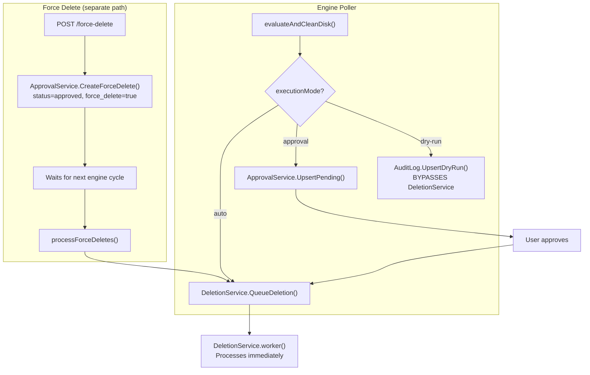
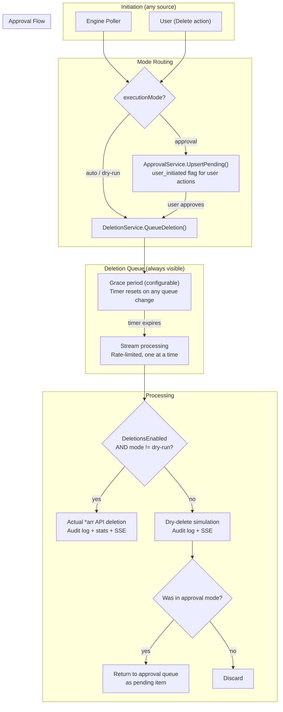

# Deletion Pipeline Unification

**Created:** 2026-03-20T20:34Z
**Status:** 🔄 In Progress (Phase 6 complete)
**Base Branch:** `feature/2.0`
**Breaking:** Yes — no backward compatibility required (2.0 baseline migration)

## Overview

This plan unifies the deletion pipeline by:

1. **Replacing force-delete with mode-aware delete** — user-initiated deletions follow the same pipeline as engine-triggered deletions
2. **Routing poller dry-run through the DeletionService** — eliminating the bypass that writes directly to the audit log
3. **Adding a configurable grace period** to the deletion queue — items accumulate and are visible before processing starts
4. **Making the deletion queue card always visible** — not just in approval mode
5. **Dropping the `Reason` string field** — replacing it with structured, machine-readable fields
6. **Consolidating audit actions** — unifying `dry_run` and `dry_delete` into a single action

## Architecture: Current vs Proposed

### Current Architecture



**Problems:**
- Dry-run bypasses DeletionService — no SSE events, no progress tracking, no rate limiting
- Force-delete is a separate pipeline with its own DB flag, poller method, and API endpoint
- Two different audit actions for dry-runs: `dry_run` (poller direct) vs `dry_delete` (DeletionService)
- `Reason` field stores formatted strings mixing score data, factor summaries, and trigger context
- Deletion queue card only visible in approval mode
- No grace period — items process immediately with no review window

### Proposed Architecture



## Phase 1: Unify Dry-Run Through DeletionService ✅

Route the poller's dry-run path through the DeletionService instead of writing directly to the audit log.

**Completed:** 2026-03-20T21:16Z
**Branch:** `refactor/deletion-pipeline-unification`

### Step 1.1: Add `UpsertAudit` flag to `DeleteJob` ✅

**File:** `internal/services/deletion.go`

Added `UpsertAudit bool` field to the `DeleteJob` struct. When `true`, the dry-delete branch in `processJob()` uses `AuditLog.UpsertDryRun()` (upsert semantics for poller dry-runs that repeat every cycle). When `false`, it uses `AuditLog.Create()` (append-only for user-initiated and approval-mode deletions).

### Step 1.2: Update `processJob()` dry-delete branch ✅

**File:** `internal/services/deletion.go`

Updated the `!deletionsEnabled || job.ForceDryRun` branch of `processJob()` to check `job.UpsertAudit` to decide between `AuditLog.UpsertDryRun()` and `AuditLog.Create()`. Also added nil-safety check for `job.Client` before the actual deletion call — nil client now correctly fails with a logged error instead of panicking.

### Step 1.3: Route poller dry-run through DeletionService ✅

**File:** `internal/poller/evaluate.go`

Replaced the direct `AuditLog.UpsertDryRun()` call in the dry-run branch with `DeletionService.QueueDeletion()` using `ForceDryRun=true`, `UpsertAudit=true`, and `Client=nil`. The nil client is safe because dry-run never calls `DeleteMediaItem()`. The dry-run branch now increments `deletionsQueued` and tracks `lastRunFlagged`/`lastRunFreedBytes` like the auto branch.

### Step 1.4: Update `SignalBatchSize()` calls ✅

**File:** `internal/poller/poller.go`

No separate change needed — handled automatically by the Step 1.3 change. The dry-run branch now increments `deletionsQueued` which feeds into the `totalDeletionsQueued` counter that's passed to `SignalBatchSize()`. Updated the `evaluateAndCleanDisk()` docstring to reflect that it returns counts for both auto and dry-run modes.

### Step 1.5: Consolidate audit actions ✅

**Files:** `internal/db/models.go`, `internal/services/deletion.go`, `internal/services/auditlog.go`, `internal/db/migrations/00001_v2_baseline.sql`, `frontend/app/types/api.ts`, `frontend/app/components/AuditLogPanel.vue`

- Removed `ActionDryRun` constant (`"dry_run"`) from `models.go`
- Kept `ActionDryDelete` constant (`"dry_delete"`) as the single dry-run action
- Updated the `audit_log` table CHECK constraint in the baseline migration to remove `dry_run`
- Updated `AuditLog.UpsertDryRun()` to force `entry.Action = db.ActionDryDelete` and match on `db.ActionDryDelete` explicitly
- Updated Action field comment on `AuditLogEntry` struct
- Updated frontend: removed `dry_run` from `AuditAction` type, audit log filter buttons, badge variant mapping, and label function
- Updated all test references: `auditlog_test.go`, `driver_test.go`, `audit_test.go` (routes)

### Step 1.6: Update tests ✅

**Files:** `internal/services/deletion_test.go`, `internal/services/auditlog_test.go`, `internal/db/driver_test.go`, `routes/audit_test.go`

- Added `TestDeletionService_UpsertAudit_UsesUpsertSemantics` — verifies upsert produces 1 entry for repeated items
- Added `TestDeletionService_UpsertAudit_False_AppendsMultiple` — verifies append-only produces N entries
- Added `TestDeletionService_NilClient_DryRunSucceeds` — verifies nil client works in dry-run path
- Added `TestDeletionService_NilClient_ActualDeletion_Fails` — verifies nil client fails safely in actual deletion path
- Updated all existing `ActionDryRun`/`"dry_run"` references to `ActionDryDelete`/`"dry_delete"`

## Phase 2: Replace Force-Delete with Mode-Aware Delete ✅

**Completed:** 2026-03-20T21:39Z

### Step 2.1: Create `ManualDelete` service method ✅

**File:** `internal/services/approval.go`

Created `ManualDelete()` method on `ApprovalService` with supporting types `ManualDeleteItem`, `ManualDeleteDeps`, and `ManualDeleteResult`. In approval mode, items are upserted as pending with `UserInitiated=true`. In auto/dry-run mode, items are queued to the DeletionService via integration client construction and `QueueDeletion()`.

### Step 2.2: Rename `ForceDelete` to `UserInitiated` in DB model ✅

**Files:** `internal/db/models.go`, `internal/db/migrations/00001_v2_baseline.sql`

- Renamed `ForceDelete bool` → `UserInitiated bool` on `ApprovalQueueItem` with JSON tag `"userInitiated"`
- Updated baseline migration column `force_delete` → `user_initiated`
- Added execution mode constants (`ModeAuto`, `ModeDryRun`, `ModeApproval`) to `db` package to resolve goconst lint warnings
- Updated all references across Go code, including `preview.go` (queue enrichment), `score.go` (QueueStatus comment), `deletion.go` (DiskGroupID comment)

### Step 2.3: Update `ClearQueue()` and `ClearQueueForDiskGroup()` ✅

**File:** `internal/services/approval.go`

Updated WHERE clauses from `force_delete = ?` to `user_initiated = ?` to preserve user-initiated items on below-threshold queue clearing.

### Step 2.4: Update `ReconcileQueue()` ✅

**File:** `internal/services/approval.go`

`ListPendingForDiskGroup()` already filtered on `force_delete = false` — updated to `user_initiated = false` so user-initiated items are excluded from reconciliation pruning.

### Step 2.5: Rename API endpoint ✅

**Files:** `routes/approval.go`, `routes/deletion.go`

- Removed `POST /force-delete` handler from `routes/approval.go`
- Added `POST /delete` handler (`handleManualDelete`) to `routes/deletion.go`
- Handler reads `executionMode` and `deletionsEnabled` from preferences, calls `ManualDelete()`
- Response includes `mode` field for frontend toast messages
- Removed unused `db` import from `routes/approval.go`

### Step 2.6: Remove force-delete infrastructure ✅

**Files:** `internal/services/approval.go`, `internal/poller/evaluate.go`

- Removed `CreateForceDelete()`, `ListForceDeletes()`, `RemoveForceDelete()` methods
- Removed `processForceDeletes()` function from poller
- Removed the `processForceDeletes()` call in below-threshold path of `evaluateAndCleanDisk()`

### Step 2.7: Update frontend ✅

**Files:** `frontend/app/types/api.ts`, `frontend/app/components/LibraryTable.vue`, `frontend/app/components/MediaPosterCard.vue`, `frontend/app/pages/library.vue`, all 22 locale JSON files

- Renamed `forceDelete` → `userInitiated` on `ApprovalQueueItem` TypeScript type
- Renamed `force_delete` → `user_initiated` in `EvaluatedItem.queueStatus` union type
- Updated `MediaPosterCard.vue` queue status badge: `force_delete` → `user_initiated`, label "Force Delete" → "Delete"
- Updated `LibraryTable.vue`: emit `delete` instead of `force-delete`, function `confirmDelete()` instead of `confirmForceDelete()`, queue badge references
- Updated `library.vue`: API call `POST /delete`, mode-dependent toast messages (auto/approval/dry-run), renamed handler `handleDelete()`
- Updated all 22 locale files: renamed i18n keys from `forceDelete*` to `delete*`, added mode-specific success messages to `en.json`

### Step 2.8: Update tests ✅

**Files:** `routes/approval_test.go`, `internal/services/preview_test.go`

- Added 3 route tests: `TestManualDelete_ApprovalMode`, `TestManualDelete_DryRunMode`, `TestManualDelete_DeletionsDisabled`
- Removed 2 old force-delete route tests: `TestForceDelete_DryRunMode`, `TestForceDelete_DeletionsDisabled`
- Updated preview test: `TestPreviewService_EnrichWithQueueStatus_ForceDelete` → `TestPreviewService_EnrichWithQueueStatus_UserInitiated`
- No approval service-level force-delete tests existed to remove (they were never created for `CreateForceDelete` etc.)

## Phase 3: Deletion Queue Grace Period

**Status:** ✅ Complete

### Step 3.1: Add `DeletionQueueDelaySeconds` preference ✅

**Files:** `internal/db/models.go`, `internal/db/migrations/00001_v2_baseline.sql`, `routes/preferences.go`

- Added `DeletionQueueDelaySeconds int` to `PreferenceSet` with GORM tag `gorm:"default:30;not null"` and JSON tag `json:"deletionQueueDelaySeconds"`
- Added column to baseline migration: `deletion_queue_delay_seconds INTEGER NOT NULL DEFAULT 30`
- Added validation in `routes/preferences.go`: minimum 10, maximum 300, resets to 30 if out of range
- Updated `mockSettingsReader` in tests to include the new field
- Updated frontend `PreferenceSet` TypeScript interface

### Step 3.2: Implement grace period in DeletionService worker ✅

**File:** `internal/services/deletion.go`

Replaced the old channel-based immediate-processing worker with a grace-period-aware architecture:

- Removed the Go channel (`chan DeleteJob`) — items are now stored directly in `queuedItems []DeleteJob` (the tracking slice doubles as the job store)
- Worker goroutine uses a `select` on a `notify` channel and `stopCh` for shutdown
- `time.AfterFunc` manages the grace period timer; when it fires, it pokes the worker
- `resetGracePeriod()` starts/resets the timer and publishes `DeletionGracePeriodEvent`
- `QueueDeletion()` resets the grace period if not currently processing
- `CancelDeletion()` resets the grace period on queue mutation if not processing
- `drainAll()` processes all items with rate limiting; items added during draining are also processed
- Added `ClearQueue()` method — cancels all items and stops the grace timer
- Added `GracePeriodState()` method — returns active/remaining/queueSize for the REST API
- Added `FindQueuedItem()` method — looks up a queued item by name/type for the snooze endpoint

### Step 3.3: Publish grace period state via SSE ✅

**Files:** `internal/events/types.go`, `internal/services/deletion.go`

- Added `DeletionGracePeriodEvent` with `RemainingSeconds`, `QueueSize`, `Active` fields
- Event published when grace period starts/resets (active=true) and when it expires (active=false)
- Frontend uses the initial `remainingSeconds` value to start a local countdown timer

### Step 3.4: Update frontend deletion queue card ✅

**File:** `frontend/app/components/DeletionQueueCard.vue`

- Subscribed to `deletion_grace_period` SSE event in `useDeletionQueue` composable
- Shows countdown timer with amber border during grace period: "Processing starts in 12s…"
- Client-side countdown from the initial `remainingSeconds` value (1-second interval)
- Countdown stops when grace period expires or batch completes

### Step 3.5: Add grace period setting to advanced settings UI ✅

**File:** `frontend/app/components/settings/SettingsAdvanced.vue`

- Added "Deletion Queue Delay" card with dropdown selector (10s to 5min, default 30s)
- Uses `ClockIcon` with amber background
- Auto-saves via `useAutoSave` composable on change
- Fetches current value from preferences on mount

### Step 3.6: Implement deletion queue snooze endpoint ✅

**Files:** `routes/deletion.go`, `internal/services/approval.go`

- Added `POST /api/v1/deletion-queue/snooze` endpoint
- Looks up the queued item by name/type to get the integration ID
- Calls `CancelDeletion()` to remove from the deletion queue
- Creates snoozed entry via `ApprovalService.CreateSnoozedEntry(mediaName, mediaType, integrationID, snoozeDurationHours)`
- Returns `{ "snoozed": true, "snoozedUntil": "..." }`

### Step 3.7: Implement deletion queue clear endpoint ✅

**Files:** `routes/deletion.go`, `internal/services/deletion.go`

- Added `POST /api/v1/deletion-queue/clear` endpoint
- Calls `DeletionService.ClearQueue()` which marks all items for cancellation
- Returns `{ "cancelled": N }`

### Step 3.8: Add grace period REST endpoint ✅

**File:** `routes/deletion.go`

- Added `GET /api/v1/deletion-queue/grace-period` endpoint
- Returns `{ "active": bool, "remainingSeconds": int, "queueSize": int }`

### Step 3.9: Add snooze button and clear all button to deletion queue card ✅

**File:** `frontend/app/components/DeletionQueueCard.vue`, `frontend/app/composables/useDeletionQueue.ts`

- Added snooze button (clock icon) next to each queued item
- Added "Clear All" button in the card header when items are queued
- Added `snoozeItem()` and `clearAll()` functions to `useDeletionQueue` composable
- Added i18n keys for new UI text

### Step 3.10: Update tests ✅

**Files:** `internal/services/deletion_test.go`, `routes/deletion_test.go`

- All existing deletion tests updated to use 1-second grace period via `mockSettingsReader`
- Refactored `drainProgressEvent`/`drainBatchEvent` to use constant timeout (fixed unparam lint)
- Added grace period tests: `TestDeletionService_GracePeriod_StartsOnQueue`, `TestDeletionService_GracePeriod_ExpiresAndProcesses`
- Added clear queue test: `TestDeletionService_ClearQueue_CancelsAll`
- Added grace period state test: `TestDeletionService_GracePeriodState_InactiveByDefault`
- Added SSE event tests: `TestDeletionGracePeriodEvent_EventType`, `TestDeletionGracePeriodEvent_EventMessage`
- Added snooze service tests: `TestApprovalService_CreateSnoozedEntry_New`, `TestApprovalService_CreateSnoozedEntry_UpdatesExisting`
- Added route tests: `TestDeletionQueue_Clear`, `TestDeletionQueue_GracePeriod`, `TestDeletionQueue_Snooze_*` (success, missing fields, unauthenticated)

## Phase 4: Always-Visible Deletion Queue Card

**Status:** ✅ Complete
**Completed:** 2026-03-20T22:15Z

### Step 4.1: Update card visibility logic ✅

**File:** `frontend/app/components/DeletionQueueCard.vue`

Removed the `v-if="showCard"` conditional and the `showCard`/`isApprovalMode` computed properties. The card now always renders. Added a `emptyStateMessage` computed that returns mode-specific text based on `executionMode`.

### Step 4.2: Update empty state messages ✅

**Files:** `frontend/app/locales/en.json`

Updated and added mode-specific empty state messages:
- Auto: "No items queued for deletion" (`deletion.noItems`)
- Approval: "Approve items from the approval queue to see them here" (`deletion.emptyInApproval`)
- Dry-run: "No items queued for dry-run" (`deletion.emptyInDryRun` — new key)

## Phase 5: Snoozed Items Card

**Status:** ✅ Complete
**Completed:** 2026-03-20T22:15Z

Extract snoozed items from the approval queue card into a dedicated, always-mode-aware card. This card is visible in all execution modes (auto, approval, dry-run) and only renders when snoozed items exist.

### Step 5.1: Create `SnoozedItemsCard.vue` component ✅

**File:** `frontend/app/components/SnoozedItemsCard.vue`

Created a new card component that:
- Uses `useSnoozedItems` composable to fetch and manage snoozed items
- Displays each item with media name, type, size, and snooze expiration countdown ("Expires in 18h 30m")
- Includes an unsnooze button (Undo2Icon) per item
- Uses `v-motion` animations for card-level and item-level transitions (spring stiffness 260, damping 24)
- Conditionally renders via `v-if="snoozedItems.length > 0"` — no empty state, card simply hides
- Uses UiCard, UiCardHeader, UiCardContent, UiBadge, UiButton (shadcn-vue design system)

### Step 5.2: Remove snoozed section from `ApprovalQueueCard.vue` ✅

**File:** `frontend/app/components/ApprovalQueueCard.vue`

- Removed the entire "Section 2: Snoozed" template block (grid + list views, ~170 lines)
- Removed `snoozedItems` and `unsnoozeGroup` from `useApprovalQueue` destructuring
- Removed `Undo2Icon` import (no longer used)
- Removed `snoozedSectionRef`, `activeSection`, `showJumpBar`, `scrollToSection()`, IntersectionObserver setup/cleanup
- Updated `totalCount` computed to only count `pendingItems.value.length`
- Simplified pending badge (removed jump bar interaction classes)
- Updated Clear All button condition to check only `pendingItems.length > 0`
- Simplified ScoreDetailModal action display (removed snoozed state check)

### Step 5.3: Add `SnoozedItemsCard` to dashboard layout ✅

**File:** `frontend/app/pages/index.vue`

Added `<SnoozedItemsCard />` to the dashboard layout, positioned between the ApprovalQueueCard and DeletionQueueCard. The card auto-hides when empty. Reordered dashboard cards: Engine Activity → Approval Queue → Snoozed Items → Deletion Queue → Disk Groups.

### Step 5.4: Create `useSnoozedItems` composable ✅

**File:** `frontend/app/composables/useSnoozedItems.ts`

Created composable that:
- Fetches `GET /api/v1/approval-queue?status=rejected&limit=1000` and filters client-side to items with active `snoozedUntil`
- Provides reactive `snoozedItems` list (SnoozedItem[] with id, mediaName, mediaType, sizeBytes, snoozedUntil, posterUrl, score)
- Provides `unsnooze(id)` method with optimistic removal and revert-on-failure
- Auto-refreshes on `runCompletionCounter` change from `useEngineControl`
- Subscribes to SSE events: `approval_rejected`, `approval_unsnoozed`, `approval_bulk_unsnoozed`, `approval_queue_cleared`, `approval_dismissed`, `engine_complete`
- Uses module-level `_snoozedSseRegistered` flag for one-time SSE handler registration

### Step 5.5: Extend `IsSnoozed()` check to all execution modes ✅

**File:** `internal/poller/evaluate.go`

Moved the `IsSnoozed()` check from inside the `else if prefs.ExecutionMode == "approval"` block to immediately after the dedup check (before mode-specific branching). The check now runs for all execution modes (auto, approval, dry-run), ensuring items snoozed from the deletion queue in auto/dry-run mode are respected by the engine.

### Step 5.6: Update tests ✅

**File:** `internal/poller/evaluate_test.go`

Added two new tests:
- `TestEvaluateAndCleanDisk_IsSnoozed_AutoMode` — verifies snoozed item ("Serenity") is skipped in auto mode, returning 0 deletions queued
- `TestEvaluateAndCleanDisk_IsSnoozed_DryRunMode` — verifies snoozed item ("Firefly") is skipped in dry-run mode, returning 0 deletions queued
- Both tests create a snoozed approval queue entry, provide a matching media item, and verify the engine skips it

## Phase 6: Dry-Run Return to Approval Queue

**Status:** ✅ Complete

### Step 6.1: Track approval source in `DeleteJob` ✅

**File:** `internal/services/deletion.go`

Added `ApprovalEntryID uint` field to `DeleteJob` struct. Non-zero when the job originated from an approval queue item.

### Step 6.2: Return dry-deleted items to approval queue ✅

**File:** `internal/services/deletion.go`

In the dry-delete branch of `processJob()`, after audit logging and event publishing, added check: if `job.ApprovalEntryID != 0 && s.approvalReturner != nil`, calls `ReturnToPending()` to reset the item back to pending status.

### Step 6.3: Add `ReturnToPending` method ✅

**File:** `internal/services/approval.go`

Created `ReturnToPending(entryID uint) error` method that:
1. Finds the entry by ID
2. Verifies it's in `approved` status (safety check)
3. Updates status to `pending`
4. Publishes `ApprovalReturnedToPendingEvent`
5. Logs the action

Also added `ApprovalReturnedToPendingEvent` to `internal/events/types.go`.

### Step 6.4: Wire `ApprovalEntryID` through `ExecuteApproval()` ✅

**File:** `internal/services/approval.go`

Added `ApprovalEntryID: approved.ID` to the `DeleteJob` struct literal in `ExecuteApproval()` when queueing via `deps.Deletion.QueueDeletion()`.

### Step 6.5: Add `ApprovalService` dependency to `DeletionService` ✅

**Files:** `internal/services/deletion.go`, `internal/services/registry.go`

- Added `ApprovalReturner` interface with `ReturnToPending(entryID uint) error`
- Added `approvalReturner ApprovalReturner` field to `DeletionService` struct
- Extended `SetDependencies()` to accept and wire the `ApprovalReturner` parameter
- Updated `registry.go` to construct `approvalSvc` before the `SetDependencies` call and pass it as the 4th argument

### Step 6.6: Update tests ✅

**Files:** `internal/services/deletion_test.go`, `internal/services/approval_test.go`

Added 9 new tests:
- `TestDeletionService_DryRun_ReturnsToPending_WhenApprovalEntrySet` — dry-deleted items with ApprovalEntryID call ReturnToPending
- `TestDeletionService_DryRun_DoesNotReturn_WhenNoApprovalEntry` — normal dry-runs don't trigger ReturnToPending
- `TestDeletionService_ActualDelete_DoesNotReturn_WhenApprovalEntrySet` — actual deletions never trigger ReturnToPending
- `TestDeletionService_DryRunLoop_ApproveAndReturn` — full integration test of approve → dry-delete → return to pending → approve again
- `TestApprovalService_ReturnToPending` — happy path
- `TestApprovalService_ReturnToPending_NotApproved` — rejects non-approved items
- `TestApprovalService_ReturnToPending_NotFound` — rejects non-existent entries
- `TestApprovalReturnedToPendingEvent_EventType` — event type assertion
- `TestApprovalReturnedToPendingEvent_EventMessage` — event message assertion

Updated all 22 existing `SetDependencies()` calls (19 in deletion_test.go, 3 in metrics_test.go) to include the new `nil` ApprovalReturner parameter.

## Phase 7: Drop `Reason` Field, Add Structured Fields

### Step 7.1: Add structured fields to `AuditLogEntry`

**Files:** `internal/db/models.go`, `internal/db/migrations/00001_v2_baseline.sql`

Add new columns to `audit_log`:

```go
type AuditLogEntry struct {
    // ... existing fields (minus Reason) ...
    Trigger      string `gorm:"not null;default:'engine'" json:"trigger"`      // "engine", "user", "approval"
    DryRunReason string `gorm:"not null;default:''" json:"dryRunReason"`       // "deletions_disabled", "execution_mode", "" (empty if not dry-run)
}
```

Migration:

```sql
-- Remove reason column
-- Add trigger column: "engine", "user", "approval"
-- Add dry_run_reason column: "deletions_disabled", "execution_mode", ""
```

### Step 7.2: Remove `Reason` field from `AuditLogEntry`

**Files:** `internal/db/models.go`, `internal/db/migrations/00001_v2_baseline.sql`

Drop the `reason` column from the `audit_log` table. Since this is a breaking branch, no migration path needed — update the baseline migration directly.

### Step 7.3: Remove `Reason` field from `ApprovalQueueItem`

**Files:** `internal/db/models.go`, `internal/db/migrations/00001_v2_baseline.sql`

Drop the `reason` column from the `approval_queue` table. The approval queue already has `Score` and `ScoreDetails` fields that contain the same data in structured form.

### Step 7.4: Update all audit entry construction sites

**Files:** `internal/services/deletion.go`, `internal/poller/evaluate.go` (if any direct writes remain)

Replace `Reason: fmt.Sprintf(...)` with:
- `Trigger: "engine"` / `"user"` / `"approval"`
- `DryRunReason: "deletions_disabled"` / `"execution_mode"` / `""`

The `Trigger` value needs to be passed through the pipeline. Add a `Trigger string` field to `DeleteJob`.

### Step 7.5: Update `DeleteJob` struct

**File:** `internal/services/deletion.go`

Add `Trigger string` field to `DeleteJob`. Set by:
- Poller: `"engine"`
- `ManualDelete()`: `"user"`
- `ExecuteApproval()`: `"approval"`

### Step 7.6: Update `processJob()` to populate structured fields

**File:** `internal/services/deletion.go`

In both the dry-delete and real-delete branches, populate `Trigger` and `DryRunReason` on the audit entry:

```go
logEntry := db.AuditLogEntry{
    // ... existing fields ...
    Trigger:      job.Trigger,
    DryRunReason: determineDryRunReason(deletionsEnabled, job.ForceDryRun),
}
```

Where `determineDryRunReason()` returns:
- `"deletions_disabled"` if `!deletionsEnabled`
- `"execution_mode"` if `job.ForceDryRun` (and deletions are enabled — meaning the mode forced it)
- `""` if not a dry-run

### Step 7.7: Remove `Reason` from `ApprovalService` methods

**File:** `internal/services/approval.go`

- Remove `Reason` field from `UpsertPending()` item construction
- Remove `Reason` from `CreateForceDelete()` (already being removed in Phase 2)
- Update `ExecuteApproval()` to not pass `Reason` to `DeleteJob`

### Step 7.8: Update `DeleteJob` struct — remove `Reason`

**File:** `internal/services/deletion.go`

Remove the `Reason string` field from `DeleteJob`. The score and factors are already passed separately.

### Step 7.9: Update frontend audit log display

**File:** `frontend/app/components/AuditLogPanel.vue`

- Remove any display of the `reason` field
- Display score from the `score` field
- Display factor breakdown from `scoreDetails` (already parsed as JSON)
- Display trigger as a badge: "Engine" / "User" / "Approval"
- Display dry-run reason when applicable: "Deletions disabled" / "Dry-run mode"

### Step 7.10: Update frontend approval queue display

**File:** `frontend/app/components/ApprovalQueueCard.vue`

- Remove any display of the `reason` field
- Display score from the `score` field
- Display factor breakdown from `scoreDetails`

### Step 7.11: Update `AuditLog.UpsertDryRun()` method

**File:** `internal/services/auditlog.go`

Update the upsert matching to not use `Reason` (it no longer exists). Match on `media_name`, `media_type`, and `action` (already the case).

Update the upsert update fields to include `trigger` and `dry_run_reason` instead of `reason`.

### Step 7.12: Update notification dispatch

**File:** `internal/services/notification_dispatch.go`, `internal/notifications/discord.go`, `internal/notifications/apprise.go`

Check if any notification formatting uses the `Reason` field. If so, replace with structured field rendering. (Based on earlier analysis, notifications use `CycleDigest` which doesn't include `Reason`, but verify.)

### Step 7.13: Update backup/restore

**File:** `internal/services/backup.go`

The backup service serializes and restores DB tables. Ensure the schema changes (dropped `reason`, added `trigger`/`dry_run_reason`) are reflected in backup format.

### Step 7.14: Update tests

**Files:** All test files that construct `AuditLogEntry` or `ApprovalQueueItem` with `Reason`

- Remove `Reason` from all test fixtures
- Add `Trigger` and `DryRunReason` to audit log test fixtures
- Update assertions that check `Reason` content

## API Changes

### Current API Surface (Deletion-Related)

| Method | Endpoint | Purpose | File |
|--------|----------|---------|------|
| `GET` | `/api/v1/approval-queue` | List approval queue items | `routes/approval.go` |
| `POST` | `/api/v1/approval-queue/:id/approve` | Approve item → queue for deletion | `routes/approval.go` |
| `POST` | `/api/v1/approval-queue/:id/reject` | Reject item → snooze | `routes/approval.go` |
| `POST` | `/api/v1/approval-queue/:id/unsnooze` | Clear snooze → reset to pending | `routes/approval.go` |
| `DELETE` | `/api/v1/approval-queue/:id` | Dismiss a pending/rejected item | `routes/approval.go` |
| `POST` | `/api/v1/approval-queue/clear` | Clear all pending + rejected items | `routes/approval.go` |
| `POST` | `/api/v1/force-delete` | Force-delete items (bypass threshold) | `routes/approval.go` |
| `GET` | `/api/v1/deletion-queue` | List items in deletion queue | `routes/deletion.go` |
| `DELETE` | `/api/v1/deletion-queue` | Cancel a queued deletion | `routes/deletion.go` |

### Proposed API Surface

#### Removed Endpoints

| Method | Endpoint | Reason |
|--------|----------|--------|
| `POST` | `/api/v1/force-delete` | Replaced by `POST /api/v1/delete` |

#### New Endpoints

| Method | Endpoint | Purpose | File |
|--------|----------|---------|------|
| `POST` | `/api/v1/delete` | Mode-aware delete (replaces force-delete) | `routes/deletion.go` |
| `POST` | `/api/v1/deletion-queue/snooze` | Snooze a queued item (remove from deletion queue, prevent re-queuing) | `routes/deletion.go` |
| `POST` | `/api/v1/deletion-queue/clear` | Cancel all items in the deletion queue | `routes/deletion.go` |
| `GET` | `/api/v1/deletion-queue/grace-period` | Get current grace period state | `routes/deletion.go` |

#### Modified Endpoints

| Method | Endpoint | Change |
|--------|----------|--------|
| `GET` | `/api/v1/approval-queue` | Response body drops `reason` and `forceDelete` fields, adds `trigger` and `userInitiated` fields |
| `DELETE` | `/api/v1/deletion-queue` | Resets grace period timer on cancellation |

#### Unchanged Endpoints

| Method | Endpoint |
|--------|----------|
| `POST` | `/api/v1/approval-queue/:id/approve` |
| `POST` | `/api/v1/approval-queue/:id/reject` |
| `POST` | `/api/v1/approval-queue/:id/unsnooze` |
| `DELETE` | `/api/v1/approval-queue/:id` |
| `POST` | `/api/v1/approval-queue/clear` |
| `GET` | `/api/v1/deletion-queue` |

### New Endpoint: `POST /api/v1/delete`

Replaces `POST /api/v1/force-delete`. Behavior depends on the current `executionMode`.

**Request Body:**

```json
[
  {
    "mediaName": "Serenity",
    "mediaType": "movie",
    "integrationId": 1,
    "externalId": "123",
    "sizeBytes": 4294967296,
    "scoreDetails": "[...]",
    "posterUrl": "https://..."
  }
]
```

Note: `reason` field is removed from the request body (was only used for the now-dropped `Reason` column).

**Response (all modes):**

```json
{
  "queued": 3,
  "total": 3,
  "mode": "auto"
}
```

**Behavior per mode:**

| Mode | Action | Where items appear |
|------|--------|--------------------|
| `auto` | Items queued to DeletionService immediately | Deletion queue card |
| `approval` | Items inserted as pending with `user_initiated=true` | Approval queue card |
| `dry-run` | Items queued to DeletionService with `ForceDryRun=true` | Deletion queue card |

### New Endpoint: `GET /api/v1/deletion-queue/grace-period`

Returns the current grace period state for the deletion queue.

**Response:**

```json
{
  "active": true,
  "remainingSeconds": 18,
  "queueSize": 5
}
```

When no grace period is active (queue is empty or processing has started):

```json
{
  "active": false,
  "remainingSeconds": 0,
  "queueSize": 0
}
```

### New Endpoint: `POST /api/v1/deletion-queue/snooze`

Removes an item from the deletion queue and creates a snoozed (rejected) entry in the approval queue to prevent the engine from re-queuing it until the snooze expires. This reuses the existing snooze infrastructure (`snoozed_until`, `IsSnoozed()` check in the poller).

**Request Body:**

```json
{
  "mediaName": "Serenity",
  "mediaType": "movie"
}
```

**Response:**

```json
{
  "snoozed": true,
  "snoozedUntil": "2026-03-21T20:46:00Z"
}
```

**Behavior:**
1. Cancel the item in the deletion queue via `CancelDeletion()`
2. Create a rejected/snoozed entry in the approval queue with `snoozed_until` set to `now + SnoozeDurationHours` (from preferences)
3. Reset the grace period timer (queue mutation)
4. The poller's `IsSnoozed()` check prevents re-queuing until the snooze expires

This works in all modes — even in auto/dry-run mode where items don't normally go through the approval queue. The snoozed approval queue entry acts as a "do not re-queue" marker that the poller respects.

### New Endpoint: `POST /api/v1/deletion-queue/clear`

Cancels all items in the deletion queue at once (bulk cancel). Resets the grace period timer.

**Response:**

```json
{
  "cancelled": 5
}
```

**Behavior:**
1. Mark all queued items for cancellation via `CancelDeletion()` for each item
2. Clear the queued items tracking slice
3. Reset the grace period timer
4. Publish SSE event for queue cleared

### SSE Event Changes

#### New Events

| Event Type | Payload | When |
|------------|---------|------|
| `deletion_grace_period` | `{ remainingSeconds, queueSize, active }` | Grace period starts, updates periodically, expires |

#### Modified Events

| Event Type | Change |
|------------|--------|
| `deletion_queued` | No change to payload, but now emitted for dry-run items too (previously only auto mode) |

#### Removed Events

None — all existing SSE events are preserved.

### Response Body Changes

#### `ApprovalQueueItem` (used by `GET /api/v1/approval-queue`)

| Field | Change |
|-------|--------|
| `reason` | **Removed** |
| `forceDelete` | **Removed** — replaced by `userInitiated` |
| `userInitiated` | **Added** — `boolean`, indicates user-initiated vs engine-initiated |
| `trigger` | **Added** — `string`, "engine" or "user" |

#### `AuditLogEntry` (used by `GET /api/v1/audit`)

| Field | Change |
|-------|--------|
| `reason` | **Removed** |
| `trigger` | **Added** — `string`, "engine", "user", or "approval" |
| `dryRunReason` | **Added** — `string`, "deletions_disabled", "execution_mode", or "" |
| `action` | `dry_run` value removed — only `deleted`, `dry_delete`, `cancelled` remain |

#### `DeleteJobSummary` (used by `GET /api/v1/deletion-queue`)

| Field | Change |
|-------|--------|
| `reason` | **Removed** |
| `score` | **Added** — `float64`, the numeric score |

### Route File Reorganization

The `POST /api/v1/delete` endpoint moves from `routes/approval.go` to `routes/deletion.go`, consolidating all deletion-related endpoints in one file:

**`routes/deletion.go` (after):**
- `POST /api/v1/delete` — mode-aware delete (new)
- `GET /api/v1/deletion-queue` — list queued items (existing)
- `DELETE /api/v1/deletion-queue` — cancel a single queued item (existing)
- `POST /api/v1/deletion-queue/clear` — cancel all queued items (new)
- `POST /api/v1/deletion-queue/snooze` — snooze a queued item (new)
- `GET /api/v1/deletion-queue/grace-period` — grace period state (new)

**`routes/approval.go` (after):**
- `GET /api/v1/approval-queue` — list items (existing)
- `POST /api/v1/approval-queue/:id/approve` — approve (existing)
- `POST /api/v1/approval-queue/:id/reject` — reject/snooze (existing)
- `POST /api/v1/approval-queue/:id/unsnooze` — unsnooze (existing)
- `DELETE /api/v1/approval-queue/:id` — dismiss (existing)
- `POST /api/v1/approval-queue/clear` — clear all (existing)

## Summary of DB Schema Changes

All changes are to the baseline migration (`00001_v2_baseline.sql`) since this is a breaking branch.

### `approval_queue` table

| Change | Column | Details |
|--------|--------|---------|
| **Rename** | `force_delete` → `user_initiated` | Same type (INTEGER NOT NULL DEFAULT 0) |
| **Drop** | `reason` | No longer needed — `score` and `score_details` carry the data |
| **Add** | `trigger` | `TEXT NOT NULL DEFAULT 'engine'` — "engine", "user" |

### `audit_log` table

| Change | Column | Details |
|--------|--------|---------|
| **Drop** | `reason` | No longer needed — structured fields replace it |
| **Add** | `trigger` | `TEXT NOT NULL DEFAULT 'engine'` — "engine", "user", "approval" |
| **Add** | `dry_run_reason` | `TEXT NOT NULL DEFAULT ''` — "deletions_disabled", "execution_mode", "" |
| **Update** | `action` CHECK | Remove `dry_run` from allowed values, keep `deleted`, `dry_delete`, `cancelled` |

### `preference_sets` table

| Change | Column | Details |
|--------|--------|---------|
| **Add** | `deletion_queue_delay_seconds` | `INTEGER NOT NULL DEFAULT 30` — range 10-300 |

## Summary of Removed Code

| Component | Location | Reason |
|-----------|----------|--------|
| `CreateForceDelete()` | `services/approval.go` | Replaced by `ManualDelete()` |
| `ListForceDeletes()` | `services/approval.go` | No longer needed without poller processing |
| `RemoveForceDelete()` | `services/approval.go` | No longer needed without poller processing |
| `processForceDeletes()` | `poller/evaluate.go` | Eliminated — user deletes go through unified pipeline |
| `POST /force-delete` route | `routes/approval.go` | Replaced by `POST /delete` |
| `ActionDryRun` constant | `db/models.go` | Consolidated into `ActionDryDelete` |
| Direct audit log writes in poller dry-run | `poller/evaluate.go:220-248` | Routed through DeletionService |
| `Reason` field on `AuditLogEntry` | `db/models.go` | Replaced by structured `Trigger` + `DryRunReason` |
| `Reason` field on `ApprovalQueueItem` | `db/models.go` | Redundant with `Score` + `ScoreDetails` |

## Execution Order

Phases should be executed in order (1 → 2 → 3 → 4 → 5 → 6 → 7). Each phase builds on the previous:

- Phase 1 must come first because Phase 2 depends on dry-run flowing through DeletionService
- Phase 2 must come before Phase 3 because the grace period applies to the unified pipeline
- Phase 3 includes the snooze endpoint which Phase 5 depends on (snoozed items card displays snooze data)
- Phase 4 is a frontend-only change that can happen after Phase 3
- Phase 5 (Snoozed Items Card) depends on Phase 3 (snooze endpoint) and Phase 4 (always-visible deletion queue)
- Phase 6 depends on Phase 2 (approval items flowing through DeletionService)
- Phase 7 can technically happen in parallel with Phases 3-6 but is listed last to minimize merge conflicts
