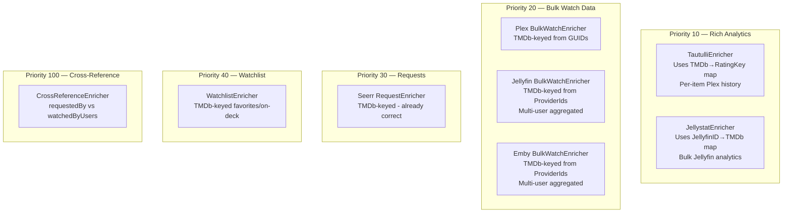

# Enrichment Overhaul & Jellystat Integration

**Status:** 📋 Planned
**Branch:** `feature/enrichment-overhaul` (from `feature/2.0`)
**Scope:** Fix all enrichment matching, multi-user aggregation, and add Jellystat integration

---

## Background

A deep audit of the enrichment pipeline revealed **6 bugs**, 3 of them critical:

1. Jellyfin/Emby watch data only covers the admin user
2. Jellyfin/Emby never populate `WatchData.Users`
3. Jellyfin/Emby favorites only cover the admin user
4. All enrichment uses fragile title-based matching (replaced with TMDb ID matching)
5. Tautulli enricher uses wrong ExternalID (Radarr ID ≠ Plex ratingKey)
6. Plex bulk watch never populates `WatchData.Users` (no per-user data in Plex API without Tautulli)

Additionally, Jellystat (the Tautulli equivalent for Jellyfin) will be added as a new integration type.

**Decision:** Title-based matching is removed entirely. All enrichment matching uses TMDb ID exclusively. Items without TMDb IDs get neutral scores (safe default) rather than false matches (dangerous).

**Architecture note:** The interface change (`map[string]` → `map[int]`), all three provider implementations (Jellyfin, Emby, Plex), and both enricher consumers must be updated atomically in a single phase to maintain compilation. This is why the former Phases 1-3 are merged into a single Phase 1.

---

## Phase 1: TMDb ID Matching & Multi-User Aggregation

Replace title-based matching with TMDb ID across all providers and enrichers atomically. Simultaneously fix Jellyfin/Emby multi-user aggregation (Bugs 1-4).

### Step 1.1: Change WatchDataProvider interface

**File:** `internal/integrations/types.go`

Change `WatchDataProvider.GetBulkWatchData()` return type from `map[string]*WatchData` to `map[int]*WatchData` (keyed by TMDb ID instead of lowercase title).

### Step 1.2: Change WatchlistProvider interface

**File:** `internal/integrations/types.go`

Change `WatchlistProvider.GetWatchlistItems()` return type from `map[string]bool` to `map[int]bool` (keyed by TMDb ID).

### Step 1.3: Add TMDb ID extraction to Jellyfin API calls

**File:** `internal/integrations/jellyfin.go`

Add `Fields=ProviderIds` to the Items API query parameter in `GetBulkWatchDataForUser()` and `GetFavoritedItems()`. Parse `ProviderIds.Tmdb` from the response. Update the `jellyfinItem` struct to include:

```go
type jellyfinItem struct {
    // ... existing fields ...
    ProviderIds map[string]string `json:"ProviderIds"`
}
```

### Step 1.4: Add helper to fetch all Jellyfin users

**File:** `internal/integrations/jellyfin.go`

Extract a `getAllUsers()` method that returns `[]jellyfinUser` (ID + Name). The existing `GetAdminUserID()` method remains for backward compatibility but `getAllUsers()` is used by `GetBulkWatchData()` and `GetWatchlistItems()`.

### Step 1.5: Rewrite JellyfinClient.GetBulkWatchDataForUser() for TMDb-keyed data

**File:** `internal/integrations/jellyfin.go`

Change return type to `map[int]*WatchData`. Parse TMDb ID from each item's `ProviderIds`. Items without a TMDb ID are skipped. When `PlayCount > 0`, set `Users` field to include the username for that user.

### Step 1.6: Rewrite JellyfinClient.GetBulkWatchData() for multi-user aggregation

**File:** `internal/integrations/jellyfin.go`

Replace the admin-only implementation with:
1. Fetch all users via `getAllUsers()`
2. For each user, call `GetBulkWatchDataForUser(userID)`
3. Merge results: sum play counts across users, take most-recent `LastPlayed`, union usernames from `Users` field

### Step 1.7: Rewrite JellyfinClient.GetFavoritedItems() for TMDb-keyed data

**File:** `internal/integrations/jellyfin.go`

Change return type from `map[string]bool` to `map[int]bool`. Add `Fields=ProviderIds` to the favorites query. Parse TMDb ID from `ProviderIds.Tmdb`.

### Step 1.8: Rewrite JellyfinClient.GetWatchlistItems() for multi-user favorites

**File:** `internal/integrations/jellyfin.go`

Replace admin-only implementation with iteration over all users via `getAllUsers()`. Union their favorited items. Returns `map[int]bool` keyed by TMDb ID.

### Step 1.9: Apply same changes to EmbyClient

**File:** `internal/integrations/emby.go`

Mirror all Jellyfin changes in EmbyClient:
- Add `ProviderIds` to the Emby item struct
- Add `Fields=ProviderIds` to Item queries
- Add `getAllUsers()` helper
- Rewrite `GetBulkWatchDataForUser()` for TMDb-keyed, user-aware data
- Rewrite `GetBulkWatchData()` for multi-user aggregation
- Rewrite `GetFavoritedItems()` for TMDb-keyed data
- Rewrite `GetWatchlistItems()` for multi-user favorites

### Step 1.10: Extract TMDb ID from Plex GUIDs

**File:** `internal/integrations/plex.go`

Plex items include a `Guid` field and/or a `Guids` array that contains TMDb references like `tmdb://12345`. Add TMDb ID extraction to `plexMetadataToMediaItem()`. Update the `plexMetadata` struct:

```go
type plexMetadata struct {
    // ... existing fields ...
    Guids []struct {
        ID string `json:"id"`
    } `json:"Guid"`
}
```

Parse TMDb ID from GUIDs matching the pattern `tmdb://(\d+)`.

### Step 1.11: Update PlexClient.GetBulkWatchData() for TMDb-keyed data

**File:** `internal/integrations/plex.go`

Change the result map key from `strings.ToLower(item.Title)` to the TMDb ID extracted from the Plex GUID. Items without a parseable TMDb GUID are skipped.

**Additionally:** Return a second map `map[int]string` (TMDb ID → Plex ratingKey) for use by the Tautulli enricher in Phase 2. The `WatchDataProvider` interface only returns `map[int]*WatchData`, so this TMDb→RatingKey map is returned via a new PlexClient-specific method `GetTMDbToRatingKeyMap()`. This is not a persistent cache — it's built during the same poll cycle and passed to the Tautulli enricher. PlexClient remains stateless.

### Step 1.12: Update PlexClient.GetOnDeckItems() for TMDb-keyed data

**File:** `internal/integrations/plex.go`

Change the on-deck items map from `map[string]bool` (title-keyed) to `map[int]bool` (TMDb-keyed). For episodes, use the show's TMDb ID (from grandparent metadata or the show's GUID).

### Step 1.13: Update BulkWatchEnricher to match by TMDb ID

**File:** `internal/integrations/enrichers.go`

Update `BulkWatchEnricher.Enrich()` to match items by `item.TMDbID` instead of `normalizedTitleKey(item)`. Items with `TMDbID == 0` are skipped (safe default — they get neutral scores).

### Step 1.14: Update WatchlistEnricher to match by TMDb ID

**File:** `internal/integrations/enrichers.go`

Update `WatchlistEnricher.Enrich()` to match items by `item.TMDbID` instead of `normalizedTitleKey(item)`.

### Step 1.15: Remove title matching utilities

**File:** `internal/integrations/enrich.go`

Delete `normalizedTitleKey()` and the entire `enrich.go` file. Remove all imports of it.

### Step 1.16: Update all Jellyfin tests

**File:** `internal/integrations/jellyfin_test.go`

Update test server mocks to:
- Return multiple users from `/Users`
- Include `ProviderIds` in item responses
- Verify multi-user aggregation logic (merged play counts, unioned users, latest `LastPlayed`)
- Verify items without TMDb ID are skipped
- Verify TMDb-keyed return maps

### Step 1.17: Update all Emby tests

**File:** `internal/integrations/emby_test.go`

Mirror Jellyfin test changes for Emby.

### Step 1.18: Update Plex tests

**File:** `internal/integrations/plex_test.go`

Update mock Plex responses to include `Guid`/`Guids` fields. Verify TMDb ID extraction, TMDb-keyed maps, and TMDb→RatingKey map generation.

### Step 1.19: Update BulkWatchEnricher and WatchlistEnricher tests

**File:** `internal/integrations/enrichment_pipeline_test.go` and enricher test files

Update test fixtures to use TMDb IDs for matching instead of titles.

### Step 1.20: Run `make ci` to verify Phase 1

All interfaces, implementations, enrichers, and tests updated atomically. Must compile and pass.

---

## Phase 2: Fix Tautulli Enrichment

Fix Bug 5 — make Tautulli enrichment work with TMDb ID matching via the TMDb→RatingKey map from PlexClient.

### Step 2.1: Update TautulliEnricher to accept a TMDb→RatingKey map

**File:** `internal/integrations/enrichers.go`

The `TautulliEnricher` struct gets a new field: `tmdbToRatingKey map[int]string`. Constructor becomes `NewTautulliEnricher(client *TautulliClient, tmdbMap map[int]string)`. Its `Enrich()` method changes from using `item.ExternalID` directly to looking up the Plex rating key via `tmdbToRatingKey[item.TMDbID]`.

### Step 2.2: Update RegisterTautulliEnrichers to accept and pass the lookup map

**File:** `internal/integrations/enrichers.go`

`RegisterTautulliEnrichers()` receives the TMDb→RatingKey map and passes it to `NewTautulliEnricher()`. Update signature:

```go
func RegisterTautulliEnrichers(pipeline *EnrichmentPipeline, registry *IntegrationRegistry, tmdbToRatingKey map[int]string)
```

### Step 2.3: Wire the TMDb→RatingKey map from Plex through the poller

**File:** `internal/poller/fetch.go`

In `fetchAllIntegrations()`:
1. After building the enrichment pipeline, check if any registered `WatchDataProvider` is a `*PlexClient`
2. If so, call `plexClient.GetTMDbToRatingKeyMap()` to get the map
3. Pass the map to `RegisterTautulliEnrichers(pipeline, registry, tmdbMap)`

If no Plex client is registered, pass an empty map (Tautulli without Plex is useless anyway).

### Step 2.4: Update TautulliEnricher tests

Verify that:
- Items with a valid TMDb ID and a matching ratingKey get enriched with Tautulli data
- Items without a TMDb ID are skipped
- Items with a TMDb ID but no matching ratingKey are skipped (logged at Debug level)
- Empty TMDb→RatingKey map results in all items being skipped gracefully

### Step 2.5: Run `make ci` to verify Phase 2

---

## Phase 3: Jellystat Integration

Add Jellystat as a new integration type, mirroring the Tautulli pattern.

### Step 3.1: Add IntegrationTypeJellystat constant

**File:** `internal/integrations/types.go`

Add `IntegrationTypeJellystat IntegrationType = "jellystat"`.

Update the capability interface comment block to document Jellystat's capabilities: `Connectable` (like Tautulli, Jellystat is an analytics supplement, not a `WatchDataProvider`).

### Step 3.2: Create JellystatClient

**File:** `internal/integrations/jellystat.go` (new file)

Implement `JellystatClient` with:
- `URL string` and `Token string` (JWT token stored in `APIKey` field)
- `doRequest(endpoint string)` using `Authorization: Bearer <token>` header via `DoAPIRequest()`
- `TestConnection()` hitting Jellystat's auth validation endpoint. On 401, return error: `"jellystat auth failed (JWT token may be expired — regenerate in Jellystat Settings)"`
- Compile-time interface check: `var _ Connectable = (*JellystatClient)(nil)`

### Step 3.3: Implement JellystatClient.GetBulkWatchStats()

**File:** `internal/integrations/jellystat.go`

Fetch all library items with stats from Jellystat's bulk endpoint. Returns `map[int]*WatchData` keyed by TMDb ID:
1. Call Jellystat's library items endpoint to get all items with play counts and user lists
2. Jellystat items reference Jellyfin Item IDs — resolve TMDb IDs via the Jellyfin TMDb map
3. Build `WatchData` entries with `PlayCount`, `LastPlayed`, and `Users` populated

The TMDb resolution requires a `map[string]int` (Jellyfin Item ID → TMDb ID) lookup. This map is built by JellyfinClient during Phase 1 (from `ProviderIds`) and passed to the JellystatEnricher.

### Step 3.4: Create JellystatEnricher

**File:** `internal/integrations/enrichers.go` — add alongside existing enrichers

Implement `JellystatEnricher` at priority 10 (same as Tautulli — highest for watch data):

```go
type JellystatEnricher struct {
    client             *JellystatClient
    jellyfinIDToTMDbID map[string]int // Jellyfin Item ID → TMDb ID (from JellyfinClient)
}
```

Its `Enrich()` method:
1. Calls `client.GetBulkWatchStats()` passing the Jellyfin ID → TMDb ID map
2. Matches items by `item.TMDbID`
3. Populates `PlayCount`, `LastPlayed`, `WatchedByUsers`

Compile-time interface check: `var _ Enricher = (*JellystatEnricher)(nil)`

### Step 3.5: Register Jellystat factory

**File:** `internal/integrations/factory.go`

Add factory registration in `RegisterAllFactories()`:

```go
RegisterFactory(string(IntegrationTypeJellystat), func(url, apiKey string) interface{} {
    return NewJellystatClient(url, apiKey)
})
```

### Step 3.6: Add RegisterJellystatEnrichers function

**File:** `internal/integrations/enrichers.go`

Add `RegisterJellystatEnrichers()` (mirrors `RegisterTautulliEnrichers()`):

```go
func RegisterJellystatEnrichers(pipeline *EnrichmentPipeline, registry *IntegrationRegistry, jellyfinIDToTMDb map[string]int)
```

Iterates connectors, checks for `*JellystatClient`, and adds `JellystatEnricher` to the pipeline.

### Step 3.7: Wire Jellystat enricher in the poller

**File:** `internal/poller/fetch.go`

In `fetchAllIntegrations()`:
1. After the Jellyfin bulk watch fetch, extract the Jellyfin Item ID → TMDb ID map
2. Pass it to `RegisterJellystatEnrichers(pipeline, registry, jellyfinIDMap)`

If no Jellyfin client is registered, pass an empty map (Jellystat without Jellyfin is not useful).

### Step 3.8: Update DetectEnrichment() for Jellystat

**File:** `internal/services/integration.go`

Add `HasJellystat bool` to the `EnrichmentPresence` struct. Update `DetectEnrichment()` to check for `IntegrationTypeJellystat`.

### Step 3.9: Add Jellystat to frontend integration type picker

**Files:** Frontend integration setup form component(s)

Add "Jellystat" as a selectable integration type in the UI:
- Type value: `"jellystat"`
- Display name: `"Jellystat"`
- Description: `"Jellyfin analytics and watch history (like Tautulli for Jellyfin)"`
- Help text for API Key field: `"Enter your Jellystat JWT token. Generate one from Jellystat Settings → API Access."`
- Icon: Jellystat logo or a generic analytics icon

### Step 3.10: Write comprehensive JellystatClient tests

**File:** `internal/integrations/jellystat_test.go` (new file)

Test:
- `TestConnection()` success, expired token (401), server error (500), malformed JSON
- `GetBulkWatchStats()` with multiple items, empty library, items missing TMDb IDs
- JWT Bearer auth header is set correctly (`Authorization: Bearer <token>`)
- Pagination handling if Jellystat API is paginated
- TMDb ID resolution via Jellyfin ID map

### Step 3.11: Write JellystatEnricher tests

Test:
- Enricher matches items by TMDb ID correctly
- Items without TMDb ID are skipped
- `PlayCount`, `LastPlayed`, and `WatchedByUsers` are populated correctly
- Priority is 10 (same as Tautulli)
- Empty Jellyfin ID map results in graceful skip

### Step 3.12: Run `make ci` to verify Phase 3

---

## Phase 4: Enrichment Observability

Add logging and diagnostics to make enrichment failures visible.

### Step 4.1: Log enrichment match rates at Info level

**File:** `internal/integrations/enrichers.go`

All enrichers already log match counts, but `BulkWatchEnricher` and `WatchlistEnricher` should also log the **unmatched count** and **match percentage**:

```
INFO Bulk watch enrichment complete enricher="Plex" libraryItems=500 matched=423 unmatched=77 matchRate=84.6%
```

### Step 4.2: Warn on zero-match enrichment

**File:** `internal/integrations/enrichers.go`

If an enricher processes items but produces zero matches, log at Warn level:

```
WARN Enrichment produced zero matches — check integration configuration enricher="Jellyfin Watch Data" itemCount=350 libraryItems=0
```

This catches configuration errors (e.g., expired Jellystat token, Jellyfin API returning no ProviderIds) early.

### Step 4.3: Add enrichment summary to EngineStartEvent or new EnrichmentCompleteEvent

**Files:** `internal/events/types.go`, `internal/poller/poller.go`

After the enrichment pipeline runs, publish enrichment stats so the frontend can display enrichment health:
- Total enrichers run
- Total items processed
- Total matches across all enrichers
- Any enrichers that produced zero matches

### Step 4.4: Run `make ci` to verify Phase 4

---

## Architecture Diagram



## Phase Summary

| Phase | Description | Bugs Fixed | Steps |
|-------|-------------|------------|-------|
| 1 | TMDb ID matching + multi-user aggregation | Bugs 1, 2, 3, 4 | 1.1–1.20 |
| 2 | Fix Tautulli enrichment | Bug 5 | 2.1–2.5 |
| 3 | Jellystat integration | New feature | 3.1–3.12 |
| 4 | Enrichment observability | Bug 6, diagnostics | 4.1–4.4 |

## Testing Strategy

- Each phase ends with `make ci` passing
- Each provider's test file gets updated mock responses with TMDb IDs / ProviderIds
- Integration tests verify the full pipeline: items → enrichers → scored correctly
- Zero-match edge cases are explicitly tested (items without TMDb IDs)
- Multi-user aggregation tested with 2+ users having different watch states

## Interface Changes Summary

```
WatchDataProvider.GetBulkWatchData() → map[int]*WatchData   // keyed by TMDb ID (was map[string])
WatchlistProvider.GetWatchlistItems() → map[int]bool         // keyed by TMDb ID (was map[string])
WatchData.Users []string                                      // must be populated by all providers
```

All providers must extract TMDb IDs from their respective APIs. Items without TMDb IDs (rare edge case — manually added content with no metadata) simply won't be enriched, which is the safe default.

## Migration Notes

This is a **breaking change to the WatchDataProvider and WatchlistProvider interfaces**. All implementations are internal — no external consumers exist. The DB schema is unchanged — TMDb IDs are already present on `MediaItem` (from \*arr APIs) and will be extracted from media server APIs at fetch time.

## Jellystat Authentication

Jellystat uses JWT token authentication. Users provide their JWT token in the standard `API Key` field — no schema changes needed:
- Token is stored in `IntegrationConfig.APIKey`
- Sent as `Authorization: Bearer <token>` header
- `TestConnection()` validates the token on each poll cycle
- Expired tokens surface as integration errors in the UI
- Documentation should recommend 365+ day token expiration for server-to-server use
