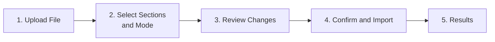
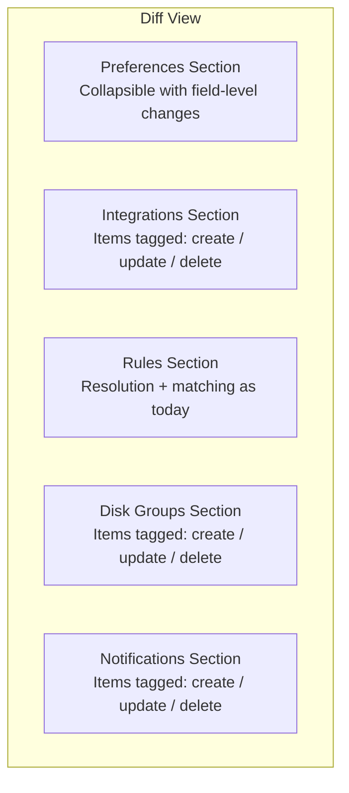
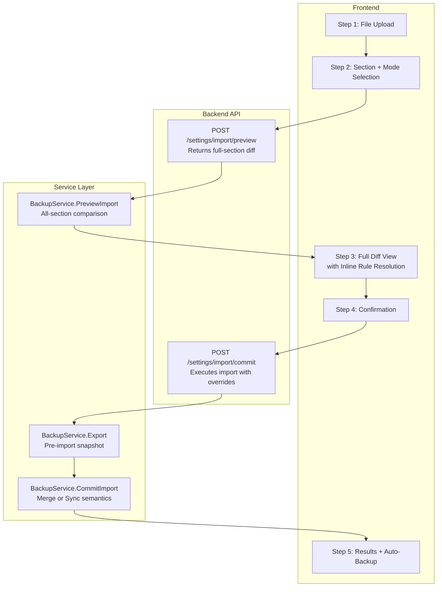

# Backup/Restore Rework — Smarter, Safer, Consistent UX

> **Status:** 📋 Planned
> **Created:** 2026-03-22
> **Branch:** from `feature/2.0`
> **Supersedes:** `20260316T1319Z-backup-restore-robustness-overhaul.md` (Phase 1-3 were completed on 1.x; this plan addresses the remaining gaps and new requirements for 2.0)

## Background

The original backup/restore overhaul (completed in 1.x) fixed critical bugs: rule import order, upsert semantics for integrations/notifications, placeholder credential handling, validation, and the interactive rule resolution dialog. However, two significant gaps remain:

1. **Replace mode is still a sledgehammer.** [`deleteForReplace()`](../../backend/internal/services/backup.go) deletes *all* rows in selected section tables (`WHERE 1 = 1`), even if the import file contains fewer items. Importing 3 rules in replace mode destroys all 50 existing rules.

2. **Preview is rules-only.** [`ImportPreview`](../../backend/internal/services/backup.go) only resolves rule→integration matching. Users cannot see what will happen to integrations, notifications, or disk groups before committing.

3. **No safety net.** There is no automatic pre-import backup. A bad replace-mode import means data loss.

4. **UX inconsistency.** Other settings tabs use icon-labeled cards with `border-b border-border` headers and SaveIndicator inline auto-save. The Backup/Restore tab uses plain cards without the icon treatment, and the import flow is a flat linear scroll rather than a guided experience.

## Goals

- **Targeted imports:** Replace mode should only affect items that correspond to entries in the import file, leaving unrelated items untouched
- **Full-section preview:** Show a complete diff of what will change for every section before committing
- **Auto-backup:** Automatically capture current state before destructive operations
- **UX consistency:** Match the visual patterns used across the rest of Settings

---

## Phase 1: Smarter Import Modes (Backend)

Replace the current blunt `deleteForReplace()` with merge/sync semantics. Rename modes for clarity.

### Step 1.1: Rename Import Modes

**Files:** `backend/internal/services/backup.go`, `frontend/app/types/api.ts`, `frontend/app/components/settings/SettingsBackupRestore.vue`, `frontend/app/i18n/locales/en.json`

| Current | New | Behavior |
|---------|-----|----------|
| `append` | `merge` | Upsert matching items, create new ones, leave existing unmatched items alone |
| `replace` | `sync` | Upsert matching items, create new ones, **delete** existing items not in the file |

Update constants:

```go
const (
    ImportModeMerge = "merge"
    ImportModeSync  = "sync"
)
```

Keep backward compatibility: if `mode == "append"` treat as `merge`; if `mode == "replace"` treat as `sync`. Log a deprecation warning.

**Tests:**
- Update existing mode tests to use new constant names
- Add `TestBackupService_Import_LegacyAppendMode` — verify old "append" still works
- Add `TestBackupService_Import_LegacySyncMode` — verify old "replace" still works

### Step 1.2: Implement Per-Item Sync for Integrations

**File:** `backend/internal/services/backup.go` — `importIntegrations()`

In sync mode, after upserting all imported integrations, delete integrations that exist in the DB but are **not** in the import file. Use `type + name` as the identity key.

```go
// After upsert loop, in sync mode:
// 1. Collect all (type, name) pairs from import
// 2. DELETE FROM integration_configs WHERE (type, name) NOT IN (imported pairs)
// 3. Also cascade-clean rules referencing deleted integrations
```

Rules referencing deleted integrations must be handled: set their `integration_id` to NULL or delete them. Prefer deletion since orphaned rules would fail the "every rule must belong to an integration" invariant.

**Tests:**
- `TestBackupService_Import_SyncMode_DeletesOrphanIntegrations` — seed 3 integrations, import 2, verify the 3rd is deleted
- `TestBackupService_Import_SyncMode_CascadeDeletesOrphanRules` — verify rules referencing deleted integrations are removed
- `TestBackupService_Import_MergeMode_PreservesUnmatchedIntegrations` — seed 3, import 2 in merge mode, verify all 3 remain

### Step 1.3: Implement Per-Item Sync for Rules

**File:** `backend/internal/services/backup.go` — `importRules()` / `importRulesWithOverrides()`

Rule identity is harder than integrations because rules don't have a natural unique key. Approach:

1. In **merge mode**: Current behavior (insert new rules, no deletion) — unchanged
2. In **sync mode**: After importing all rules, delete existing rules that were **not** matched to or created by the import. Track which existing rule IDs were "touched" (updated or matched) during the import, then `DELETE WHERE id NOT IN (touched IDs)`.

Since rules use `field + operator + value + integration_id` to match (from the existing resolution logic), this provides reasonable dedup.

**Tests:**
- `TestBackupService_Import_SyncMode_DeletesOrphanRules` — seed 5 rules, import 3 (2 match, 1 new), verify 2 unmatched rules are deleted
- `TestBackupService_Import_MergeMode_PreservesAllRules` — same setup in merge mode, all 5 original + 1 new = 6 total

### Step 1.4: Implement Per-Item Sync for Notifications

**File:** `backend/internal/services/backup.go` — `importNotificationChannels()`

Same pattern as integrations. In sync mode, after upsert loop, delete notification channels not in the import file using `type + name` as identity.

**Tests:**
- `TestBackupService_Import_SyncMode_DeletesOrphanNotifications`
- `TestBackupService_Import_MergeMode_PreservesUnmatchedNotifications`

### Step 1.5: Implement Per-Item Sync for Disk Groups

**File:** `backend/internal/services/backup.go` — `importDiskGroups()`

In sync mode, after upsert loop, delete disk groups not in the import file using `mount_path` as identity. This requires extending the DiskGroupService or handling it after the main transaction.

**Tests:**
- `TestBackupService_Import_SyncMode_DeletesOrphanDiskGroups`
- `TestBackupService_Import_MergeMode_PreservesUnmatchedDiskGroups`

---

## Phase 2: Full-Section Preview (Backend)

Expand the preview endpoint to cover all sections, not just rules.

### Step 2.1: Define Resolution Types for All Sections

**File:** `backend/internal/services/backup.go`

```go
type ImportPreview struct {
    Rules         []RuleResolution         `json:"rules"`
    Integrations  []ItemResolution         `json:"integrations"`
    Notifications []ItemResolution         `json:"notifications"`
    DiskGroups    []ItemResolution         `json:"diskGroups"`
    Preferences   *PreferencesResolution   `json:"preferences,omitempty"`
    Deletions     *DeletionPreview         `json:"deletions,omitempty"` // sync mode only
}

// ItemResolution describes what will happen to a single item during import.
type ItemResolution struct {
    Name    string        `json:"name"`
    Type    string        `json:"type,omitempty"` // for integrations/notifications
    Action  string        `json:"action"`         // "create", "update", "unchanged"
    Changes []FieldChange `json:"changes,omitempty"`
}

// FieldChange describes a single field-level change.
type FieldChange struct {
    Field    string `json:"field"`
    OldValue string `json:"oldValue"`
    NewValue string `json:"newValue"`
}

// PreferencesResolution describes changes to the singleton preferences.
type PreferencesResolution struct {
    Action  string        `json:"action"` // "update", "unchanged"
    Changes []FieldChange `json:"changes,omitempty"`
}

// DeletionPreview lists items that would be deleted in sync mode.
type DeletionPreview struct {
    Rules         []string `json:"rules,omitempty"`         // descriptions of rules to delete
    Integrations  []string `json:"integrations,omitempty"`  // names
    Notifications []string `json:"notifications,omitempty"` // names
    DiskGroups    []string `json:"diskGroups,omitempty"`    // mount paths
}
```

### Step 2.2: Implement `PreviewImport()` for All Sections

**File:** `backend/internal/services/backup.go` — `PreviewImport()`

Extend the existing method to also preview integrations, notifications, disk groups, and preferences. For each section:

1. Load current DB state
2. Compare with import data using the same identity matching as the import methods
3. Classify each item as `create`, `update`, or `unchanged`
4. For `update` items, compute field-level diffs
5. In sync mode, also compute which existing items would be deleted

The preview must respect the `sections` parameter — only preview sections the user selected for import.

**Tests:**
- `TestBackupService_PreviewImport_Integrations_CreateAndUpdate`
- `TestBackupService_PreviewImport_Notifications_CreateAndUpdate`
- `TestBackupService_PreviewImport_DiskGroups_CreateAndUpdate`
- `TestBackupService_PreviewImport_Preferences_FieldDiff`
- `TestBackupService_PreviewImport_SyncMode_ShowsDeletions`

### Step 2.3: Update Preview API Endpoint

**File:** `backend/routes/backup.go`

Update the `POST /settings/import/preview` handler to pass sections and mode to `PreviewImport()`. The request body already contains this information.

Update request type to include sections:

```go
type previewImportRequest struct {
    Payload  services.SettingsExportEnvelope `json:"payload"`
    Sections services.ImportSections         `json:"sections"`
}
```

**Tests:**
- `TestPreviewEndpoint_ReturnsFullSectionResolutions`

### Step 2.4: Update TypeScript Types

**File:** `frontend/app/types/api.ts`

Add the new interfaces to match the backend types: `ItemResolution`, `FieldChange`, `PreferencesResolution`, `DeletionPreview`. Update `ImportPreview` to include all new fields.

---

## Phase 3: Auto-Backup Before Import (Backend)

### Step 3.1: Add Pre-Import Snapshot to CommitImport

**File:** `backend/internal/services/backup.go` — `CommitImport()` and `Import()`

Before executing any import (in both methods), automatically export the sections that will be affected:

```go
func (s *BackupService) CommitImport(...) (*ImportResult, error) {
    // 1. Export current state of affected sections
    snapshot, err := s.Export(sectionsToExport(sections), "pre-import-snapshot")
    if err != nil {
        // Log warning but don't fail the import
        slog.Warn("Failed to create pre-import snapshot", "error", err)
    }

    // 2. Proceed with import...

    // 3. Include snapshot in result
    result.PreImportSnapshot = snapshot
    return result, nil
}
```

### Step 3.2: Update ImportResult Type

**File:** `backend/internal/services/backup.go`

```go
type ImportResult struct {
    PreferencesImported          bool                    `json:"preferencesImported"`
    RulesImported                int                     `json:"rulesImported"`
    RulesUnmatched               int                     `json:"rulesUnmatched"`
    IntegrationsImported         int                     `json:"integrationsImported"`
    DiskGroupsImported           int                     `json:"diskGroupsImported"`
    NotificationChannelsImported int                     `json:"notificationChannelsImported"`
    ItemsDeleted                 int                     `json:"itemsDeleted"`          // sync mode
    PreImportSnapshot            *SettingsExportEnvelope `json:"preImportSnapshot,omitempty"`
}
```

**Tests:**
- `TestBackupService_CommitImport_IncludesPreImportSnapshot`
- `TestBackupService_Import_IncludesPreImportSnapshot`

### Step 3.3: Frontend Auto-Download Safety Backup

**File:** `frontend/app/components/settings/SettingsBackupRestore.vue`

When the import result contains `preImportSnapshot` and the mode was `sync`:
1. Automatically trigger a download of the snapshot as `capacitarr-pre-import-backup-{date}.json`
2. Show a toast: "A backup of your previous settings was automatically downloaded"

When mode is `merge`:
1. Show a "Download pre-import backup" link in the results summary (don't auto-download)

---

## Phase 4: UX Consistency and Polish (Frontend)

### Step 4.1: Card Header Icon Treatment

**File:** `frontend/app/components/settings/SettingsBackupRestore.vue`

Apply the same pattern as SettingsGeneral and SettingsAdvanced:

```vue
<UiCardHeader class="border-b border-border">
  <div class="flex items-center gap-3">
    <div class="w-10 h-10 rounded-lg bg-blue-500 flex items-center justify-center">
      <DownloadIcon class="w-5 h-5 text-white" />
    </div>
    <div>
      <UiCardTitle class="text-base">Export Settings</UiCardTitle>
      <UiCardDescription>...</UiCardDescription>
    </div>
  </div>
</UiCardHeader>
```

| Card | Icon | Color |
|------|------|-------|
| Export | `DownloadIcon` | `bg-blue-500` |
| Import | `UploadIcon` | `bg-green-500` |

### Step 4.2: Stepper-Based Import Flow

**File:** `frontend/app/components/settings/SettingsBackupRestore.vue` (refactor)

Replace the current flat layout with a numbered stepper using existing shadcn-vue primitives (no new UI component needed — use `UiTabs` or a custom reactive `step` ref with conditional rendering):



Implementation approach:
- A `currentStep` ref (1-5) drives which panel is visible
- Each step card has Back/Next buttons at the bottom
- Step indicators at the top show progress (numbered circles with connecting lines — a simple flexbox row, no new shadcn component needed)
- Step 3 is the new full-section diff view from Phase 2
- Step 4 is a confirmation summary with the destructive action warning for sync mode

### Step 4.3: Full Diff View Component

**File:** New component `frontend/app/components/settings/SettingsImportDiff.vue`



Each section is a collapsible card (using `UiCollapsible`) showing:
- **Badge per item:** green `create`, yellow `update`, red `delete` (sync mode), gray `unchanged`
- **Field-level diffs** for `update` items: old value → new value
- **Item count summary** in the section header: "3 items: 1 new, 1 updated, 1 deleted"

For rules, integrate the existing resolution logic from `SettingsImportResolution.vue` inline rather than as a separate dialog. Users can resolve unmatched rules directly in the diff view.

### Step 4.4: Inline Rule Resolution (Replaces Dialog)

**File:** Refactor `frontend/app/components/settings/SettingsImportResolution.vue`

Move from a full-screen dialog to an inline section within the diff view. Each unmatched/fallback rule shows its resolution dropdown directly in the diff card. This reduces the cognitive jump from "reviewing changes" to "resolving conflicts" — it all happens in Step 3.

The dialog component can be removed or kept as a thin wrapper if needed for mobile.

### Step 4.5: Update i18n Keys

**File:** `frontend/app/i18n/locales/en.json`

Add new keys for:
- Mode rename: merge/sync labels and descriptions
- Stepper step labels
- Diff view labels: create/update/delete/unchanged badges
- Field change labels
- Auto-backup toast messages
- Per-section summary counts

---

## Phase 5: OpenAPI Spec and Route Tests

### Step 5.1: Update OpenAPI Spec

**File:** `docs/api/openapi.yaml`

Update the settings export/import endpoint documentation to reflect:
- New mode values (`merge`, `sync`) with backward-compatible old values
- Updated `ImportPreview` response schema with all-section resolutions
- Updated `ImportResult` response schema with `preImportSnapshot` and `itemsDeleted`

### Step 5.2: Update Route Tests

**File:** `backend/routes/backup_test.go`

Add/update route-level tests:
- `TestImportPreview_ReturnsAllSections` — verify response includes integration/notification/diskgroup/preferences resolutions
- `TestImportCommit_SyncMode_DeletesOrphans` — end-to-end sync mode test via HTTP
- `TestImportCommit_IncludesSnapshot` — verify pre-import snapshot in response
- `TestImportCommit_LegacyModeCompat` — verify old "append"/"replace" values still work

---

## Architecture Diagram



## Files Affected

| File | Phase | Changes |
|------|-------|---------|
| `backend/internal/services/backup.go` | 1, 2, 3 | Sync-mode orphan deletion, full-section preview, pre-import snapshot |
| `backend/internal/services/backup_test.go` | 1, 2, 3 | ~15 new test cases |
| `backend/routes/backup.go` | 2 | Updated preview request handling |
| `backend/routes/backup_test.go` | 5 | Updated route tests |
| `frontend/app/types/api.ts` | 2, 4 | New resolution/diff types, updated ImportPreview/ImportResult |
| `frontend/app/components/settings/SettingsBackupRestore.vue` | 4 | Stepper refactor, icon headers, auto-backup download |
| `frontend/app/components/settings/SettingsImportDiff.vue` | 4 | New component: full-section diff view |
| `frontend/app/components/settings/SettingsImportResolution.vue` | 4 | Refactor from dialog to inline |
| `frontend/app/i18n/locales/en.json` | 4 | New i18n keys |
| `docs/api/openapi.yaml` | 5 | Updated endpoint docs |

## Risk Assessment

| Risk | Mitigation |
|------|------------|
| Sync-mode orphan deletion could surprise users | Full preview + confirmation step shows exactly what will be deleted |
| Pre-import snapshot adds response payload size | Snapshot is omitted for merge mode by default; only included for sync |
| Stepper UX adds complexity | Each step is simple and focused; no new shadcn components needed |
| Backward compatibility for mode names | Old values are accepted with deprecation logging |
| Disk group sync outside transaction | Same SQLite limitation as current code; upsert + delete is idempotent |
