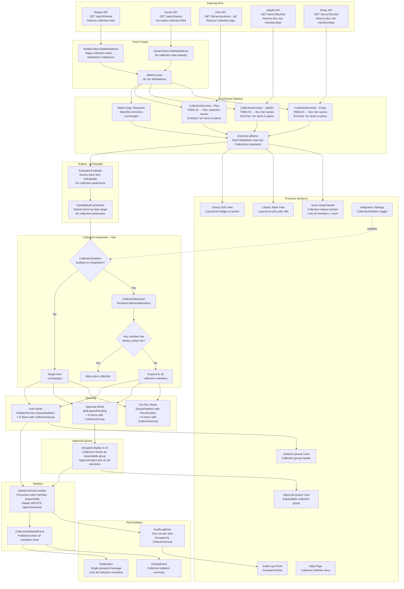
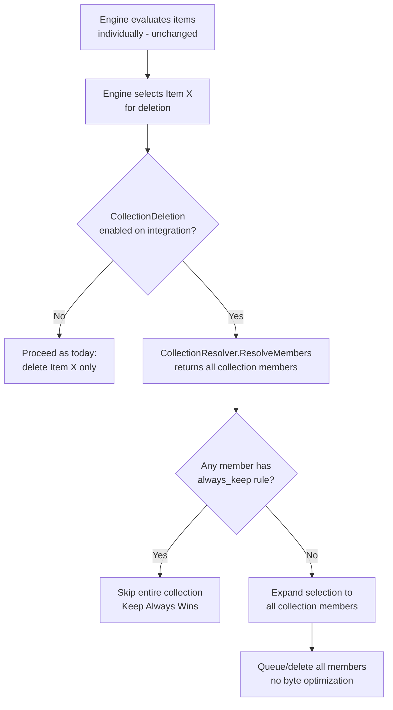
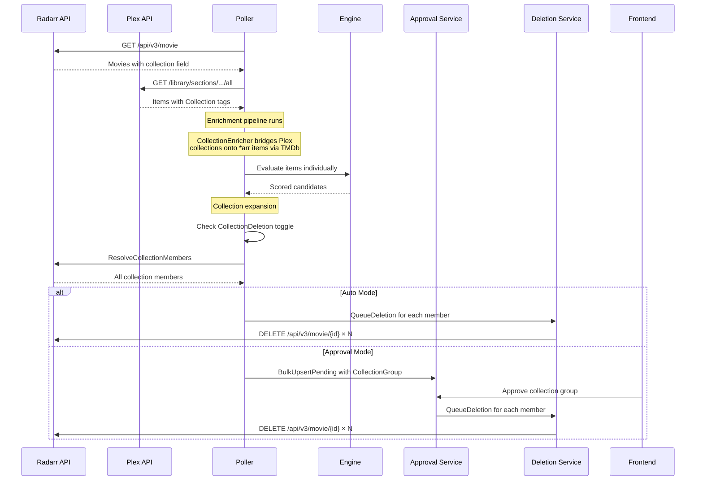

# Collection-Based Deletion

**Created:** 2026-03-22T21:21Z
**Status:** 📋 Plan — Awaiting Approval
**Branch:** `feature/collection-deletion` (from `feature/2.0`)

---

## Overview

When a user enables "Collection Deletion" on an integration, deleting any item that belongs to a collection causes **all other members of that collection** to be deleted as well. The engine continues to score and select items individually (unchanged). The collection expansion is a post-selection step that inflates a single deletion candidate into the full set of collection members.

Each integration defines what "collection" means in its own context:

| Integration | Collection Concept | Source |
|-------------|-------------------|--------|
| **Radarr** | TMDb Movie Collection | Radarr API `collection` field on each movie |
| **Plex** | Plex library collections | Plex API `Collection` tags on metadata (can include both movies AND TV shows) |
| **Jellyfin** | Box Sets | Jellyfin API `BoxSet` item type (can include both movies AND TV shows) |
| **Emby** | Box Sets | Emby API `BoxSet` item type (can include both movies AND TV shows) |
| **Sonarr** | No native collections | Sonarr v3/v4 API has no `collection` field on series — TMDb collections are movie-only. However, Sonarr items CAN receive collection data via media server enrichment (e.g., a Plex collection named "Star Trek" that groups TV shows). |
| **Lidarr** | N/A | Music has no collection concept |
| **Readarr** | N/A | Books has no collection concept |

**Key design principle:** No byte-saving optimization. When an item is expanded into its collection, all members are deleted regardless of how much space was needed. The user opted into this behavior.

---

## Full Architecture Diagram

This diagram shows how collection data flows through the entire Capacitarr architecture — from external APIs, through enrichment, into the engine, out to the approval queue, deletion service, audit log, and frontend.



### Collection Data Sources Summary

| Integration | Native Collections | Via Enrichment | Can Implement CollectionResolver |
|-------------|-------------------|----------------|--------------------------------|
| **Radarr** | Yes — TMDb movie collections | Also receives from Plex/JF/Emby enrichment | Yes — native API field |
| **Sonarr** | No — TMDb collections are movie-only | Yes — Plex/JF/Emby collections can include TV shows | Possible via enriched data only |
| **Lidarr** | No | No — music servers rarely have collection concepts | No |
| **Readarr** | No — has `seriesTitle` but not mapped | No | Possible future: book series via `seriesTitle` |
| **Plex** | Defines collections | N/A — Plex IS the source | N/A — enrichment source, not MediaSource |
| **Jellyfin** | Defines Box Sets | N/A — Jellyfin IS the source | N/A — enrichment source, not MediaSource |
| **Emby** | Defines Box Sets | N/A — Emby IS the source | N/A — enrichment source, not MediaSource |
| **Tautulli** | No | N/A | No — analytics only |
| **Seerr** | No | N/A | No — request tracking only |
| **Jellystat** | No | N/A | No — analytics only |

---

## Lucide Icons

All collection indicators use **Lucide icons** (`lucide-vue-next`). No emojis.

| Usage | Icon | Import |
|-------|------|--------|
| Collection badge/indicator | `LayersIcon` | `import { LayersIcon } from 'lucide-vue-next'` |
| Collection warning/alert | `AlertTriangleIcon` | Already imported in multiple components |
| Collection member expand | `ChevronRightIcon` | Already imported in ApprovalQueueCard |

The `LayersIcon` (stacked layers) best represents "grouped items" and is visually distinct from existing icons in the UI. Fallback option: `BoxesIcon` (multiple boxes).

**Note:** The current codebase uses `📦` emoji nowhere — all existing icons are Lucide. The feasibility analysis used emoji placeholders; all will be replaced with `LayersIcon` in implementation.

---

## Architecture



### What does NOT change

- `engine.Evaluator.Evaluate()` — scores items individually
- `engine.CandidatesForDeletion()` — selects candidates by byte target
- `engine.calculateScore()` — no collection-aware scoring
- `engine.applyRules()` — rules evaluate per-item

### What DOES change

- `poller.evaluateAndCleanDisk()` — post-selection collection expansion
- `db.IntegrationConfig` — new `CollectionDeletion` field
- `db.ApprovalQueueItem` — new `CollectionGroup` field
- `db.AuditLogEntry` — new `CollectionGroup` field
- `integrations.types.go` — new `CollectionResolver` interface
- `integrations.radarr.go` — implement `CollectionResolver`
- `integrations.enrichers.go` — new collection enrichers for Plex, Jellyfin, Emby
- Approval service — collection-grouped approve/reject/snooze
- Deletion service — multi-item collection deletion
- Notification sender — collection-grouped messages
- Frontend — collection indicators across all surfaces
- Help page — comprehensive collection deletion documentation

---

## Implementation Phases

### Phase 1: Backend Data Model and Radarr Collection Resolution

**Goal:** Enable Radarr to report collection membership and expose it through the API.

#### Step 1.1: Database Schema Changes (v2 Baseline)

Since 2.0 is a breaking release, add fields directly to the existing v2 baseline migration — no new migration file.

Add to the existing `CREATE TABLE` statements in `00001_v2_baseline.sql`:

```sql
-- In existing CREATE TABLE integration_configs:
collection_deletion BOOLEAN NOT NULL DEFAULT FALSE

-- In existing CREATE TABLE approval_queue:
collection_group TEXT NOT NULL DEFAULT ''

-- In existing CREATE TABLE audit_log:
collection_group TEXT NOT NULL DEFAULT ''
```

**Files:**
- `internal/db/models.go` — add `CollectionDeletion` to `IntegrationConfig`, `CollectionGroup` to `ApprovalQueueItem` and `AuditLogEntry`
- `internal/db/migrations/00001_v2_baseline.sql` — modify existing baseline to include collection fields

#### Step 1.2: Radarr Collection Data Mapping

Map the `collection` field from Radarr v3 API responses onto `MediaItem.Collections`:

```go
// radarrMovie struct addition
type radarrMovie struct {
    // ... existing fields ...
    Collection *struct {
        Name   string `json:"name"`
        TmdbID int    `json:"tmdbId"`
    } `json:"collection,omitempty"`
}
```

In `GetMediaItems()`, populate `MediaItem.Collections` from `radarrMovie.Collection.Name`.

**Files:**
- `internal/integrations/radarr.go` — add `Collection` to struct, map to `MediaItem.Collections`
- `internal/integrations/radarr_test.go` — test collection data mapping

#### Step 1.3: CollectionResolver Interface

```go
// CollectionResolver is implemented by integrations that can resolve
// which other items share a collection with a given item.
type CollectionResolver interface {
    // ResolveCollectionMembers returns all items in the same collection(s)
    // as the given item, INCLUDING the item itself.
    // Returns nil/empty if the item has no collection membership.
    ResolveCollectionMembers(item MediaItem) ([]MediaItem, error)
}
```

**Files:**
- `internal/integrations/types.go` — add `CollectionResolver` interface

#### Step 1.4: Radarr CollectionResolver Implementation

Radarr implementation fetches all movies, groups by `collection.tmdbId`, and returns members of the matching collection.

**Optimization:** Cache the full movie list for the duration of a poll cycle to avoid redundant API calls when multiple items from the same collection are selected.

**Files:**
- `internal/integrations/radarr.go` — implement `CollectionResolver`
- `internal/integrations/radarr_test.go` — test collection resolution

#### Step 1.5: IntegrationService Updates

Add service methods:
- `IntegrationService.GetConfig(id)` — return full config including `CollectionDeletion` field
- Update existing create/update methods to handle `CollectionDeletion` toggle

**Files:**
- `internal/services/integration.go` — handle new field in CRUD operations
- `internal/services/integration_test.go` — tests
- `routes/integrations.go` — expose `CollectionDeletion` in API responses

#### Step 1.6: Integration Registry Collection Support

Add `CollectionResolver` capability discovery to `IntegrationRegistry`:

```go
func (r *IntegrationRegistry) CollectionResolvers() map[uint]CollectionResolver
func (r *IntegrationRegistry) CollectionResolver(integrationID uint) (CollectionResolver, bool)
```

**Files:**
- `internal/integrations/registry.go` — add collection resolver registration/lookup
- `internal/integrations/registry_test.go` — tests

---

### Phase 2: Collection Expansion in the Poller

**Goal:** When a candidate is selected for deletion and its integration has collection deletion enabled, expand the selection to include all collection members.

#### Step 2.1: Collection Expansion Logic in evaluateAndCleanDisk

After a candidate is selected but before it's queued for deletion/approval, check if collection deletion is enabled and expand:

```go
// Pseudocode in evaluateAndCleanDisk()
for _, ev := range candidates {
    // ... existing skip logic (snooze, dedup, zero score) ...

    itemsToProcess := []expandedItem{{item: ev.Item, score: ev.Score, factors: ev.Factors}}

    // Collection expansion
    config, _ := integrationSvc.GetConfig(ev.Item.IntegrationID)
    if config != nil && config.CollectionDeletion {
        if resolver, ok := registry.CollectionResolver(ev.Item.IntegrationID); ok {
            members, err := resolver.ResolveCollectionMembers(ev.Item)
            if err == nil && len(members) > 1 {
                // Check if any member is protected by always_keep
                if anyMemberProtected(members, evalResult) {
                    slog.Info("Collection skipped — member has always_keep rule",
                        "component", "poller", "trigger", ev.Item.Title)
                    continue
                }
                // Expand to all members
                itemsToProcess = expandToCollection(members, ev, evalResult)
            }
        }
    }

    // Queue all items (single item or full collection)
    for _, expanded := range itemsToProcess {
        // ... existing queueing logic (auto/approval/dry-run) ...
        // Set CollectionGroup = collection name on approval/audit entries
    }
}
```

**Key behaviors:**
- If ANY collection member has `always_keep` → skip the entire collection
- Snoozed members → skip the entire collection (or just that member? design decision — recommend: skip entire collection)
- bytesFreed accumulates the full collection size (no optimization)
- Duplicate checking: if Item A and Item B are both in the same collection and both selected as candidates, only expand once

**Files:**
- `internal/poller/evaluate.go` — collection expansion logic
- `internal/poller/evaluate_test.go` — comprehensive tests

#### Step 2.2: Approval Queue Collection Grouping

When expanding into approval mode, all collection members share the same `CollectionGroup` value:

```go
pendingBatch = append(pendingBatch, db.ApprovalQueueItem{
    // ... existing fields ...
    CollectionGroup: collectionName, // e.g., "Sonic the Hedgehog Collection"
})
```

The approval service must handle:
- **Approve group:** Approving any item with a `CollectionGroup` approves all items in that group
- **Reject/snooze group:** Same — acts on the entire group
- **Dismiss group:** Dismisses all items in the group
- **Queue reconciliation:** Treats collection groups atomically

**Files:**
- `internal/services/approval.go` — add collection-aware approve/reject/snooze/dismiss
- `internal/services/approval_test.go` — tests

#### Step 2.3: Deletion Service Collection Handling

In auto mode, collection members are queued as individual `DeleteJob` entries. The deletion service processes them sequentially (existing behavior). Add a `CollectionGroup` field to `DeleteJob` for logging/notification purposes.

**Files:**
- `internal/services/deletion.go` — add `CollectionGroup` to `DeleteJob`
- `internal/services/deletion_test.go` — tests

#### Step 2.4: Audit Log Collection Support

Audit entries include `CollectionGroup` so historical deletions can be grouped:

```go
auditEntry := db.AuditLogEntry{
    // ... existing fields ...
    CollectionGroup: collectionName,
}
```

**Files:**
- `internal/services/auditlog.go` — pass through `CollectionGroup`
- `internal/services/auditlog_test.go` — tests

---

### Phase 3: Collection Data Enrichment (Plex, Jellyfin, Emby)

**Goal:** Bridge collection data from media servers to *arr items so collections are visible even when the *arr integration itself does not provide collection data.

#### Step 3.1: CollectionEnricher (Plex → *arr items)

New enricher that:
1. Fetches Plex items with their collection tags (via existing `getMediaItems()`)
2. Builds a TMDb ID → collection names map
3. Enriches *arr items by matching TMDb IDs and populating `MediaItem.Collections`

```go
type CollectionEnricher struct {
    name     string
    priority int
    provider CollectionDataProvider
}
```

Where `CollectionDataProvider` is a new interface:
```go
type CollectionDataProvider interface {
    GetCollectionMemberships() (map[int][]string, error) // TMDb ID → collection names
}
```

Plex already has `getMediaItems()` which returns items with `Collections` populated. Just need to build the TMDb → collections map from that data.

**Files:**
- `internal/integrations/enrichers.go` — add `CollectionEnricher`
- `internal/integrations/enrichment_pipeline.go` — integrate into pipeline stats counting
- `internal/integrations/plex.go` — implement `CollectionDataProvider`
- Tests for all new code

#### Step 3.2: CollectionEnricher (Jellyfin → *arr items)

Jellyfin Box Sets can be fetched via:
```
GET /Items?IncludeItemTypes=BoxSet&Recursive=true&Fields=ProviderIds
```

Then for each box set, fetch its children:
```
GET /Items?ParentId={boxSetId}&Fields=ProviderIds
```

Build TMDb ID → box set name map, enrich *arr items.

**Files:**
- `internal/integrations/jellyfin.go` — implement `CollectionDataProvider`
- `internal/integrations/jellyfin_test.go` — tests

#### Step 3.3: CollectionEnricher (Emby → *arr items)

Same API pattern as Jellyfin (forked codebase):
```
GET /Items?IncludeItemTypes=BoxSet&Recursive=true&Fields=ProviderIds
```

**Files:**
- `internal/integrations/emby.go` — implement `CollectionDataProvider`
- `internal/integrations/emby_test.go` — tests

#### Step 3.4: Register Collection Enrichers in Pipeline

Add collection enrichers to `BuildEnrichmentPipeline()` at an appropriate priority (e.g., 50 — after watch data and requests, before cross-reference).

**Files:**
- `internal/integrations/enrichers.go` — register in `BuildEnrichmentPipeline()`

#### Step 3.5: Cross-Integration Collection Resolution

When Plex reports collection data but the deletion happens through Radarr, the `CollectionResolver` must cross-reference. Two approaches:

**Approach A (preferred):** Since Plex collections get enriched onto *arr `MediaItem` objects (via the enrichment pipeline in Step 3.1), Radarr's `CollectionResolver` can use the enriched `MediaItem.Collections` field instead of re-querying the Radarr API. This means the resolver checks the already-fetched items list.

**Approach B:** Each media server integration implements `CollectionResolver` independently, resolving TMDb IDs of collection members, then the poller maps those back to *arr items for deletion.

Approach A is cleaner because the enrichment pipeline already bridges the data gap. The `CollectionResolver` just needs access to the full items list.

**Files:**
- Depends on chosen approach — update `CollectionResolver` signature if needed

---

### Phase 4: Frontend — Collection Indicators

**Goal:** Communicate collection membership clearly across all UI surfaces.

#### Step 4.1: API Type Updates

Update TypeScript interfaces to include collection data:

```typescript
// types/api.ts
export interface MediaItem {
    // ... existing fields ...
    collections?: string[];
}

export interface ApprovalQueueItem {
    // ... existing fields ...
    collectionGroup?: string;
}

export interface AuditLogEntry {
    // ... existing fields ...
    collectionGroup?: string;
}

export interface IntegrationConfig {
    // ... existing fields ...
    collectionDeletion: boolean;
}

// New type for collection member details
export interface CollectionMember {
    title: string;
    year?: number;
    sizeBytes: number;
    externalId: string;
    posterUrl?: string;
}
```

**Files:**
- `frontend/app/types/api.ts`

#### Step 4.2: MediaPosterCard — Collection Badge

Add a collection indicator to the bottom-left of the poster card (mirrors the existing season count badge in bottom-right):

```vue
<!-- Bottom-left: Collection badge -->
<div
  v-if="collectionName"
  class="absolute bottom-1.5 left-1.5 rounded-full bg-indigo-500/70 backdrop-blur-sm px-1.5 py-0.5 text-[10px] font-medium text-white flex items-center gap-0.5"
  :title="collectionName"
>
  <LayersIcon class="w-2.5 h-2.5" />
  <span class="max-w-16 truncate">{{ collectionShortName }}</span>
</div>
```

New props: `collectionName?: string`, `collectionMemberCount?: number`

**Files:**
- `frontend/app/components/MediaPosterCard.vue`

#### Step 4.3: LibraryTable — Collection Indicator in Table Rows

In the table view, show a small collection pill under the title:

```vue
<div v-if="entry.item.collections?.length" class="flex items-center gap-1 mt-0.5">
  <LayersIcon class="w-3 h-3 text-indigo-400" />
  <span class="text-[10px] text-indigo-400 truncate max-w-40">
    {{ entry.item.collections[0] }}
  </span>
</div>
```

Also add a collection filter to the existing filter bar (toggle: "In collection" / "All").

**Files:**
- `frontend/app/components/LibraryTable.vue`

#### Step 4.4: ScoreDetailModal — Collection Impact Section

Add a new section after Custom Rules and before Final Score:

```vue
<!-- Collection Impact Section -->
<div
  v-if="collectionEnabled && collectionMembers.length > 0"
  class="rounded-lg border border-indigo-500/30 bg-indigo-500/5 p-4 space-y-3"
>
  <div class="flex items-center gap-2 text-indigo-500 dark:text-indigo-400">
    <LayersIcon class="w-4 h-4" />
    <span class="text-sm font-medium">{{ collectionName }}</span>
  </div>
  <div class="flex items-center gap-1.5 text-xs text-amber-500 dark:text-amber-400">
    <AlertTriangleIcon class="w-3.5 h-3.5 shrink-0" />
    <span>Collection deletion enabled — deleting this item also deletes:</span>
  </div>
  <div class="space-y-1 ml-5">
    <div v-for="member in otherCollectionMembers" :key="member.externalId"
         class="flex items-center justify-between text-xs text-muted-foreground">
      <span class="truncate">{{ member.title }} ({{ member.year }})</span>
      <span class="font-mono tabular-nums shrink-0 ml-2">{{ formatBytes(member.sizeBytes) }}</span>
    </div>
  </div>
  <div class="flex items-center justify-between pt-2 border-t border-indigo-500/20">
    <span class="text-xs text-muted-foreground">Total collection size</span>
    <span class="text-xs font-mono tabular-nums font-semibold">
      {{ formatBytes(totalCollectionSize) }}
    </span>
  </div>
</div>
```

**Files:**
- `frontend/app/components/ScoreDetailModal.vue`

#### Step 4.5: ApprovalQueueCard — Collection Group Display

Extend the existing show/season grouping pattern to support collection groups:

- Collection groups use `CollectionGroup` field to cluster approval queue items
- Grid view: single poster card with `LayersIcon` badge and member count
- List view: expandable group with chevron, listing members with individual scores/sizes
- Approve/reject/snooze/dismiss acts on the entire collection group atomically

The `useApprovalQueue` composable needs to recognize `collectionGroup` as a grouping field (alongside the existing `showTitle` grouping for TV seasons).

**Files:**
- `frontend/app/components/ApprovalQueueCard.vue`
- `frontend/app/composables/useApprovalQueue.ts`

#### Step 4.6: AuditLogPanel — Collection Group Rendering

Group audit entries with the same `collectionGroup` and close timestamps:

```vue
<!-- Collection group header -->
<div v-if="entry.collectionGroup" class="flex items-center gap-1.5 mb-1">
  <LayersIcon class="w-3 h-3 text-indigo-400" />
  <span class="text-[10px] text-indigo-400 font-medium">{{ entry.collectionGroup }}</span>
</div>
```

**Files:**
- `frontend/app/components/AuditLogPanel.vue`

#### Step 4.7: DeletionQueueCard — Collection Context

When items in the deletion queue share a `CollectionGroup`, show a header:

```vue
<div class="flex items-center gap-1.5 text-xs text-indigo-400 mb-1">
  <LayersIcon class="w-3 h-3" />
  <span>{{ job.collectionGroup }} ({{ collectionJobCount }} items)</span>
</div>
```

**Files:**
- `frontend/app/components/DeletionQueueCard.vue`

---

### Phase 5: Integration Settings UI

**Goal:** Add the per-integration collection deletion toggle with context-appropriate help.

#### Step 5.1: Integration Form Toggle

Add a toggle to the integration editing form, shown only for Radarr, Plex, Jellyfin, and Emby:

```vue
<div v-if="supportsCollectionDeletion(integration.type)" class="space-y-2">
  <div class="flex items-center justify-between">
    <div>
      <UiLabel>Collection Deletion</UiLabel>
      <p class="text-xs text-muted-foreground mt-0.5">
        {{ collectionDeletionDescription(integration.type) }}
      </p>
    </div>
    <UiSwitch v-model="integration.collectionDeletion" />
  </div>
  <NuxtLink to="/help#collection-deletion" class="text-xs text-primary hover:underline inline-flex items-center gap-1">
    <InfoIcon class="w-3 h-3" />
    Learn more about collection deletion
  </NuxtLink>
</div>
```

Per-integration description text:

- **Radarr:** "Uses TMDb movie collections — curated franchise groupings like 'The Lord of the Rings Collection'."
- **Plex:** "Uses Plex library collections. Includes automatic and user-created collections. Custom collections can group unrelated media."
- **Jellyfin:** "Uses Jellyfin Box Sets — groups of related movies that were auto-detected or manually organized."
- **Emby:** "Uses Emby Box Sets — groups of related movies that were auto-detected or manually organized."

**Files:**
- `frontend/app/components/settings/SettingsIntegrations.vue`

---

### Phase 6: Notifications

**Goal:** Collection deletions produce a single grouped notification instead of N individual ones.

#### Step 6.1: Collection-Grouped Notification Events

The deletion service, upon completing all members of a collection, publishes a `CollectionDeletedEvent`:

```go
type CollectionDeletedEvent struct {
    CollectionName string
    Members        []CollectionDeletedMember
    TotalSizeBytes int64
    TriggerTitle   string // The item that originally triggered the collection deletion
    IntegrationID  uint
}

type CollectionDeletedMember struct {
    Title     string
    Year      int
    SizeBytes int64
}
```

**Files:**
- `internal/events/types.go` — add event types
- `internal/services/deletion.go` — publish collection event when batch completes
- `internal/notifications/sender.go` — format collection notification
- `internal/notifications/discord.go` — Discord embed for collection deletion
- `internal/notifications/apprise.go` — Apprise message for collection deletion
- Tests for all

---

### Phase 7: Help Page Documentation

**Goal:** Comprehensive, friendly explanation of collection deletion with clear warnings.

#### Step 7.1: Help Page Section

Add a "Collection Deletion" section to `help.vue` covering:

1. **What it does** — plain-language explanation with example
2. **How collections are defined** — per-integration breakdown
3. **When to use it** — franchise cleanup, series management
4. **Risks and warnings:**
   - Overshoot: may free significantly more space than needed
   - Large collections: a movie in "Marvel Cinematic Universe" could cascade to 30+ deletions
   - Plex custom collections: arbitrary user groupings, unlike TMDb's curated ones
   - Protected items in collections: always_keep on one member protects all
   - Snoozed collections: snoozing one member snoozes the group
   - Irreversible: deleted files cannot be recovered
5. **Configuration** — how to enable/disable per integration
6. **FAQ** — common questions

**Files:**
- `frontend/app/pages/help.vue`
- `frontend/app/locales/*.json` — i18n keys for collection deletion help text

---

### Phase 8: Testing

All test files follow existing patterns using the in-memory SQLite test utilities.

#### Step 8.1: Backend Unit Tests

- `radarr_test.go` — collection data mapping, `CollectionResolver` tests
- `evaluate_test.go` — collection expansion, protection inheritance, dedup
- `approval_test.go` — collection-grouped approve/reject/snooze/dismiss
- `deletion_test.go` — multi-item collection deletion
- `auditlog_test.go` — collection group field
- `enrichers_test.go` — `CollectionEnricher` for Plex, Jellyfin, Emby
- `integration_test.go` — `CollectionDeletion` toggle CRUD

#### Step 8.2: Frontend Tests

If the project has frontend tests, add:
- Collection badge rendering on `MediaPosterCard`
- Collection group rendering in `ApprovalQueueCard`
- `useApprovalQueue` composable collection grouping logic

#### Step 8.3: Run make ci

Verify all changes pass `make ci` before declaring any phase complete.

---

## Data Flow Summary



---

## Edge Cases

| Scenario | Behavior |
|----------|----------|
| Item in multiple collections | Use the first collection. Log a warning. (Future: let user pick priority collection.) |
| Collection member not in library | Ignore — only delete items that actually exist in the *arr |
| Item A and Item B both selected, both in same collection | Expand once, skip duplicates |
| Collection member has always_keep rule | Entire collection is protected (Keep Always Wins) |
| Collection member is snoozed | Entire collection is skipped for this cycle |
| Collection has 1 member (just the trigger item) | No expansion — behaves like collection deletion is off |
| Integration has CollectionDeletion toggled off mid-cycle | Check at expansion time — if off, no expansion |
| Dry-run mode | Collection expansion still happens (shows what would be deleted), but no actual deletion |
| User-initiated delete (Library page force delete) | Respects collection deletion setting — if enabled, force-deleting one item force-deletes the whole collection |

---

## API Endpoint Changes

| Endpoint | Change |
|----------|--------|
| `GET /api/v1/integrations` | Response includes `collectionDeletion: bool` |
| `PUT /api/v1/integrations/:id` | Accepts `collectionDeletion: bool` |
| `GET /api/v1/preview` | `MediaItem` includes `collections: string[]` |
| `GET /api/v1/approval-queue` | Items include `collectionGroup: string` |
| `POST /api/v1/approval-queue/:id/approve` | Approves all items in the same `collectionGroup` |
| `POST /api/v1/approval-queue/:id/reject` | Rejects/snoozes all items in the same `collectionGroup` |
| `GET /api/v1/audit` | Entries include `collectionGroup: string` |
| `GET /api/v1/deletion-queue` | Jobs include `collectionGroup: string` |

---

## Migration Notes

- Since 2.0 is a breaking release, collection fields are part of the v2 baseline schema — no separate migration file
- New columns have defaults (empty string / false), so GORM AutoMigrate handles them cleanly
- No data migration needed — existing items simply have no collection data
- The feature is opt-in per integration, so zero behavior change for users who don't enable it
