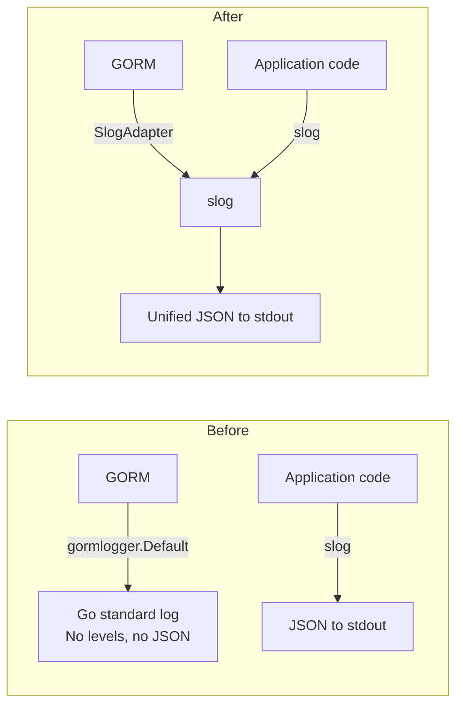

# GORM→slog Adapter: Unified Structured Logging

**Status:** ✅ Complete
**Created:** 2026-03-23T16:48Z
**Completed:** 2026-03-23T16:57Z

## Problem

GORM uses Go's standard `log` package internally via [`gormlogger.Default`](capacitarr/backend/internal/db/db.go:32). When `DEBUG=true`, this produces unstructured log lines like:

```
2026/03/23 16:46:04 /app/backend/internal/services/approval.go:440
[2.401ms] [rows:178] SELECT * FROM `approval_queue` ORDER BY created_at desc LIMIT 1000
```

These lines have:
- **No log level** — no `INFO`, `DEBUG`, `WARN`, or `ERROR` prefix
- **No JSON structure** — plain text, not parseable by log aggregators
- **No `component` field** — impossible to filter GORM logs from application logs
- **Inconsistent format** — interleaved with slog's JSON output, making logs hard to read

Meanwhile, all application code uses `slog` and produces structured JSON:

```json
{"time":"2026-03-23T16:44:43.600Z","level":"INFO","msg":"Database initialized successfully","component":"db","path":"/config/capacitarr.db"}
```

## Solution

Create a custom GORM logger adapter that implements [`gormlogger.Interface`](https://pkg.go.dev/gorm.io/gorm/logger#Interface) and delegates all output to `log/slog`. This unifies all log output under a single structured format with proper levels.

### GORM Logger Interface

The interface we need to implement:

```go
type Interface interface {
    LogMode(LogLevel) Interface
    Info(context.Context, string, ...interface{})
    Warn(context.Context, string, ...interface{})
    Error(context.Context, string, ...interface{})
    Trace(ctx context.Context, begin time.Time, fc func() (sql string, rowsAffected int64), err error)
}
```

### Level Mapping

| GORM Method | slog Level | When |
|-------------|-----------|------|
| `Info()` | `slog.LevelDebug` | General GORM info messages — mapped to DEBUG because these are verbose internal details |
| `Warn()` | `slog.LevelWarn` | Slow SQL queries, unindexed queries |
| `Error()` | `slog.LevelError` | SQL errors, connection failures |
| `Trace()` — success | `slog.LevelDebug` | Normal SQL query execution |
| `Trace()` — slow query | `slog.LevelWarn` | Queries exceeding the slow threshold |
| `Trace()` — error | `slog.LevelError` | Failed SQL queries |

### Output Format

After the change, GORM SQL queries will produce structured JSON like:

```json
{"time":"2026-03-23T16:46:04.000Z","level":"DEBUG","msg":"SQL query","component":"gorm","file":"approval.go:440","duration_ms":2.401,"rows":178,"sql":"SELECT * FROM `approval_queue` ORDER BY created_at desc LIMIT 1000"}
```

Slow queries:

```json
{"time":"2026-03-23T16:46:04.000Z","level":"WARN","msg":"slow SQL query","component":"gorm","file":"approval.go:440","duration_ms":502.3,"rows":178,"threshold_ms":200,"sql":"SELECT * FROM ..."}
```

Errors:

```json
{"time":"2026-03-23T16:46:04.000Z","level":"ERROR","msg":"SQL error","component":"gorm","file":"approval.go:440","duration_ms":1.2,"error":"UNIQUE constraint failed: ...","sql":"INSERT INTO ..."}
```

## Architecture



## Implementation Steps

### Step 1: Create the GORM slog adapter ✅

Create `capacitarr/backend/internal/logger/gorm.go` implementing `gormlogger.Interface`:

- **Struct:** `SlogAdapter` with fields for `slowThreshold time.Duration` and `level gormlogger.LogLevel`
- **Constructor:** `NewGormLogger(slowThreshold time.Duration) *SlogAdapter`
- **`LogMode(level)`** — returns a new `SlogAdapter` with the given level (immutable pattern matching GORM convention)
- **`Info(ctx, msg, args...)`** — delegates to `slog.Debug()` with `component=gorm` (GORM info is verbose, maps to debug)
- **`Warn(ctx, msg, args...)`** — delegates to `slog.Warn()` with `component=gorm`
- **`Error(ctx, msg, args...)`** — delegates to `slog.Error()` with `component=gorm`
- **`Trace(ctx, begin, fc, err)`** — the main method for SQL logging:
  - Calls `fc()` to get the SQL string and row count
  - Computes elapsed duration
  - If `err != nil` and not `gorm.ErrRecordNotFound`: logs at `slog.Error` with `error`, `duration_ms`, `rows`, `sql`
  - Else if elapsed > `slowThreshold`: logs at `slog.Warn` with `duration_ms`, `rows`, `threshold_ms`, `sql`
  - Else: logs at `slog.Debug` with `duration_ms`, `rows`, `sql`
  - All log lines include `component=gorm` and the caller file/line from GORM's `utils.FileWithLineNum()`

The slow query threshold should default to 200ms (GORM's default).

### Step 2: Create tests for the adapter ✅

Create `capacitarr/backend/internal/logger/gorm_test.go`:

- Test `LogMode()` returns a new instance with the correct level
- Test `Info()` produces a debug-level slog record
- Test `Warn()` produces a warn-level slog record
- Test `Error()` produces an error-level slog record
- Test `Trace()` with successful query produces debug-level output
- Test `Trace()` with slow query produces warn-level output
- Test `Trace()` with error produces error-level output
- Test `Trace()` with `gorm.ErrRecordNotFound` does NOT log an error (this is normal GORM behavior for `First()` calls)
- Test that `gormlogger.Silent` level suppresses all output

Use a custom `slog.Handler` that captures records into a slice for assertion, rather than writing to stdout.

### Step 3: Wire the adapter into `db.Init()` ✅

Update [`capacitarr/backend/internal/db/db.go`](capacitarr/backend/internal/db/db.go:25):

- Replace `gormlogger.Default.LogMode(logLevel)` with `logger.NewGormLogger(200 * time.Millisecond).LogMode(logLevel)`
- Map the existing `cfg.Debug` logic: `gormlogger.Info` when debug, `gormlogger.Warn` otherwise (unchanged)
- Remove the `gormlogger "gorm.io/gorm/logger"` import if no longer needed (it will still be needed for the `gormlogger.Info`/`gormlogger.Warn` constants)

### Step 4: Update test utilities ✅ (no changes needed)

Update [`capacitarr/backend/internal/testutil/testutil.go`](capacitarr/backend/internal/testutil/testutil.go:81):

- In `SetupTestDB()`, the GORM logger is already set to `gormlogger.Silent` — no change needed
- In `SilenceLogs()`, the standard `log` suppression (lines 57-65) can remain as a safety net for any other standard-log callers (e.g., Goose migrations), but GORM will no longer use it
- In [`openTestDB()`](capacitarr/backend/internal/db/driver_test.go:18) in `driver_test.go` — already uses `gormlogger.Silent`, no change needed

### Step 5: Run `make ci` and verify ✅

- Run `make ci` to ensure all linting, tests, and security checks pass
- Manually verify with `docker compose up --build` and `DEBUG=true` that:
  - SQL queries now appear as structured JSON with `"level":"DEBUG"`
  - Slow queries appear with `"level":"WARN"`
  - SQL errors appear with `"level":"ERROR"`
  - No more unstructured `2026/03/23 ...` lines from GORM

## Files Changed

| File | Action | Description |
|------|--------|-------------|
| `backend/internal/logger/gorm.go` | **Create** | GORM→slog adapter implementing `gormlogger.Interface` |
| `backend/internal/logger/gorm_test.go` | **Create** | Unit tests for the adapter |
| `backend/internal/db/db.go` | **Modify** | Wire the new adapter into `gorm.Open()` |

## Risk Assessment

- **Low risk.** The adapter is a thin translation layer. GORM's logger interface is stable and well-documented.
- **No behavioral change** to SQL execution — only the log output format changes.
- **Test coverage** via the existing `gormlogger.Silent` in tests means test output is unaffected.
- **Backward compatible** — the same log levels (Info when debug, Warn otherwise) are preserved.
