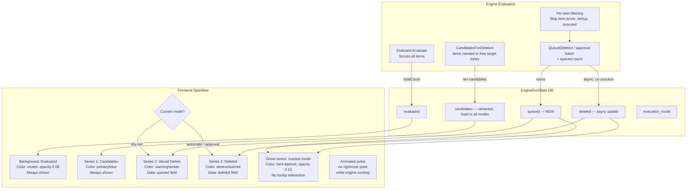
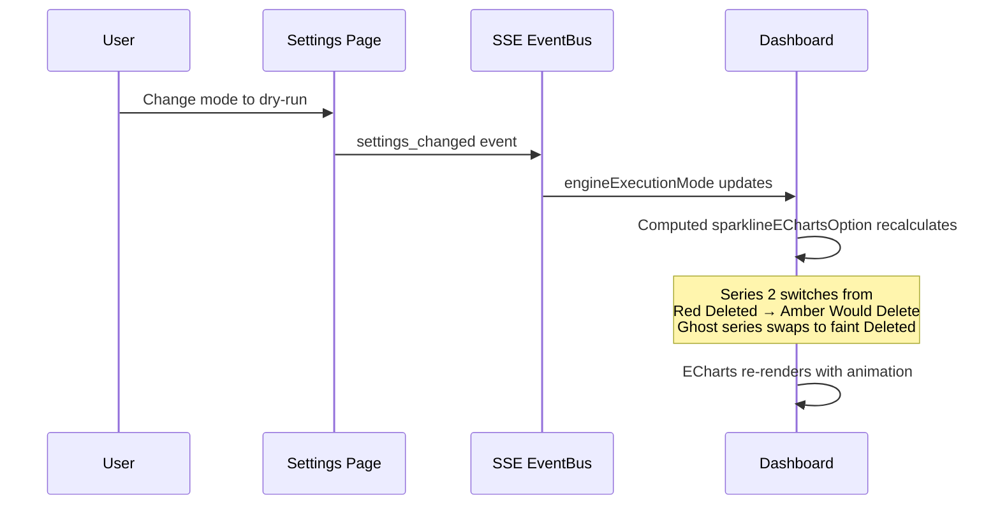

# Mode-Aware Engine Activity Sparkline

**Status:** 📋 Planned  
**Branch:** `feature/mode-aware-sparkline`  
**Scope:** Backend schema + service + poller, Frontend dashboard sparkline

## Problem

The engine activity sparkline on the dashboard shows two series: **Candidates** (blue) and **Deleted** (red). In dry-run mode, the "Deleted" series is always 0 because nothing is actually deleted — the red line flatlines and provides no useful information.

Additionally, there is an existing inconsistency in how `candidates` (currently named `flagged`) is populated in `EngineRunStats`:

| Mode | `candidates` populated? | `deleted` populated? |
|------|------------------------|---------------------|
| Automatic | ❌ Always 0 — `lastRunFlagged` never incremented | ✅ Updated by DeletionService |
| Approval | ✅ Incremented per queued item | ✅ Updated by DeletionService |
| Dry-run | ✅ Incremented per queued item | ❌ Always 0 — no real deletions |

This means the blue "Candidates" line is also broken in automatic mode.

## Solution

1. **Rename `flagged` → `candidates`** in the DB schema, model, and all code references. The word "flagged" is generic and ambiguous — "candidates" maps directly to `CandidatesForDeletion` and immediately communicates "items the engine selected as deletion candidates."
2. Add a **`queued`** column to `EngineRunStats` (replacing the originally planned `targeted`). This name maps to `QueueDeletion()` and `deletionsQueued` in the poller — items that passed all per-item filters and were actually queued for action.
3. Fix the `candidates` inconsistency so it is populated in all modes.
4. Make the sparkline second series mode-aware: **amber "Would Delete"** in dry-run, **red "Deleted"** in auto/approval.
5. The switch is **instantaneous** — when the user changes execution mode, the reactive `engineExecutionMode` triggers a re-render with the new series label, color, and data source.
6. Add a **ghost series** showing the inactive mode's data as a faint dashed line, providing historical context across mode switches.
7. Add a faint **evaluated background band** behind the main series to visualize the evaluation funnel.
8. Add a **mode-aware tooltip** that includes contextual hints (e.g., "dry-run — no deletions").
9. Add an **animated pulse** on the rightmost data point while the engine is actively running.

## Field Renames

This plan renames one existing field and introduces one new field. Since v2 has not been released yet, the baseline migration is still directly editable — no backward compatibility migration is needed.

| Old name | New name | Reason |
|----------|----------|--------|
| `flagged` | `candidates` | Maps to `CandidatesForDeletion` — "items the engine selected as deletion candidates" |
| *(new)* | `queued` | Maps to `QueueDeletion()` / `deletionsQueued` — "items that passed all filters and were submitted for action" |

Code references that need updating for the `flagged` → `candidates` rename:
- `EngineRunStats.Flagged` field → `Candidates`
- `EngineHistoryPoint.Flagged` → `Candidates`
- `lastRunFlagged` atomic → `lastRunCandidates`
- `atomic.AddInt64(&p.lastRunFlagged, 1)` in poller
- `SetLastRunStats(evaluated, flagged, protected)` → `SetLastRunStats(evaluated, candidates, protected)`
- `RestoreLastRunStats` log message
- `GetStats()` map key
- Frontend `flagged` references in TypeScript types, computed properties, and `bucketHourly` calls
- i18n key `dashboard.flagged` → `dashboard.candidates`
- Baseline SQL migration column name

## Field Semantics

| Field | Meaning | Populated in |
|-------|---------|-------------|
| `evaluated` | Total items scored by the engine | All modes |
| `candidates` | Items the engine selected as deletion candidates to free target bytes — the count from `CandidatesForDeletion` before per-item filtering | All modes — **fix auto mode gap** |
| `queued` | Items actually submitted for action after per-item filtering — skip zero-score, dedup, snoozed, collection-protected | All modes — **new field** |
| `deleted` | Items successfully removed from *arr integrations | Auto + Approval only |
| `freed_bytes` | Bytes reclaimed from actual deletions | Auto + Approval only |
| `execution_mode` | Mode the engine was running in for this cycle | All modes — already exists |

The key relationship: `evaluated > candidates >= queued >= deleted`

### User-Facing Labels

The sparkline legend and tooltips use plain-language labels distinct from the DB column names:

| DB column | Sparkline label | Tooltip description |
|-----------|----------------|---------------------|
| `evaluated` | **Evaluated** | "Total items scored by the engine" |
| `candidates` | **Candidates** | "Items selected as deletion candidates" |
| `queued` (dry-run) | **Would Delete** | "Items that would be deleted if dry-run was off" |
| `deleted` (auto/approval) | **Deleted** | "Items successfully removed" |

## Data Flow



## UX: Mode-Switch Behavior

When the user changes execution mode, the sparkline transitions **instantly**:



**Historical data behavior after a mode switch:**

- The new series pulls from a different column for all historical data points
- Data points from the *previous* mode will show 0 for the new column — this is accurate:
  - Switching dry-run → automatic: "Deleted" line starts at 0, grows as real deletions complete
  - Switching automatic → dry-run: "Would Delete" line starts at 0, grows as new dry-run cycles complete
- The **ghost series** renders the inactive mode's data as a faint dashed line (opacity ~0.15), preventing the "cliff to zero" from looking like the application broke. The ghost is non-interactive (`silent: true`) and excluded from tooltip display.
- This provides a natural visual indicator of "when the mode switch happened"

## Implementation Steps

### Phase 1: Backend Schema + Service

**Step 1.1: Rename `flagged` → `candidates` and add `queued` column to `EngineRunStats` model**

File: `backend/internal/db/models.go`

Rename the `Flagged` field to `Candidates` and add the `Queued` field:

```go
type EngineRunStats struct {
    ID            uint       `gorm:"primarykey" json:"id"`
    RunAt         time.Time  `gorm:"index;not null" json:"runAt"`
    CompletedAt   *time.Time `json:"completedAt,omitempty"`
    Evaluated     int        `gorm:"not null;default:0" json:"evaluated"`
    Candidates    int        `gorm:"not null;default:0" json:"candidates"`  // RENAMED from Flagged
    Queued        int        `gorm:"not null;default:0" json:"queued"`      // NEW
    Deleted       int        `gorm:"not null;default:0" json:"deleted"`
    FreedBytes    int64      `gorm:"not null;default:0" json:"freedBytes"`
    ExecutionMode string     `gorm:"not null;default:'dry-run'" json:"executionMode"`
    DurationMs    int64      `gorm:"not null;default:0" json:"durationMs"`
    ErrorMessage  string     `json:"errorMessage,omitempty"`
}
```

**Step 1.2: Update SQL baseline migration**

File: `backend/internal/db/migrations/00001_v2_baseline.sql`

Rename the `flagged` column to `candidates` and add the `queued` column in the `engine_run_stats` CREATE TABLE statement.

> **Migration safety note:** This modifies the baseline migration directly rather than adding `ALTER TABLE` migrations. This is safe because v2 has not been released yet — no users have an existing database with the old schema. If v2 is released before this feature lands, separate migration files must be created instead.
>
> **1.x → 2.0 migration impact:** None. The `MigrateFrom()` function in `migration/migrate.go` explicitly does *not* import engine run stats (they are transient data with no value in the new system). v1.x users get a fresh `engine_run_stats` table from the baseline migration with the new column names — the old `flagged` name never existed in their v2 schema.

**Step 1.3: Update `EngineHistoryPoint` with renamed and new fields**

File: `backend/internal/services/engine.go`

Update the API-facing struct and `GetHistory()`:

```go
type EngineHistoryPoint struct {
    Timestamp     time.Time `json:"timestamp"`
    Evaluated     int       `json:"evaluated"`
    Candidates    int       `json:"candidates"`      // RENAMED from Flagged
    Queued        int       `json:"queued"`           // NEW
    Deleted       int       `json:"deleted"`
    FreedBytes    int64     `json:"freedBytes"`
    DurationMs    int64     `json:"durationMs"`
    ExecutionMode string    `json:"executionMode"`    // NEW — needed for per-point mode awareness
}
```

Update the mapping loop in `GetHistory()` to populate the renamed and new fields from `db.EngineRunStats`.

**Step 1.4: Update `UpdateRunStats` to accept `queued` and use `candidates`**

File: `backend/internal/services/engine.go`

- Rename the `flagged` parameter to `candidates`
- Add `queued int` parameter
- Update the GORM `Updates` map to use `candidates` and `queued`

> **Note on `RestoreLastRunStats`:** The `queued` field is intentionally *not* added as an in-memory atomic on `EngineService`. It is consumed exclusively via the history sparkline API (`GetHistory()`), not the dashboard header stat counters (`GetStats()`). Therefore `RestoreLastRunStats()` does not need to load `queued` — add a comment at that method documenting this decision.

**Step 1.5: Rename `lastRunFlagged` → `lastRunCandidates` and update related methods**

File: `backend/internal/services/engine.go`

- Rename the `lastFlagged` atomic field to `lastCandidates`
- Update `SetLastRunStats(evaluated, candidates, protected)` parameter name
- Update `RestoreLastRunStats()` to use `latest.Candidates` instead of `latest.Flagged`
- Update `GetStats()` map key from `"lastRunFlagged"` to `"lastRunCandidates"`
- Update the `slog.Info` message in `RestoreLastRunStats` to say `"candidates"` instead of `"flagged"`

**Step 1.6: Update `EngineService` unit tests**

File: `backend/internal/services/engine_test.go`

Update all tests to use the renamed `Candidates` field and new `Queued` field in `CreateRunStats`, `UpdateRunStats`, and `GetHistory`.

### Phase 2: Poller Changes

**Step 2.1: Track `queued` count in `evaluateAndCleanDisk`**

File: `backend/internal/poller/evaluate.go`

The return value `deletionsQueued` already represents the queued count. No change to the function itself — the caller will use this value.

**Step 2.2: Fix `candidates` inconsistency in auto mode and rename atomic**

File: `backend/internal/poller/evaluate.go`

- Rename `lastRunFlagged` references to `lastRunCandidates`
- In the auto mode switch case (line ~276-301), add `atomic.AddInt64(&p.lastRunCandidates, 1)` to match the dry-run and approval branches. This ensures `candidates` is populated in all three modes.

**Step 2.3: Pass `queued` to `UpdateRunStats` and rename `flagged` parameter**

File: `backend/internal/poller/poller.go`

- Rename the `flagged` variable to `candidates`
- Rename `lastRunFlagged` atomic field references to `lastRunCandidates`
- Pass `totalDeletionsQueued` as the `queued` parameter. The `totalDeletionsQueued` variable is already accumulated from `evaluateAndCleanDisk` return values — pass it directly without introducing a new atomic field on the Poller struct:

```go
if err := p.reg.Engine.UpdateRunStats(
    runStatsID, int(evaluated), int(candidates),
    totalDeletionsQueued,  // queued count — already computed, no new atomic needed
    time.Since(pollStart).Milliseconds(),
); err != nil {
```

**Step 2.4: Update poller unit tests**

File: `backend/internal/poller/evaluate_test.go`, `backend/internal/poller/poller_test.go`

- Update all references from `flagged` / `Flagged` to `candidates` / `Candidates`
- Verify that `queued` is correctly passed through in all three execution modes

### Phase 3: Frontend Sparkline

**Step 3.1: Update TypeScript types for engine history**

File: `frontend/app/pages/index.vue` (or the relevant composable)

- Rename `flagged` → `candidates` in the TypeScript interface for engine history data points
- Add `queued` and `executionMode` fields

**Step 3.2: Update computed properties with new names**

File: `frontend/app/pages/index.vue`

```ts
const candidatesSeries = computed(() => bucketHourly(engineHistoryData.value, 'candidates'));
const queuedSeries = computed(() => bucketHourly(engineHistoryData.value, 'queued'));
const evaluatedSeries = computed(() => bucketHourly(engineHistoryData.value, 'evaluated'));
```

**Step 3.3: Make `sparklineEChartsOption` mode-aware with ghost series and evaluated band**

File: `frontend/app/pages/index.vue`

Update the computed ECharts option (~line 947) to:

1. Switch the second series based on `engineExecutionMode`
2. Add a ghost series for the inactive mode's data
3. Add a faint evaluated background band
4. Use a mode-aware custom tooltip formatter
5. Add animated pulse on the rightmost point when engine is running

```ts
const sparklineEChartsOption = computed(() => {
  const candidates = candidatesSeries.value;
  const evaluated = evaluatedSeries.value;
  const isDryRun = engineExecutionMode.value === 'dry-run';
  const secondSeries = isDryRun ? queuedSeries.value : deletedSeries.value;
  const ghostSeries = isDryRun ? deletedSeries.value : queuedSeries.value;
  const secondName = isDryRun ? t('dashboard.wouldDelete') : t('dashboard.deleted');
  const secondColor = isDryRun ? warningColor.value : destructiveColor.value;
  const ghostName = isDryRun ? t('dashboard.deleted') : t('dashboard.wouldDelete');
  const series: Array<Record<string, unknown>> = [];

  // Background band: evaluated (faint area, no line)
  if (evaluated.length > 0) {
    series.push({
      name: 'Evaluated',
      type: 'line',
      smooth: true,
      symbol: 'none',
      lineStyle: { width: 0 },
      areaStyle: { color: chart1Color.value, opacity: 0.08 },
      emphasis: { disabled: true },
      silent: true,
      data: evaluated.map((d) => [d.x, d.y]),
      z: 0, // render behind other series
    });
  }

  // Primary series: Candidates (always shown)
  if (candidates.length > 0) {
    series.push({
      name: t('dashboard.candidates'),
      type: 'line',
      smooth: true,
      symbol: 'none',
      lineStyle: glowLineStyle(chart1Color.value),
      areaStyle: gradientArea(chart1Color.value),
      emphasis: emphasisConfig(),
      data: candidates.map((d) => [d.x, d.y]),
    });
  }

  // Active second series: Would Delete (dry-run) or Deleted (auto/approval)
  if (secondSeries.length > 0) {
    const lastPoint = secondSeries[secondSeries.length - 1];
    series.push({
      name: secondName,
      type: 'line',
      smooth: true,
      symbol: 'none',
      lineStyle: glowLineStyle(secondColor),
      areaStyle: gradientArea(secondColor),
      emphasis: emphasisConfig(),
      data: secondSeries.map((d) => [d.x, d.y]),
      // Animated pulse on rightmost point while engine is running
      markPoint: engineIsRunning.value && lastPoint ? {
        symbol: 'circle',
        symbolSize: 8,
        data: [{ coord: [lastPoint.x, lastPoint.y] }],
        itemStyle: { color: secondColor },
        animation: true,
        animationDuration: 1200,
        animationEasingUpdate: 'sinusoidalInOut',
      } : undefined,
    });
  }

  // Ghost series: inactive mode's data (faint dashed, no interaction)
  if (ghostSeries.length > 0 && ghostSeries.some((d) => d.y > 0)) {
    series.push({
      name: ghostName + ' (historical)',
      type: 'line',
      smooth: true,
      symbol: 'none',
      lineStyle: {
        color: isDryRun ? destructiveColor.value : warningColor.value,
        width: 1, type: 'dashed', opacity: 0.15,
      },
      areaStyle: undefined,
      emphasis: { disabled: true },
      silent: true,
      data: ghostSeries.map((d) => [d.x, d.y]),
    });
  }

  return {
    animation: true,
    animationDelay: (idx: number) => idx * 10,
    grid: { top: 4, right: 4, bottom: 4, left: 4 },
    xAxis: { type: 'time', show: false },
    yAxis: { type: 'value', show: false },
    tooltip: {
      trigger: 'axis',
      axisPointer: {
        type: 'cross',
        crossStyle: { color: chart1Color.value, opacity: 0.3 },
      },
      ...tooltipConfig(),
      formatter: (params) => {
        if (!params.length) return '';
        const ts = new Date(params[0].value[0]).toLocaleString();
        let html = `<div style="font-weight:600">${ts}</div>`;
        for (const p of params) {
          if (p.seriesName.includes('(historical)') || p.seriesName === 'Evaluated') continue;
          html += `<div>${p.marker} ${p.seriesName}: <b>${p.value[1]}</b></div>`;
        }
        if (isDryRun) {
          html += `<div style="opacity:0.6;font-size:11px;margin-top:2px">dry-run — no deletions</div>`;
        }
        return html;
      },
    },
    series,
  };
});
```

**Step 3.4: Update sparkline legend labels in template**

File: `frontend/app/pages/index.vue`

Update the legend dots section (~line 157-164) to use new labels:

```vue
<span class="inline-flex items-center gap-1 text-[11px] text-muted-foreground/50">
  <span class="w-2 h-2 rounded-full bg-primary/20" />
  {{ $t('dashboard.evaluated') }}
</span>
<span class="inline-flex items-center gap-1 text-[11px] text-muted-foreground">
  <span class="w-2 h-2 rounded-full bg-primary" />
  {{ $t('dashboard.candidates') }}
</span>
<span class="inline-flex items-center gap-1 text-[11px] text-muted-foreground">
  <span class="w-2 h-2 rounded-full" :class="isDryRunMode ? 'bg-warning' : 'bg-destructive'" />
  {{ isDryRunMode ? $t('dashboard.wouldDelete') : $t('dashboard.deleted') }}
</span>
```

**Step 3.5: Update dashboard header stats text**

File: `frontend/app/pages/index.vue`

The header currently shows "Evaluated X · Flagged Y" (~line 146-148). Update "Flagged" to "Candidates":

```vue
<span class="text-xs text-muted-foreground">
  {{ $t('dashboard.evaluated') }} {{ engineLastRunEvaluated?.toLocaleString() ?? 0 }} ·
  {{ $t('dashboard.candidates') }} {{ engineLastRunCandidates?.toLocaleString() ?? 0 }}
</span>
```

Update the composable destructuring to use `lastRunCandidates` instead of `lastRunFlagged`.

**Step 3.6: Update i18n keys**

File: `frontend/app/locales/en.json`

- Rename `dashboard.flagged` → `dashboard.candidates` with value `"Candidates"`
- Add `dashboard.wouldDelete` with value `"Would Delete"`
- Verify `dashboard.deleted` and `dashboard.evaluated` already exist

**Step 3.7: Add warning color CSS variable**

File: `frontend/app/pages/index.vue` (or the theme)

Add an amber/warning color for the new series. Check if `warningColor` already exists in the `useEChartsDefaults` composable or if it needs to be derived from the existing CSS variables. Also export it alongside `chart1Color`, `destructiveColor`, etc.

**Step 3.8: Update `handleDeletionProgressSparkline` SSE handler**

File: `frontend/app/pages/index.vue`

The existing handler patches `deleted` on the last data point in real-time. In dry-run mode, this handler should patch `queued` instead (or be no-op since dry-run deletions don't fire `deletion_progress` events).

**Step 3.9: Update `useEngineControl` composable**

File: `frontend/app/composables/useEngineControl.ts` (or wherever shared engine state lives)

- Rename `lastRunFlagged` → `lastRunCandidates` to match the backend's `GetStats()` key
- The composable reads from the SSE `engine_stats` event — verify the new key name propagates

**Step 3.10: Animated pulse cleanup**

File: `frontend/app/pages/index.vue`

The `markPoint` pulse added in Step 3.3 is driven by `engineIsRunning`. When the engine completes (SSE `engine_run_complete` event), the `sparklineEChartsOption` computed property will automatically recalculate with `engineIsRunning === false`, removing the pulse. No cleanup handler needed — ECharts handles the transition smoothly.

Verify that the pulse animation loops correctly in ECharts. If the built-in `animationEasingUpdate` doesn't produce a breathing/pulsing effect, consider using `symbolSize` as a function of a reactive timer, or use ECharts' `graphic` layer with a custom CSS keyframe animation on the SVG element instead.

### Phase 4: Verification

**Step 4.1: Run `make ci`**

Verify all backend tests pass, lint is clean, and security checks pass. Pay special attention to any references to the old `flagged` / `Flagged` names that weren't caught during the rename.

**Step 4.2: Docker Compose smoke test**

Build and run the container with `docker compose up --build`. Verify the sparkline renders correctly in:

1. Dry-run mode — amber "Would Delete" line appears, faint evaluated band behind, ghost dashed line for "Deleted" (if historical data exists)
2. Switch to automatic mode — red "Deleted" line appears, amber ghost appears, evaluated band persists
3. Switch back to dry-run — instant transition back to amber, ghost swaps
4. Trigger a run — animated pulse appears on the rightmost point of the active second series
5. Run completes — pulse disappears smoothly
6. Hover over sparkline — tooltip shows mode-aware formatting with contextual hints
7. Header stats show "Evaluated X · Candidates Y" (not "Flagged")

**Step 4.3: Verify SSE real-time updates**

Trigger an engine run in each mode and verify the sparkline updates in real-time via SSE events.

**Step 4.4: Search for stale references**

Run `grep -rn 'flagged\|Flagged\|lastRunFlagged' backend/ frontend/` to verify no stale references to the old name remain. Expected false positives: this plan file, changelog entries, and git history.

## Files Changed Summary

| File | Change |
|------|--------|
| `backend/internal/db/models.go` | Rename `Flagged` → `Candidates`, add `Queued int` field |
| `backend/internal/db/migrations/00001_v2_baseline.sql` | Rename `flagged` → `candidates` column, add `queued` column |
| `backend/internal/services/engine.go` | Rename `Flagged` → `Candidates` in `EngineHistoryPoint`, add `Queued`/`ExecutionMode`, rename `lastFlagged` atomic → `lastCandidates`, update `UpdateRunStats`/`SetLastRunStats`/`GetStats`/`RestoreLastRunStats` |
| `backend/internal/services/engine_test.go` | Update all tests for renamed + new fields |
| `backend/internal/poller/evaluate.go` | Rename `lastRunFlagged` → `lastRunCandidates`, fix auto mode gap |
| `backend/internal/poller/poller.go` | Rename `flagged` → `candidates` variable, pass `totalDeletionsQueued` as `queued` to `UpdateRunStats` |
| `backend/internal/poller/evaluate_test.go` | Update all field references |
| `backend/internal/poller/poller_test.go` | Update all field references |
| `frontend/app/pages/index.vue` | Mode-aware sparkline with ghost series, evaluated band, animated pulse, custom tooltip, renamed series/labels, header stats update |
| `frontend/app/composables/useEngineControl.ts` | Rename `lastRunFlagged` → `lastRunCandidates` |
| `frontend/app/composables/useEChartsDefaults.ts` | Export `warningColor` (if not already present) |
| `frontend/app/locales/en.json` | Rename `dashboard.flagged` → `dashboard.candidates`, add `dashboard.wouldDelete` |
