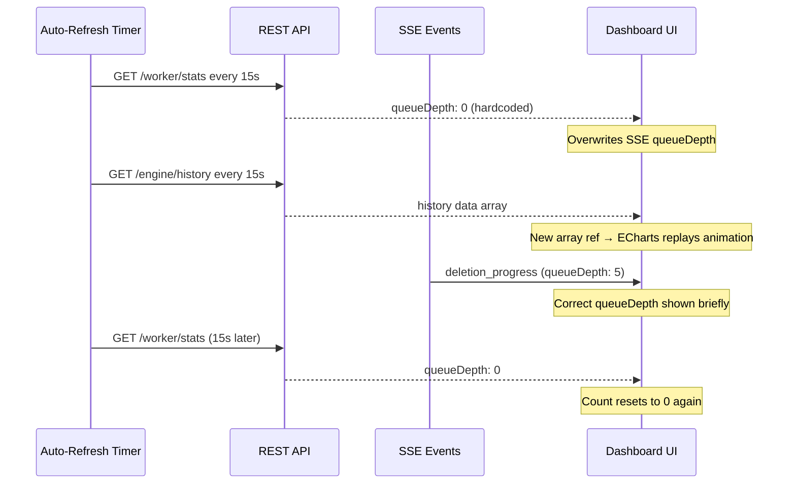
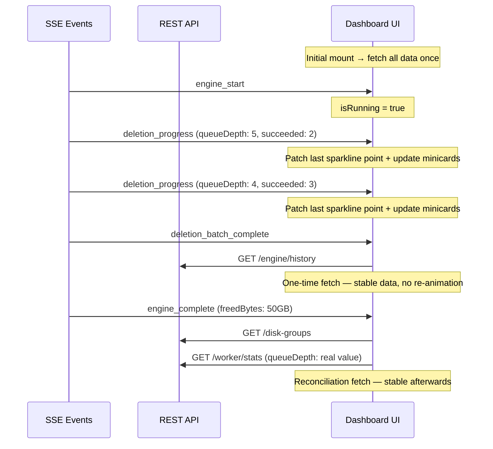

# SSE-Driven Dashboard: Fix Sparkline Reanimation and Minicard Issues

**Status:** ✅ Complete
**Branch:** `feature/mode-aware-sparkline`  
**Date:** 2026-03-24

## Problem Statement

The dashboard has multiple interrelated issues when the engine runs in dry-run mode:

1. **Sparklines keep reanimating** — the engine activity card sparklines reset to 0 and replay their entry animation repeatedly during deletion queue processing
2. **Queue minicard loses count** — the "Queue" minicard number resets to 0 periodically
3. **"Would Free" minicard never changes** — stays at 0 in dry-run mode
4. **Candidates and would-delete sparklines stuck at 0** — the series data appears flat
5. **1hr graph view shows nothing** — no data visible when selecting "Last Hour"

## Root Cause Analysis

### Primary root cause: Auto-refresh timer clobbering SSE state

The dashboard has a pre-SSE auto-refresh timer that periodically calls `fetchDashboardData()`, which in turn calls:
- `GET /api/v1/worker/stats` — overwrites workerStats including SSE-updated fields
- `fetchEngineHistory()` — replaces the sparkline data array, triggering ECharts to replay entry animations
- `fetchRecentActivity()` — redundant since SSE already prepends events in real-time

This timer was necessary before SSE was implemented. Now that all dashboard data is pushed via SSE events, the timer is redundant and actively harmful:
- It clobbering `queueDepth` because the REST API hardcodes it to 0
- It causes sparkline re-animation by replacing the data array reference
- It generates unnecessary API traffic

### Secondary issues

| Issue | Root Cause | File:Line |
|-------|-----------|-----------|
| Queue depth always 0 in REST API | `GetWorkerMetrics()` hardcodes `stats[queueDepth] = 0` | `metrics.go:353` |
| FreedBytes 0 in dry-run | `UpdateRunStats()` does not write `freed_bytes`; `IncrementDeletedStats()` only runs for real deletes | `engine.go:96` |
| FreedBytes not from SSE | `engine_complete` handler does not propagate `freedBytes` to workerStats | `useEngineControl.ts:97-111` |
| 1hr view empty | `bucketHourly()` collapses all points into 1 bucket; `symbol: none` renders single point invisible | `index.vue:924-944` |
| Dry-run sparkline patch wrong field | `handleDeletionProgressSparkline()` patches `deleted` but dry-run shows `queued` series | `index.vue:821-829` |

## Plan

### Phase 1: Backend Fixes

#### Step 1.1: Expose real queue depth in REST API ✅ (already applied)

**File:** `backend/internal/services/deletion.go`

Add public `QueueLen()` method that delegates to the existing private `queueLen()`:

```go
func (s *DeletionService) QueueLen() int {
    return s.queueLen()
}
```

**File:** `backend/internal/services/metrics.go`

Replace hardcoded zero:
```go
// Before:
stats["queueDepth"] = 0
// After:
stats["queueDepth"] = s.deletion.QueueLen()
```

#### Step 1.2: Persist freedBytes for dry-run and approval modes

**File:** `backend/internal/services/engine.go`

Add `freedBytes` parameter to `UpdateRunStats()`:

```go
func (s *EngineService) UpdateRunStats(id uint, evaluated, candidates, queued int, freedBytes int64, durationMs int64) error {
    result := s.db.Model(&db.EngineRunStats{}).Where("id = ?", id).Updates(map[string]any{
        "evaluated":    evaluated,
        "candidates":   candidates,
        "queued":       queued,
        "freed_bytes":  freedBytes,
        "duration_ms":  durationMs,
        "completed_at": now,
    })
```

**File:** `backend/internal/poller/poller.go`

Pass `freedBytes` to the updated method, but skip it for auto mode to avoid double-counting with `IncrementDeletedStats()`:

```go
freedBytes := atomic.LoadInt64(&p.lastRunFreedBytes)
// Auto mode: IncrementDeletedStats() accumulates actual freed bytes per-item.
// Writing freedBytes here would double-count.
writeFreedBytes := freedBytes
if prefs.ExecutionMode == db.ModeAuto {
    writeFreedBytes = 0
}
p.reg.Engine.UpdateRunStats(runStatsID, int(evaluated), int(candidates), totalDeletionsQueued, writeFreedBytes, ...)
```

**File:** `backend/internal/services/engine_test.go`

Update existing `UpdateRunStats` test calls to include the new `freedBytes` parameter.

**File:** `backend/internal/poller/poller_test.go`

Update existing test calls that mock or call `UpdateRunStats` to include the new parameter.

**File:** `backend/internal/services/metrics_test.go`

Update any tests that verify `GetWorkerMetrics()` output to expect real queue depth.

#### Step 1.3: Update backend tests

All test files that call `UpdateRunStats` must be updated with the new signature. Search for `UpdateRunStats` across test files and update accordingly.

### Phase 2: Frontend — Remove Auto-Refresh Timer

#### Step 2.1: Remove the auto-refresh timer and dropdown

**File:** `frontend/app/pages/index.vue`

Remove:
- `refreshOptions` array
- `refreshIntervalStr` ref and `refreshInterval` computed
- The `<UiSelect v-model="refreshIntervalStr">` dropdown from the template
- `autoRefreshTimer`, `startAutoRefresh()`, `stopAutoRefresh()` functions
- `isAutoRefreshing` ref
- The `watch(refreshInterval, ...)` watcher
- `startAutoRefresh()` call in `onMounted`
- `stopAutoRefresh()` call in `onUnmounted`

#### Step 2.2: Replace with SSE-driven fetches

**File:** `frontend/app/pages/index.vue`

Add SSE subscriptions in `onMounted` to handle the data that the timer was refreshing:

```
engine_complete → fetch disk groups + integrations + engine stats (reconciliation)
integration_added/updated/removed → fetch integrations
settings_changed → fetch disk groups (threshold may have changed)
```

Specifically:

```typescript
// These SSE events trigger a lightweight dashboard refresh:
sseOn('engine_complete', handleEngineCompleteRefresh);
sseOn('integration_added', handleIntegrationChange);
sseOn('integration_updated', handleIntegrationChange);
sseOn('integration_removed', handleIntegrationChange);
sseOn('settings_changed', handleSettingsChange);
```

Where `handleEngineCompleteRefresh` fetches disk groups and engine stats, and `handleIntegrationChange` fetches the integration list.

The `lastUpdated` ref should be updated whenever an SSE-driven refresh completes, so the "Updated X ago" indicator stays accurate.

#### Step 2.3: Keep fetchEngineHistory only on targeted events

**File:** `frontend/app/pages/index.vue`

`fetchEngineHistory()` should only be called:
1. On initial mount — inside `fetchDashboardData()` or directly after
2. On `engine_complete` — via the `runCompletionCounter` watcher (already done)
3. On `deletion_batch_complete` — via `handleDeletionBatchCompleteRefresh()` (already done)
4. On `dateRange` change — via the existing watcher (already done)

Remove the call from `fetchDashboardData()`.

### Phase 3: Frontend — Fix Sparkline Display Issues

#### Step 3.1: Propagate freedBytes from SSE engine_complete

**File:** `frontend/app/composables/useEngineControl.ts`

In the `engine_complete` SSE handler, add `lastRunFreedBytes`:

```typescript
workerStats.value = {
    ...workerStats.value,
    isRunning: false,
    lastRunEvaluated: event.evaluated ?? workerStats.value.lastRunEvaluated,
    lastRunCandidates: event.candidates ?? workerStats.value.lastRunCandidates,
    lastRunFreedBytes: event.freedBytes ?? workerStats.value.lastRunFreedBytes, // NEW
    lastRunEpoch: event.completedAtEpoch || Math.floor(Date.now() / 1000),
    executionMode: event.executionMode || workerStats.value.executionMode,
};
```

#### Step 3.2: Fix dry-run real-time sparkline patch

**File:** `frontend/app/pages/index.vue`

Update `handleDeletionProgressSparkline()` to patch the correct field based on execution mode:

```typescript
function handleDeletionProgressSparkline(data: unknown) {
    const event = data as DeletionProgress;
    const history = engineHistoryData.value;
    const last = history.length > 0 ? history[history.length - 1] : undefined;
    if (last) {
        const patchField = isDryRunMode.value ? 'queued' : 'deleted';
        engineHistoryData.value = [
            ...history.slice(0, -1),
            { ...last, [patchField]: event.succeeded },
        ];
    }
}
```

Note: In dry-run mode, `event.succeeded` counts processed dry-deletes, which maps to "would delete" count, so patching `queued` with the running total is semantically correct for the sparkline.

#### Step 3.3: Fix short-range views — skip bucketing for 24h and below

**File:** `frontend/app/pages/index.vue`

For time ranges of 24h and below (1h, 6h, 24h), use raw data points instead of hourly bucketing. Hourly bucketing collapses all points within the same calendar hour into a single aggregated point, which destroys granularity for short ranges. Only bucket for 7d, 30d, and all-time views where the point density would be too high.

Also ensure single data points are visible by showing symbols when data has few points.

Replace `bucketHourly` usage with a smart function that chooses bucketing strategy based on the selected range:

```typescript
function prepareSeriesData(
    data: Array<{ timestamp: string }>,
    valueKey: string,
    range: string,
): Array<{ x: number; y: number }> {
    // For 24h and below, skip bucketing to preserve individual data points.
    // Hourly bucketing only helps for 7d+ ranges where hundreds of points
    // would produce a noisy chart.
    if (range === '1h' || range === '6h' || range === '24h' || data.length <= 24) {
        return data.map(point => ({
            x: new Date(point.timestamp).getTime(),
            y: (point as Record<string, unknown>)[valueKey] as number,
        }));
    }
    return bucketHourly(data, valueKey);
}
```

And in the sparkline series config, show symbols when few points exist:

```typescript
symbol: candidates.length <= 3 ? 'circle' : 'none',
symbolSize: candidates.length <= 3 ? 6 : 0,
```

### Phase 4: Update Tests

#### Step 4.1: Backend tests

Update all tests that call `UpdateRunStats` with the new `freedBytes` parameter. Files to check:
- `backend/internal/services/engine_test.go`
- `backend/internal/poller/poller_test.go`
- `backend/internal/poller/evaluate_test.go`
- `backend/internal/services/metrics_test.go`
- Any other test that mocks this method

#### Step 4.2: Frontend tests

Update `useEngineControl.test.ts` if it tests the `engine_complete` handler — verify `lastRunFreedBytes` is propagated.

### Phase 5: Verify and Commit

#### Step 5.1: Run `make ci`

Run `make ci` inside the `capacitarr/` directory to verify all backend lint, tests, and security checks pass.

#### Step 5.2: Commit

Create a single commit on the existing `feature/mode-aware-sparkline` branch:

```
fix(dashboard): replace auto-refresh timer with SSE-driven updates

The pre-SSE auto-refresh timer caused multiple dashboard issues:
- Sparklines replayed entry animation on every refresh cycle
- Queue minicard count reset to 0 due to REST API hardcoding queueDepth
- Would-free minicard stuck at 0 in dry-run mode
- 1hr graph view invisible due to single-point bucketing

Replace the periodic timer with targeted SSE-driven fetches:
- engine_complete → refresh disk groups, stats, and history
- deletion_batch_complete → refresh history
- integration events → refresh integration list
- settings_changed → refresh disk groups

Backend fixes:
- Expose real queue depth via DeletionService.QueueLen()
- Persist freedBytes in UpdateRunStats() for dry-run/approval modes

Frontend fixes:
- Propagate freedBytes from SSE engine_complete to workerStats
- Patch correct sparkline field for dry-run mode (queued, not deleted)
- Skip hourly bucketing for 1h/6h ranges; show symbols for sparse data
```

## Data Flow: Before vs After

### Before — auto-refresh timer



### After — SSE-driven



## Files Changed Summary

| File | Change |
|------|--------|
| `backend/internal/services/deletion.go` | Add `QueueLen()` public method |
| `backend/internal/services/metrics.go` | Use `s.deletion.QueueLen()` instead of hardcoded 0 |
| `backend/internal/services/engine.go` | Add `freedBytes` param to `UpdateRunStats()` |
| `backend/internal/poller/poller.go` | Pass `freedBytes` to `UpdateRunStats()` with auto-mode guard |
| `frontend/app/pages/index.vue` | Remove auto-refresh timer/dropdown; add SSE-driven fetches; fix bucketing; fix dry-run sparkline patch |
| `frontend/app/composables/useEngineControl.ts` | Propagate `freedBytes` in engine_complete handler |
| Various test files | Update `UpdateRunStats` call signatures |
