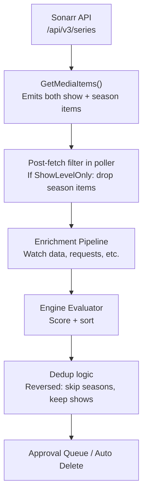

# Sonarr Show-Level-Only Toggle

> **Status:** ✅ Complete
> **Created:** 2026-03-24
> **Branch:** `feature/sonarr-show-level-only` (from `main`)
> **Closes:** #8
> **Reported by:** @tomislavf

## Problem

Sonarr currently emits both season-level and show-level `MediaItem` entries for every series. The poller's dedup logic in [`evaluateAndCleanDisk()`](../backend/internal/poller/evaluate.go:21) **prefers seasons** by default — it skips show-level entries when season entries exist (lines 108-176), allowing per-season approval and deletion.

Some users prefer an "all or nothing" approach: evaluate and delete entire shows rather than individual seasons. This avoids scenarios where the engine removes Season 1 of a show but leaves Seasons 2-5, which may not be useful without Season 1.

## Solution

Add a `ShowLevelOnly` boolean field to `IntegrationConfig`, only applicable to Sonarr integrations. When enabled:

- The poller skips season-level items from this integration during evaluation
- Only show-level items are scored, queued, and deleted
- Deletion uses the existing `MediaTypeShow` path in [`SonarrClient.DeleteMediaItem()`](../backend/internal/integrations/sonarr.go:197) which deletes the entire series

## Design

### Data Flow



### Key Design Decisions

1. **Filter in poller, not in client** — [`SonarrClient.GetMediaItems()`](../backend/internal/integrations/sonarr.go:84) remains stateless and always emits both show + season items. The filtering happens in [`fetchAllIntegrations()`](../backend/internal/poller/fetch.go:24) after items are tagged with `IntegrationID` (the media source loop starts at line 57). This keeps the integration client testable and free of DB dependencies.

2. **Dedicated boolean field, not JSON options** — Following the pattern established by [`CollectionDeletion`](../backend/internal/db/models.go:75), we add a typed boolean column rather than a JSON options bag. This keeps the schema explicit, migration simple, and avoids JSON parsing in hot paths.

3. **Enrichment still works** — Enrichment matches by TMDb ID. Show-level items already have `TMDbID` set (from [`sonarrSeries.TmdbID`](../backend/internal/integrations/sonarr.go:52)). Watch data via [`BulkWatchEnricher`](../backend/internal/integrations/enrichers.go:64) and request data via Seerr both match on TMDb ID, so they work identically for show-level items. No enrichment changes needed.

### Pre-existing Bug: Integration Update Route

While investigating, I found that the PUT `/api/v1/integrations/:id` route handler uses a [limited update struct](../backend/routes/integrations.go:105) that does not include `CollectionDeletion`:

```go
var update struct {
    Name    string `json:"name"`
    URL     string `json:"url"`
    APIKey  string `json:"apiKey"`
    Enabled *bool  `json:"enabled"`
}
```

This means users cannot change `CollectionDeletion` after initial creation. The field is preserved from the DB (not zeroed), but changes sent from the frontend edit form are silently ignored. The frontend `onSubmit` at [SettingsIntegrations.vue:432](../frontend/app/components/settings/SettingsIntegrations.vue:432) already sends `collectionDeletion` in PUT requests — the backend just drops it. This plan fixes this bug by adding both `CollectionDeletion` and the new `ShowLevelOnly` field to the update struct.

## Affected Files

### Phase 1: Backend Schema + Model

- **`backend/internal/db/models.go`** — Add `ShowLevelOnly bool` field to [`IntegrationConfig`](../backend/internal/db/models.go:63) (after `CollectionDeletion` at line 75)
- **`backend/internal/db/migrations/00002_show_level_only.sql`** — New goose migration adding `show_level_only` column (goose is used via [`migrate.go`](../backend/internal/db/migrate.go:10), currently only `00001_v2_baseline.sql` exists)

### Phase 2: Backend Route Handler

- **`backend/routes/integrations.go`** — Fix the PUT [update struct](../backend/routes/integrations.go:105) to include `CollectionDeletion *bool` and `ShowLevelOnly *bool` pointer fields. Apply them conditionally like `Enabled`.

### Phase 3: Backend Poller Filtering

- **`backend/internal/poller/fetch.go`** — After fetching media items from each `MediaSource` (line 57 loop), check if the integration has `ShowLevelOnly` enabled. If so, filter out `MediaTypeSeason` items for that integration. Requires a lookup of the integration config which is available via `integrationSvc.GetByID(id)`.

- **`backend/internal/poller/evaluate.go`** — **No change required.** The dedup logic at lines 108-176 builds `showsWithSeasons` from `ev.Item.ShowTitle` (line 113) and skips show entries when `showsWithSeasons[ev.Item.Title]` is true (line 172). When `ShowLevelOnly` is enabled, the Phase 3 filter removes all season items before evaluation, so `showsWithSeasons` will be empty and show-level items pass through the dedup untouched. The dedup is self-correcting — no code change needed.

### Phase 4: Backend Preview Service (NEW — NOT IN ORIGINAL PLAN)

- **`backend/internal/services/preview.go`** — The [`buildPreviewFromScratch()`](../backend/internal/services/preview.go:278) method fetches media items independently from the poller (lines 285-295) and does NOT apply any `ShowLevelOnly` filtering. When the poller populates the cache via [`SetPreviewCache()`](../backend/internal/services/preview.go:169), the items are already filtered. But when the cache is cold (first load, forced refresh), `buildPreviewFromScratch()` runs and must also filter season items for ShowLevelOnly integrations. **Add filtering logic to `buildPreviewFromScratch()` after line 294**, using `IntegrationService.GetByID()` to check each source's config.

### Phase 5: Backend Backup/Restore

- **`backend/internal/services/backup.go`** — Add `ShowLevelOnly bool` and `CollectionDeletion bool` to [`IntegrationExport`](../backend/internal/services/backup.go:112) struct (currently missing both). Update the export mapping at [line 251](../backend/internal/services/backup.go:251) and the import logic at [line 655](../backend/internal/services/backup.go:655) so the settings round-trip through backup/restore.

### Phase 6: Backend Tests

- **`backend/internal/poller/fetch_test.go`** — Add test for the season-item filtering when `ShowLevelOnly` is enabled.
- **`backend/routes/integrations_test.go`** — Add test verifying that PUT updates `ShowLevelOnly` and `CollectionDeletion` fields correctly.
- **`backend/internal/services/backup_test.go`** — Add test for `ShowLevelOnly` and `CollectionDeletion` round-trip in export/import.
- **`backend/internal/services/preview_test.go`** — Add test verifying `buildPreviewFromScratch()` filters season items when `ShowLevelOnly` is enabled.

### Phase 7: Frontend

- **`frontend/app/types/api.ts`** — Add `showLevelOnly: boolean` to [`IntegrationConfig`](../frontend/app/types/api.ts:10) interface (after `collectionDeletion` at line 17). Also add `showLevelOnly?: boolean` and `collectionDeletion?: boolean` to [`IntegrationExport`](../frontend/app/types/api.ts:367) interface.
- **`frontend/app/components/settings/SettingsIntegrations.vue`** — Add a conditional toggle (following the [Collection Deletion pattern](../frontend/app/components/settings/SettingsIntegrations.vue:229)) that only renders when `formState.type === 'sonarr'`. Add `showLevelOnly` to [`formState`](../frontend/app/components/settings/SettingsIntegrations.vue:305), [`openAddModal`](../frontend/app/components/settings/SettingsIntegrations.vue:395), [`openEditModal`](../frontend/app/components/settings/SettingsIntegrations.vue:412), and `onSubmit` (already sends full formState via spread).
- **`frontend/app/locales/en.json`** — Add i18n strings for the toggle label and description. Note: the existing Collection Deletion labels/descriptions are [hardcoded in the component](../frontend/app/components/settings/SettingsIntegrations.vue:317) rather than using i18n. For consistency, the ShowLevelOnly strings can follow the same hardcoded pattern, or we can optionally migrate both to i18n in this plan.

### Phase 8: Validation + CI

- Run `make ci` to verify all lint, test, and security checks pass.

## Execution Order

1. DB migration + model field
2. Route handler fix (update struct for `CollectionDeletion` + `ShowLevelOnly`)
3. Poller filtering logic
4. Preview service filtering logic (NEW)
5. Backup/restore support
6. Backend tests (including preview test)
7. Frontend toggle + types + export interface
8. i18n strings (or hardcoded, per Collection Deletion pattern)
9. `make ci` validation

## UI Mockup

The toggle appears in the integration add/edit modal, below the Collection Deletion section, conditionally shown when `type === 'sonarr'`:

```
┌─────────────────────────────────────────────┐
│  Edit Integration                           │
├─────────────────────────────────────────────┤
│  Type:  [Sonarr]                            │
│  Name:  [My Sonarr]                         │
│  URL:   [http://localhost:8989]              │
│  API Key: [••••••••abcd]                    │
│                                             │
│  ────────────────────────────────────────── │
│  📺 Show-Level Evaluation           [  ○ ]  │
│  Evaluate and delete entire shows            │
│  instead of individual seasons. When a       │
│  show is selected for deletion, all          │
│  seasons and episodes are removed.           │
│  ℹ Learn more about show-level evaluation   │
├─────────────────────────────────────────────┤
│  [Test Connection]       [Cancel] [Save]    │
└─────────────────────────────────────────────┘
```

## Edge Cases

1. **Mixed integrations on same disk** — If two Sonarr integrations share a disk group, one with `ShowLevelOnly` on and one off, items from each are filtered independently. The dedup logic operates on the merged pool — show-level items from integration A and season-level items from integration B coexist. No conflict since they have different `IntegrationID` values. The dedup match uses `ShowTitle` on season items (line 113) matched against `Title` on show items (line 172) — for items from integration B (show-level-only off), season entries cause the show-level entry to be deduped as normal.

2. **Toggling mid-cycle** — Changing the toggle takes effect on the next poll cycle. No in-flight mutations since the poller reads the config at the start of each cycle.

3. **Existing approval queue items** — If a user has season-level items in the approval queue and then enables `ShowLevelOnly`, the next cycle's reconciliation will clear orphaned season entries and replace them with show-level entries. Existing `approved` or `pending` season items will be cleaned up by the standard queue reconciliation logic in [`evaluateAndCleanDisk()`](../backend/internal/poller/evaluate.go:118).

4. **Analytics / preview** — Preview has two code paths: (a) poller-populated cache via [`SetPreviewCache()`](../backend/internal/services/preview.go:169) which already receives filtered items, and (b) cold-cache rebuild via [`buildPreviewFromScratch()`](../backend/internal/services/preview.go:278) which fetches independently and **must also apply the ShowLevelOnly filter** (added as Phase 4 above).

5. **Media stats unaffected** — The [`fetchAllIntegrations()`](../backend/internal/poller/fetch.go:76) media stats logic (lines 76-97) already counts only show-level items for Sonarr-type sources. Filtering out season items earlier in the pipeline does not break this — the `hasShows` check still works since show-level items are preserved.

## Review Notes (2026-03-24)

Codebase audit performed against current `main`. Key corrections to the original plan:

| # | Finding | Severity | Resolution |
|---|---------|----------|------------|
| 1 | **Frontend paths wrong** — Plan used `app/...` but actual paths are `frontend/app/...` | 🟡 Medium | Fixed all Phase 7 paths |
| 2 | **Preview service missed** — `buildPreviewFromScratch()` fetches items independently and doesn't filter by ShowLevelOnly | 🔴 High | Added Phase 4 |
| 3 | **Frontend `IntegrationExport` missed** — `api.ts` line 367 also needs `showLevelOnly` + `collectionDeletion` | 🟡 Medium | Added to Phase 7 |
| 4 | **Preview test missing** — Original Phase 5 tests didn't cover preview service | 🟡 Medium | Added to Phase 6 |
| 5 | **Dedup needs no change** — Original plan was unsure; confirmed self-correcting when seasons are pre-filtered | 🟢 Info | Clarified Phase 3 |
| 6 | **Evaluate.go line refs** — `evaluateAndCleanDisk()` is at line 21 (not 108); line 108 is the dedup block start | 🟢 Info | Fixed references |
| 7 | **i18n inconsistency** — Existing Collection Deletion uses hardcoded strings, not i18n; plan should follow same pattern for consistency | 🟢 Info | Noted in Phase 7 |
| 8 | **`evaluate_test.go` removed from plan** — The evaluate.go dedup logic needs no change, so no evaluate test needed for this feature. Fetch test covers the actual filtering. | 🟢 Info | Removed from Phase 6 |
