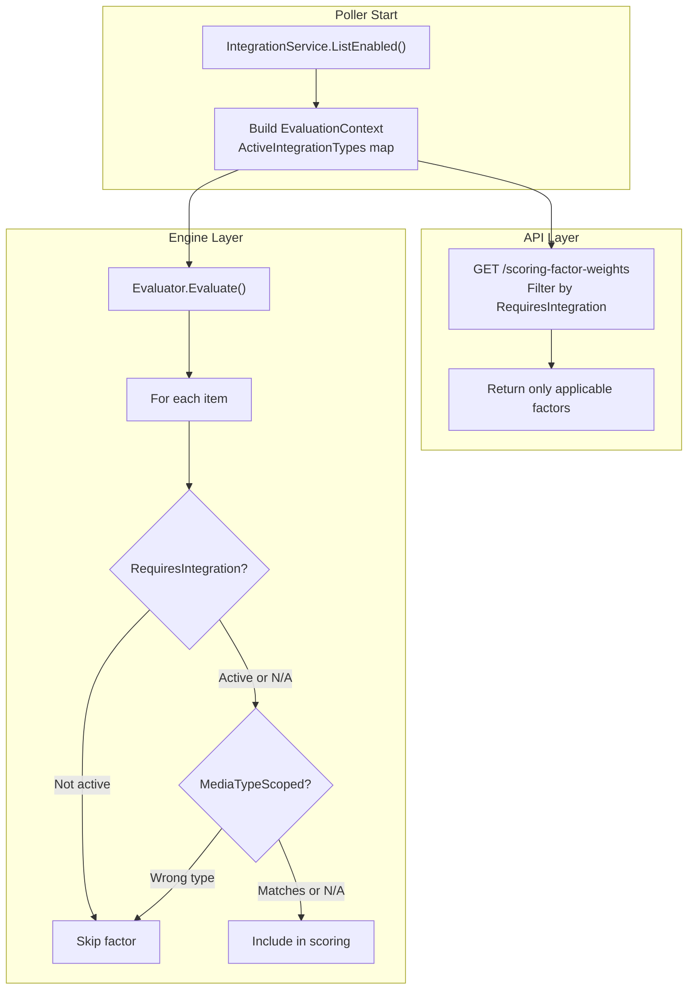

# Scoring Factor Applicability

> **Status:** ✅ Complete
> **Created:** 2026-03-24
> **Branch:** `fix/factor-applicability` (from `main`)
> **Closes:** #6, #7
> **Reported by:** @tomislavf (both issues)

## Problem

The scoring engine applies all 7 factors to every item regardless of whether the factor's data source is configured or whether the factor is semantically meaningful for that item's media type.

**Issue #6 — Request Popularity without Seerr:** [`RequestPopularityFactor.Calculate()`](../../backend/internal/engine/factors.go:254) returns `0.5` for every item when Seerr isn't connected (because `IsRequested` is always `false`). This constant value consumes weight budget without differentiating between items. With default weights, it's 2/38 ≈ 5.3% of every score being meaningless noise. Users who increase the weight amplify the distortion.

**Issue #7 — Series Status on movies:** [`SeriesStatusFactor.Calculate()`](../../backend/internal/engine/factors.go:221) returns `0.5` for all movies (Radarr items have no `SeriesStatus`). The factor's `0.5` constant pollutes movie scores identically to #6, and the UI confusingly shows "Series Status: 0.50" in movie score breakdowns. With default weights, 3/38 ≈ 7.9% of every movie's score is noise.

**Combined impact for a Radarr-only user without Seerr:** ~13.2% of every score is constant noise from two inapplicable factors, compressing the effective scoring resolution and reducing differentiation between items.

## Solution

Make scoring factors self-aware about when they apply. Inapplicable factors are:
1. **Excluded from the engine's scoring loop** — their weight is removed from normalization and their contribution is zero
2. **Hidden from the factor weights API** — users only see factors that are currently active
3. **Hidden from score breakdowns** — no "Series Status: 0.50" on movies

Additionally, rename factor labels to be media-agnostic (video, music, books) rather than video-centric.

No schema changes. No per-integration weight customization. The global weight model is preserved.

## Design

### Two Optional Interfaces

Add two optional capability interfaces to the [`ScoringFactor`](../../backend/internal/engine/factors.go:19) system. Factors that don't implement them are always applicable (backward compatible).

```go
// RequiresIntegration is optionally implemented by scoring factors that
// depend on a specific enrichment integration being connected. When the
// required integration type is absent, the factor is excluded from scoring
// and hidden from the factor weights API.
type RequiresIntegration interface {
    RequiredIntegrationType() integrations.IntegrationType
}

// MediaTypeScoped is optionally implemented by scoring factors that are
// only meaningful for certain media types. For items of non-applicable
// types, the factor is skipped per-item and its weight excluded from
// that item's normalization.
type MediaTypeScoped interface {
    ApplicableMediaTypes() []integrations.MediaType
}
```

### Factor Implementations

Only two factors need these interfaces:

```go
// RequestPopularityFactor — requires Seerr
func (f *RequestPopularityFactor) RequiredIntegrationType() integrations.IntegrationType {
    return integrations.IntegrationTypeSeerr
}

// SeriesStatusFactor — only for TV content
func (f *SeriesStatusFactor) ApplicableMediaTypes() []integrations.MediaType {
    return []integrations.MediaType{integrations.MediaTypeShow, integrations.MediaTypeSeason}
}
```

All other factors (Play History, Last Played, File Size, Rating, Time in Library) apply universally and don't implement either interface.

### Factor Label Renames

The current factor names are video-centric ("Watch History", "Last Watched") and don't make sense for Lidarr (music) or Readarr (books). Rename to media-agnostic labels:

| Current Name | New Name | Rationale |
|-------------|----------|-----------|
| Watch History | **Play History** | "Play" works for video (plays = watches), music (plays = listens), and books (plays = reads) |
| Last Watched | **Last Played** | Same rationale — media-agnostic |
| Series Status | **Show Status** | Users say "show", not "series". Sonarr's "series" is internal API terminology. Factor is scoped to TV via `MediaTypeScoped`. |

The `Key()` values remain unchanged (`watch_history`, `last_watched`, `series_status`) — these are DB keys in the `scoring_factor_weights` table and must not change.

Updated descriptions:

| Factor | New Description |
|--------|----------------|
| `watch_history` | "Unplayed items score higher for deletion. More plays = more protected." |
| `last_watched` | "Media not played in a long time scores higher for deletion." |
| `series_status` | "Ended or canceled shows score higher since no new episodes are expected." (unchanged — already correct) |

### EvaluationContext

A lightweight context struct carries the set of active integration types through the evaluation pipeline:

```go
type EvaluationContext struct {
    ActiveIntegrationTypes map[integrations.IntegrationType]bool
}

func (ctx *EvaluationContext) HasIntegrationType(t integrations.IntegrationType) bool {
    return ctx.ActiveIntegrationTypes[t]
}
```

Built from the enabled integrations at the start of each poll cycle and passed to the evaluator.

### Updated calculateScore

[`calculateScore()`](../../backend/internal/engine/score.go:90) gains an applicability check. Inapplicable factors are excluded from both the weight normalization denominator and the scoring loop:

```go
func isFactorApplicable(f ScoringFactor, item integrations.MediaItem, ctx *EvaluationContext) bool {
    if ri, ok := f.(RequiresIntegration); ok {
        if !ctx.HasIntegrationType(ri.RequiredIntegrationType()) {
            return false
        }
    }
    if mts, ok := f.(MediaTypeScoped); ok {
        typeMatch := false
        for _, mt := range mts.ApplicableMediaTypes() {
            if item.Type == mt {
                typeMatch = true
                break
            }
        }
        if !typeMatch {
            return false
        }
    }
    return true
}
```

The weight normalization loop in `calculateScore()` (currently at line 93) changes from:

```go
for _, f := range factors {
    totalWeight += float64(weights[f.Key()])
}
```

to:

```go
for _, f := range factors {
    if !isFactorApplicable(f, item, ctx) {
        continue
    }
    totalWeight += float64(weights[f.Key()])
}
```

And the scoring loop (currently at line 104) gains the same check.

### Factor Weights API Filtering

The [`GET /api/v1/scoring-factor-weights`](../../backend/routes/factorweights.go:33) handler currently iterates all `DefaultFactors()`. It will be updated to query enabled integrations via `reg.Integration.ListEnabled()`, determine which integration types are active, and filter out factors whose `RequiredIntegrationType()` is not active.

`MediaTypeScoped` is NOT filtered at the API level — it's a per-item runtime check. Show Status still appears in the weight sliders when Sonarr is configured, even though it won't apply to Radarr items at scoring time. This is correct: the user needs to be able to set the weight for TV content.

Summary of what the API returns based on integration configuration:

| Configuration | Factors Returned | Count |
|---------------|-----------------|-------|
| Only Radarr | Play History, Last Played, File Size, Rating, Time in Library | 5 |
| Radarr + Seerr | Above + Request Popularity | 6 |
| Sonarr + Radarr | Play History, Last Played, File Size, Rating, Time in Library, Show Status | 6 |
| Sonarr + Radarr + Seerr | All 7 | 7 |

### Data Flow



### Signature Changes

The evaluation chain needs the context threaded through:

1. **`EvaluateMedia()`** — add `ctx *EvaluationContext` parameter
2. **`calculateScore()`** — add `ctx *EvaluationContext` parameter
3. **`Evaluator.Evaluate()`** — add `ctx *EvaluationContext` parameter
4. **Poller's `evaluateAndCleanDisk()`** — build context and pass it
5. **`PreviewService`** — build context from `IntegrationLister.ListEnabled()` and pass it

### Frontend Changes

#### RuleWeightEditor.vue

[`RuleWeightEditor.vue`](../../frontend/app/components/rules/RuleWeightEditor.vue:55) already dynamically renders sliders from the `factors` prop returned by the API. When the API returns fewer factors, the sliders automatically update — **no template changes needed**.

However, the **presets** (lines 111-159) hardcode all 7 factor keys. Presets must be updated to only include keys that exist in the current `factors` list. The `applyPreset` function and `isActivePreset` comparison should filter preset values to only include keys present in the API response:

```typescript
function applyPreset(values: Record<string, number>) {
  // Only emit keys that exist in the current factor set
  const filtered = Object.fromEntries(
    Object.entries(values).filter(([key]) => props.factors.some(f => f.key === key))
  );
  emit('apply-preset', filtered);
}
```

The `isActivePreset` check at line 170 already handles missing keys gracefully (returns `true` for keys not in factors), but should be inverted: only compare keys that exist in both the preset AND the current factors.

#### ScoreBreakdown.vue

[`ScoreBreakdown.vue`](../../frontend/app/components/ScoreBreakdown.vue:132) has hardcoded `FACTOR_COLORS` and `FACTOR_ABBRS` maps. These need updating for the renamed factors and the new Request Popularity factor:

```typescript
const FACTOR_COLORS: Record<string, string> = {
  'Play History': '#8b5cf6',
  'Last Played': '#3b82f6',
  'File Size': '#f59e0b',
  'Rating': '#10b981',
  'Time in Library': '#f97316',
  'Show Status': '#ec4899',
  'Request Popularity': '#06b6d4',
};

const FACTOR_ABBRS: Record<string, string> = {
  'Play History': 'P:',
  'Last Played': 'LP:',
  'File Size': 'S:',
  'Rating': 'Rt:',
  'Time in Library': 'A:',
  'Show Status': 'Sh:',
  'Request Popularity': 'Rq:',
};
```

No legacy entries needed — old audit logs with previous factor names will render with fallback gray bars and auto-generated abbreviations, which is acceptable for a young project with 30-day audit log retention.

No other frontend changes needed — the score breakdown component renders whatever factors the API returns per item.

## Affected Files

### Phase 1: Backend — Optional Interfaces + EvaluationContext + Label Renames

- **`internal/engine/factors.go`** — Add `RequiresIntegration` and `MediaTypeScoped` interfaces. Implement `RequiredIntegrationType()` on `RequestPopularityFactor` and `ApplicableMediaTypes()` on `SeriesStatusFactor`. Add `EvaluationContext` struct and `isFactorApplicable()` helper. Rename factor `Name()` and `Description()` returns:
  - `WatchHistoryFactor.Name()`: "Watch History" → "Play History"
  - `WatchHistoryFactor.Description()`: "Unwatched items..." → "Unplayed items..."
  - `RecencyFactor.Name()`: "Last Watched" → "Last Played"
  - `RecencyFactor.Description()`: "Media not watched..." → "Media not played..."
  - `SeriesStatusFactor.Name()`: "Series Status" → "Show Status"

### Phase 2: Backend — Engine Scoring Changes

- **`internal/engine/score.go`** — Update `EvaluateMedia()` and `calculateScore()` signatures to accept `*EvaluationContext`. Add applicability filtering in the weight normalization and scoring loops.
- **`internal/engine/evaluator.go`** — Update `Evaluator.Evaluate()` signature to accept `*EvaluationContext` and pass it through.

### Phase 3: Backend — Poller + Preview Integration

- **`internal/poller/evaluate.go`** — Build `EvaluationContext` from the integration registry's active types and pass it to the evaluator.
- **`internal/services/preview.go`** — Build `EvaluationContext` from `IntegrationLister.ListEnabled()` and pass it to the evaluator.

### Phase 4: Backend — Factor Weights API Filtering

- **`routes/factorweights.go`** — In the GET handler, query `reg.Integration.ListEnabled()` to determine active integration types. Filter `DefaultFactors()` to exclude factors whose `RequiredIntegrationType()` is not active. Return only applicable factors.

### Phase 5: Backend Tests

- **`internal/engine/factors_test.go`** — Test `RequiredIntegrationType()` and `ApplicableMediaTypes()` return correct values. Test that factors not implementing these interfaces are always applicable. Verify renamed `Name()` and `Description()` strings.
- **`internal/engine/score_test.go`** — Test that:
  - `RequestPopularityFactor` is excluded when Seerr is not in the context
  - `SeriesStatusFactor` is excluded for movie items
  - Excluded factors' weights don't participate in normalization
  - Scores differ meaningfully when inapplicable factors are excluded vs included
- **`routes/factorweights_test.go`** — Test that the API response excludes `request_popularity` when no Seerr is enabled, and excludes `series_status` when no Sonarr is enabled.

### Phase 6: Frontend

- **`app/components/rules/RuleWeightEditor.vue`** — Update preset application logic to filter preset values to only include keys present in the current factor list. Update `isActivePreset` to only compare keys that exist in both preset and factors.
- **`app/components/ScoreBreakdown.vue`** — Replace `FACTOR_COLORS` and `FACTOR_ABBRS` maps with new factor names (Play History, Last Played, Show Status, Request Popularity). No legacy entries — old audit logs self-prune within 30 days.

### Phase 7: Validation + CI

- Run `make ci` to verify all lint, test, and security checks pass.

## Commit Message

The final commit must attribute the reporter for both issues:

```
fix(engine): exclude inapplicable scoring factors from evaluation

Add RequiresIntegration and MediaTypeScoped optional interfaces so
factors self-declare when they apply. RequestPopularityFactor requires
Seerr; SeriesStatusFactor only applies to show/season items. The
engine excludes inapplicable factors from both weight normalization
and scoring, and the factor weights API hides them from the UI.

Also renames factor labels to be media-agnostic: Watch History → Play
History, Last Watched → Last Played, Series Status → Show Status.

Reported-by: @tomislavf
Closes #6
Closes #7
```

## Execution Order

1. Add optional interfaces, `EvaluationContext`, and label renames to `factors.go`
2. Update `score.go` and `evaluator.go` with context threading and applicability checks
3. Update poller and preview service to build and pass context
4. Update factor weights API to filter response
5. Backend tests
6. Frontend preset filtering + color/abbreviation map updates
7. `make ci` validation

## Edge Cases

1. **All factors inapplicable** — If somehow all factors are excluded (e.g., only enrichment integrations configured, no *arrs), `calculateScore()` returns `0.0` with reason "All preference weights are zero" (existing behavior at line 97). This is correct — no media sources means no items to score.

2. **Weight set to 0 vs factor inapplicable** — A factor with weight 0 is still "applicable" but contributes nothing. An inapplicable factor is excluded entirely from normalization. Both result in zero contribution, but the normalization denominators differ. This is intentional: weight 0 is a user choice ("I don't care about this"), while inapplicability is a system constraint ("this data doesn't exist").

3. **Adding/removing Seerr** — When Seerr is added, the next poll cycle's `EvaluationContext` will include it, and `RequestPopularityFactor` will start participating in scoring. The factor weights API will start returning `request_popularity`. The DB row for `request_popularity` in `scoring_factor_weights` is preserved from initial seeding — the user's weight is not lost. When Seerr is removed, the factor disappears from the API response and scoring, but the DB row remains.

4. **Preview service** — The preview service at [`PreviewService`](../../backend/internal/services/preview.go:18) calls the same evaluator. It must build its own `EvaluationContext` from `IntegrationLister.ListEnabled()` to ensure preview results match what the poller would produce.

5. **Score detail persistence** — The [`ScoreFactor` JSON in approval queue items](../../backend/internal/engine/score.go:15) and audit logs will contain the new factor names (Play History, Last Played, Show Status). Old audit logs with the old names (Watch History, Last Watched, Series Status) will render with fallback gray bars and auto-generated abbreviations — acceptable since audit logs auto-prune (default 30 days) and the project is less than a month old.

6. **Preset compatibility** — When a preset includes keys for inapplicable factors (e.g., "Balanced" includes `series_status` but no Sonarr is configured), the filtered preset application only sends keys that exist in the API response. The preset matching logic considers the preset "active" if all *visible* factor weights match, ignoring invisible factor keys.
